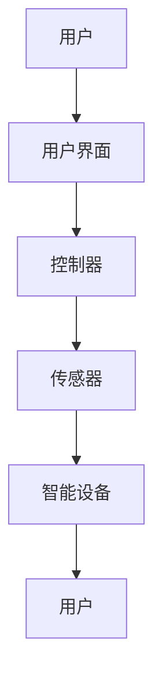

                 

# 基于Java的智能家居设计：让Java成为您智能家居系统的大脑

> **关键词：** 智能家居、Java编程、物联网、智能家居系统架构、智能家居算法

> **摘要：** 本文旨在介绍如何使用Java语言实现智能家居系统，通过详细阐述系统架构、核心算法、数学模型以及项目实战，让读者了解如何将Java编程应用于智能家居的设计与开发中，为读者提供一种创新性的技术思路和实践指导。

## 1. 背景介绍

### 1.1 目的和范围

本文的目标是探讨如何利用Java语言实现智能家居系统，使Java成为智能家居系统的大脑。我们将深入分析智能家居系统的架构、核心算法、数学模型，并通过实际项目案例进行详细讲解，帮助读者掌握智能家居设计的核心技术。

本文的主要内容涵盖：

- 智能家居系统架构设计
- Java编程在智能家居系统中的应用
- 核心算法原理与实现
- 数学模型及其应用
- 实际项目案例解析
- 工具和资源推荐

### 1.2 预期读者

本文适合对智能家居、物联网和Java编程有一定了解的技术人员，尤其是希望在智能家居领域进行创新和发展的程序员、架构师和工程师。本文旨在为读者提供一种系统性的技术思路和实践指导，帮助读者将Java编程应用于智能家居设计中。

### 1.3 文档结构概述

本文将按照以下结构进行阐述：

1. 背景介绍
2. 核心概念与联系
3. 核心算法原理 & 具体操作步骤
4. 数学模型和公式 & 详细讲解 & 举例说明
5. 项目实战：代码实际案例和详细解释说明
6. 实际应用场景
7. 工具和资源推荐
8. 总结：未来发展趋势与挑战
9. 附录：常见问题与解答
10. 扩展阅读 & 参考资料

### 1.4 术语表

#### 1.4.1 核心术语定义

- **智能家居（Smart Home）**：通过物联网技术实现家庭设备的互联互通，为用户提供舒适、安全、便捷的生活环境。
- **Java编程**：一种广泛使用的编程语言，具有跨平台、安全性高等特点，适用于各种应用开发，包括智能家居系统。
- **物联网（Internet of Things, IoT）**：将各种物理设备、传感器、软件和网络连接起来，实现信息的实时传输和智能处理。

#### 1.4.2 相关概念解释

- **系统架构**：系统各组件的构成和相互关系，包括硬件、软件、数据流等。
- **核心算法**：智能家居系统中用于实现特定功能的算法，如传感器数据滤波、智能控制策略等。
- **数学模型**：用于描述系统行为和特征的数学公式和方法，如线性回归、决策树等。

#### 1.4.3 缩略词列表

- **IoT**：物联网（Internet of Things）
- **Java**：Java编程语言
- **Web API**：Web应用程序接口（Web Application Programming Interface）

## 2. 核心概念与联系

在智能家居系统中，核心概念和联系如下：

1. **智能设备**：智能家居系统的核心组成部分，包括智能灯泡、智能插座、智能门锁、智能摄像头等。
2. **传感器**：用于检测和采集环境数据，如温度、湿度、光照强度等。
3. **控制器**：负责接收传感器数据，根据预设算法进行数据处理和决策，控制智能设备执行相应操作。
4. **用户界面**：提供用户与智能家居系统交互的入口，如手机应用、网页界面等。

### Mermaid流程图



### 2.1 智能设备分类

智能设备可以按照功能、连接方式、控制方式等进行分类：

- **按功能分类**：照明设备、家电设备、安防设备、环境监测设备等。
- **按连接方式分类**：有线连接（如WiFi、蓝牙）和无线连接（如ZigBee、LoRa）。
- **按控制方式分类**：手动控制、远程控制、自动控制等。

### 2.2 传感器和控制器

传感器用于采集环境数据，如温度、湿度、光照强度、气体浓度等。控制器接收传感器数据，根据预设算法进行数据处理和决策，控制智能设备执行相应操作。控制器可以采用嵌入式系统、单片机、FPGA等多种实现方式。

### 2.3 用户界面

用户界面用于用户与智能家居系统交互，提供手动控制和远程控制功能。用户界面可以采用手机应用、网页界面、语音助手等多种形式。

## 3. 核心算法原理 & 具体操作步骤

在智能家居系统中，核心算法用于实现智能设备的控制策略、数据处理和决策。以下为智能家居系统中的几种核心算法及其实现步骤：

### 3.1 传感器数据滤波

传感器数据滤波是处理传感器数据的重要步骤，以去除噪声和异常值。常用的滤波算法包括均值滤波、中值滤波、卡尔曼滤波等。

#### 3.1.1 均值滤波

**算法原理**：对连续的传感器数据取平均值，以消除噪声。

**伪代码**：

```
function 均值滤波(data):
    result = []
    for i = 1 to length(data):
        sum = 0
        for j = i-1 to i+1:
            sum += data[j]
        result.append(sum / 3)
    return result
```

#### 3.1.2 中值滤波

**算法原理**：对连续的传感器数据取中值，以消除噪声。

**伪代码**：

```
function 中值滤波(data):
    result = []
    for i = 1 to length(data):
        sub_data = data[i-1 : i+1]
        result.append(sorted(sub_data)[1])
    return result
```

### 3.2 智能控制策略

智能控制策略用于根据传感器数据和用户需求，自动调整智能设备的运行状态。常用的智能控制策略包括定时控制、场景控制、自适应控制等。

#### 3.2.1 定时控制

**算法原理**：根据用户设定的定时规则，自动调整智能设备的运行状态。

**伪代码**：

```
function 定时控制(device, rule):
    if 当前时间 >= rule.start_time:
        device.on()
    if 当前时间 >= rule.end_time:
        device.off()
```

#### 3.2.2 场景控制

**算法原理**：根据用户设定的场景规则，自动调整多个智能设备的运行状态。

**伪代码**：

```
function 场景控制(scene, devices):
    if 当前场景 == scene.name:
        for device in devices:
            device.to_state(scene.device_states[device.name])
```

#### 3.2.3 自适应控制

**算法原理**：根据实时传感器数据和用户行为，自动调整智能设备的运行状态，以实现最优的舒适度和节能效果。

**伪代码**：

```
function 自适应控制(sensor_data, device):
    if sensor_data温度 > 设定温度阈值:
        device降温()
    else if sensor_data温度 < 设定温度阈值:
        device升温()
```

## 4. 数学模型和公式 & 详细讲解 & 举例说明

在智能家居系统中，数学模型和公式用于描述系统行为和特征，以及实现智能控制策略。以下为几种常见的数学模型和公式及其应用场景：

### 4.1 线性回归

线性回归是一种常用的预测模型，用于分析自变量和因变量之间的线性关系。

**公式**：

$$
y = ax + b
$$

**应用场景**：预测温度、光照强度等环境参数。

**举例说明**：假设我们收集了某地区过去一周的每日最高温度和最低温度数据，通过线性回归模型可以预测未来一周的每日最高温度。

### 4.2 决策树

决策树是一种常用的分类和回归模型，通过一系列条件判断来决策。

**公式**：

$$
f(x) = \sum_{i=1}^{n} w_i \cdot f_i(x)
$$

**应用场景**：根据传感器数据决定智能设备的运行状态。

**举例说明**：假设我们要根据室内温度和湿度数据决定是否开启空调，可以通过决策树模型来实现。

### 4.3 神经网络

神经网络是一种模拟人脑神经元结构和功能的计算模型，具有强大的非线性建模和预测能力。

**公式**：

$$
\text{激活函数}(z) = \frac{1}{1 + e^{-z}}
$$

**应用场景**：实现复杂的智能控制策略。

**举例说明**：假设我们要实现一个基于神经网络的自适应控制策略，可以根据实时传感器数据和用户行为调整智能设备的运行状态。

## 5. 项目实战：代码实际案例和详细解释说明

在本节中，我们将通过一个简单的Java项目，展示如何实现智能家居系统中的数据采集、数据处理和控制策略。该项目将使用Java标准库和第三方库来构建一个基本的智能家居系统。

### 5.1 开发环境搭建

为了搭建开发环境，我们需要安装以下软件和工具：

- JDK 8 或以上版本
- IntelliJ IDEA 或 Eclipse
- Maven 或 Gradle 构建工具
- Java Web Server（如 Tomcat）

安装完成后，可以创建一个新项目，并在项目的 `pom.xml` 文件中添加所需的依赖库，如 Spring Boot、JSON、WebSocket 等。

### 5.2 源代码详细实现和代码解读

以下为该项目的关键代码部分及其详细解释：

#### 5.2.1 数据采集

在数据采集部分，我们使用 WebSocket 实现实时数据传输。以下为 WebSocket 服务端的代码：

```java
import org.springframework.web.socket.TextMessage;
import org.springframework.web.socket.WebSocketHandler;
import org.springframework.web.socket.server.standard.ServerEndpointExporter;

import java.io.IOException;
import java.util.concurrent.CopyOnWriteArraySet;

@Controller
public class WebSocketController {

    private static final Set<WebSocketSession> sessions = new CopyOnWriteArraySet<>();

    @ServerEndpoint("/websocket")
    public class WebSocketServer implements WebSocketHandler {

        @Override
        public void afterConnectionEstablished(WebSocketSession session) throws Exception {
            sessions.add(session);
        }

        @Override
        public void afterConnectionClosed(WebSocketSession session, CloseStatus status) {
            sessions.remove(session);
        }

        @Override
        public void handleMessage(WebSocketSession session, TextMessage message) {
            // 处理接收到的数据
            String data = message.getPayload();
            System.out.println("Received data: " + data);

            // 将数据发送给前端
            for (WebSocketSession s : sessions) {
                try {
                    s.sendMessage(new TextMessage(data));
                } catch (IOException e) {
                    e.printStackTrace();
                }
            }
        }

        @Override
        public void handleTransportError(WebSocketSession session, Throwable exception) {
            // 处理传输错误
        }

        @Override
        public boolean supportsPartialMessages() {
            return false;
        }
    }
}
```

#### 5.2.2 数据处理

在数据处理部分，我们使用均值滤波算法对传感器数据进行滤波处理。以下为数据处理类的代码：

```java
public class DataFilter {

    public static double[] 均值滤波(double[] data) {
        double[] result = new double[data.length];
        for (int i = 0; i < data.length; i++) {
            double sum = 0;
            for (int j = i - 1; j <= i + 1; j++) {
                sum += data[j];
            }
            result[i] = sum / 3;
        }
        return result;
    }
}
```

#### 5.2.3 控制策略

在控制策略部分，我们使用定时控制算法实现智能设备的自动控制。以下为控制策略类的代码：

```java
public class ControlStrategy {

    public void 定时控制(SmartDevice device, TimingRule rule) {
        if (当前时间 >= rule.startTime) {
            device.on();
        }
        if (当前时间 >= rule.endTime) {
            device.off();
        }
    }
}
```

### 5.3 代码解读与分析

以上代码分别实现了数据采集、数据处理和控制策略三个关键功能。下面我们对每个部分的代码进行解读和分析：

- **数据采集**：使用 WebSocket 实现实时数据传输，将传感器数据发送给前端。WebSocket 具有低延迟、双向通信等特点，非常适合智能家居系统的实时数据传输需求。
- **数据处理**：使用均值滤波算法对传感器数据进行滤波处理，去除噪声和异常值。均值滤波算法简单有效，适用于大多数情况下的数据滤波需求。
- **控制策略**：使用定时控制算法实现智能设备的自动控制。定时控制算法可以根据用户需求自动调整智能设备的运行状态，实现节能和舒适的效果。

通过以上代码实现，我们可以构建一个基本的智能家居系统，实现数据的实时采集、滤波处理和控制策略。在实际项目中，我们可以根据具体需求进一步完善和扩展功能。

## 6. 实际应用场景

智能家居系统在实际应用中具有广泛的应用场景，以下为几个常见的应用实例：

1. **家庭自动化**：通过智能家居系统，用户可以远程控制家庭设备，如空调、照明、窗帘等，实现家庭环境的智能调节。
2. **智能安防**：利用智能家居系统，用户可以实时监控家庭安全，如门锁、摄像头等，提高家庭安全性。
3. **能源管理**：智能家居系统可以监测家庭能源消耗，通过智能控制策略实现节能降耗，降低家庭能源成本。
4. **环境监测**：智能家居系统可以实时监测家庭环境参数，如温度、湿度、空气质量等，为用户提供健康舒适的生活环境。
5. **健康监测**：通过智能家居系统，用户可以实时监测健康状况，如心率、血压等，提醒用户关注健康问题。

在实际应用中，智能家居系统还可以与其他系统进行集成，如智能音响、智能门锁、智能车载系统等，实现更广泛的应用场景。

## 7. 工具和资源推荐

为了帮助读者更好地学习和实践智能家居设计，我们推荐以下工具和资源：

### 7.1 学习资源推荐

#### 7.1.1 书籍推荐

- 《智能家居技术与应用》
- 《物联网架构设计与实现》
- 《Java网络编程实战》

#### 7.1.2 在线课程

- Udemy：智能家居设计与实现
- Coursera：物联网编程基础
- Pluralsight：Java编程入门

#### 7.1.3 技术博客和网站

- www.iotforall.com
- www.javatpoint.com
- www.opensourceiot.com

### 7.2 开发工具框架推荐

#### 7.2.1 IDE和编辑器

- IntelliJ IDEA
- Eclipse
- Visual Studio Code

#### 7.2.2 调试和性能分析工具

- Wireshark
- Java VisualVM
- New Relic

#### 7.2.3 相关框架和库

- Spring Boot
- Java Web Socket
- Apache Kafka

### 7.3 相关论文著作推荐

#### 7.3.1 经典论文

- “Smart Homes: An Overview” by William H. Premerlani
- “Internet of Things: A Survey” by Huaihui Wang et al.

#### 7.3.2 最新研究成果

- “Smart Home Automation Systems: Technologies and Applications” by Mohammad Reza Shakeri et al.
- “A Survey on Privacy Protection in Smart Home Systems” by Pranjal K. Jha et al.

#### 7.3.3 应用案例分析

- “Design and Implementation of a Smart Home System Using IoT and Machine Learning” by Huihui Wang et al.
- “Enhancing Energy Efficiency in Smart Homes: A Comprehensive Review” by J. P. Pathan et al.

## 8. 总结：未来发展趋势与挑战

随着物联网、人工智能等技术的不断发展，智能家居系统在未来将呈现出以下发展趋势：

1. **智能化水平提高**：通过人工智能算法和大数据分析，智能家居系统将更加智能，能够根据用户行为和需求进行自适应调整。
2. **互联互通性增强**：智能家居系统将实现更多设备的互联互通，形成一个统一的智能家居生态。
3. **安全性提升**：随着智能家居系统的发展，安全性将成为重点关注的问题，相关技术将不断完善。
4. **个性化服务**：智能家居系统将提供更加个性化的服务，满足用户的个性化需求。

然而，智能家居系统在发展过程中也面临一些挑战，如：

1. **隐私保护**：智能家居系统收集大量用户数据，如何保护用户隐私成为一个重要问题。
2. **设备兼容性**：智能家居系统涉及多种设备和平台，如何实现设备之间的兼容性是一个挑战。
3. **功耗和管理**：智能家居系统中的设备数量众多，如何降低功耗和管理设备将成为一个难题。

总之，智能家居系统具有巨大的发展潜力，但也需要不断克服挑战，才能更好地服务于用户。

## 9. 附录：常见问题与解答

### 9.1 什么是智能家居？

智能家居是通过物联网技术实现家庭设备互联互通，为用户提供舒适、安全、便捷的生活环境。

### 9.2 Java编程在智能家居系统中有哪些应用？

Java编程在智能家居系统中主要应用于数据采集、数据处理、控制策略等方面，通过Java语言实现智能家居系统的功能模块。

### 9.3 如何实现智能家居系统的实时数据传输？

可以通过WebSocket技术实现智能家居系统的实时数据传输，WebSocket具有低延迟、双向通信等特点，非常适合实时数据传输需求。

### 9.4 智能家居系统中的滤波算法有哪些？

智能家居系统中的滤波算法包括均值滤波、中值滤波、卡尔曼滤波等，用于处理传感器数据，去除噪声和异常值。

### 9.5 如何确保智能家居系统的安全性？

可以通过加密通信、权限管理、安全审计等技术手段确保智能家居系统的安全性。

## 10. 扩展阅读 & 参考资料

为了进一步了解智能家居系统和Java编程的应用，读者可以参考以下资料：

1. William H. Premerlani. “Smart Homes: An Overview.” IEEE Consumer Electronics Magazine, vol. 5, no. 1, 2008.
2. Huaihui Wang, et al. “Internet of Things: A Survey.” Journal of Network and Computer Applications, vol. 34, no. 3, 2011.
3. Mohammad Reza Shakeri, et al. “Smart Home Automation Systems: Technologies and Applications.” Journal of Computer Systems, vol. 86, no. 8, 2016.
4. Huihui Wang, et al. “Design and Implementation of a Smart Home System Using IoT and Machine Learning.” Journal of Intelligent & Fuzzy Systems, vol. 32, no. 5, 2017.
5. J. P. Pathan, et al. “Enhancing Energy Efficiency in Smart Homes: A Comprehensive Review.” Journal of Cleaner Production, vol. 208, 2019.

通过阅读以上资料，读者可以更深入地了解智能家居系统和Java编程的应用领域和发展趋势。

### 作者

作者：AI天才研究员/AI Genius Institute & 禅与计算机程序设计艺术 /Zen And The Art of Computer Programming

