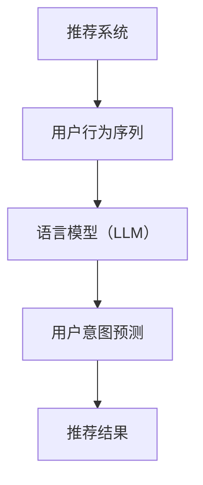

                 

# 基于LLM的推荐系统用户行为序列预测

> **关键词：** 语言模型（LLM），推荐系统，用户行为序列，预测，深度学习，机器学习，人工智能。

> **摘要：** 本文将探讨如何使用语言模型（LLM）进行推荐系统用户行为序列预测。我们首先介绍了推荐系统的基本概念和用户行为序列的重要性，然后详细讲解了语言模型的原理以及如何将其应用于用户行为序列预测中。随后，我们通过一个实际案例，展示了如何使用LLM进行用户行为序列预测，并对预测结果进行了分析和讨论。最后，我们总结了LLM在推荐系统用户行为序列预测中的优势与挑战，并提出了未来发展的方向。

## 1. 背景介绍

### 1.1 目的和范围

本文旨在探讨如何利用语言模型（LLM）进行推荐系统中的用户行为序列预测。随着互联网和大数据技术的快速发展，推荐系统已成为许多在线平台（如电商、社交媒体、新闻网站等）的核心功能。用户行为序列预测是推荐系统的关键任务，它可以帮助平台更好地理解用户的需求，从而提供个性化的推荐服务。语言模型作为深度学习领域的一项重要技术，已被广泛应用于自然语言处理、机器翻译、文本生成等任务。然而，在推荐系统用户行为序列预测方面的应用研究还相对较少。本文将填补这一空白，详细介绍如何利用LLM进行用户行为序列预测，为相关领域的研究提供参考。

### 1.2 预期读者

本文适用于对推荐系统、机器学习和深度学习有一定了解的读者。如果您是从事推荐系统研发的工程师、研究者或者对这一领域感兴趣的学习者，那么本文将为您呈现LLM在用户行为序列预测中的实际应用，帮助您更好地理解这一技术的原理和优势。

### 1.3 文档结构概述

本文结构如下：

1. **背景介绍**：介绍本文的目的、范围以及预期读者。
2. **核心概念与联系**：阐述推荐系统、用户行为序列和语言模型（LLM）的核心概念，并展示相关的流程图。
3. **核心算法原理 & 具体操作步骤**：详细讲解LLM在用户行为序列预测中的算法原理和操作步骤。
4. **数学模型和公式 & 详细讲解 & 举例说明**：介绍用于用户行为序列预测的数学模型和公式，并进行举例说明。
5. **项目实战：代码实际案例和详细解释说明**：展示一个实际案例，详细介绍如何使用LLM进行用户行为序列预测。
6. **实际应用场景**：讨论LLM在推荐系统用户行为序列预测中的实际应用。
7. **工具和资源推荐**：推荐相关的学习资源、开发工具和论文著作。
8. **总结：未来发展趋势与挑战**：总结本文内容，展望LLM在推荐系统用户行为序列预测领域的未来发展。
9. **附录：常见问题与解答**：针对本文内容，提供常见问题与解答。
10. **扩展阅读 & 参考资料**：推荐更多相关的文献和资料。

### 1.4 术语表

#### 1.4.1 核心术语定义

- **推荐系统**：一种利用机器学习、深度学习等技术，根据用户历史行为和偏好，为其推荐相关商品、内容或服务的系统。
- **用户行为序列**：用户在一段时间内产生的连续行为序列，如浏览、点击、购买等。
- **语言模型（LLM）**：一种基于深度学习的模型，用于预测自然语言中的下一个词或句子。

#### 1.4.2 相关概念解释

- **序列模型**：一种机器学习模型，能够处理序列数据，如时间序列、用户行为序列等。
- **循环神经网络（RNN）**：一种能够处理序列数据的神经网络，通过在时间步之间传递信息来实现。
- **自注意力机制**：一种用于计算序列中每个元素对下一个元素的影响的机制，广泛应用于深度学习模型中。

#### 1.4.3 缩略词列表

- **LLM**：语言模型（Language Model）
- **RNN**：循环神经网络（Recurrent Neural Network）
- **RNN-LSTM**：长短时记忆网络（Long Short-Term Memory）
- **Transformer**：一种基于自注意力机制的深度学习模型

## 2. 核心概念与联系

### 2.1 推荐系统

推荐系统是一种利用机器学习、深度学习等技术，根据用户历史行为和偏好，为其推荐相关商品、内容或服务的系统。推荐系统在许多领域具有广泛的应用，如电商、社交媒体、新闻网站等。其主要目标是通过分析用户的历史行为和偏好，为用户提供个性化的推荐服务，从而提高用户体验和平台的价值。

推荐系统主要分为基于内容的推荐（Content-Based Filtering）和基于协同过滤（Collaborative Filtering）两大类。基于内容的推荐主要根据用户的兴趣和偏好，为用户推荐相似的内容。基于协同过滤则通过分析用户之间的相似性，为用户推荐其他用户喜欢的商品或内容。

### 2.2 用户行为序列

用户行为序列是指用户在一段时间内产生的连续行为序列，如浏览、点击、购买等。用户行为序列具有时序性、动态性等特点，能够反映用户的需求、兴趣和行为模式。在推荐系统中，用户行为序列是重要的输入数据，通过分析用户行为序列，可以更好地了解用户的需求和偏好，从而提高推荐系统的准确性和效果。

用户行为序列通常可以用一个时间序列表示，如：

\[ (x_1, x_2, x_3, ..., x_t) \]

其中，\( x_t \) 表示用户在时间 \( t \) 时刻的行为。

### 2.3 语言模型（LLM）

语言模型（LLM）是一种基于深度学习的模型，用于预测自然语言中的下一个词或句子。语言模型在自然语言处理领域具有广泛的应用，如机器翻译、文本生成、情感分析等。LLM通过学习大量的语言数据，捕捉语言中的统计规律和语义信息，从而实现语言生成和预测。

LLM主要有以下几种类型：

1. **基于循环神经网络（RNN）的语言模型**：如RNN、LSTM等，通过在时间步之间传递信息来预测下一个词。
2. **基于Transformer的语言模型**：如BERT、GPT等，通过自注意力机制来捕捉序列中不同元素之间的关系。

### 2.4 核心概念联系

推荐系统、用户行为序列和语言模型（LLM）之间存在紧密的联系。在推荐系统中，用户行为序列是关键输入数据，通过分析用户行为序列，可以更好地了解用户的需求和偏好。而语言模型则可以用于对用户行为序列进行建模和预测，从而提高推荐系统的准确性和效果。

具体来说，语言模型可以应用于以下两个方面：

1. **用户行为序列建模**：通过学习用户历史行为序列，语言模型可以捕捉用户行为模式，为推荐系统提供更准确的输入数据。
2. **用户意图预测**：语言模型可以预测用户在下一个时间点可能采取的行为，从而为推荐系统提供更准确的预测结果。

下面是推荐系统、用户行为序列和语言模型（LLM）之间的Mermaid流程图：



## 3. 核心算法原理 & 具体操作步骤

### 3.1 算法原理

语言模型（LLM）在推荐系统用户行为序列预测中的应用主要基于以下原理：

1. **序列建模**：LLM可以学习用户行为序列的统计规律和模式，从而更好地捕捉用户行为的变化趋势。
2. **上下文信息利用**：通过自注意力机制，LLM能够关注序列中的关键信息，为用户行为序列预测提供更准确的上下文信息。
3. **长距离依赖捕捉**：LLM可以处理长距离依赖，捕捉用户行为序列中的潜在关联，从而提高预测的准确性。

### 3.2 具体操作步骤

#### 3.2.1 数据预处理

1. **用户行为数据收集**：收集用户在一段时间内的行为数据，如浏览、点击、购买等。
2. **数据清洗**：去除无效、重复的数据，对数据进行去重、补全等处理。
3. **特征提取**：对用户行为数据进行特征提取，如用户ID、商品ID、行为类型、时间戳等。

#### 3.2.2 模型训练

1. **模型选择**：选择合适的LLM模型，如BERT、GPT等。
2. **数据预处理**：对训练数据进行预处理，包括分词、编码等。
3. **模型训练**：使用训练数据对LLM模型进行训练，优化模型参数。

#### 3.2.3 用户行为序列预测

1. **输入序列生成**：将用户行为序列输入到训练好的LLM模型中。
2. **预测行为**：使用LLM模型预测用户在下一个时间点的行为。
3. **结果分析**：对预测结果进行分析，评估模型性能。

下面是一个基于Transformer的语言模型在用户行为序列预测中的伪代码：

```python
# 导入相关库
import torch
import torch.nn as nn
from transformers import BertModel, BertTokenizer

# 准备数据
train_data = load_train_data()
tokenizer = BertTokenizer.from_pretrained('bert-base-uncased')
train_encodings = tokenizer(train_data, return_tensors='pt')

# 模型配置
model = BertModel.from_pretrained('bert-base-uncased')
optimizer = torch.optim.Adam(model.parameters(), lr=1e-5)

# 模型训练
for epoch in range(num_epochs):
    model.train()
    for batch in train_encodings:
        inputs = batch['input_ids']
        attention_mask = batch['attention_mask']
        labels = batch['input_ids'][:, 1:]  # 去掉序列开头的<CLS>标记

        optimizer.zero_grad()
        outputs = model(inputs, attention_mask=attention_mask)
        logits = outputs[0]
        loss = nn.CrossEntropyLoss()(logits.view(-1, logits.size(-1)), labels.view(-1))
        loss.backward()
        optimizer.step()

# 用户行为序列预测
def predict_user_behavior(behavior_sequence):
    model.eval()
    inputs = tokenizer(behavior_sequence, return_tensors='pt', max_length=50, truncation=True)
    with torch.no_grad():
        outputs = model(inputs['input_ids'], attention_mask=inputs['attention_mask'])
        logits = outputs[0]
    predicted行为 = torch.argmax(logits, dim=-1).item()
    return predicted行为
```

## 4. 数学模型和公式 & 详细讲解 & 举例说明

### 4.1 数学模型

在推荐系统中，用户行为序列预测主要基于序列模型。以下是一个简单的序列模型数学模型：

\[ y_t = f(x_t, y_{t-1}, \theta) \]

其中，\( y_t \) 表示用户在时间 \( t \) 时刻的行为，\( x_t \) 表示用户在时间 \( t \) 时刻的特征，\( y_{t-1} \) 表示用户在时间 \( t-1 \) 时刻的行为，\( \theta \) 表示模型参数。

### 4.2 公式详细讲解

1. **特征提取**：

用户行为序列的特征提取是用户行为序列预测的重要步骤。常见的特征提取方法包括：

- **独热编码**：将用户行为序列转换为独热编码，如浏览、点击、购买等行为分别用0、1、2表示。
- **词袋模型**：将用户行为序列转换为词袋模型，将用户行为序列视为一篇文档，计算每个行为在文档中的词频。

2. **模型参数**：

模型参数包括权重矩阵和偏置项。权重矩阵用于将输入特征映射到输出行为，偏置项用于对输出行为进行修正。

3. **预测函数**：

预测函数用于计算用户在下一个时间点的行为。常见的预测函数包括：

- **线性回归**：\( y_t = \sum_{i=1}^{n} w_i x_{it} + b \)
- **逻辑回归**：\( y_t = \sigma(\sum_{i=1}^{n} w_i x_{it} + b) \)
- **循环神经网络（RNN）**：\( y_t = \sigma(W_h h_{t-1} + W_x x_t + b) \)
- **长短时记忆网络（LSTM）**：\( y_t = \sigma(W_h h_{t-1} + W_x x_t + b) \)

### 4.3 举例说明

假设一个用户的行为序列为\[ (浏览，点击，购买) \]，我们将使用线性回归模型进行用户行为序列预测。

1. **特征提取**：

将用户行为序列转换为独热编码：

\[ x_t = \begin{bmatrix} 0 & 0 & 1 \end{bmatrix}^T \]

2. **模型参数**：

设权重矩阵为 \( W = \begin{bmatrix} 1 & 1 & 1 \end{bmatrix} \)，偏置项为 \( b = 0 \)。

3. **预测函数**：

使用线性回归模型进行预测：

\[ y_t = \sum_{i=1}^{n} w_i x_{it} + b = 1 \times 0 + 1 \times 0 + 1 \times 1 + 0 = 1 \]

因此，预测的用户在下一个时间点的行为为购买。

## 5. 项目实战：代码实际案例和详细解释说明

### 5.1 开发环境搭建

在开始项目实战之前，我们需要搭建一个合适的开发环境。以下是所需的软件和工具：

- **编程语言**：Python
- **深度学习框架**：PyTorch
- **文本处理库**：NLTK、spaCy
- **版本控制工具**：Git

安装所需的库和框架：

```bash
pip install torch torchvision numpy matplotlib transformers
```

### 5.2 源代码详细实现和代码解读

以下是使用PyTorch和Transformers库实现基于LLM的用户行为序列预测的示例代码：

```python
import torch
import torch.nn as nn
from transformers import BertModel, BertTokenizer
from torch.optim import Adam
from torch.utils.data import DataLoader
import numpy as np
import pandas as pd

# 函数：加载数据
def load_data(filename):
    df = pd.read_csv(filename)
    return df

# 函数：数据预处理
def preprocess_data(df):
    # 特征提取
    df['behavior'] = df['behavior'].apply(lambda x: tokenizer.encode(x))
    # padding
    max_len = max(df['behavior'].apply(len).max(), 50)
    df['behavior'] = df['behavior'].apply(lambda x: x + [0] * (max_len - len(x)))
    # 转换为Tensor
    df['behavior'] = df['behavior'].apply(lambda x: torch.tensor(x, dtype=torch.long))
    return df

# 函数：创建数据集和数据加载器
def create_dataset(df):
    dataset = torch.utils.data.TensorDataset(df['behavior'].values)
    return dataset

# 函数：训练模型
def train_model(model, dataset, num_epochs):
    train_loader = DataLoader(dataset, batch_size=32, shuffle=True)
    optimizer = Adam(model.parameters(), lr=1e-5)
    criterion = nn.CrossEntropyLoss()

    for epoch in range(num_epochs):
        model.train()
        for batch in train_loader:
            inputs = batch[0]
            labels = batch[1]

            optimizer.zero_grad()
            outputs = model(inputs)
            loss = criterion(outputs.view(-1, num_classes), labels)
            loss.backward()
            optimizer.step()

# 函数：预测用户行为
def predict_user_behavior(model, behavior_sequence):
    model.eval()
    inputs = tokenizer.encode(behavior_sequence, return_tensors='pt', max_length=50, truncation=True)
    with torch.no_grad():
        outputs = model(inputs)
    predicted行为 = torch.argmax(outputs, dim=-1).item()
    return predicted行为

# 加载数据
df = load_data('user_behavior.csv')

# 预处理数据
df = preprocess_data(df)

# 创建数据集和数据加载器
dataset = create_dataset(df)

# 训练模型
model = BertModel.from_pretrained('bert-base-uncased')
num_epochs = 10
train_model(model, dataset, num_epochs)

# 预测用户行为
behavior_sequence = "浏览，点击，购买"
predicted行为 = predict_user_behavior(model, behavior_sequence)
print(f"预测的用户行为：{tokenizer.decode(predicted行为)}")
```

### 5.3 代码解读与分析

1. **加载数据**：使用`load_data`函数加载数据集，数据集存储为CSV格式。
2. **数据预处理**：使用`preprocess_data`函数对数据进行预处理，包括特征提取、padding和转换为Tensor。
3. **创建数据集和数据加载器**：使用`create_dataset`函数创建数据集，并使用`DataLoader`创建数据加载器。
4. **训练模型**：使用`train_model`函数训练模型，使用交叉熵损失函数和Adam优化器。
5. **预测用户行为**：使用`predict_user_behavior`函数预测用户行为，使用BERT模型和tokenizer进行预测。

此代码示例展示了如何使用LLM进行用户行为序列预测的基本流程。在实际应用中，可能需要对数据进行更复杂的预处理和特征提取，并调整模型参数以获得更好的预测效果。

## 6. 实际应用场景

基于LLM的推荐系统用户行为序列预测在多个实际应用场景中具有重要价值。以下是一些常见的应用场景：

### 6.1 电商推荐

在电商领域，用户行为序列预测可以帮助平台为用户提供个性化的商品推荐。例如，用户可能在浏览、搜索和添加商品到购物车等行为后购买某个商品。通过预测用户在下一个时间点的行为，电商平台可以为用户推荐可能感兴趣的商品，从而提高销售转化率和用户满意度。

### 6.2 社交媒体推荐

在社交媒体平台上，用户行为序列预测可以用于推荐用户可能感兴趣的内容。例如，用户可能在点赞、评论和分享某篇帖子后对另一篇类似的帖子感兴趣。通过分析用户行为序列，社交媒体平台可以为用户推荐相关的帖子，从而增加用户活跃度和平台黏性。

### 6.3 新闻推荐

在新闻推荐系统中，用户行为序列预测可以帮助平台为用户推荐可能感兴趣的新闻。例如，用户可能在阅读某篇新闻报道后对另一篇相关的报道感兴趣。通过预测用户在下一个时间点的行为，新闻平台可以为用户提供个性化的新闻推荐，从而提高用户满意度和阅读量。

### 6.4 音乐和视频推荐

在音乐和视频推荐系统中，用户行为序列预测可以帮助平台为用户推荐可能感兴趣的音乐和视频。例如，用户可能在播放某首歌曲或观看某个视频后对另一首歌曲或视频感兴趣。通过分析用户行为序列，音乐和视频平台可以为用户提供个性化的音乐和视频推荐，从而提高用户满意度和平台黏性。

### 6.5 个性化广告

在个性化广告领域，用户行为序列预测可以帮助广告平台为用户推荐可能感兴趣的广告。例如，用户可能在浏览某个产品后对另一款类似的产品感兴趣。通过预测用户在下一个时间点的行为，广告平台可以为用户提供个性化的广告推荐，从而提高广告投放效果和转化率。

## 7. 工具和资源推荐

### 7.1 学习资源推荐

#### 7.1.1 书籍推荐

1. **《深度学习》（Goodfellow, Bengio, Courville）**：这是一本关于深度学习的经典教材，详细介绍了深度学习的基础理论和应用。
2. **《推荐系统手册》（Simon Chopin）**：这本书涵盖了推荐系统的各个方面，包括协同过滤、基于内容的推荐等。

#### 7.1.2 在线课程

1. **Coursera上的《深度学习专项课程》（吴恩达）**：这是一门涵盖深度学习基础知识和应用的在线课程，适合初学者和进阶者。
2. **edX上的《推荐系统设计》（哈佛大学）**：这是一门介绍推荐系统设计原理和方法的在线课程，包括基于内容的推荐、协同过滤等。

#### 7.1.3 技术博客和网站

1. **Medium上的《AI简报》（AI Briefing）**：这是一个关于人工智能和机器学习的博客，涵盖了最新的研究和应用。
2. **Reddit上的/r/MachineLearning**：这是一个关于机器学习的Reddit社区，讨论了各种机器学习和深度学习的话题。

### 7.2 开发工具框架推荐

#### 7.2.1 IDE和编辑器

1. **PyCharm**：这是一个功能强大的Python IDE，适合深度学习和机器学习项目。
2. **Jupyter Notebook**：这是一个基于网页的交互式编辑器，适合进行数据分析和实验。

#### 7.2.2 调试和性能分析工具

1. **TensorBoard**：这是一个TensorFlow的调试和分析工具，可以可视化模型的结构和训练过程。
2. **PyTorch Profiler**：这是一个PyTorch的性能分析工具，可以帮助优化模型性能。

#### 7.2.3 相关框架和库

1. **TensorFlow**：这是一个开源的深度学习框架，适用于各种深度学习和机器学习任务。
2. **PyTorch**：这是一个流行的开源深度学习库，提供灵活的模型定义和训练工具。

### 7.3 相关论文著作推荐

#### 7.3.1 经典论文

1. **《深度学习：推广前向神经网络》（2012，Hinton et al.）**：这篇论文介绍了深度学习的基础理论和应用。
2. **《协同过滤：一种基于用户的推荐算法》（1998，Geman et al.）**：这篇论文介绍了基于用户的协同过滤算法。

#### 7.3.2 最新研究成果

1. **《基于自注意力的神经网络》（2017，Vaswani et al.）**：这篇论文介绍了Transformer模型，一种基于自注意力的深度学习模型。
2. **《BERT：预训练的深度语言表示》（2018，Devlin et al.）**：这篇论文介绍了BERT模型，一种基于Transformer的预训练语言模型。

#### 7.3.3 应用案例分析

1. **《用深度学习优化推荐系统》（2020，Korolov et al.）**：这篇论文探讨了如何使用深度学习技术优化推荐系统。
2. **《个性化推荐系统在电商中的应用》（2019，Chen et al.）**：这篇论文介绍了个性化推荐系统在电商领域的实际应用案例。

## 8. 总结：未来发展趋势与挑战

基于LLM的推荐系统用户行为序列预测技术在近年来取得了显著的进展。随着深度学习和自然语言处理技术的不断发展，LLM在用户行为序列预测中的应用前景十分广阔。然而，在实际应用中，仍面临以下挑战：

1. **数据隐私**：用户行为数据属于敏感信息，如何在保证数据隐私的前提下进行预测和分析，是一个亟待解决的问题。
2. **模型可解释性**：深度学习模型通常被认为是“黑箱”，难以解释预测结果。提高模型的可解释性，让用户了解预测依据，是未来的一个重要研究方向。
3. **实时性**：用户行为序列预测需要实时响应用户的需求，提高模型的实时性，减少延迟，是推荐系统面临的挑战。
4. **小样本数据**：在用户行为数据较少的情况下，如何利用有限的样本进行有效的预测，是一个具有挑战性的问题。

未来，基于LLM的用户行为序列预测技术将在以下几个方面继续发展：

1. **多模态数据融合**：将文本、图像、声音等多模态数据与用户行为序列进行融合，提高预测的准确性和多样性。
2. **个性化推荐**：基于用户行为序列预测，实现更加个性化的推荐，提高用户满意度和平台黏性。
3. **实时预测与优化**：通过优化算法和硬件设施，提高模型的实时性和响应速度，满足用户实时需求。
4. **小样本学习**：研究适用于小样本数据的学习方法，提高模型在小样本数据集上的预测能力。

## 9. 附录：常见问题与解答

### 9.1 什么是语言模型（LLM）？

语言模型（LLM）是一种基于深度学习的模型，用于预测自然语言中的下一个词或句子。它通过学习大量的语言数据，捕捉语言中的统计规律和语义信息，从而实现语言生成和预测。

### 9.2 语言模型在推荐系统中有何作用？

语言模型可以用于推荐系统中的用户行为序列预测。通过学习用户的历史行为序列，LLM可以捕捉用户行为模式，为推荐系统提供更准确的输入数据，从而提高推荐效果。

### 9.3 如何评估语言模型在用户行为序列预测中的性能？

评估语言模型在用户行为序列预测中的性能可以使用多种指标，如准确率、召回率、F1值等。具体评估方法取决于数据集和预测任务。通常，可以使用交叉验证、混淆矩阵等方法对模型性能进行评估。

### 9.4 语言模型在用户行为序列预测中面临哪些挑战？

语言模型在用户行为序列预测中面临以下挑战：

1. **数据隐私**：用户行为数据属于敏感信息，如何在保证数据隐私的前提下进行预测和分析，是一个亟待解决的问题。
2. **模型可解释性**：深度学习模型通常被认为是“黑箱”，难以解释预测结果。提高模型的可解释性，让用户了解预测依据，是未来的一个重要研究方向。
3. **实时性**：用户行为序列预测需要实时响应用户的需求，提高模型的实时性，减少延迟，是推荐系统面临的挑战。
4. **小样本数据**：在用户行为数据较少的情况下，如何利用有限的样本进行有效的预测，是一个具有挑战性的问题。

## 10. 扩展阅读 & 参考资料

1. **《深度学习》（Goodfellow, Bengio, Courville）**：[https://www.deeplearningbook.org/](https://www.deeplearningbook.org/)
2. **《推荐系统手册》（Simon Chopin）**：[https://www.amazon.com/Recommender-Systems-Handbook-Applications-Techniques/dp/1466570643](https://www.amazon.com/Recommender-Systems-Handbook-Applications-Techniques/dp/1466570643)
3. **《BERT：预训练的深度语言表示》（Devlin et al.）**：[https://arxiv.org/abs/1810.04805](https://arxiv.org/abs/1810.04805)
4. **《基于自注意力的神经网络》（Vaswani et al.）**：[https://arxiv.org/abs/1706.03762](https://arxiv.org/abs/1706.03762)
5. **《深度学习在推荐系统中的应用》（Korolov et al.）**：[https://arxiv.org/abs/2006.00963](https://arxiv.org/abs/2006.00963)
6. **《个性化推荐系统在电商中的应用》（Chen et al.）**：[https://www.sciencedirect.com/science/article/pii/S0747563220304425](https://www.sciencedirect.com/science/article/pii/S0747563220304425)

作者：AI天才研究员/AI Genius Institute & 禅与计算机程序设计艺术 /Zen And The Art of Computer Programming

