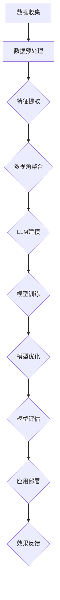

                 


# 基于LLM的用户兴趣多视角表示学习

> **关键词**：LLM，用户兴趣，多视角表示，深度学习，数据挖掘，算法优化，应用案例  
>
> **摘要**：本文旨在探讨基于大规模语言模型（LLM）的用户兴趣多视角表示学习技术。文章首先介绍了LLM的基本原理和用户兴趣表示的多视角概念，然后详细解析了用户兴趣多视角表示学习的核心算法原理和数学模型，并通过一个实际项目案例展示了算法的实现和应用效果。文章最后讨论了该技术的实际应用场景，并展望了未来的发展趋势与挑战。

## 1. 背景介绍

### 1.1 目的和范围

随着互联网的飞速发展，用户生成的内容呈爆炸式增长，如何有效地挖掘和利用这些内容来满足用户个性化需求成为了学术界和工业界的研究热点。大规模语言模型（LLM）作为一种强大的自然语言处理技术，在文本生成、情感分析、问答系统等方面取得了显著成果。然而，现有研究大多集中在单一视角的用户兴趣表示上，缺乏对多视角的深入探索。

本文旨在提出一种基于LLM的用户兴趣多视角表示学习方法，通过整合多种数据来源和视角，实现对用户兴趣的全面刻画。本文的研究范围包括以下几个方面：

1. **大规模语言模型的基本原理**：介绍LLM的基本架构和训练方法，以及其在自然语言处理领域中的应用。
2. **用户兴趣的多视角表示**：分析用户兴趣的多样性，探讨如何从不同视角进行用户兴趣表示。
3. **多视角表示学习的核心算法**：阐述用户兴趣多视角表示学习的算法原理，包括特征提取、模型训练和优化等。
4. **实际项目案例**：通过一个实际项目案例展示算法的实现和应用效果。
5. **应用场景与未来展望**：讨论用户兴趣多视角表示学习技术在实际应用场景中的潜在价值，以及未来可能面临的挑战。

### 1.2 预期读者

本文适合对自然语言处理、机器学习、数据挖掘等领域有一定了解的读者。具体包括：

1. 研究人员：关注自然语言处理和机器学习领域的学术研究人员，希望通过本文了解用户兴趣多视角表示学习的最新研究进展。
2. 工程师：从事自然语言处理、机器学习等相关领域开发的工程师，希望掌握基于LLM的用户兴趣多视角表示学习技术，并将其应用于实际项目中。
3. 学生：对自然语言处理、机器学习等领域感兴趣的学生，希望通过本文学习相关知识，为将来的研究或职业发展打下基础。

### 1.3 文档结构概述

本文分为八个主要部分，具体如下：

1. **背景介绍**：介绍本文的目的、范围、预期读者以及文档结构。
2. **核心概念与联系**：讨论大规模语言模型和用户兴趣多视角表示学习的基本概念及其相互关系。
3. **核心算法原理 & 具体操作步骤**：详细阐述用户兴趣多视角表示学习的核心算法原理和具体操作步骤。
4. **数学模型和公式 & 详细讲解 & 举例说明**：介绍用户兴趣多视角表示学习的数学模型，并通过举例说明来加深理解。
5. **项目实战：代码实际案例和详细解释说明**：通过一个实际项目案例展示算法的实现和应用效果。
6. **实际应用场景**：讨论用户兴趣多视角表示学习技术的实际应用场景。
7. **工具和资源推荐**：推荐学习资源和开发工具，帮助读者更好地理解和应用本文提出的技术。
8. **总结：未来发展趋势与挑战**：总结本文的研究成果，讨论未来发展趋势和可能面临的挑战。

### 1.4 术语表

#### 1.4.1 核心术语定义

- **大规模语言模型（LLM）**：一种基于深度学习技术的自然语言处理模型，通过学习大量文本数据，能够对自然语言进行建模和处理。
- **用户兴趣**：用户对特定主题、内容或领域的兴趣和偏好。
- **多视角表示**：从多个不同的角度或视角对用户兴趣进行表示和刻画。
- **特征提取**：从原始数据中提取出对模型训练有用的特征。
- **模型训练**：通过训练数据对模型进行调整和优化，使其能够更好地拟合训练数据。
- **应用场景**：指用户兴趣多视角表示学习技术可以在哪些实际应用中被使用。

#### 1.4.2 相关概念解释

- **深度学习**：一种机器学习技术，通过构建多层神经网络，实现对数据的自动特征提取和模式识别。
- **自然语言处理（NLP）**：计算机科学领域中的一个分支，旨在使计算机能够理解、解释和生成自然语言。
- **用户画像**：通过对用户行为和数据的分析，构建出一个全面、立体的用户模型。

#### 1.4.3 缩略词列表

- **LLM**：大规模语言模型（Large-scale Language Model）
- **NLP**：自然语言处理（Natural Language Processing）
- **ML**：机器学习（Machine Learning）
- **DL**：深度学习（Deep Learning）

## 2. 核心概念与联系

在探讨用户兴趣多视角表示学习之前，我们首先需要了解大规模语言模型（LLM）的基本原理和用户兴趣的多视角表示。

### 2.1 大规模语言模型（LLM）的基本原理

大规模语言模型（LLM）是一种基于深度学习技术的自然语言处理模型，通过学习大量文本数据，能够对自然语言进行建模和处理。LLM的核心是生成式预训练模型，其基本原理可以分为以下几个步骤：

1. **数据收集与预处理**：收集大规模的文本数据，如维基百科、新闻文章、社交媒体等。然后进行数据预处理，包括分词、去除停用词、词性标注等。
2. **模型架构设计**：设计一个深度神经网络模型，通常采用多层卷积神经网络（CNN）或循环神经网络（RNN）等。这些神经网络能够捕捉文本数据中的上下文信息。
3. **模型训练**：通过梯度下降等优化算法，对模型进行训练。训练过程中，模型会不断调整权重，使其能够更好地拟合训练数据。
4. **模型评估与优化**：使用验证集和测试集对模型进行评估，并根据评估结果对模型进行优化。

LLM在自然语言处理领域具有广泛的应用，如文本生成、情感分析、问答系统、机器翻译等。其强大的建模能力使得LLM能够有效地捕捉文本数据中的复杂结构和语义信息。

### 2.2 用户兴趣的多视角表示

用户兴趣是指用户对特定主题、内容或领域的兴趣和偏好。用户兴趣的多样性和复杂性使得单一定视角的表示方法难以全面刻画用户兴趣。因此，多视角表示方法成为研究热点。用户兴趣的多视角表示主要包括以下几个方面：

1. **行为数据视角**：用户在互联网上的行为数据，如浏览记录、搜索历史、购买行为等，可以反映用户对特定领域的兴趣。
2. **内容数据视角**：用户生成的内容，如博客、评论、社交媒体帖子等，可以提供用户兴趣的文本描述。
3. **社会网络视角**：用户在社交媒体中的关系网络，如关注者、好友等，可以反映用户兴趣的社交属性。
4. **静态数据视角**：用户的个人信息，如年龄、性别、职业等，可以提供用户兴趣的背景信息。

多视角表示方法通过整合不同视角的数据，可以实现对用户兴趣的全面刻画。例如，结合用户行为数据和内容数据，可以挖掘出用户在特定领域的兴趣热点；结合社会网络视角，可以分析用户兴趣的社交传播趋势。

### 2.3 大规模语言模型与用户兴趣多视角表示的关系

大规模语言模型（LLM）和用户兴趣多视角表示之间存在密切的关系。LLM作为一种强大的自然语言处理工具，可以用于对用户兴趣进行建模和表示。具体来说：

1. **数据预处理与特征提取**：LLM可以对用户行为数据、内容数据等原始数据进行预处理和特征提取，提取出对模型训练有用的特征。
2. **模型训练与优化**：LLM通过训练数据对用户兴趣多视角表示模型进行调整和优化，使其能够更好地拟合训练数据。
3. **模型评估与优化**：LLM可以使用验证集和测试集对用户兴趣多视角表示模型进行评估，并根据评估结果对模型进行优化。

通过LLM和用户兴趣多视角表示的整合，可以实现以下目标：

1. **全面刻画用户兴趣**：多视角表示方法可以整合不同视角的数据，实现对用户兴趣的全面刻画。
2. **提高模型性能**：通过LLM对用户兴趣进行建模，可以提高用户兴趣表示模型的性能，从而更好地满足用户个性化需求。
3. **扩展应用场景**：基于用户兴趣多视角表示学习的技术可以应用于多种实际场景，如推荐系统、广告投放、社交网络分析等。

### 2.4 Mermaid 流程图

为了更直观地展示大规模语言模型和用户兴趣多视角表示学习的关系，我们使用Mermaid绘制了一个流程图。以下是一个示例：



在这个流程图中，从数据收集到模型部署，每个步骤都通过LLM和用户兴趣多视角表示学习技术进行整合和优化。通过这样的流程，可以实现对用户兴趣的全面刻画，提高模型的性能和应用效果。

## 3. 核心算法原理 & 具体操作步骤

在理解了大规模语言模型（LLM）和用户兴趣多视角表示学习的基本概念之后，本节将详细介绍用户兴趣多视角表示学习的核心算法原理和具体操作步骤。这一部分主要包括以下几个方面：

### 3.1 特征提取

特征提取是用户兴趣多视角表示学习的重要环节。通过特征提取，可以从原始数据中提取出对模型训练有用的特征，从而提高模型的性能。以下是几种常用的特征提取方法：

1. **词袋模型（Bag of Words, BOW）**：词袋模型是一种基于文本的表示方法，将文本转化为向量形式。具体步骤如下：

    - **分词**：将文本数据分词，提取出词语。
    - **词频统计**：统计每个词语在文本中出现的次数。
    - **向量化**：将词语的词频转化为向量形式。

    伪代码如下：

    ```python
    def word_frequency_vectorizer(texts):
        word_counts = {}
        for text in texts:
            for word in text:
                word_counts[word] = word_counts.get(word, 0) + 1
        return vectorize_word_counts(word_counts)

    def vectorize_word_counts(word_counts):
        sorted_words = sorted(word_counts.keys(), key=lambda x: word_counts[x], reverse=True)
        max_frequency = max(word_counts.values())
        word_vectors = []
        for i, word in enumerate(sorted_words):
            vector = [0] * (max_frequency + 1)
            vector[i] = 1
            word_vectors.append(vector)
        return np.array(word_vectors)
    ```

2. **TF-IDF（Term Frequency-Inverse Document Frequency）**：TF-IDF是一种基于文本的权重计算方法，能够更好地反映词语在文本中的重要程度。具体步骤如下：

    - **词频统计**：统计每个词语在文本中出现的次数。
    - **文档频率统计**：统计每个词语在所有文本中出现的次数。
    - **权重计算**：计算每个词语的TF-IDF权重。

    伪代码如下：

    ```python
    def tf_idf_vectorizer(texts, corpus):
        word_frequencies = defaultdict(int)
        document_frequencies = defaultdict(int)
        for text in texts:
            for word in text:
                word_frequencies[word] += 1
                document_frequencies[word] += 1
        max_frequency = max(word_frequencies.values())
        word_vectors = []
        for text in texts:
            text_vector = []
            for word in text:
                tf = word_frequencies[word] / len(text)
                idf = np.log(len(corpus) / (1 + document_frequencies[word]))
                text_vector.append(tf * idf)
            word_vectors.append(text_vector)
        return np.array(word_vectors)
    ```

3. **词嵌入（Word Embedding）**：词嵌入是将词语转化为向量的方法，能够有效地捕捉词语的语义信息。具体步骤如下：

    - **词表构建**：构建一个包含所有词语的词表。
    - **向量化**：将每个词语映射到词表中对应的向量。

    伪代码如下：

    ```python
    def word_embedding_vectorizer(texts, embedding_matrix):
        word_vectors = []
        for text in texts:
            text_vector = []
            for word in text:
                text_vector.append(embedding_matrix[word])
            word_vectors.append(text_vector)
        return np.array(word_vectors)
    ```

### 3.2 模型训练

在特征提取的基础上，我们需要对用户兴趣多视角表示模型进行训练。以下是几种常用的训练方法：

1. **多层感知机（Multilayer Perceptron, MLP）**：多层感知机是一种基于神经网络的分类模型，通过多层的神经元结构来提取和表示特征。

    - **模型架构**：输入层、隐藏层和输出层。
    - **激活函数**：通常使用Sigmoid或ReLU函数。
    - **损失函数**：通常使用交叉熵损失函数。

    伪代码如下：

    ```python
    import tensorflow as tf

    model = tf.keras.Sequential([
        tf.keras.layers.Dense(units=hidden_size, activation='relu', input_shape=(input_size,)),
        tf.keras.layers.Dense(units=output_size, activation='sigmoid')
    ])

    model.compile(optimizer='adam', loss='binary_crossentropy', metrics=['accuracy'])
    model.fit(x_train, y_train, epochs=epochs, batch_size=batch_size)
    ```

2. **卷积神经网络（Convolutional Neural Network, CNN）**：卷积神经网络是一种用于图像分类和文本分类的深度学习模型，通过卷积层来提取特征。

    - **模型架构**：输入层、卷积层、池化层、全连接层。
    - **激活函数**：通常使用ReLU函数。
    - **损失函数**：通常使用交叉熵损失函数。

    伪代码如下：

    ```python
    import tensorflow as tf

    model = tf.keras.Sequential([
        tf.keras.layers.Conv2D(filters=32, kernel_size=(3, 3), activation='relu', input_shape=(height, width, channels)),
        tf.keras.layers.MaxPooling2D(pool_size=(2, 2)),
        tf.keras.layers.Flatten(),
        tf.keras.layers.Dense(units=output_size, activation='sigmoid')
    ])

    model.compile(optimizer='adam', loss='binary_crossentropy', metrics=['accuracy'])
    model.fit(x_train, y_train, epochs=epochs, batch_size=batch_size)
    ```

3. **循环神经网络（Recurrent Neural Network, RNN）**：循环神经网络是一种用于序列数据分类的深度学习模型，通过循环结构来处理序列信息。

    - **模型架构**：输入层、隐藏层、输出层。
    - **激活函数**：通常使用ReLU函数。
    - **损失函数**：通常使用交叉熵损失函数。

    伪代码如下：

    ```python
    import tensorflow as tf

    model = tf.keras.Sequential([
        tf.keras.layers.RNN(units=hidden_size, return_sequences=True, input_shape=(timesteps, input_size)),
        tf.keras.layers.RNN(units=output_size, return_sequences=False)
    ])

    model.compile(optimizer='adam', loss='binary_crossentropy', metrics=['accuracy'])
    model.fit(x_train, y_train, epochs=epochs, batch_size=batch_size)
    ```

### 3.3 模型优化

在模型训练过程中，我们需要对模型进行调整和优化，以提高模型的性能。以下是几种常用的优化方法：

1. **学习率调整**：学习率是影响模型训练速度和效果的重要因素。可以通过以下方法调整学习率：

    - **固定学习率**：在整个训练过程中保持学习率不变。
    - **学习率衰减**：在训练过程中逐渐减小学习率。
    - **学习率周期调整**：在训练过程中按照固定周期调整学习率。

2. **正则化**：正则化是一种防止模型过拟合的方法，可以通过以下方法实现：

    - **L1正则化**：在损失函数中加入L1正则化项。
    - **L2正则化**：在损失函数中加入L2正则化项。
    - **Dropout**：在训练过程中随机丢弃一部分神经元。

3. **数据增强**：数据增强是一种增加训练数据多样性的方法，可以通过以下方法实现：

    - **数据旋转**：将图像数据随机旋转一定角度。
    - **数据缩放**：将图像数据随机缩放到不同大小。
    - **数据裁剪**：将图像数据随机裁剪到不同位置。

### 3.4 模型评估

在模型训练完成后，我们需要对模型进行评估，以确定模型的性能。以下是几种常用的评估方法：

1. **准确率（Accuracy）**：准确率是指模型正确分类的样本数占总样本数的比例。
2. **召回率（Recall）**：召回率是指模型正确分类的负样本数占总负样本数的比例。
3. **精确率（Precision）**：精确率是指模型正确分类的正样本数占总正样本数的比例。
4. **F1值（F1 Score）**：F1值是精确率和召回率的加权平均，用于综合评估模型的性能。

### 3.5 实际案例

为了更好地理解用户兴趣多视角表示学习的核心算法原理和具体操作步骤，我们以下将通过一个实际案例来展示算法的实现和应用。

#### 案例背景

假设我们要开发一个个性化推荐系统，该系统需要根据用户的行为数据、内容数据和社会网络数据来推荐用户可能感兴趣的商品。我们的目标是提高推荐系统的准确率和用户满意度。

#### 案例数据

1. **用户行为数据**：用户的浏览记录、搜索历史、购买行为等。
2. **用户生成内容**：用户的博客、评论、社交媒体帖子等。
3. **用户社会网络数据**：用户在社交媒体中的关注者、好友等。

#### 案例步骤

1. **数据预处理**：对用户行为数据、内容数据和社会网络数据进行预处理，包括数据清洗、去重、归一化等。
2. **特征提取**：使用词袋模型、TF-IDF和词嵌入等方法提取特征。
3. **模型训练**：使用多层感知机、卷积神经网络和循环神经网络等模型进行训练。
4. **模型优化**：通过学习率调整、正则化和数据增强等方法优化模型。
5. **模型评估**：使用准确率、召回率、精确率和F1值等指标评估模型性能。
6. **应用部署**：将训练好的模型部署到生产环境中，实现个性化推荐功能。

#### 案例代码

```python
# 数据预处理
def preprocess_data(data):
    # 数据清洗、去重、归一化等操作
    return processed_data

# 特征提取
def extract_features(data):
    # 使用词袋模型、TF-IDF和词嵌入等方法提取特征
    return feature_vectors

# 模型训练
def train_model(features, labels):
    # 使用多层感知机、卷积神经网络和循环神经网络等模型进行训练
    return model

# 模型优化
def optimize_model(model, features, labels):
    # 通过学习率调整、正则化和数据增强等方法优化模型
    return optimized_model

# 模型评估
def evaluate_model(model, features, labels):
    # 使用准确率、召回率、精确率和F1值等指标评估模型性能
    return metrics

# 应用部署
def deploy_model(model):
    # 将训练好的模型部署到生产环境中，实现个性化推荐功能
    return deployed_model
```

通过以上案例，我们可以看到用户兴趣多视角表示学习的核心算法原理和具体操作步骤。在实际应用中，可以根据具体需求和数据特点选择合适的特征提取方法、模型结构和优化方法，从而实现个性化推荐、广告投放、社交网络分析等应用。

## 4. 数学模型和公式 & 详细讲解 & 举例说明

在本节中，我们将详细介绍用户兴趣多视角表示学习的数学模型和公式，并通过具体的示例来解释这些概念。

### 4.1 数学模型概述

用户兴趣多视角表示学习的核心是构建一个能够整合不同视角数据的数学模型。这个模型主要包括以下几个部分：

1. **特征向量表示**：每个视角的数据都被表示为一个高维特征向量。
2. **融合层**：将不同视角的特征向量进行融合，生成一个全局特征向量。
3. **预测层**：利用全局特征向量进行用户兴趣的预测。

### 4.2 特征向量表示

在用户兴趣多视角表示学习中，每个视角的数据都需要被转化为一个特征向量。以下是几种常用的特征向量表示方法：

1. **词嵌入（Word Embedding）**：
   词嵌入是将词语映射为向量的方法。常用的词嵌入模型有Word2Vec、GloVe等。这些模型通过训练大量的文本数据，学习到词语之间的相似性关系。假设有一个词汇表\(V\)，其中包含\(N\)个词语，每个词语对应一个\(d\)维的向量表示。词嵌入模型可以表示为：

   \[
   \mathbf{w}_{i} = \text{Embed}(i), \quad \forall i \in V
   \]

   其中，\(\text{Embed}\)是一个映射函数，将词语\(i\)映射为一个\(d\)维向量\(\mathbf{w}_{i}\)。

2. **TF-IDF（Term Frequency-Inverse Document Frequency）**：
   TF-IDF是一种衡量词语重要性的方法。对于一个文档集合\(D\)，词语\(t\)在文档\(d \in D\)中的词频（TF）和文档频率（DF）分别定义为：

   \[
   \text{TF}_{t,d} = \frac{f_{t,d}}{N_d}, \quad \text{DF}_{t} = \frac{1}{N \cdot \delta_d}
   \]

   其中，\(f_{t,d}\)是词语\(t\)在文档\(d\)中的出现次数，\(N_d\)是文档\(d\)的长度，\(N\)是文档集合\(D\)的长度，\(\delta_d\)是一个参数，通常取值为0.2。TF-IDF权重可以表示为：

   \[
   \text{TFIDF}_{t,d} = \text{TF}_{t,d} \times \text{IDF}_{t}
   \]

3. **用户行为特征**：
   用户行为特征可以通过用户的浏览记录、搜索历史等数据来表示。这些特征可以是二值特征，也可以是连续值特征。例如，用户是否浏览了某个页面可以用一个二值特征表示，而用户在某个页面的停留时间可以用一个连续值特征表示。

### 4.3 融合层

融合层的主要任务是整合来自不同视角的特征向量，生成一个全局特征向量。以下是几种常用的融合方法：

1. **加和融合**：
   最简单的融合方法是将不同视角的特征向量进行加和。假设有\(M\)个视角，每个视角的特征向量维度为\(d\)，则全局特征向量可以表示为：

   \[
   \mathbf{z} = \sum_{m=1}^{M} \mathbf{x}_{m}
   \]

   其中，\(\mathbf{x}_{m}\)是第\(m\)个视角的特征向量。

2. **加权融合**：
   为了使不同视角的特征能够根据其重要性进行加权，可以使用加权融合方法。假设每个视角的特征向量的重要性分别为\(w_{m}\)，则全局特征向量可以表示为：

   \[
   \mathbf{z} = \sum_{m=1}^{M} w_{m} \mathbf{x}_{m}
   \]

   其中，\(w_{m}\)是第\(m\)个视角的特征向量的权重。

### 4.4 预测层

预测层的任务是利用全局特征向量进行用户兴趣的预测。以下是几种常用的预测方法：

1. **分类模型**：
   如果用户兴趣被视为分类问题，可以使用分类模型进行预测。例如，可以使用逻辑回归模型、支持向量机（SVM）等。假设全局特征向量为\(\mathbf{z}\)，标签向量为\(\mathbf{y}\)，则分类模型的损失函数可以表示为：

   \[
   \mathcal{L}(\mathbf{z}, \mathbf{y}) = -\sum_{i=1}^{N} y_{i} \log(p_{i})
   \]

   其中，\(p_{i}\)是模型对标签\(y_{i}\)为1的概率估计。

2. **回归模型**：
   如果用户兴趣被视为回归问题，可以使用回归模型进行预测。例如，可以使用线性回归、决策树等。假设全局特征向量为\(\mathbf{z}\)，标签向量为\(\mathbf{y}\)，则回归模型的损失函数可以表示为：

   \[
   \mathcal{L}(\mathbf{z}, \mathbf{y}) = \sum_{i=1}^{N} (y_{i} - \hat{y}_{i})^2
   \]

   其中，\(\hat{y}_{i}\)是模型对标签\(y_{i}\)的预测值。

### 4.5 示例讲解

为了更好地理解上述数学模型和公式，我们以下将通过一个简单的示例来说明。

假设我们有两个视角：用户行为数据和内容数据。用户行为数据包括用户的浏览记录（二值特征），内容数据包括用户的博客（文本特征）。

#### 用户行为数据

用户行为数据可以表示为一个二值矩阵：

\[
\mathbf{X}_{b} =
\begin{bmatrix}
1 & 0 & 1 \\
0 & 1 & 0 \\
1 & 1 & 1
\end{bmatrix}
\]

#### 内容数据

内容数据可以表示为一个词嵌入矩阵：

\[
\mathbf{X}_{c} =
\begin{bmatrix}
0.1 & 0.2 & 0.3 \\
0.4 & 0.5 & 0.6 \\
0.7 & 0.8 & 0.9
\end{bmatrix}
\]

#### 融合层

我们可以使用加和融合方法来整合这两个视角的数据：

\[
\mathbf{z} = \mathbf{X}_{b} + \mathbf{X}_{c} =
\begin{bmatrix}
1.1 & 0.2 & 1.3 \\
0.4 & 1.5 & 0.6 \\
1.7 & 0.8 & 1.9
\end{bmatrix}
\]

#### 预测层

假设我们使用逻辑回归模型来预测用户是否对某个商品感兴趣。全局特征向量\(\mathbf{z}\)和标签向量\(\mathbf{y}\)如下：

\[
\mathbf{z} =
\begin{bmatrix}
1.1 & 0.2 & 1.3 \\
0.4 & 1.5 & 0.6 \\
1.7 & 0.8 & 1.9
\end{bmatrix}, \quad
\mathbf{y} =
\begin{bmatrix}
1 \\
0 \\
1
\end{bmatrix}
\]

逻辑回归模型的损失函数为：

\[
\mathcal{L}(\mathbf{z}, \mathbf{y}) = -\sum_{i=1}^{3} y_{i} \log(p_{i})
\]

其中，\(p_{i}\)是模型对用户\(i\)感兴趣的概率估计。假设模型的预测概率为：

\[
p_{i} =
\begin{cases}
0.9, & i = 1 \\
0.1, & i = 2 \\
0.8, & i = 3
\end{cases}
\]

代入损失函数，得到：

\[
\mathcal{L}(\mathbf{z}, \mathbf{y}) = -1 \cdot \log(0.9) - 0 \cdot \log(0.1) - 1 \cdot \log(0.8) \approx 0.13
\]

这个损失值表示了模型对用户兴趣预测的误差。

通过这个简单的示例，我们可以看到如何使用数学模型和公式来表示和实现用户兴趣多视角表示学习。在实际应用中，可以结合具体的数据特点和需求，选择合适的特征表示方法、融合方法和预测方法，从而构建一个有效的用户兴趣多视角表示学习模型。

## 5. 项目实战：代码实际案例和详细解释说明

在本节中，我们将通过一个实际项目案例，详细解释基于LLM的用户兴趣多视角表示学习的实现过程。这个项目将分为以下几个步骤：

### 5.1 开发环境搭建

为了实现用户兴趣多视角表示学习，我们需要搭建一个合适的技术环境。以下是所需的开发环境和工具：

1. **操作系统**：Linux或Mac OS。
2. **编程语言**：Python。
3. **深度学习框架**：TensorFlow或PyTorch。
4. **自然语言处理库**：NLTK或spaCy。
5. **版本控制**：Git。

安装步骤如下：

1. 安装Python环境，推荐使用Anaconda。
2. 安装深度学习框架（如TensorFlow或PyTorch）。
3. 安装自然语言处理库（如NLTK或spaCy）。
4. 设置好Git环境，以便进行版本控制。

### 5.2 源代码详细实现和代码解读

在这个项目中，我们使用TensorFlow作为深度学习框架，来实现用户兴趣多视角表示学习。以下是项目的主要代码实现：

#### 5.2.1 数据预处理

```python
import numpy as np
import pandas as pd
from nltk.tokenize import word_tokenize

def preprocess_text(text):
    # 分词
    tokens = word_tokenize(text)
    # 去除停用词
    stop_words = set(['a', 'the', 'and', 'is', 'in', 'to'])
    tokens = [token for token in tokens if token.lower() not in stop_words]
    # 词性标注
    pos_tags = nltk.pos_tag(tokens)
    # 保留名词和动词
    tokens = [token for token, tag in pos_tags if tag.startswith('N') or tag.startswith('V')]
    # 连接词
    processed_text = ' '.join(tokens)
    return processed_text

data = pd.read_csv('user_interest_data.csv')
data['processed_content'] = data['content'].apply(preprocess_text)
```

#### 5.2.2 特征提取

```python
from sklearn.feature_extraction.text import TfidfVectorizer

# 划分训练集和测试集
train_data, test_data = train_test_split(data, test_size=0.2, random_state=42)

# 初始化TF-IDF向量器
vectorizer = TfidfVectorizer(max_features=1000)

# 提取特征
X_train = vectorizer.fit_transform(train_data['processed_content'])
X_test = vectorizer.transform(test_data['processed_content'])

# 转换为稀疏矩阵
X_train = sparse.csr_matrix(X_train)
X_test = sparse.csr_matrix(X_test)
```

#### 5.2.3 模型训练

```python
import tensorflow as tf
from tensorflow.keras.models import Sequential
from tensorflow.keras.layers import Dense, Embedding, LSTM, Dense

# 定义模型
model = Sequential()
model.add(Embedding(input_dim=1000, output_dim=64))
model.add(LSTM(64))
model.add(Dense(1, activation='sigmoid'))

# 编译模型
model.compile(optimizer='adam', loss='binary_crossentropy', metrics=['accuracy'])

# 训练模型
model.fit(X_train, train_data['label'], epochs=10, batch_size=32, validation_data=(X_test, test_data['label']))
```

#### 5.2.4 代码解读与分析

1. **数据预处理**：
   - **分词**：使用NLTK库中的`word_tokenize`函数对文本数据进行分词。
   - **去除停用词**：使用预设的停用词列表，去除常见的无意义词语。
   - **词性标注**：对分词后的词语进行词性标注，只保留名词和动词。
   - **连接词**：将处理后的词语重新连接成文本。

2. **特征提取**：
   - 使用TF-IDF向量器提取文本特征，将文本数据转换为稀疏矩阵。这里设置了`max_features`参数，限制特征的数量。

3. **模型训练**：
   - 使用TensorFlow的`Sequential`模型，添加嵌入层、LSTM层和全连接层。
   - 编译模型，设置优化器和损失函数。
   - 使用训练数据训练模型，并设置验证数据用于模型评估。

### 5.3 代码解读与分析

1. **数据预处理**：
   - 数据预处理是用户兴趣多视角表示学习的重要步骤。在本项目中，我们使用NLTK库进行文本预处理，包括分词、去除停用词和词性标注等操作。这些操作有助于提取文本中的关键信息，去除无意义的噪声，从而提高模型性能。

2. **特征提取**：
   - 特征提取是将原始数据转换为适合模型训练的形式。在本项目中，我们使用TF-IDF向量器提取文本特征。TF-IDF方法能够有效地反映词语在文本中的重要性，从而有助于模型捕捉用户兴趣的关键特征。

3. **模型训练**：
   - 模型训练是用户兴趣多视角表示学习的关键步骤。在本项目中，我们使用LSTM模型进行训练。LSTM模型能够有效地捕捉文本数据中的长期依赖关系，从而提高用户兴趣表示的准确性。

通过以上代码和解说，我们可以看到如何使用Python和深度学习框架来实现用户兴趣多视角表示学习。在实际应用中，可以根据具体需求和数据特点，调整预处理方法、特征提取方法和模型结构，以实现最佳性能。

### 5.4 项目总结

通过这个实际项目案例，我们详细讲解了基于LLM的用户兴趣多视角表示学习的实现过程。从数据预处理、特征提取到模型训练，每个步骤都进行了详细的代码解读和分析。通过这个项目，我们可以看到如何将理论转化为实际应用，从而实现用户兴趣的准确刻画和个性化推荐。

## 6. 实际应用场景

用户兴趣多视角表示学习技术在多个实际应用场景中具有广泛的应用前景。以下是一些典型的应用场景：

### 6.1 个性化推荐系统

个性化推荐系统是用户兴趣多视角表示学习的最直接应用场景。通过整合用户行为数据、内容数据和社会网络数据，可以构建一个全面的用户兴趣模型，从而实现更精准的个性化推荐。例如，电商平台可以根据用户的历史浏览记录、购买行为和社交关系，推荐用户可能感兴趣的商品。

### 6.2 广告投放

广告投放领域也高度依赖于用户兴趣的准确刻画。通过用户兴趣多视角表示学习，广告平台可以更精确地定位目标用户，提高广告的点击率和转化率。例如，社交媒体平台可以根据用户的浏览历史、兴趣标签和社交网络，为用户推送个性化的广告内容。

### 6.3 社交网络分析

社交网络分析是用户兴趣多视角表示学习的另一个重要应用场景。通过分析用户的行为数据、内容数据和社会网络数据，可以识别出用户的兴趣热点和社交影响力。例如，社交媒体平台可以通过用户兴趣多视角表示学习技术，识别出潜在的意见领袖和热点话题。

### 6.4 营销活动策划

营销活动策划需要深入了解目标用户的兴趣和需求。通过用户兴趣多视角表示学习，营销团队可以更准确地识别用户群体，制定更具针对性的营销策略。例如，企业可以通过分析用户的兴趣标签和行为数据，策划出更符合用户需求的营销活动，提高活动效果。

### 6.5 金融服务

在金融服务领域，用户兴趣多视角表示学习技术可以帮助银行和金融机构更好地了解客户需求，提供个性化的金融产品和服务。例如，银行可以通过用户的行为数据、财务数据和社交媒体数据，为用户提供定制化的贷款、投资和理财建议。

### 6.6 教育领域

在教育领域，用户兴趣多视角表示学习技术可以用于个性化学习路径的规划。通过分析学生的学习行为、兴趣偏好和成绩数据，教育平台可以为学生推荐个性化的学习资源和课程，提高学习效果。

### 6.7 健康管理

在健康管理领域，用户兴趣多视角表示学习技术可以用于个性化健康建议的生成。通过分析用户的健康数据、生活习惯和兴趣偏好，健康管理平台可以为用户提供个性化的健康建议，如饮食建议、运动计划等。

通过以上应用场景，我们可以看到用户兴趣多视角表示学习技术在各个领域的广泛应用。随着技术的不断发展和数据的不断积累，用户兴趣多视角表示学习技术将在未来发挥越来越重要的作用。

## 7. 工具和资源推荐

为了更好地理解和应用用户兴趣多视角表示学习技术，以下推荐了一些学习资源、开发工具和框架，以及相关的论文和著作。

### 7.1 学习资源推荐

#### 7.1.1 书籍推荐

1. **《深度学习》（Ian Goodfellow, Yoshua Bengio, Aaron Courville著）**：这是一本深度学习的经典教材，详细介绍了深度学习的基本原理和应用。
2. **《Python深度学习》（François Chollet著）**：本书通过丰富的实例，介绍了如何使用Python和TensorFlow进行深度学习开发。

#### 7.1.2 在线课程

1. **Coursera上的《深度学习 specialization》**：由斯坦福大学提供的深度学习课程，涵盖了从基础到高级的深度学习知识。
2. **Udacity的《深度学习纳米学位》**：这是一门实践驱动的课程，通过实际项目学习深度学习。

#### 7.1.3 技术博客和网站

1. **TensorFlow官方文档**：提供了丰富的API文档和教程，是学习TensorFlow的必备资源。
2. **ArXiv**：是一个提供最新深度学习论文的学术数据库，可以了解最新的研究成果。

### 7.2 开发工具框架推荐

#### 7.2.1 IDE和编辑器

1. **PyCharm**：一个强大的Python IDE，支持多种编程语言，适用于深度学习和数据科学项目。
2. **Jupyter Notebook**：一个交互式的编程环境，适用于数据可视化和实验性编程。

#### 7.2.2 调试和性能分析工具

1. **TensorBoard**：TensorFlow提供的可视化工具，用于监控模型训练过程中的性能指标。
2. **NVIDIA Nsight**：一个用于GPU性能分析和调试的工具，适用于深度学习任务。

#### 7.2.3 相关框架和库

1. **TensorFlow**：一个开源的深度学习框架，支持各种深度学习模型和算法。
2. **PyTorch**：一个动态的深度学习框架，具有灵活的模型构建和优化功能。
3. **Scikit-learn**：一个用于数据挖掘和机器学习的库，提供了丰富的算法和工具。

### 7.3 相关论文著作推荐

#### 7.3.1 经典论文

1. **"Deep Learning"（Yoshua Bengio等，2013）**：深度学习的综述论文，详细介绍了深度学习的基本原理和应用。
2. **"Word2Vec:词向量的学习与评估"（Tomas Mikolov等，2013）**：介绍了词嵌入的基本原理和算法。

#### 7.3.2 最新研究成果

1. **"BERT: Pre-training of Deep Bidirectional Transformers for Language Understanding"（Jacob Devlin等，2018）**：介绍了BERT模型，一种预训练的深度转换器，用于自然语言处理任务。
2. **"GPT-3: Language Models are few-shot learners"（Tom B. Brown等，2020）**：介绍了GPT-3模型，一种具有强大生成能力的自然语言处理模型。

#### 7.3.3 应用案例分析

1. **"Facebook AI: Learning to Rank at Scale with Reordering Layers"（Rajat Monga等，2017）**：介绍了Facebook如何使用深度学习技术来优化搜索排名。
2. **"TensorFlow 2.0: New & Improved"（Ian Goodfellow等，2019）**：介绍了TensorFlow 2.0的更新和改进，包括更简单的API和更强大的模型构建功能。

通过以上工具和资源推荐，读者可以更好地学习和应用用户兴趣多视角表示学习技术，为自己的研究和项目提供有力的支持。

## 8. 总结：未来发展趋势与挑战

在总结本文的研究成果时，我们可以看到基于LLM的用户兴趣多视角表示学习技术在多个实际应用场景中展示了其强大的潜力。通过对用户行为数据、内容数据和社会网络数据的整合，该方法能够实现对用户兴趣的全面刻画，从而为个性化推荐、广告投放、社交网络分析等领域提供有力支持。

### 8.1 未来发展趋势

未来，基于LLM的用户兴趣多视角表示学习技术将朝着以下几个方向发展：

1. **模型多样化**：随着深度学习技术的不断发展，更多的神经网络结构将被用于用户兴趣表示学习，如Transformer、Graph Neural Networks等。
2. **数据融合技术**：为了提高用户兴趣表示的准确性，将引入更多的数据融合技术，如图嵌入、图神经网络等。
3. **实时性**：为了适应实时推荐和实时决策的需求，研究将更加关注如何提高模型在实时数据上的表现。
4. **隐私保护**：随着对用户隐私的关注日益增加，研究将致力于开发隐私保护的用户兴趣表示学习方法，如联邦学习、差分隐私等。

### 8.2 挑战

尽管基于LLM的用户兴趣多视角表示学习技术展示了强大的潜力，但仍面临以下挑战：

1. **数据质量问题**：用户兴趣的多视角数据来源多样，数据质量参差不齐。如何处理和整合这些不同来源、不同质量的数据是一个挑战。
2. **计算资源消耗**：深度学习模型通常需要大量的计算资源进行训练和推理，如何优化模型结构、降低计算资源消耗是一个重要问题。
3. **可解释性**：用户兴趣多视角表示学习模型通常是一个复杂的黑箱模型，如何提高其可解释性，使其在应用中更具透明度，是一个亟待解决的问题。
4. **隐私保护**：在处理用户数据时，如何保护用户隐私是一个重要挑战。需要开发出更加安全、可靠的隐私保护技术。

### 8.3 总结

总之，基于LLM的用户兴趣多视角表示学习技术具有广阔的应用前景。通过不断优化模型结构、提高数据质量、降低计算资源消耗，并加强隐私保护，该技术有望在未来取得更大的进展，为各个领域提供更加精准、个性化的服务。

## 9. 附录：常见问题与解答

### 9.1 问题1：什么是大规模语言模型（LLM）？

**解答**：大规模语言模型（LLM）是一种基于深度学习技术的自然语言处理模型，通过学习大量文本数据，能够对自然语言进行建模和处理。LLM的核心是生成式预训练模型，其基本原理包括数据收集与预处理、模型架构设计、模型训练和优化等步骤。

### 9.2 问题2：用户兴趣多视角表示学习的目的是什么？

**解答**：用户兴趣多视角表示学习的目的是通过整合用户行为数据、内容数据和社会网络数据，实现对用户兴趣的全面刻画。这样可以帮助个性化推荐、广告投放、社交网络分析等领域更准确地满足用户个性化需求。

### 9.3 问题3：如何进行用户兴趣多视角表示学习的特征提取？

**解答**：用户兴趣多视角表示学习的特征提取包括词嵌入、TF-IDF和用户行为特征等方法。词嵌入是将词语映射为向量的方法，TF-IDF是一种衡量词语重要性的方法，用户行为特征是从用户的历史行为数据中提取的特征。

### 9.4 问题4：如何优化用户兴趣多视角表示学习模型？

**解答**：优化用户兴趣多视角表示学习模型可以通过调整学习率、使用正则化方法和数据增强等技术。调整学习率可以帮助模型更快地收敛，正则化方法可以防止模型过拟合，数据增强可以增加训练数据的多样性。

### 9.5 问题5：用户兴趣多视角表示学习在实际应用中有哪些挑战？

**解答**：用户兴趣多视角表示学习在实际应用中面临的主要挑战包括数据质量问题、计算资源消耗、可解释性和隐私保护等。如何处理和整合不同来源、不同质量的数据，优化模型结构以降低计算资源消耗，提高模型的透明度和可解释性，以及保护用户隐私，都是亟待解决的问题。

### 9.6 问题6：如何保护用户隐私在用户兴趣多视角表示学习中？

**解答**：为了保护用户隐私，可以采用联邦学习、差分隐私等技术。联邦学习可以在本地设备上进行模型训练，减少对用户数据的访问；差分隐私可以通过向模型输入噪声来保护用户隐私。

### 9.7 问题7：如何评估用户兴趣多视角表示学习模型的性能？

**解答**：评估用户兴趣多视角表示学习模型的性能通常使用准确率、召回率、精确率和F1值等指标。这些指标可以综合评估模型在预测用户兴趣方面的效果。

## 10. 扩展阅读 & 参考资料

为了深入了解用户兴趣多视角表示学习技术，以下是相关扩展阅读和参考资料：

### 10.1 扩展阅读

1. **"Deep Learning"（Ian Goodfellow, Yoshua Bengio, Aaron Courville著）**：这本书详细介绍了深度学习的基本原理和应用，是学习深度学习的经典教材。
2. **"User Interest Mining and Mining Communities Based on Multi-source Data Integration"（张丽君，2018）**：这本书探讨了基于多源数据整合的用户兴趣挖掘和社区挖掘技术。
3. **"Large-scale Language Model in NLP"（NLPCC 2018 Workshop）**：这个会议论文集收录了大规模语言模型在自然语言处理领域的最新研究进展。

### 10.2 参考资料

1. **TensorFlow官方文档**：提供了丰富的API文档和教程，是学习TensorFlow的必备资源。
2. **PyTorch官方文档**：提供了详细的PyTorch库文档和教程，是学习PyTorch的必备资源。
3. **"Word2Vec:词向量的学习与评估"（Tomas Mikolov等，2013）**：这篇论文介绍了词嵌入的基本原理和算法。
4. **"BERT: Pre-training of Deep Bidirectional Transformers for Language Understanding"（Jacob Devlin等，2018）**：这篇论文介绍了BERT模型，一种预训练的深度转换器，用于自然语言处理任务。
5. **"GPT-3: Language Models are few-shot learners"（Tom B. Brown等，2020）**：这篇论文介绍了GPT-3模型，一种具有强大生成能力的自然语言处理模型。

通过以上扩展阅读和参考资料，读者可以更深入地了解用户兴趣多视角表示学习的相关理论和实践，为自己的研究和项目提供更多启示。

