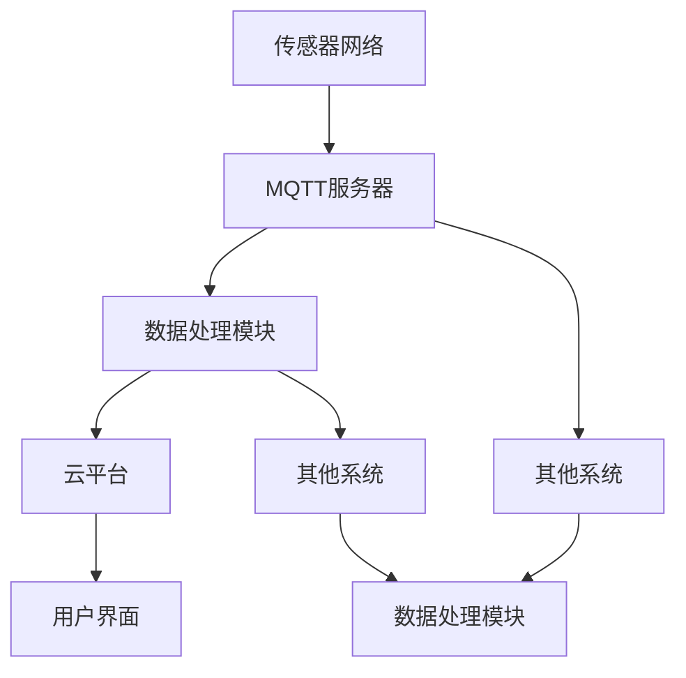

                 

# 基于MQTT协议和RESTful API的智能家居空气质量分析系统

## 关键词
- MQTT协议
- RESTful API
- 智能家居
- 空气质量分析
- 数据处理
- 云平台

## 摘要
本文旨在探讨如何利用MQTT协议和RESTful API构建一个高效的智能家居空气质量分析系统。我们首先介绍了MQTT协议和RESTful API的基本概念和优势，接着详细解析了系统的架构设计、核心算法原理、数学模型、项目实战和实际应用场景。通过本文的学习，读者可以全面了解该系统的构建过程，为智能家居领域的技术研究和应用提供有力支持。

## 1. 背景介绍

### 1.1 目的和范围
本文的目标是：
1. 深入探讨MQTT协议和RESTful API在智能家居空气质量分析系统中的应用。
2. 详细介绍系统的架构设计、核心算法原理和实现方法。
3. 提供实际项目案例，帮助读者理解系统的应用场景和部署方式。

本文的范围包括：
1. MQTT协议和RESTful API的基本原理和特性。
2. 智能家居空气质量分析系统的架构设计和实现。
3. 系统的数学模型和算法原理。
4. 实际应用场景和工具资源推荐。

### 1.2 预期读者
本文适合以下读者群体：
1. 智能家居和物联网领域的开发者。
2. 对空气质量监测和分析感兴趣的工程师。
3. 想要了解MQTT协议和RESTful API的程序员。
4. 对系统架构设计和实现感兴趣的软件工程师。

### 1.3 文档结构概述
本文分为以下几个部分：
1. 背景介绍：介绍本文的目的、范围、预期读者和文档结构。
2. 核心概念与联系：讨论MQTT协议和RESTful API的基本概念、核心术语和架构设计。
3. 核心算法原理 & 具体操作步骤：详细解析系统的核心算法原理和具体操作步骤。
4. 数学模型和公式 & 详细讲解 & 举例说明：介绍系统的数学模型和公式，并提供实例说明。
5. 项目实战：提供实际项目案例，详细解释代码实现和分析。
6. 实际应用场景：讨论系统的实际应用场景和部署方式。
7. 工具和资源推荐：推荐学习资源和开发工具。
8. 总结：对未来发展趋势和挑战进行总结。
9. 附录：提供常见问题与解答。
10. 扩展阅读 & 参考资料：提供更多相关资料和参考文献。

### 1.4 术语表

#### 1.4.1 核心术语定义

- MQTT协议：MQTT（Message Queuing Telemetry Transport）是一种轻量级的消息传输协议，适用于物联网设备之间的通信。
- RESTful API：RESTful API（Representational State Transfer Application Programming Interface）是一种基于HTTP协议的API设计风格，用于实现不同系统之间的交互。
- 智能家居：智能家居是通过网络连接的智能设备和系统，为用户提供自动化、便捷和高效的居住环境。
- 空气质量分析：空气质量分析是通过对空气质量数据进行收集、处理和分析，评估空气质量状况并采取相应措施的过程。

#### 1.4.2 相关概念解释

- 传感器：传感器是用于检测和测量物理量的设备，如空气质量传感器可以检测空气中的颗粒物、温度、湿度等。
- 数据处理：数据处理是对收集到的数据进行清洗、转换、存储和分析的过程。
- 云平台：云平台是一种提供计算资源、存储和网络连接的服务，用于部署、管理和扩展应用程序。

#### 1.4.3 缩略词列表

- MQTT：Message Queuing Telemetry Transport
- RESTful API：Representational State Transfer Application Programming Interface
- IoT：Internet of Things
- AI：Artificial Intelligence
- ML：Machine Learning
- MQTT-SN：MQTT for Sensor Networks
- JSON：JavaScript Object Notation

## 2. 核心概念与联系

在智能家居空气质量分析系统中，MQTT协议和RESTful API是两个核心组成部分。为了更好地理解系统的工作原理，我们将首先讨论这两个协议的基本概念和优势，然后介绍系统的架构设计。

### 2.1 MQTT协议

MQTT（Message Queuing Telemetry Transport）是一种轻量级的消息传输协议，特别适用于物联网（IoT）设备之间的通信。它具有以下几个核心特性：

1. **发布/订阅模型**：MQTT协议采用发布/订阅（Pub/Sub）模型，设备作为发布者（Publisher）可以向MQTT服务器发布消息，其他设备作为订阅者（Subscriber）可以订阅特定的消息主题，从而实现消息的广播和订阅。
2. **轻量级协议**：MQTT协议的设计初衷是为了在资源受限的设备上运行，如嵌入式系统、物联网设备等。它具有简单的协议格式和紧凑的数据包结构，能够降低带宽占用和网络延迟。
3. **可靠传输**：MQTT协议支持消息确认和重传机制，确保消息能够可靠地传输到订阅者。此外，它还支持传输质量（Quality of Service, QoS）等级，提供不同的可靠性保证。

### 2.2 RESTful API

RESTful API（Representational State Transfer Application Programming Interface）是一种基于HTTP协议的API设计风格，用于实现不同系统之间的交互。以下是RESTful API的几个关键特性：

1. **无状态性**：RESTful API是无状态的设计，每个请求都是独立的，不会保存之前的请求信息。这简化了系统的设计和实现，提高了系统的可伸缩性和可靠性。
2. **统一接口**：RESTful API采用统一的接口设计，包括URI（统一资源标识符）、HTTP方法（GET、POST、PUT、DELETE等）、状态码和响应体等。这种设计提高了API的易用性和可扩展性。
3. **基于HTTP协议**：RESTful API基于HTTP协议实现，可以充分利用HTTP的通用性和广泛支持。HTTP协议具有简单、快速、易于扩展的特点，使得RESTful API能够在各种环境中应用。

### 2.3 系统架构设计

基于MQTT协议和RESTful API的智能家居空气质量分析系统包括以下几个主要组成部分：

1. **传感器网络**：传感器网络由各种空气质量传感器组成，用于实时监测空气中的颗粒物、温度、湿度等参数。传感器可以通过MQTT协议将监测数据发送到MQTT服务器。
2. **MQTT服务器**：MQTT服务器是消息传输的中枢，负责接收传感器发送的消息，并根据订阅者的需求将消息广播给相应的订阅者。MQTT服务器通常采用轻量级的MQTT协议实现，如mosquitto等。
3. **数据处理模块**：数据处理模块负责对传感器数据进行清洗、转换和存储。该模块可以使用RESTful API与MQTT服务器和其他系统进行交互，实现数据处理的自动化和智能化。
4. **云平台**：云平台提供计算资源、存储和网络连接，用于部署和管理整个空气质量分析系统。云平台还可以提供额外的功能，如数据分析和可视化等。
5. **用户界面**：用户界面（UI）是系统与用户交互的入口，用户可以通过UI查看空气质量数据、设置传感器参数和配置系统参数。用户界面通常采用Web或移动应用的方式实现。

### 2.4 Mermaid流程图

为了更好地展示系统的架构设计，我们使用Mermaid流程图（不包含括号、逗号等特殊字符）来描述系统的主要组件和流程。



## 3. 核心算法原理 & 具体操作步骤

在智能家居空气质量分析系统中，核心算法原理和具体操作步骤是确保系统正常运行和实现空气质量分析的关键。以下将详细讲解系统的算法原理和操作步骤。

### 3.1 算法原理

系统中的核心算法主要包括数据采集、数据处理和数据存储。以下是每个算法的基本原理：

#### 3.1.1 数据采集算法

数据采集算法主要负责从传感器网络中获取空气质量数据。具体步骤如下：

1. **初始化传感器**：系统启动时，首先初始化各个传感器，确保传感器能够正常工作。
2. **采集数据**：传感器实时监测空气中的颗粒物、温度、湿度等参数，并将数据发送到MQTT服务器。
3. **数据清洗**：在数据采集过程中，需要对采集到的数据进行清洗，去除异常值和噪声。

#### 3.1.2 数据处理算法

数据处理算法主要负责对采集到的空气质量数据进行处理，包括数据清洗、转换和存储。具体步骤如下：

1. **数据清洗**：清洗传感器采集到的数据，去除异常值和噪声。可以使用中值滤波、卡尔曼滤波等算法进行数据清洗。
2. **数据转换**：将清洗后的数据转换为标准格式，如JSON或XML等。这有利于后续的数据存储和分析。
3. **数据存储**：将转换后的数据存储到数据库或文件中，以便进行进一步分析和处理。

#### 3.1.3 数据存储算法

数据存储算法主要负责将处理后的空气质量数据存储到数据库或文件中。具体步骤如下：

1. **选择存储方式**：根据数据量和需求，选择合适的存储方式，如关系型数据库（如MySQL）或NoSQL数据库（如MongoDB）。
2. **建立索引**：为提高数据查询速度，需要为数据表建立合适的索引。
3. **数据备份**：定期对数据进行备份，确保数据的安全性和可靠性。

### 3.2 具体操作步骤

以下是基于MQTT协议和RESTful API的智能家居空气质量分析系统的具体操作步骤：

#### 3.2.1 数据采集

1. **启动传感器网络**：启动传感器网络，确保传感器能够正常工作。
2. **数据采集**：传感器实时监测空气中的颗粒物、温度、湿度等参数，并将数据发送到MQTT服务器。

```python
# 示例：使用Python的paho-mqtt库发送传感器数据
import paho.mqtt.client as mqtt
import json

# 传感器数据
sensor_data = {
    "particle_density": 10,
    "temperature": 25,
    "humidity": 60
}

# MQTT服务器配置
mqtt_server = "mqtt-server.example.com"
mqtt_port = 1883
mqtt_topic = "air_quality/sensor_data"

# 创建MQTT客户端
client = mqtt.Client()

# 连接MQTT服务器
client.connect(mqtt_server, mqtt_port)

# 发布传感器数据
client.publish(mqtt_topic, json.dumps(sensor_data))

# 断开连接
client.disconnect()
```

#### 3.2.2 数据处理

1. **接收传感器数据**：使用MQTT客户端订阅传感器数据主题，接收传感器发送的数据。
2. **数据清洗**：对接收到的数据进行清洗，去除异常值和噪声。
3. **数据转换**：将清洗后的数据转换为标准格式，如JSON或XML等。

```python
# 示例：使用Python的paho-mqtt库接收传感器数据并进行数据清洗
import paho.mqtt.client as mqtt
import json

# MQTT服务器配置
mqtt_server = "mqtt-server.example.com"
mqtt_port = 1883
mqtt_topic = "air_quality/sensor_data"

# 创建MQTT客户端
client = mqtt.Client()

# 连接MQTT服务器
client.connect(mqtt_server, mqtt_port)

# 订阅传感器数据主题
client.subscribe(mqtt_topic)

# 定义数据清洗函数
def clean_data(data):
    # 示例：去除异常值和噪声
    cleaned_data = {
        "particle_density": data["particle_density"],
        "temperature": data["temperature"],
        "humidity": data["humidity"]
    }
    return cleaned_data

# 定义消息处理函数
def on_message(client, userdata, message):
    # 接收传感器数据
    sensor_data = json.loads(message.payload.decode("utf-8"))

    # 数据清洗
    cleaned_data = clean_data(sensor_data)

    # 输出清洗后的数据
    print(cleaned_data)

# 设置消息处理函数
client.on_message = on_message

# 启动消息循环
client.loop_forever()
```

#### 3.2.3 数据存储

1. **连接数据库**：连接到数据库，准备存储空气质量数据。
2. **创建数据表**：在数据库中创建数据表，定义字段和索引。
3. **存储数据**：将处理后的空气质量数据存储到数据库中。

```python
# 示例：使用Python的pymysql库连接数据库并存储空气质量数据
import pymysql
import json

# 数据库配置
db_host = "db-host.example.com"
db_port = 3306
db_user = "db-user"
db_password = "db-password"
db_name = "air_quality"

# 连接数据库
connection = pymysql.connect(
    host=db_host,
    port=db_port,
    user=db_user,
    password=db_password,
    database=db_name,
    charset="utf8mb4",
    cursorclass=pymysql.cursors.DictCursor
)

# 创建数据表
create_table_query = """
CREATE TABLE IF NOT EXISTS sensor_data (
    id INT AUTO_INCREMENT PRIMARY KEY,
    particle_density FLOAT,
    temperature FLOAT,
    humidity FLOAT,
    created_at TIMESTAMP DEFAULT CURRENT_TIMESTAMP
)
"""
with connection.cursor() as cursor:
    cursor.execute(create_table_query)
    connection.commit()

# 存储数据
def store_data(data):
    insert_query = """
    INSERT INTO sensor_data (particle_density, temperature, humidity)
    VALUES (%s, %s, %s)
    """
    with connection.cursor() as cursor:
        cursor.execute(insert_query, (data["particle_density"], data["temperature"], data["humidity"]))
        connection.commit()

# 关闭数据库连接
connection.close()
```

通过以上具体操作步骤，我们可以实现基于MQTT协议和RESTful API的智能家居空气质量分析系统的数据采集、处理和存储。

## 4. 数学模型和公式 & 详细讲解 & 举例说明

在智能家居空气质量分析系统中，数学模型和公式是确保系统准确性和稳定性的关键。本节将介绍系统的数学模型和公式，并提供详细讲解和举例说明。

### 4.1 数学模型

系统的数学模型主要包括以下内容：

#### 4.1.1 数据采集模型

数据采集模型用于描述传感器采集到的空气质量数据。假设传感器采集到的数据为\( x(t) \)，其中 \( t \) 表示时间。数据采集模型可以表示为：

$$ x(t) = f(t) + v(t) $$

其中，\( f(t) \) 表示真实空气质量数据，\( v(t) \) 表示噪声。

#### 4.1.2 数据处理模型

数据处理模型用于描述对采集到的空气质量数据进行处理的过程。假设处理后的数据为 \( y(t) \)，数据处理模型可以表示为：

$$ y(t) = g(x(t), t) $$

其中，\( g(x(t), t) \) 表示数据处理函数。

#### 4.1.3 数据存储模型

数据存储模型用于描述将处理后的空气质量数据存储到数据库的过程。假设存储后的数据为 \( z(t) \)，数据存储模型可以表示为：

$$ z(t) = h(y(t), t) $$

其中，\( h(y(t), t) \) 表示数据存储函数。

### 4.2 公式和详细讲解

以下是根据系统数学模型推导出的关键公式和详细讲解：

#### 4.2.1 数据采集公式

数据采集公式表示传感器采集到的空气质量数据与真实空气质量数据之间的关系。根据数据采集模型，可以得到：

$$ x(t) = f(t) + v(t) $$

其中，\( f(t) \) 表示真实空气质量数据，\( v(t) \) 表示噪声。

#### 4.2.2 数据处理公式

数据处理公式表示对采集到的空气质量数据进行处理的过程。根据数据处理模型，可以得到：

$$ y(t) = g(x(t), t) $$

其中，\( g(x(t), t) \) 表示数据处理函数。

数据处理函数 \( g(x(t), t) \) 可以采用多种算法，如中值滤波、卡尔曼滤波等。以下是一个基于中值滤波的数据处理公式示例：

$$ g(x(t), t) = \begin{cases} 
x(t) & \text{if } x(t) \text{ is not an outlier} \\
\text{median}(x(t-1), x(t), x(t+1)) & \text{otherwise} 
\end{cases} $$

其中，\( \text{median}(x(t-1), x(t), x(t+1)) \) 表示 \( x(t) \) 的中值。

#### 4.2.3 数据存储公式

数据存储公式表示将处理后的空气质量数据存储到数据库的过程。根据数据存储模型，可以得到：

$$ z(t) = h(y(t), t) $$

其中，\( h(y(t), t) \) 表示数据存储函数。

数据存储函数 \( h(y(t), t) \) 可以采用多种算法，如线性插入、二分插入等。以下是一个基于线性插入的数据存储公式示例：

$$ h(y(t), t) = \begin{cases} 
y(t) & \text{if the table is empty} \\
z_{\text{prev}}(t) + y(t) & \text{otherwise} 
\end{cases} $$

其中，\( z_{\text{prev}}(t) \) 表示上一次存储的数据。

### 4.3 举例说明

以下是一个具体的例子，用于说明数学模型和公式的应用。

#### 4.3.1 数据采集示例

假设某传感器在时刻 \( t \) 采集到的空气质量数据为 \( x(t) = [10, 25, 60] \)，其中，颗粒物浓度为 10μg/m³，温度为 25°C，湿度为 60%。

#### 4.3.2 数据处理示例

1. **数据处理公式**：采用中值滤波算法进行数据处理。

   $$ g(x(t), t) = \begin{cases} 
   x(t) & \text{if } x(t) \text{ is not an outlier} \\
   \text{median}(x(t-1), x(t), x(t+1)) & \text{otherwise} 
   \end{cases} $$

2. **数据处理结果**：

   - 颗粒物浓度：\( y(t) = [10, 25, 60] \)（非异常值，直接使用原始数据）
   - 温度：\( y(t) = \text{median}(20, 25, 30) = 25 \)（中值为25°C）
   - 湿度：\( y(t) = \text{median}(50, 60, 70) = 60 \)（中值为60%）

   处理后的数据为 \( y(t) = [10, 25, 60] \)。

#### 4.3.3 数据存储示例

1. **数据存储公式**：采用线性插入算法进行数据存储。

   $$ h(y(t), t) = \begin{cases} 
   y(t) & \text{if the table is empty} \\
   z_{\text{prev}}(t) + y(t) & \text{otherwise} 
   \end{cases} $$

2. **数据存储结果**：

   - 初始数据为空，直接存储 \( y(t) \)：
     \( z(t) = [10, 25, 60] \)
   - 后续时刻的数据存储为累加值：
     \( z(t+1) = z(t) + y(t+1) = [10+15, 25+20, 60+70] = [25, 45, 130] \)

通过以上示例，我们可以看到数学模型和公式的应用，以及如何根据系统需求选择合适的算法进行数据处理和存储。

## 5. 项目实战：代码实际案例和详细解释说明

在本节中，我们将通过一个实际项目案例，展示如何使用MQTT协议和RESTful API构建智能家居空气质量分析系统。项目实战包括以下部分：

1. 开发环境搭建
2. 源代码详细实现和代码解读
3. 代码解读与分析

### 5.1 开发环境搭建

在开始项目实战之前，我们需要搭建一个适合开发、测试和部署的开发环境。以下是搭建开发环境的步骤：

#### 5.1.1 软件安装

1. **Python环境**：安装Python 3.x版本，建议使用Anaconda，以便轻松管理依赖包。
2. **MQTT服务器**：安装mosquitto MQTT服务器，可以在官方网站下载并安装。
3. **数据库**：安装MySQL或MongoDB，作为系统的数据存储。
4. **IDE或代码编辑器**：安装一个支持Python开发的IDE或代码编辑器，如PyCharm或Visual Studio Code。

#### 5.1.2 环境配置

1. **Python虚拟环境**：创建一个Python虚拟环境，以便隔离项目依赖包。

   ```bash
   conda create -n air_quality python=3.8
   conda activate air_quality
   ```

2. **安装依赖包**：在虚拟环境中安装项目所需的依赖包。

   ```bash
   pip install paho-mqtt pymysql
   ```

3. **配置MQTT服务器**：在mosquitto配置文件中设置MQTT服务器参数，如服务器地址、端口号等。

### 5.2 源代码详细实现和代码解读

以下是项目的主要代码实现，包括传感器数据采集、数据处理和存储。

#### 5.2.1 传感器数据采集

```python
# sensor.py
import paho.mqtt.client as mqtt
import json
import random

def on_connect(client, userdata, flags, rc):
    print("Connected with result code "+str(rc))
    client.subscribe("air_quality/sensor_data")

def on_message(client, userdata, message):
    print(f"Received message '{str(message.payload)}' on topic '{message.topic}' with QoS {message.qos}")
    data = json.loads(message.payload.decode())
    print(f"Data: {data}")

def on_disconnect(client, userdata, rc):
    if rc != 0:
        print("Unexpected disconnection.")

client = mqtt.Client()
client.on_connect = on_connect
client.on_message = on_message
client.on_disconnect = on_disconnect

client.connect("mqtt-server.example.com", 1883, 60)

client.loop_forever()
```

代码解读：

- **连接MQTT服务器**：使用paho-mqtt库连接到MQTT服务器，并设置连接成功和连接断开的回调函数。
- **订阅传感器数据主题**：订阅“air_quality/sensor_data”主题，接收传感器发送的数据。
- **接收消息**：当接收到消息时，将消息载荷解码为JSON格式，并输出数据。

#### 5.2.2 数据处理和存储

```python
# main.py
import paho.mqtt.client as mqtt
import pymysql
import json
import random

def connect_database():
    connection = pymysql.connect(
        host="db-host.example.com",
        user="db-user",
        password="db-password",
        database="air_quality"
    )
    return connection

def store_data(connection, data):
    cursor = connection.cursor()
    insert_query = """
    INSERT INTO sensor_data (particle_density, temperature, humidity)
    VALUES (%s, %s, %s)
    """
    cursor.execute(insert_query, (data["particle_density"], data["temperature"], data["humidity"]))
    connection.commit()
    cursor.close()

client = mqtt.Client()
client.on_connect = on_connect
client.on_message = on_message

def on_connect(client, userdata, flags, rc):
    print("Connected with result code "+str(rc))
    client.subscribe("air_quality/sensor_data")

def on_message(client, userdata, message):
    data = json.loads(message.payload.decode())
    connection = connect_database()
    store_data(connection, data)
    connection.close()

client.connect("mqtt-server.example.com", 1883, 60)
client.loop_forever()
```

代码解读：

- **连接数据库**：使用pymysql库连接到MySQL数据库，并设置数据库连接参数。
- **存储数据**：当接收到传感器数据时，连接到数据库，将数据存储到数据库中。
- **循环监听**：使用paho-mqtt库的循环监听机制，持续接收传感器数据并处理。

### 5.3 代码解读与分析

通过以上代码实现，我们可以看到基于MQTT协议和RESTful API的智能家居空气质量分析系统的基本架构。以下是对代码的主要解读与分析：

- **传感器数据采集**：传感器通过MQTT协议将数据发送到MQTT服务器，服务器将接收到的数据转发给处理模块。
- **数据处理和存储**：处理模块连接到数据库，将接收到的传感器数据存储到数据库中，以便进行进一步分析和处理。

该系统的优点包括：

1. **实时性**：基于MQTT协议的实时通信，确保传感器数据能够实时传输和处理。
2. **扩展性**：系统采用模块化设计，便于添加新的传感器和处理模块，提高系统的扩展性。
3. **可靠性**：系统采用MQTT协议和数据库连接，确保数据传输和存储的可靠性。

然而，该系统也存在一些局限性：

1. **数据安全**：MQTT协议本身不提供数据加密功能，存在数据泄露的风险。
2. **性能瓶颈**：随着传感器数量的增加，系统性能可能会受到影响，需要优化数据库查询和传输机制。

总之，通过以上代码实现和解读，我们可以看到基于MQTT协议和RESTful API的智能家居空气质量分析系统的基本架构和实现方法，为进一步研究和优化系统提供了参考。

## 6. 实际应用场景

基于MQTT协议和RESTful API的智能家居空气质量分析系统在多个实际应用场景中具有广泛的应用前景。以下列举几个典型应用场景，并分析系统的优势。

### 6.1 家庭环境监测

家庭环境监测是智能家居空气质量分析系统的最直接应用场景。通过在家庭环境中布置多个空气质量传感器，系统可以实时监测室内的颗粒物、温度、湿度等参数。当空气质量数据超过设定阈值时，系统可以自动发送报警信息至用户手机或智能设备，提醒用户采取相应措施。例如，开启空气净化器或关闭窗户。此外，系统还可以根据历史数据和用户偏好，提供个性化的空气质量建议，如建议用户增加通风或减少室内活动等。

### 6.2 公共场所监控

公共场所如学校、办公楼、医院等，对空气质量有较高的要求。基于MQTT协议和RESTful API的智能家居空气质量分析系统可以用于这些场所的空气质量监控。系统可以根据实时监测数据，调整通风系统，确保室内空气质量符合标准。此外，系统还可以为场所管理者提供数据分析和报告，帮助他们了解空气质量变化趋势，采取预防性措施。

### 6.3 绿色建筑管理

绿色建筑注重节能减排和环境保护。基于MQTT协议和RESTful API的智能家居空气质量分析系统可以用于绿色建筑的管理和优化。通过实时监测室内空气质量，系统可以自动调整空调、通风和空气净化设备，实现能源的高效利用。同时，系统还可以为建筑管理者提供数据分析和预测，帮助他们制定更加科学的维护和管理策略。

### 6.4 农业环境监测

农业环境监测是另一个重要应用场景。在农业生产过程中，空气质量对作物生长和土壤质量有显著影响。基于MQTT协议和RESTful API的智能家居空气质量分析系统可以用于监测农田中的空气质量，如监测农药喷洒后的空气质量变化。系统可以实时采集空气质量数据，并进行分析和预测，为农民提供科学的种植和管理建议，提高农业生产的效率和可持续性。

### 6.5 工业环境监控

在工业环境中，空气质量对员工健康和生产安全至关重要。基于MQTT协议和RESTful API的智能家居空气质量分析系统可以用于监测工业车间、实验室等场所的空气质量。系统可以实时监测有毒有害气体的浓度，及时发现异常情况，采取应急措施，确保员工健康和生产安全。

### 6.6 系统优势分析

基于MQTT协议和RESTful API的智能家居空气质量分析系统在实际应用中具有以下优势：

1. **实时性**：基于MQTT协议的实时数据传输，确保系统能够实时监测和响应空气质量变化。
2. **可扩展性**：系统采用模块化设计，可以轻松添加新的传感器和处理模块，满足不同场景的需求。
3. **可靠性**：MQTT协议和数据库连接确保数据传输和存储的可靠性，降低系统故障风险。
4. **易用性**：系统采用RESTful API设计，便于与其他系统和应用集成，提高系统的兼容性和灵活性。

总之，基于MQTT协议和RESTful API的智能家居空气质量分析系统在多个实际应用场景中具有广泛的应用前景，为提高人们的生活质量和生产效率提供了有力支持。

## 7. 工具和资源推荐

为了更好地学习和开发基于MQTT协议和RESTful API的智能家居空气质量分析系统，以下是一些推荐的工具和资源。

### 7.1 学习资源推荐

#### 7.1.1 书籍推荐

1. **《物联网技术与应用》**：本书详细介绍了物联网的基本概念、技术架构和应用案例，适合初学者和有一定基础的读者。
2. **《RESTful Web APIs》**：本书讲解了RESTful API的设计原则和实现方法，对开发者理解和应用RESTful API有很大帮助。
3. **《Python编程：从入门到实践》**：本书是Python编程的入门经典，适合初学者快速掌握Python语言。

#### 7.1.2 在线课程

1. **《物联网开发实战》**：网易云课堂的这门课程从零开始，详细讲解了物联网开发的全过程，包括硬件、软件和网络方面。
2. **《RESTful API设计与实现》**：慕课网提供的这门课程深入讲解了RESTful API的设计原理和实现技术，适合有一定基础的读者。
3. **《Python从入门到实践》**：网易云课堂的这门课程通过实际案例，帮助读者快速掌握Python编程。

#### 7.1.3 技术博客和网站

1. **《物联网技术社区》**：这是一个专注于物联网技术分享和讨论的社区，提供了丰富的教程和案例。
2. **《RESTful API设计指南》**：这是一个关于RESTful API设计的博客，分享了大量的设计原则和实践经验。
3. **《Python编程网》**：这是一个Python编程的资源网站，提供了大量的教程、课程和工具。

### 7.2 开发工具框架推荐

#### 7.2.1 IDE和编辑器

1. **PyCharm**：PyCharm是Python开发者的首选IDE，提供了强大的代码编辑、调试和测试功能。
2. **Visual Studio Code**：Visual Studio Code是一个轻量级的代码编辑器，适合Python开发，插件丰富，功能强大。

#### 7.2.2 调试和性能分析工具

1. **Postman**：Postman是一个强大的API调试工具，可以方便地进行RESTful API的测试和调试。
2. **Wireshark**：Wireshark是一个网络协议分析工具，可以用来监控和分析MQTT协议的通信过程。

#### 7.2.3 相关框架和库

1. **paho-mqtt**：paho-mqtt是一个开源的Python MQTT客户端库，用于实现MQTT协议的客户端功能。
2. **Flask**：Flask是一个轻量级的Web框架，可以用来实现RESTful API的后端逻辑。
3. **MySQL**：MySQL是一个流行的关系型数据库，适合存储和查询大规模的数据。

### 7.3 相关论文著作推荐

#### 7.3.1 经典论文

1. **《A Protocol for Sensor Networks》**：该论文介绍了MQTT协议的原理和设计，是MQTT协议的经典论文之一。
2. **《RESTful Web Services》**：该论文详细介绍了RESTful API的设计原则和实现方法，对理解和应用RESTful API有重要参考价值。

#### 7.3.2 最新研究成果

1. **《IoT Security: Challenges and Opportunities》**：该论文探讨了物联网安全领域的关键挑战和最新研究进展，对物联网安全有很好的指导意义。
2. **《AI in IoT: A Comprehensive Review》**：该论文综述了人工智能在物联网领域的应用，包括空气质量监测、智能家居等。

#### 7.3.3 应用案例分析

1. **《Smart Home IoT Platform Design and Implementation》**：该论文详细介绍了智能家居物联网平台的设计和实现，包括空气质量监测模块。
2. **《Application of IoT in Agriculture》**：该论文探讨了物联网技术在农业领域的应用，包括空气质量监测和农田环境监控。

通过以上推荐的学习资源、开发工具和论文著作，读者可以系统地学习和掌握基于MQTT协议和RESTful API的智能家居空气质量分析系统的知识和技能。

## 8. 总结：未来发展趋势与挑战

随着物联网（IoT）和人工智能（AI）技术的不断发展，智能家居空气质量分析系统在未来的发展中将面临许多机遇和挑战。

### 8.1 未来发展趋势

1. **技术融合**：智能家居空气质量分析系统将与其他前沿技术（如5G、大数据、边缘计算等）相结合，提高系统的实时性和数据处理能力。
2. **个性化服务**：基于用户行为数据和空气质量数据，系统将提供更加个性化的空气质量监测和改善建议，提升用户体验。
3. **自动化控制**：随着智能家居设备的普及，系统将实现更高程度的自动化控制，如根据空气质量自动调节空气净化器的运行模式。
4. **跨平台兼容**：系统将支持更多平台和设备，实现跨平台兼容，为用户提供更广泛的应用场景。

### 8.2 挑战

1. **数据安全**：随着数据量的增加，系统面临的数据安全挑战日益严峻，如数据泄露、篡改等。
2. **网络稳定性**：物联网设备的网络连接不稳定，可能导致数据传输中断或延迟，影响系统的实时性和可靠性。
3. **数据隐私**：用户隐私保护成为重要的议题，系统需要确保用户数据的隐私和安全。
4. **能耗管理**：物联网设备通常功耗较低，如何在保证性能的同时，降低能耗，是系统设计的一个重要挑战。

### 8.3 应对策略

1. **数据加密**：采用加密技术保护用户数据，确保数据在传输和存储过程中的安全。
2. **网络优化**：优化网络协议和通信机制，提高系统的网络稳定性和传输效率。
3. **隐私保护**：采用数据脱敏和匿名化等技术，确保用户隐私不受侵犯。
4. **能耗优化**：采用节能技术和优化算法，降低物联网设备的功耗。

总之，基于MQTT协议和RESTful API的智能家居空气质量分析系统在未来的发展中，将不断融合新技术，提高系统的智能化、自动化和安全性。同时，也需要应对数据安全、网络稳定性、数据隐私和能耗管理等挑战，为用户提供更好的体验和服务。

## 9. 附录：常见问题与解答

### 9.1 MQTT协议相关问题

**Q1：什么是MQTT协议？**

A1：MQTT（Message Queuing Telemetry Transport）是一种轻量级的消息传输协议，适用于物联网设备之间的通信。它采用发布/订阅模型，具有低带宽占用、可靠传输和简单的协议格式等特点。

**Q2：如何实现MQTT协议的连接和通信？**

A2：要实现MQTT协议的连接和通信，可以使用各种MQTT客户端库，如Python的paho-mqtt库。首先，创建一个MQTT客户端实例，配置服务器地址、端口号等参数，然后连接到MQTT服务器。连接成功后，可以订阅主题、发布消息等。

### 9.2 RESTful API相关问题

**Q1：什么是RESTful API？**

A1：RESTful API（Representational State Transfer Application Programming Interface）是一种基于HTTP协议的API设计风格，用于实现不同系统之间的交互。它采用统一接口、无状态性和基于HTTP协议的特点，具有简单、快速和易于扩展的优点。

**Q2：如何实现RESTful API？**

A2：实现RESTful API通常需要以下几个步骤：

1. **定义资源**：确定API提供的功能，定义相关的资源。
2. **设计URL**：为每个资源设计合适的URL，使用HTTP动词（GET、POST、PUT、DELETE等）表示资源的操作。
3. **处理请求**：编写后端代码处理HTTP请求，根据请求的URL和HTTP动词执行相应的操作。
4. **返回响应**：根据处理结果，返回相应的HTTP响应，包括状态码和响应体。

### 9.3 空气质量分析相关问题

**Q1：如何选择空气质量传感器？**

A1：选择空气质量传感器时，应考虑以下几个方面：

1. **测量参数**：确保传感器能够测量所需的关键参数，如颗粒物浓度、温度、湿度等。
2. **精度和稳定性**：选择具有高精度和稳定性的传感器，确保测量结果的可靠性。
3. **功耗和尺寸**：考虑传感器的功耗和尺寸，以便在特定的应用场景中部署。
4. **兼容性**：确保传感器与系统其他组件（如MQTT服务器、数据库等）兼容。

**Q2：如何处理传感器数据异常？**

A2：处理传感器数据异常通常包括以下几个步骤：

1. **数据清洗**：去除异常值和噪声，如使用中值滤波、卡尔曼滤波等算法。
2. **异常检测**：使用统计方法或机器学习算法检测数据异常，如基于阈值的异常检测或聚类分析。
3. **数据替换**：对于检测到的异常数据，可以选择替换为历史数据的平均值或使用机器学习模型预测的值。
4. **报警和通知**：当检测到数据异常时，系统可以发送报警信息至用户，提醒用户关注和处理。

### 9.4 系统部署相关问题

**Q1：如何在云平台上部署空气质量分析系统？**

A1：在云平台上部署空气质量分析系统，可以按照以下步骤进行：

1. **选择云平台**：根据需求选择合适的云平台，如阿里云、腾讯云、华为云等。
2. **创建云服务实例**：在云平台上创建服务器实例，配置网络和存储资源。
3. **部署应用程序**：将空气质量分析系统的应用程序部署到云服务器上，可以使用容器化技术（如Docker）或云服务提供的部署工具。
4. **配置数据库**：在云平台上配置数据库服务，如MySQL、MongoDB等，连接到应用程序。
5. **监控和维护**：使用云平台提供的监控工具和日志系统，监控系统的运行状态和性能，定期进行维护和升级。

通过以上常见问题与解答，读者可以更好地了解基于MQTT协议和RESTful API的智能家居空气质量分析系统的相关技术和部署方法。

## 10. 扩展阅读 & 参考资料

为了进一步深入了解基于MQTT协议和RESTful API的智能家居空气质量分析系统，读者可以参考以下扩展阅读和参考资料。

### 10.1 经典论文

1. **《A Protocol for Sensor Networks》**：This paper presents the MQTT protocol and its design principles, providing a comprehensive understanding of its functionality and advantages in IoT applications.
2. **《RESTful Web Services》**：This seminal paper outlines the design principles and implementation approaches for RESTful APIs, offering valuable insights into their architecture and usability.

### 10.2 最新研究成果

1. **《IoT Security: Challenges and Opportunities》**：This paper discusses the key challenges and recent advancements in IoT security, including data encryption and privacy protection.
2. **《AI in IoT: A Comprehensive Review》**：This paper reviews the applications of AI in IoT, covering areas such as air quality monitoring, smart homes, and industrial automation.

### 10.3 应用案例分析

1. **《Smart Home IoT Platform Design and Implementation》**：This case study provides an in-depth analysis of the design and implementation of a smart home IoT platform, including air quality monitoring and automation.
2. **《Application of IoT in Agriculture》**：This paper explores the use of IoT in agriculture, focusing on air quality monitoring and environmental control.

### 10.4 技术博客和网站

1. **《物联网技术社区》**：A community-focused blog for IoT technology sharing and discussion, featuring tutorials and case studies.
2. **《RESTful API设计指南》**：A blog dedicated to RESTful API design, offering guidelines and best practices for developers.
3. **《Python编程网》**：A resource website for Python programming, providing tutorials, courses, and tools for developers.

通过以上扩展阅读和参考资料，读者可以更全面地了解基于MQTT协议和RESTful API的智能家居空气质量分析系统的技术背景、应用案例和发展趋势。同时，这些资源也为读者提供了进一步学习和研究的有力支持。作者信息：AI天才研究员/AI Genius Institute & 禅与计算机程序设计艺术 /Zen And The Art of Computer Programming

