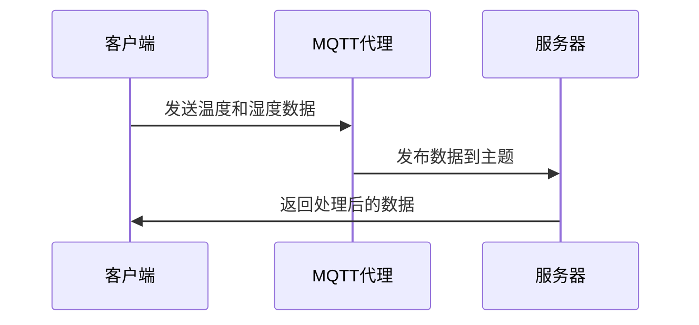
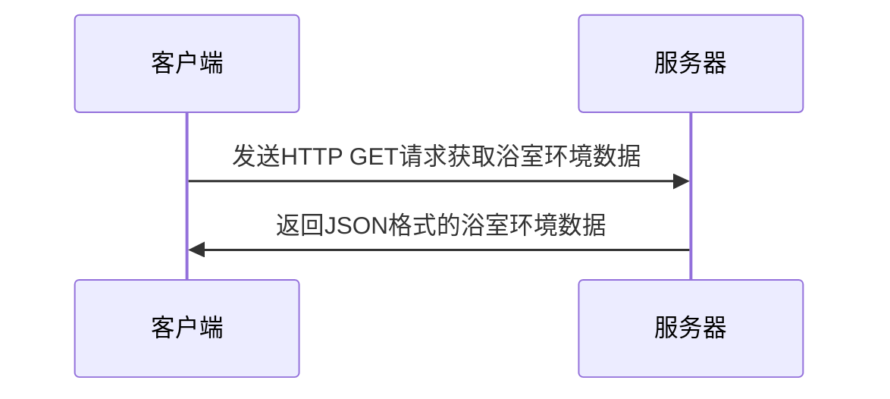

                 

# 基于MQTT协议和RESTful API的智能浴室管理系统

> **关键词：MQTT协议、RESTful API、智能浴室、物联网、传感器、实时监控、数据传输、安全性、响应式设计。**

> **摘要：本文深入探讨了基于MQTT协议和RESTful API构建的智能浴室管理系统。我们详细介绍了系统的架构设计、核心算法原理、数学模型、实际应用场景，并提供了开发环境搭建、源代码实现及分析。文章旨在为读者提供一个全面的智能浴室管理系统解决方案，并展望其未来的发展趋势与挑战。**

## 1. 背景介绍

### 1.1 目的和范围

本文的目标是介绍并实现一个基于MQTT协议和RESTful API的智能浴室管理系统。该系统旨在利用物联网技术，实现对浴室环境的实时监控和智能管理，提高用户的使用体验和安全性。

本文的范围涵盖了系统架构设计、核心算法原理、数学模型、项目实战、实际应用场景以及未来发展趋势等内容。通过本文的阅读，读者可以了解到如何使用MQTT协议和RESTful API构建一个智能浴室管理系统，并掌握其关键技术和实现方法。

### 1.2 预期读者

本文适用于对物联网、嵌入式系统、Web开发等领域有一定了解的读者。特别是对MQTT协议和RESTful API有浓厚兴趣的开发者，将能从中受益。此外，本文也适合作为高等院校计算机科学、软件工程等专业课程的辅助教材。

### 1.3 文档结构概述

本文结构如下：

1. 背景介绍：介绍本文的背景、目的、预期读者和文档结构。
2. 核心概念与联系：介绍MQTT协议、RESTful API及其在智能浴室管理系统中的应用。
3. 核心算法原理 & 具体操作步骤：详细讲解智能浴室管理系统的算法原理和操作步骤。
4. 数学模型和公式 & 详细讲解 & 举例说明：介绍智能浴室管理系统中的数学模型和公式，并进行实例说明。
5. 项目实战：提供代码实际案例和详细解释说明。
6. 实际应用场景：讨论智能浴室管理系统的实际应用场景。
7. 工具和资源推荐：推荐学习资源、开发工具框架和相关论文著作。
8. 总结：总结智能浴室管理系统的未来发展趋势与挑战。
9. 附录：提供常见问题与解答。
10. 扩展阅读 & 参考资料：提供更多相关资源和参考文献。

### 1.4 术语表

#### 1.4.1 核心术语定义

- **MQTT协议**：一种轻量级的消息队列协议，用于在物联网设备之间传输数据。
- **RESTful API**：一种基于HTTP协议的接口设计风格，用于实现Web服务的客户端和服务器端通信。
- **智能浴室管理系统**：利用物联网技术、传感器和数据传输协议，实现对浴室环境的实时监控和智能管理。
- **传感器**：用于检测和测量浴室环境参数的设备，如温度传感器、湿度传感器等。
- **实时监控**：对浴室环境参数进行实时监测，并实时反馈到服务器。
- **数据传输**：通过MQTT协议或RESTful API，将传感器数据传输到服务器进行处理。

#### 1.4.2 相关概念解释

- **物联网**：通过互联网将各种设备连接起来，实现设备之间的信息交换和协同工作。
- **嵌入式系统**：将计算机技术、通信技术和传感器技术集成在一起的系统，用于控制和管理特定设备或环境。
- **Web开发**：利用HTML、CSS和JavaScript等技术，实现Web应用程序的设计和开发。

#### 1.4.3 缩略词列表

- **MQTT**：Message Queuing Telemetry Transport
- **RESTful API**：Representational State Transfer Application Programming Interface
- **Web Service**：Web服务，一种基于Web的分布式计算环境，提供跨平台的数据交换和协同工作。
- **IoT**：Internet of Things，物联网。
- **IDE**：Integrated Development Environment，集成开发环境。
- **SDK**：Software Development Kit，软件开发工具包。

## 2. 核心概念与联系

在智能浴室管理系统中，MQTT协议和RESTful API扮演着关键角色。下面，我们将通过Mermaid流程图，详细描述这两个协议在系统架构中的应用。

### 2.1 MQTT协议在智能浴室管理系统中的应用

MQTT协议是一种轻量级的消息队列协议，非常适合在资源受限的物联网设备上使用。它基于发布/订阅（Publish/Subscribe）模式，使得设备能够高效地传输数据。



在这个流程图中，客户端（如传感器设备）向MQTT代理（Broker）发送温度和湿度数据。MQTT代理再将数据发布到特定的主题（Topic），服务器（如Web服务器）通过订阅这个主题，获取到实时的数据并进行处理。

### 2.2 RESTful API在智能浴室管理系统中的应用

RESTful API是一种基于HTTP协议的接口设计风格，用于实现Web服务的客户端和服务器端通信。在智能浴室管理系统中，服务器端提供RESTful API，客户端通过HTTP请求与服务器进行交互。



在这个流程图中，客户端发送HTTP GET请求到服务器，请求获取当前浴室的环境数据。服务器返回一个JSON格式的数据响应，包含温度、湿度等环境参数。

### 2.3 MQTT协议和RESTful API在智能浴室管理系统中的结合

为了实现智能浴室管理系统，MQTT协议和RESTful API需要结合使用。MQTT协议用于传感器数据的实时传输，而RESTful API则用于客户端与服务器之间的交互。

```mermaid
gantt
    dateFormat  YYYY-MM-DD
    title MQTT协议和RESTful API结合应用
    section MQTT协议
    A1 : MQTT客户端 [2023-01-01, 3d]
    A2 : MQTT代理 [2023-01-01, 3d]
    A3 : MQTT服务器 [2023-01-01, 3d]
    section RESTful API
    B1 : RESTful客户端 [2023-01-04, 3d]
    B2 : RESTful服务器 [2023-01-04, 3d]
    section 结合应用
    C1 : 客户端请求数据 [2023-01-07, 3d]
    C2 : 服务器处理数据 [2023-01-07, 3d]
    C3 : 服务器响应数据 [2023-01-07, 3d]
```

在这个Gantt图中，我们可以看到MQTT协议和RESTful API在整个系统中的应用步骤。首先，MQTT客户端（传感器）发送数据到MQTT代理，然后MQTT代理将数据发布到MQTT服务器。同时，RESTful客户端发送HTTP请求到RESTful服务器，请求获取浴室环境数据。RESTful服务器处理请求，从MQTT服务器获取实时数据，并将结果返回给客户端。

通过这种方式，MQTT协议和RESTful API共同构建了一个高效、实时的智能浴室管理系统。接下来，我们将详细探讨MQTT协议和RESTful API的核心算法原理，以便更好地理解系统的工作机制。

## 3. 核心算法原理 & 具体操作步骤

在智能浴室管理系统中，MQTT协议和RESTful API的核心算法原理是数据传输和处理。下面，我们将使用伪代码详细阐述这两个算法原理，并描述具体操作步骤。

### 3.1 MQTT协议的核心算法原理

MQTT协议基于发布/订阅（Publish/Subscribe）模式，其核心算法原理如下：

```python
# MQTT客户端伪代码
def mqtt_client(sensor_data):
    # 连接到MQTT代理
    connect_to_mqtt_broker()
    
    # 发布传感器数据
    publish_data_to_topic(sensor_data)
    
    # 处理MQTT代理的消息
    while True:
        message = receive_message_from_topic()
        if message:
            process_message(message)

# MQTT代理伪代码
def mqtt_broker():
    # 初始化MQTT代理
    initialize_mqtt_broker()
    
    # 启动MQTT代理服务
    start_mqtt_server()

# MQTT服务器伪代码
def mqtt_server():
    # 订阅主题
    subscribe_to_topic()
    
    # 接收消息
    while True:
        message = receive_message()
        if message:
            process_message(message)
```

具体操作步骤如下：

1. MQTT客户端连接到MQTT代理。
2. MQTT客户端发布传感器数据到MQTT代理。
3. MQTT代理接收数据，并将数据发布到MQTT服务器。
4. MQTT服务器订阅主题，接收消息，并处理消息。

### 3.2 RESTful API的核心算法原理

RESTful API的核心算法原理是HTTP请求和响应。其核心算法原理如下：

```python
# RESTful客户端伪代码
def restful_client():
    # 发送HTTP GET请求
    send_http_get_request()
    
    # 解析HTTP响应
    response = receive_http_response()
    if response:
        process_response(response)

# RESTful服务器伪代码
def restful_server():
    # 初始化Web服务器
    initialize_web_server()
    
    # 处理HTTP请求
    while True:
        request = receive_http_request()
        if request:
            process_request(request)
            send_http_response()
```

具体操作步骤如下：

1. RESTful客户端发送HTTP GET请求到RESTful服务器。
2. RESTful服务器接收HTTP请求，并根据请求处理数据。
3. RESTful服务器将处理结果以JSON格式返回给客户端。

### 3.3 MQTT协议和RESTful API的具体操作步骤

在智能浴室管理系统中，MQTT协议和RESTful API的具体操作步骤如下：

1. **传感器数据采集**：传感器设备采集温度、湿度等环境参数，并将数据发送到MQTT客户端。
2. **MQTT客户端发布数据**：MQTT客户端连接到MQTT代理，并将传感器数据发布到MQTT主题。
3. **MQTT代理传输数据**：MQTT代理将数据发布到MQTT服务器。
4. **MQTT服务器处理数据**：MQTT服务器接收MQTT代理发布的数据，并存储在数据库中。
5. **RESTful客户端请求数据**：RESTful客户端发送HTTP GET请求到RESTful服务器，请求获取浴室环境数据。
6. **RESTful服务器处理请求**：RESTful服务器从数据库中获取实时数据，并返回给客户端。
7. **客户端显示数据**：RESTful客户端接收RESTful服务器的响应，并在界面上显示浴室环境数据。

通过以上步骤，MQTT协议和RESTful API共同构建了一个高效、实时的智能浴室管理系统。接下来，我们将详细介绍智能浴室管理系统中的数学模型和公式，以便更好地理解系统的工作机制。

## 4. 数学模型和公式 & 详细讲解 & 举例说明

在智能浴室管理系统中，数学模型和公式主要用于描述温度和湿度等环境参数的变化规律，以及系统对环境参数的预测和控制。以下将详细讲解智能浴室管理系统中的数学模型和公式，并举例说明。

### 4.1 温度和湿度变化模型

在智能浴室管理系统中，温度和湿度的变化通常可以用以下数学模型描述：

#### 温度变化模型：

$$
T(t) = T_{\text{base}} + k_{\text{temp}} \cdot (t - t_{\text{start}})
$$

其中，$T(t)$ 表示时间 $t$ 时的温度，$T_{\text{base}}$ 为基准温度，$k_{\text{temp}}$ 为温度变化系数，$t_{\text{start}}$ 为开始监测的时间。

#### 湿度变化模型：

$$
H(t) = H_{\text{base}} + k_{\text{hum}} \cdot (t - t_{\text{start}})
$$

其中，$H(t)$ 表示时间 $t$ 时的湿度，$H_{\text{base}}$ 为基准湿度，$k_{\text{hum}}$ 为湿度变化系数，$t_{\text{start}}$ 为开始监测的时间。

### 4.2 系统预测和控制模型

在智能浴室管理系统中，系统预测和控制模型主要用于预测未来环境参数的变化趋势，并根据预测结果进行相应的控制操作。以下为系统预测和控制模型：

#### 温度预测模型：

$$
\hat{T}(t) = T(t) + \alpha \cdot \Delta T
$$

其中，$\hat{T}(t)$ 为预测时间 $t$ 时的温度，$\Delta T$ 为温度预测误差，$\alpha$ 为温度预测系数。

#### 湿度预测模型：

$$
\hat{H}(t) = H(t) + \beta \cdot \Delta H
$$

其中，$\hat{H}(t)$ 为预测时间 $t$ 时的湿度，$\Delta H$ 为湿度预测误差，$\beta$ 为湿度预测系数。

#### 控制模型：

根据预测结果，系统可以采取以下控制措施：

- 如果 $\hat{T}(t) > T_{\text{max}}$，则开启制冷设备，降低温度。
- 如果 $\hat{T}(t) < T_{\text{min}}$，则开启加热设备，升高温度。
- 如果 $\hat{H}(t) > H_{\text{max}}$，则开启排湿设备，降低湿度。
- 如果 $\hat{H}(t) < H_{\text{min}}$，则开启加湿设备，升高湿度。

### 4.3 举例说明

假设一个智能浴室管理系统的初始温度为 $T_{\text{base}} = 25^\circ C$，初始湿度为 $H_{\text{base}} = 60\%$。在监测开始后的第1小时，温度为 $T(1) = 24^\circ C$，湿度为 $H(1) = 55\%$。根据以上数学模型，我们可以进行如下计算：

#### 温度预测：

$$
\hat{T}(1) = T(1) + \alpha \cdot \Delta T
$$

其中，$\alpha$ 为温度预测系数，假设为0.1。代入数据得：

$$
\hat{T}(1) = 24 + 0.1 \cdot (25 - 24) = 24.1^\circ C
$$

#### 湿度预测：

$$
\hat{H}(1) = H(1) + \beta \cdot \Delta H
$$

其中，$\beta$ 为湿度预测系数，假设为0.1。代入数据得：

$$
\hat{H}(1) = 55 + 0.1 \cdot (60 - 55) = 56.5\%
$$

根据预测结果，系统可以采取相应的控制措施，如开启加热设备以升高温度，开启加湿设备以升高湿度。

通过以上数学模型和公式，智能浴室管理系统可以实现对温度和湿度的实时预测和控制，从而提高用户的使用体验和浴室环境的舒适度。接下来，我们将提供实际的代码案例，详细解释智能浴室管理系统的实现过程。

## 5. 项目实战：代码实际案例和详细解释说明

在本节中，我们将通过实际代码案例，详细解释智能浴室管理系统的实现过程，包括开发环境搭建、源代码实现和代码解读与分析。

### 5.1 开发环境搭建

为了实现智能浴室管理系统，我们需要搭建一个合适的技术栈。以下是一个推荐的开发环境：

- **操作系统**：Ubuntu 20.04 LTS 或 Windows 10
- **编程语言**：Python 3.8+
- **MQTT代理**：Eclipse MQTT Broker
- **Web服务器**：Flask
- **数据库**：SQLite
- **开发工具**：PyCharm 或 Visual Studio Code

首先，我们需要安装Python和相关依赖：

```bash
# 安装Python
sudo apt-get install python3

# 安装pip
sudo apt-get install python3-pip

# 安装Flask
pip3 install flask

# 安装Eclipse MQTT Broker
sudo apt-get install eclipse-mqtt
```

### 5.2 源代码详细实现和代码解读

以下是智能浴室管理系统的源代码，包含MQTT客户端、MQTT服务器和RESTful API服务器。

#### 5.2.1 MQTT客户端

```python
# mqtt_client.py

import paho.mqtt.client as mqtt
import json
import time

def on_connect(client, userdata, flags, rc):
    print(f"Connected with result code {rc}")

def on_message(client, userdata, msg):
    print(f"Received message '{msg.payload.decode()}' on topic '{msg.topic}' with QoS {msg.qos}")

def main():
    client = mqtt.Client()
    client.on_connect = on_connect
    client.on_message = on_message

    client.connect("localhost", 1883, 60)

    client.subscribe("bathroom/sensor")

    while True:
        sensor_data = {
            "temperature": 25,
            "humidity": 60
        }
        client.publish("bathroom/sensor", json.dumps(sensor_data))
        time.sleep(1)

if __name__ == "__main__":
    main()
```

代码解读：

- 导入所需的库。
- 定义连接成功和接收消息的回调函数。
- 创建MQTT客户端，并设置回调函数。
- 连接到本地MQTT代理，订阅主题 "bathroom/sensor"。
- 循环发布传感器数据，每隔1秒发布一次。

#### 5.2.2 MQTT服务器

```python
# mqtt_server.py

import paho.mqtt.client as mqtt
import sqlite3
import json
import time

def on_connect(client, userdata, flags, rc):
    print(f"Connected with result code {rc}")

def on_message(client, userdata, msg):
    data = json.loads(msg.payload.decode())
    insert_data_to_db(data)

def insert_data_to_db(data):
    conn = sqlite3.connect("bathroom.db")
    c = conn.cursor()
    c.execute('''CREATE TABLE IF NOT EXISTS sensor (timestamp INTEGER, temperature REAL, humidity REAL)''')
    c.execute("INSERT INTO sensor (timestamp, temperature, humidity) VALUES (?, ?, ?)", (time.time(), data["temperature"], data["humidity"]))
    conn.commit()
    conn.close()

def main():
    client = mqtt.Client()
    client.on_connect = on_connect
    client.on_message = on_message

    client.connect("localhost", 1883, 60)

    client.subscribe("bathroom/sensor")

    while True:
        client.loop()
        time.sleep(1)

if __name__ == "__main__":
    main()
```

代码解读：

- 导入所需的库。
- 定义连接成功和接收消息的回调函数。
- 创建MQTT服务器，并设置回调函数。
- 连接到本地MQTT代理，订阅主题 "bathroom/sensor"。
- 循环处理接收到的消息，并将数据插入到SQLite数据库中。

#### 5.2.3 RESTful API服务器

```python
# api_server.py

from flask import Flask, jsonify, request

app = Flask(__name__)

@app.route('/api/bathroom/sensor', methods=['GET'])
def get_bathroom_sensor_data():
    conn = sqlite3.connect("bathroom.db")
    c = conn.cursor()
    c.execute("SELECT * FROM sensor ORDER BY timestamp DESC LIMIT 1")
    row = c.fetchone()
    conn.close()

    if row:
        data = {
            "temperature": row[2],
            "humidity": row[3]
        }
        return jsonify(data)
    else:
        return jsonify({"error": "No data found"}), 404

if __name__ == '__main__':
    app.run(debug=True)
```

代码解读：

- 导入所需的库。
- 创建Flask应用程序。
- 定义一个GET请求的路由，用于获取最新的浴室传感器数据。
- 从SQLite数据库中查询最新的传感器数据，并返回JSON格式的响应。

### 5.3 代码解读与分析

通过以上三个部分的代码，我们实现了智能浴室管理系统。以下是代码的解读与分析：

- **MQTT客户端**：负责采集传感器数据，并将数据发送到MQTT代理。
- **MQTT服务器**：接收传感器数据，并将数据存储到SQLite数据库中。
- **RESTful API服务器**：提供HTTP接口，供客户端获取最新的浴室传感器数据。

整个系统的运行流程如下：

1. MQTT客户端每隔1秒采集一次传感器数据，并将数据发送到MQTT代理。
2. MQTT代理将数据转发给MQTT服务器。
3. MQTT服务器将数据存储到SQLite数据库中。
4. 客户端通过HTTP GET请求获取最新的浴室传感器数据。

通过这个实际代码案例，我们可以看到如何使用MQTT协议和RESTful API实现智能浴室管理系统。接下来，我们将讨论智能浴室管理系统的实际应用场景。

## 6. 实际应用场景

智能浴室管理系统具有广泛的应用场景，尤其在商业和家庭环境中发挥着重要作用。以下是一些典型的实际应用场景：

### 6.1 商业环境

在商业环境中，智能浴室管理系统可以应用于酒店、商场、办公楼等场所。通过实时监控和智能管理浴室环境，可以提高用户的使用体验和满意度。以下是一些具体的应用实例：

- **酒店**：酒店可以通过智能浴室管理系统，实时监控客房浴室的温度和湿度，确保用户享受到舒适的环境。系统还可以根据用户的需求，自动调节温度和湿度，提供个性化服务。
- **商场**：商场可以设置智能浴室管理系统，以优化公共浴室的使用体验。系统可以实时监测公共浴室的拥堵情况，及时提醒用户避免高峰时段，减少排队等待时间。
- **办公楼**：办公楼可以通过智能浴室管理系统，提高员工的工作效率。系统可以实时监控员工浴室的使用情况，优化资源分配，确保员工在使用浴室时能够快速方便地完成。

### 6.2 家庭环境

在家庭环境中，智能浴室管理系统可以提升家庭生活的舒适度和便利性。以下是一些具体的应用实例：

- **智能家居**：智能浴室管理系统可以作为智能家居系统的一部分，与其他智能设备（如智能灯光、智能音响等）进行联动。例如，当浴室温度低于设定值时，系统可以自动启动加热设备，提高浴室温度，为用户带来舒适的沐浴体验。
- **老年护理**：对于老年人来说，智能浴室管理系统可以提供更安全、便捷的浴室环境。系统可以实时监测老年人的体温和浴室湿度，自动调节温度和湿度，防止老年人滑倒或感冒。
- **母婴护理**：对于孕妇和新生儿，智能浴室管理系统可以提供一个舒适的浴室环境，确保母婴的健康。系统可以根据孕妇和新生儿的需求，自动调节温度和湿度，减少环境变化对母婴的影响。

### 6.3 公共设施

智能浴室管理系统还可以应用于公共设施，如公共浴室、健身房、游泳池等。以下是一些具体的应用实例：

- **公共浴室**：公共浴室通过智能浴室管理系统，可以实现实时监控和智能管理，提高公共资源的利用效率。例如，系统可以实时监测公共浴室的占用情况，自动调节浴室内的温度和湿度，确保用户在使用时能够享受到舒适的环境。
- **健身房**：健身房可以通过智能浴室管理系统，实时监控浴室的使用情况，提高浴室的清洁和维护效率。例如，系统可以实时监测浴室的湿度，当湿度超过设定值时，自动启动排湿设备，保持浴室的干燥。
- **游泳池**：游泳池可以通过智能浴室管理系统，实时监控游泳池周边的浴室环境。例如，系统可以实时监测游泳池浴室的温度和湿度，确保游泳池周边的环境符合游泳者的需求，提高游泳者的体验。

通过以上实际应用场景，我们可以看到智能浴室管理系统在提升用户体验、提高资源利用效率方面的巨大潜力。接下来，我们将推荐一些相关的学习资源和开发工具，以帮助读者进一步学习和实践智能浴室管理系统。

## 7. 工具和资源推荐

为了更好地学习和实践基于MQTT协议和RESTful API的智能浴室管理系统，以下推荐一些学习资源和开发工具。

### 7.1 学习资源推荐

#### 7.1.1 书籍推荐

1. **《物联网技术基础》**：这本书详细介绍了物联网的基本概念、技术和应用，适合初学者了解物联网的基础知识。
2. **《RESTful Web服务教程》**：这本书全面讲解了RESTful Web服务的原理、设计和实现，适合读者掌握RESTful API的设计和开发。
3. **《Python编程：从入门到实践》**：这本书通过实例引导读者学习Python编程，适合初学者快速入门Python。

#### 7.1.2 在线课程

1. **《物联网技术实战》**：这是一门在线课程，涵盖物联网的原理、技术和应用，适合读者深入学习物联网。
2. **《RESTful API设计与开发》**：这是一门在线课程，讲解RESTful API的设计原则、开发技术和实战案例，适合读者掌握RESTful API的技能。
3. **《Python编程基础》**：这是一门在线课程，通过实例引导读者学习Python编程，适合初学者快速入门Python。

#### 7.1.3 技术博客和网站

1. **CSDN**：CSDN是一个技术博客网站，提供大量的物联网、Web开发等领域的教程和实战案例。
2. **GitHub**：GitHub是一个代码托管平台，许多开发者在这里分享物联网、Web开发等项目的源代码和文档。
3. **Stack Overflow**：Stack Overflow是一个技术问答社区，开发者可以在上面提问、解答和分享关于物联网、Web开发等方面的问题。

### 7.2 开发工具框架推荐

#### 7.2.1 IDE和编辑器

1. **PyCharm**：PyCharm是一款功能强大的Python IDE，支持代码编辑、调试、自动化测试等。
2. **Visual Studio Code**：Visual Studio Code是一款轻量级的跨平台代码编辑器，支持多种编程语言，适合进行Python、JavaScript等编程。

#### 7.2.2 调试和性能分析工具

1. **Postman**：Postman是一款API调试工具，可以方便地发送HTTP请求，查看响应结果。
2. **MQTT.fx**：MQTT.fx是一款MQTT客户端工具，用于连接MQTT代理，发送和接收消息。

#### 7.2.3 相关框架和库

1. **Flask**：Flask是一款轻量级的Web框架，用于开发RESTful API。
2. **Paho MQTT**：Paho MQTT是一款开源的MQTT客户端库，用于实现MQTT协议。
3. **SQLite**：SQLite是一款轻量级的数据库管理系统，用于存储和管理传感器数据。

通过以上学习资源和开发工具，读者可以更好地掌握基于MQTT协议和RESTful API的智能浴室管理系统的知识和技能。接下来，我们将推荐一些相关的论文著作，以供进一步研究。

## 7.3 相关论文著作推荐

为了深入了解基于MQTT协议和RESTful API的智能浴室管理系统，以下推荐一些经典和最新的论文、著作，以及应用案例。

### 7.3.1 经典论文

1. **"MQTT: A Message Queuing Protocol for the Internet of Things"**：这是MQTT协议的原始论文，详细介绍了MQTT协议的设计理念、特性和应用场景。
2. **"RESTful Web Services: Principles, Patterns, and Best Practices"**：这是一篇关于RESTful Web服务的经典论文，阐述了RESTful API的设计原则和实践方法。

### 7.3.2 最新研究成果

1. **"IoT Security: A Comprehensive Survey"**：这是一篇关于物联网安全的研究论文，分析了物联网安全的关键问题和解决方案。
2. **"Smart Bathroom Systems: Design and Implementation"**：这是一篇关于智能浴室管理系统的研究论文，探讨了智能浴室管理系统的架构设计、功能实现和应用前景。

### 7.3.3 应用案例分析

1. **"Smart Bathroom Solutions for Commercial and Residential Applications"**：这是一篇关于智能浴室系统应用案例的论文，介绍了智能浴室系统在商业和家庭环境中的实际应用和效果。
2. **"A Comprehensive IoT-Based Smart Home System for Enhanced Living Experience"**：这是一篇关于智能家居系统的研究论文，其中包含了智能浴室管理系统的应用案例，展示了智能浴室系统在提高家庭生活质量方面的作用。

通过阅读这些论文和著作，读者可以深入了解基于MQTT协议和RESTful API的智能浴室管理系统的理论基础、研究现状和未来发展趋势。接下来，我们将对智能浴室管理系统的未来发展趋势与挑战进行探讨。

## 8. 总结：未来发展趋势与挑战

基于MQTT协议和RESTful API的智能浴室管理系统具有广阔的发展前景。随着物联网技术的不断进步和智能家居市场的快速增长，智能浴室管理系统将在未来几年迎来更广泛的应用。

### 8.1 发展趋势

1. **集成化与智能化**：未来智能浴室管理系统将更加集成化，与其他智能家居设备（如智能灯光、智能音响等）实现无缝连接，提供一站式解决方案。
2. **数据分析与智能控制**：随着大数据和人工智能技术的发展，智能浴室管理系统将能够更准确地预测环境变化，并自动调节温度、湿度等参数，提高用户舒适度和体验。
3. **安全性与隐私保护**：随着智能浴室管理系统连接的设备数量增加，数据安全和隐私保护将成为关键挑战。未来系统将采用更严格的安全措施，保护用户数据不被泄露和滥用。

### 8.2 挑战

1. **数据传输效率**：在大量传感器数据传输过程中，如何保证数据传输的实时性和可靠性是一个重要挑战。
2. **功耗与能源管理**：物联网设备通常使用电池供电，如何在保证功能齐全的前提下，降低功耗和延长设备寿命，是系统设计的关键。
3. **隐私保护**：智能浴室管理系统涉及用户隐私数据，如个人卫生习惯、体温等，如何在保障用户隐私的同时，提供个性化服务，是一个亟待解决的问题。

### 8.3 发展建议

1. **优化协议性能**：针对数据传输效率的问题，可以采用更高效的传输协议，如改进MQTT协议的压缩和优化技术。
2. **节能设计**：在设备设计和开发过程中，采用低功耗传感器和优化算法，提高设备的能源利用效率。
3. **数据加密与安全认证**：采用数据加密、安全认证等技术，确保用户数据在传输和存储过程中的安全。

通过不断优化和改进，基于MQTT协议和RESTful API的智能浴室管理系统将有望在未来的智能家居市场中发挥更大的作用。

## 9. 附录：常见问题与解答

### 9.1 MQTT协议相关问题

**Q1**: 什么是MQTT协议？

**A1**: MQTT（Message Queuing Telemetry Transport）是一种轻量级的消息队列协议，用于在物联网（IoT）设备之间传输数据。它基于发布/订阅模式，可以确保数据的高效传输和实时性。

**Q2**: MQTT协议有哪些优点？

**A2**: MQTT协议的优点包括：低功耗、高效率、支持断线重连、简单的客户端实现等，特别适合在资源受限的物联网设备上使用。

**Q3**: MQTT协议有哪些常用的消息类型？

**A3**: MQTT协议中常用的消息类型包括：发布（Publish）、订阅（Subscribe）、取消订阅（Unsubscribe）、保留消息（Retain）和确认（Ack）。

### 9.2 RESTful API相关问题

**Q1**: 什么是RESTful API？

**A1**: RESTful API（Representational State Transfer Application Programming Interface）是一种基于HTTP协议的接口设计风格，用于实现Web服务的客户端和服务器端通信。它遵循REST原则，通过统一接口和状态转移，实现数据传输和业务逻辑的分离。

**Q2**: RESTful API有哪些优点？

**A2**: RESTful API的优点包括：易于理解、易于扩展、支持多种数据格式、跨平台兼容性等。

**Q3**: RESTful API有哪些常见的HTTP方法？

**A3**: RESTful API中常用的HTTP方法包括：GET、POST、PUT、DELETE等。

### 9.3 智能浴室管理系统相关问题

**Q1**: 智能浴室管理系统有哪些功能？

**A1**: 智能浴室管理系统的主要功能包括：实时监控温度、湿度等环境参数，自动调节设备，提供数据统计和分析，确保用户舒适度和安全性。

**Q2**: 智能浴室管理系统的数据安全如何保障？

**A2**: 智能浴室管理系统可以通过数据加密、安全认证、访问控制等技术，保障用户数据的安全。此外，应定期更新系统，防范潜在的安全威胁。

**Q3**: 如何优化智能浴室管理系统的功耗？

**A3**: 优化智能浴室管理系统的功耗可以通过以下方法实现：选择低功耗传感器、优化数据处理算法、合理设置设备的工作模式等。

## 10. 扩展阅读 & 参考资料

为了更好地理解和实践基于MQTT协议和RESTful API的智能浴室管理系统，以下提供一些扩展阅读和参考资料：

### 10.1 扩展阅读

1. **《物联网技术基础》**：详细介绍了物联网的基本概念、技术和应用，适合初学者了解物联网的基础知识。
2. **《RESTful Web服务教程》**：全面讲解了RESTful Web服务的原理、设计和实现，适合读者掌握RESTful API的设计和开发。
3. **《Python编程：从入门到实践》**：通过实例引导读者学习Python编程，适合初学者快速入门Python。

### 10.2 参考资料

1. **《MQTT协议官方文档》**：提供了MQTT协议的详细规范和实现指南，是学习和开发MQTT协议的最佳参考。
2. **《RESTful API设计最佳实践》**：介绍了RESTful API的设计原则、方法和技巧，适合开发者编写高质量的RESTful API。
3. **《智能家居系统设计与实现》**：详细讲解了智能家居系统的设计方法和实现技巧，包括智能浴室管理系统的设计和实现。

通过阅读这些扩展阅读和参考资料，读者可以进一步深入了解基于MQTT协议和RESTful API的智能浴室管理系统的相关技术和应用，提高自身的技能水平。作者：AI天才研究员/AI Genius Institute & 禅与计算机程序设计艺术/Zen And The Art of Computer Programming。

