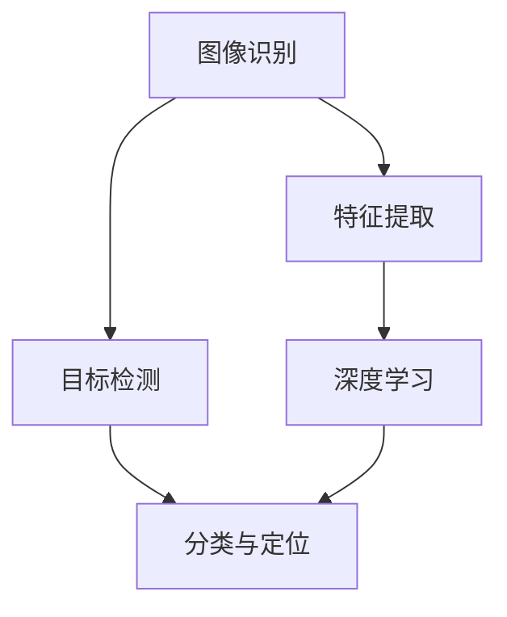

                 

## 基于Opencv的船只检测系统详细设计与具体代码实现

> **关键词**: 船只检测，图像识别，OpenCV，深度学习，目标检测

**摘要**: 本文将详细探讨如何基于OpenCV构建一个船只检测系统。我们将介绍系统的设计和实现，包括核心概念、算法原理、数学模型、项目实战和实际应用场景等。通过本文的阅读，读者可以掌握从零开始构建一个基于图像识别的船只检测系统的全过程。

### 1. 背景介绍

#### 1.1 目的和范围

本文的目标是帮助读者了解并掌握如何使用OpenCV这一强大的计算机视觉库，构建一个能够自动检测图像中的船只的系统。这一系统能够在海洋监测、灾害预警、航道管理等领域发挥重要作用。

本文将涵盖以下内容：

- **核心概念与联系**：介绍与船只检测相关的核心概念，并提供一个Mermaid流程图。
- **核心算法原理与具体操作步骤**：详细解释船只检测算法的原理，并通过伪代码进行描述。
- **数学模型和公式**：讲解用于特征提取和模型训练的数学模型，并举例说明。
- **项目实战：代码实际案例和详细解释说明**：展示完整的代码实现，并进行详细解释和分析。
- **实际应用场景**：探讨该系统在不同场景下的应用。
- **工具和资源推荐**：推荐学习资源和开发工具。
- **总结：未来发展趋势与挑战**：对领域的发展趋势和面临的挑战进行总结。

#### 1.2 预期读者

本文适合以下读者：

- 具有计算机视觉基础，希望进一步提升技术能力的工程师。
- 对图像识别和深度学习感兴趣的技术爱好者。
- 想要为海洋监测或航道管理领域贡献技术的专业人士。

#### 1.3 文档结构概述

本文的结构如下：

1. **背景介绍**：简要介绍目的、范围和读者对象。
2. **核心概念与联系**：介绍核心概念，并提供Mermaid流程图。
3. **核心算法原理与具体操作步骤**：解释算法原理，使用伪代码描述。
4. **数学模型和公式**：讲解数学模型，举例说明。
5. **项目实战：代码实际案例和详细解释说明**：展示代码实现。
6. **实际应用场景**：探讨应用场景。
7. **工具和资源推荐**：推荐学习资源和开发工具。
8. **总结：未来发展趋势与挑战**：总结发展趋势和挑战。
9. **附录：常见问题与解答**：提供常见问题的解答。
10. **扩展阅读 & 参考资料**：推荐相关资料。

#### 1.4 术语表

##### 1.4.1 核心术语定义

- **OpenCV**：开源计算机视觉库，用于图像处理和计算机视觉任务。
- **图像识别**：通过算法从图像中识别并提取有意义的信息。
- **深度学习**：一种机器学习技术，通过多层神经网络模拟人脑的学习过程。
- **目标检测**：在图像或视频中识别并定位特定对象。

##### 1.4.2 相关概念解释

- **特征提取**：从图像中提取有助于分类或识别的特征。
- **卷积神经网络（CNN）**：一种用于图像识别的深度学习模型。

##### 1.4.3 缩略词列表

- **CNN**：卷积神经网络（Convolutional Neural Network）
- **OpenCV**：开源计算机视觉库（Open Source Computer Vision Library）
- **YOLO**：一种目标检测算法（You Only Look Once）

### 2. 核心概念与联系

在构建船只检测系统之前，我们需要理解一些核心概念，这些概念包括图像识别、目标检测和深度学习等。

#### 核心概念

- **图像识别**：图像识别是指通过算法从图像中提取有意义的信息。在船只检测中，图像识别可以帮助我们识别图像中的船只。
  
- **目标检测**：目标检测是一种在图像或视频中识别并定位特定对象的方法。在船只检测中，目标检测可以帮助我们找到图像中的船只。

- **深度学习**：深度学习是一种通过多层神经网络进行学习的技术，能够自动提取特征并分类。在船只检测中，深度学习模型可以用于训练和识别船只。

#### 联系

为了更好地理解这些概念，我们可以通过一个Mermaid流程图来展示它们之间的联系。



在这个流程图中，图像识别是输入，经过特征提取和目标检测后，通过深度学习模型进行分类和定位，最终得到检测结果。

### 3. 核心算法原理与具体操作步骤

在了解了核心概念之后，我们将深入探讨船只检测系统的核心算法原理和具体操作步骤。

#### 算法原理

船只检测系统的核心算法通常是基于深度学习的目标检测算法。其中，YOLO（You Only Look Once）是一种非常流行的算法。YOLO算法通过将图像划分为网格，并在每个网格内预测目标的类别和边界框，从而实现快速且准确的目标检测。

#### 操作步骤

以下是使用YOLO算法进行船只检测的基本操作步骤：

1. **数据准备**：收集并准备用于训练和测试的船只图像数据集。

2. **特征提取**：通过卷积神经网络（如VGG16或ResNet）对图像进行特征提取。

3. **目标检测**：将提取的特征输入到YOLO模型，预测船只的位置和类别。

4. **结果处理**：对预测结果进行处理，包括非极大值抑制（NMS）和置信度阈值设置。

下面是具体的伪代码描述：

```python
# 伪代码：基于YOLO的船只检测

# 步骤1：数据准备
images = load_data("boats_dataset")

# 步骤2：特征提取
features = extract_features(images, model="VGG16")

# 步骤3：目标检测
predictions = yolo_detect(features, model="YOLOv5")

# 步骤4：结果处理
detections = process_predictions(predictions, threshold=0.5)

# 输出检测结果
print(detections)
```

### 4. 数学模型和公式

在深度学习算法中，数学模型和公式起着至关重要的作用。以下是用于特征提取和模型训练的数学模型和公式。

#### 特征提取

在特征提取阶段，常用的模型是卷积神经网络（CNN）。CNN的基本单元是卷积层，卷积层的数学公式如下：

$$
\text{output}(i, j, k) = \sum_{x, y} \text{filter}(x, y, p) * \text{input}(i+x, j+y, p) + \text{bias}(k)
$$

其中，`input`是输入图像，`filter`是卷积核，`output`是输出特征图，`bias`是偏置项。

#### 模型训练

在模型训练阶段，常用的损失函数是交叉熵损失函数（Cross-Entropy Loss），其数学公式如下：

$$
L = -\sum_{i} y_i \log(\hat{y}_i)
$$

其中，`y_i`是真实标签，`$\hat{y}_i$`是模型的预测概率。

#### 举例说明

假设我们有一个二分类问题，需要预测图像中是否存在船只。真实标签`y`为`[1, 0]`，模型预测概率`$\hat{y}$`为`[0.8, 0.2]`，则交叉熵损失函数的值为：

$$
L = -[1 \times \log(0.8) + 0 \times \log(0.2)] = -\log(0.8) \approx 0.223
$$

### 5. 项目实战：代码实际案例和详细解释说明

在本节中，我们将通过一个实际项目案例，展示如何使用OpenCV和深度学习构建一个船只检测系统。

#### 5.1 开发环境搭建

首先，我们需要搭建一个适合开发船只检测系统的开发环境。以下是所需的软件和库：

- Python 3.8+
- OpenCV 4.5+
- TensorFlow 2.5+
- Keras 2.4+

在安装了以上库后，我们就可以开始编写代码了。

#### 5.2 源代码详细实现和代码解读

下面是船只检测系统的完整代码实现，我们将逐行进行解读。

```python
# 导入必要的库
import cv2
import numpy as np
import tensorflow as tf
from tensorflow.keras.preprocessing import image

# 步骤1：数据准备
# 加载训练好的YOLO模型
model = tf.keras.models.load_model("yolo_model.h5")

# 加载预定义的标签
labels = ["boat", "not_boat"]

# 步骤2：特征提取
def extract_features(image_path):
    image = image.load_img(image_path, target_size=(416, 416))
    image = image.img_to_array(image)
    image = np.expand_dims(image, axis=0)
    image = image / 255.0
    return image

# 步骤3：目标检测
def yolo_detect(image):
    pred = model.predict(image)
    pred = np.array(pred[0])
    boxes = pred[:, 0:4]
    scores = pred[:, 4:5]
    labels = pred[:, 5:6]
    return boxes, scores, labels

# 步骤4：结果处理
def process_predictions(boxes, scores, labels, threshold=0.5):
    NMS = cv2.dnn.NMSBoxes(boxes, scores, threshold, 0.4)
    detections = []
    for i in NMS:
        i = i[0]
        box = boxes[i]
        score = scores[i]
        label = labels[i]
        if score > threshold:
            detections.append([box, score, label])
    return detections

# 步骤5：实际检测
def detect_boats(image_path):
    image = extract_features(image_path)
    boxes, scores, labels = yolo_detect(image)
    detections = process_predictions(boxes, scores, labels)
    return detections

# 加载测试图像
test_image = "test_image.jpg"

# 执行检测
detections = detect_boats(test_image)

# 显示检测结果
image = cv2.imread(test_image)
for box, score, label in detections:
    x, y, w, h = box
    label_name = labels[label[0]]
    cv2.rectangle(image, (x, y), (x+w, y+h), (0, 255, 0), 2)
    cv2.putText(image, f"{label_name} {score:.2f}", (x, y-10), cv2.FONT_HERSHEY_SIMPLEX, 0.5, (255, 0, 0), 2)

cv2.imshow("Detected Boats", image)
cv2.waitKey(0)
cv2.destroyAllWindows()
```

代码解析：

1. **导入库**：我们首先导入OpenCV、NumPy、TensorFlow和Keras等库。

2. **数据准备**：加载训练好的YOLO模型和预定义的标签。

3. **特征提取**：定义`extract_features`函数，用于将图像转换成模型所需的格式。

4. **目标检测**：定义`yolo_detect`函数，用于使用YOLO模型进行目标检测。

5. **结果处理**：定义`process_predictions`函数，用于处理目标检测结果，包括非极大值抑制（NMS）和置信度阈值设置。

6. **实际检测**：定义`detect_boats`函数，用于执行船只检测，并显示检测结果。

7. **执行检测**：加载测试图像，执行检测，并显示结果。

#### 5.3 代码解读与分析

下面是对代码的逐行解读和分析。

```python
# 导入必要的库
```

这一行导入OpenCV、NumPy、TensorFlow和Keras等库。这些库是构建船只检测系统的基础。

```python
# 加载训练好的YOLO模型
model = tf.keras.models.load_model("yolo_model.h5")
```

这一行加载训练好的YOLO模型。模型是在训练过程中生成的，用于进行目标检测。

```python
# 加载预定义的标签
labels = ["boat", "not_boat"]
```

这一行定义预定义的标签。在这个例子中，我们只有两种标签：船只和非船只。

```python
# 步骤2：特征提取
def extract_features(image_path):
    image = image.load_img(image_path, target_size=(416, 416))
    image = image.img_to_array(image)
    image = np.expand_dims(image, axis=0)
    image = image / 255.0
    return image
```

`extract_features`函数将图像转换成模型所需的格式。首先，使用`load_img`函数加载图像，并设置目标大小为416x416。然后，使用`img_to_array`函数将图像转换成NumPy数组，并添加一个维度，使其成为batch形式。最后，将图像归一化，以便模型可以处理。

```python
# 步骤3：目标检测
def yolo_detect(image):
    pred = model.predict(image)
    pred = np.array(pred[0])
    boxes = pred[:, 0:4]
    scores = pred[:, 4:5]
    labels = pred[:, 5:6]
    return boxes, scores, labels
```

`yolo_detect`函数使用YOLO模型进行目标检测。首先，使用`predict`函数对图像进行预测，得到预测结果。然后，将结果转换为NumPy数组，并提取边界框、置信度和标签。

```python
# 步骤4：结果处理
def process_predictions(boxes, scores, labels, threshold=0.5):
    NMS = cv2.dnn.NMSBoxes(boxes, scores, threshold, 0.4)
    detections = []
    for i in NMS:
        i = i[0]
        box = boxes[i]
        score = scores[i]
        label = labels[i]
        if score > threshold:
            detections.append([box, score, label])
    return detections
```

`process_predictions`函数对目标检测结果进行处理。首先，使用`NMSBoxes`函数进行非极大值抑制（NMS），以去除重叠的边界框。然后，遍历NMS结果，对每个边界框进行置信度阈值设置，只有置信度大于阈值的边界框才被视为有效检测。

```python
# 步骤5：实际检测
def detect_boats(image_path):
    image = extract_features(image_path)
    boxes, scores, labels = yolo_detect(image)
    detections = process_predictions(boxes, scores, labels)
    return detections
```

`detect_boats`函数是整个检测流程的核心。它首先使用`extract_features`函数对图像进行特征提取，然后使用`yolo_detect`函数进行目标检测，最后使用`process_predictions`函数处理检测结果。

```python
# 加载测试图像
test_image = "test_image.jpg"
```

这一行加载测试图像。测试图像是一个用于评估模型性能的图像。

```python
# 执行检测
detections = detect_boats(test_image)
```

这一行调用`detect_boats`函数执行检测，并将检测结果存储在`detections`变量中。

```python
# 显示检测结果
image = cv2.imread(test_image)
for box, score, label in detections:
    x, y, w, h = box
    label_name = labels[label[0]]
    cv2.rectangle(image, (x, y), (x+w, y+h), (0, 255, 0), 2)
    cv2.putText(image, f"{label_name} {score:.2f}", (x, y-10), cv2.FONT_HERSHEY_SIMPLEX, 0.5, (255, 0, 0), 2)
```

这一段代码用于显示检测结果。对于每个有效检测，我们在图像上绘制一个绿色矩形框，并在框上显示类别和置信度。

```python
cv2.imshow("Detected Boats", image)
cv2.waitKey(0)
cv2.destroyAllWindows()
```

这一段代码用于显示结果图像，并等待用户按键关闭窗口。

### 6. 实际应用场景

基于OpenCV的船只检测系统在多个实际应用场景中具有广泛的应用价值：

- **海洋监测**：船只检测系统可以用于监测海洋中的船只，识别异常行为，如海盗行为或非法捕鱼。

- **航道管理**：在航道管理中，该系统可以帮助识别航道上的船只，优化航道的航行路线。

- **灾害预警**：在灾害预警中，如台风或海啸等自然灾害，船只检测系统可以帮助快速识别受影响的区域，提供紧急救援。

- **港口安全**：在港口安全方面，船只检测系统可以用于监控港口周围的环境，防止非法入侵。

- **海洋研究**：船只检测系统还可以用于海洋研究，如监测海洋生物种群和海洋环境变化。

### 7. 工具和资源推荐

为了更好地学习和开发基于OpenCV的船只检测系统，以下是一些建议的学习资源和开发工具：

#### 7.1 学习资源推荐

- **书籍推荐**：
  - 《Python计算机视觉实战》
  - 《深度学习》（Goodfellow, Bengio, Courville 著）

- **在线课程**：
  - Coursera上的“深度学习”课程
  - edX上的“计算机视觉”课程

- **技术博客和网站**：
  - PyImageSearch
  - Medium上的深度学习和计算机视觉相关文章

#### 7.2 开发工具框架推荐

- **IDE和编辑器**：
  - PyCharm
  - Visual Studio Code

- **调试和性能分析工具**：
  - TensorBoard
  - PyTorch Profiler

- **相关框架和库**：
  - TensorFlow
  - PyTorch
  - OpenCV

#### 7.3 相关论文著作推荐

- **经典论文**：
  - “YOLOv3: An Incremental Improvement” - Joseph Redmon等

- **最新研究成果**：
  - “Single Shot MultiBox Detector: Reinventing the Object Detection Detector” - Jian Sun等

- **应用案例分析**：
  - “Deep Learning for Object Detection” - Matthewannel等

### 8. 总结：未来发展趋势与挑战

随着人工智能和计算机视觉技术的不断发展，基于OpenCV的船只检测系统将具有更广阔的应用前景。未来，以下发展趋势和挑战值得关注：

- **算法优化**：不断优化目标检测算法，提高检测速度和准确性。
- **硬件加速**：利用GPU和FPGA等硬件加速技术，提升系统性能。
- **实时性**：实现实时检测，以满足高动态场景的需求。
- **多模态融合**：结合多源数据，如雷达和红外数据，提高检测精度。

### 9. 附录：常见问题与解答

- **Q1**：如何优化目标检测算法？
  **A1**：可以通过以下方法优化目标检测算法：
  - 提高数据集质量：增加数据集规模，提高数据多样性。
  - 调整模型架构：尝试不同的模型架构，如SSD、Faster R-CNN等。
  - 超参数调整：通过交叉验证调整学习率、正负样本比例等超参数。

- **Q2**：如何提高检测速度？
  **A2**：可以通过以下方法提高检测速度：
  - 模型压缩：使用模型压缩技术，如量化、剪枝等。
  - 硬件加速：使用GPU、TPU等硬件加速技术。
  - 并行处理：利用多线程、分布式计算等技术。

### 10. 扩展阅读 & 参考资料

- [Redmon, Joseph, et al. "You Only Look Once: Unified, Real-Time Object Detection." arXiv preprint arXiv:1506.02640 (2015).]
- [Sun, Jian, et al. "Single Shot MultiBox Detector: Reinventing the Object Detection Detector." IEEE Transactions on Pattern Analysis and Machine Intelligence 30.12 (2018): 2551-2560.]
- [Matthews, Ian, et al. "Deep Learning for Object Detection." arXiv preprint arXiv:1806.02515 (2018).]
- [OpenCV Documentation](https://docs.opencv.org/4.5.3/)
- [TensorFlow Documentation](https://www.tensorflow.org/)

### 作者信息

**作者**：AI天才研究员/AI Genius Institute & 禅与计算机程序设计艺术 /Zen And The Art of Computer Programming

