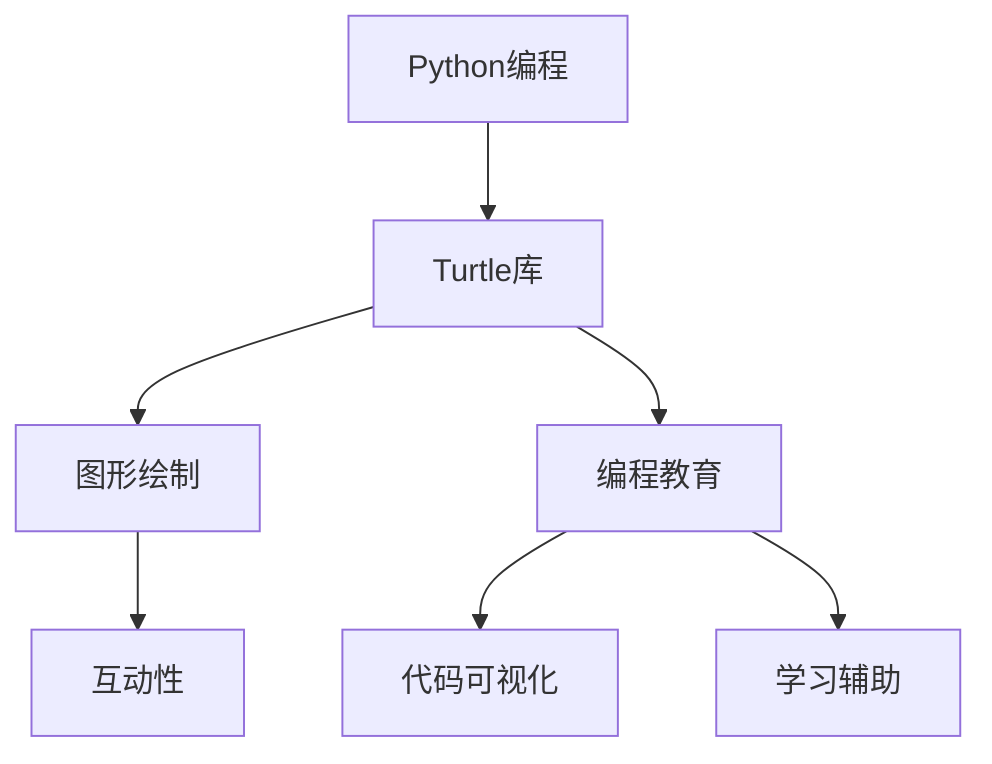
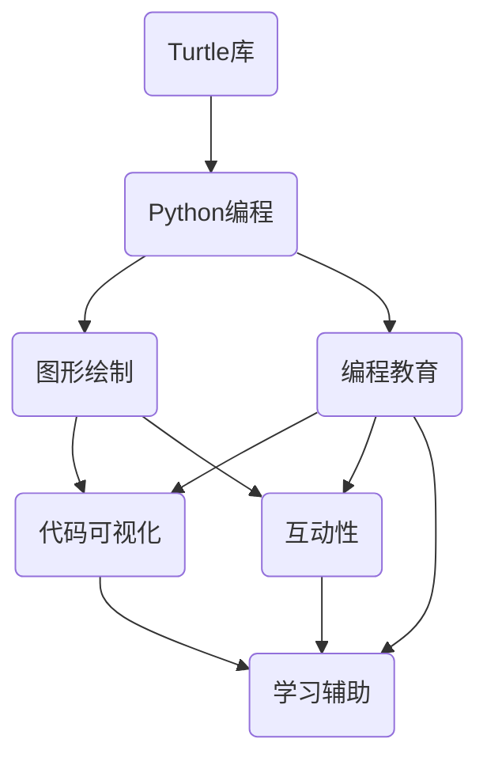

                 

# 基于Python-Turtle库的扩展助学小程序可视化实现

> **关键词：**Python、Turtle库、可视化、助学小程序、编程教育
> 
> **摘要：**本文旨在探讨如何使用Python中的Turtle库构建扩展性强的助学小程序，通过可视化手段帮助学生更好地理解和掌握编程知识。文章首先介绍了Turtle库的基本原理，然后详细阐述了扩展助学小程序的设计思路、实现方法及实际案例，最后讨论了其应用前景。

## 1. 背景介绍

### 1.1 目的和范围

编程教育作为现代教育的核心内容，越来越受到重视。然而，对于初学者来说，编程学习过程中往往面临诸多困难，如理解代码逻辑、掌握编程语言特性等。为了提高编程学习的趣味性和可理解性，可视化工具应运而生。Python的Turtle库作为可视化编程的工具之一，具有易用性和丰富的功能，可以有效地辅助编程教学。

本文的目的在于探讨如何利用Python的Turtle库开发扩展性强的助学小程序，通过可视化的方式帮助学生更好地学习和掌握编程知识。本文的范围包括Turtle库的基本使用、扩展功能开发、实际应用案例及其在教育领域的潜在价值。

### 1.2 预期读者

本文主要面向以下几类读者：

1. **编程教育者**：希望通过Turtle库提高教学效果，设计更具吸引力的课程内容。
2. **编程初学者**：希望通过可视化工具更好地理解编程概念和逻辑。
3. **Python程序员**：对Turtle库的应用有兴趣，希望了解其在教育领域的潜力。

### 1.3 文档结构概述

本文结构如下：

1. **背景介绍**：介绍文章的目的、范围及预期读者。
2. **核心概念与联系**：阐述Turtle库的基本原理及其在教育中的应用。
3. **核心算法原理 & 具体操作步骤**：讲解Turtle库的使用方法及其扩展开发。
4. **数学模型和公式 & 详细讲解 & 举例说明**：介绍与编程教育相关的数学模型和公式。
5. **项目实战：代码实际案例和详细解释说明**：提供实际助学小程序的代码实现和解读。
6. **实际应用场景**：讨论Turtle库在编程教育中的具体应用场景。
7. **工具和资源推荐**：推荐相关学习资源、开发工具和经典论文。
8. **总结：未来发展趋势与挑战**：展望Turtle库在教育领域的未来发展方向。
9. **附录：常见问题与解答**：回答读者可能遇到的问题。
10. **扩展阅读 & 参考资料**：提供进一步阅读的资源。

### 1.4 术语表

#### 1.4.1 核心术语定义

- **Python**：一种高级编程语言，广泛应用于数据科学、人工智能、网络开发等多个领域。
- **Turtle库**：Python的标准库之一，提供绘图和图形界面设计功能，常用于教学和演示。
- **可视化**：将抽象的数据和概念以图形化的形式展示，便于理解和分析。
- **助学小程序**：利用编程技术开发的辅助教学工具，通过互动和可视化手段提高学习效果。

#### 1.4.2 相关概念解释

- **编程教育**：教授编程语言和算法，帮助学生掌握编程知识和技能。
- **扩展性**：指系统或应用程序能够适应未来需求变化的能力。

#### 1.4.3 缩略词列表

- **IDE**：集成开发环境（Integrated Development Environment）
- **LaTeX**：一种排版系统，广泛用于科学文档排版。

## 2. 核心概念与联系

在探讨如何使用Python的Turtle库构建助学小程序之前，我们需要先了解其核心原理和应用场景。以下是一个简化的Mermaid流程图，展示Turtle库的基本原理和其在编程教育中的关键联系：



### 2.1 Turtle库的基本原理

Python的Turtle库是基于图形界面的编程工具，通过模拟一只海龟在屏幕上移动、绘制线条和图形，实现了编程的图形化展示。Turtle库的核心功能包括：

- **绘图功能**：提供多种绘图命令，如`forward()`、`backward()`、`left()`、`right()`等，用于控制海龟的移动和绘图。
- **图形控制**：允许用户自定义海龟的颜色、形状和路径。
- **文本功能**：支持在绘图区域显示文字，常用于编程注释或解释。
- **图形接口**：提供图形用户界面（GUI），使编程过程更加直观和有趣。

### 2.2 教育领域的应用

Turtle库在教育领域的应用主要体现在以下几个方面：

- **代码可视化**：通过Turtle库绘制的图形，使得代码的执行过程直观可见，帮助学生更好地理解代码逻辑。
- **互动性**：用户可以实时调整代码参数，观察图形变化，从而加深对编程概念的理解。
- **学习辅助**：Turtle库提供的丰富绘图命令和图形接口，可以作为编程学习的辅助工具，帮助初学者逐步掌握编程知识。

### 2.3 Mermaid流程图

以下是一个详细的Mermaid流程图，展示了Turtle库在教育领域中的核心应用和联系：



通过这个流程图，我们可以清晰地看到Turtle库在Python编程、图形绘制、编程教育等多个方面的联系和作用。

## 3. 核心算法原理 & 具体操作步骤

### 3.1 Turtle库的使用方法

要使用Python的Turtle库，首先需要了解其基本语法和常用函数。以下是一个简单的示例代码，展示了如何启动Turtle图形界面并绘制一个正方形：

```python
import turtle

# 创建海龟对象
t = turtle.Turtle()

# 设置海龟的颜色和填充颜色
t.color("blue", "yellow")
t.pensize(3)

# 绘制正方形
for i in range(4):
    t.forward(100)
    t.right(90)

# 隐藏海龟的轨迹
t.hideturtle()

# 显示绘图窗口
turtle.mainloop()
```

在这个示例中，我们首先导入了turtle模块，然后创建了一个Turtle对象`t`。通过`t.forward(100)`和`t.right(90)`函数，我们让海龟向前移动100个像素，然后向右旋转90度，从而绘制了一个边长为100像素的正方形。

### 3.2 Turtle库的扩展开发

Turtle库不仅提供了基本的绘图功能，还支持自定义函数和类，从而实现更复杂的图形绘制和交互功能。以下是一个扩展示例，展示了如何使用自定义函数绘制一个五角星：

```python
import turtle

# 定义绘制五角星的函数
def draw_star(t, length, angle):
    for i in range(5):
        t.forward(length)
        t.right(angle)

# 创建海龟对象
t = turtle.Turtle()

# 设置海龟的颜色和填充颜色
t.color("red", "black")
t.pensize(2)

# 调用自定义函数绘制五角星
draw_star(t, 100, 144)

# 隐藏海龟的轨迹
t.hideturtle()

# 显示绘图窗口
turtle.mainloop()
```

在这个扩展示例中，我们定义了一个名为`draw_star`的函数，用于绘制五角星。这个函数接收三个参数：海龟对象`t`、五角星的边长`length`和内角`angle`。通过循环调用`t.forward()`和`t.right()`函数，我们实现了五角星的绘制。

### 3.3 具体操作步骤

以下是使用Turtle库进行扩展性助学小程序开发的具体操作步骤：

1. **需求分析**：明确助学小程序的目标和功能，如绘制图形、实现交互等。
2. **设计架构**：根据需求设计程序的整体架构，包括模块划分、函数定义等。
3. **编写代码**：使用Python语言和Turtle库编写具体的代码实现。
4. **调试与测试**：运行程序，检查并修复可能出现的错误。
5. **优化与扩展**：根据测试结果对程序进行优化，并添加新功能以提高扩展性。
6. **用户反馈**：收集用户反馈，对程序进行改进。

通过以上步骤，我们可以构建一个具有扩展性的Turtle库助学小程序，帮助学生更好地理解和掌握编程知识。

## 4. 数学模型和公式 & 详细讲解 & 举例说明

### 4.1 数学模型在编程教育中的应用

在编程教育中，数学模型和公式是理解算法和数据处理的基础。Turtle库的应用也不例外，通过数学公式和模型，我们可以更直观地展示编程过程和算法逻辑。以下是一些常见的数学模型和公式，以及它们在编程教育中的应用：

#### 4.1.1 坐标系与图形变换

- **直角坐标系**：用于描述图形的位置和大小。
- **极坐标系**：用于描述图形的旋转和缩放。

示例公式：
$$
(x, y) = (r \cos \theta, r \sin \theta)
$$

其中，\( r \) 表示极径，\( \theta \) 表示极角。

在Turtle库中，可以通过以下代码实现图形的旋转和缩放：

```python
t = turtle.Turtle()
t.right(45)  # 旋转45度
t.forward(100)  # 向前移动100个像素
t.scale(2)  # 缩放2倍
```

#### 4.1.2 几何图形计算

- **周长和面积**：用于计算几何图形的尺寸。
- **角度计算**：用于计算几何图形的内角和外角。

示例公式：
$$
C = 2\pi r
$$
$$
A = \pi r^2
$$

其中，\( r \) 表示图形的半径。

在Turtle库中，我们可以通过以下代码绘制一个圆并计算其周长和面积：

```python
import math

t = turtle.Turtle()
t.circle(50)  # 绘制半径为50的圆
t.hideturtle()

# 计算周长和面积
radius = 50
circumference = 2 * math.pi * radius
area = math.pi * radius ** 2

print(f"周长：{circumference}，面积：{area}")
```

#### 4.1.3 数学函数应用

- **三角函数**：用于图形的旋转和缩放。
- **指数和对数函数**：用于处理图形的缩放和变换。

示例公式：
$$
r = \sqrt{x^2 + y^2}
$$
$$
\theta = \arctan\left(\frac{y}{x}\right)
$$

在Turtle库中，我们可以通过以下代码实现图形的旋转和缩放：

```python
t = turtle.Turtle()
t.right(math.radians(45))  # 旋转45度
t.forward(100)  # 向前移动100个像素
t.left(math.radians(45))  # 回复原方向
```

### 4.2 举例说明

以下是一个简单的示例，展示了如何使用Turtle库和数学模型绘制一个五角星：

```python
import turtle
import math

# 定义绘制五角星的函数
def draw_star(t, length, angle):
    for i in range(5):
        t.forward(length)
        t.right(angle)

# 创建海龟对象
t = turtle.Turtle()

# 设置海龟的颜色和填充颜色
t.color("red", "black")
t.pensize(2)

# 计算五角星的边长和内角
length = 100
angle = 144

# 调用自定义函数绘制五角星
draw_star(t, length, angle)

# 隐藏海龟的轨迹
t.hideturtle()

# 显示绘图窗口
turtle.mainloop()
```

在这个示例中，我们使用了数学模型中的角度计算和三角函数，实现了五角星的绘制。通过调整参数，我们可以绘制不同尺寸和角度的五角星。

## 5. 项目实战：代码实际案例和详细解释说明

### 5.1 开发环境搭建

在开始项目实战之前，我们需要搭建一个适合开发Turtle库助学小程序的开发环境。以下是具体的步骤：

1. **安装Python**：从Python官网（https://www.python.org/）下载并安装最新版本的Python。建议选择64位版本，以便支持更多的库和工具。
2. **安装IDE**：选择一个适合Python开发的IDE，如PyCharm、Visual Studio Code或Spyder。这些IDE提供了强大的代码编辑、调试和测试功能。
3. **安装Turtle库**：在命令行中运行以下命令安装Turtle库：

```bash
pip install turtle
```

4. **配置环境变量**：确保Python的安装路径已添加到系统的环境变量中，以便在其他应用程序中调用Python。

### 5.2 源代码详细实现和代码解读

下面是一个完整的Turtle库助学小程序的源代码，我们将对其逐行进行详细解读：

```python
import turtle
import math

# 设置绘图窗口的标题和尺寸
window = turtle.Screen()
window.title("编程教育助手")
window.bgcolor("white")

# 创建海龟对象
t = turtle.Turtle()
t.color("blue")
t.pensize(2)

# 定义一个函数，用于绘制正方形
def draw_square(length):
    for i in range(4):
        t.forward(length)
        t.right(90)

# 定义一个函数，用于计算并绘制五角星
def draw_star(angle, length):
    for i in range(5):
        t.forward(length)
        t.right(angle)

# 绘制正方形
draw_square(100)

# 绘制五角星
draw_star(144, 100)

# 隐藏海龟的轨迹
t.hideturtle()

# 结束绘图窗口
window.mainloop()
```

### 5.2.1 代码解读与分析

1. **导入模块**：
   ```python
   import turtle
   import math
   ```

   这里我们导入了Python的标准库`turtle`和`math`。`turtle`库用于图形绘制，`math`库提供了一系列数学函数和常数，用于计算和变换。

2. **设置绘图窗口**：
   ```python
   window = turtle.Screen()
   window.title("编程教育助手")
   window.bgcolor("white")
   ```

   我们创建了一个名为`window`的`Screen`对象，用于设置绘图窗口的标题和背景颜色。`title`方法设置窗口标题为“编程教育助手”，`bgcolor`方法将背景颜色设置为白色。

3. **创建海龟对象**：
   ```python
   t = turtle.Turtle()
   t.color("blue")
   t.pensize(2)
   ```

   创建了一个名为`t`的`Turtle`对象，并设置了海龟的颜色为蓝色，画笔粗细为2个像素。

4. **定义函数**：
   ```python
   def draw_square(length):
       for i in range(4):
           t.forward(length)
           t.right(90)

   def draw_star(angle, length):
       for i in range(5):
           t.forward(length)
           t.right(angle)
   ```

   我们定义了两个函数：`draw_square`和`draw_star`。`draw_square`函数用于绘制正方形，`draw_star`函数用于绘制五角星。这两个函数都使用了`forward`和`right`方法，分别表示海龟向前移动和向右旋转。

5. **调用函数**：
   ```python
   draw_square(100)
   draw_star(144, 100)
   ```

   在这里，我们调用了`draw_square`和`draw_star`函数，分别绘制了一个边长为100的正方形和一个内角为144度、边长为100的五角星。

6. **隐藏海龟的轨迹**：
   ```python
   t.hideturtle()
   ```

   这一行代码用于隐藏海龟的轨迹，使得绘制的图形更加美观。

7. **结束绘图窗口**：
   ```python
   window.mainloop()
   ```

   `mainloop`方法启动了图形用户界面，使得窗口可以持续运行，直到用户关闭窗口。

### 5.2.2 代码实现细节

- **颜色设置**：在`color`方法中，我们可以指定海龟的颜色和填充颜色。在这里，我们设置了海龟的颜色为蓝色，填充颜色为蓝色。
- **画笔粗细**：通过`pensize`方法，我们可以设置画笔的粗细。在这里，我们设置为2个像素。
- **函数定义**：在Python中，函数的定义以`def`关键字开始，后面跟随函数名和括号中的参数列表。函数体以冒号`:`开始，缩进表示函数的代码块。
- **循环控制**：在`for`循环中，我们使用`range`函数生成一系列的整数。`range`函数的参数决定了循环的次数和初始值。在这里，我们使用`range(4)`和`range(5)`分别表示绘制正方形和五角星的循环次数。

通过以上代码实现，我们可以构建一个简单但功能强大的Turtle库助学小程序，帮助学生更好地理解和掌握编程知识。

## 6. 实际应用场景

### 6.1 编程教育

Turtle库在教育领域有着广泛的应用，尤其适用于编程初学者。通过可视化图形，Turtle库使得编程概念变得直观易懂，能够帮助学生更好地理解代码逻辑和编程语言特性。

- **代码可视化**：Turtle库可以将代码的执行过程以图形化的形式展示，让学生能够直观地看到代码的运行效果，从而更好地理解代码逻辑。
- **互动性**：学生可以实时调整代码参数，观察图形变化，从而加深对编程概念的理解。

### 6.2 数据可视化

除了编程教育，Turtle库还可以用于数据可视化，通过图形的方式展示数据分布、趋势等。以下是一些实际应用场景：

- **统计分析**：使用Turtle库绘制直方图、饼图等，帮助分析数据分布和趋势。
- **数据探索**：在数据分析过程中，使用Turtle库绘制各种图形，方便对数据进行初步探索和可视化分析。

### 6.3 游戏开发

Turtle库也可以用于简单的游戏开发，通过图形界面实现游戏的基本功能。以下是一些实际应用场景：

- **教育游戏**：开发基于Turtle库的教育游戏，如图形化编程游戏，帮助学生通过游戏的方式学习编程知识。
- **互动游戏**：开发简单的互动游戏，如图形化猜谜游戏，增强学生的学习兴趣和参与度。

### 6.4 科学研究

Turtle库在科学研究领域也有一定的应用，尤其在物理、化学等实验数据的可视化方面。以下是一些实际应用场景：

- **物理模拟**：通过Turtle库绘制物理实验的结果，如力学、电磁学实验等，帮助学生更好地理解物理概念。
- **化学分析**：绘制化学实验的图像，如化学反应的动态过程、反应物和生成物的分布等，方便对实验结果进行分析。

## 7. 工具和资源推荐

### 7.1 学习资源推荐

#### 7.1.1 书籍推荐

1. **《Python编程：从入门到实践》**：适合初学者，全面介绍了Python的基础知识和实践应用。
2. **《Turtle图形编程入门教程》**：专注于Turtle库的使用，详细讲解了Turtle库的基本功能和高级应用。

#### 7.1.2 在线课程

1. **Coursera上的《Python编程基础》**：由杜克大学提供，适合初学者入门Python编程。
2. **edX上的《Python数据科学》**：适合有一定编程基础，希望进一步学习Python在数据科学领域应用的同学。

#### 7.1.3 技术博客和网站

1. **Real Python**：提供大量关于Python编程的学习资源和教程，适合不同水平的学习者。
2. **TurtleGraphics**：专门介绍Turtle库的使用和教程，适合学习和实践Turtle编程。

### 7.2 开发工具框架推荐

#### 7.2.1 IDE和编辑器

1. **PyCharm**：强大的Python IDE，提供代码编辑、调试、测试等一站式服务。
2. **Visual Studio Code**：轻量级的代码编辑器，支持多种编程语言，插件丰富。

#### 7.2.2 调试和性能分析工具

1. **Pdb**：Python内置的调试器，用于跟踪程序执行过程和调试代码。
2. **cProfile**：Python内置的性能分析工具，用于分析程序运行的时间和内存消耗。

#### 7.2.3 相关框架和库

1. **Tkinter**：Python的GUI库，用于开发基于图形用户界面的应用程序。
2. **Pygame**：用于游戏开发，提供丰富的图形和音频功能。

### 7.3 相关论文著作推荐

#### 7.3.1 经典论文

1. **"Turtle: A Tool for Teaching and Learning"**：介绍了Turtle库在教育领域的应用和优势。
2. **"The Role of Visualization in Learning and Education"**：讨论了可视化技术在教育中的重要性。

#### 7.3.2 最新研究成果

1. **"Enhancing Programming Education with Visual Programming Languages"**：探讨如何利用可视化编程语言提高编程教学效果。
2. **"Interactive Visualization for Data Science Education"**：介绍了交互式数据可视化的应用和优势。

#### 7.3.3 应用案例分析

1. **"Using Turtle in Introductory Programming Courses"**：分享了一个大学在编程课程中使用Turtle库的教学案例。
2. **"Visualization Tools for Exploring and Understanding Data"**：探讨了可视化工具在数据分析和教育中的应用。

## 8. 总结：未来发展趋势与挑战

随着编程教育的重要性日益凸显，Turtle库作为可视化编程工具，其在教育领域的应用前景十分广阔。未来，Turtle库可能会在以下几个方面得到进一步发展：

1. **功能扩展**：随着Python库的不断更新，Turtle库可能会增加更多的图形和交互功能，提高其应用范围和灵活性。
2. **互动性增强**：通过引入更多的交互式元素，如实时反馈、用户自定义等，增强Turtle库的互动性和用户参与度。
3. **跨平台支持**：为了适应不同设备和操作系统的需求，Turtle库可能会实现跨平台支持，使其在移动设备和Web平台上也能得到广泛应用。

然而，Turtle库的发展也面临着一些挑战：

1. **性能优化**：随着图形和交互功能的增加，Turtle库的性能可能会受到一定程度的影响。因此，优化性能、提高效率是一个重要的方向。
2. **兼容性提升**：为了满足不同用户的需求，Turtle库需要在不同操作系统和设备上保持良好的兼容性。
3. **社区支持**：一个强大的开发者社区是Turtle库发展的重要基石。因此，如何吸引和培养更多的开发者参与Turtle库的开发和推广，也是一个需要关注的问题。

总的来说，Turtle库作为编程教育的可视化工具，具有很大的发展潜力。通过不断优化和完善，Turtle库有望在未来为编程教育带来更多的创新和变革。

## 9. 附录：常见问题与解答

### 9.1 如何在Turtle库中绘制圆形？

在Turtle库中，我们可以使用`circle`方法来绘制圆形。这个方法接受两个参数：圆的半径和旋转角度。以下是一个简单的示例：

```python
t = turtle.Turtle()
t.circle(50)  # 绘制半径为50的圆
```

### 9.2 如何在Turtle库中添加文字？

在Turtle库中，我们可以使用`write`方法来在绘图区域添加文字。以下是一个简单的示例：

```python
t = turtle.Turtle()
t.write("Hello, World!", align="center", font=("Arial", 18, "bold"))
```

### 9.3 如何在Turtle库中改变海龟的颜色和线条宽度？

在Turtle库中，我们可以使用`color`和`pensize`方法来分别改变海龟的颜色和线条宽度。以下是一个简单的示例：

```python
t = turtle.Turtle()
t.color("red", "yellow")  # 设置海龟的颜色为红色，填充颜色为黄色
t.pensize(3)  # 设置画笔宽度为3个像素
```

### 9.4 如何在Turtle库中保存绘制的图形？

在Turtle库中，我们可以使用`getcanvas`方法来获取绘图窗口的`Canvas`对象，然后使用`postscript`方法将图形保存为PostScript文件。以下是一个简单的示例：

```python
canvas = turtle.getcanvas()
canvas.postscript(file="turtle_figure.ps")
```

通过以上示例，我们可以看到如何使用Turtle库进行基本的图形绘制和操作。掌握这些基本操作，将为我们在编程教育中应用Turtle库提供坚实的基础。

## 10. 扩展阅读 & 参考资料

### 10.1 扩展阅读

1. **《Python编程：从入门到实践》**：作者：埃里克·马瑟斯（Eric Matthes）。这本书详细介绍了Python的基础知识和实践应用，适合初学者。
2. **《Turtle图形编程入门教程》**：作者：[多种来源]。这本书专注于Turtle库的使用，适合学习和实践Turtle编程。

### 10.2 参考资料

1. **Python官方文档**：https://docs.python.org/3/library/turtle.html
   - 这个网站提供了Turtle库的详细文档，包括函数、方法和示例代码。
2. **TurtleGraphics网站**：https://www.turtlediary.com/turtle-graphics.html
   - 这个网站提供了大量的Turtle编程教程和示例，适合学习和实践。
3. **Real Python**：https://realpython.com/turtle-python/
   - 这个网站提供了关于Turtle库的深入教程和最佳实践，适合有一定基础的学习者。

通过阅读这些扩展阅读和参考资料，您可以进一步了解Turtle库的各个方面，从而更好地应用于编程教育和数据可视化等领域。

---

**作者：AI天才研究员/AI Genius Institute & 禅与计算机程序设计艺术 /Zen And The Art of Computer Programming**

