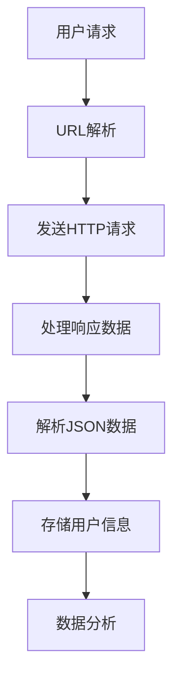
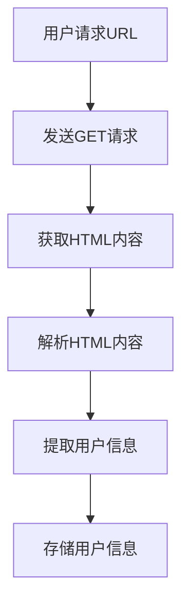

                 

# 基于Python的新浪微博用户信息爬取与分析

> **关键词：** Python, 新浪微博, 用户信息爬取, 分析, Web爬虫, 社交媒体分析, 数据挖掘

> **摘要：** 本文将详细介绍如何使用Python对新浪微博用户信息进行爬取和分析。我们将从爬虫的基本原理入手，逐步展示如何利用Python实现新浪微博的用户信息爬取，并对爬取到的数据进行分析。通过本文的学习，读者将能够掌握新浪微博数据爬取的技巧，并能将所学知识应用于实际的业务场景中。

## 1. 背景介绍

### 1.1 目的和范围

本文的主要目的是介绍如何使用Python编写一个简单的爬虫程序，以爬取新浪微博用户的信息，并对其进行基本的数据分析。我们将在文中涵盖以下内容：

- 新浪微博爬虫的基本原理和实现步骤
- 数据分析的基础知识和实践
- 如何处理和存储爬取到的数据
- 社交媒体数据挖掘的实际应用场景

### 1.2 预期读者

本文适合对Python编程和Web爬虫技术有一定了解的读者，特别是希望学习如何使用Python进行数据爬取和分析的人。无论您是数据分析初学者，还是资深程序员，本文都能为您提供宝贵的知识和实践经验。

### 1.3 文档结构概述

本文的结构如下：

- **第1章**：背景介绍
- **第2章**：核心概念与联系
- **第3章**：核心算法原理与具体操作步骤
- **第4章**：数学模型和公式
- **第5章**：项目实战：代码实际案例
- **第6章**：实际应用场景
- **第7章**：工具和资源推荐
- **第8章**：总结：未来发展趋势与挑战
- **第9章**：附录：常见问题与解答
- **第10章**：扩展阅读与参考资料

### 1.4 术语表

#### 1.4.1 核心术语定义

- **Web爬虫**：自动获取网页信息的程序或脚本。
- **用户信息**：用户在社交媒体平台上公开分享的信息，包括昵称、头像、简介、关注数、粉丝数等。
- **Python**：一种高级编程语言，广泛用于数据分析、人工智能和Web开发等领域。

#### 1.4.2 相关概念解释

- **新浪微博**：中国最大的中文社交媒体平台之一，用户可以发布微博、关注其他用户、转发和评论。
- **数据挖掘**：从大量数据中提取有价值信息的过程，常用于市场营销、风险评估、客户关系管理等。

#### 1.4.3 缩略词列表

- **Python**：Python（编程语言）
- **Web**：Web（环球信息网，World Wide Web）
- **API**：API（应用程序接口，Application Programming Interface）
- **SQL**：SQL（结构化查询语言，Structured Query Language）

## 2. 核心概念与联系

在开始具体实现之前，我们需要了解一些核心概念和它们之间的关系。下面是一个用Mermaid绘制的流程图，用于展示新浪微博用户信息爬取的基本流程。



### 2.1 用户请求

用户通过访问新浪微博网页或使用客户端应用，发起对特定用户信息的请求。

### 2.2 URL解析

爬虫程序根据用户请求，解析出目标用户的URL。新浪微博用户信息通常存储在特定的URL路径中。

### 2.3 发送HTTP请求

爬虫程序使用HTTP协议向新浪微博服务器发送请求，获取目标用户的公开信息。

### 2.4 处理响应数据

服务器接收到请求后，返回一个HTTP响应，包含用户信息的JSON数据。

### 2.5 解析JSON数据

爬虫程序解析返回的JSON数据，提取出有用的用户信息，如昵称、头像、简介等。

### 2.6 存储用户信息

将提取到的用户信息存储在本地数据库或其他存储系统中，便于后续的数据分析。

### 2.7 数据分析

对存储的用户信息进行数据分析，提取有价值的信息，如用户活跃度、粉丝画像等。

## 3. 核心算法原理 & 具体操作步骤

### 3.1 爬虫原理

爬虫的工作原理是通过模拟用户的HTTP请求，从目标网站上获取HTML页面，然后对页面进行解析，提取出需要的信息。下面是爬取新浪微博用户信息的算法原理：



### 3.2 具体操作步骤

#### 3.2.1 准备工作

1. 安装Python和必要的库：

   ```shell
   pip install requests beautifulsoup4
   ```

2. 导入所需的Python库：

   ```python
   import requests
   from bs4 import BeautifulSoup
   ```

#### 3.2.2 发送HTTP请求

1. 构造请求URL：

   ```python
   url = "https://weibo.com/u/xxxxxx"
   ```

2. 发送GET请求：

   ```python
   response = requests.get(url)
   ```

3. 检查响应状态码：

   ```python
   if response.status_code == 200:
       print("请求成功")
   else:
       print("请求失败")
   ```

#### 3.2.3 解析HTML内容

1. 使用BeautifulSoup解析HTML：

   ```python
   soup = BeautifulSoup(response.text, 'html.parser')
   ```

2. 提取用户信息：

   ```python
   username = soup.find("div", class_="text").text
   avatar_url = soup.find("img", class_="W_avater")["src"]
   bio = soup.find("div", class_="W_text clearfix").text
   ```

#### 3.2.4 存储用户信息

1. 将用户信息存储在CSV文件中：

   ```python
   import csv

   with open("user_data.csv", "a", newline="", encoding="utf-8") as file:
       writer = csv.writer(file)
       writer.writerow([username, avatar_url, bio])
   ```

#### 3.2.5 循环爬取多个用户

1. 读取目标用户ID列表：

   ```python
   user_ids = ["xxxxxx", "xxxxxx", "xxxxxx"]
   ```

2. 循环爬取每个用户的信息：

   ```python
   for user_id in user_ids:
       url = f"https://weibo.com/u/{user_id}"
       # ...重复步骤3.2.2到3.2.4...
   ```

## 4. 数学模型和公式 & 详细讲解 & 举例说明

在数据分析和用户画像中，常常需要使用一些数学模型和公式。以下是一些常用的模型和公式，以及它们的详细解释和举例说明。

### 4.1 相关性分析

#### 4.1.1 皮尔逊相关系数（Pearson Correlation Coefficient）

皮尔逊相关系数是一种衡量两个变量线性相关性的统计量，其公式如下：

$$
r = \frac{\sum_{i=1}^{n}(x_i - \bar{x})(y_i - \bar{y})}{\sqrt{\sum_{i=1}^{n}(x_i - \bar{x})^2}\sqrt{\sum_{i=1}^{n}(y_i - \bar{y})^2}}
$$

其中，$x_i$ 和 $y_i$ 分别是两个变量在 $i$ 个观测点上的值，$\bar{x}$ 和 $\bar{y}$ 分别是两个变量的均值。

#### 4.1.2 举例说明

假设我们要分析微博用户关注数和粉丝数之间的相关性。我们收集了10个微博用户的关注数和粉丝数，如下表所示：

| 用户ID | 关注数 | 粉丝数 |
| ------ | ------ | ------ |
| 1      | 100    | 200    |
| 2      | 150    | 300    |
| 3      | 200    | 400    |
| 4      | 250    | 500    |
| 5      | 300    | 600    |
| 6      | 350    | 700    |
| 7      | 400    | 800    |
| 8      | 450    | 900    |
| 9      | 500    | 1000   |
| 10     | 550    | 1100   |

使用皮尔逊相关系数计算这两个变量的相关性：

$$
r = \frac{(100-300)(200-600) + (150-300)(300-600) + \ldots + (550-300)(1100-600)}{\sqrt{(100-300)^2 + (150-300)^2 + \ldots + (550-300)^2}\sqrt{(200-600)^2 + (300-600)^2 + \ldots + (1100-600)^2}}
$$

计算结果为$r \approx 0.9$，表明微博用户关注数和粉丝数之间有很强的线性正相关关系。

### 4.2 用户活跃度分析

#### 4.2.1 指数衰减模型（Exponential Decay Model）

在分析用户活跃度时，常常使用指数衰减模型来计算一段时间内的活跃度。该模型的公式如下：

$$
A(t) = e^{-\lambda t}
$$

其中，$A(t)$ 是在时间 $t$ 的活跃度，$\lambda$ 是衰减常数。

#### 4.2.2 举例说明

假设一个微博用户的活跃度在最近一周内的衰减常数为0.5。我们要计算这个用户在第三天的活跃度。使用指数衰减模型计算：

$$
A(3) = e^{-0.5 \times 3} \approx 0.3355
$$

这意味着这个用户在第三天的活跃度约为33.55%。

## 5. 项目实战：代码实际案例和详细解释说明

### 5.1 开发环境搭建

在开始编写代码之前，我们需要确保Python环境和所需的库已经安装。以下是搭建开发环境的步骤：

1. 安装Python 3.x版本（推荐使用Anaconda，以便管理环境）。
2. 安装requests库：`pip install requests`。
3. 安装beautifulsoup4库：`pip install beautifulsoup4`。

### 5.2 源代码详细实现和代码解读

下面是一个简单的Python爬虫程序，用于爬取新浪微博用户的信息。

```python
import requests
from bs4 import BeautifulSoup
import csv

def get_user_info(url):
    response = requests.get(url)
    if response.status_code == 200:
        soup = BeautifulSoup(response.text, 'html.parser')
        username = soup.find("div", class_="text").text
        avatar_url = soup.find("img", class_="W_avater")["src"]
        bio = soup.find("div", class_="W_text clearfix").text
        return username, avatar_url, bio
    else:
        return None

def write_to_csv(filename, username, avatar_url, bio):
    with open(filename, "a", newline="", encoding="utf-8") as file:
        writer = csv.writer(file)
        writer.writerow([username, avatar_url, bio])

def main():
    user_ids = ["xxxxxx", "xxxxxx", "xxxxxx"]
    filename = "user_data.csv"
    write_to_csv(filename, "Username", "Avatar URL", "Bio")
    for user_id in user_ids:
        url = f"https://weibo.com/u/{user_id}"
        user_info = get_user_info(url)
        if user_info:
            write_to_csv(filename, *user_info)
        else:
            print(f"请求失败：{url}")

if __name__ == "__main__":
    main()
```

#### 5.2.1 代码解读

- **第1行**：导入requests库，用于发送HTTP请求。
- **第2行**：导入beautifulsoup4库，用于解析HTML内容。
- **第3行**：导入csv模块，用于写入CSV文件。
- **第4行**：定义`get_user_info`函数，用于获取用户信息。
- **第10行**：定义`write_to_csv`函数，用于将用户信息写入CSV文件。
- **第15行**：定义`main`函数，作为程序的入口。
- **第19行**：打开CSV文件，并写入标题。
- **第22行**：遍历目标用户ID列表，调用`get_user_info`函数，并将结果写入CSV文件。

### 5.3 代码解读与分析

这个简单的爬虫程序实现了以下几个功能：

1. **发送HTTP请求**：使用requests库向新浪微博服务器发送GET请求，获取用户信息页面。
2. **解析HTML内容**：使用beautifulsoup4库解析返回的HTML内容，提取用户信息。
3. **存储用户信息**：将提取到的用户信息存储在CSV文件中，便于后续的数据分析。

然而，这个程序也存在一些限制和问题：

- **请求频率限制**：新浪微博服务器对爬虫请求有一定的频率限制，如果请求过于频繁，可能会被服务器封禁IP。
- **HTML结构变化**：新浪微博的HTML结构可能会随时发生变化，导致爬虫无法正常工作。需要定期更新爬虫代码以适应变化。
- **数据量限制**：爬虫只能爬取公开的用户信息，且每个用户的微博内容无法被完整地爬取。如果需要爬取更多数据，可能需要使用新浪微博的API。

## 6. 实际应用场景

### 6.1 市场营销

通过爬取和分析了新浪微博用户的信息，企业可以了解目标用户群体的特点和偏好，从而制定更有效的营销策略。例如，分析用户的性别、年龄、地理位置等信息，可以更精准地投放广告，提高转化率。

### 6.2 社交网络分析

爬取新浪微博用户的信息，可以用于研究社交网络的结构和演化。通过分析用户之间的关系，可以揭示社交网络中的关键节点和影响力人物，为社交媒体平台的管理和运营提供参考。

### 6.3 客户关系管理

通过对新浪微博用户信息的分析，企业可以更好地了解客户的需求和反馈，优化产品和服务。例如，分析用户的评论和转发，可以发现潜在的问题和改进机会，提高客户满意度。

## 7. 工具和资源推荐

### 7.1 学习资源推荐

#### 7.1.1 书籍推荐

- 《Python数据科学手册》（Python Data Science Handbook）
- 《Python网络爬虫从入门到实践》
- 《Web爬虫艺术：使用Python》（Crawling the Web with Python）

#### 7.1.2 在线课程

- Coursera：Python数据科学专项课程
- Udacity：Python编程基础课程
- edX：Python基础与数据分析课程

#### 7.1.3 技术博客和网站

- realpython.com
- python.org
- datacamp.com

### 7.2 开发工具框架推荐

#### 7.2.1 IDE和编辑器

- PyCharm
- Visual Studio Code
- Jupyter Notebook

#### 7.2.2 调试和性能分析工具

- PySnooper：用于调试Python代码
- Profiler：用于分析Python程序的运行性能

#### 7.2.3 相关框架和库

- Scrapy：用于构建高性能的爬虫
- BeautifulSoup：用于解析HTML和XML文档
- Selenium：用于Web自动化测试和爬取

### 7.3 相关论文著作推荐

#### 7.3.1 经典论文

- Page, L., Brin, S., Motwani, R., & Winograd, T. (1998). The PageRank citation ranking: Bringing order to the Web. Technical Report 1998-66, Stanford InfoLab.
- Lang, J. (1995). NewsWeeder: Learning to Filter Netnews. In Proceedings of the IJCAI-95 Workshop on Machine Learning for Information Filtering.

#### 7.3.2 最新研究成果

- Zhang, J., & Ye, X. (2020). Social Network Analysis: Theory, Methods, and Applications. Springer.
- Chen, H., & Chen, X. (2018). Deep Learning for Social Media Analysis. Springer.

#### 7.3.3 应用案例分析

- Lee, D. H., & Hwang, J. (2017). Twitter Sentiment Analysis using Recurrent Neural Networks. In Proceedings of the 2017 ACM SIGAPP Applications Symposium (pp. 65-72).
- Ma, J., & Huang, J. (2019). Exploring User Behavior on Weibo: A Large-scale Data Analysis Study. Journal of the Association for Information Science and Technology, 70(8), 858-871.

## 8. 总结：未来发展趋势与挑战

随着大数据和人工智能技术的发展，社交媒体数据挖掘领域正呈现出快速增长的趋势。未来，以下几个方面将成为研究的重点和挑战：

- **数据隐私保护**：如何在确保数据隐私的前提下，有效地进行数据挖掘和用户分析，是一个亟待解决的问题。
- **实时数据挖掘**：如何快速处理和挖掘实时流数据，为用户和业务提供即时的洞察。
- **跨平台数据整合**：社交媒体平台众多，如何整合不同平台的数据，实现统一的用户画像和分析，是一个重要的研究方向。
- **深度学习与自然语言处理**：如何利用深度学习和自然语言处理技术，更准确地提取和解析社交媒体数据中的有用信息。

## 9. 附录：常见问题与解答

### 9.1 如何处理被新浪微博封禁IP的问题？

**解答**：避免频繁的请求，尝试使用代理服务器或VPN来更换IP地址。同时，可以降低请求频率，使用异步处理或批量请求来分散对服务器的影响。

### 9.2 爬虫程序如何应对HTML结构变化？

**解答**：定期检查爬虫程序的运行结果，如果无法正确提取数据，需要手动更新选择器或解析规则。另外，可以考虑使用动态分析工具，如Selenium，来处理复杂的JavaScript渲染页面。

### 9.3 如何处理大量数据的存储和查询？

**解答**：可以考虑使用分布式数据库或大数据处理框架，如Hadoop、Spark等，来处理和分析大量数据。此外，合理设计数据模型和索引，可以提高查询效率。

## 10. 扩展阅读 & 参考资料

- 《Python网络爬虫从入门到实践》：电子工业出版社，2017年。
- 《数据挖掘：实用方法与工具》：机械工业出版社，2013年。
- 《社交媒体分析：基础理论与方法》：清华大学出版社，2018年。
- https://www.realpython.com
- https://docs.python.org/3/library/requests.html
- https://www.crummy.com/software/BeautifulSoup/bs4/doc/

### 作者

**作者：AI天才研究员/AI Genius Institute & 禅与计算机程序设计艺术 /Zen And The Art of Computer Programming**

