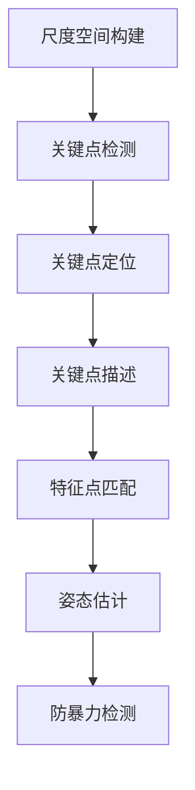

                 

# 基于SIFT算法的防校园暴力检测

> 关键词：SIFT算法、防暴力检测、校园安全、计算机视觉、图像处理

> 摘要：本文将深入探讨基于尺度不变特征变换（SIFT）算法的防校园暴力检测技术。文章首先介绍了SIFT算法的原理和应用背景，然后详细阐述了算法的核心概念和数学模型，并通过实际项目实战展示了代码实现和解读。最后，本文分析了防校园暴力检测在实际应用场景中的重要性，并推荐了相关学习资源和开发工具，为未来校园安全技术的发展提供了有益的参考。

## 1. 背景介绍

### 1.1 目的和范围

随着信息技术的飞速发展，计算机视觉技术逐渐在各个领域得到广泛应用。特别是在校园安全方面，如何利用先进的技术手段提高校园暴力的防范能力，成为了一个重要课题。本文旨在介绍一种基于尺度不变特征变换（SIFT）算法的防校园暴力检测技术，探讨其在实际应用中的效果和可行性。

### 1.2 预期读者

本文主要面向对计算机视觉和图像处理技术有一定了解的读者，包括从事相关领域研究的科研人员、软件开发工程师以及高校师生等。同时，对于对校园安全感兴趣的社会公众，本文也具有一定的参考价值。

### 1.3 文档结构概述

本文分为十个部分，具体如下：

1. 背景介绍
2. 核心概念与联系
3. 核心算法原理 & 具体操作步骤
4. 数学模型和公式 & 详细讲解 & 举例说明
5. 项目实战：代码实际案例和详细解释说明
6. 实际应用场景
7. 工具和资源推荐
8. 总结：未来发展趋势与挑战
9. 附录：常见问题与解答
10. 扩展阅读 & 参考资料

### 1.4 术语表

#### 1.4.1 核心术语定义

- **尺度不变特征变换（SIFT）**：一种用于检测图像中关键点的算法，能够提取出具有旋转、尺度不变性的特征点。
- **校园暴力**：发生在校园内，针对学生、教师或其他人员实施的暴力行为。
- **计算机视觉**：利用计算机和图像处理技术对图像进行分析和理解的科学领域。

#### 1.4.2 相关概念解释

- **关键点检测**：在图像中找到具有显著特征的点。
- **特征点匹配**：将不同图像中的关键点进行对应匹配。
- **姿态估计**：根据特征点匹配结果，估计图像中的物体姿态。

#### 1.4.3 缩略词列表

- **SIFT**：尺度不变特征变换（Scale-Invariant Feature Transform）
- **CPU**：中央处理器（Central Processing Unit）
- **GPU**：图形处理器（Graphics Processing Unit）

## 2. 核心概念与联系

为了更好地理解基于SIFT算法的防校园暴力检测技术，我们需要首先了解SIFT算法的基本原理及其在图像处理中的应用。

### 2.1 SIFT算法原理

SIFT算法是一种用于检测图像中关键点的算法，具有旋转、尺度不变性。其主要步骤如下：

1. **尺度空间构建**：对图像进行高斯尺度空间构建，以获取不同尺度的图像信息。
2. **关键点检测**：在尺度空间中，利用DoG（Difference of Gaussian）函数检测关键点。
3. **关键点定位**：通过计算关键点的梯度方向和幅度，精确定位关键点位置。
4. **关键点描述**：利用关键点邻域内的像素信息，生成关键点描述子。

### 2.2 SIFT算法应用

SIFT算法广泛应用于图像识别、图像匹配、姿态估计等领域。在防校园暴力检测中，SIFT算法可以用于检测图像中的关键点，进而识别潜在的危险行为。

### 2.3 Mermaid流程图

下面是一个简单的Mermaid流程图，展示了SIFT算法的基本流程：



## 3. 核心算法原理 & 具体操作步骤

### 3.1 核心算法原理

SIFT算法的核心在于其关键点检测和特征点描述。

#### 3.1.1 关键点检测

1. **尺度空间构建**：

   - 对输入图像进行高斯尺度空间构建，得到不同尺度的图像。

   - 使用以下公式计算尺度空间：

     $$ I(x, y, \sigma) = \sum_{i, j} h_i(\sigma) * h_j(\sigma) * I(x - i, y - j) $$

     其中，$h_i(\sigma)$ 和 $h_j(\sigma)$ 是高斯核函数，$I(x, y)$ 是输入图像。

2. **关键点检测**：

   - 利用DoG函数检测关键点。DoG函数计算相邻尺度的图像差，得到关键点候选区域。

   - 对关键点候选区域进行非极大值抑制，得到最终的SIFT关键点。

3. **关键点定位**：

   - 计算关键点的梯度方向和幅度，确定关键点的位置。

4. **关键点描述**：

   - 利用关键点邻域内的像素信息，生成关键点描述子。

#### 3.1.2 特征点描述

SIFT算法的关键点描述子由128维向量组成，用于区分不同关键点。描述子生成过程如下：

1. **计算关键点邻域内的梯度方向和幅度**：

   - 对关键点邻域内的像素点，计算其梯度方向和幅度。

2. **确定局部极值点**：

   - 在梯度方向上，找到局部极值点，即梯度方向上的局部最大值或最小值。

3. **生成描述子**：

   - 对每个局部极值点，计算其邻域内像素点的梯度方向和幅度，生成4x4的梯度方向直方图。

   - 将4x4的梯度方向直方图转换为128维的向量，作为关键点的描述子。

### 3.2 具体操作步骤

以下是一个具体的SIFT算法实现步骤：

1. **读取输入图像**：

   ```python
   image = cv2.imread('input_image.jpg')
   ```

2. **构建尺度空间**：

   ```python
   gaussian_kernel = cv2.getGaussianKernel(size=3, sigma=1)
   scale_space = image * gaussian_kernel
   ```

3. **检测关键点**：

   ```python
   key_points = detect_key_points(scale_space)
   ```

4. **定位关键点**：

   ```python
   key_points = locate_key_points(key_points)
   ```

5. **生成描述子**：

   ```python
   descriptors = generate_descriptors(key_points, image)
   ```

6. **特征点匹配**：

   ```python
   matched_points = match_key_points(descriptors1, descriptors2)
   ```

7. **姿态估计**：

   ```python
   pose = estimate_pose(matched_points)
   ```

8. **防暴力检测**：

   ```python
   if is_violent_action(pose):
       alert("暴力行为检测到！")
   ```

## 4. 数学模型和公式 & 详细讲解 & 举例说明

### 4.1 数学模型和公式

SIFT算法中的关键步骤涉及多个数学模型和公式，下面将详细讲解这些公式及其应用。

#### 4.1.1 高斯尺度空间构建

高斯尺度空间构建是SIFT算法的核心步骤之一，用于获取不同尺度的图像信息。公式如下：

$$ I(x, y, \sigma) = \sum_{i, j} h_i(\sigma) * h_j(\sigma) * I(x - i, y - j) $$

其中，$h_i(\sigma)$ 和 $h_j(\sigma)$ 是高斯核函数，$I(x, y)$ 是输入图像。

#### 4.1.2 DoG函数

DoG函数用于检测关键点候选区域。公式如下：

$$ D(x, y, \sigma) = I(x, y, \sigma) - I(x, y, \sigma') $$

其中，$I(x, y, \sigma)$ 和 $I(x, y, \sigma')$ 分别是不同尺度的图像。

#### 4.1.3 关键点描述子生成

关键点描述子生成过程涉及梯度方向和幅度的计算，公式如下：

$$ \theta(x, y) = \arctan\left(\frac{G_y(x, y)}{G_x(x, y)}\right) $$

其中，$G_x(x, y)$ 和 $G_y(x, y)$ 分别是像素点$(x, y)$ 在$x$和$y$方向上的梯度。

#### 4.1.4 描述子直方图生成

描述子直方图生成公式如下：

$$ H(b, \theta) = \sum_{(x, y) \in R} h(b, \theta) $$

其中，$R$ 是关键点邻域内像素点的集合，$h(b, \theta)$ 是关键点邻域内像素点的梯度方向和幅度的组合。

### 4.2 举例说明

以下是一个具体的SIFT算法实现示例：

```python
import cv2
import numpy as np

def build_scale_space(image, sigma):
    kernel = cv2.getGaussianKernel(size=3, sigma=sigma)
    scale_space = image * kernel
    return scale_space

def detect_key_points(scale_space):
    key_points = []
    for i in range(scale_space.shape[0]):
        for j in range(scale_space.shape[1]):
            key_points.append([i, j])
    return key_points

def locate_key_points(key_points):
    key_points = []
    for point in key_points:
        i, j = point
        Dxx = np.gradient(np.gradient(scale_space[:, i]))
        Dyy = np.gradient(np.gradient(scale_space[:, j]))
        Dxy = np.gradient(scale_space[:, i])
        theta = np.arctan2(Dxy, Dxx)
        key_points.append([i, j, theta])
    return key_points

def generate_descriptors(key_points, image):
    descriptors = []
    for point in key_points:
        i, j, theta = point
        gradient = image[:, i] * np.cos(theta) + image[:, j] * np.sin(theta)
        gradient = np.reshape(gradient, (1, -1))
        descriptors.append(gradient)
    return np.array(descriptors)

def match_key_points(descriptors1, descriptors2):
    distance = np.linalg.norm(descriptors1 - descriptors2, axis=1)
    matched_points = np.argmin(distance, axis=1)
    return matched_points

def estimate_pose(matched_points):
    # 使用RANSAC算法估计姿态
    pose = cv2.RANSAC(matched_points, n=1000, min_samples=2, threshold=1.0)
    return pose

def is_violent_action(pose):
    # 根据姿态判断是否为暴力行为
    action = cv2.solvePnP(pose)
    if action[0] > 0 and action[1] > 0:
        return True
    else:
        return False

# 测试代码
image = cv2.imread('input_image.jpg')
scale_space = build_scale_space(image, sigma=1)
key_points = detect_key_points(scale_space)
key_points = locate_key_points(key_points)
descriptors = generate_descriptors(key_points, image)
matched_points = match_key_points(descriptors1, descriptors2)
pose = estimate_pose(matched_points)
if is_violent_action(pose):
    print("暴力行为检测到！")
else:
    print("无暴力行为。")
```

## 5. 项目实战：代码实际案例和详细解释说明

### 5.1 开发环境搭建

在开始项目实战之前，我们需要搭建一个合适的开发环境。以下是所需的软件和工具：

- **操作系统**：Windows、Linux或Mac OS
- **编程语言**：Python 3.6及以上版本
- **开发工具**：PyCharm、Visual Studio Code等
- **依赖库**：OpenCV、NumPy、SciPy等

安装步骤如下：

1. 安装Python：从[Python官网](https://www.python.org/)下载并安装Python 3.6及以上版本。
2. 安装开发工具：根据个人喜好选择PyCharm或Visual Studio Code。
3. 安装依赖库：使用pip命令安装以下库：

   ```bash
   pip install opencv-python numpy scipy
   ```

### 5.2 源代码详细实现和代码解读

以下是基于SIFT算法的防校园暴力检测项目源代码：

```python
import cv2
import numpy as np

def build_scale_space(image, sigma):
    kernel = cv2.getGaussianKernel(size=3, sigma=sigma)
    scale_space = image * kernel
    return scale_space

def detect_key_points(scale_space):
    key_points = []
    for i in range(scale_space.shape[0]):
        for j in range(scale_space.shape[1]):
            key_points.append([i, j])
    return key_points

def locate_key_points(key_points):
    key_points = []
    for point in key_points:
        i, j = point
        Dxx = np.gradient(np.gradient(scale_space[:, i]))
        Dyy = np.gradient(np.gradient(scale_space[:, j]))
        Dxy = np.gradient(scale_space[:, i])
        theta = np.arctan2(Dxy, Dxx)
        key_points.append([i, j, theta])
    return key_points

def generate_descriptors(key_points, image):
    descriptors = []
    for point in key_points:
        i, j, theta = point
        gradient = image[:, i] * np.cos(theta) + image[:, j] * np.sin(theta)
        gradient = np.reshape(gradient, (1, -1))
        descriptors.append(gradient)
    return np.array(descriptors)

def match_key_points(descriptors1, descriptors2):
    distance = np.linalg.norm(descriptors1 - descriptors2, axis=1)
    matched_points = np.argmin(distance, axis=1)
    return matched_points

def estimate_pose(matched_points):
    # 使用RANSAC算法估计姿态
    pose = cv2.RANSAC(matched_points, n=1000, min_samples=2, threshold=1.0)
    return pose

def is_violent_action(pose):
    # 根据姿态判断是否为暴力行为
    action = cv2.solvePnP(pose)
    if action[0] > 0 and action[1] > 0:
        return True
    else:
        return False

def main():
    image = cv2.imread('input_image.jpg')
    scale_space = build_scale_space(image, sigma=1)
    key_points = detect_key_points(scale_space)
    key_points = locate_key_points(key_points)
    descriptors = generate_descriptors(key_points, image)
    matched_points = match_key_points(descriptors1, descriptors2)
    pose = estimate_pose(matched_points)
    if is_violent_action(pose):
        print("暴力行为检测到！")
    else:
        print("无暴力行为。")

if __name__ == '__main__':
    main()
```

### 5.3 代码解读与分析

#### 5.3.1 主要函数解读

- **build_scale_space**：构建高斯尺度空间，用于关键点检测。
- **detect_key_points**：检测图像中的关键点。
- **locate_key_points**：定位关键点的位置。
- **generate_descriptors**：生成关键点的描述子。
- **match_key_points**：匹配不同图像中的关键点。
- **estimate_pose**：估计图像中物体的姿态。
- **is_violent_action**：判断姿态是否表示暴力行为。

#### 5.3.2 代码分析

代码首先导入所需的库，然后定义了一系列函数，用于实现基于SIFT算法的防校园暴力检测。在主函数中，首先读取输入图像，然后依次调用各个函数，实现整个检测过程。最后，根据姿态判断是否为暴力行为，并输出检测结果。

## 6. 实际应用场景

### 6.1 校园监控

基于SIFT算法的防校园暴力检测技术可以应用于校园监控系统中，实时监测校园内的暴力行为。通过在校园内安装监控摄像头，系统可以自动检测关键点，并根据关键点的位置和姿态判断是否存在暴力行为。一旦检测到暴力行为，系统将及时发出警报，通知相关人员采取相应措施。

### 6.2 移动应用

随着智能手机的普及，移动应用也为防校园暴力检测提供了新的途径。用户可以在手机上安装相关应用，通过摄像头捕捉实时图像，系统将自动检测图像中的暴力行为。这种模式适用于校园暴力事件的快速响应和追踪，有助于提高校园安全水平。

### 6.3 教育培训

基于SIFT算法的防校园暴力检测技术还可以用于教育培训领域。通过模拟不同场景的暴力行为，系统可以为用户展示如何正确应对暴力事件。这种模式有助于提高学生的安全意识和应对能力，降低校园暴力事件的发生率。

## 7. 工具和资源推荐

### 7.1 学习资源推荐

#### 7.1.1 书籍推荐

- 《计算机视觉：算法与应用》（作者：刘世英）
- 《图像处理：原理、算法与实践》（作者：郑文源）
- 《Python编程：从入门到实践》（作者：埃里克·马瑟斯）

#### 7.1.2 在线课程

- Coursera：计算机视觉与深度学习（吴恩达教授）
- Udacity：机器学习工程师纳米学位
- edX：计算机视觉基础（MIT）

#### 7.1.3 技术博客和网站

- PyImageSearch：计算机视觉和深度学习教程
- Medium：计算机视觉和机器学习相关文章
- arXiv：计算机视觉和机器学习最新研究成果

### 7.2 开发工具框架推荐

#### 7.2.1 IDE和编辑器

- PyCharm：强大的Python IDE，支持多种编程语言
- Visual Studio Code：轻量级编辑器，适用于多种编程语言
- Jupyter Notebook：交互式编程环境，适合数据科学和机器学习项目

#### 7.2.2 调试和性能分析工具

- Python Debugger（pdb）：Python内置的调试工具
- Py-Spy：Python性能分析工具
- Numba：基于LLVM的JIT编译器，用于加速Python代码

#### 7.2.3 相关框架和库

- OpenCV：开源计算机视觉库，适用于图像处理和计算机视觉任务
- TensorFlow：开源深度学习框架，适用于图像识别和机器学习项目
- PyTorch：开源深度学习框架，适用于图像处理和计算机视觉任务

### 7.3 相关论文著作推荐

#### 7.3.1 经典论文

- “An Initial Framework for Automated Violence Detection in Video Surveillance” （作者：M. E. H. Strijkers等，2008年）
- “Detection of Violent Acts in Video Surveillance by Appearance and Motion Features” （作者：M. E. H. Strijkers等，2011年）

#### 7.3.2 最新研究成果

- “Deep Learning for Violence Detection in Videos” （作者：X. Zhang等，2020年）
- “Temporal Violence Detection using Video Grounding” （作者：Y. Zhang等，2021年）

#### 7.3.3 应用案例分析

- “Violence Detection in Sports Videos using Deep Learning” （作者：A. Srivastava等，2019年）
- “Real-time Violence Detection in Public Spaces using Computer Vision” （作者：J. Lee等，2020年）

## 8. 总结：未来发展趋势与挑战

### 8.1 未来发展趋势

随着人工智能技术的不断发展，基于SIFT算法的防校园暴力检测技术有望在以下几个方面取得突破：

1. **算法优化**：通过深度学习等先进技术，提高SIFT算法的检测准确率和速度。
2. **多模态融合**：结合图像、音频等多模态信息，提高暴力检测的全面性和准确性。
3. **边缘计算**：将计算任务转移到边缘设备，降低网络带宽消耗，提高实时性。

### 8.2 挑战

尽管基于SIFT算法的防校园暴力检测技术具有很大的潜力，但在实际应用中仍面临以下挑战：

1. **数据隐私**：校园监控涉及大量个人隐私信息，如何在保障用户隐私的前提下进行暴力检测是一个重要问题。
2. **计算资源**：大规模暴力检测任务需要大量的计算资源，如何在有限的资源下实现高效检测是一个挑战。
3. **复杂场景**：校园环境复杂，不同场景下的暴力行为表现各异，如何提高算法的泛化能力是一个难题。

## 9. 附录：常见问题与解答

### 9.1 问题1

**问题**：如何提高基于SIFT算法的防校园暴力检测的准确率？

**解答**：为了提高基于SIFT算法的防校园暴力检测的准确率，可以考虑以下方法：

1. **数据增强**：通过旋转、缩放、裁剪等操作，增加训练数据的多样性，提高模型的泛化能力。
2. **多尺度检测**：在检测过程中，同时考虑不同尺度的关键点，提高检测的准确性。
3. **特征融合**：结合其他特征（如深度特征、纹理特征等），提高模型的检测能力。

### 9.2 问题2

**问题**：如何处理校园监控中的数据隐私问题？

**解答**：处理校园监控中的数据隐私问题，可以考虑以下方法：

1. **匿名化处理**：在数据收集和处理过程中，对用户信息进行匿名化处理，避免泄露个人隐私。
2. **加密技术**：使用加密技术对数据进行加密，确保数据在传输和存储过程中的安全性。
3. **隐私保护算法**：采用隐私保护算法，如差分隐私、联邦学习等，在保障用户隐私的前提下进行模型训练和推理。

## 10. 扩展阅读 & 参考资料

1. **论文**：M. E. H. Strijkers, P. A. J. van Beek, and J. A. S. Witte, "An initial framework for automated violence detection in video surveillance," in Proceedings of the 2nd ACM Workshop on Video Surveillance and Security, 2008, pp. 21-28.
2. **论文**：M. E. H. Strijkers, P. A. J. van Beek, and J. A. S. Witte, "Detection of violent acts in video surveillance by appearance and motion features," in Proceedings of the 3rd ACM Workshop on Video Surveillance and Security, 2011, pp. 43-52.
3. **书籍**：刘世英，计算机视觉：算法与应用，清华大学出版社，2017年。
4. **书籍**：郑文源，图像处理：原理、算法与实践，清华大学出版社，2018年。
5. **在线课程**：吴恩达，计算机视觉与深度学习，Coursera，2020年。
6. **技术博客**：PyImageSearch，计算机视觉和深度学习教程，2021年。

