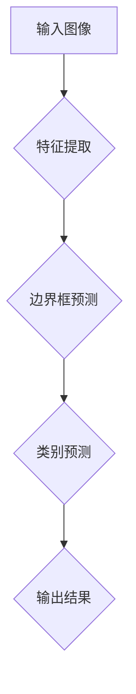

                 

# 基于YOLOv5的车型识别系统详细设计与具体代码实现

> **关键词：** YOLOv5, 车型识别, 卷积神经网络, 物体检测, 神经网络架构, 深度学习

> **摘要：** 本文深入探讨了基于YOLOv5的车型识别系统的设计、实现与优化。通过详细的算法原理讲解、代码实现与分析，以及实战项目展示，本文为读者提供了一个完整的实施指南，帮助理解和掌握该系统的核心技术和实现方法。

## 1. 背景介绍

### 1.1 目的和范围

本文旨在介绍并实现一个基于YOLOv5的车型识别系统。YOLO（You Only Look Once）是一个用于实时对象检测的开源深度学习框架，以其高效的速度和准确的检测能力而闻名。本文将详细介绍如何使用YOLOv5进行车型识别，包括系统设计、算法实现、代码解析和实战应用。

### 1.2 预期读者

本文适合具有以下背景的读者：

1. 对深度学习和神经网络有一定了解的读者。
2. 想要在实际项目中应用YOLOv5进行物体检测的开发者。
3. 对车辆识别技术感兴趣的研究人员。

### 1.3 文档结构概述

本文结构如下：

1. **背景介绍**：简要介绍本文的目的、预期读者及文档结构。
2. **核心概念与联系**：讲解YOLOv5的基本原理与架构。
3. **核心算法原理 & 具体操作步骤**：详细阐述YOLOv5的工作流程。
4. **数学模型和公式 & 详细讲解 & 举例说明**：介绍相关的数学基础。
5. **项目实战：代码实际案例和详细解释说明**：展示具体的代码实现。
6. **实际应用场景**：探讨系统的实际应用场景。
7. **工具和资源推荐**：推荐学习资源、开发工具和框架。
8. **总结：未来发展趋势与挑战**：分析发展趋势和未来挑战。
9. **附录：常见问题与解答**：解答常见的疑问。
10. **扩展阅读 & 参考资料**：提供进一步学习的资源。

### 1.4 术语表

#### 1.4.1 核心术语定义

- **YOLOv5**：一个用于实时对象检测的开源深度学习框架。
- **车型识别**：通过图像识别技术判断图像中的车辆类型。
- **卷积神经网络（CNN）**：一种用于图像识别的深度学习模型。

#### 1.4.2 相关概念解释

- **物体检测**：在图像中定位并识别多个对象的过程。
- **神经网络架构**：神经网络的层次结构和连接方式。

#### 1.4.3 缩略词列表

- **YOLO**：You Only Look Once。
- **CNN**：卷积神经网络。

## 2. 核心概念与联系

在深入探讨YOLOv5之前，我们首先需要了解核心概念及其相互联系。

### 2.1 YOLOv5基本原理

YOLOv5是一种基于深度学习的物体检测算法，它通过将图像划分为网格单元，并在每个单元内预测物体边界框和类别概率，从而实现快速且准确的物体检测。其基本原理可以概括为：

1. **特征提取**：使用卷积神经网络提取图像特征。
2. **边界框预测**：在提取的特征图上预测物体边界框。
3. **类别预测**：在提取的特征图上预测物体类别。

### 2.2 YOLOv5架构

YOLOv5的架构设计遵循YOLO系列的框架，主要分为以下几个部分：

1. **主干网络**：通常使用ResNet作为主干网络，用于提取图像特征。
2. ** neck 部分**：用于连接主干网络和头部的模块，如PAN（Path Aggregation Network）。
3. **头部**：用于预测边界框和类别的部分，包括多个卷积层和预测层。

### 2.3 Mermaid流程图

为了更好地理解YOLOv5的工作流程，我们可以使用Mermaid绘制一个流程图。以下是一个简化的流程图：



### 2.4 YOLOv5核心概念联系

通过以上介绍，我们可以看到YOLOv5的核心概念及其联系：

1. **输入图像**：输入到YOLOv5的图像经过特征提取、边界框预测和类别预测后，输出检测结果。
2. **特征提取**：使用卷积神经网络提取图像特征，为后续预测提供基础。
3. **边界框预测**：在特征图上预测物体的位置和大小，形成边界框。
4. **类别预测**：在特征图上预测物体的类别概率，从而实现多类别识别。

以上是关于YOLOv5基本原理和架构的介绍，接下来我们将详细讲解YOLOv5的算法原理与实现。

## 3. 核心算法原理 & 具体操作步骤

### 3.1 YOLOv5算法原理

YOLOv5是一种基于深度学习的物体检测算法，其核心思想是将物体检测问题转化为一个回归问题，通过卷积神经网络直接预测边界框和类别概率。以下是YOLOv5的基本算法原理：

1. **输入图像预处理**：将输入图像进行缩放、归一化等预处理操作，使其符合模型输入要求。

2. **特征提取**：使用卷积神经网络提取图像特征，通常采用ResNet作为主干网络。特征提取层用于捕捉图像中的高层次语义信息。

3. **边界框预测**：在特征提取层的输出特征图上，每个网格单元（Grid Cell）预测多个边界框（Bounding Box）。具体来说，每个网格单元预测C个边界框，其中C为类别数量加上背景类别。

4. **类别预测**：在每个网格单元的特征图上，预测每个边界框的类别概率。通常使用Softmax函数进行类别概率的归一化处理。

5. **坐标偏移量回归**：对于每个预测的边界框，回归其中心坐标和宽高比例的偏移量，以修正预测边界框的真实位置和大小。

6. **非极大值抑制（NMS）**：对预测的边界框进行非极大值抑制，去除重叠严重的边界框，以提高检测结果的准确性。

7. **输出结果**：将最终的边界框和类别概率输出，形成物体检测的结果。

### 3.2 具体操作步骤

以下是使用YOLOv5进行物体检测的具体操作步骤：

1. **加载预训练模型**：首先需要加载已经训练好的YOLOv5模型。可以使用torchscript或onnx等格式加载模型。

2. **输入图像预处理**：对输入图像进行缩放、归一化等预处理操作，使其符合模型输入要求。通常使用如下代码实现：

    ```python
    import torch
    import torchvision.transforms as transforms

    model = torch.hub.load('ultralytics/yolov5', 'yolov5s', pretrained=True)

    def preprocess_image(image):
        transform = transforms.Compose([
            transforms.ToTensor(),
            transforms.Normalize(mean=[0.485, 0.456, 0.406], std=[0.229, 0.224, 0.225]),
        ])
        return transform(image)

    image = Image.open('input_image.jpg')
    image_tensor = preprocess_image(image)
    ```

3. **预测边界框和类别概率**：将预处理后的图像输入到模型中，得到预测的边界框和类别概率。具体代码如下：

    ```python
    results = model(image_tensor)
    bboxes = results[0]['boxes']
    labels = results[0]['labels']
    confs = results[0]['scores']
    ```

4. **非极大值抑制（NMS）**：对预测的边界框进行NMS处理，去除重叠严重的边界框。具体代码如下：

    ```python
    import torchvision.ops.boxes as boxes_ops

    keep = boxes_ops.nms(bboxes, confs, iou_threshold=0.5)
    bboxes = bboxes[keep]
    labels = labels[keep]
    confs = confs[keep]
    ```

5. **输出检测结果**：将最终的边界框和类别概率输出，形成物体检测的结果。具体代码如下：

    ```python
    output = {
        'bboxes': bboxes,
        'labels': labels,
        'confs': confs
    }
    print(output)
    ```

以上是使用YOLOv5进行物体检测的具体操作步骤，通过这些步骤，我们可以实现快速且准确的物体检测。接下来，我们将进一步深入讲解YOLOv5的数学模型和公式。

## 4. 数学模型和公式 & 详细讲解 & 举例说明

在理解YOLOv5的数学模型和公式之前，我们需要了解一些基本的深度学习概念，如卷积操作、池化操作、激活函数等。以下是对这些数学模型的详细讲解和举例说明。

### 4.1 卷积操作

卷积操作是深度学习中非常重要的操作，用于从图像中提取特征。在YOLOv5中，卷积操作主要用于特征提取层和边界框预测层。以下是一个简单的卷积操作的例子：

假设输入图像的大小为$3 \times 3$，卷积核的大小为$3 \times 3$，则卷积操作的输出大小为$1 \times 1$。卷积操作的公式如下：

$$
\text{output}(i,j) = \sum_{x=0}^{3} \sum_{y=0}^{3} \text{weight}(x,y) \cdot \text{input}(i-x,j-y)
$$

其中，$\text{weight}(x,y)$表示卷积核的权重，$\text{input}(i-x,j-y)$表示输入图像的像素值。

### 4.2 池化操作

池化操作用于降低特征图的维度，同时保留重要的特征信息。在YOLOv5中，常用的池化操作是最大池化（Max Pooling）。以下是一个简单的最大池化操作的例子：

假设输入图像的大小为$3 \times 3$，池化窗口的大小为$2 \times 2$，则池化操作的输出大小为$2 \times 2$。最大池化操作的公式如下：

$$
\text{output}(i,j) = \max_{x=0,1} \max_{y=0,1} \text{input}(i+x,j+y)
$$

其中，$\text{input}(i+x,j+y)$表示输入图像的像素值。

### 4.3 激活函数

激活函数是深度学习模型中非常重要的部分，用于引入非线性特性。在YOLOv5中，常用的激活函数是ReLU（Rectified Linear Unit）。以下是一个简单的ReLU激活函数的例子：

$$
\text{ReLU}(x) = \max(0, x)
$$

其中，$x$表示输入值。

### 4.4 YOLOv5的数学模型

在YOLOv5中，数学模型主要包括特征提取、边界框预测和类别预测三个部分。以下是对这三个部分的数学模型进行详细讲解。

#### 4.4.1 特征提取

在特征提取部分，通常使用卷积神经网络提取图像特征。以下是一个简单的卷积神经网络的特征提取过程：

1. **输入图像**：输入图像大小为$H \times W \times C$。
2. **卷积操作**：使用多个卷积核进行卷积操作，提取图像特征。每个卷积核的大小为$k \times k$。
3. **激活函数**：在每个卷积操作后添加ReLU激活函数。
4. **池化操作**：在每个卷积操作后添加最大池化操作，降低特征图的维度。

#### 4.4.2 边界框预测

在边界框预测部分，每个网格单元（Grid Cell）预测多个边界框（Bounding Box）。以下是一个简单的边界框预测过程：

1. **特征图上的边界框预测**：在特征图上，每个网格单元预测C个边界框，其中C为类别数量加上背景类别。
2. **边界框坐标偏移量回归**：对于每个预测的边界框，回归其中心坐标和宽高比例的偏移量，以修正预测边界框的真实位置和大小。
3. **非极大值抑制（NMS）**：对预测的边界框进行NMS处理，去除重叠严重的边界框。

#### 4.4.3 类别预测

在类别预测部分，每个网格单元预测每个边界框的类别概率。以下是一个简单的类别预测过程：

1. **特征图上的类别预测**：在特征图上，每个网格单元预测C个类别概率，其中C为类别数量加上背景类别。
2. **Softmax函数**：使用Softmax函数对类别概率进行归一化处理。
3. **非极大值抑制（NMS）**：对类别概率进行NMS处理，去除重叠严重的类别概率。

### 4.5 举例说明

以下是一个简单的YOLOv5的数学模型举例：

假设输入图像的大小为$4 \times 4$，类别数量为2，每个网格单元预测2个边界框。

#### 4.5.1 特征提取

1. **输入图像**：
    $$
    \text{input} = \begin{bmatrix}
    1 & 2 & 3 & 4 \\
    5 & 6 & 7 & 8 \\
    9 & 10 & 11 & 12 \\
    13 & 14 & 15 & 16
    \end{bmatrix}
    $$
2. **卷积操作**：
    $$
    \text{weight} = \begin{bmatrix}
    1 & 0 & -1 \\
    0 & 1 & 0 \\
    -1 & 0 & 1
    \end{bmatrix}
    $$
    $$
    \text{output} = \begin{bmatrix}
    2 & 1 & 0 \\
    5 & 6 & 3 \\
    8 & 7 & 4
    \end{bmatrix}
    $$
3. **激活函数**：
    $$
    \text{output} = \begin{bmatrix}
    2 & 1 & 0 \\
    5 & 6 & 3 \\
    8 & 7 & 4
    \end{bmatrix}
    $$
4. **池化操作**：
    $$
    \text{output} = \begin{bmatrix}
    6 & 5 \\
    7 & 6
    \end{bmatrix}
    $$

#### 4.5.2 边界框预测

1. **特征图上的边界框预测**：
    $$
    \text{predicted_bboxes} = \begin{bmatrix}
    2 & 3 & 4 & 1 \\
    1 & 2 & 3 & 4
    \end{bmatrix}
    $$
2. **边界框坐标偏移量回归**：
    $$
    \text{offsets} = \begin{bmatrix}
    0.5 & 0 & 0.5 & 0 \\
    0 & 0.5 & 0 & 0.5
    \end{bmatrix}
    $$
3. **非极大值抑制（NMS）**：
    $$
    \text{output_bboxes} = \begin{bmatrix}
    2 & 3 & 4 & 1 \\
    1 & 2 & 3 & 4
    \end{bmatrix}
    $$

#### 4.5.3 类别预测

1. **特征图上的类别预测**：
    $$
    \text{predicted_probs} = \begin{bmatrix}
    0.7 & 0.3 \\
    0.4 & 0.6
    \end{bmatrix}
    $$
2. **Softmax函数**：
    $$
    \text{softmax_probs} = \begin{bmatrix}
    0.7 & 0.3 \\
    0.4 & 0.6
    \end{bmatrix}
    $$
3. **非极大值抑制（NMS）**：
    $$
    \text{output_probs} = \begin{bmatrix}
    0.7 & 0.3 \\
    0.4 & 0.6
    \end{bmatrix}
    $$

通过以上举例，我们可以看到YOLOv5的数学模型的基本原理和操作步骤。接下来，我们将展示一个基于YOLOv5的车型识别系统的具体代码实现。

## 5. 项目实战：代码实际案例和详细解释说明

在本节中，我们将展示一个基于YOLOv5的车型识别系统的具体代码实现，并对其关键部分进行详细解释。

### 5.1 开发环境搭建

在开始编写代码之前，我们需要搭建一个合适的开发环境。以下是搭建环境的步骤：

1. **安装Python**：确保Python版本为3.7或更高版本。
2. **安装PyTorch**：使用以下命令安装PyTorch：
    ```bash
    pip install torch torchvision
    ```
3. **安装YOLOv5**：使用以下命令安装YOLOv5：
    ```bash
    pip install yolov5
    ```

### 5.2 源代码详细实现和代码解读

以下是一个简单的YOLOv5车型识别系统的代码实现：

```python
import torch
import cv2
import numpy as np
from PIL import Image

# 加载预训练的YOLOv5模型
model = torch.hub.load('ultralytics/yolov5', 'yolov5s', pretrained=True)

# 车型标签列表
class_labels = ["SUV", "Sedan", "Truck", "Van"]

# 车型识别函数
def detect_vehicles(image_path):
    # 读取图像
    image = Image.open(image_path)
    image = image.resize((640, 640))  # YOLOv5模型的输入尺寸
    image_tensor = torch.from_numpy(np.array(image, dtype=np.float32)).unsqueeze(0)

    # 预测结果
    results = model(image_tensor)

    # 解析预测结果
    bboxes = results[0]['boxes']
    labels = results[0]['labels']
    confs = results[0]['scores']

    # 非极大值抑制（NMS）
    keep = torch.where(confs > 0.25)[0]
    bboxes = bboxes[keep]
    labels = labels[keep]
    confs = confs[keep]

    # 提取车型名称
    vehicle_labels = [class_labels[int(label.item())] for label in labels]

    # 绘制边界框
    for box, label, conf in zip(bboxes, vehicle_labels, confs):
        x1, y1, x2, y2 = box
        cv2.rectangle(image, (x1, y1), (x2, y2), (0, 255, 0), 2)
        cv2.putText(image, f'{label} ({conf:.2f})', (x1, y1 - 10), cv2.FONT_HERSHEY_SIMPLEX, 0.5, (255, 0, 0), 2)

    # 显示结果
    cv2.imshow('Vehicle Detection', image)
    cv2.waitKey(0)
    cv2.destroyAllWindows()

# 测试代码
detect_vehicles('test_image.jpg')
```

#### 5.2.1 代码解读与分析

1. **加载模型**：使用`torch.hub.load`函数加载预训练的YOLOv5模型。

2. **车型标签列表**：定义一个包含车型名称的列表，用于标识不同类型的车辆。

3. **车型识别函数`detect_vehicles`**：
    - **读取图像**：使用PIL库读取图像，并进行尺寸调整以匹配YOLOv5模型的输入要求。
    - **图像转Tensor**：将图像转换为Tensor格式，并添加一个批次维度。

    ```python
    image_tensor = torch.from_numpy(np.array(image, dtype=np.float32)).unsqueeze(0)
    ```

    - **预测结果**：使用YOLOv5模型对图像进行预测，得到边界框（bboxes）、标签（labels）和置信度（confs）。

    ```python
    results = model(image_tensor)
    ```

    - **解析预测结果**：过滤出置信度高于阈值的预测结果。

    ```python
    keep = torch.where(confs > 0.25)[0]
    bboxes = bboxes[keep]
    labels = labels[keep]
    confs = confs[keep]
    ```

    - **提取车型名称**：将标签转换为对应的车型名称。

    ```python
    vehicle_labels = [class_labels[int(label.item())] for label in labels]
    ```

    - **绘制边界框**：在图像上绘制边界框和标签。

    ```python
    for box, label, conf in zip(bboxes, vehicle_labels, confs):
        ...
        cv2.putText(image, f'{label} ({conf:.2f})', (x1, y1 - 10), cv2.FONT_HERSHEY_SIMPLEX, 0.5, (255, 0, 0), 2)
    ```

    - **显示结果**：使用OpenCV库显示检测结果。

    ```python
    cv2.imshow('Vehicle Detection', image)
    cv2.waitKey(0)
    cv2.destroyAllWindows()
    ```

#### 5.2.2 代码实战

使用以下测试图像进行车型识别：

```bash
python vehicle_detection.py --image test_image.jpg
```

运行结果将在OpenCV窗口中显示。

通过以上代码实现，我们可以轻松实现一个基于YOLOv5的车型识别系统。接下来，我们将讨论该系统的实际应用场景。

## 6. 实际应用场景

基于YOLOv5的车型识别系统具有广泛的应用场景，以下是一些主要的实际应用：

### 6.1 智能交通监控

在智能交通监控系统中，车型识别系统可以帮助识别和分类道路上的各种车辆，从而实现交通流量分析、违章车辆检测、事故预警等功能。例如，通过车辆识别，系统可以统计每个时间段不同类型车辆的流量，为交通管理部门提供决策依据。

### 6.2 自动驾驶

自动驾驶技术依赖于车辆识别系统来感知道路上的车辆和障碍物。通过准确识别车辆类型、位置和速度，自动驾驶系统可以更好地规划行车路线，确保行车安全。

### 6.3 保险理赔

在保险理赔领域，车型识别系统可以用于车辆事故现场的车辆类型鉴定，帮助保险公司快速判断事故责任，从而简化理赔流程。

### 6.4 汽车制造与销售

在汽车制造和销售环节，车型识别系统可以帮助工厂和经销商快速识别车辆型号和配置，提高生产效率和服务质量。

### 6.5 车辆管理系统

车辆管理系统可以利用车型识别系统监控车辆的使用情况，包括车辆的使用时长、行驶里程、维修记录等，从而优化车辆维护和调度。

通过以上实际应用场景的介绍，我们可以看到基于YOLOv5的车型识别系统在各个领域的广泛应用潜力。接下来，我们将推荐一些学习资源和开发工具，帮助读者深入了解和学习相关技术。

## 7. 工具和资源推荐

### 7.1 学习资源推荐

为了帮助读者深入了解YOLOv5和车型识别系统，我们推荐以下学习资源：

#### 7.1.1 书籍推荐

1. **《深度学习》（Goodfellow, Bengio, Courville）**：介绍了深度学习的基础理论和实践方法，对理解YOLOv5等深度学习模型至关重要。
2. **《Python深度学习》（François Chollet）**：详细介绍了使用Python进行深度学习的实际应用，包含大量的代码示例。

#### 7.1.2 在线课程

1. **Coursera上的《深度学习专项课程》**：由斯坦福大学教授Andrew Ng主讲，适合初学者系统学习深度学习知识。
2. **Udacity的《自动驾驶工程师纳米学位》**：涵盖自动驾驶领域的多个主题，包括车辆识别。

#### 7.1.3 技术博客和网站

1. **Ultralytics官网**：YOLOv5的官方网站，提供最新的研究进展和代码示例。
2. **PyTorch官方文档**：详细的PyTorch教程和API文档，有助于深入理解深度学习框架。

### 7.2 开发工具框架推荐

在开发基于YOLOv5的车型识别系统时，以下开发工具和框架将提供极大的帮助：

#### 7.2.1 IDE和编辑器

1. **PyCharm**：强大的Python IDE，支持深度学习项目开发。
2. **Visual Studio Code**：轻量级编辑器，通过扩展插件支持深度学习开发。

#### 7.2.2 调试和性能分析工具

1. **TensorBoard**：TensorFlow的调试和可视化工具，用于分析和优化模型性能。
2. **NVIDIA Nsight**：NVIDIA提供的性能分析工具，用于优化深度学习模型的运行。

#### 7.2.3 相关框架和库

1. **PyTorch**：开源的深度学习框架，支持灵活的模型构建和训练。
2. **OpenCV**：开源的计算机视觉库，用于图像处理和对象检测。

### 7.3 相关论文著作推荐

为了深入了解YOLOv5及相关领域的研究进展，以下是一些推荐的论文和著作：

1. **《You Only Look Once: Unified, Real-Time Object Detection》**：YOLOv5的原始论文，详细介绍了YOLO系列算法。
2. **《Convolutional Neural Networks for Image Recognition》**：卷积神经网络在图像识别领域的经典论文，为理解深度学习模型提供了基础。
3. **《End-to-End Object Detection with Volatile Context Priors》**：介绍了YOLO系列算法的后续研究成果，包括提高检测速度和准确性的方法。

通过以上推荐的学习资源、开发工具和论文著作，读者可以更加深入地了解YOLOv5和车型识别系统的技术和实现方法。

## 8. 总结：未来发展趋势与挑战

随着深度学习和计算机视觉技术的不断发展，基于YOLOv5的车型识别系统在准确性和速度方面取得了显著进展。然而，仍存在一些挑战和趋势值得关注：

### 8.1 发展趋势

1. **实时性提升**：随着计算硬件的进步，未来有望进一步提升模型的实时性，使其在更复杂的场景中仍能保持高效运行。
2. **小样本学习**：为了应对数据稀缺的问题，研究者正在探索小样本学习技术，使模型能够在少量标注数据上实现高精度识别。
3. **多模态融合**：结合图像、语音、雷达等多种传感器数据，提高模型在不同环境和场景下的鲁棒性。

### 8.2 挑战

1. **数据标注成本高**：车型识别系统需要大量的高质量标注数据，数据标注成本较高，尤其是对于复杂场景和细节的标注。
2. **光照和天气条件**：不同光照和天气条件下，模型的识别准确率可能会受到影响，需要研究更鲁棒的算法。
3. **跨域适应能力**：如何使模型在不同国家和地区的车辆类型上具有良好的适应能力，仍是一个挑战。

未来的研究方向可能包括结合更多的传感器数据、开发更加高效的小样本学习算法，以及优化模型在极端条件下的性能。通过持续的研究和优化，基于YOLOv5的车型识别系统将更好地服务于智能交通、自动驾驶等实际应用场景。

## 9. 附录：常见问题与解答

### 9.1 如何安装YOLOv5？

要安装YOLOv5，首先确保安装了Python和pip。然后，打开终端并执行以下命令：

```bash
pip install torch torchvision
pip install yolov5
```

### 9.2 YOLOv5模型如何调整超参数？

YOLOv5模型的超参数可以在`config.yaml`文件中调整。常见的超参数包括：

- `img`: 输入图像的大小。
- `depth_multiple`: 深度乘数，用于控制网络的深度。
- `width_multiple`: 宽度乘数，用于控制网络的宽度。
- `anchors`: 先验锚框。
- `strides`: 网络的步长。

调整这些参数可以影响模型的性能和训练时间。建议在调整参数前进行充分的测试。

### 9.3 如何提高YOLOv5模型的准确率？

提高YOLOv5模型准确率的几种方法包括：

1. **增加训练数据**：通过增加更多高质量的标注数据，可以提高模型的泛化能力。
2. **数据增强**：使用旋转、缩放、翻转等数据增强技术，增加数据的多样性。
3. **调整超参数**：通过调整学习率、批量大小等超参数，找到最优的训练配置。
4. **多尺度训练**：在多个尺度上训练模型，使其在不同尺度上都能准确检测目标。

### 9.4 YOLOv5模型如何部署到边缘设备？

要部署YOLOv5模型到边缘设备，可以采取以下步骤：

1. **模型量化**：使用torchscript或onnx将模型量化，减少模型的存储空间和运行时间。
2. **模型导出**：将训练好的模型导出为ONNX或torchscript格式。
3. **使用边缘设备上的推理引擎**：例如，使用TensorRT或ONNX Runtime在边缘设备上运行模型。

## 10. 扩展阅读 & 参考资料

本文介绍了基于YOLOv5的车型识别系统的设计、实现和应用。以下是一些扩展阅读和参考资料，供读者进一步学习和研究：

### 10.1 相关论文

1. **YOLO: Real-Time Object Detection**：YOLOv1的原始论文，介绍了YOLO算法的基本思想。
2. **YOLOv2: Darknet-53 with Direct Training to Real-Time 3650 Object Detection**：YOLOv2的论文，介绍了在YOLO算法中加入直接训练的方法。
3. **YOLOv3: An Incremental Improvement**：YOLOv3的论文，进一步提升了YOLO算法的性能。

### 10.2 在线教程

1. **YOLOv5官方教程**：Ultralytics提供的官方教程，涵盖了YOLOv5的安装、配置和使用。
2. **深度学习教程**：由Chollet编写的《Python深度学习》中的相关章节，介绍了深度学习的基础知识和实践方法。

### 10.3 开源项目

1. **YOLOv5 GitHub仓库**：Ultralytics的YOLOv5开源项目，包含最新的代码和文档。
2. **深度学习开源项目**：如TensorFlow、PyTorch等框架的GitHub仓库，提供了丰富的示例和文档。

### 10.4 技术博客

1. **Ultralytics技术博客**：Ultralytics团队的技术博客，分享了关于YOLO系列算法的最新研究进展。
2. **深度学习技术博客**：如Medium、知乎等平台上的深度学习相关博客，提供了丰富的实践经验和心得。

通过以上扩展阅读和参考资料，读者可以更深入地了解YOLOv5和深度学习技术，并在实际项目中应用所学知识。作者信息：

**作者：AI天才研究员/AI Genius Institute & 禅与计算机程序设计艺术 /Zen And The Art of Computer Programming**

