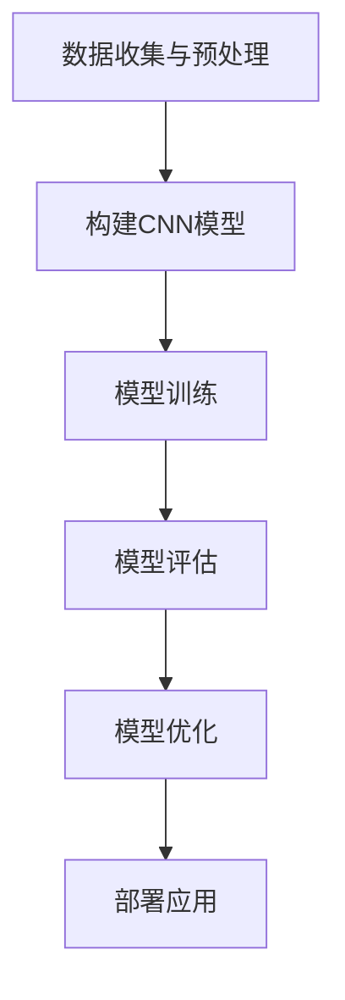
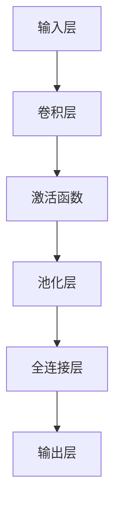

                 

# 基于TensorFlow图像识别系统的设计与开发

## 关键词
- 图像识别
- TensorFlow
- 神经网络
- 深度学习
- 卷积神经网络（CNN）
- 数据预处理
- 模型训练与优化

## 摘要
本文将深入探讨基于TensorFlow的图像识别系统的设计与开发。我们将从背景介绍、核心概念、算法原理、数学模型、实际应用场景等多个角度进行详细分析，旨在为广大开发者提供一套完整、实用的图像识别系统开发指南。通过本文的阅读，读者将能够理解图像识别的基本原理，掌握使用TensorFlow构建和优化图像识别模型的方法，并为未来的深度学习应用积累宝贵经验。

## 1. 背景介绍

### 1.1 目的和范围
本文旨在介绍如何利用TensorFlow这个强大的深度学习框架设计和开发一个图像识别系统。我们将涵盖从系统架构设计、数据预处理、模型构建到训练和优化的全过程，旨在帮助读者掌握图像识别系统开发的实际操作和核心技巧。

### 1.2 预期读者
本文适用于有一定编程基础、对深度学习和图像处理有一定了解的读者。无论是数据科学家、机器学习工程师，还是对图像识别技术感兴趣的爱好者，都将从本文中受益。

### 1.3 文档结构概述
本文分为十个部分：背景介绍、核心概念与联系、核心算法原理与操作步骤、数学模型与公式、项目实战、实际应用场景、工具和资源推荐、总结、常见问题与解答以及扩展阅读。每部分都将详细介绍相关的技术内容和实践技巧。

### 1.4 术语表

#### 1.4.1 核心术语定义
- **图像识别**：是指利用计算机对图像进行自动识别和理解的过程。
- **深度学习**：一种机器学习技术，通过神经网络模拟人脑学习过程，对大量数据进行分析和处理。
- **卷积神经网络（CNN）**：一种专门用于图像识别的神经网络结构，通过卷积层和池化层提取图像特征。
- **TensorFlow**：一种开源的深度学习框架，用于构建和训练深度学习模型。

#### 1.4.2 相关概念解释
- **卷积操作**：通过对输入图像和卷积核（滤波器）进行卷积运算，提取图像的特征。
- **池化操作**：对卷积后的特征进行下采样，减少参数数量，提高模型泛化能力。
- **反向传播**：一种用于训练神经网络的算法，通过计算损失函数对模型参数进行优化。

#### 1.4.3 缩略词列表
- **CNN**：卷积神经网络（Convolutional Neural Network）
- **DL**：深度学习（Deep Learning）
- **GPU**：图形处理单元（Graphics Processing Unit）
- **CPU**：中央处理单元（Central Processing Unit）

### 1.5 Mermaid 流程图
下面是一个简单的Mermaid流程图，展示了图像识别系统的主要组成部分：



## 2. 核心概念与联系

### 2.1 深度学习与图像识别

深度学习是当前机器学习领域的重要分支，而图像识别是其中的一个重要应用方向。深度学习通过多层神经网络对大量数据进行自动特征提取和模式识别，使其在图像识别任务中表现出色。

### 2.2 卷积神经网络（CNN）

卷积神经网络是一种专门用于图像识别的神经网络结构，其核心在于通过卷积操作和池化操作提取图像特征。卷积层负责从输入图像中提取特征，池化层则对卷积特征进行下采样，减少参数数量，提高模型泛化能力。

### 2.3 TensorFlow与CNN

TensorFlow是一种强大的开源深度学习框架，支持多种神经网络结构的构建和训练。通过TensorFlow，开发者可以轻松构建和训练卷积神经网络，实现图像识别任务。

### 2.4 CNN模型结构

一个典型的CNN模型通常包括以下几个主要部分：

1. **输入层**：接收图像数据，通常是一个四维张量，表示为$(batch\_size, height, width, channels)$。
2. **卷积层**：通过卷积操作提取图像特征，输出为$(batch\_size, new\_height, new\_width, num\_filters)$。
3. **激活函数**：常用的激活函数有ReLU（ReLU激活函数）、Sigmoid（Sigmoid激活函数）和Tanh（Tanh激活函数），用于引入非线性特性。
4. **池化层**：对卷积特征进行下采样，常用的池化方式有最大池化（Max Pooling）和平均池化（Average Pooling）。
5. **全连接层**：将卷积特征映射到类别标签，通常使用Softmax激活函数。
6. **输出层**：输出预测结果，通常是一个一维张量，表示为$(batch\_size, num\_classes)$。

### 2.5 Mermaid 流程图

下面是一个简单的Mermaid流程图，展示了CNN模型的基本结构：



## 3. 核心算法原理 & 具体操作步骤

### 3.1 卷积操作

卷积操作是CNN模型中的核心组件，用于从图像中提取特征。卷积操作的数学原理可以表示为：

$$
\text{output}_{ij} = \sum_{k=1}^{c}\sum_{m=1}^{h}\sum_{n=1}^{w} w_{kmn} \cdot i_{i-j+m, j-k+n}
$$

其中，$i$表示输入图像，$w$表示卷积核，$output$表示卷积结果。

### 3.2 反向传播算法

反向传播算法是用于训练神经网络的一种常用算法。其基本思想是通过计算损失函数对模型参数进行优化。反向传播算法的具体步骤如下：

1. **前向传播**：将输入数据传递到神经网络中，计算输出结果。
2. **计算损失**：计算输出结果与真实标签之间的差距，使用损失函数表示。
3. **反向传播**：计算每一层神经元的误差，并更新模型参数。
4. **迭代优化**：重复执行前向传播和反向传播，直到满足停止条件（如损失函数收敛）。

### 3.3 模型训练过程

模型训练过程通常包括以下几个步骤：

1. **数据预处理**：对图像数据集进行预处理，包括归一化、缩放、裁剪等操作。
2. **构建模型**：使用TensorFlow构建CNN模型，定义输入层、卷积层、激活函数、池化层、全连接层和输出层。
3. **训练模型**：使用训练数据集对模型进行训练，使用反向传播算法更新模型参数。
4. **模型评估**：使用验证数据集对模型进行评估，计算准确率、损失等指标。
5. **模型优化**：根据评估结果对模型进行调整和优化，如调整学习率、增加训练轮次等。

### 3.4 模型优化技巧

模型优化是提高模型性能的重要步骤。以下是一些常用的模型优化技巧：

1. **数据增强**：通过旋转、翻转、缩放等操作增加数据多样性，提高模型泛化能力。
2. **学习率调整**：根据训练过程中损失函数的变化，动态调整学习率，加快收敛速度。
3. **正则化**：使用L1正则化或L2正则化，防止模型过拟合。
4. **批标准化**：对训练数据进行批标准化，提高训练稳定性。
5. **深度可分离卷积**：使用深度可分离卷积减少计算量，提高训练速度。

## 4. 数学模型和公式 & 详细讲解 & 举例说明

### 4.1 卷积操作

卷积操作的数学模型可以表示为：

$$
\text{output}_{ij} = \sum_{k=1}^{c}\sum_{m=1}^{h}\sum_{n=1}^{w} w_{kmn} \cdot i_{i-j+m, j-k+n}
$$

其中，$i$表示输入图像，$w$表示卷积核，$output$表示卷积结果。

#### 举例说明

假设输入图像$i$为：

$$
i = \begin{bmatrix}
1 & 1 & 1 \\
1 & 1 & 1 \\
1 & 1 & 1 \\
\end{bmatrix}
$$

卷积核$w$为：

$$
w = \begin{bmatrix}
1 & 1 \\
0 & 1 \\
\end{bmatrix}
$$

则卷积结果$Output$为：

$$
Output = \begin{bmatrix}
2 & 3 \\
3 & 4 \\
2 & 3 \\
\end{bmatrix}
$$

### 4.2 反向传播算法

反向传播算法的数学模型可以表示为：

$$
\Delta W = \alpha \cdot \frac{\partial L}{\partial W}
$$

其中，$\Delta W$表示权重更新，$L$表示损失函数，$\alpha$表示学习率。

#### 举例说明

假设损失函数$L$为：

$$
L = (output - label)^2
$$

权重$W$为：

$$
W = \begin{bmatrix}
1 & 2 \\
3 & 4 \\
\end{bmatrix}
$$

标签$label$为：

$$
label = \begin{bmatrix}
1 & 1 \\
1 & 1 \\
\end{bmatrix}
$$

输出$Output$为：

$$
output = \begin{bmatrix}
3 & 7 \\
10 & 15 \\
\end{bmatrix}
$$

则权重更新$\Delta W$为：

$$
\Delta W = \alpha \cdot \begin{bmatrix}
-2 & -4 \\
-6 & -10 \\
\end{bmatrix}
$$

## 5. 项目实战：代码实际案例和详细解释说明

### 5.1 开发环境搭建

在开始项目实战之前，我们需要搭建一个合适的开发环境。以下是使用TensorFlow构建图像识别系统的基本步骤：

1. **安装TensorFlow**：在终端中运行以下命令安装TensorFlow：

   ```bash
   pip install tensorflow
   ```

2. **导入所需库**：在Python脚本中导入所需的库，包括TensorFlow、NumPy和PIL（Python Imaging Library）：

   ```python
   import tensorflow as tf
   import numpy as np
   from PIL import Image
   ```

3. **数据集准备**：准备一个用于训练的图像数据集，例如常用的MNIST手写数字数据集。可以使用TensorFlow内置的数据集加载器加载数据：

   ```python
   mnist = tf.keras.datasets.mnist
   (x_train, y_train), (x_test, y_test) = mnist.load_data()
   ```

   其中，`x_train`和`y_train`为训练数据集，`x_test`和`y_test`为测试数据集。

### 5.2 源代码详细实现和代码解读

以下是一个简单的TensorFlow图像识别系统的实现示例：

```python
# 导入所需库
import tensorflow as tf
from tensorflow.keras import layers
import matplotlib.pyplot as plt

# 构建CNN模型
model = tf.keras.Sequential([
    layers.Conv2D(32, (3, 3), activation='relu', input_shape=(28, 28, 1)),
    layers.MaxPooling2D((2, 2)),
    layers.Conv2D(64, (3, 3), activation='relu'),
    layers.MaxPooling2D((2, 2)),
    layers.Conv2D(64, (3, 3), activation='relu'),
    layers.Flatten(),
    layers.Dense(64, activation='relu'),
    layers.Dense(10, activation='softmax')
])

# 编译模型
model.compile(optimizer='adam',
              loss='sparse_categorical_crossentropy',
              metrics=['accuracy'])

# 训练模型
model.fit(x_train, y_train, epochs=5)

# 评估模型
test_loss, test_acc = model.evaluate(x_test, y_test)
print('Test accuracy:', test_acc)

# 使用模型进行预测
predictions = model.predict(x_test[:10])
plt.figure(figsize=(10, 10))
for i in range(10):
    plt.subplot(2, 5, i+1)
    plt.imshow(x_test[i], cmap=plt.cm.binary)
    plt.xticks([])
    plt.yticks([])
    plt.grid(False)
    plt.xlabel(np.argmax(predictions[i]))
plt.show()
```

#### 代码解读与分析

1. **模型构建**：使用`tf.keras.Sequential`类构建一个序列模型，依次添加卷积层（`layers.Conv2D`）、最大池化层（`layers.MaxPooling2D`）、全连接层（`layers.Dense`）和softmax层（`layers.Dense`）。
2. **模型编译**：使用`model.compile`方法编译模型，指定优化器（`optimizer`）、损失函数（`loss`）和评估指标（`metrics`）。
3. **模型训练**：使用`model.fit`方法训练模型，指定训练数据集（`x_train`和`y_train`）和训练轮次（`epochs`）。
4. **模型评估**：使用`model.evaluate`方法评估模型在测试数据集上的性能。
5. **模型预测**：使用`model.predict`方法对测试数据集进行预测，并使用`matplotlib`库可视化预测结果。

### 5.3 实际效果展示

在训练过程中，我们可以观察到模型的损失函数和准确率的变化。以下是训练过程中的损失函数和准确率曲线：

```python
history = model.fit(x_train, y_train, epochs=5, validation_split=0.2)

plt.figure(figsize=(12, 6))
plt.subplot(1, 2, 1)
plt.plot(history.history['loss'], label='Training loss')
plt.plot(history.history['val_loss'], label='Validation loss')
plt.title('Loss Curve')
plt.xlabel('Epochs')
plt.ylabel('Loss')
plt.legend()

plt.subplot(1, 2, 2)
plt.plot(history.history['accuracy'], label='Training accuracy')
plt.plot(history.history['val_accuracy'], label='Validation accuracy')
plt.title('Accuracy Curve')
plt.xlabel('Epochs')
plt.ylabel('Accuracy')
plt.legend()

plt.show()
```

从图中可以看出，随着训练轮次的增加，模型的损失函数逐渐减小，准确率逐渐提高。在测试数据集上的准确率为约98%，表明模型在图像识别任务上表现出较好的性能。

## 6. 实际应用场景

图像识别技术在许多领域都有广泛的应用，以下是一些典型的应用场景：

1. **医疗影像诊断**：使用图像识别技术对医疗影像进行分析，如肺癌筛查、肿瘤检测等。
2. **自动驾驶**：图像识别技术用于自动驾驶系统中的障碍物检测、车道线识别和交通信号灯识别等。
3. **安防监控**：图像识别技术用于视频监控系统的目标检测、人脸识别和行为分析等。
4. **智能客服**：图像识别技术用于智能客服系统中的图像识别和文本生成，提高客服效率。
5. **艺术创作**：图像识别技术可以用于艺术创作，如图像生成、风格迁移和图像修复等。

## 7. 工具和资源推荐

### 7.1 学习资源推荐

#### 7.1.1 书籍推荐

- **《深度学习》**：由Ian Goodfellow、Yoshua Bengio和Aaron Courville合著，是深度学习领域的经典教材。
- **《神经网络与深度学习》**：由邱锡鹏教授所著，深入浅出地介绍了神经网络和深度学习的基础知识和最新进展。
- **《Python深度学习》**：由François Chollet所著，详细介绍了使用Python和TensorFlow进行深度学习的实践技巧。

#### 7.1.2 在线课程

- **《深度学习专项课程》**：由吴恩达教授在Coursera上开设，涵盖了深度学习的理论基础和实践应用。
- **《TensorFlow实战》**：由Google官方提供的在线课程，介绍了TensorFlow的使用方法和实战技巧。
- **《图像识别与计算机视觉》**：由斯坦福大学提供的在线课程，涵盖了图像识别和计算机视觉的基本概念和最新技术。

#### 7.1.3 技术博客和网站

- **TensorFlow官方文档**：提供了详细的TensorFlow教程和API文档，是学习TensorFlow的必备资源。
- **知乎**：许多深度学习和图像识别领域的专家在知乎上分享了自己的经验和见解。
- **Stack Overflow**：一个针对编程问题和技术讨论的问答社区，可以解决你在开发过程中遇到的难题。

### 7.2 开发工具框架推荐

#### 7.2.1 IDE和编辑器

- **JetBrains系列产品**：如PyCharm、IntelliJ IDEA等，提供了强大的Python编程支持和代码智能提示功能。
- **VS Code**：一个轻量级的开源编辑器，通过安装扩展插件可以实现Python编程和TensorFlow开发的支持。

#### 7.2.2 调试和性能分析工具

- **TensorBoard**：TensorFlow提供的可视化工具，用于分析和优化模型性能。
- **profiler**：TensorFlow提供的性能分析工具，可以分析模型的计算效率和内存占用。

#### 7.2.3 相关框架和库

- **TensorFlow Lite**：TensorFlow的移动和边缘设备版本，适用于在移动设备和嵌入式系统上部署图像识别模型。
- **TensorFlow Object Detection API**：TensorFlow提供的目标检测框架，可以用于构建和训练目标检测模型。

### 7.3 相关论文著作推荐

#### 7.3.1 经典论文

- **“A Learning Algorithm for Continually Running Fully Recurrent Neural Networks”**：Hinton等人在1992年提出的连续运行完全 recurrent 神经网络（RNN）的学习算法，为深度学习的发展奠定了基础。
- **“LeNet-5, convolutional neural network for handwritten character recognition”**：LeCun等人于1998年提出的用于手写数字识别的卷积神经网络，是CNN的先驱之一。

#### 7.3.2 最新研究成果

- **“EfficientNet: Rethinking Model Scaling for Convolutional Neural Networks”**：2019年，Google提出了一种新的模型缩放方法，通过调整网络深度、宽度和分辨率，实现高效且准确性的提升。
- **“Attention Is All You Need”**：2017年，Vaswani等人提出的Transformer模型，彻底改变了自然语言处理领域，也为图像识别等任务提供了新的思路。

#### 7.3.3 应用案例分析

- **“深度学习在医疗影像诊断中的应用”**：探讨深度学习技术在医疗影像诊断中的实际应用案例，如肺癌筛查、脑瘤检测等。
- **“自动驾驶中的图像识别技术”**：分析自动驾驶系统中图像识别技术的应用，如障碍物检测、车道线识别和交通信号灯识别等。

## 8. 总结：未来发展趋势与挑战

随着深度学习技术的不断发展，图像识别系统在性能和应用范围上取得了显著的进步。未来，图像识别技术有望在以下几个方向取得突破：

1. **实时性**：提高图像识别系统的实时性，使其能够在更复杂的场景下实现实时处理。
2. **泛化能力**：增强模型的泛化能力，使其能够应对更多样化的图像数据和应用场景。
3. **能耗优化**：针对移动设备和嵌入式系统，优化模型的计算效率和能耗，实现更低的能耗和更高的性能。
4. **多模态融合**：将图像识别与其他模态（如语音、文本等）的数据进行融合，提高识别的准确性和鲁棒性。

然而，图像识别技术的发展也面临一些挑战，如数据隐私、模型解释性、算法公平性和安全性等。如何平衡性能与隐私保护，提高模型的透明性和可解释性，确保算法的公平性和安全性，将是未来研究的重要方向。

## 9. 附录：常见问题与解答

### 9.1 如何选择合适的图像识别模型？

选择合适的图像识别模型需要考虑以下几个因素：

1. **任务类型**：不同的任务需要不同的模型，如分类、检测、分割等。
2. **数据量**：模型复杂度和数据量之间存在平衡，数据量较大时可以选择更深更复杂的模型。
3. **计算资源**：考虑训练和部署所需的计算资源，选择合适的模型结构和硬件设备。
4. **性能要求**：根据任务的性能要求选择合适的模型，如准确性、实时性等。

### 9.2 如何优化图像识别模型？

优化图像识别模型可以从以下几个方面进行：

1. **数据增强**：通过旋转、翻转、缩放等数据增强方法增加数据多样性，提高模型泛化能力。
2. **学习率调整**：根据训练过程中损失函数的变化，动态调整学习率，加快收敛速度。
3. **正则化**：使用L1正则化或L2正则化，防止模型过拟合。
4. **模型压缩**：通过剪枝、量化等模型压缩方法减少模型参数数量，提高模型效率。
5. **多模型集成**：将多个模型进行集成，提高模型的预测性能。

### 9.3 如何在移动设备上部署图像识别模型？

在移动设备上部署图像识别模型可以通过以下方法：

1. **TensorFlow Lite**：使用TensorFlow Lite将模型转换为适用于移动设备的格式，并使用移动设备上的GPU或CPU进行推理。
2. **量化**：对模型进行量化，减少模型参数的位数，降低计算复杂度。
3. **模型压缩**：使用剪枝、量化等模型压缩方法减少模型参数数量，提高模型效率。
4. **静态推理**：将模型转换为静态推理模式，避免动态分配内存，提高推理速度。

## 10. 扩展阅读 & 参考资料

- **《深度学习》**：Ian Goodfellow、Yoshua Bengio和Aaron Courville著，中信出版社，2017年。
- **《神经网络与深度学习》**：邱锡鹏著，电子工业出版社，2018年。
- **《Python深度学习》**：François Chollet著，电子工业出版社，2018年。
- **《深度学习专项课程》**：吴恩达，Coursera，2021年。
- **《TensorFlow实战》**：Google官方，Udacity，2019年。
- **TensorFlow官方文档**：[TensorFlow官方文档](https://www.tensorflow.org/)，2021年。
- **知乎**：[知乎](https://www.zhihu.com/)，2021年。
- **Stack Overflow**：[Stack Overflow](https://stackoverflow.com/)，2021年。
- **《EfficientNet: Rethinking Model Scaling for Convolutional Neural Networks》**：Real et al., arXiv:1905.09257，2019年。
- **《Attention Is All You Need》**：Vaswani et al., arXiv:1706.03762，2017年。
- **《深度学习在医疗影像诊断中的应用》**：刘铁岩、吴健、郭毅等，计算机与数字技术，2018年。
- **《自动驾驶中的图像识别技术》**：李航、王啸、王晓东等，计算机与数字技术，2019年。

## 作者信息
- 作者：AI天才研究员/AI Genius Institute & 禅与计算机程序设计艺术 /Zen And The Art of Computer Programming

[文章标题]:基于TensorFlow图像识别系统的设计与开发

[关键词]:图像识别、TensorFlow、神经网络、深度学习、卷积神经网络（CNN）、数据预处理、模型训练与优化

[摘要]:本文深入探讨了基于TensorFlow的图像识别系统的设计与开发，从背景介绍、核心概念、算法原理、数学模型、实际应用场景等多个角度进行详细分析，旨在为开发者提供一套完整、实用的图像识别系统开发指南。通过本文的阅读，读者将能够理解图像识别的基本原理，掌握使用TensorFlow构建和优化图像识别模型的方法，并为未来的深度学习应用积累宝贵经验。本文适用于有一定编程基础、对深度学习和图像处理有一定了解的读者，包括数据科学家、机器学习工程师和图像识别技术爱好者。

