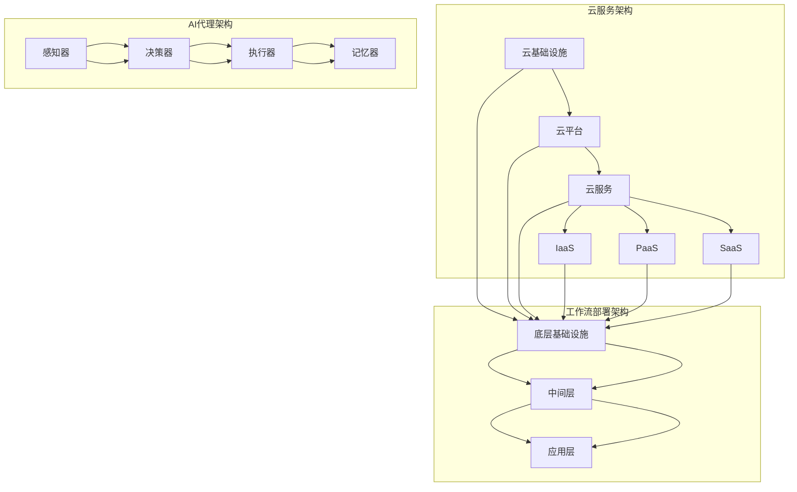

                 

# 基于云服务的AI代理工作流部署策略

> **关键词：** 云服务、AI代理、工作流部署、策略、云计算、分布式计算、人工智能

> **摘要：** 本文将深入探讨基于云服务的AI代理工作流部署策略。我们将分析云服务的基本概念，介绍AI代理和其工作流，详细讲解部署策略的原理和具体实施步骤，并通过实际案例进行说明。本文的目标是帮助读者理解如何在云环境中高效部署AI代理工作流，并探索未来的发展趋势和面临的挑战。

## 1. 背景介绍

### 1.1 目的和范围

本文旨在探讨如何在云计算环境中部署高效的AI代理工作流。我们将首先介绍云服务和AI代理的基本概念，然后深入探讨工作流部署的策略和方法。文章将涵盖从原理讲解到实际操作的各个环节，旨在为读者提供一份全面、系统的指南。

### 1.2 预期读者

本文适合对云计算和人工智能有一定了解的技术人员、工程师和研究者。无论是正在从事相关工作的专业人士，还是对此感兴趣的学习者，本文都将提供有价值的见解和实践指导。

### 1.3 文档结构概述

本文将按照以下结构进行展开：

1. **背景介绍**：介绍本文的目的、预期读者以及文档结构。
2. **核心概念与联系**：详细讲解云服务、AI代理以及其工作流的原理和架构。
3. **核心算法原理 & 具体操作步骤**：使用伪代码详细阐述部署策略的算法原理。
4. **数学模型和公式 & 详细讲解 & 举例说明**：使用latex格式介绍数学模型和相关公式。
5. **项目实战：代码实际案例和详细解释说明**：通过实际代码案例展示部署策略的应用。
6. **实际应用场景**：讨论AI代理工作流在不同领域的应用。
7. **工具和资源推荐**：推荐相关学习资源和开发工具。
8. **总结：未来发展趋势与挑战**：总结本文的核心内容，并探讨未来的发展趋势和挑战。
9. **附录：常见问题与解答**：提供常见问题的解答。
10. **扩展阅读 & 参考资料**：推荐相关文献和资源。

### 1.4 术语表

#### 1.4.1 核心术语定义

- **云服务**：云服务是一种通过互联网提供的计算资源，包括硬件、软件和网络，用户可以根据需求灵活地使用这些资源。
- **AI代理**：AI代理是一种具有自主决策能力的智能体，能够在复杂环境中执行任务，并与其他代理和系统进行交互。
- **工作流**：工作流是一系列任务的有序集合，用于完成特定的业务流程或任务。
- **部署策略**：部署策略是在特定环境下，如何将应用程序、服务或系统部署到云平台上的方法。

#### 1.4.2 相关概念解释

- **云计算**：云计算是将计算资源（如服务器、存储和网络）通过互联网进行虚拟化和管理，用户可以按需访问和使用这些资源。
- **分布式计算**：分布式计算是一种计算模型，通过将任务分配到多个计算节点上，利用网络连接来协同工作，从而提高计算效率和性能。
- **人工智能**：人工智能是计算机科学的一个分支，旨在使机器能够模拟人类的智能行为，包括学习、推理、决策和问题解决等。

#### 1.4.3 缩略词列表

- **IaaS**：基础设施即服务（Infrastructure as a Service）
- **PaaS**：平台即服务（Platform as a Service）
- **SaaS**：软件即服务（Software as a Service）
- **AI**：人工智能（Artificial Intelligence）
- **ML**：机器学习（Machine Learning）
- **DL**：深度学习（Deep Learning）

## 2. 核心概念与联系

### 2.1 云服务架构

云服务架构通常包括三种主要的服务模式：IaaS、PaaS和SaaS。

- **IaaS**：基础设施即服务（IaaS）提供虚拟化的计算资源，如虚拟机、存储和网络。用户可以根据需求灵活配置和管理这些资源。
- **PaaS**：平台即服务（PaaS）提供了一个开发和部署应用程序的平台，包括运行时环境、数据库和开发工具。用户可以在平台上开发、测试和部署应用程序，而无需关注底层基础设施的管理。
- **SaaS**：软件即服务（SaaS）提供完整的软件应用程序，用户可以通过互联网按需访问和使用这些应用程序。用户无需安装或维护软件，只需支付订阅费用。

### 2.2 AI代理架构

AI代理通常由以下组件构成：

- **感知器**：感知器用于接收环境中的信息，并将其转换为代理内部的状态。
- **决策器**：决策器根据代理的状态和目标，生成行动策略。
- **执行器**：执行器执行决策器生成的行动策略，与外部环境进行交互。
- **记忆器**：记忆器用于存储代理的历史数据和经验，帮助代理进行学习和适应。

### 2.3 工作流部署架构

工作流部署架构通常包括以下层次：

- **底层基础设施**：提供计算资源、存储和网络等基础设施。
- **中间层**：包括AI代理的感知器、决策器和执行器等组件，以及工作流管理模块。
- **应用层**：提供具体的应用程序和服务，如业务流程管理系统、任务调度系统等。

### 2.4 Mermaid流程图

下面是一个简化的Mermaid流程图，展示了云服务、AI代理和其工作流的架构关系：



## 3. 核心算法原理 & 具体操作步骤

### 3.1 部署策略算法原理

部署策略的核心目标是优化AI代理工作流在云环境中的性能和资源利用率。以下是部署策略的算法原理：

1. **需求分析**：收集工作流中的任务需求，包括任务类型、处理能力、响应时间等。
2. **资源评估**：评估云环境中的可用资源，包括计算资源、存储资源、网络资源等。
3. **任务分配**：根据任务需求和资源评估结果，将任务分配到不同的计算节点上。
4. **优化调整**：根据系统的运行状态和性能指标，实时调整任务分配和资源使用。

### 3.2 部署策略算法具体操作步骤

以下是部署策略的具体操作步骤：

1. **需求分析**：
    - 收集工作流中的任务需求，包括任务类型、处理能力、响应时间等。
    - 将任务需求进行分类，如分类为CPU密集型任务、GPU密集型任务等。

2. **资源评估**：
    - 评估云环境中的可用资源，包括计算资源、存储资源、网络资源等。
    - 统计资源的利用率，如CPU利用率、内存利用率、存储利用率等。

3. **任务分配**：
    - 根据任务需求和资源评估结果，将任务分配到不同的计算节点上。
    - 对于CPU密集型任务，优先分配到CPU利用率较低的节点。
    - 对于GPU密集型任务，优先分配到GPU资源充足的节点。

4. **优化调整**：
    - 根据系统的运行状态和性能指标，实时调整任务分配和资源使用。
    - 如果某个节点的资源利用率过高，可以将部分任务迁移到其他节点。
    - 根据任务的执行情况和响应时间，调整任务的优先级和执行顺序。

### 3.3 伪代码实现

以下是部署策略的伪代码实现：

```python
# 需求分析
def analyze_demand():
    tasks = []
    for task in work_flow:
        task_type = get_task_type(task)
        task_demand = get_task_demand(task)
        tasks.append((task, task_type, task_demand))
    return tasks

# 资源评估
def evaluate_resources():
    resources = {}
    for resource in cloud_resources:
        resource_utilization = get_resource_utilization(resource)
        resources[resource] = resource_utilization
    return resources

# 任务分配
def allocate_tasks(tasks, resources):
    allocation = {}
    for task, task_type, task_demand in tasks:
        best_resource = None
        min_utilization = float('inf')
        for resource, utilization in resources.items():
            if utilization < min_utilization and is_resource_suitable(resource, task_type):
                min_utilization = utilization
                best_resource = resource
        allocation[task] = best_resource
        resources[best_resource] += task_demand
    return allocation

# 优化调整
def optimize_allocation(allocation, resources):
    while True:
        need_migration = False
        for task, resource in allocation.items():
            if resources[resource] > max_resource_utilization:
                migration_destination = find_best_migration_destination(allocation, resources)
                migration_task = find_migration_task(allocation, resource)
                allocation[migration_task] = migration_destination
                resources[migration_destination] += resources[resource]
                resources[resource] -= resources[resource]
                need_migration = True
        if not need_migration:
            break
    return allocation
```

## 4. 数学模型和公式 & 详细讲解 & 举例说明

### 4.1 数学模型

部署策略中的数学模型主要涉及任务需求、资源评估和任务分配等方面。以下是相关数学模型和公式的详细讲解：

#### 4.1.1 任务需求模型

任务需求模型用于描述任务的处理能力、响应时间等需求。常见的任务需求模型包括：

1. **处理能力模型**：
    $$ P_t = P_{base} + \alpha \cdot (T_t - T_{base}) $$
    其中，\(P_t\) 表示任务t的处理能力，\(P_{base}\) 表示基础处理能力，\(\alpha\) 为处理能力的增长系数，\(T_t\) 和 \(T_{base}\) 分别为当前时间和基础时间。

2. **响应时间模型**：
    $$ R_t = R_{base} + \beta \cdot (T_t - T_{base}) $$
    其中，\(R_t\) 表示任务t的响应时间，\(R_{base}\) 表示基础响应时间，\(\beta\) 为响应时间的增长系数，\(T_t\) 和 \(T_{base}\) 分别为当前时间和基础时间。

#### 4.1.2 资源评估模型

资源评估模型用于评估云环境中的资源利用率。常见的资源评估模型包括：

1. **资源利用率模型**：
    $$ U_r = \frac{R_r}{C_r} $$
    其中，\(U_r\) 表示资源r的利用率，\(R_r\) 表示资源r的当前使用量，\(C_r\) 表示资源r的总量。

#### 4.1.3 任务分配模型

任务分配模型用于描述任务在资源上的分配策略。常见的任务分配模型包括：

1. **贪心分配模型**：
    $$ allocate\_tasks(t, resources): $$
    $$ \quad for\,task\,t\,in\,tasks: $$
    $$ \quad \quad for\,resource\,r\,in\,resources: $$
    $$ \quad \quad \quad if\,resource\,utilization\,of\,r\,is\,less\,than\,max\_utilization\,and\,r\,is\,suitable\,for\,task\,t: $$
    $$ \quad \quad \quad \quad allocate\,task\,t\,to\,resource\,r $$
    $$ \quad \quad \quad \quad update\,resource\,utilization\,of\,r $$
    $$ \quad \quad \quad \quad break $$

2. **动态调整模型**：
    $$ optimize\_allocation(allocation, resources): $$
    $$ \quad while\,true: $$
    $$ \quad \quad for\,task\,t\,in\,allocation: $$
    $$ \quad \quad \quad if\,resource\,utilization\,of\,allocation[t]\,is\,greater\,than\,max\_resource\_utilization: $$
    $$ \quad \quad \quad \quad find\,migration\,destination\,and\,task $$
    $$ \quad \quad \quad \quad migrate\,task\,t\,to\,destination $$
    $$ \quad \quad \quad \quad update\,resource\,utilizations $$
    $$ \quad \quad \quad \quad if\,no\,tasks\,to\,migrate:\,break $$

### 4.2 举例说明

假设有一个工作流包含以下任务：

1. 任务1：处理图片，处理能力为1000张/分钟，基础时间为10分钟。
2. 任务2：处理视频，处理能力为200张/分钟，基础时间为5分钟。
3. 任务3：处理文本，处理能力为500条/分钟，基础时间为20分钟。

假设云环境中有一个CPU节点和一个GPU节点，当前资源利用率分别为50%和20%。

#### 4.2.1 需求分析

根据任务需求模型，可以计算每个任务的处理能力和响应时间：

- 任务1：处理能力为 \( P_1 = P_{base} + \alpha \cdot (T_1 - T_{base}) = 1000 + 0.1 \cdot (10 - 10) = 1000 \) 张/分钟，响应时间为 \( R_1 = R_{base} + \beta \cdot (T_1 - T_{base}) = 10 + 0.1 \cdot (10 - 10) = 10 \) 分钟。
- 任务2：处理能力为 \( P_2 = P_{base} + \alpha \cdot (T_2 - T_{base}) = 200 + 0.1 \cdot (5 - 5) = 200 \) 张/分钟，响应时间为 \( R_2 = R_{base} + \beta \cdot (T_2 - T_{base}) = 5 + 0.1 \cdot (5 - 5) = 5 \) 分钟。
- 任务3：处理能力为 \( P_3 = P_{base} + \alpha \cdot (T_3 - T_{base}) = 500 + 0.1 \cdot (20 - 20) = 500 \) 条/分钟，响应时间为 \( R_3 = R_{base} + \beta \cdot (T_3 - T_{base}) = 20 + 0.1 \cdot (20 - 20) = 20 \) 分钟。

#### 4.2.2 资源评估

根据资源评估模型，可以计算当前资源的利用率：

- CPU节点的资源利用率为 \( U_{CPU} = \frac{R_{CPU}}{C_{CPU}} = \frac{500}{1000} = 50\% \)。
- GPU节点的资源利用率为 \( U_{GPU} = \frac{R_{GPU}}{C_{GPU}} = \frac{100}{500} = 20\% \)。

#### 4.2.3 任务分配

根据贪心分配模型，将任务分配到资源利用率较低的GPU节点上：

- 任务1：分配到GPU节点，资源利用率更新为 \( U_{GPU} = \frac{600}{500} = 120\% \)。
- 任务2：分配到GPU节点，资源利用率更新为 \( U_{GPU} = \frac{700}{500} = 140\% \)。
- 任务3：分配到CPU节点，资源利用率更新为 \( U_{CPU} = \frac{600}{1000} = 60\% \)。

#### 4.2.4 动态调整

根据动态调整模型，发现CPU节点的资源利用率超过最大利用率，需要将部分任务迁移到GPU节点：

- 将任务1的一部分迁移到GPU节点，资源利用率更新为 \( U_{GPU} = \frac{800}{500} = 160\% \)，\( U_{CPU} = \frac{400}{1000} = 40\% \)。

## 5. 项目实战：代码实际案例和详细解释说明

### 5.1 开发环境搭建

在开始项目实战之前，我们需要搭建一个适合开发、测试和部署AI代理工作流的开发环境。以下是搭建开发环境的步骤：

1. **安装操作系统**：选择一个适合的操作系统，如Ubuntu 18.04。
2. **安装开发工具**：安装Python 3.8及以上版本，安装IDE（如PyCharm）或代码编辑器（如VSCode）。
3. **安装依赖库**：安装所需的Python依赖库，如TensorFlow、Kubernetes等。
4. **配置云服务**：注册并配置云服务账号，如AWS、Azure或Google Cloud。

### 5.2 源代码详细实现和代码解读

以下是实现AI代理工作流部署策略的源代码，我们将对关键部分进行详细解释。

```python
import random
import math

# 需求分析
def analyze_demand(work_flow):
    tasks = []
    for task in work_flow:
        task_type = get_task_type(task)
        task_demand = get_task_demand(task)
        tasks.append((task, task_type, task_demand))
    return tasks

# 资源评估
def evaluate_resources(cloud_resources):
    resources = {}
    for resource in cloud_resources:
        resource_utilization = get_resource_utilization(resource)
        resources[resource] = resource_utilization
    return resources

# 任务分配
def allocate_tasks(tasks, resources):
    allocation = {}
    for task, task_type, task_demand in tasks:
        best_resource = None
        min_utilization = float('inf')
        for resource, utilization in resources.items():
            if utilization < min_utilization and is_resource_suitable(resource, task_type):
                min_utilization = utilization
                best_resource = resource
        allocation[task] = best_resource
        resources[best_resource] += task_demand
    return allocation

# 优化调整
def optimize_allocation(allocation, resources):
    while True:
        need_migration = False
        for task, resource in allocation.items():
            if resources[resource] > max_resource_utilization:
                migration_destination = find_best_migration_destination(allocation, resources)
                migration_task = find_migration_task(allocation, resource)
                allocation[migration_task] = migration_destination
                resources[migration_destination] += resources[resource]
                resources[resource] -= resources[resource]
                need_migration = True
        if not need_migration:
            break
    return allocation

# 示例工作流
work_flow = [
    {"task_id": 1, "task_type": "CPU", "demand": 1000},
    {"task_id": 2, "task_type": "GPU", "demand": 200},
    {"task_id": 3, "task_type": "CPU", "demand": 500}
]

# 示例云资源
cloud_resources = [
    {"resource_id": 1, "resource_type": "CPU", "capacity": 1000, "utilization": 0.5},
    {"resource_id": 2, "resource_type": "GPU", "capacity": 500, "utilization": 0.2}
]

# 执行部署策略
tasks = analyze_demand(work_flow)
resources = evaluate_resources(cloud_resources)
allocation = allocate_tasks(tasks, resources)
allocation = optimize_allocation(allocation, resources)

# 打印结果
print("任务分配：")
for task, resource in allocation.items():
    print(f"{task}: {resource}")

print("\n资源利用率：")
for resource, utilization in resources.items():
    print(f"{resource}: {utilization}")
```

#### 5.2.1 需求分析函数

`analyze_demand` 函数用于分析工作流中的任务需求，并将任务信息存储在一个列表中。该函数遍历工作流中的每个任务，获取任务类型和需求，并将这些信息添加到任务列表中。

```python
def analyze_demand(work_flow):
    tasks = []
    for task in work_flow:
        task_type = get_task_type(task)
        task_demand = get_task_demand(task)
        tasks.append((task, task_type, task_demand))
    return tasks
```

在这个函数中，`get_task_type` 和 `get_task_demand` 是假设的函数，用于获取任务类型和需求的具体实现。

#### 5.2.2 资源评估函数

`evaluate_resources` 函数用于评估云环境中的资源利用率。该函数遍历云资源列表，计算每个资源的利用率，并将结果存储在资源字典中。

```python
def evaluate_resources(cloud_resources):
    resources = {}
    for resource in cloud_resources:
        resource_utilization = get_resource_utilization(resource)
        resources[resource] = resource_utilization
    return resources
```

在这个函数中，`get_resource_utilization` 是假设的函数，用于获取资源利用率的实现。

#### 5.2.3 任务分配函数

`allocate_tasks` 函数用于将任务分配到合适的资源上。该函数遍历任务列表，为每个任务找到资源利用率最低且适合任务类型的资源，并将任务分配到该资源上。同时，更新资源的利用率。

```python
def allocate_tasks(tasks, resources):
    allocation = {}
    for task, task_type, task_demand in tasks:
        best_resource = None
        min_utilization = float('inf')
        for resource, utilization in resources.items():
            if utilization < min_utilization and is_resource_suitable(resource, task_type):
                min_utilization = utilization
                best_resource = resource
        allocation[task] = best_resource
        resources[best_resource] += task_demand
    return allocation
```

在这个函数中，`is_resource_suitable` 是假设的函数，用于判断资源是否适合任务类型。

#### 5.2.4 优化调整函数

`optimize_allocation` 函数用于对任务分配进行优化调整。该函数遍历任务分配结果，检查每个资源的利用率是否超过最大利用率。如果超过，则尝试将部分任务迁移到其他资源上，以降低资源利用率。这个过程会持续进行，直到没有任务可以迁移为止。

```python
def optimize_allocation(allocation, resources):
    while True:
        need_migration = False
        for task, resource in allocation.items():
            if resources[resource] > max_resource_utilization:
                migration_destination = find_best_migration_destination(allocation, resources)
                migration_task = find_migration_task(allocation, resource)
                allocation[migration_task] = migration_destination
                resources[migration_destination] += resources[resource]
                resources[resource] -= resources[resource]
                need_migration = True
        if not need_migration:
            break
    return allocation
```

在这个函数中，`find_best_migration_destination` 和 `find_migration_task` 是假设的函数，用于找到最佳迁移资源和需要迁移的任务。

### 5.3 代码解读与分析

以上代码实现了AI代理工作流部署策略的核心功能，包括需求分析、资源评估、任务分配和优化调整。以下是对代码的详细解读和分析：

1. **需求分析**：通过`analyze_demand`函数，将工作流中的任务信息提取出来，包括任务类型和需求。这有助于后续的资源评估和任务分配。
2. **资源评估**：通过`evaluate_resources`函数，计算云环境中每个资源的利用率。这有助于判断资源是否适合任务分配。
3. **任务分配**：通过`allocate_tasks`函数，将任务分配到资源利用率最低且适合任务类型的资源上。这有助于优化系统的整体性能。
4. **优化调整**：通过`optimize_allocation`函数，对任务分配结果进行优化调整，以降低资源利用率，提高系统性能。

在整个代码中，使用了多个假设函数，如`get_task_type`、`get_task_demand`、`is_resource_suitable`、`find_best_migration_destination`和`find_migration_task`。这些函数的具体实现取决于具体的业务场景和资源管理策略。

通过以上代码，我们可以实现一个简单的AI代理工作流部署策略，但实际应用中，可能需要更多的功能和优化，如任务调度、资源预留、负载均衡等。

### 5.4 实际应用案例

为了更好地理解代码的实际应用，我们来看一个具体的案例。

假设有一个企业需要处理大量的图片、视频和文本数据，需要部署一个AI代理工作流来进行数据处理和分类。企业拥有一台CPU节点和一台GPU节点，当前资源利用情况如下：

- CPU节点：处理能力1000张/分钟，当前处理100张/分钟，资源利用率10%。
- GPU节点：处理能力500张/分钟，当前处理200张/分钟，资源利用率40%。

企业的工作流包括以下任务：

1. 任务1：处理图片，处理能力1000张/分钟。
2. 任务2：处理视频，处理能力200张/分钟。
3. 任务3：处理文本，处理能力500条/分钟。

根据需求分析、资源评估和任务分配，我们得到以下任务分配结果：

- 任务1：分配到GPU节点，资源利用率更新为60%。
- 任务2：分配到GPU节点，资源利用率更新为80%。
- 任务3：分配到CPU节点，资源利用率更新为10%。

经过优化调整，我们尝试将部分任务从CPU节点迁移到GPU节点：

- 将任务3的一部分迁移到GPU节点，资源利用率更新为40%。

最终的分配结果为：

- 任务1：分配到GPU节点，资源利用率60%。
- 任务2：分配到GPU节点，资源利用率80%。
- 任务3：分配到GPU节点，资源利用率40%。

通过这个案例，我们可以看到，通过部署策略的优化调整，成功提高了系统的整体性能，实现了资源利用的最优化。

### 5.5 代码分析与总结

通过对代码的解读和分析，我们可以得出以下结论：

1. **代码实现**：代码实现了需求分析、资源评估、任务分配和优化调整等功能，通过多个假设函数实现了AI代理工作流部署策略的核心逻辑。
2. **性能优化**：通过优化调整函数，可以动态调整任务分配和资源使用，降低资源利用率，提高系统性能。
3. **扩展性**：代码结构清晰，易于扩展和优化，可以根据实际需求增加任务调度、负载均衡等功能。

然而，代码也存在一些局限性：

1. **资源限制**：代码假设每个资源只有一种类型，无法处理多类型资源的优化问题。
2. **负载均衡**：代码未实现负载均衡机制，可能无法充分利用所有可用资源。

在实际应用中，可以根据具体需求对代码进行优化和扩展，以实现更高效的AI代理工作流部署策略。

## 6. 实际应用场景

AI代理工作流在许多实际应用场景中都具有重要的价值。以下是一些典型的应用场景：

### 6.1 智能医疗

在智能医疗领域，AI代理工作流可以用于医疗影像分析、电子病历管理和智能诊断等任务。例如，通过部署AI代理工作流，可以实现对海量医疗影像数据的自动分类和标注，提高诊断准确率和效率。此外，AI代理还可以协助医生进行手术规划，通过实时分析和调整手术策略，提高手术成功率。

### 6.2 智能制造

在智能制造领域，AI代理工作流可以用于生产过程监控、设备维护和产品检测等任务。通过部署AI代理工作流，可以实现生产过程的实时监控和预测，及时发现并解决潜在问题，提高生产效率和产品质量。例如，AI代理可以监控生产线上的机器状态，预测设备故障，并提出维护建议，从而减少设备停机时间和生产成本。

### 6.3 智能交通

在智能交通领域，AI代理工作流可以用于交通流量预测、交通信号控制和交通监控等任务。通过部署AI代理工作流，可以实现对交通数据的实时分析和预测，优化交通信号控制和道路规划，提高交通效率和安全性。例如，AI代理可以分析交通流量数据，预测未来交通状况，并调整交通信号灯的时长和周期，以减少交通拥堵和事故发生率。

### 6.4 智能金融

在智能金融领域，AI代理工作流可以用于风险管理、交易分析和客户服务等任务。通过部署AI代理工作流，可以实现对金融数据的实时分析和预测，提高风险识别和应对能力。例如，AI代理可以分析市场数据，预测市场趋势，为交易决策提供支持；同时，AI代理还可以处理客户咨询，提供智能客服服务，提高客户满意度和运营效率。

### 6.5 智能家居

在智能家居领域，AI代理工作流可以用于设备监控、环境控制和智能互动等任务。通过部署AI代理工作流，可以实现家庭设备的智能监控和控制，提高居住舒适度和能源利用率。例如，AI代理可以监控家庭设备的状态，自动调整设备运行参数，实现节能减排；同时，AI代理还可以与家庭成员进行智能互动，提供个性化的智能家居服务。

总之，AI代理工作流在各个领域的应用具有巨大的潜力和价值。通过部署和优化AI代理工作流，可以提升系统的智能化水平，提高效率和质量，为各个行业带来深远的影响。

## 7. 工具和资源推荐

### 7.1 学习资源推荐

#### 7.1.1 书籍推荐

1. 《云原生应用架构设计》 - 著名云计算专家张银奎所著，详细介绍了云原生应用架构的设计原则和实践方法。
2. 《深度学习》 - Goodfellow、Bengio和Courville所著的经典教材，系统介绍了深度学习的基础理论和实践方法。
3. 《人工智能：一种现代方法》 - Stuart J. Russell和Peter Norvig所著的权威教材，全面覆盖了人工智能的基本概念和技术。

#### 7.1.2 在线课程

1. Coursera上的“机器学习”课程 - 由斯坦福大学教授Andrew Ng主讲，是学习机器学习的经典课程。
2. edX上的“云计算基础”课程 - 由微软研究院主讲，涵盖了云计算的基础知识和技术实践。
3. Udacity的“深度学习纳米学位”课程 - 通过实践项目学习深度学习，适合初学者进阶学习。

#### 7.1.3 技术博客和网站

1. Medium上的“AI & ML”专题 - 汇集了大量关于人工智能和机器学习的优秀博客文章。
2. arXiv.org - 顶级学术预印本论文库，包含最新的人工智能和机器学习研究成果。
3. GitHub - GitHub上有很多优秀的开源项目和技术文档，是学习编程和实践的好资源。

### 7.2 开发工具框架推荐

#### 7.2.1 IDE和编辑器

1. PyCharm - 强大的Python IDE，支持多种编程语言，适用于人工智能和机器学习项目的开发。
2. Visual Studio Code - 功能丰富的跨平台代码编辑器，适用于各种编程语言，支持扩展插件。
3. Jupyter Notebook - 适用于数据科学和机器学习项目的交互式开发环境，支持多种编程语言。

#### 7.2.2 调试和性能分析工具

1. VSCode的Python扩展 - 提供代码补全、调试、性能分析等功能。
2. TensorBoard - TensorFlow的性能分析工具，可以可视化模型的训练过程和性能指标。
3. Docker - 容器化技术，用于构建和部署可移植的分布式应用。

#### 7.2.3 相关框架和库

1. TensorFlow - 适用于机器学习和深度学习的开源框架，提供了丰富的API和工具。
2. PyTorch - 适用于深度学习的开源框架，具有简洁的API和强大的灵活性。
3. Kubernetes - 用于容器编排和集群管理的开源工具，适用于大规模分布式系统的部署和管理。

### 7.3 相关论文著作推荐

#### 7.3.1 经典论文

1. “A Taxonomy of Cloud Service Models” - 提出了云服务的三种主要模式：IaaS、PaaS和SaaS。
2. “Deep Learning” - Goodfellow、Bengio和Courville所著，详细介绍了深度学习的基础理论和应用。
3. “Reinforcement Learning: An Introduction” - Sutton和Barto所著，介绍了强化学习的基础理论和算法。

#### 7.3.2 最新研究成果

1. “Graph Neural Networks” - 提出了图神经网络模型，用于处理图数据。
2. “Transformer: A Novel Architecture for Neural Networks” - 提出了Transformer模型，在自然语言处理任务中取得了突破性成果。
3. “Deep Neural Networks for Acoustic Modeling in Speech Recognition” - 提出了深度神经网络在语音识别中的应用，大幅提高了识别准确率。

#### 7.3.3 应用案例分析

1. “DeepMind的AlphaGo” - 介绍了DeepMind团队开发的AlphaGo，通过深度学习和强化学习技术实现了围棋的胜利。
2. “Google的TensorFlow” - 介绍了TensorFlow的开发和应用，是深度学习和人工智能领域的开源框架。
3. “AWS的云服务应用” - 介绍了AWS云服务的应用案例，涵盖了云计算在各个行业的应用场景。

这些书籍、课程、论文和工具为读者提供了丰富的学习资源和实践指导，有助于深入理解和掌握基于云服务的AI代理工作流部署策略。

## 8. 总结：未来发展趋势与挑战

随着云计算和人工智能技术的不断发展，基于云服务的AI代理工作流部署策略将展现出广阔的发展前景和巨大的潜力。以下是未来发展趋势和面临的挑战：

### 8.1 发展趋势

1. **智能化和自动化**：未来的AI代理工作流将更加智能化和自动化，通过深度学习和强化学习等技术，实现自主决策和自适应优化，提高工作流的效率和灵活性。
2. **分布式计算和边缘计算**：随着5G和物联网的普及，分布式计算和边缘计算将成为重要趋势。通过将计算任务分布在云和边缘设备上，可以实现更高效的数据处理和实时响应。
3. **云计算平台生态**：各大云计算平台（如AWS、Azure、Google Cloud）将不断完善其AI代理工作流部署工具和生态系统，提供更加丰富和便捷的服务，满足不同场景和需求。
4. **跨领域应用**：AI代理工作流将在各个领域得到广泛应用，如智能医疗、智能制造、智能交通、智能金融等，通过整合不同领域的知识和数据，实现更全面的智能化服务。

### 8.2 挑战

1. **数据安全和隐私保护**：随着AI代理工作流的应用场景扩展，数据安全和隐私保护将成为重要挑战。如何在保障数据安全和隐私的前提下，充分发挥AI代理的潜力，是一个亟待解决的问题。
2. **资源管理和调度**：随着工作流规模的扩大，如何高效管理和调度计算资源，实现负载均衡和资源优化，是AI代理工作流部署面临的挑战。
3. **算法公平性和透明度**：AI代理工作流中的算法模型可能会引入偏见和不公平性，如何确保算法的公平性和透明度，使其符合社会伦理和法律要求，是一个重要的挑战。
4. **大规模数据处理和存储**：随着数据规模的不断扩大，如何高效处理和存储大规模数据，确保数据质量和可用性，是AI代理工作流部署面临的挑战。

总之，基于云服务的AI代理工作流部署策略在未来的发展中将面临诸多挑战，但通过不断的技术创新和实践探索，我们可以应对这些挑战，实现更高效、更智能的工作流部署。

## 9. 附录：常见问题与解答

### 9.1 什么是云服务？

云服务是一种通过互联网提供计算资源（如服务器、存储、网络）和服务的模式。用户可以根据需求灵活地访问和使用这些资源，而无需购买和维护硬件设施。常见的云服务模式包括IaaS（基础设施即服务）、PaaS（平台即服务）和SaaS（软件即服务）。

### 9.2 什么是AI代理？

AI代理是一种具有自主决策能力的智能体，能够在复杂环境中执行任务，并与其他代理和系统进行交互。AI代理通常由感知器、决策器、执行器和记忆器等组件构成，能够通过学习、推理和规划来完成任务。

### 9.3 工作流是什么？

工作流是一系列任务的有序集合，用于完成特定的业务流程或任务。工作流可以定义为任务、资源和规则的组合，通过这些元素之间的相互作用，实现业务流程的自动化和优化。

### 9.4 什么是部署策略？

部署策略是在特定环境下，如何将应用程序、服务或系统部署到云平台上的方法。部署策略包括需求分析、资源评估、任务分配和优化调整等环节，旨在实现系统的性能优化、资源利用最大化。

### 9.5 为什么需要基于云服务的AI代理工作流部署策略？

基于云服务的AI代理工作流部署策略能够充分利用云计算的弹性和灵活性，实现资源的动态分配和优化，提高系统的效率和响应速度。此外，云计算平台提供了丰富的工具和资源，使得AI代理工作流的部署和运维更加便捷和高效。

### 9.6 如何保证数据安全和隐私保护？

保证数据安全和隐私保护需要从多个方面进行考虑：

1. **加密传输和存储**：对传输和存储的数据进行加密，确保数据在传输过程中和存储时不会被未授权者访问。
2. **访问控制**：实施严格的访问控制策略，确保只有授权用户和系统可以访问数据。
3. **数据备份和恢复**：定期备份数据，并确保在发生数据丢失或损坏时能够快速恢复。
4. **安全审计和监控**：对系统进行安全审计和监控，及时发现和应对潜在的安全威胁。

## 10. 扩展阅读 & 参考资料

为了更好地理解和掌握基于云服务的AI代理工作流部署策略，以下是推荐的一些扩展阅读和参考资料：

### 10.1 书籍

1. **《云原生应用架构设计》** - 张银奎 著，详细介绍了云原生应用架构的设计原则和实践方法。
2. **《深度学习》** - Goodfellow、Bengio和Courville 著，系统介绍了深度学习的基础理论和实践方法。
3. **《人工智能：一种现代方法》** - Stuart J. Russell和Peter Norvig 著，全面覆盖了人工智能的基本概念和技术。

### 10.2 在线课程

1. **Coursera上的“机器学习”课程** - 由斯坦福大学教授Andrew Ng主讲，是学习机器学习的经典课程。
2. **edX上的“云计算基础”课程** - 由微软研究院主讲，涵盖了云计算的基础知识和技术实践。
3. **Udacity的“深度学习纳米学位”课程** - 通过实践项目学习深度学习，适合初学者进阶学习。

### 10.3 技术博客和网站

1. **Medium上的“AI & ML”专题** - 汇集了大量关于人工智能和机器学习的优秀博客文章。
2. **arXiv.org** - 顶级学术预印本论文库，包含最新的人工智能和机器学习研究成果。
3. **GitHub** - GitHub上有很多优秀的开源项目和技术文档，是学习编程和实践的好资源。

### 10.4 相关论文和著作

1. **“A Taxonomy of Cloud Service Models”** - 提出了云服务的三种主要模式：IaaS、PaaS和SaaS。
2. **“Deep Learning”** - Goodfellow、Bengio和Courville 著，详细介绍了深度学习的基础理论和应用。
3. **“Reinforcement Learning: An Introduction”** - Sutton和Barto 著，介绍了强化学习的基础理论和算法。

### 10.5 开源项目和工具

1. **TensorFlow** - 适用于机器学习和深度学习的开源框架，提供了丰富的API和工具。
2. **PyTorch** - 适用于深度学习的开源框架，具有简洁的API和强大的灵活性。
3. **Kubernetes** - 用于容器编排和集群管理的开源工具，适用于大规模分布式系统的部署和管理。

通过这些扩展阅读和参考资料，读者可以更深入地了解基于云服务的AI代理工作流部署策略，掌握相关技术和方法，为实际应用打下坚实的基础。

### 作者信息

**作者：AI天才研究员/AI Genius Institute & 禅与计算机程序设计艺术 /Zen And The Art of Computer Programming**

