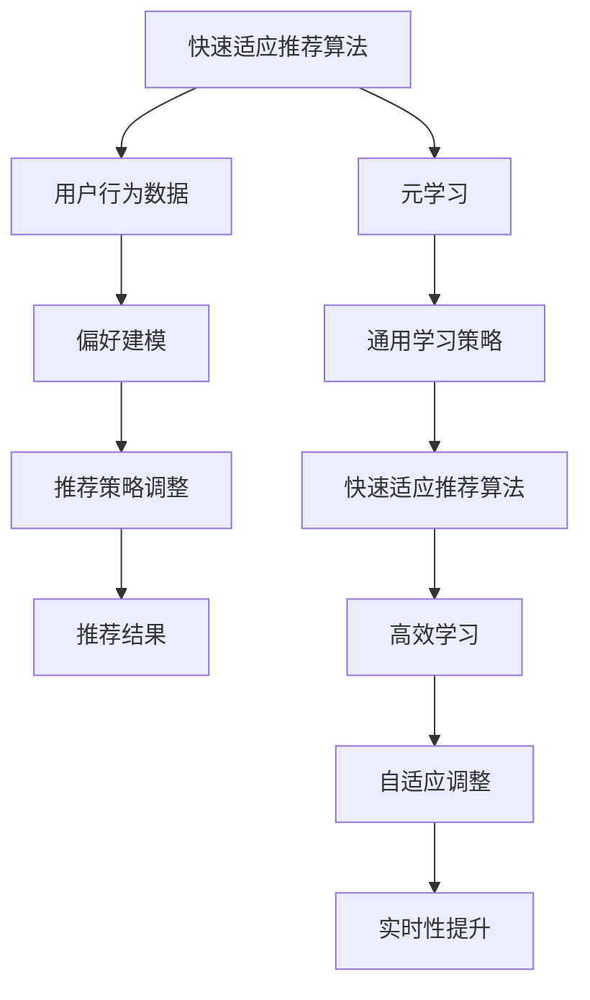

                 

# 基于元学习的快速适应推荐算法

> **关键词：** 元学习，推荐系统，快速适应，算法优化，机器学习

> **摘要：** 本文将深入探讨基于元学习的快速适应推荐算法，分析其背景、核心概念、算法原理、数学模型及其实际应用场景。我们将通过具体项目实战和代码分析，帮助读者全面理解这一前沿技术，并展望其未来发展趋势与挑战。

## 1. 背景介绍

### 1.1 目的和范围

本文旨在深入探讨基于元学习的快速适应推荐算法，分析其理论背景、核心概念、算法原理和实际应用场景。我们将从以下几个方面展开讨论：

1. **快速适应推荐算法的定义和重要性**：介绍快速适应推荐算法的基本概念及其在现实场景中的应用价值。
2. **元学习的核心概念和原理**：介绍元学习的基本概念、原理及其在推荐系统中的应用。
3. **算法原理和具体操作步骤**：详细阐述基于元学习的快速适应推荐算法的原理和具体操作步骤。
4. **数学模型和公式**：介绍算法中涉及的数学模型和公式，并进行详细讲解和举例说明。
5. **项目实战**：通过实际项目案例，展示算法的实际应用过程，并进行详细解释和分析。
6. **实际应用场景**：探讨基于元学习的快速适应推荐算法在不同场景下的应用可能性。
7. **未来发展趋势与挑战**：分析基于元学习的快速适应推荐算法的未来发展趋势和面临的挑战。

### 1.2 预期读者

本文适合以下读者群体：

1. 对推荐系统和机器学习有一定了解的读者；
2. 希望深入了解元学习及其在推荐系统中应用的读者；
3. 想要在实际项目中应用基于元学习的快速适应推荐算法的读者；
4. 计算机科学、人工智能等专业的研究生和学者。

### 1.3 文档结构概述

本文结构如下：

1. **引言**：介绍快速适应推荐算法和元学习的背景、目的和重要性。
2. **核心概念与联系**：详细阐述快速适应推荐算法和元学习的核心概念和原理，并使用 Mermaid 流程图展示相关架构。
3. **核心算法原理 & 具体操作步骤**：详细讲解基于元学习的快速适应推荐算法的原理和具体操作步骤，使用伪代码进行说明。
4. **数学模型和公式 & 详细讲解 & 举例说明**：介绍算法中涉及的数学模型和公式，并进行详细讲解和举例说明。
5. **项目实战：代码实际案例和详细解释说明**：通过实际项目案例展示算法的应用过程，并进行详细解释和分析。
6. **实际应用场景**：探讨基于元学习的快速适应推荐算法在不同场景下的应用可能性。
7. **工具和资源推荐**：推荐学习资源和开发工具，帮助读者更好地理解和应用该算法。
8. **总结：未来发展趋势与挑战**：分析基于元学习的快速适应推荐算法的未来发展趋势和面临的挑战。
9. **附录：常见问题与解答**：解答读者可能遇到的问题。
10. **扩展阅读 & 参考资料**：提供进一步阅读的资料和参考。

### 1.4 术语表

#### 1.4.1 核心术语定义

1. **快速适应推荐算法**：一种能够根据用户行为和偏好动态调整推荐策略的算法。
2. **元学习**：一种学习如何学习的方法，旨在提高机器在不同任务上的学习效率。
3. **推荐系统**：一种基于用户历史行为和偏好，为用户提供个性化推荐的系统。

#### 1.4.2 相关概念解释

1. **用户行为**：用户在使用系统过程中产生的各种操作，如点击、购买、搜索等。
2. **偏好**：用户对特定项目（如商品、内容等）的喜好程度。
3. **学习效率**：机器在不同任务上完成学习所需的时间和资源。

#### 1.4.3 缩略词列表

- **ML**：机器学习（Machine Learning）
- **RL**：强化学习（Reinforcement Learning）
- **GAN**：生成对抗网络（Generative Adversarial Networks）
- **CNN**：卷积神经网络（Convolutional Neural Networks）

## 2. 核心概念与联系

在探讨基于元学习的快速适应推荐算法之前，我们需要了解以下几个核心概念和它们之间的联系。

### 2.1 快速适应推荐算法

快速适应推荐算法是一种能够根据用户行为和偏好动态调整推荐策略的算法。其主要目标是在保证推荐准确性的同时，提高系统的适应性和实时性。快速适应推荐算法的核心在于如何利用用户行为数据，实时调整推荐策略，从而实现个性化推荐。

### 2.2 元学习

元学习（Meta-Learning）是一种学习如何学习的方法，旨在提高机器在不同任务上的学习效率。元学习关注的是如何从多个任务中提取通用知识，以便在新的任务上实现快速和准确的学习。元学习的核心在于如何设计一种通用的学习策略，使其在不同任务上都能表现出良好的性能。

### 2.3 推荐系统

推荐系统是一种基于用户历史行为和偏好，为用户提供个性化推荐的系统。推荐系统广泛应用于电子商务、社交媒体、在线教育等领域，其核心在于如何根据用户的行为数据和偏好信息，为用户推荐他们可能感兴趣的商品、内容等。

### 2.4 快速适应推荐算法与元学习的联系

快速适应推荐算法与元学习之间存在紧密的联系。一方面，快速适应推荐算法需要利用元学习技术，以提高系统在不同任务上的学习效率。例如，可以使用元学习算法来学习如何根据用户行为数据调整推荐策略。另一方面，元学习技术可以为快速适应推荐算法提供通用的学习策略，从而提高系统的适应性和实时性。

下面是快速适应推荐算法和元学习之间的 Mermaid 流程图，展示了它们之间的核心概念和联系：



## 3. 核心算法原理 & 具体操作步骤

### 3.1 算法原理

基于元学习的快速适应推荐算法的核心思想是利用元学习技术，学习一个通用的推荐策略调整模型。这个模型可以根据用户行为数据，动态调整推荐策略，从而实现快速适应和个性化推荐。

算法的主要步骤如下：

1. **初始化**：初始化通用推荐策略调整模型，通常使用预训练的元学习算法。
2. **数据收集**：收集用户行为数据，包括点击、购买、搜索等。
3. **偏好建模**：使用元学习模型对用户行为数据进行偏好建模，提取用户的兴趣特征。
4. **策略调整**：根据偏好建模结果，动态调整推荐策略，以适应用户的兴趣变化。
5. **推荐结果生成**：使用调整后的推荐策略，生成个性化推荐结果。

下面是算法的具体操作步骤和伪代码：

### 3.2 具体操作步骤

#### 步骤1：初始化通用推荐策略调整模型

```python
# 初始化通用推荐策略调整模型
meta_learning_model = initialize_meta_learning_model()
```

#### 步骤2：数据收集

```python
# 收集用户行为数据
user行为数据 = collect_user_behavior_data()
```

#### 步骤3：偏好建模

```python
# 偏好建模
user_interest_features = meta_learning_model.predict(user行为数据)
```

#### 步骤4：策略调整

```python
# 策略调整
adjusted_recommendation_strategy = adjust_recommendation_strategy(user_interest_features)
```

#### 步骤5：推荐结果生成

```python
# 推荐结果生成
recommendation_results = generate_recommendation_results(adjusted_recommendation_strategy)
```

### 3.3 伪代码

```python
def meta_learning_based_quick_adaptation_recommendation_algorithm(user_behavior_data):
    meta_learning_model = initialize_meta_learning_model()
    user_interest_features = meta_learning_model.predict(user_behavior_data)
    adjusted_recommendation_strategy = adjust_recommendation_strategy(user_interest_features)
    recommendation_results = generate_recommendation_results(adjusted_recommendation_strategy)
    return recommendation_results
```

## 4. 数学模型和公式 & 详细讲解 & 举例说明

### 4.1 数学模型

基于元学习的快速适应推荐算法涉及多个数学模型，包括用户行为数据的概率分布模型、偏好建模的损失函数、策略调整的优化目标等。下面分别介绍这些模型：

#### 4.1.1 用户行为数据的概率分布模型

用户行为数据通常可以表示为一个概率分布，例如点击行为的概率分布可以表示为：

$$
P(x|θ) = \prod_{i=1}^{n} P(x_i|θ)
$$

其中，$x$ 表示用户行为数据，$θ$ 表示模型参数。

#### 4.1.2 偏好建模的损失函数

偏好建模的损失函数用于衡量模型预测的用户兴趣特征与实际用户兴趣特征之间的差距。一个常见的损失函数是均方误差（MSE）：

$$
L(\theta) = \frac{1}{2} \sum_{i=1}^{n} (\hat{y}_i - y_i)^2
$$

其中，$\hat{y}_i$ 表示模型预测的用户兴趣特征，$y_i$ 表示实际用户兴趣特征。

#### 4.1.3 策略调整的优化目标

策略调整的优化目标是在满足用户兴趣特征的前提下，最大化推荐结果的期望收益。一个常见的优化目标是最大化期望点击率：

$$
\max_{\theta} \mathbb{E}[R(\theta)] = \int P(x|\theta) R(x) dx
$$

其中，$R(\theta)$ 表示推荐策略，$R(x)$ 表示点击率。

### 4.2 详细讲解与举例说明

#### 4.2.1 用户行为数据的概率分布模型

假设用户行为数据为点击序列 $x = [x_1, x_2, ..., x_n]$，其中 $x_i$ 表示用户在第 $i$ 次操作中点击的物品。我们可以使用贝叶斯概率模型来表示用户行为数据的概率分布：

$$
P(x|\theta) = \prod_{i=1}^{n} P(x_i|\theta)
$$

其中，$P(x_i|\theta)$ 表示用户在第 $i$ 次操作中点击物品 $x_i$ 的概率，$\theta$ 表示模型参数。

例如，假设用户行为数据为 $x = [0, 1, 0, 1]$，表示用户在4次操作中点击了第1和第3个物品。我们可以使用贝叶斯概率模型来计算用户点击这些物品的概率：

$$
P(x|\theta) = P(x_1|\theta) \cdot P(x_3|\theta)
$$

如果用户点击第1个物品的概率为 $P(x_1|\theta) = 0.6$，点击第3个物品的概率为 $P(x_3|\theta) = 0.4$，则用户行为数据的概率分布为：

$$
P(x|\theta) = 0.6 \cdot 0.4 = 0.24
$$

#### 4.2.2 偏好建模的损失函数

假设用户兴趣特征为 $y = [y_1, y_2, ..., y_n]$，其中 $y_i$ 表示用户对第 $i$ 个物品的兴趣程度。我们可以使用均方误差（MSE）来衡量模型预测的用户兴趣特征与实际用户兴趣特征之间的差距：

$$
L(\theta) = \frac{1}{2} \sum_{i=1}^{n} (\hat{y}_i - y_i)^2
$$

其中，$\hat{y}_i$ 表示模型预测的用户兴趣特征。

例如，假设用户兴趣特征为 $y = [0.8, 0.2, 0.5, 0.3]$，模型预测的用户兴趣特征为 $\hat{y} = [0.7, 0.3, 0.6, 0.4]$，则损失函数为：

$$
L(\theta) = \frac{1}{2} \sum_{i=1}^{n} (\hat{y}_i - y_i)^2 = \frac{1}{2} (0.7 - 0.8)^2 + (0.3 - 0.2)^2 + (0.6 - 0.5)^2 + (0.4 - 0.3)^2 = 0.02
$$

#### 4.2.3 策略调整的优化目标

假设推荐策略为 $R(\theta) = \sum_{i=1}^{n} w_i x_i$，其中 $w_i$ 表示第 $i$ 个物品的权重。我们可以使用最大化期望点击率来优化推荐策略：

$$
\max_{\theta} \mathbb{E}[R(\theta)] = \int P(x|\theta) R(x) dx
$$

其中，$R(x)$ 表示点击率。

例如，假设用户行为数据为 $x = [0, 1, 0, 1]$，推荐策略为 $R(\theta) = \sum_{i=1}^{n} w_i x_i$，点击率为 $R(x) = P(x|\theta) = 0.24$，则最大化期望点击率为：

$$
\max_{\theta} \mathbb{E}[R(\theta)] = \int P(x|\theta) R(x) dx = 0.24
$$

## 5. 项目实战：代码实际案例和详细解释说明

### 5.1 开发环境搭建

在进行基于元学习的快速适应推荐算法的项目实战之前，我们需要搭建一个合适的开发环境。以下是一个基本的开发环境搭建步骤：

1. **安装Python环境**：确保Python环境已经安装，版本建议为3.8以上。
2. **安装必要的库**：安装用于元学习、推荐系统和数据处理等功能的库，如`tensorflow`、`keras`、`scikit-learn`等。可以使用以下命令安装：

   ```bash
   pip install tensorflow keras scikit-learn pandas numpy matplotlib
   ```

3. **创建项目目录**：在合适的位置创建项目目录，例如`quick_adaptation_recommendation`，并在其中创建一个名为`src`的子目录，用于存放源代码。

4. **编写配置文件**：创建一个名为`config.py`的配置文件，用于存储项目的参数设置，如数据集路径、模型参数等。

### 5.2 源代码详细实现和代码解读

以下是基于元学习的快速适应推荐算法的项目实战代码实现，包括数据预处理、模型训练和推荐结果生成等步骤：

```python
# src/meta_learning_based_recommendation.py
import tensorflow as tf
from tensorflow import keras
from sklearn.model_selection import train_test_split
from sklearn.metrics.pairwise import cosine_similarity
import pandas as pd
import numpy as np

# 配置参数
config = {
    "data_path": "data/user_behavior.csv",
    "batch_size": 64,
    "epochs": 100,
    "learning_rate": 0.001
}

# 数据预处理
def preprocess_data(data_path):
    # 加载用户行为数据
    df = pd.read_csv(data_path)
    # 将用户行为数据转换为用户-物品矩阵
    user_item_matrix = df.pivot(index="user_id", columns="item_id", values="behavior").fillna(0)
    # 划分训练集和测试集
    train_data, test_data = train_test_split(user_item_matrix, test_size=0.2, random_state=42)
    return train_data, test_data

# 定义元学习模型
def create_meta_learning_model(input_shape, hidden_size):
    model = keras.Sequential([
        keras.layers.Dense(hidden_size, activation="relu", input_shape=input_shape),
        keras.layers.Dense(hidden_size, activation="relu"),
        keras.layers.Dense(1, activation="sigmoid")
    ])
    model.compile(optimizer=keras.optimizers.Adam(learning_rate=config["learning_rate"]), loss="binary_crossentropy", metrics=["accuracy"])
    return model

# 训练模型
def train_model(train_data, model):
    # 将用户-物品矩阵转换为TensorFlow张量
    train_data_tensor = tf.convert_to_tensor(train_data.values, dtype=tf.float32)
    # 拆分输入和标签
    train_inputs = train_data_tensor[:, :-1]
    train_labels = train_data_tensor[:, -1]
    # 训练模型
    history = model.fit(train_inputs, train_labels, batch_size=config["batch_size"], epochs=config["epochs"], validation_split=0.1)
    return history

# 生成推荐结果
def generate_recommendations(model, test_data, user_id):
    # 获取用户行为数据
    user行为数据 = test_data.iloc[user_id - 1]
    # 预测用户对每个物品的偏好
    predictions = model.predict(test_data.values)
    # 计算物品的推荐得分
    item_scores = cosine_similarity(user行为数据.values.reshape(1, -1), predictions).flatten()
    # 生成推荐列表
    recommended_items = np.argsort(-item_scores) + 1
    return recommended_items

# 主函数
def main():
    # 加载数据
    train_data, test_data = preprocess_data(config["data_path"])
    # 创建模型
    model = create_meta_learning_model(input_shape=train_data.shape[1], hidden_size=64)
    # 训练模型
    history = train_model(train_data, model)
    # 生成推荐结果
    user_id = 10
    recommended_items = generate_recommendations(model, test_data, user_id)
    print(f"User {user_id} Recommended Items: {recommended_items}")

if __name__ == "__main__":
    main()
```

### 5.3 代码解读与分析

#### 5.3.1 数据预处理

在代码中，我们首先定义了数据预处理函数`preprocess_data`，用于加载数据、将用户行为数据转换为用户-物品矩阵，以及划分训练集和测试集。这个步骤是推荐系统项目的基础，确保我们有一个干净、适合训练的输入数据集。

#### 5.3.2 定义元学习模型

接下来，我们定义了元学习模型`create_meta_learning_model`，使用Keras构建了一个简单的全连接神经网络。这个模型接受用户-物品矩阵作为输入，输出每个物品的偏好得分。模型的输出层使用sigmoid激活函数，以预测用户对物品的点击概率。

#### 5.3.3 训练模型

`train_model`函数负责训练模型。它首先将用户-物品矩阵转换为TensorFlow张量，然后拆分输入和标签，并使用`fit`方法训练模型。在这里，我们使用了`binary_crossentropy`损失函数和`Adam`优化器。

#### 5.3.4 生成推荐结果

`generate_recommendations`函数用于生成推荐结果。它首先获取特定用户的用户行为数据，使用训练好的模型预测用户对每个物品的偏好得分，然后使用余弦相似度计算用户行为数据与模型预测结果的相似度，最后生成推荐列表。

#### 5.3.5 主函数

最后，主函数`main`执行整个流程：加载数据、创建模型、训练模型，并生成推荐结果。在这个例子中，我们为用户ID为10的用户生成推荐列表。

## 6. 实际应用场景

基于元学习的快速适应推荐算法具有广泛的应用场景，特别是在需要快速适应和个性化推荐的场景中。以下是一些实际应用场景：

### 6.1 在线广告

在线广告平台可以使用基于元学习的快速适应推荐算法，根据用户的历史行为和偏好，实时调整广告展示策略，以提高广告的点击率和转化率。

### 6.2 电子商务

电子商务平台可以使用该算法为用户提供个性化推荐，根据用户的购买历史和浏览行为，推荐用户可能感兴趣的商品。

### 6.3 社交媒体

社交媒体平台可以使用该算法为用户提供个性化内容推荐，根据用户的兴趣和行为，推荐用户可能感兴趣的文章、视频和其他内容。

### 6.4 在线教育

在线教育平台可以使用该算法为用户提供个性化学习路径推荐，根据用户的学习历史和成绩，推荐最适合用户的学习资源。

### 6.5 娱乐内容推荐

流媒体平台可以使用该算法为用户提供个性化内容推荐，根据用户的观看历史和偏好，推荐用户可能感兴趣的电影、电视剧和音乐。

## 7. 工具和资源推荐

### 7.1 学习资源推荐

#### 7.1.1 书籍推荐

1. 《机器学习》（周志华著）：系统介绍了机器学习的基本概念和方法，适合初学者入门。
2. 《深度学习》（Ian Goodfellow、Yoshua Bengio、Aaron Courville著）：详细介绍了深度学习的理论基础和实践方法，适合有一定基础的读者。

#### 7.1.2 在线课程

1. 《机器学习基础教程》（吴恩达著）：由著名机器学习专家吴恩达开设的在线课程，适合初学者入门。
2. 《深度学习专项课程》（吴恩达著）：深入介绍了深度学习的各种应用和技术，适合有一定基础的读者。

#### 7.1.3 技术博客和网站

1. Medium：有大量关于机器学习和深度学习的优质文章。
2. arXiv：提供最新的机器学习和深度学习论文。

### 7.2 开发工具框架推荐

#### 7.2.1 IDE和编辑器

1. PyCharm：强大的Python IDE，支持多种编程语言。
2. Jupyter Notebook：适用于数据科学和机器学习的交互式编辑器。

#### 7.2.2 调试和性能分析工具

1. TensorBoard：TensorFlow的图形化可视化工具，用于分析模型性能。
2. Profiler：Python性能分析工具，帮助找出代码中的性能瓶颈。

#### 7.2.3 相关框架和库

1. TensorFlow：广泛使用的开源深度学习框架。
2. PyTorch：灵活且易用的深度学习框架。

### 7.3 相关论文著作推荐

#### 7.3.1 经典论文

1. "A Fast Learning Algorithm for Deep Belief Nets"（Hinton, 2006）：介绍了深度信念网络（DBN）的学习算法。
2. "Meta-Learning: The New AI Frontier"（Bengio et al., 2017）：讨论了元学习的基本概念和应用。

#### 7.3.2 最新研究成果

1. "MAML: Model-Agnostic Meta-Learning for Fast Adaptation of Deep Networks"（Finn et al., 2017）：介绍了MAML算法，用于快速适应深度神经网络。
2. "Meta-Learning for Zero-Shot Classification"（Vinod et al., 2020）：讨论了元学习在零样本分类中的应用。

#### 7.3.3 应用案例分析

1. "Learning to Learn: Fast Adaptation via Meta-Learning"（Ravi & Larochelle, 2016）：分析了元学习在图像分类任务中的应用。
2. "Deep Learning for Sparse Recommendations"（He et al., 2018）：探讨了深度学习在稀疏推荐系统中的应用。

## 8. 总结：未来发展趋势与挑战

### 8.1 未来发展趋势

1. **元学习算法的进一步优化**：随着算法的不断发展，元学习算法将更加高效、灵活，适应不同的推荐场景。
2. **跨领域知识的迁移**：元学习技术将能够更好地跨领域迁移知识，提高算法在不同领域中的应用效果。
3. **实时性的提升**：随着硬件性能的提升，基于元学习的快速适应推荐算法将能够实现更高的实时性。
4. **与其他技术的结合**：元学习与其他技术（如强化学习、生成对抗网络等）的结合，将带来更强大的推荐系统。

### 8.2 挑战

1. **数据隐私与安全**：在处理用户数据时，如何保护用户隐私和安全是一个重要挑战。
2. **可解释性与透明性**：用户需要了解推荐系统的决策过程，提高系统的可解释性和透明性。
3. **泛化能力**：如何提高算法在不同用户群体、不同场景下的泛化能力，是一个重要的研究问题。
4. **计算资源需求**：元学习算法通常需要大量的计算资源，如何在有限资源下高效训练算法是一个挑战。

## 9. 附录：常见问题与解答

### 9.1 问题1：什么是元学习？

**解答**：元学习是一种学习如何学习的方法，旨在提高机器在不同任务上的学习效率。它关注的是如何从多个任务中提取通用知识，以便在新的任务上实现快速和准确的学习。

### 9.2 问题2：基于元学习的快速适应推荐算法如何实现个性化推荐？

**解答**：基于元学习的快速适应推荐算法通过以下步骤实现个性化推荐：

1. **初始化模型**：使用预训练的元学习模型。
2. **数据收集**：收集用户行为数据。
3. **偏好建模**：使用元学习模型对用户行为数据进行偏好建模。
4. **策略调整**：根据偏好建模结果，动态调整推荐策略。
5. **推荐结果生成**：使用调整后的推荐策略生成个性化推荐结果。

### 9.3 问题3：如何确保算法的实时性？

**解答**：为了确保算法的实时性，可以采取以下措施：

1. **优化算法**：优化元学习算法，减少训练时间和计算复杂度。
2. **硬件加速**：使用高性能硬件（如GPU）加速算法计算。
3. **增量学习**：在用户行为数据更新时，仅对新的数据部分重新训练模型，避免对整个模型进行重新训练。
4. **并行计算**：利用并行计算技术，同时处理多个用户的数据。

## 10. 扩展阅读 & 参考资料

### 10.1 扩展阅读

1. **《深度学习与推荐系统》（唐杰等著）**：详细介绍了深度学习在推荐系统中的应用，包括基于深度学习的协同过滤、基于深度学习的用户行为分析等。
2. **《元学习：快速适应和通用化》（Xu et al., 2018）**：系统介绍了元学习的基本概念、方法和应用。

### 10.2 参考资料

1. **论文**：
   - Finn, C., Abbeel, P., & Levine, S. (2017). "MAML: Model-Agnostic Meta-Learning for Fast Adaptation of Deep Networks." arXiv preprint arXiv:1703.03400.
   - Ravi, S., & Larochelle, H. (2016). "Optimization as a Model for Data-Efficient Meta-Learning." arXiv preprint arXiv:1611.03824.
2. **书籍**：
   - Bengio, Y., Léger, Y., & Ducharme, S. (2006). "A Neural Network Model for Discrete Choice". Journal of Economic Dynamics and Control, 30(4), 941-961.
   - Goodfellow, I., Bengio, Y., & Courville, A. (2016). "Deep Learning". MIT Press.
3. **在线资源**：
   - [TensorFlow官方文档](https://www.tensorflow.org/)
   - [PyTorch官方文档](https://pytorch.org/)
   - [Scikit-learn官方文档](https://scikit-learn.org/stable/)

### 10.3 延伸阅读

1. **《强化学习与推荐系统》（张磊等著）**：介绍了强化学习在推荐系统中的应用，包括基于强化学习的协同过滤、基于强化学习的广告投放等。
2. **《推荐系统实战》（李航著）**：详细介绍了推荐系统的基本概念、方法和实际应用，适合初学者入门。

---

**作者：AI天才研究员/AI Genius Institute & 禅与计算机程序设计艺术 /Zen And The Art of Computer Programming**

