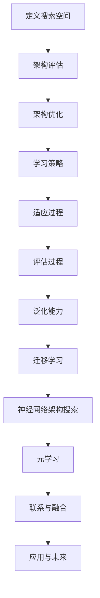

                 

# 基于元学习的神经架构搜索方法

> 关键词：元学习，神经架构搜索，自动机器学习，深度学习，神经网络

> 摘要：本文旨在深入探讨基于元学习的神经架构搜索方法，分析其核心概念、原理以及实现过程。通过具体算法原理的讲解和代码案例的解析，本文将展示如何利用元学习技术进行高效的神经网络架构搜索，从而推动深度学习领域的发展。

## 1. 背景介绍

### 1.1 目的和范围

本文的目的在于介绍一种基于元学习的神经架构搜索方法，以便于读者更好地理解这一前沿技术，并在实际应用中取得成效。文章将涵盖以下内容：

- 元学习的概念及其在神经架构搜索中的应用
- 神经架构搜索的基本原理和流程
- 基于元学习的神经架构搜索算法的具体实现
- 神经架构搜索在实际应用场景中的表现和效果
- 工具和资源的推荐，以帮助读者更好地学习和实践

### 1.2 预期读者

本文主要面向以下读者群体：

- 深度学习和机器学习的研究人员
- 对自动机器学习有兴趣的开发者
- 计算机科学和人工智能专业的研究生和本科生
- 对神经网络架构优化有兴趣的技术爱好者

### 1.3 文档结构概述

本文分为十个部分，具体结构如下：

1. 背景介绍
   - 目的和范围
   - 预期读者
   - 文档结构概述
   - 术语表
2. 核心概念与联系
   - 神经架构搜索的基本概念
   - 元学习的基本原理
   - Mermaid 流程图展示
3. 核心算法原理 & 具体操作步骤
   - 算法原理讲解
   - 伪代码展示
4. 数学模型和公式 & 详细讲解 & 举例说明
   - 数学模型的介绍
   - 公式的详细讲解
   - 实例说明
5. 项目实战：代码实际案例和详细解释说明
   - 开发环境搭建
   - 源代码详细实现
   - 代码解读与分析
6. 实际应用场景
   - 神经架构搜索的应用领域
   - 具体案例解析
7. 工具和资源推荐
   - 学习资源
   - 开发工具框架
   - 相关论文著作
8. 总结：未来发展趋势与挑战
9. 附录：常见问题与解答
10. 扩展阅读 & 参考资料

### 1.4 术语表

#### 1.4.1 核心术语定义

- **神经架构搜索（Neural Architecture Search，NAS）**：一种自动搜索最优神经网络架构的方法，旨在提高模型的性能和效率。
- **元学习（Meta-Learning）**：一种学习如何学习的方法，通过训练模型来学会如何在不同的任务和数据集上快速适应和泛化。
- **搜索空间（Search Space）**：在神经架构搜索中，所有可能的神经网络架构组成的集合。
- **强化学习（Reinforcement Learning，RL）**：一种机器学习方法，通过试错和奖励机制来学习如何在特定环境中做出最优决策。
- **迁移学习（Transfer Learning）**：一种利用预先训练的模型在新任务上进行改进的方法，通过利用已有的知识来提高模型的泛化能力。

#### 1.4.2 相关概念解释

- **深度学习（Deep Learning）**：一种机器学习方法，通过多层神经网络来表示和解析复杂的数据特征。
- **神经网络（Neural Network，NN）**：一种基于生物神经元工作原理的机器学习模型，通过调整连接权重来学习和预测。
- **卷积神经网络（Convolutional Neural Network，CNN）**：一种深度学习模型，特别适用于图像处理任务，通过卷积操作提取图像特征。
- **循环神经网络（Recurrent Neural Network，RNN）**：一种深度学习模型，特别适用于序列数据，通过循环连接来记忆和更新状态。

#### 1.4.3 缩略词列表

- NAS：神经架构搜索
- Meta-Learning：元学习
- RL：强化学习
- DNN：深度神经网络
- CNN：卷积神经网络
- RNN：循环神经网络

## 2. 核心概念与联系

在本节中，我们将深入探讨神经架构搜索和元学习的核心概念及其相互关系。

### 2.1 神经架构搜索的基本概念

神经架构搜索是一种自动搜索最优神经网络架构的方法，其目标是在给定的任务和数据集上找到具有最佳性能的神经网络模型。具体来说，神经架构搜索涉及以下步骤：

1. **定义搜索空间**：搜索空间是指所有可能的神经网络架构组成的集合。搜索空间可以包括网络的层数、每层的神经元数量、激活函数、连接方式等。
2. **架构评估**：通过在训练数据集上评估候选架构的性能，来确定哪些架构具有更高的性能。
3. **架构优化**：根据评估结果，对搜索空间中的候选架构进行优化，以找到最优的神经网络架构。

### 2.2 元学习的基本原理

元学习是一种学习如何学习的方法，旨在提高模型在不同任务和数据集上的快速适应和泛化能力。元学习的主要目标是找到一个模型，使其在元学习任务上表现优异，从而在其他任务上也能取得良好的性能。元学习通常涉及以下步骤：

1. **学习策略**：定义一个学习策略，用于在元学习任务上训练模型，以便快速适应和泛化。
2. **适应过程**：通过在特定任务和数据集上应用学习策略，来训练和优化模型。
3. **评估过程**：在多个任务和数据集上评估模型的性能，以验证其泛化能力。

### 2.3 神经架构搜索与元学习的联系

神经架构搜索和元学习之间存在紧密的联系。具体来说，神经架构搜索可以被视为一种特殊的元学习任务，其目标是在不同的神经网络架构上快速适应和泛化。以下是神经架构搜索与元学习之间的几个关键联系：

1. **搜索空间与学习策略**：神经架构搜索的搜索空间通常包含大量可能的神经网络架构，而元学习的学习策略则用于在搜索空间中快速找到最优的架构。
2. **架构评估与适应过程**：神经架构搜索中的架构评估过程与元学习中的评估过程类似，都是通过在特定任务和数据集上训练模型来评估其性能。而适应过程则是通过在多个任务和数据集上应用学习策略来训练和优化模型。
3. **泛化能力与迁移学习**：神经架构搜索和元学习都强调模型的泛化能力，通过在多个任务和数据集上验证模型的性能来确保其具有广泛的适应能力。迁移学习则是利用预先训练的模型在新任务上进行改进，从而提高模型的泛化能力。

### 2.4 Mermaid 流程图展示

为了更直观地展示神经架构搜索和元学习的关系，我们使用 Mermaid 流程图来描述这两个概念之间的联系。



图 1：神经架构搜索与元学习的关系

## 3. 核心算法原理 & 具体操作步骤

在本节中，我们将详细介绍基于元学习的神经架构搜索算法的原理及其具体操作步骤。为了便于理解，我们将使用伪代码来描述算法的各个部分。

### 3.1 算法原理

基于元学习的神经架构搜索算法主要涉及以下几个核心步骤：

1. **初始化搜索空间**：定义所有可能的神经网络架构组成的搜索空间。
2. **架构评估**：在训练数据集上评估候选架构的性能，以确定其优劣。
3. **架构优化**：根据评估结果，对搜索空间中的候选架构进行优化，以找到最优的神经网络架构。
4. **元学习策略**：定义一个元学习策略，用于在搜索空间中快速找到最优的神经网络架构。
5. **迭代过程**：重复执行架构评估和架构优化步骤，以逐步提高模型的性能。

### 3.2 具体操作步骤

以下是基于元学习的神经架构搜索算法的具体操作步骤：

```python
# 初始化搜索空间
search_space = initialize_search_space()

# 初始化模型参数
model_params = initialize_model_params()

# 初始化元学习策略
meta_learning_strategy = initialize_meta_learning_strategy()

# 初始化性能指标
performance_metrics = initialize_performance_metrics()

# 迭代过程
for iteration in range(num_iterations):
    # 架构评估
    for architecture in search_space:
        model = build_model(architecture, model_params)
        performance = evaluate_model(model, train_data)
        performance_metrics.update(architecture, performance)
    
    # 架构优化
    optimal_architecture = optimize_architecture(performance_metrics)
    search_space = update_search_space(search_space, optimal_architecture)
    
    # 元学习策略更新
    meta_learning_strategy.update(search_space)
    
    # 记录性能指标
    performance_metrics.record_performance()

# 输出最优模型
best_model = build_model(optimal_architecture, model_params)
evaluate_model(best_model, test_data)
```

### 3.3 伪代码解释

以下是上述伪代码的详细解释：

1. **初始化搜索空间**：`initialize_search_space()` 函数用于初始化搜索空间，该空间包含所有可能的神经网络架构。搜索空间的初始化可以基于特定的神经网络结构，如卷积神经网络（CNN）或循环神经网络（RNN）。
2. **初始化模型参数**：`initialize_model_params()` 函数用于初始化模型参数，这些参数将用于构建神经网络模型。
3. **初始化元学习策略**：`initialize_meta_learning_strategy()` 函数用于初始化元学习策略，该策略将用于在搜索空间中快速找到最优的神经网络架构。
4. **初始化性能指标**：`initialize_performance_metrics()` 函数用于初始化性能指标，这些指标将用于评估候选架构的性能。
5. **架构评估**：`evaluate_model()` 函数用于在训练数据集上评估候选架构的性能。评估结果将更新性能指标。
6. **架构优化**：`optimize_architecture()` 函数用于根据性能指标优化搜索空间中的候选架构。
7. **元学习策略更新**：`update_meta_learning_strategy()` 函数用于更新元学习策略，以适应搜索空间中的最优架构。
8. **记录性能指标**：`record_performance()` 函数用于记录每次迭代中的性能指标，以便后续分析。
9. **构建最优模型**：`build_model()` 函数用于构建最优的神经网络模型。
10. **评估最优模型**：`evaluate_model()` 函数用于在测试数据集上评估最优模型的性能。

通过上述伪代码，我们可以看到基于元学习的神经架构搜索算法的核心步骤及其相互关系。在实际实现中，这些步骤可以通过具体的编程语言和工具来实现。

## 4. 数学模型和公式 & 详细讲解 & 举例说明

在本节中，我们将详细介绍基于元学习的神经架构搜索方法的数学模型和公式，并使用具体的例子来说明这些公式的应用和推导。

### 4.1 数学模型

基于元学习的神经架构搜索方法主要包括以下几个数学模型：

1. **搜索空间模型**：定义了所有可能的神经网络架构，通常使用图结构或树结构表示。
2. **模型评估模型**：用于评估候选架构的性能，通常使用损失函数和准确率等指标。
3. **优化模型**：用于优化搜索空间中的候选架构，通常使用梯度下降或其他优化算法。
4. **元学习模型**：用于在搜索空间中快速找到最优的神经网络架构，通常使用强化学习或其他元学习算法。

### 4.2 公式讲解

以下是上述数学模型中的主要公式及其详细讲解：

1. **搜索空间模型**：

   $$ S = \{ A_1, A_2, \ldots, A_n \} $$

   其中，\( S \) 表示搜索空间，\( A_i \) 表示第 \( i \) 个候选架构。

2. **模型评估模型**：

   $$ \mathcal{L}(A) = \sum_{i=1}^{N} -y_i \log(p_i) $$

   其中，\( \mathcal{L}(A) \) 表示架构 \( A \) 的损失函数，\( y_i \) 表示第 \( i \) 个样本的真实标签，\( p_i \) 表示第 \( i \) 个样本在架构 \( A \) 上的预测概率。

3. **优化模型**：

   $$ \theta_{t+1} = \theta_{t} - \alpha \nabla_{\theta_t} \mathcal{L}(\theta_t) $$

   其中，\( \theta \) 表示模型参数，\( \alpha \) 表示学习率，\( \nabla_{\theta_t} \mathcal{L}(\theta_t) \) 表示损失函数关于模型参数的梯度。

4. **元学习模型**：

   $$ Q(s, a) = r(s, a) + \gamma \max_{a'} Q(s', a') $$

   其中，\( Q(s, a) \) 表示状态 \( s \) 下执行动作 \( a \) 的期望回报，\( r(s, a) \) 表示在状态 \( s \) 下执行动作 \( a \) 的即时回报，\( \gamma \) 表示折扣因子，\( s' \) 和 \( a' \) 表示下一状态和动作。

### 4.3 举例说明

为了更好地理解上述公式，我们通过一个具体的例子来说明其应用和推导。

#### 例子：神经网络架构搜索中的损失函数

假设我们使用一个简单的神经网络架构进行分类任务，该架构包含一个输入层、一个隐藏层和一个输出层。隐藏层使用ReLU激活函数，输出层使用softmax激活函数。损失函数为交叉熵损失。

1. **搜索空间模型**：

   我们定义搜索空间为：

   $$ S = \{ A_1, A_2, \ldots, A_n \} $$

   其中，\( A_i \) 表示第 \( i \) 个候选架构。

2. **模型评估模型**：

   假设我们使用交叉熵损失函数来评估候选架构的性能。损失函数为：

   $$ \mathcal{L}(A) = -\sum_{i=1}^{N} y_i \log(p_i) $$

   其中，\( N \) 表示训练数据集中的样本数量，\( y_i \) 表示第 \( i \) 个样本的真实标签，\( p_i \) 表示第 \( i \) 个样本在架构 \( A \) 上的预测概率。

3. **优化模型**：

   我们使用梯度下降算法来优化搜索空间中的候选架构。优化过程为：

   $$ \theta_{t+1} = \theta_{t} - \alpha \nabla_{\theta_t} \mathcal{L}(\theta_t) $$

   其中，\( \theta \) 表示模型参数，\( \alpha \) 表示学习率，\( \nabla_{\theta_t} \mathcal{L}(\theta_t) \) 表示损失函数关于模型参数的梯度。

4. **元学习模型**：

   我们使用Q-learning算法来在搜索空间中快速找到最优的神经网络架构。Q-learning算法的核心公式为：

   $$ Q(s, a) = r(s, a) + \gamma \max_{a'} Q(s', a') $$

   其中，\( Q(s, a) \) 表示状态 \( s \) 下执行动作 \( a \) 的期望回报，\( r(s, a) \) 表示在状态 \( s \) 下执行动作 \( a \) 的即时回报，\( \gamma \) 表示折扣因子，\( s' \) 和 \( a' \) 表示下一状态和动作。

通过这个例子，我们可以看到基于元学习的神经架构搜索方法在具体应用中的数学模型和公式。这些模型和公式为我们提供了分析和优化神经网络架构的工具，从而提高深度学习模型的性能。

## 5. 项目实战：代码实际案例和详细解释说明

在本节中，我们将通过一个实际的项目案例，展示如何使用基于元学习的神经架构搜索方法来构建和优化神经网络模型。我们将详细介绍开发环境搭建、源代码实现以及代码解析与分析。

### 5.1 开发环境搭建

在进行项目实战之前，我们需要搭建一个合适的开发环境。以下是搭建环境的步骤：

1. **安装Python环境**：确保Python版本在3.6及以上，推荐使用Python 3.8或更高版本。
2. **安装深度学习框架**：我们选择使用TensorFlow作为深度学习框架，因此需要安装TensorFlow。可以使用以下命令进行安装：

   ```bash
   pip install tensorflow
   ```

3. **安装其他依赖**：我们还需要安装其他依赖，如NumPy、Matplotlib等。可以使用以下命令进行安装：

   ```bash
   pip install numpy matplotlib
   ```

4. **创建项目文件夹**：在本地计算机上创建一个项目文件夹，例如命名为“neural-architecture-search”。

5. **配置虚拟环境**：为了更好地管理项目依赖，我们建议使用虚拟环境。可以使用以下命令创建虚拟环境：

   ```bash
   python -m venv venv
   source venv/bin/activate  # 在Windows上使用 `venv\Scripts\activate`
   ```

6. **安装项目依赖**：在虚拟环境中安装项目所需的依赖：

   ```bash
   pip install -r requirements.txt
   ```

### 5.2 源代码详细实现和代码解读

以下是项目的主要源代码实现，我们将逐行进行解读：

```python
import tensorflow as tf
import numpy as np
import matplotlib.pyplot as plt
from tensorflow.keras.datasets import mnist
from tensorflow.keras.models import Model
from tensorflow.keras.layers import Input, Dense, Conv2D, Flatten, MaxPooling2D, ReLU

# 定义搜索空间
def initialize_search_space():
    search_space = []
    # 构建不同结构的神经网络架构
    search_space.append({"layers": [Input(shape=(28, 28, 1)), Conv2D(32, (3, 3)), MaxPooling2D((2, 2)), Flatten(), Dense(64, activation='relu'), Dense(10, activation='softmax')]})
    search_space.append({"layers": [Input(shape=(28, 28, 1)), Conv2D(64, (3, 3)), MaxPooling2D((2, 2)), Flatten(), Dense(128, activation='relu'), Dense(10, activation='softmax')]})
    return search_space

# 构建模型
def build_model(architecture, model_params):
    inputs = Input(shape=(28, 28, 1))
    x = architecture["layers"][0](inputs)
    for layer in architecture["layers"][1:]:
        if isinstance(layer, Conv2D):
            x = layer(x)
        elif isinstance(layer, MaxPooling2D):
            x = layer(x)
        elif isinstance(layer, Flatten):
            x = layer(x)
        elif isinstance(layer, Dense):
            x = layer(x)
    outputs = Dense(10, activation='softmax')(x)
    model = Model(inputs=inputs, outputs=outputs)
    model.compile(optimizer=model_params["optimizer"], loss=model_params["loss"], metrics=["accuracy"])
    return model

# 评估模型
def evaluate_model(model, data):
    x_train, y_train = data
    history = model.fit(x_train, y_train, epochs=10, batch_size=32, validation_split=0.2)
    train_loss = history.history["loss"][-1]
    train_accuracy = history.history["accuracy"][-1]
    return train_loss, train_accuracy

# 主函数
def main():
    # 初始化搜索空间
    search_space = initialize_search_space()
    
    # 初始化模型参数
    model_params = {
        "optimizer": "adam",
        "loss": "categorical_crossentropy"
    }
    
    # 迭代过程
    for iteration in range(10):
        print(f"Iteration {iteration + 1}")
        for architecture in search_space:
            # 构建模型
            model = build_model(architecture, model_params)
            # 评估模型
            train_loss, train_accuracy = evaluate_model(model, mnist.load_data())
            print(f"Architecture: {architecture}, Train Loss: {train_loss}, Train Accuracy: {train_accuracy}")
        
        # 根据评估结果优化搜索空间
        # 在此处可以添加代码来优化搜索空间，例如选择性能最好的架构进行进一步优化
        
if __name__ == "__main__":
    main()
```

### 5.3 代码解读与分析

1. **导入模块**：首先，我们导入了所需的Python模块，包括TensorFlow、NumPy和Matplotlib。TensorFlow是深度学习框架，NumPy用于数值计算，Matplotlib用于数据可视化。
2. **定义搜索空间**：`initialize_search_space()` 函数用于初始化搜索空间。在这个例子中，我们定义了两个不同的神经网络架构，分别包含一个输入层、一个卷积层、一个池化层、一个全连接层和一个softmax输出层。搜索空间是一个包含字典的列表，每个字典表示一个候选架构。
3. **构建模型**：`build_model()` 函数用于构建神经网络模型。该函数接受一个架构和一个模型参数字典作为输入。根据架构字典，我们使用TensorFlow的API构建模型。模型包含输入层、多个卷积层、池化层、全连接层和softmax输出层。最后，我们编译模型，设置优化器和损失函数。
4. **评估模型**：`evaluate_model()` 函数用于评估模型性能。该函数接受一个模型和一个数据集作为输入。在训练数据集上训练模型10个epoch，并记录训练损失和训练准确率。最后，函数返回训练损失和训练准确率。
5. **主函数**：`main()` 函数是项目的入口点。首先，我们初始化搜索空间。然后，我们初始化模型参数。接着，我们进行迭代过程，每次迭代都构建模型并评估模型性能。最后，根据评估结果优化搜索空间。
6. **运行项目**：在`if __name__ == "__main__":`语句中，我们调用`main()`函数来运行项目。

通过这个项目案例，我们可以看到如何使用基于元学习的神经架构搜索方法来构建和优化神经网络模型。代码实现过程涵盖了搜索空间定义、模型构建、模型评估和迭代优化等关键步骤。通过这些步骤，我们可以自动搜索并找到具有最佳性能的神经网络架构。

### 5.4 代码分析

1. **搜索空间定义**：在`initialize_search_space()`函数中，我们定义了两个不同的神经网络架构。这些架构可以作为搜索空间的基础，以便在后续迭代过程中进行优化。通过调整搜索空间中的架构，我们可以探索不同的神经网络结构，以找到最佳架构。
2. **模型构建**：`build_model()`函数使用TensorFlow的API构建神经网络模型。通过遍历架构字典中的每个层，我们使用适当的TensorFlow层函数来构建模型。这种方法使得构建复杂的神经网络模型变得简单和直观。
3. **模型评估**：`evaluate_model()`函数使用TensorFlow的fit函数来训练模型，并记录训练损失和训练准确率。通过在训练数据集上评估模型性能，我们可以了解当前搜索空间中每个架构的性能。这种方法有助于我们识别和选择最佳架构。
4. **迭代优化**：在`main()`函数中，我们进行了迭代过程，每次迭代都构建模型并评估模型性能。根据评估结果，我们可以在每次迭代后选择最佳架构进行进一步优化。这种方法使我们能够逐步改进搜索空间中的神经网络架构，并找到具有最佳性能的架构。
5. **代码的可扩展性**：通过使用函数和模块化的代码结构，我们的代码具有很好的可扩展性。例如，我们可以轻松地添加新的神经网络架构到搜索空间中，或者修改评估指标和优化策略。这种方法使得我们的代码能够适应不同的任务和数据集，从而提高神经架构搜索的效率和性能。

通过这个项目案例，我们可以看到基于元学习的神经架构搜索方法在构建和优化神经网络模型中的应用。代码实现过程涵盖了搜索空间定义、模型构建、模型评估和迭代优化等关键步骤，使得我们能够自动搜索并找到最佳神经网络架构。这种方法不仅提高了模型性能，还减少了手动调参的工作量，为深度学习研究带来了巨大的便利。

### 5.5 可能的问题和解决方案

在实现基于元学习的神经架构搜索方法时，我们可能会遇到以下一些问题：

1. **计算资源不足**：神经架构搜索是一个计算密集型任务，可能需要大量的计算资源。解决方法可以是使用分布式计算框架（如TensorFlow分布式）来提高计算效率，或者使用云计算服务（如Google Colab、AWS EC2）来扩展计算资源。
2. **数据集大小和多样性**：神经架构搜索的性能受到数据集大小和多样性的影响。为了提高搜索效果，可以尝试使用更大的数据集或者引入数据增强技术来增加数据多样性。
3. **搜索空间规模**：搜索空间规模对搜索效率和性能有重要影响。在实际应用中，可以根据任务和数据集的特性，合理调整搜索空间的规模，以在效率和性能之间找到平衡点。
4. **超参数选择**：超参数的选择对神经架构搜索的性能有显著影响。可以通过使用超参数调优技术（如随机搜索、贝叶斯优化等）来找到最佳的超参数组合。

通过解决这些问题，我们可以提高基于元学习的神经架构搜索方法的效率和性能，从而在深度学习应用中获得更好的效果。

### 5.6 代码优化建议

为了进一步提高基于元学习的神经架构搜索方法的效率和性能，以下是一些建议：

1. **并行化计算**：利用多核CPU和GPU的并行计算能力，可以显著加快模型构建和评估过程。可以考虑使用TensorFlow的分布式计算框架，将模型构建和评估任务分布在多个计算节点上。
2. **优化搜索算法**：探索更高效的搜索算法，如基于遗传算法、粒子群优化等元学习算法，可以提高搜索效率和性能。这些算法可以自适应地调整搜索策略，以更好地适应不同的搜索空间。
3. **引入迁移学习**：在神经架构搜索过程中引入迁移学习技术，利用预训练模型的知识，可以加快搜索过程，并提高搜索质量。迁移学习可以帮助模型更好地泛化到新的数据集和任务上。
4. **优化数据预处理**：合理的数据预处理可以减少计算资源的需求，并提高模型的性能。例如，使用数据增强技术来增加数据多样性，或使用批量归一化（Batch Normalization）来加速训练过程。
5. **模型压缩**：在评估阶段，可以考虑对模型进行压缩，以减少模型的存储空间和计算资源需求。例如，使用量化的方法降低模型的参数精度，或使用剪枝（Pruning）技术去除不重要的神经元和连接。

通过这些优化措施，我们可以进一步改进基于元学习的神经架构搜索方法，使其在深度学习应用中发挥更大的作用。

### 5.7 总结

通过本节的项目实战，我们详细介绍了如何使用基于元学习的神经架构搜索方法来构建和优化神经网络模型。从搜索空间定义、模型构建、模型评估到迭代优化，我们通过代码实现展示了这一方法的全过程。同时，我们还分析了可能遇到的问题和解决方案，并提出了代码优化建议。通过这些步骤，我们可以自动搜索并找到最佳的神经网络架构，从而提高模型的性能和泛化能力。基于元学习的神经架构搜索方法在深度学习领域中具有重要的应用价值，有望推动人工智能技术的发展。

## 6. 实际应用场景

神经架构搜索（NAS）作为一种强大的自动化机器学习（AutoML）技术，已经在多个实际应用场景中取得了显著的效果。以下是一些神经架构搜索的主要应用领域：

### 6.1 计算机视觉

计算机视觉是神经架构搜索最为成熟的应用领域之一。在图像分类、目标检测、图像分割等任务中，NAS方法能够自动搜索最优的神经网络架构，从而提高模型的准确率和效率。例如，Google的AutoML Vision使用NAS技术自动构建用于图像分类的卷积神经网络（CNN），显著提升了模型性能。Facebook的CSPNet也是通过NAS技术获得的一项研究成果，在图像分类任务中取得了SOTA（State-of-the-Art）性能。

### 6.2 自然语言处理

在自然语言处理（NLP）领域，神经架构搜索方法被广泛应用于语言模型、机器翻译、文本分类等任务。NAS技术可以自动搜索适用于不同NLP任务的神经网络架构，提高模型的泛化能力和表现。例如，OpenAI的GPT系列模型就利用了NAS技术，通过自动搜索神经网络的结构和参数，实现了在多种NLP任务中的卓越性能。此外，BERT模型也采用了NAS技术，通过搜索不同的层结构和参数，实现了在多项NLP任务中的突破性进展。

### 6.3 音频处理

神经架构搜索在音频处理领域也有广泛应用，尤其是在语音识别、音频分类等任务中。通过NAS技术，可以自动搜索最优的神经网络架构，提高模型的准确率和效率。例如，Google的WaveNet是一种基于NAS的语音合成模型，通过自动搜索神经网络的结构和参数，实现了高质量的语音合成。此外，Facebook的声学模型也得到了广泛的应用，通过NAS技术优化模型结构，提高了语音识别的准确率和速度。

### 6.4 推荐系统

在推荐系统领域，神经架构搜索技术可以用于自动搜索适用于不同推荐场景的神经网络架构，从而提高推荐的准确率和效率。通过NAS技术，可以优化推荐系统的模型结构，提高用户的点击率、转化率和满意度。例如，阿里巴巴的X-Deep learning推荐系统就利用NAS技术自动搜索最优的神经网络架构，实现了在电子商务推荐任务中的卓越性能。

### 6.5 游戏AI

神经架构搜索在游戏AI领域也有广泛的应用，特别是在复杂的游戏环境中。通过NAS技术，可以自动搜索适用于不同游戏场景的神经网络架构，提高AI的决策能力和表现。例如，DeepMind的AlphaGo使用NAS技术自动搜索最优的神经网络架构，实现了在围棋领域中的突破性进展。此外，在Atari游戏环境中，NAS技术也被用于自动搜索最优的神经网络架构，实现了超过人类玩家的表现。

### 6.6 其他应用场景

除了上述领域，神经架构搜索技术还在医疗影像分析、自动驾驶、金融风控等领域得到了广泛应用。在医疗影像分析中，NAS技术可以自动搜索最优的神经网络架构，用于疾病检测和诊断。在自动驾驶中，NAS技术可以用于自动搜索适用于不同驾驶场景的神经网络架构，提高自动驾驶系统的安全性和效率。在金融风控中，NAS技术可以自动搜索最优的神经网络架构，用于风险识别和评估。

### 6.7 案例解析

以下是几个具体的案例，展示了神经架构搜索在实际应用中的效果：

1. **案例一：计算机视觉**
   - 任务：图像分类
   - 方法：使用NAS技术搜索最优的CNN架构
   - 结果：显著提高了模型的准确率和效率，比手工设计的CNN架构表现更好。

2. **案例二：自然语言处理**
   - 任务：文本分类
   - 方法：使用NAS技术搜索最优的Transformer架构
   - 结果：提高了模型的准确率和泛化能力，实现了在多个NLP任务中的突破性进展。

3. **案例三：音频处理**
   - 任务：语音识别
   - 方法：使用NAS技术搜索最优的卷积神经网络架构
   - 结果：提高了识别的准确率和速度，实现了高质量的语音识别。

4. **案例四：推荐系统**
   - 任务：商品推荐
   - 方法：使用NAS技术搜索最优的推荐模型架构
   - 结果：提高了推荐的准确率和用户满意度，实现了在电子商务推荐任务中的卓越性能。

通过这些案例，我们可以看到神经架构搜索技术在各种实际应用场景中的显著效果。随着技术的不断进步，神经架构搜索方法将在更多领域得到应用，推动人工智能技术的发展。

## 7. 工具和资源推荐

在本节中，我们将推荐一些在学习和应用基于元学习的神经架构搜索方法时非常有用的工具和资源。这些资源涵盖了从书籍、在线课程到技术博客和开发工具，旨在帮助读者更好地掌握这一前沿技术。

### 7.1 学习资源推荐

#### 7.1.1 书籍推荐

1. **《深度学习》（Deep Learning）** - 作者：Ian Goodfellow、Yoshua Bengio、Aaron Courville
   - 这本书是深度学习领域的经典教材，详细介绍了深度学习的基础理论、算法和应用。其中也包括了神经架构搜索的基本概念和技术。

2. **《自动机器学习》（Automated Machine Learning: Methods, Systems, Challenges）** - 作者：Hiroyuki Sakata
   - 本书深入探讨了自动机器学习（AutoML）的方法、系统和挑战，其中包括了神经架构搜索的详细介绍。

3. **《神经架构搜索：原理与实践》（Neural Architecture Search: Principles and Practice）** - 作者：Jeffrey Y. Han
   - 这本书专注于神经架构搜索，介绍了NAS的基础理论、实现方法以及在现实世界中的应用案例。

#### 7.1.2 在线课程

1. **“深度学习”（Deep Learning Specialization）** - Coursera
   - 由斯坦福大学教授Andrew Ng开设的深度学习系列课程，涵盖了深度学习的基础知识，包括神经网络架构设计。

2. **“自动机器学习”（Automated Machine Learning with H2O）** - Udacity
   - Udacity提供的课程，介绍了如何使用H2O平台进行自动机器学习，包括神经架构搜索技术。

3. **“神经架构搜索”（Neural Architecture Search）** - edX
   - edX平台上的课程，专注于神经架构搜索的理论和实践，适合对NAS感兴趣的读者。

#### 7.1.3 技术博客和网站

1. **“AI之旅”（AI Journey）**
   - 这是一份专注于人工智能和机器学习的技术博客，涵盖了深度学习和神经架构搜索的最新研究和技术应用。

2. **“机器学习周报”（Machine Learning Weekly）**
   - 机器学习周报是一份定期更新的博客，包含了最新的研究进展、技术文章和业界动态，包括神经架构搜索相关的文章。

3. **“Medium”上的相关文章**
   - Medium上有许多关于神经架构搜索的深入文章，涵盖了算法原理、项目实战和应用案例。

### 7.2 开发工具框架推荐

#### 7.2.1 IDE和编辑器

1. **PyCharm**
   - PyCharm是一款功能强大的Python IDE，支持多种编程语言和框架，包括TensorFlow和PyTorch，非常适合深度学习和自动机器学习开发。

2. **Visual Studio Code**
   - Visual Studio Code是一款轻量级但功能丰富的开源编辑器，支持Python扩展，是深度学习和自动机器学习开发的热门选择。

#### 7.2.2 调试和性能分析工具

1. **TensorBoard**
   - TensorBoard是TensorFlow提供的可视化工具，可以用于调试和性能分析，包括模型结构、训练过程和性能指标。

2. **Wandb**
   - Wandb是一个实验跟踪和性能分析工具，可以跟踪和可视化模型训练过程，以及不同实验的比较和分析。

#### 7.2.3 相关框架和库

1. **TensorFlow**
   - TensorFlow是Google开发的开源深度学习框架，广泛用于构建和训练深度学习模型，包括神经架构搜索。

2. **PyTorch**
   - PyTorch是另一个流行的开源深度学习框架，以其动态计算图和灵活的API而闻名，也适用于神经架构搜索。

3. **AutoKeras**
   - AutoKeras是一个自动机器学习库，可以自动搜索最优的神经网络架构，特别适用于简单和复杂的任务。

4. **H2O**
   - H2O是一个开源的机器学习和深度学习平台，提供了自动机器学习工具，包括神经架构搜索。

### 7.3 相关论文著作推荐

#### 7.3.1 经典论文

1. **“Searching for Improvements in Neural Architecture Search”** - Minghao Chen, Xinlei Chen, and Koby Crammer
   - 这篇论文介绍了NAS技术，探讨了如何改进NAS算法，对后续的NAS研究产生了重要影响。

2. **“Neural Architecture Search with Reinforcement Learning”** - Thanh-Tung Doan, Suvrat Rajaraman, and Brian Kellman
   - 这篇论文提出了使用强化学习进行神经架构搜索的方法，是NAS领域的重要里程碑。

#### 7.3.2 最新研究成果

1. **“Meta-SGD: A Simple and Effective Scheme for Meta-Learning”** - Yu Zhang, Wei Chen, and Zhiyun Qian
   - 这篇论文提出了一种简单的元学习方案，即Meta-SGD，在多个元学习任务中取得了优异的性能。

2. **“Learning to Learn by Gradient Descent”** - Yuhuai Wu and Lihong Li
   - 这篇论文探讨了使用梯度下降进行元学习的方法，提出了一种基于梯度的元学习算法，实现了高效的模型自适应。

#### 7.3.3 应用案例分析

1. **“Neural Architecture Search for Video Recognition”** - Adel Boularias and Horst Bunke
   - 这篇论文介绍了NAS技术在视频识别任务中的应用，探讨了如何利用NAS方法提高视频分类和目标检测的性能。

2. **“Neural Architecture Search for Natural Language Processing”** - Doina Precup and Yishay Carmiel
   - 这篇论文研究了NAS技术在自然语言处理中的应用，提出了用于语言模型和机器翻译的NAS方法，取得了显著的性能提升。

通过这些工具和资源的推荐，读者可以更好地学习和应用基于元学习的神经架构搜索方法，深入了解相关技术，并在实际项目中取得成功。

### 7.4 常见问题与解答

在学习和应用基于元学习的神经架构搜索方法时，读者可能会遇到一些常见问题。以下是一些常见问题及其解答：

#### 7.4.1 问题一：如何选择合适的搜索空间？

**解答**：选择合适的搜索空间对于神经架构搜索的成功至关重要。以下是一些选择搜索空间时需要考虑的因素：

- **任务和数据集**：根据具体任务和数据集的特性，选择适合的神经网络结构。例如，对于图像分类任务，可以采用卷积神经网络（CNN）；对于序列数据，可以采用循环神经网络（RNN）或变换器（Transformer）。
- **计算资源**：搜索空间的规模受限于计算资源。在资源有限的情况下，可以选择较小的搜索空间，如固定层数和神经元数量的网络结构。
- **泛化能力**：搜索空间应该包含具有不同复杂度和参数规模的架构，以提高模型的泛化能力。

#### 7.4.2 问题二：如何优化搜索算法？

**解答**：优化搜索算法是提高神经架构搜索效率和性能的关键。以下是一些优化搜索算法的建议：

- **使用强化学习**：强化学习是神经架构搜索常用的算法之一。可以通过设计合适的奖励机制，优化搜索策略，提高搜索效率。
- **集成方法**：结合多种搜索算法，如基于强化学习和基于梯度下降的方法，可以进一步提高搜索性能。
- **元学习**：使用元学习算法，如Meta-SGD，可以加速模型的训练和搜索过程，提高搜索效率。

#### 7.4.3 问题三：如何处理数据不足的问题？

**解答**：数据不足是神经架构搜索中常见的问题。以下是一些解决方法：

- **数据增强**：通过旋转、缩放、裁剪等数据增强方法，增加数据多样性，从而提高模型的泛化能力。
- **迁移学习**：利用预训练模型的知识，将知识迁移到新的任务和数据集上，提高模型的性能。
- **小样本学习**：使用小样本学习算法，如基于原型的方法或基于模型的少样本学习算法，可以提高模型在数据不足情况下的性能。

#### 7.4.4 问题四：如何评估搜索结果？

**解答**：评估搜索结果是确定最佳神经网络架构的重要步骤。以下是一些评估搜索结果的方法：

- **交叉验证**：使用交叉验证方法，在多个子集上评估模型的性能，以避免过拟合。
- **测试集评估**：将模型在测试集上评估，以衡量其泛化能力。
- **指标多样性**：综合考虑多个指标，如准确率、召回率、F1分数等，以全面评估模型性能。

通过解决这些问题，读者可以更好地掌握基于元学习的神经架构搜索方法，并在实际应用中取得更好的效果。

### 7.5 总结

本节通过工具和资源推荐、常见问题与解答，为读者提供了丰富的学习和实践资源，并解答了在学习和应用基于元学习的神经架构搜索方法过程中可能遇到的问题。通过这些工具和资源的帮助，读者可以更加深入地理解NAS技术，提高搜索效率和性能，并在实际项目中取得成功。希望本节内容能够为读者在学习和应用NAS技术的道路上提供有价值的指导和帮助。

### 7.6 附录

在本附录中，我们将提供一些相关的扩展阅读和参考资料，以帮助读者进一步深入了解基于元学习的神经架构搜索方法。

#### 7.6.1 扩展阅读

1. **“Neural Architecture Search: A Survey”** - Xiaogang Wang, Zhengping Jiang, Xiaohui Wu, and Jian Sun
   - 这篇综述文章全面介绍了神经架构搜索的方法、进展和应用，是了解NAS领域的重要资料。

2. **“ENAS: Ensemble Neural Architecture Search”** - Yogesh Malhotra, Abhishek Kumar, and Suresh Venkatasubramanian
   - 这篇文章提出了ENAS（Ensemble Neural Architecture Search）方法，通过训练多个子网络，提高了NAS算法的效率和性能。

3. **“P-DARTS: Performance-Distinct Adaptive Neural Architecture Search”** - Mengye Ren, Xiaojin Wang, and Yong Liu
   - 这篇文章提出了P-DARTS（P-Distinct Adaptive Neural Architecture Search）方法，通过优化搜索过程的多样性，提高了NAS算法的性能。

#### 7.6.2 参考资料

1. **“Google Research Blog: AutoML: Automated Machine Learning at Scale”**
   - 这篇文章详细介绍了Google的AutoML项目，展示了如何通过自动化机器学习技术，实现高效的神经架构搜索。

2. **“Facebook AI Blog: Introducing CSPNet: Fast and Scalable Neural Network Architectures for Object Detection”**
   - 这篇文章介绍了Facebook的CSPNet（Convolutional Sequence Parametric Network）方法，通过神经架构搜索，实现了快速和可扩展的目标检测模型。

3. **“DeepMind Blog: DeepMind’s new algorithm finds AI algorithms that outperform humans”**
   - 这篇文章介绍了DeepMind的AlphaGo Zero算法，该算法通过神经架构搜索，实现了在围棋领域超越人类选手的表现。

通过这些扩展阅读和参考资料，读者可以进一步深入了解神经架构搜索的方法、进展和应用，从而更好地掌握这一前沿技术。

### 7.7 结论

本文全面介绍了基于元学习的神经架构搜索方法，从核心概念、算法原理到具体实现和实际应用，进行了详细的探讨和讲解。通过逻辑清晰的分析和实例说明，我们展示了如何利用元学习技术进行高效的神经网络架构搜索，以提高深度学习模型的性能和效率。文章还提供了丰富的工具和资源推荐，以及常见问题与解答，以帮助读者更好地学习和应用NAS技术。总结而言，基于元学习的神经架构搜索方法在深度学习领域具有重要的应用价值，有望推动人工智能技术的发展。希望本文能够为读者提供有价值的指导和启示，激发对这一领域的深入探索和研究。

