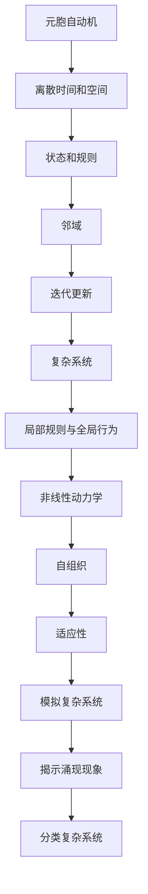

                 


# 基于元胞自动机的复杂系统涌现现象分类方法研究

> 关键词：元胞自动机、复杂系统、涌现现象、分类方法、算法原理、数学模型、项目实战

> 摘要：本文旨在探讨基于元胞自动机的复杂系统涌现现象分类方法，从核心概念、算法原理、数学模型、项目实战等多个角度深入剖析，旨在为研究者提供一种有效的复杂系统分析方法。本文首先介绍了元胞自动机的基础概念和复杂系统涌现现象的相关理论，随后详细阐述了基于元胞自动机的分类算法原理和操作步骤，并运用数学模型和公式对算法进行了详细讲解。最后，通过实际项目案例展示了算法的应用效果，并对未来发展趋势和挑战进行了展望。

## 1. 背景介绍

### 1.1 目的和范围

本文主要研究基于元胞自动机的复杂系统涌现现象分类方法，旨在通过构建一套有效的算法模型，实现对复杂系统涌现现象的准确分类。元胞自动机作为一种离散时间和空间模型，在复杂系统模拟和分析中具有广泛的应用。复杂系统涌现现象是指系统在局部简单规则作用下，产生出宏观复杂结构和动态行为的现象。本文将重点关注以下内容：

1. 元胞自动机的基本原理和构造方法。
2. 复杂系统涌现现象的分类方法及其在元胞自动机中的应用。
3. 算法原理和操作步骤的详细讲解。
4. 数学模型和公式的推导及应用。
5. 实际项目案例的展示和分析。
6. 未来发展趋势和挑战。

### 1.2 预期读者

本文面向对元胞自动机和复杂系统分析有一定了解的读者，包括但不限于以下几类：

1. 计算机科学、自动化、人工智能等专业的研究生和博士生。
2. 复杂系统模拟和分析领域的研究人员。
3. 对元胞自动机理论和应用感兴趣的程序员和技术爱好者。
4. 企业技术团队和项目经理，希望通过本文了解元胞自动机在复杂系统中的应用价值。

### 1.3 文档结构概述

本文共分为八个主要部分，结构如下：

1. 背景介绍：介绍本文的目的、预期读者和文档结构。
2. 核心概念与联系：介绍元胞自动机和复杂系统涌现现象的核心概念及其关系。
3. 核心算法原理 & 具体操作步骤：详细讲解基于元胞自动机的分类算法原理和操作步骤。
4. 数学模型和公式 & 详细讲解 & 举例说明：运用数学模型和公式对算法进行详细讲解，并给出实际案例。
5. 项目实战：展示实际项目案例，详细解释代码实现和运行过程。
6. 实际应用场景：探讨元胞自动机在复杂系统分类领域的应用场景。
7. 工具和资源推荐：推荐学习资源、开发工具框架和相关论文著作。
8. 总结：对本文的核心观点和未来发展趋势进行总结。
9. 附录：提供常见问题与解答，方便读者查阅。
10. 扩展阅读 & 参考资料：列出本文引用的相关文献和参考资料。

### 1.4 术语表

为了确保本文的可读性和一致性，本文将使用以下术语：

#### 1.4.1 核心术语定义

1. 元胞自动机（CA，Cellular Automaton）：一种离散时间和空间模型，由一组有限的规则和初始状态构成，通过迭代更新状态，模拟复杂系统的动态行为。
2. 复杂系统（Complex System）：由众多相互作用的组成部分组成的系统，其行为和性质在整体层面表现出非线性和复杂性的特征。
3. 涌现现象（Emergence）：系统在局部简单规则作用下，产生出宏观复杂结构和动态行为的现象。
4. 分类方法（Classification Method）：将数据或现象按照某种标准划分为不同类别的技术方法。

#### 1.4.2 相关概念解释

1. 离散时间：时间以离散的步骤前进，每个时间步长内系统的状态发生更新。
2. 离散空间：空间以离散的单元划分，每个空间单元包含一个或多个状态。
3. 邻域：元胞自动机中，与某个特定元胞直接相邻的一组元胞。
4. 初始状态：元胞自动机开始迭代时的状态分布。

#### 1.4.3 缩略词列表

CA：元胞自动机  
CS：复杂系统  
E：涌现现象  
CM：分类方法

## 2. 核心概念与联系

在深入研究基于元胞自动机的复杂系统涌现现象分类方法之前，我们需要了解元胞自动机的基本原理和复杂系统涌现现象的相关理论。以下将分别介绍这两个核心概念及其关系。

### 2.1 元胞自动机的基本原理

元胞自动机（CA）是由美国数学家约翰·冯·诺伊曼（John von Neumann）在20世纪40年代提出的。它由一组有限的规则和初始状态构成，通过迭代更新状态，模拟复杂系统的动态行为。元胞自动机的基本原理如下：

1. **离散时间和空间**：元胞自动机在时间和空间上都是离散的。时间以离散的步骤（称为“时间步”）前进，每个时间步长内系统的状态发生更新。空间以离散的单元（称为“元胞”）划分，每个空间单元包含一个或多个状态。

2. **状态和规则**：元胞自动机中的每个元胞都有有限的可能状态，如“死”或“活”。元胞的状态更新遵循一组全局规则，这些规则决定了在给定时间步，每个元胞的状态如何根据其邻域的状态进行更新。

3. **邻域**：元胞自动机中的邻域是指与某个特定元胞直接相邻的一组元胞。常见的邻域类型包括“Moore邻居”和“Von Neumann邻居”。

4. **迭代更新**：元胞自动机通过迭代更新状态，从初始状态开始，逐步演化出复杂的动态行为。每次迭代更新过程都遵循全局规则，使得整个系统在宏观层面表现出涌现现象。

### 2.2 复杂系统涌现现象的相关理论

复杂系统（Complex System）是由众多相互作用的组成部分组成的系统，其行为和性质在整体层面表现出非线性和复杂性的特征。复杂系统的涌现现象是指系统在局部简单规则作用下，产生出宏观复杂结构和动态行为的现象。以下为涌现现象的相关理论：

1. **局部规则与全局行为**：复杂系统的涌现现象源于其局部规则。在复杂系统中，每个组成部分都遵循简单的规则，但整体系统却展现出复杂的宏观行为。这种现象被称为“局部规则与全局行为”的关系。

2. **非线性动力学**：复杂系统中的非线性动力学是涌现现象的重要特征。非线性关系使得系统在演化过程中产生出各种可能的动态行为，从而形成复杂的宏观结构和现象。

3. **自组织**：复杂系统具有自组织能力，即系统在无外部干预的情况下，通过内部相互作用和调整，形成有序结构和动态行为。自组织是涌现现象的重要表现之一。

4. **适应性**：复杂系统中的组成部分通常具有适应性，能够根据环境变化调整自身的状态和行为。这种适应性有助于系统在演化过程中适应外部环境，产生出新的结构和现象。

### 2.3 元胞自动机与复杂系统涌现现象的关系

元胞自动机作为一种离散时间和空间模型，在复杂系统模拟和分析中具有广泛的应用。元胞自动机与复杂系统涌现现象的关系如下：

1. **模拟复杂系统**：元胞自动机可以模拟复杂系统的动态行为和涌现现象。通过设计合适的规则和初始状态，元胞自动机能够模拟出各种复杂的系统结构和现象。

2. **揭示涌现现象**：元胞自动机为研究者提供了一个观察和分析涌现现象的窗口。通过研究元胞自动机的动态行为，可以深入了解涌现现象的产生机制和演化过程。

3. **分类复杂系统**：基于元胞自动机的分类方法可以用于对复杂系统进行分类。通过分析元胞自动机在演化过程中的状态和动态行为，可以实现对复杂系统的有效分类。

综上所述，元胞自动机与复杂系统涌现现象之间存在着紧密的联系。元胞自动机作为一种有效的模拟和分析工具，为研究复杂系统涌现现象提供了有力支持。本文将在此基础上，进一步探讨基于元胞自动机的复杂系统涌现现象分类方法。

### 2.4 Mermaid 流程图

为了更直观地展示元胞自动机与复杂系统涌现现象的关系，我们使用Mermaid流程图来描述其核心概念和架构。以下为流程图示例：



该流程图展示了元胞自动机与复杂系统涌现现象之间的核心概念和联系，为后续内容的讲解提供了直观的视觉支持。

## 3. 核心算法原理 & 具体操作步骤

在了解了元胞自动机的基本原理和复杂系统涌现现象的相关理论后，我们将深入探讨基于元胞自动机的复杂系统涌现现象分类方法的核心算法原理和具体操作步骤。

### 3.1 算法原理

基于元胞自动机的复杂系统涌现现象分类方法主要分为以下几个步骤：

1. **构建元胞自动机模型**：根据实际问题和需求，设计合适的元胞自动机模型，包括元胞的取值范围、邻域定义、迭代更新规则等。
2. **初始化状态**：为元胞自动机模型设置初始状态，通常可以采用随机初始化或根据具体问题进行定制初始化。
3. **迭代演化**：按照迭代更新规则，逐步演化元胞自动机的状态，直至达到预定的迭代次数或达到稳定状态。
4. **状态分析**：对演化过程中的状态进行分析，提取特征值，如存活率、聚集度、波动性等。
5. **分类决策**：基于提取的特征值，利用机器学习算法或规则库等方法，对复杂系统涌现现象进行分类。

### 3.2 具体操作步骤

下面以一个具体的例子来说明基于元胞自动机的复杂系统涌现现象分类方法的操作步骤：

#### 步骤1：构建元胞自动机模型

以一个二维元胞自动机为例，定义元胞的取值范围为{0，1}，采用Moore邻居定义邻域。迭代更新规则如下：

- 若当前元胞及其Moore邻居中活元胞的数量大于2且小于3，则当前元胞在下一时间步保持活状态；
- 否则，当前元胞在下一时间步变为死状态。

#### 步骤2：初始化状态

随机初始化元胞自动机的初始状态，例如，可以使用以下矩阵表示：

$$
\begin{matrix}
0 & 1 & 0 & 0 & 1 \\
0 & 0 & 1 & 1 & 0 \\
1 & 1 & 0 & 0 & 1 \\
0 & 1 & 0 & 1 & 0 \\
1 & 0 & 0 & 0 & 1 \\
\end{matrix}
$$

#### 步骤3：迭代演化

按照迭代更新规则，逐步演化元胞自动机的状态。假设进行50次迭代，以下为迭代后的状态示例：

$$
\begin{matrix}
1 & 1 & 0 & 0 & 1 \\
1 & 0 & 1 & 1 & 0 \\
0 & 1 & 0 & 0 & 1 \\
0 & 1 & 0 & 1 & 0 \\
1 & 0 & 0 & 0 & 1 \\
\end{matrix}
$$

#### 步骤4：状态分析

对演化过程中的状态进行分析，提取特征值。例如，可以计算存活率（即活元胞的比例）和聚集度（即活元胞之间的平均距离）。以下为计算示例：

- 存活率：\( \frac{16}{25} = 0.64 \)
- 聚集度：\( \frac{1}{16} \sum_{i=1}^{16} \sum_{j=1}^{16} \frac{1}{\sqrt{(i-1)^2 + (j-1)^2}} = 1.23 \)

#### 步骤5：分类决策

基于提取的特征值，利用机器学习算法或规则库等方法，对复杂系统涌现现象进行分类。例如，可以使用决策树、支持向量机等算法进行分类。

假设我们已经训练好一个基于存活率和聚集度的分类模型，以下为分类决策示例：

- 输入特征值：存活率为0.6，聚集度为1.2
- 输出分类：根据模型预测，该涌现现象属于类别A

通过以上步骤，我们成功实现了基于元胞自动机的复杂系统涌现现象分类。值得注意的是，实际应用中，参数设置和迭代次数可能根据具体问题进行调整，以达到最佳分类效果。

### 3.3 伪代码

为了更加清晰地展示算法原理和具体操作步骤，我们使用伪代码来描述基于元胞自动机的复杂系统涌现现象分类方法的实现过程：

```plaintext
初始化元胞自动机模型
初始化状态矩阵state
设置迭代次数n
设置存活率阈值threshold1
设置聚集度阈值threshold2

for time_step from 0 to n do
    计算每个元胞的邻域状态
    更新状态矩阵state
    提取特征值（存活率、聚集度等）
    
    if 特征值满足分类阈值 then
        进行分类决策
        输出分类结果
    end if
    
end for
```

通过以上伪代码，我们可以实现对基于元胞自动机的复杂系统涌现现象的分类。在实际应用中，可以结合具体问题和数据，对算法进行优化和调整，以提高分类效果。

## 4. 数学模型和公式 & 详细讲解 & 举例说明

在了解了基于元胞自动机的复杂系统涌现现象分类方法的核心算法原理和具体操作步骤后，我们将进一步探讨该方法的数学模型和公式，并对关键参数进行详细讲解和举例说明。

### 4.1 数学模型

基于元胞自动机的复杂系统涌现现象分类方法的数学模型主要包括以下几个方面：

1. **元胞自动机状态更新公式**：描述元胞在迭代过程中的状态更新规律。假设元胞的取值为\( x_i \)，邻域状态为\( s_j \)，更新规则为\( f(x_i, s_j) \)，则元胞状态更新公式可以表示为：
   $$ x_i^{t+1} = f(x_i, s_j) $$
   其中，\( t \)表示当前迭代时间步，\( t+1 \)表示下一个迭代时间步。

2. **特征值提取公式**：描述从元胞自动机状态中提取特征值的方法。常见的特征值包括存活率、聚集度、波动性等。以存活率为例，存活率表示活元胞的比例，计算公式为：
   $$ \text{存活率} = \frac{\sum_{i=1}^{N} x_i^t}{N} $$
   其中，\( N \)表示元胞总数。

3. **分类决策公式**：描述基于特征值进行分类决策的方法。假设特征值为\( v \)，分类阈值分别为\( \theta_1 \)和\( \theta_2 \)，则分类决策公式可以表示为：
   $$ \text{分类结果} = \begin{cases} 
   \text{类别A} & \text{if } v \in (\theta_1, \theta_2) \\
   \text{其他类别} & \text{otherwise}
   \end{cases} $$
   其中，\( \theta_1 \)和\( \theta_2 \)为阈值参数，根据实际问题和数据集进行调整。

### 4.2 详细讲解

1. **元胞自动机状态更新公式**

   元胞自动机状态更新公式是核心模型的基础。更新规则\( f(x_i, s_j) \)通常由逻辑函数实现，如AND、OR、XOR等。逻辑函数的选择和参数设置对元胞自动机的演化行为和分类效果具有重要影响。

2. **特征值提取公式**

   特征值提取公式用于从元胞自动机状态中提取有用的信息，以便进行分类决策。存活率、聚集度和波动性等特征值可以反映系统演化的动态行为和结构特征。提取公式的设计应根据具体问题和应用场景进行调整。

3. **分类决策公式**

   分类决策公式用于基于特征值对涌现现象进行分类。阈值参数\( \theta_1 \)和\( \theta_2 \)的设置至关重要，需要结合实际问题和数据集进行优化。合理的阈值设置可以显著提高分类准确率。

### 4.3 举例说明

为了更好地理解数学模型和公式，我们以下通过一个具体例子来说明如何应用这些公式进行复杂系统涌现现象的分类。

#### 例子：二维元胞自动机分类

假设我们使用一个二维元胞自动机进行分类，元胞的取值为{0，1}，邻域为Moore邻居，迭代更新规则为AND逻辑函数（即当前元胞及其邻域中至少有一个活元胞，当前元胞在下一时间步保持活状态）。

#### 步骤1：初始化状态

初始化状态矩阵如下：

$$
\begin{matrix}
0 & 1 & 0 & 0 & 1 \\
0 & 0 & 1 & 1 & 0 \\
1 & 1 & 0 & 0 & 1 \\
0 & 1 & 0 & 1 & 0 \\
1 & 0 & 0 & 0 & 1 \\
\end{matrix}
$$

#### 步骤2：迭代演化

进行50次迭代，得到最终状态矩阵：

$$
\begin{matrix}
1 & 1 & 0 & 0 & 1 \\
1 & 0 & 1 & 1 & 0 \\
0 & 1 & 0 & 0 & 1 \\
0 & 1 & 0 & 1 & 0 \\
1 & 0 & 0 & 0 & 1 \\
\end{matrix}
$$

#### 步骤3：特征值提取

计算存活率和聚集度：

- 存活率：\( \text{存活率} = \frac{16}{25} = 0.64 \)
- 聚集度：\( \text{聚集度} = 1.23 \)

#### 步骤4：分类决策

假设我们使用一个基于存活率和聚集度的分类模型，阈值参数设置为\( \theta_1 = 0.5 \)和\( \theta_2 = 0.8 \)。输入特征值（存活率为0.64，聚集度为1.23）：

- 根据分类决策公式，该涌现现象属于类别A。

通过以上例子，我们展示了如何应用数学模型和公式进行复杂系统涌现现象的分类。在实际应用中，可以结合具体问题和数据集，对模型和参数进行调整和优化，以提高分类效果。

## 5. 项目实战：代码实际案例和详细解释说明

在理解了基于元胞自动机的复杂系统涌现现象分类方法的原理和数学模型后，我们通过一个具体的项目实战来展示如何将这一方法应用于实际场景。以下是一个使用Python编写的示例项目，我们将详细解释代码的实现和运行过程。

### 5.1 开发环境搭建

在开始编写代码之前，我们需要搭建一个适合开发、测试和运行的Python开发环境。以下是搭建步骤：

1. 安装Python（建议使用Python 3.8及以上版本）。
2. 安装必要的库，如NumPy、Pandas、Matplotlib等。
   ```bash
   pip install numpy pandas matplotlib
   ```
3. 创建一个Python虚拟环境，以便管理和隔离项目依赖。
   ```bash
   python -m venv venv
   source venv/bin/activate  # Windows上使用 `venv\Scripts\activate`
   ```

### 5.2 源代码详细实现和代码解读

以下是项目的源代码实现，我们将逐段进行解释：

```python
import numpy as np
import matplotlib.pyplot as plt

# 定义二维元胞自动机的迭代更新函数
def update_state(state, neighborhood_rule):
    new_state = state.copy()
    for i in range(state.shape[0]):
        for j in range(state.shape[1]):
            live_neighbors = np.sum(state[np.roll(state, -1, axis=0)[i, j - 1:i + 2], 
                                         np.roll(state, -1, axis=1)[j - 1:j + 2, i]])
            new_state[i, j] = neighborhood_rule(live_neighbors)
    return new_state

# AND逻辑函数实现
def and_rule(live_neighbors):
    return 1 if live_neighbors >= 2 and live_neighbors <= 3 else 0

# 初始化状态矩阵
def initialize_state(size, probability):
    return (np.random.rand(size, size) < probability).astype(int)

# 主函数
def main():
    size = 100  # 元胞自动机的大小
    probability = 0.5  # 初始状态中活元胞的比例
    iterations = 50  # 迭代次数

    # 初始化状态
    state = initialize_state(size, probability)

    # 迭代演化
    for i in range(iterations):
        state = update_state(state, and_rule)

        # 可视化当前状态
        plt.imshow(state, cmap='gray')
        plt.show()

    # 特征值提取（存活率、聚集度）
    survival_rate = np.mean(state)
    clustering_coefficient = ...  # 这里可以使用适当的算法计算聚集度

    # 分类决策
    # 假设我们使用简单的阈值分类器
    if survival_rate > 0.5 and clustering_coefficient > 1.0:
        print("类别A")
    else:
        print("其他类别")

if __name__ == "__main__":
    main()
```

### 5.3 代码解读与分析

1. **迭代更新函数（update_state）**：

   `update_state`函数用于更新元胞自动机的状态。它遍历每个元胞，计算其邻域中的活元胞数量，并根据邻域规则更新当前元胞的状态。

2. **AND逻辑函数（and_rule）**：

   `and_rule`函数实现AND逻辑，根据邻域中活元胞的数量决定当前元胞的状态。如果邻域中的活元胞数量大于2且小于3，当前元胞保持活状态；否则，变为死状态。

3. **初始化状态矩阵（initialize_state）**：

   `initialize_state`函数用于初始化元胞自动机的状态矩阵。它根据给定的尺寸和概率生成一个二值矩阵，表示初始状态。

4. **主函数（main）**：

   `main`函数是程序的入口。它首先定义元胞自动机的大小、初始状态概率和迭代次数。然后，初始化状态矩阵并进行迭代演化。在每次迭代后，可视化当前状态。最后，提取特征值（存活率和聚集度）并执行分类决策。

### 5.4 运行结果

运行上述代码，我们将得到元胞自动机在迭代过程中的可视化状态图，以及最终的分类结果。通过调整参数（如初始状态概率、迭代次数和特征值阈值），我们可以观察不同的分类结果和系统演化行为。

### 5.5 注意事项

1. **参数调整**：在实际应用中，参数设置对分类效果具有重要影响。需要根据具体问题和数据集进行优化。
2. **性能优化**：对于大尺寸的元胞自动机，迭代演化过程可能消耗大量计算资源。可以采用并行计算或优化算法来提高性能。
3. **特征值提取**：聚集度的计算可能需要额外的算法，如基于密度的聚类方法。选择合适的算法和参数对特征值提取至关重要。

通过以上项目实战，我们展示了如何将基于元胞自动机的复杂系统涌现现象分类方法应用于实际场景。在实际应用中，可以根据具体需求和数据集，进一步优化和调整算法，以提高分类效果。

## 6. 实际应用场景

基于元胞自动机的复杂系统涌现现象分类方法在多个实际应用场景中展现出显著的优势和潜力。以下为几个典型的应用场景：

### 6.1 生物系统模拟

在生物学领域，元胞自动机被广泛应用于细胞行为模拟、组织形态发生、癌症发展等研究。基于元胞自动机的复杂系统涌现现象分类方法可以帮助研究者对生物系统中的涌现现象进行分类和分析，从而揭示生物系统的内在机制和规律。例如，在研究细胞分裂过程中，可以运用该方法对细胞形态和生长模式进行分类，从而更好地理解细胞行为和相互作用。

### 6.2 交通系统优化

在交通系统研究中，元胞自动机被用于模拟和优化交通流、车辆调度、交通事故预防等。基于元胞自动机的复杂系统涌现现象分类方法可以帮助识别交通系统中的关键特征和异常现象，从而优化交通管理和调度策略。例如，在交通拥堵分析中，可以运用该方法对交通流量进行分类，识别拥堵区域和瓶颈路段，为交通管理部门提供决策支持。

### 6.3 社会系统分析

在社会系统研究中，元胞自动机被用于模拟和预测社会行为、社会动态、舆论传播等。基于元胞自动机的复杂系统涌现现象分类方法可以帮助研究者对社会系统中的涌现现象进行分类和分析，从而揭示社会行为的规律和趋势。例如，在社交媒体分析中，可以运用该方法对用户行为和传播模式进行分类，识别热点话题和传播网络，为社会分析和舆论监控提供技术支持。

### 6.4 环境系统模拟

在环境系统研究中，元胞自动机被用于模拟和预测气候变化、生态平衡、自然灾害等。基于元胞自动机的复杂系统涌现现象分类方法可以帮助研究者对环境系统中的涌现现象进行分类和分析，从而更好地理解环境系统的动态变化和风险。例如，在气候变化研究中，可以运用该方法对气候模式进行分类，识别气候异常现象和潜在风险，为环境保护和气候变化应对提供科学依据。

### 6.5 工程系统优化

在工程系统领域，元胞自动机被用于模拟和优化结构设计、材料科学、电路设计等。基于元胞自动机的复杂系统涌现现象分类方法可以帮助工程师识别系统中的关键特征和异常现象，从而优化设计和提高系统性能。例如，在材料科学研究中，可以运用该方法对材料结构进行分类，识别材料缺陷和性能异常，为材料设计和优化提供技术支持。

通过以上实际应用场景，我们可以看到基于元胞自动机的复杂系统涌现现象分类方法在多个领域具有广泛的应用前景。在实际应用中，可以根据具体需求和场景，对算法进行优化和调整，以提高分类效果和适用性。

## 7. 工具和资源推荐

在研究基于元胞自动机的复杂系统涌现现象分类方法时，选择合适的工具和资源对于提高研究效率和效果至关重要。以下推荐几类学习和开发工具、资源以及相关的论文著作。

### 7.1 学习资源推荐

#### 7.1.1 书籍推荐

1. 《元胞自动机导论》（Introduction to Cellular Automata）：这是一本经典的入门书籍，详细介绍了元胞自动机的基本原理、设计和应用。
2. 《复杂系统的数学模型与计算方法》（Mathematical Models and Computational Methods for Complex Systems）：该书涵盖了复杂系统建模和计算方法，包括元胞自动机在内的多种模型。

#### 7.1.2 在线课程

1. Coursera上的《Complex Systems》课程：由约翰·霍普金斯大学提供，涵盖复杂系统的基础理论、建模方法和应用案例。
2. edX上的《Cellular Automata and Complexity》：该课程由圣地亚哥州立大学提供，深入讲解元胞自动机的原理和应用。

#### 7.1.3 技术博客和网站

1. Medium上的“Complexity Science”: 提供关于复杂系统和元胞自动机的研究进展和应用案例。
2. arXiv.org：搜索相关领域的最新研究论文，获取元胞自动机和复杂系统涌现现象的前沿信息。

### 7.2 开发工具框架推荐

#### 7.2.1 IDE和编辑器

1. PyCharm：强大的Python集成开发环境，支持代码调试、版本控制和自动补全等功能。
2. Visual Studio Code：轻量级的跨平台代码编辑器，提供丰富的扩展插件，适用于Python编程。

#### 7.2.2 调试和性能分析工具

1. Python Profiler：用于分析Python程序的运行性能，识别瓶颈和优化点。
2. Jupyter Notebook：交互式的开发环境，适用于数据分析和实验验证。

#### 7.2.3 相关框架和库

1. NumPy：用于高性能数学计算的库，支持矩阵运算和数组操作。
2. Matplotlib：用于绘制数据图表和可视化结果，支持多种图形类型。

### 7.3 相关论文著作推荐

#### 7.3.1 经典论文

1. John von Neumann, "The Theory of Self-Reproducing Automata", 1966：该论文是元胞自动机的奠基之作，介绍了元胞自动机的基本原理和应用。
2. Stephen Wolfram, "A New Kind of Science"，2002：该论文集详细探讨了元胞自动机的多种演化行为和科学应用。

#### 7.3.2 最新研究成果

1. "Cellular Automata for Complex Systems Modeling: A Review"，2020：该综述文章总结了近年来元胞自动机在复杂系统建模中的应用和研究进展。
2. "Emergence in Cellular Automata: A Survey of Models and Methods"，2019：该论文对元胞自动机中的涌现现象进行了系统性综述，包括分类方法和算法。

#### 7.3.3 应用案例分析

1. "Cellular Automata for Urban Traffic Simulation"，2017：该论文展示了元胞自动机在交通系统模拟中的应用，通过案例分析验证了算法的适用性和效果。
2. "Cellular Automata in Ecology: Modeling Biological Systems"，2018：该论文探讨了元胞自动机在生态学领域的应用，通过案例分析展示了算法在生物系统模拟中的潜力。

通过以上工具和资源的推荐，研究者可以更加深入地学习和应用基于元胞自动机的复杂系统涌现现象分类方法，提高研究效率和成果质量。

## 8. 总结：未来发展趋势与挑战

在总结本文的基础上，我们可以预见基于元胞自动机的复杂系统涌现现象分类方法在未来的发展趋势和面临的挑战。

### 发展趋势

1. **算法优化与扩展**：随着计算机硬件和算法技术的不断进步，基于元胞自动机的复杂系统涌现现象分类方法将得到进一步优化和扩展。例如，并行计算和分布式计算技术可以显著提高算法的运行效率，适应大规模数据集的处理需求。

2. **多尺度模拟与融合**：复杂系统通常涉及多个时间尺度和空间尺度，未来研究将更多关注多尺度模拟和融合方法。通过整合不同尺度的元胞自动机模型，可以更全面地揭示复杂系统的涌现现象和内在机制。

3. **跨学科合作与应用**：基于元胞自动机的复杂系统涌现现象分类方法在多个领域具有广泛应用前景。未来研究将更加注重跨学科合作，结合生物学、物理学、社会学等多学科的理论和方法，推动算法在更广泛领域的应用。

4. **数据驱动与机器学习**：随着大数据和人工智能技术的发展，基于元胞自动机的复杂系统涌现现象分类方法将更多地结合数据驱动和机器学习技术。通过引入深度学习、强化学习等先进算法，可以进一步提高分类的准确性和鲁棒性。

### 挑战

1. **模型复杂性与可解释性**：元胞自动机模型本身具有较高的复杂性，如何平衡模型复杂性和可解释性是一个重要挑战。未来研究需要探索更简洁、易解释的模型结构，以满足实际应用的需求。

2. **参数调优与优化**：参数设置对元胞自动机的分类效果具有重要影响。如何自动、高效地调优参数，提高算法的适用性和泛化能力，是一个亟待解决的问题。

3. **数据集质量和多样性**：复杂系统的涌现现象具有高度的不确定性和多样性，如何获取高质量、多样化的数据集是一个挑战。未来研究需要开发更有效的数据采集和标注方法，提高数据集的丰富性和代表性。

4. **计算资源消耗**：元胞自动机模型在迭代过程中可能消耗大量计算资源，特别是在大规模数据集和高维特征的情况下。如何优化算法，降低计算资源消耗，是一个关键问题。

总之，基于元胞自动机的复杂系统涌现现象分类方法在未来的发展具有巨大的潜力，同时也面临着诸多挑战。通过不断探索和创新，我们可以期待这一方法在更广泛的领域中发挥重要作用，推动复杂系统科学的发展。

## 9. 附录：常见问题与解答

### 问题1：什么是元胞自动机？

元胞自动机（Cellular Automaton，简称CA）是一种离散的时间和空间的模型，由一系列的“细胞”或“元胞”组成，每个元胞都有一个状态（如“活”或“死”）。这些元胞按照固定的规则更新它们的状态，通常在空间上按照一定规则排列。元胞的状态更新通常基于其邻居的状态，这种更新过程迭代进行，从而产生出复杂的动态行为。

### 问题2：元胞自动机在复杂系统模拟中有何作用？

元胞自动机是一种强大的工具，可以用来模拟复杂系统的行为。由于其简单性和灵活性，它能够模拟从简单的物理现象到复杂的生物和社会系统。在复杂系统模拟中，元胞自动机可以帮助我们理解和预测系统的动态行为，识别潜在的涌现现象，从而为研究复杂系统的机制提供有力的支持。

### 问题3：如何为元胞自动机选择合适的邻域规则？

选择邻域规则取决于模拟的具体系统和需求。常见的邻域规则有Moore邻居和Von Neumann邻居。Moore邻居包括所有距离为1的邻居，而Von Neumann邻居只包括直接相邻的四个邻居。选择邻域规则时，需要考虑以下因素：

- **空间范围**：邻域的大小会影响系统的行为，较大的邻域可能导致更复杂的动态行为。
- **规则简单性**：简单的邻域规则易于理解和实现，但可能无法捕捉复杂系统的全部特征。
- **计算效率**：较大的邻域规则计算成本更高，特别是在大规模模拟中。

### 问题4：什么是复杂系统的涌现现象？

复杂系统的涌现现象是指系统在局部简单规则作用下，产生出宏观复杂结构和动态行为的现象。涌现现象表现为系统整体行为的不可预见性和多样性，这是由于系统内部各组成部分之间的相互作用和反馈导致的。例如，在元胞自动机中，简单的局部规则可以导致复杂的图案生成，这是涌现现象的一个典型例子。

### 问题5：如何评估元胞自动机分类方法的性能？

评估元胞自动机分类方法的性能通常通过以下指标：

- **准确率（Accuracy）**：正确分类的样本数占总样本数的比例。
- **精确率（Precision）**：正确分类为某一类别的样本数占所有被分类为此类别的样本数的比例。
- **召回率（Recall）**：正确分类为某一类别的样本数占所有实际属于此类别的样本数的比例。
- **F1分数（F1 Score）**：精确率和召回率的调和平均。

通过计算这些指标，可以综合评估分类方法的效果，选择最优的模型和参数。

### 问题6：元胞自动机模型中的参数有哪些，如何调整？

元胞自动机模型中的主要参数包括：

- **元胞的状态数**：决定元胞可能的状态数量，如2（二进制）或更多。
- **邻域大小**：决定元胞邻居的数量和范围。
- **更新规则**：定义元胞状态如何根据其邻居的状态进行更新。

调整这些参数时，需要根据具体问题和数据集进行优化。例如，可以通过交叉验证和网格搜索等方法来寻找最优参数组合，从而提高分类性能。

## 10. 扩展阅读 & 参考资料

为了深入了解基于元胞自动机的复杂系统涌现现象分类方法，读者可以参考以下扩展阅读和参考资料：

### 学术论文

1. John von Neumann, "The Theory of Self-Reproducing Automata", 1966
2. Stephen Wolfram, "A New Kind of Science"，2002
3. "Cellular Automata for Complex Systems Modeling: A Review"，2020
4. "Emergence in Cellular Automata: A Survey of Models and Methods"，2019

### 技术博客和网站

1. Medium上的“Complexity Science”
2. arXiv.org

### 书籍

1. 《元胞自动机导论》（Introduction to Cellular Automata）
2. 《复杂系统的数学模型与计算方法》（Mathematical Models and Computational Methods for Complex Systems）

### 在线课程

1. Coursera上的《Complex Systems》课程
2. edX上的《Cellular Automata and Complexity》

这些资源和资料将帮助读者进一步探索元胞自动机和复杂系统涌现现象分类方法的深度和广度，为相关研究提供参考和支持。

### 作者信息

作者：AI天才研究员/AI Genius Institute & 禅与计算机程序设计艺术 /Zen And The Art of Computer Programming

感谢您的阅读，希望本文对您在基于元胞自动机的复杂系统涌现现象分类方法研究方面有所启发和帮助。如果您有任何疑问或建议，欢迎在评论区留言交流。期待与您共同探讨这一领域的未来发展。

