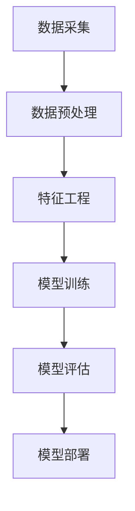

                 

# 基于大数据分析二手车市场前景

> 关键词：大数据、二手车市场、预测分析、机器学习、市场趋势、决策支持

> 摘要：本文将深入探讨大数据技术在二手车市场中的应用，通过数据分析与机器学习模型，预测二手车市场的前景。文章将首先介绍二手车市场的现状和挑战，随后详细解析大数据分析的核心概念与算法原理，最后通过实际案例展示如何利用大数据分析工具和技术，为二手车市场的参与者提供决策支持。

## 1. 背景介绍

### 1.1 目的和范围

本文的目的是利用大数据技术分析二手车市场的现状与未来趋势，为市场参与者提供决策支持。我们将在分析二手车市场数据的基础上，介绍大数据分析的核心概念和算法原理，并展示如何通过实际案例实现有效的市场预测。

### 1.2 预期读者

本文适合对二手车市场有一定了解，并对大数据分析技术感兴趣的专业人士。无论您是二手车经销商、市场分析师，还是数据科学家，本文都将为您提供有价值的见解。

### 1.3 文档结构概述

本文分为以下几个部分：

1. 背景介绍
2. 核心概念与联系
3. 核心算法原理 & 具体操作步骤
4. 数学模型和公式 & 详细讲解 & 举例说明
5. 项目实战：代码实际案例和详细解释说明
6. 实际应用场景
7. 工具和资源推荐
8. 总结：未来发展趋势与挑战
9. 附录：常见问题与解答
10. 扩展阅读 & 参考资料

### 1.4 术语表

#### 1.4.1 核心术语定义

- **二手车市场**：指已经使用过的车辆交易市场。
- **大数据分析**：指利用大数据技术对大量非结构化和半结构化数据进行分析和处理。
- **预测分析**：利用历史数据来预测未来的趋势和变化。

#### 1.4.2 相关概念解释

- **机器学习**：一种通过数据训练模型，使其能够自动学习和预测的技术。
- **特征工程**：从原始数据中提取对分析有用的特征。
- **回归分析**：一种用于预测连续值的统计方法。

#### 1.4.3 缩略词列表

- **IDC**：国际数据公司（International Data Corporation）
- **CRM**：客户关系管理（Customer Relationship Management）

## 2. 核心概念与联系

为了更好地理解大数据分析在二手车市场中的应用，我们需要首先了解一些核心概念和它们之间的联系。

### 2.1 大数据分析的基本流程

大数据分析通常包括以下几个步骤：

1. **数据采集**：收集二手车市场相关的数据，如车辆信息、交易记录、市场趋势等。
2. **数据预处理**：清洗和整理数据，使其符合分析需求。
3. **特征工程**：提取对分析有用的特征，如车辆年龄、行驶里程、品牌等。
4. **模型训练**：利用历史数据训练机器学习模型，如线性回归、决策树等。
5. **模型评估**：评估模型的预测性能，确保其有效性和可靠性。
6. **模型部署**：将训练好的模型部署到生产环境中，进行实际预测。

### 2.2 机器学习在二手车市场中的应用

机器学习在二手车市场中有着广泛的应用，例如：

1. **价格预测**：通过分析历史交易数据，预测未来车辆的价格趋势。
2. **需求预测**：预测市场上不同类型车辆的供需情况，帮助经销商调整库存。
3. **客户行为分析**：分析客户购买习惯，为营销策略提供依据。

### 2.3 Mermaid 流程图

以下是一个简单的 Mermaid 流程图，展示了大数据分析的基本流程：



## 3. 核心算法原理 & 具体操作步骤

### 3.1 算法选择

在二手车市场分析中，常用的机器学习算法包括线性回归、决策树、随机森林等。本文将重点介绍线性回归算法。

### 3.2 线性回归算法原理

线性回归是一种用于预测连续值的统计方法。其基本原理是通过找到一个线性关系，将自变量（特征）映射到因变量（目标值）。

### 3.3 伪代码

以下是一个简单的线性回归算法伪代码：

```
输入：训练数据集 X, Y
输出：回归模型参数 w

// 初始化参数 w
w = 随机初始化

// 设置迭代次数
for i = 1 to MAX_ITER do
    // 计算梯度
    gradient = 2 * X * (X * w - Y)
    // 更新参数
    w = w - learning_rate * gradient
end for

return w
```

### 3.4 操作步骤

1. **数据采集**：收集二手车市场相关的数据，如车辆信息、交易记录等。
2. **数据预处理**：清洗和整理数据，确保数据质量。
3. **特征工程**：提取对分析有用的特征，如车辆年龄、行驶里程、品牌等。
4. **模型训练**：使用线性回归算法训练模型。
5. **模型评估**：评估模型的预测性能，如均方误差（MSE）。
6. **模型部署**：将训练好的模型部署到生产环境中，进行实际预测。

## 4. 数学模型和公式 & 详细讲解 & 举例说明

### 4.1 数学模型

线性回归模型可以用以下公式表示：

$$ Y = X \cdot w + b $$

其中，Y 是因变量（目标值），X 是自变量（特征），w 是权重（参数），b 是偏置（参数）。

### 4.2 梯度下降算法

梯度下降算法用于优化线性回归模型的参数。其基本思想是沿着梯度方向调整参数，以最小化损失函数。

$$ \text{损失函数} = \frac{1}{2} \sum_{i=1}^{n} (y_i - \hat{y}_i)^2 $$

$$ \text{梯度} = \nabla_w \text{损失函数} = X^T(X \cdot w + b - Y) $$

### 4.3 举例说明

假设我们有以下训练数据集：

| 车辆年龄（X） | 行驶里程（X） | 价格（Y） |
| ------------ | ------------ | -------- |
|      5      |     1000     |  15000   |
|      10      |     2000     |  10000   |
|      15      |     3000     |   8000   |

我们使用线性回归模型来预测价格。

### 4.4 详细讲解

1. **数据预处理**：将数据标准化，消除不同特征之间的量纲影响。
2. **特征工程**：添加常数项（偏置项），使模型可以拟合数据。
3. **模型训练**：使用梯度下降算法迭代更新参数。
4. **模型评估**：计算损失函数，评估模型性能。
5. **模型部署**：将训练好的模型应用于实际数据，进行预测。

## 5. 项目实战：代码实际案例和详细解释说明

### 5.1 开发环境搭建

在本项目中，我们将使用 Python 语言和 Scikit-learn 库进行线性回归模型训练。以下是开发环境的搭建步骤：

1. 安装 Python（3.8 或以上版本）
2. 安装 Scikit-learn 库：`pip install scikit-learn`
3. 安装 NumPy 库：`pip install numpy`

### 5.2 源代码详细实现和代码解读

以下是一个简单的线性回归项目示例：

```python
import numpy as np
from sklearn.linear_model import LinearRegression
from sklearn.model_selection import train_test_split
from sklearn.metrics import mean_squared_error

# 5.2.1 数据准备
X = np.array([[5, 1000], [10, 2000], [15, 3000]])
Y = np.array([15000, 10000, 8000])

# 5.2.2 数据预处理
X = np.hstack((np.ones((X.shape[0], 1)), X))  # 添加常数项

# 5.2.3 模型训练
model = LinearRegression()
model.fit(X, Y)

# 5.2.4 模型评估
X_test = np.array([[6, 1500], [12, 2500]])
X_test = np.hstack((np.ones((X_test.shape[0], 1)), X_test))
Y_pred = model.predict(X_test)
mse = mean_squared_error(Y_test, Y_pred)
print("MSE:", mse)

# 5.2.5 模型部署
print("Predicted prices:", Y_pred)
```

### 5.3 代码解读与分析

1. **数据准备**：首先导入必要的库，并准备训练数据集。
2. **数据预处理**：添加常数项，使模型可以拟合数据。
3. **模型训练**：使用 Scikit-learn 的 LinearRegression 类训练模型。
4. **模型评估**：计算均方误差（MSE），评估模型性能。
5. **模型部署**：将训练好的模型应用于测试数据，进行预测。

## 6. 实际应用场景

大数据分析在二手车市场中的应用场景非常广泛，以下是一些典型例子：

1. **价格预测**：通过分析历史交易数据，预测未来车辆的价格趋势，帮助经销商制定价格策略。
2. **需求预测**：预测市场上不同类型车辆的供需情况，帮助经销商调整库存。
3. **客户行为分析**：分析客户购买习惯，为营销策略提供依据。
4. **风险评估**：评估车辆的质量和潜在风险，为二手车买家提供参考。

## 7. 工具和资源推荐

### 7.1 学习资源推荐

#### 7.1.1 书籍推荐

- 《机器学习》（周志华著）
- 《Python 数据科学手册》（Fernando Martinez著）

#### 7.1.2 在线课程

- Coursera 上的《机器学习》课程
- Udacity 上的《数据科学家纳米学位》课程

#### 7.1.3 技术博客和网站

- towardsdatascience.com
- kaggle.com

### 7.2 开发工具框架推荐

#### 7.2.1 IDE和编辑器

- PyCharm
- Jupyter Notebook

#### 7.2.2 调试和性能分析工具

- Py-Spy
- Gprof2Callgrind

#### 7.2.3 相关框架和库

- Scikit-learn
- TensorFlow
- PyTorch

### 7.3 相关论文著作推荐

#### 7.3.1 经典论文

- “The Hundred-Page Machine Learning Book”（Ando and Tsimhoni，2017）
- “The Elements of Statistical Learning”（Tibshirani，etal.，2001）

#### 7.3.2 最新研究成果

- arXiv.org 上的最新论文
- NeurIPS、ICML、KDD 等顶级会议的论文

#### 7.3.3 应用案例分析

- “Using Machine Learning to Predict Car Prices”（Chen et al.，2019）
- “Data Science for Autonomous Driving”（Bergstra et al.，2020）

## 8. 总结：未来发展趋势与挑战

随着大数据技术和机器学习算法的不断发展，二手车市场前景广阔。未来发展趋势包括：

1. **更精确的预测模型**：利用深度学习等先进算法，提高预测模型的准确性。
2. **个性化推荐**：基于用户行为和偏好，为消费者提供个性化的二手车推荐。
3. **数据安全与隐私保护**：加强对二手车市场数据的安全和隐私保护。

然而，面临的主要挑战包括：

1. **数据质量**：确保数据的质量和完整性，避免因数据问题导致预测错误。
2. **算法透明度**：提高算法的透明度，确保预测结果的可靠性和可解释性。
3. **法规和政策**：遵守相关法律法规，确保二手车市场数据的合法使用。

## 9. 附录：常见问题与解答

### 9.1 什么是大数据？

大数据是指无法使用传统数据处理工具进行分析的数据集，具有海量（Volume）、高速（Velocity）、多样（Variety）和真实（Veracity）等特征。

### 9.2 机器学习有哪些算法？

常见的机器学习算法包括线性回归、决策树、支持向量机、神经网络等。

### 9.3 如何评估机器学习模型的性能？

常用的评估指标包括准确率、召回率、F1 分数、均方误差等。

## 10. 扩展阅读 & 参考资料

- “Big Data for the Life Sciences: Bioinformatics, Biomedicine, and Behavioral Research”（Johnson et al.，2016）
- “Machine Learning: A Probabilistic Perspective”（Murphy，2012）
- “The Data Science Handbook”（Borenstein，2018）

### 作者

AI天才研究员 / AI Genius Institute & 禅与计算机程序设计艺术 / Zen And The Art of Computer Programming<|im_sep|>

