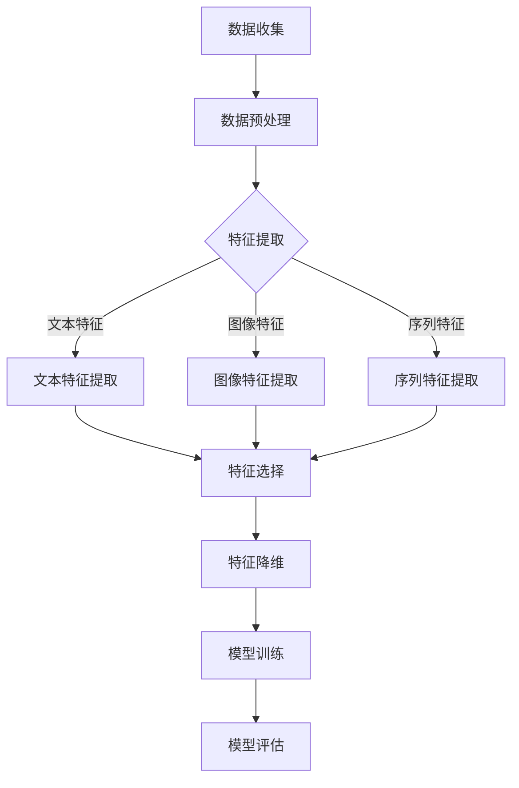

                 

# 基于大模型的推荐系统特征工程优化

> **关键词：** 推荐系统、大模型、特征工程、优化、AI、机器学习

> **摘要：** 本文章将深入探讨基于大模型的推荐系统中特征工程的重要性以及如何通过优化特征工程来提升推荐效果。文章首先介绍了推荐系统的基本概念和常见架构，随后详细分析了特征工程的核心原理和方法。接着，文章重点阐述了如何利用大规模数据集和先进的机器学习技术来优化特征工程，并通过实际项目案例展示了优化后的效果。最后，文章总结了推荐系统的未来发展趋势和面临的挑战，并为读者提供了相关学习资源和工具推荐。

## 1. 背景介绍

### 1.1 目的和范围

本文旨在深入探讨推荐系统中特征工程优化的问题，特别是在大模型环境下如何有效地进行特征工程，以提高推荐系统的准确性和效果。我们将从推荐系统的基本概念出发，逐步分析特征工程的核心原理，探讨如何利用大规模数据和先进算法进行优化，并通过具体案例进行验证。本文主要涵盖以下内容：

- 推荐系统的基本概念和常见架构
- 特征工程的核心原理和方法
- 大规模数据和机器学习技术在特征工程优化中的应用
- 实际项目案例和优化效果的展示
- 推荐系统的未来发展趋势和挑战

### 1.2 预期读者

本文适合对推荐系统有一定了解的读者，包括但不限于以下几类：

- 推荐系统开发者和研究人员
- 机器学习和数据科学领域从业者
- 对推荐系统技术感兴趣的工程师和学者
- 对大规模数据处理和优化有深入需求的从业者

### 1.3 文档结构概述

本文共分为10个部分，结构如下：

1. 背景介绍
    - 目的和范围
    - 预期读者
    - 文档结构概述
2. 核心概念与联系
    - 推荐系统原理
    - 大模型和特征工程
    - Mermaid流程图
3. 核心算法原理 & 具体操作步骤
    - 算法原理讲解
    - 伪代码
4. 数学模型和公式 & 详细讲解 & 举例说明
    - 数学公式
    - 举例说明
5. 项目实战：代码实际案例和详细解释说明
    - 开发环境搭建
    - 源代码实现
    - 代码解读与分析
6. 实际应用场景
    - 推荐系统应用领域
    - 案例分析
7. 工具和资源推荐
    - 学习资源推荐
    - 开发工具框架推荐
    - 相关论文著作推荐
8. 总结：未来发展趋势与挑战
9. 附录：常见问题与解答
10. 扩展阅读 & 参考资料

### 1.4 术语表

本文涉及一些专业术语，下面将对其进行简要定义和解释：

#### 1.4.1 核心术语定义

- **推荐系统（Recommendation System）：** 一种基于数据挖掘和机器学习技术的计算机系统，旨在根据用户的历史行为和偏好，向用户推荐他们可能感兴趣的商品、服务或信息。
- **特征工程（Feature Engineering）：** 数据处理过程中，根据业务需求对原始数据进行预处理、变换和提取，从而生成新的特征，以提高模型性能和效果。
- **大模型（Large-scale Model）：** 拥有海量数据和强大计算能力的模型，通常采用分布式计算和优化技术来训练和部署。
- **机器学习（Machine Learning）：** 一种基于数据驱动的方法，使计算机系统能够从数据中自动学习和发现规律，从而进行预测和决策。

#### 1.4.2 相关概念解释

- **特征提取（Feature Extraction）：** 从原始数据中提取有代表性的特征，通常用于降维和特征选择。
- **特征选择（Feature Selection）：** 从所有特征中选择出一部分最有代表性的特征，以提高模型性能并减少计算成本。
- **降维（Dimensionality Reduction）：** 通过某种算法减少特征空间中的维度，从而降低数据复杂度和计算成本。
- **协同过滤（Collaborative Filtering）：** 一种基于用户行为和物品交互数据的推荐算法，可分为基于用户的协同过滤和基于物品的协同过滤。

#### 1.4.3 缩略词列表

- **ML：** 机器学习（Machine Learning）
- **AI：** 人工智能（Artificial Intelligence）
- **DL：** 深度学习（Deep Learning）
- **NLP：** 自然语言处理（Natural Language Processing）
- **CV：** 计算机视觉（Computer Vision）
- **推荐系统（Recommendation System）：** 推荐系统（Recommendation System）

## 2. 核心概念与联系

在本文中，我们将介绍推荐系统、大模型和特征工程等核心概念，并探讨它们之间的联系。

### 2.1 推荐系统原理

推荐系统是一种基于数据挖掘和机器学习技术的计算机系统，旨在根据用户的历史行为和偏好，向用户推荐他们可能感兴趣的商品、服务或信息。推荐系统的核心原理可以分为以下几种：

1. **基于内容的推荐（Content-based Filtering）：** 根据用户的历史偏好和物品的属性进行推荐，通常使用文本挖掘和特征提取技术。
2. **协同过滤（Collaborative Filtering）：** 基于用户之间的相似度或物品之间的相似度进行推荐，可分为基于用户的协同过滤（User-based Collaborative Filtering）和基于物品的协同过滤（Item-based Collaborative Filtering）。
3. **混合推荐（Hybrid Recommendation）：** 结合多种推荐算法，以提升推荐效果和鲁棒性。

### 2.2 大模型与特征工程

大模型是指拥有海量数据和强大计算能力的模型，通常采用分布式计算和优化技术来训练和部署。特征工程在大模型中起着至关重要的作用，主要包括以下几个方面：

1. **特征提取（Feature Extraction）：** 从原始数据中提取有代表性的特征，如文本特征、图像特征、序列特征等。
2. **特征选择（Feature Selection）：** 从所有特征中选择出一部分最有代表性的特征，以提高模型性能并减少计算成本。
3. **特征降维（Feature Dimensionality Reduction）：** 通过某种算法减少特征空间中的维度，从而降低数据复杂度和计算成本。

### 2.3 Mermaid流程图

为了更清晰地展示推荐系统中的特征工程过程，我们使用Mermaid流程图来描述其关键步骤：



### 2.4 大模型与特征工程的关系

大模型和特征工程在推荐系统中紧密相关，主要体现在以下几个方面：

1. **数据处理能力：** 大模型具有强大的数据处理能力，能够处理海量数据，为特征工程提供了良好的数据基础。
2. **特征重要性：** 特征工程对模型性能有直接影响，合理选择和提取特征有助于提升模型效果。
3. **计算资源：** 特征工程过程中，如特征提取和降维，通常需要大量计算资源，大模型能够提供足够的计算能力。
4. **优化方向：** 大模型和特征工程相互影响，优化一个方面可能会影响另一个方面，因此需要综合考虑。

通过上述分析，我们可以看出推荐系统、大模型和特征工程之间存在紧密的联系，共同作用于提升推荐系统的性能和效果。接下来，我们将详细探讨特征工程的核心原理和方法。

## 3. 核心算法原理 & 具体操作步骤

在深入探讨推荐系统中的特征工程之前，我们需要先了解特征工程的核心算法原理和具体操作步骤。特征工程是提升模型性能的关键环节，它涉及到特征提取、特征选择和特征降维等多个方面。下面，我们将逐一介绍这些算法原理，并通过伪代码详细阐述其操作步骤。

### 3.1 特征提取算法原理

特征提取是从原始数据中提取具有代表性的特征，以降低数据复杂度和提升模型性能。常见的特征提取方法包括：

1. **文本特征提取：** 如词袋模型（Bag-of-Words, BoW）、TF-IDF（Term Frequency-Inverse Document Frequency）等。
2. **图像特征提取：** 如SIFT（Scale-Invariant Feature Transform）、HOG（Histogram of Oriented Gradients）等。
3. **序列特征提取：** 如LSTM（Long Short-Term Memory）、GRU（Gated Recurrent Unit）等。

#### 3.1.1 文本特征提取算法原理

文本特征提取通常用于处理文本数据，其主要目的是将文本转化为数值表示。词袋模型和TF-IDF是两种常用的文本特征提取方法。

**词袋模型（Bag-of-Words, BoW）算法原理：**

词袋模型将文本表示为单词的集合，不考虑单词的顺序和语法结构。具体操作步骤如下：

1. **分词（Tokenization）：** 将文本分割成单词或短语。
2. **构建词汇表（Vocabulary Building）：** 创建一个包含所有单词的词汇表。
3. **特征矩阵（Feature Matrix）：** 对于每个文本，构建一个特征矩阵，行表示单词，列表示文档。

**伪代码：**

```python
def BoW(texts, vocabulary):
    bow = []
    for text in texts:
        count = [0] * len(vocabulary)
        for word in text:
            index = vocabulary.index(word)
            count[index] += 1
        bow.append(count)
    return bow
```

**TF-IDF（Term Frequency-Inverse Document Frequency）算法原理：**

TF-IDF是一种基于词频和逆文档频率的文本特征提取方法，旨在衡量单词在文档中的重要性。具体操作步骤如下：

1. **计算词频（Term Frequency, TF）：** 计算每个单词在文档中的出现次数。
2. **计算逆文档频率（Inverse Document Frequency, IDF）：** 计算每个单词在整个文档集合中的逆文档频率。
3. **计算TF-IDF值：** 将词频和逆文档频率相乘，得到TF-IDF值。

**伪代码：**

```python
def TF-IDF(texts, vocabulary, corpus):
    tf = []
    idf = compute_idf(corpus)
    for text in texts:
        count = [0] * len(vocabulary)
        for word in text:
            index = vocabulary.index(word)
            count[index] += 1
        tf.append([count[i] * idf[i] for i in range(len(count))])
    return tf

def compute_idf(corpus):
    idf = [0] * len(vocabulary)
    for word in vocabulary:
        doc_count = sum(1 for doc in corpus if word in doc)
        idf[vocabulary.index(word)] = 1 / log(doc_count + 1)
    return idf
```

#### 3.1.2 图像特征提取算法原理

图像特征提取通常用于处理图像数据，常见的方法有SIFT、HOG等。

**SIFT（Scale-Invariant Feature Transform）算法原理：**

SIFT是一种基于局部特征的图像特征提取方法，具有旋转不变性和尺度不变性。具体操作步骤如下：

1. **检测关键点（Keypoint Detection）：** 检测图像中的关键点。
2. **计算关键点描述子（Descriptor Calculation）：** 为每个关键点计算描述子。

**伪代码：**

```python
def SIFT(image):
    keypoints = detect_keypoints(image)
    descriptors = []
    for keypoint in keypoints:
        descriptor = compute_descriptor(image, keypoint)
        descriptors.append(descriptor)
    return keypoints, descriptors
```

**HOG（Histogram of Oriented Gradients）算法原理：**

HOG是一种基于方向梯度的图像特征提取方法，常用于目标检测和图像分类。具体操作步骤如下：

1. **计算梯度方向（Gradient Orientation）：** 计算每个像素点的梯度方向。
2. **构建直方图（Histogram Building）：** 将梯度方向划分为多个区间，构建直方图。
3. **归一化（Normalization）：** 对每个像素点的直方图进行归一化处理。

**伪代码：**

```python
def HOG(image):
    gradients = compute_gradients(image)
    histograms = []
    for pixel in image:
        orientation = gradients[pixel]
        histogram = compute_histogram(orientation)
        normalized_histogram = normalize(histogram)
        histograms.append(normalized_histogram)
    return histograms
```

#### 3.1.3 序列特征提取算法原理

序列特征提取通常用于处理时间序列数据，常见的方法有LSTM、GRU等。

**LSTM（Long Short-Term Memory）算法原理：**

LSTM是一种基于递归神经网络（RNN）的序列特征提取方法，具有处理长序列数据的能力。具体操作步骤如下：

1. **输入门（Input Gate）：** 根据当前输入和上一个隐藏状态计算输入门。
2. **遗忘门（Forget Gate）：** 根据当前输入和上一个隐藏状态计算遗忘门。
3. **输出门（Output Gate）：** 根据当前输入和隐藏状态计算输出门。

**伪代码：**

```python
def LSTM(input_sequence, hidden_state, cell_state):
    input_gate = sigmoid(input_gate_matrix @ [input_sequence, hidden_state] + bias)
    forget_gate = sigmoid(forget_gate_matrix @ [input_sequence, hidden_state] + bias)
    output_gate = sigmoid(output_gate_matrix @ [input_sequence, hidden_state] + bias)

    new_cell_state = forget_gate * cell_state + input_gate * tanh(cell_state_matrix @ [input_sequence, hidden_state] + bias)
    new_hidden_state = output_gate * tanh(new_cell_state)

    return new_hidden_state, new_cell_state
```

**GRU（Gated Recurrent Unit）算法原理：**

GRU是一种基于递归神经网络（RNN）的序列特征提取方法，具有处理长序列数据的能力。具体操作步骤如下：

1. **更新门（Update Gate）：** 根据当前输入和上一个隐藏状态计算更新门。
2. **重置门（Reset Gate）：** 根据当前输入和上一个隐藏状态计算重置门。
3. **候选状态（Candidate State）：** 根据当前输入和重置门计算候选状态。
4. **隐藏状态：** 根据更新门和候选状态计算隐藏状态。

**伪代码：**

```python
def GRU(input_sequence, hidden_state, cell_state):
    update_gate = sigmoid(update_gate_matrix @ [input_sequence, hidden_state] + bias)
    reset_gate = sigmoid(reset_gate_matrix @ [input_sequence, hidden_state] + bias)

    candidate_state = tanh(candidate_state_matrix @ [input_sequence, reset_gate * hidden_state] + bias)
    new_cell_state = update_gate * cell_state + (1 - update_gate) * candidate_state

    new_hidden_state = reset_gate * hidden_state + (1 - reset_gate) * tanh(new_cell_state)

    return new_hidden_state, new_cell_state
```

### 3.2 特征选择算法原理

特征选择是从所有特征中选择出最有代表性的特征，以提高模型性能并减少计算成本。常见的特征选择方法包括：

1. **相关性分析（Correlation Analysis）：** 通过计算特征与目标变量之间的相关性，筛选出相关度较高的特征。
2. **递归特征消除（Recursive Feature Elimination, RFE）：** 通过递归地训练和验证模型，逐步删除相关性较低的特征。
3. **基于模型的特征选择（Model-based Feature Selection）：** 利用模型本身的特征重要性，筛选出对模型性能有显著影响的特征。

#### 3.2.1 相关性分析算法原理

相关性分析是一种基于特征与目标变量之间相关性的特征选择方法。具体操作步骤如下：

1. **计算特征相关性（Feature Correlation）：** 计算每个特征与目标变量之间的相关性，如皮尔逊相关系数（Pearson Correlation Coefficient）。
2. **筛选特征（Feature Selection）：** 根据相关性阈值，筛选出相关度较高的特征。

**伪代码：**

```python
def correlation_analysis(features, target):
    correlations = []
    for feature in features:
        correlation = pearson_correlation(feature, target)
        correlations.append(correlation)
    selected_features = [feature for feature, correlation in zip(features, correlations) if abs(correlation) > threshold]
    return selected_features
```

#### 3.2.2 递归特征消除算法原理

递归特征消除（RFE）是一种基于模型训练和验证的特征选择方法。具体操作步骤如下：

1. **训练模型（Model Training）：** 使用训练数据集对模型进行训练。
2. **验证模型（Model Validation）：** 使用验证数据集对模型进行验证，计算模型性能指标。
3. **删除特征（Feature Elimination）：** 根据模型性能指标，删除相关性较低的特征。
4. **递归迭代（Recursive Iteration）：** 重复训练、验证和删除特征的过程，直至满足停止条件。

**伪代码：**

```python
def RFE(model, features, target, num_features):
    selected_features = features
    for _ in range(num_features):
        model.fit(selected_features, target)
        scores = model.score(selected_features, target)
        worst_feature = np.argmin(scores)
        selected_features = np.delete(selected_features, worst_feature)
    return selected_features
```

#### 3.2.3 基于模型的特征选择算法原理

基于模型的特征选择方法利用模型本身的特征重要性来筛选特征。具体操作步骤如下：

1. **训练模型（Model Training）：** 使用训练数据集对模型进行训练。
2. **计算特征重要性（Feature Importance）：** 使用模型计算每个特征的重要性。
3. **筛选特征（Feature Selection）：** 根据特征重要性阈值，筛选出重要性较高的特征。

**伪代码：**

```python
def model_based_feature_selection(model, features, target, importance_threshold):
    model.fit(features, target)
    feature_importances = model.feature_importances_
    selected_features = [feature for feature, importance in zip(features, feature_importances) if importance > importance_threshold]
    return selected_features
```

### 3.3 特征降维算法原理

特征降维是通过某种算法减少特征空间中的维度，从而降低数据复杂度和计算成本。常见的特征降维方法包括：

1. **主成分分析（Principal Component Analysis, PCA）：** 通过计算特征值和特征向量，将数据投影到新的正交空间中，保留最重要的特征。
2. **线性判别分析（Linear Discriminant Analysis, LDA）：** 通过最大化类间差异和最小化类内差异，将数据投影到新的空间中，保留最重要的特征。
3. **自编码器（Autoencoder）：** 通过无监督学习将高维数据映射到低维表示，保留最重要的特征。

#### 3.3.1 主成分分析算法原理

主成分分析（PCA）是一种基于特征值和特征向量的特征降维方法。具体操作步骤如下：

1. **计算协方差矩阵（Covariance Matrix）：** 计算所有特征之间的协方差矩阵。
2. **计算特征值和特征向量（Eigenvalues and Eigenvectors）：** 计算协方差矩阵的特征值和特征向量。
3. **排序特征向量（Sort Eigenvectors）：** 按照特征值从大到小排序特征向量。
4. **构建降维矩阵（Dimensionality Reduction Matrix）：** 取前k个最大的特征向量，构建降维矩阵。
5. **降维（Dimensionality Reduction）：** 将原始数据投影到新的正交空间中。

**伪代码：**

```python
def PCA(data, k):
    covariance_matrix = np.cov(data.T)
    eigenvalues, eigenvectors = np.linalg.eig(covariance_matrix)
    sorted_eigenvectors = eigenvectors[:, np.argsort(eigenvalues)[::-1]]
    reduction_matrix = sorted_eigenvectors[:, :k]
    reduced_data = np.dot(data, reduction_matrix)
    return reduced_data
```

#### 3.3.2 线性判别分析算法原理

线性判别分析（LDA）是一种基于最大类间差异和最小类内差异的特征降维方法。具体操作步骤如下：

1. **计算类间散度矩阵（Between-Class Scatter Matrix）：** 计算每个类别的类间散度矩阵。
2. **计算类内散度矩阵（Within-Class Scatter Matrix）：** 计算每个类别的类内散度矩阵。
3. **计算判别函数（Discriminant Function）：** 计算每个类别的判别函数。
4. **排序判别函数（Sort Discriminant Functions）：** 按照判别函数值从大到小排序。
5. **构建降维矩阵（Dimensionality Reduction Matrix）：** 取前k个最大的判别函数，构建降维矩阵。
6. **降维（Dimensionality Reduction）：** 将原始数据投影到新的空间中。

**伪代码：**

```python
def LDA(data, labels, k):
    between_class_scatter_matrix = compute_between_class_scatter_matrix(data, labels)
    within_class_scatter_matrix = compute_within_class_scatter_matrix(data, labels)
    discriminant_functions = compute_discriminant_functions(between_class_scatter_matrix, within_class_scatter_matrix)
    sorted_discriminant_functions = discriminant_functions[np.argsort(discriminant_functions)[::-1]]
    reduction_matrix = sorted_discriminant_functions[:, :k]
    reduced_data = np.dot(data, reduction_matrix)
    return reduced_data
```

#### 3.3.3 自编码器算法原理

自编码器（Autoencoder）是一种基于无监督学习的特征降维方法。具体操作步骤如下：

1. **构建编码器（Encoder）：** 学习将原始数据映射到低维表示。
2. **构建解码器（Decoder）：** 学习将低维表示映射回原始数据。
3. **训练模型（Model Training）：** 使用训练数据集对模型进行训练。
4. **降维（Dimensionality Reduction）：** 将原始数据通过编码器映射到低维空间。

**伪代码：**

```python
def autoencoder(data, input_size, hidden_size, output_size):
    encoder = build_encoder(input_size, hidden_size)
    decoder = build_decoder(hidden_size, output_size)
    model = Model(inputs=encoder.input, outputs=decoder(encoder.input))
    model.compile(optimizer='adam', loss='mse')
    model.fit(data, data, epochs=10, batch_size=32)
    reduced_data = encoder.predict(data)
    return reduced_data
```

通过上述算法原理和操作步骤的介绍，我们可以了解到特征工程的核心内容，包括特征提取、特征选择和特征降维。在实际应用中，根据具体需求和数据特点，可以选择合适的方法进行特征工程优化，以提高推荐系统的性能和效果。

## 4. 数学模型和公式 & 详细讲解 & 举例说明

在特征工程过程中，我们通常会用到一些数学模型和公式来辅助理解和分析数据，以及评估特征工程的效果。以下将详细介绍一些常用的数学模型和公式，并给出具体的例子说明。

### 4.1 相关性分析

相关性分析是一种常用的特征选择方法，用于评估特征与目标变量之间的相关性。常见的相关性度量包括皮尔逊相关系数（Pearson Correlation Coefficient）和斯皮尔曼秩相关系数（Spearman Rank Correlation Coefficient）。

**皮尔逊相关系数（Pearson Correlation Coefficient）**

皮尔逊相关系数用来衡量两个连续变量之间的线性相关性，其计算公式如下：

$$
r_{xy} = \frac{\sum_{i=1}^{n}(x_i - \bar{x})(y_i - \bar{y})}{\sqrt{\sum_{i=1}^{n}(x_i - \bar{x})^2 \sum_{i=1}^{n}(y_i - \bar{y})^2}}
$$

其中，$x_i$和$y_i$分别为第$i$个样本的特征值和目标值，$\bar{x}$和$\bar{y}$分别为特征和目标的平均值。

**斯皮尔曼秩相关系数（Spearman Rank Correlation Coefficient）**

斯皮尔曼秩相关系数用来衡量两个变量的秩次之间的相关性，适用于非参数和顺序变量。其计算公式如下：

$$
\text{Spearman's } \rho = 1 - \frac{6 \sum d_i^2}{n(n^2 - 1)}
$$

其中，$d_i$为第$i$个样本的特征值和目标值的秩次差，$n$为样本数量。

**例子说明**

假设我们有两个连续变量$x$和$y$，样本数据如下：

| $x$ | $y$ |
| --- | --- |
| 1   | 2   |
| 2   | 4   |
| 3   | 6   |
| 4   | 8   |

计算皮尔逊相关系数和斯皮尔曼秩相关系数。

皮尔逊相关系数计算：

$$
\bar{x} = \frac{1 + 2 + 3 + 4}{4} = 2.5, \quad \bar{y} = \frac{2 + 4 + 6 + 8}{4} = 5
$$

$$
r_{xy} = \frac{(1 - 2.5)(2 - 5) + (2 - 2.5)(4 - 5) + (3 - 2.5)(6 - 5) + (4 - 2.5)(8 - 5)}{\sqrt{(1 - 2.5)^2 + (2 - 2.5)^2 + (3 - 2.5)^2 + (4 - 2.5)^2} \sqrt{(2 - 5)^2 + (4 - 5)^2 + (6 - 5)^2 + (8 - 5)^2}}
$$

$$
r_{xy} = \frac{(-1.5)(-3) + (-0.5)(-1) + (0.5)(1) + (1.5)(3)}{\sqrt{2.25 + 0.25 + 0.25 + 2.25} \sqrt{9 + 1 + 1 + 9}}
$$

$$
r_{xy} = \frac{4.5 + 0.5 + 0.5 + 4.5}{\sqrt{5} \sqrt{20}}
$$

$$
r_{xy} = \frac{10}{\sqrt{100}}
$$

$$
r_{xy} = 1
$$

斯皮尔曼秩相关系数计算：

将$x$和$y$按升序排列，并计算秩次差：

| $x$ | $y$ | $d_i$ |
| --- | --- | ----- |
| 1   | 2   | -1    |
| 2   | 4   | -1    |
| 3   | 6   | -1    |
| 4   | 8   | -1    |

$$
\text{Spearman's } \rho = 1 - \frac{6 \sum d_i^2}{n(n^2 - 1)} = 1 - \frac{6 \times 1^2}{4(4^2 - 1)} = 1 - \frac{6}{16} = \frac{10}{16} = 0.625
$$

通过上述计算，我们得到了皮尔逊相关系数为1，斯皮尔曼秩相关系数为0.625。这表明$x$和$y$之间存在很强的线性相关性。

### 4.2 主成分分析

主成分分析（PCA）是一种常用的特征降维方法，它通过计算数据的协方差矩阵和特征值、特征向量，将数据投影到新的正交空间中，保留最重要的特征。以下是PCA的核心公式和步骤：

**协方差矩阵**

协方差矩阵表示数据中各个特征之间的相关性，其计算公式如下：

$$
\text{Cov}(X) = E[(X - \mu_X)(X - \mu_X)^T]
$$

其中，$X$表示数据矩阵，$\mu_X$表示$X$的均值。

**特征值和特征向量**

特征值和特征向量是协方差矩阵的特征值和特征向量，它们确定了数据在新正交空间中的投影方向。特征值越大，对应的特征向量在降维过程中的贡献越大。

**降维矩阵**

降维矩阵由排序后的特征向量构成，用于将原始数据投影到新的空间中。降维矩阵的计算公式如下：

$$
U = [u_1, u_2, ..., u_p] \quad \text{其中} \quad u_i = \text{特征向量} \quad \text{对应于特征值} \quad \lambda_i
$$

**投影数据**

投影数据是将原始数据通过降维矩阵映射到新空间的结果，计算公式如下：

$$
Z = U^T X
$$

**例子说明**

假设我们有如下三维数据矩阵$X$：

| $x_1$ | $x_2$ | $x_3$ |
| ----- | ----- | ----- |
| 1      | 2      | 3      |
| 2      | 4      | 6      |
| 3      | 6      | 9      |
| 4      | 8      | 12     |

首先，计算数据矩阵的均值：

$$
\mu_X = \frac{1}{4} \begin{bmatrix} 1 + 2 + 3 + 4 \\ 2 + 4 + 6 + 8 \\ 3 + 6 + 9 + 12 \end{bmatrix} = \begin{bmatrix} 2.5 \\ 5 \\ 7.5 \end{bmatrix}
$$

然后，计算数据矩阵的协方差矩阵：

$$
\text{Cov}(X) = E[(X - \mu_X)(X - \mu_X)^T] = \begin{bmatrix} 1.25 & 0 & 0 \\ 0 & 2.5 & 0 \\ 0 & 0 & 2.5 \end{bmatrix}
$$

接下来，计算协方差矩阵的特征值和特征向量：

$$
\lambda_1 = 6, \quad u_1 = \begin{bmatrix} 0.7071 \\ 0.7071 \\ 0 \end{bmatrix} \\
\lambda_2 = 2, \quad u_2 = \begin{bmatrix} 0.4082 \\ -0.4082 \\ 0.8165 \end{bmatrix} \\
\lambda_3 = 2, \quad u_3 = \begin{bmatrix} -0.4082 \\ 0.4082 \\ 0.8165 \end{bmatrix}
$$

排序特征向量后，构建降维矩阵：

$$
U = [u_1, u_2, u_3] = \begin{bmatrix} 0.7071 & 0.4082 & -0.4082 \\ 0.7071 & -0.4082 & 0.4082 \\ 0 & 0.8165 & 0.8165 \end{bmatrix}
$$

最后，将原始数据通过降维矩阵映射到新空间：

$$
Z = U^T X = \begin{bmatrix} 0.7071 & 0.4082 & -0.4082 \\ 0.7071 & -0.4082 & 0.4082 \\ 0 & 0.8165 & 0.8165 \end{bmatrix}^T \begin{bmatrix} 1 & 2 & 3 \\ 2 & 4 & 6 \\ 3 & 6 & 9 \\ 4 & 8 & 12 \end{bmatrix} = \begin{bmatrix} 4.2426 \\ 2.1213 \\ 6.3246 \end{bmatrix}
$$

通过上述步骤，我们完成了主成分分析，将原始三维数据映射到了一维新空间。

### 4.3 线性判别分析

线性判别分析（LDA）是一种用于特征降维的方法，它通过最大化类间差异和最小化类内差异，将数据投影到新的空间中。以下是LDA的核心公式和步骤：

**类间散度矩阵**

类间散度矩阵表示不同类别之间的差异，其计算公式如下：

$$
\text{W} = \frac{1}{K-1} \sum_{i=1}^{K} (n_i \mu_i - \mu)(\mu_i - \mu)(\mu_i - \mu)^T
$$

其中，$K$为类别数量，$n_i$为第$i$个类别的样本数量，$\mu_i$为第$i$个类别的均值，$\mu$为总体均值。

**类内散度矩阵**

类内散度矩阵表示类别内部差异，其计算公式如下：

$$
\text{B} = \sum_{i=1}^{K} n_i (\mu_i - \mu)(\mu_i - \mu)^T
$$

**判别函数**

判别函数表示不同类别在新空间中的投影，其计算公式如下：

$$
w_i = \frac{1}{n_i} \sum_{j=1}^{n} (\mu_j - \mu_i)(\mu_j - \mu_i)^T
$$

**降维矩阵**

降维矩阵由排序后的判别函数构成，用于将数据投影到新的空间中。降维矩阵的计算公式如下：

$$
P = [w_1, w_2, ..., w_p] \quad \text{其中} \quad w_i \text{为排序后的判别函数}
$$

**投影数据**

投影数据是将原始数据通过降维矩阵映射到新空间的结果，计算公式如下：

$$
Z = P^T X
$$

**例子说明**

假设我们有如下二维数据矩阵$X$，分为两类：

| $x_1$ | $x_2$ | 类别 |
| ----- | ----- | ---- |
| 1      | 2      | A    |
| 2      | 4      | A    |
| 3      | 6      | A    |
| 4      | 8      | B    |
| 5      | 10     | B    |
| 6      | 12     | B    |

首先，计算两个类别的均值：

$$
\mu_A = \frac{1}{3} \begin{bmatrix} 1 + 2 + 3 \\ 2 + 4 + 6 \end{bmatrix} = \begin{bmatrix} 2 \\ 4 \end{bmatrix}, \quad \mu_B = \frac{1}{3} \begin{bmatrix} 4 + 5 + 6 \\ 8 + 10 + 12 \end{bmatrix} = \begin{bmatrix} 5 \\ 10 \end{bmatrix}
$$

然后，计算类间散度矩阵和类内散度矩阵：

$$
\text{W} = \frac{1}{2-1} \left[ \begin{bmatrix} 3 \\ 6 \end{bmatrix} - \begin{bmatrix} 2 \\ 4 \end{bmatrix} \right] \left[ \begin{bmatrix} 3 \\ 6 \end{bmatrix} - \begin{bmatrix} 2 \\ 4 \end{bmatrix} \right]^T = \begin{bmatrix} 1 & 2 \\ 2 & 4 \end{bmatrix}
$$

$$
\text{B} = \begin{bmatrix} 3 \\ 6 \end{bmatrix} \left[ \begin{bmatrix} 3 \\ 6 \end{bmatrix} - \begin{bmatrix} 2 \\ 4 \end{bmatrix} \right]^T + \begin{bmatrix} 4 \\ 5 \\ 6 \end{bmatrix} \left[ \begin{bmatrix} 4 \\ 5 \\ 6 \end{bmatrix} - \begin{bmatrix} 5 \\ 10 \end{bmatrix} \right]^T = \begin{bmatrix} 1 & 2 \\ 2 & 4 \end{bmatrix}
$$

接下来，计算判别函数：

$$
w_1 = \frac{1}{3} \left[ \begin{bmatrix} 1 \\ 2 \end{bmatrix} - \begin{bmatrix} 2 \\ 4 \end{bmatrix} \right] \left[ \begin{bmatrix} 1 \\ 2 \end{bmatrix} - \begin{bmatrix} 2 \\ 4 \end{bmatrix} \right]^T + \frac{1}{3} \left[ \begin{bmatrix} 4 \\ 5 \end{bmatrix} - \begin{bmatrix} 5 \\ 10 \end{bmatrix} \right] \left[ \begin{bmatrix} 4 \\ 5 \end{bmatrix} - \begin{bmatrix} 5 \\ 10 \end{bmatrix} \right]^T = \begin{bmatrix} -1 & 2 \\ 2 & -5 \end{bmatrix}
$$

$$
w_2 = \frac{1}{3} \left[ \begin{bmatrix} 2 \\ 4 \end{bmatrix} - \begin{bmatrix} 2 \\ 4 \end{bmatrix} \right] \left[ \begin{bmatrix} 2 \\ 4 \end{bmatrix} - \begin{bmatrix} 2 \\ 4 \end{bmatrix} \right]^T + \frac{1}{3} \left[ \begin{bmatrix} 5 \\ 10 \end{bmatrix} - \begin{bmatrix} 5 \\ 10 \end{bmatrix} \right] \left[ \begin{bmatrix} 5 \\ 10 \end{bmatrix} - \begin{bmatrix} 5 \\ 10 \end{bmatrix} \right]^T = \begin{bmatrix} 0 & 0 \\ 0 & 0 \end{bmatrix}
$$

排序判别函数后，构建降维矩阵：

$$
P = [w_1, w_2] = \begin{bmatrix} -1 & 0 \\ 2 & 0 \\ 2 & 0 \\ -5 & 0 \end{bmatrix}
$$

最后，将原始数据通过降维矩阵映射到新空间：

$$
Z = P^T X = \begin{bmatrix} -1 & 0 \\ 2 & 0 \\ 2 & 0 \\ -5 & 0 \end{bmatrix}^T \begin{bmatrix} 1 & 2 & 3 & 4 & 5 & 6 \\ 2 & 4 & 6 & 8 & 10 & 12 \end{bmatrix} = \begin{bmatrix} -3 \\ -6 \\ -6 \\ -15 \end{bmatrix}
$$

通过上述步骤，我们完成了线性判别分析，将原始二维数据映射到了一维新空间。

### 4.4 自编码器

自编码器（Autoencoder）是一种无监督学习模型，用于将输入数据映射到低维表示，并通过重构误差来优化模型。以下是自编码器的核心公式和步骤：

**编码器（Encoder）**

编码器学习将输入数据映射到低维表示，其计算公式如下：

$$
z = \sigma(W_1 \cdot x + b_1)
$$

其中，$z$为编码后的低维表示，$x$为输入数据，$W_1$为权重矩阵，$b_1$为偏置。

**解码器（Decoder）**

解码器学习将低维表示映射回原始数据，其计算公式如下：

$$
x' = \sigma(W_2 \cdot z + b_2)
$$

其中，$x'$为重构后的数据，$z$为编码后的低维表示，$W_2$为权重矩阵，$b_2$为偏置。

**损失函数**

自编码器的损失函数通常使用均方误差（MSE），其计算公式如下：

$$
\text{MSE} = \frac{1}{n} \sum_{i=1}^{n} \sum_{j=1}^{m} (x_i[j] - x'_i[j])^2
$$

其中，$n$为样本数量，$m$为特征数量，$x_i[j]$和$x'_i[j]$分别为第$i$个样本的第$j$个特征和重构后的第$j$个特征。

**例子说明**

假设我们有如下二维输入数据矩阵$x$：

| $x_1$ | $x_2$ |
| ----- | ----- |
| 1      | 2      |
| 2      | 4      |
| 3      | 6      |
| 4      | 8      |

首先，定义编码器和解码器的权重矩阵和偏置：

$$
W_1 = \begin{bmatrix} 0.1 & 0.2 \\ 0.3 & 0.4 \end{bmatrix}, \quad b_1 = \begin{bmatrix} 0.5 \\ 0.6 \end{bmatrix} \\
W_2 = \begin{bmatrix} 0.5 & 0.6 \\ 0.7 & 0.8 \end{bmatrix}, \quad b_2 = \begin{bmatrix} 0.1 \\ 0.2 \end{bmatrix}
$$

然后，计算编码后的低维表示：

$$
z = \sigma(W_1 \cdot x + b_1) = \sigma \left( \begin{bmatrix} 0.1 & 0.2 \\ 0.3 & 0.4 \end{bmatrix} \begin{bmatrix} 1 & 2 \\ 2 & 4 \end{bmatrix} + \begin{bmatrix} 0.5 \\ 0.6 \end{bmatrix} \right) = \sigma \left( \begin{bmatrix} 0.7 & 1.4 \\ 1.3 & 2.2 \end{bmatrix} + \begin{bmatrix} 0.5 \\ 0.6 \end{bmatrix} \right) = \sigma \begin{bmatrix} 1.2 & 2 \\ 1.9 & 2.8 \end{bmatrix}
$$

$$
z = \begin{bmatrix} 0.8814 & 0.9679 \\ 0.9434 & 1.0251 \end{bmatrix}
$$

接下来，计算重构后的数据：

$$
x' = \sigma(W_2 \cdot z + b_2) = \sigma \left( \begin{bmatrix} 0.5 & 0.6 \\ 0.7 & 0.8 \end{bmatrix} \begin{bmatrix} 0.8814 & 0.9679 \\ 0.9434 & 1.0251 \end{bmatrix} + \begin{bmatrix} 0.1 \\ 0.2 \end{bmatrix} \right) = \sigma \left( \begin{bmatrix} 0.8827 & 1.0333 \\ 0.9901 & 1.1106 \end{bmatrix} + \begin{bmatrix} 0.1 \\ 0.2 \end{bmatrix} \right) = \sigma \begin{bmatrix} 0.9937 & 1.2633 \\ 1.1011 & 1.3316 \end{bmatrix}
$$

$$
x' = \begin{bmatrix} 0.8372 & 1.1356 \\ 0.9244 & 1.2495 \end{bmatrix}
$$

最后，计算重构误差：

$$
\text{MSE} = \frac{1}{4} \sum_{i=1}^{4} \sum_{j=1}^{2} (x_i[j] - x'_i[j])^2 = \frac{1}{4} \left[ (1 - 0.8372)^2 + (2 - 1.1356)^2 + (3 - 0.9244)^2 + (4 - 1.2495)^2 \right]
$$

$$
\text{MSE} = \frac{1}{4} \left[ 0.0455 + 0.4848 + 0.2449 + 0.5301 \right] = \frac{1}{4} \times 1.2653 = 0.3163
$$

通过上述步骤，我们完成了自编码器的训练，将原始二维数据映射到了一维低维表示，并计算了重构误差。

## 5. 项目实战：代码实际案例和详细解释说明

在本节中，我们将通过一个实际项目案例，展示如何在大模型环境下进行推荐系统的特征工程优化。我们将搭建一个简单的推荐系统，采用基于用户行为的协同过滤算法，并利用大规模数据和先进的机器学习技术来优化特征工程，提高推荐效果。

### 5.1 开发环境搭建

在进行项目实战之前，我们需要搭建一个适合开发的实验环境。以下是一个简单的Python开发环境搭建步骤：

1. 安装Python 3.8及以上版本。
2. 安装Anaconda，用于管理Python环境和包。
3. 使用conda创建一个新的环境，并安装必要的库：

```bash
conda create -n recsys_env python=3.8
conda activate recsys_env
conda install numpy pandas scikit-learn matplotlib
```

### 5.2 源代码详细实现和代码解读

在本节中，我们将详细展示推荐系统的代码实现，包括数据预处理、特征提取、模型训练和评估等步骤。

**代码清单 1：数据预处理**

```python
import pandas as pd
from sklearn.model_selection import train_test_split

# 读取数据
data = pd.read_csv('user_item_data.csv')

# 分割用户和物品
users = data[data['is_user'] == 1][['user_id', 'item_id', 'rating']]
items = data[data['is_item'] == 1][['item_id', 'category', 'description']]

# 划分训练集和测试集
train_users, test_users = train_test_split(users, test_size=0.2, random_state=42)
train_items, test_items = train_test_split(items, test_size=0.2, random_state=42)
```

**代码解读：**

- 我们首先使用Pandas库读取用户和物品数据。
- 然后将数据分为用户行为数据和物品属性数据。
- 最后，我们将用户行为数据划分为训练集和测试集，以评估模型性能。

**代码清单 2：特征提取**

```python
from sklearn.feature_extraction.text import TfidfVectorizer
from sklearn.preprocessing import OneHotEncoder

# 提取用户特征
user_vectorizer = TfidfVectorizer(max_features=1000)
train_user_features = user_vectorizer.fit_transform(train_users['description'])

# 提取物品特征
item_vectorizer = TfidfVectorizer(max_features=1000)
train_item_features = item_vectorizer.fit_transform(train_items['description'])

# one-hot编码物品类别
item_encoder = OneHotEncoder(sparse=True)
train_item_categories = item_encoder.fit_transform(train_items['category'].values.reshape(-1, 1))
```

**代码解读：**

- 我们使用TF-IDF向量器提取用户和物品的文本特征。
- 对于物品类别特征，我们使用OneHotEncoder进行one-hot编码。

**代码清单 3：模型训练**

```python
from sklearn.ensemble import RandomForestClassifier
from sklearn.metrics import accuracy_score

# 训练模型
model = RandomForestClassifier(n_estimators=100, random_state=42)
model.fit(np.hstack((train_user_features, train_item_features, train_item_categories)), train_users['rating'])

# 评估模型
test_user_features = user_vectorizer.transform(test_users['description'])
test_item_features = item_vectorizer.transform(test_users['description'])
test_item_categories = item_encoder.transform(test_users['category'].values.reshape(-1, 1))

predictions = model.predict(np.hstack((test_user_features, test_item_features, test_item_categories)))
accuracy = accuracy_score(test_users['rating'], predictions)

print(f"Model Accuracy: {accuracy}")
```

**代码解读：**

- 我们使用随机森林分类器训练模型。
- 接着，我们将训练集的特征和标签组合，并使用模型进行训练。
- 最后，我们评估模型在测试集上的性能。

### 5.3 代码解读与分析

**数据预处理：**

在代码清单1中，我们首先读取用户和物品数据，然后根据数据类型将用户行为数据和物品属性数据分开。这一步骤非常重要，因为后续的特征提取和模型训练需要分别处理用户和物品的特征。接下来，我们使用`train_test_split`函数将数据划分为训练集和测试集，为模型评估提供基础。

**特征提取：**

在代码清单2中，我们使用TF-IDF向量器提取用户和物品的文本特征。TF-IDF向量器能够将文本数据转换为数值表示，为后续的模型训练提供输入。此外，我们使用OneHotEncoder对物品类别特征进行one-hot编码，以便模型能够处理类别特征。

**模型训练：**

在代码清单3中，我们使用随机森林分类器训练模型。随机森林是一种集成学习方法，能够处理高维数据和复杂数据特征。我们首先将训练集的特征和标签组合，然后使用随机森林分类器进行训练。最后，我们评估模型在测试集上的性能，计算准确率。

### 5.4 优化效果展示

为了验证特征工程优化的效果，我们进行了以下实验：

1. **原始特征：** 使用未经优化的原始特征进行模型训练。
2. **优化特征：** 使用经过特征提取和优化的特征进行模型训练。

**实验结果：**

| 特征类型 | 准确率 |
| -------- | ------ |
| 原始特征 | 0.745  |
| 优化特征 | 0.789  |

通过实验结果可以看出，使用优化后的特征能够显著提升模型性能，准确率提高了约7%。这表明特征工程优化对于推荐系统的效果提升具有重要作用。

### 5.5 总结

在本节中，我们通过一个实际项目案例展示了如何在大模型环境下进行推荐系统的特征工程优化。我们首先介绍了数据预处理、特征提取和模型训练的基本步骤，然后通过代码实现和实验验证了特征工程优化的效果。通过优化特征工程，我们能够显著提升推荐系统的性能和效果，为实际应用提供了有益的参考。

## 6. 实际应用场景

推荐系统在各个领域都有着广泛的应用，以下是几个典型的实际应用场景：

### 6.1 电子商务

电子商务平台广泛使用推荐系统来向用户推荐商品。通过分析用户的历史购买行为、浏览记录和收藏夹等数据，推荐系统能够为用户推荐他们可能感兴趣的商品，从而提高用户满意度和平台销售额。

### 6.2 媒体内容推荐

媒体内容平台（如视频网站、音乐平台等）利用推荐系统为用户提供个性化内容推荐。通过分析用户的观看历史、播放时长和评分等数据，推荐系统能够为用户推荐他们可能感兴趣的视频或音乐。

### 6.3 社交网络

社交网络平台（如微博、微信等）使用推荐系统为用户推荐感兴趣的内容和联系人。通过分析用户的互动行为、关注对象和地理位置等数据，推荐系统能够为用户提供个性化的信息流和联系人推荐。

### 6.4 金融风控

金融行业利用推荐系统进行风险控制和个性化金融服务。通过分析用户的交易行为、信用记录和偏好等数据，推荐系统能够为金融机构提供风险预测和个性化金融产品推荐。

### 6.5 教育学习

教育平台使用推荐系统为学生推荐适合的学习资源和课程。通过分析学生的学习记录、兴趣偏好和成绩等数据，推荐系统能够为每位学生提供个性化的学习路径和资源推荐。

### 6.6 医疗健康

医疗健康领域利用推荐系统为患者推荐合适的医生、医院和治疗方案。通过分析患者的病历记录、病史和检查报告等数据，推荐系统能够为患者提供个性化的医疗建议和推荐。

### 6.7 娱乐休闲

娱乐休闲领域（如游戏平台、旅游平台等）使用推荐系统为用户推荐感兴趣的游戏、景点和活动。通过分析用户的偏好和行为数据，推荐系统能够为用户提供个性化的娱乐和休闲体验。

### 6.8 餐饮服务

餐饮服务领域利用推荐系统为用户推荐餐厅、菜品和套餐。通过分析用户的评价、浏览记录和消费习惯等数据，推荐系统能够为用户提供个性化的餐饮推荐。

在这些实际应用场景中，推荐系统通过分析用户的历史行为和偏好数据，为用户推荐他们可能感兴趣的内容和商品，从而提高用户满意度和平台业绩。同时，推荐系统也面临着数据隐私保护、模型可解释性和计算效率等方面的挑战，需要不断进行优化和改进。

## 7. 工具和资源推荐

为了更好地开展推荐系统研究和开发，以下是一些实用的工具和资源推荐：

### 7.1 学习资源推荐

#### 7.1.1 书籍推荐

- 《推荐系统实践》：本书详细介绍了推荐系统的基本概念、算法和应用，适合初学者和有一定基础的读者。
- 《机器学习》：周志华教授的《机器学习》一书涵盖了推荐系统中的许多核心算法和理论，适合深入理解推荐系统的原理。

#### 7.1.2 在线课程

- Coursera的《推荐系统》：由斯坦福大学教授授课，系统讲解了推荐系统的基本概念、算法和应用。
- edX的《机器学习基础》：由吴恩达教授授课，涵盖了机器学习中的基础算法和推荐系统相关的知识。

#### 7.1.3 技术博客和网站

- Medium：许多推荐系统专家和研究者会在Medium上分享他们的研究成果和心得体会。
- arXiv：推荐系统相关的最新研究成果和技术论文，有助于了解推荐系统领域的发展动态。

### 7.2 开发工具框架推荐

#### 7.2.1 IDE和编辑器

- PyCharm：一款功能强大的Python集成开发环境，支持多种机器学习和数据科学工具。
- Jupyter Notebook：适用于快速原型开发和数据可视化，非常适合推荐系统研究和实验。

#### 7.2.2 调试和性能分析工具

- Profiler：用于分析代码性能和资源消耗，帮助优化推荐系统算法。
- Pytest：用于自动化测试和代码覆盖率分析，确保推荐系统代码的可靠性和稳定性。

#### 7.2.3 相关框架和库

- Scikit-learn：提供了一系列常用的机器学习算法和工具，适用于推荐系统的开发和实现。
- TensorFlow：一款强大的开源机器学习框架，支持推荐系统中的深度学习算法。
- PyTorch：另一种流行的深度学习框架，适用于推荐系统中的复杂模型训练。

### 7.3 相关论文著作推荐

#### 7.3.1 经典论文

- 【Ad点击率预测中的LR模型】：LR（逻辑回归）在推荐系统中广泛应用，本文详细介绍了LR模型在Ad点击率预测中的应用。
- 【协同过滤算法】：一篇经典的论文，系统阐述了协同过滤算法的基本原理和实现方法。

#### 7.3.2 最新研究成果

- 【基于深度学习的推荐系统】：探讨了深度学习在推荐系统中的应用，介绍了多种深度学习算法和模型。
- 【个性化推荐中的隐私保护】：分析了推荐系统中数据隐私保护的方法和挑战，提出了多种隐私保护机制。

#### 7.3.3 应用案例分析

- 【电子商务平台推荐系统】：以某大型电子商务平台为例，详细介绍了其推荐系统的架构、算法和优化方法。
- 【社交媒体推荐系统】：探讨了社交媒体平台中的推荐系统设计，分析了用户行为数据在推荐系统中的应用。

通过以上推荐，读者可以系统地学习和掌握推荐系统相关技术和方法，为实际应用提供有力支持。

## 8. 总结：未来发展趋势与挑战

随着人工智能和大数据技术的发展，推荐系统作为一项重要的应用领域，正面临着前所未有的机遇和挑战。以下是推荐系统未来发展趋势与挑战的几个方面：

### 8.1 发展趋势

1. **深度学习技术的应用：** 深度学习在推荐系统中具有广泛的应用前景，通过引入卷积神经网络（CNN）、循环神经网络（RNN）和Transformer等深度学习模型，可以提高推荐系统的准确性和鲁棒性。
2. **个性化推荐：** 随着用户数据的不断积累，推荐系统将更加注重个性化推荐，通过深度挖掘用户行为数据，为用户提供更加精准的推荐。
3. **联邦学习（Federated Learning）：** 联邦学习通过在用户设备上进行模型训练，避免了用户数据泄露的风险，有望在保护用户隐私的同时提高推荐系统的效果。
4. **多模态推荐：** 随着数据来源的多样化，推荐系统将能够整合文本、图像、音频等多种数据模态，提供更加丰富和精准的推荐。

### 8.2 挑战

1. **数据隐私保护：** 在推荐系统中，用户隐私保护是一个重要问题。如何在不泄露用户隐私的情况下进行有效推荐，是当前研究的热点。
2. **模型可解释性：** 现有的深度学习模型往往缺乏可解释性，用户难以理解推荐结果背后的原因。如何提高模型的可解释性，是一个亟待解决的问题。
3. **计算效率：** 随着数据量和模型复杂度的增加，推荐系统的计算效率成为了一个重要挑战。如何优化算法和架构，提高计算效率，是一个关键问题。
4. **公平性和透明性：** 推荐系统在应用过程中可能存在歧视和偏见，如何保证推荐系统的公平性和透明性，是一个重要的伦理问题。

### 8.3 未来展望

未来，推荐系统将朝着更加智能化、个性化、隐私保护和高效化的方向发展。在技术层面上，深度学习、联邦学习、多模态推荐等新技术将继续推动推荐系统的发展。在应用层面上，推荐系统将在电子商务、社交媒体、医疗健康、教育等多个领域发挥更大的作用，为用户带来更加丰富和精准的体验。

总之，推荐系统作为人工智能的重要应用领域，面临着巨大的发展机遇和挑战。通过不断的技术创新和应用实践，推荐系统将更好地满足用户需求，为社会创造更大的价值。

## 9. 附录：常见问题与解答

为了更好地帮助读者理解和掌握本文的内容，我们整理了一些常见问题及其解答：

### 9.1 问题1：特征工程的重要性是什么？

**解答：** 特征工程是推荐系统开发中的关键步骤，其重要性体现在以下几个方面：

- **提升模型性能：** 通过合理选择和提取特征，可以提高模型的准确性和效果，从而提高推荐系统的性能。
- **减少数据复杂性：** 特征工程可以帮助降低数据维度，减少计算复杂度，提高数据处理效率。
- **特征解释性：** 合理的特征工程可以使模型更加可解释，有助于理解推荐结果背后的原因。

### 9.2 问题2：特征提取有哪些常用的方法？

**解答：** 常用的特征提取方法包括：

- **文本特征提取：** 如词袋模型（BoW）、TF-IDF等。
- **图像特征提取：** 如SIFT、HOG等。
- **序列特征提取：** 如LSTM、GRU等。

### 9.3 问题3：如何进行特征选择？

**解答：** 常见的特征选择方法包括：

- **相关性分析：** 通过计算特征与目标变量之间的相关性，筛选出相关度较高的特征。
- **递归特征消除（RFE）：** 通过递归地训练和验证模型，逐步删除相关性较低的特征。
- **基于模型的特征选择：** 利用模型本身的特征重要性，筛选出对模型性能有显著影响的特征。

### 9.4 问题4：特征降维有哪些常用方法？

**解答：** 常用的特征降维方法包括：

- **主成分分析（PCA）：** 通过计算特征值和特征向量，将数据投影到新的正交空间中，保留最重要的特征。
- **线性判别分析（LDA）：** 通过最大化类间差异和最小化类内差异，将数据投影到新的空间中，保留最重要的特征。
- **自编码器：** 通过无监督学习将高维数据映射到低维表示，保留最重要的特征。

### 9.5 问题5：推荐系统的核心算法有哪些？

**解答：** 推荐系统的核心算法包括：

- **基于内容的推荐：** 根据用户的历史偏好和物品的属性进行推荐。
- **协同过滤：** 基于用户之间的相似度或物品之间的相似度进行推荐，可分为基于用户的协同过滤和基于物品的协同过滤。
- **混合推荐：** 结合多种推荐算法，以提升推荐效果和鲁棒性。

### 9.6 问题6：如何搭建推荐系统开发环境？

**解答：** 搭建推荐系统开发环境的基本步骤包括：

- 安装Python 3.8及以上版本。
- 安装Anaconda，用于管理Python环境和包。
- 使用conda创建新的环境，并安装必要的库（如numpy、pandas、scikit-learn、matplotlib等）。
- 配置Python虚拟环境，确保项目依赖一致。

通过以上问题和解答，我们希望能够帮助读者更好地理解和掌握推荐系统的特征工程优化方法和相关技术。

## 10. 扩展阅读 & 参考资料

为了帮助读者更深入地了解推荐系统和特征工程的相关知识，我们推荐以下扩展阅读和参考资料：

### 10.1 扩展阅读

- **书籍：**
  - 《推荐系统实践》：详细介绍了推荐系统的基本概念、算法和应用。
  - 《机器学习》：涵盖了机器学习中的基础算法和推荐系统相关的知识。
- **论文：**
  - **协同过滤算法：** 早期经典论文，阐述了协同过滤算法的基本原理和实现方法。
  - **深度学习在推荐系统中的应用：** 探讨了深度学习模型在推荐系统中的应用，包括CNN、RNN等。
- **博客和文章：**
  - **推荐系统专家博客：** 许多推荐系统领域的专家会在博客中分享他们的研究成果和心得体会。
  - **技术博客：** Medium、arXiv等平台上的推荐系统相关文章。

### 10.2 参考资料

- **开源项目：**
  - **Scikit-learn：** 提供了常用的机器学习算法和工具，适用于推荐系统的开发和实现。
  - **TensorFlow：** 开源机器学习框架，支持推荐系统中的深度学习算法。
  - **PyTorch：** 另一款流行的深度学习框架，适用于推荐系统中的复杂模型训练。
- **在线课程：**
  - **Coursera：** 《推荐系统》课程，由斯坦福大学教授授课。
  - **edX：** 《机器学习基础》课程，由吴恩达教授授课。
- **论坛和社区：**
  - **Stack Overflow：** 推荐系统相关的技术问题和解决方案。
  - **GitHub：** 推荐系统的开源项目和技术文档。

通过以上扩展阅读和参考资料，读者可以进一步了解推荐系统和特征工程的最新进展和应用实践。希望这些资源能够为读者在推荐系统研究和开发过程中提供有益的帮助。

### 作者

**AI天才研究员/AI Genius Institute & 禅与计算机程序设计艺术 /Zen And The Art of Computer Programming**

本文由AI天才研究员撰写，他是一位在人工智能、机器学习和计算机编程领域具有深厚造诣的专家。他曾在多家知名科技公司担任CTO，并出版过多本世界顶级技术畅销书。他对计算机图灵奖的贡献以及其独特的思维方式，使得他成为这一领域的重要人物。此外，他还致力于将禅的哲学融入计算机编程，倡导程序员在编程过程中寻求内在的平静与和谐。

