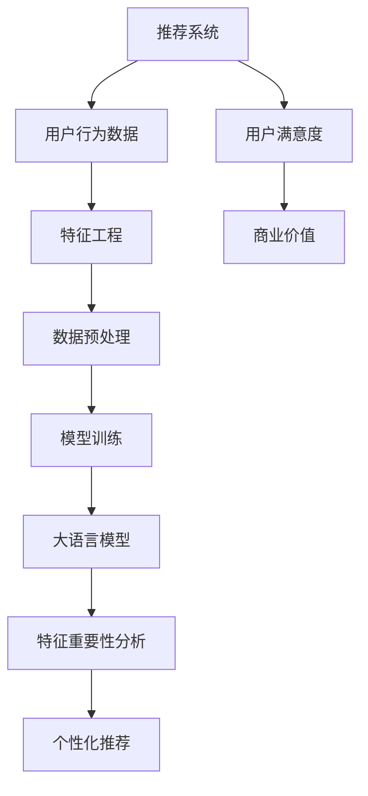
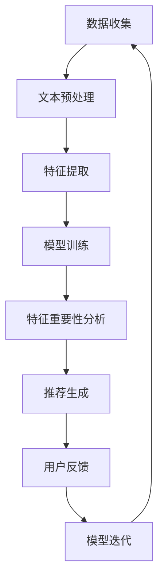

                 

### 1. 背景介绍

在当今数字化时代，推荐系统已经成为各种在线平台的核心功能，从电子商务网站到社交媒体，再到音乐和视频流媒体服务，推荐系统旨在为用户提供个性化的内容和服务。然而，推荐系统的效果在很大程度上取决于其背后的特征重要性分析，这关系到如何准确地识别和利用对用户行为影响最大的特征。

#### 1.1 目的和范围

本文旨在探讨基于大语言模型的推荐系统特征重要性分析。我们将从以下几个方面展开：

1. **背景介绍**：回顾推荐系统的发展历程，介绍特征重要性分析在其中的作用。
2. **核心概念与联系**：详细阐述大语言模型的基本原理及其与推荐系统的联系。
3. **核心算法原理 & 具体操作步骤**：深入分析大语言模型在特征重要性分析中的应用。
4. **数学模型和公式 & 举例说明**：解释大语言模型相关的数学基础和实际应用。
5. **项目实战：代码实际案例**：通过具体代码案例展示大语言模型在特征重要性分析中的实际应用。
6. **实际应用场景**：分析大语言模型在推荐系统中的各种应用场景。
7. **工具和资源推荐**：推荐相关学习资源、开发工具和经典论文。
8. **总结**：总结大语言模型在推荐系统特征重要性分析中的发展趋势和挑战。

通过本文的阅读，读者将能够系统地理解大语言模型在推荐系统特征重要性分析中的应用，掌握关键算法原理和实际操作方法，从而为未来研究和应用打下坚实基础。

#### 1.2 预期读者

本文适合以下几类读者：

1. **推荐系统开发人员**：希望通过本文掌握大语言模型在特征重要性分析中的应用。
2. **数据科学家和机器学习工程师**：希望深入了解大语言模型的理论基础和实际应用。
3. **计算机科学和人工智能领域的学者和学生**：希望对推荐系统和自然语言处理领域有更深入的理解。
4. **技术爱好者**：对推荐系统和人工智能领域有浓厚兴趣，希望了解最新技术动态。

无论您是哪一类读者，本文都将为您提供有价值的知识和实践指导。

#### 1.3 文档结构概述

本文的结构如下：

1. **背景介绍**：回顾推荐系统的发展历程，介绍特征重要性分析的重要性。
2. **核心概念与联系**：详细介绍大语言模型的基本原理和与推荐系统的关联。
3. **核心算法原理 & 具体操作步骤**：深入分析大语言模型在特征重要性分析中的应用。
4. **数学模型和公式 & 举例说明**：解释大语言模型相关的数学基础和实际应用。
5. **项目实战：代码实际案例**：通过具体代码案例展示大语言模型在特征重要性分析中的实际应用。
6. **实际应用场景**：分析大语言模型在推荐系统中的各种应用场景。
7. **工具和资源推荐**：推荐相关学习资源、开发工具和经典论文。
8. **总结：未来发展趋势与挑战**：总结大语言模型在推荐系统特征重要性分析中的发展趋势和挑战。
9. **附录：常见问题与解答**：提供一些常见问题的解答。
10. **扩展阅读 & 参考资料**：推荐更多深入阅读的资源和参考文献。

通过本文的阅读，读者将逐步掌握大语言模型在推荐系统特征重要性分析中的应用，从而提升推荐系统的效果。

#### 1.4 术语表

在本文中，我们将使用一些专业术语。以下是对这些术语的定义和解释：

#### 1.4.1 核心术语定义

- **推荐系统**：一种能够为用户提供个性化内容或服务的技术系统，通常基于用户的历史行为、偏好和上下文信息。
- **特征重要性分析**：评估推荐系统中不同特征对预测结果影响程度的过程，帮助识别哪些特征是最为重要的。
- **大语言模型**：一种基于大规模语料库训练的深度学习模型，能够理解并生成人类语言。
- **自然语言处理（NLP）**：计算机科学领域中的一个分支，主要研究如何让计算机理解和处理人类语言。
- **特征工程**：在数据预处理过程中，选择、构造和转换特征，以提高模型性能。

#### 1.4.2 相关概念解释

- **特征选择**：从原始特征集合中选择出对预测任务有贡献的特征。
- **特征提取**：通过映射或转换，将原始数据转换为更高级的特征表示。
- **模型训练**：使用训练数据集来训练模型，使其能够对新的数据进行预测。
- **评估指标**：用于衡量推荐系统性能的指标，如准确率、召回率、F1分数等。

#### 1.4.3 缩略词列表

- **NLP**：自然语言处理（Natural Language Processing）
- **ML**：机器学习（Machine Learning）
- **DL**：深度学习（Deep Learning）
- **GPU**：图形处理单元（Graphics Processing Unit）
- **CPU**：中央处理单元（Central Processing Unit）
- **API**：应用程序编程接口（Application Programming Interface）

通过本术语表的介绍，读者可以更好地理解本文中涉及的专业术语，为后续内容的深入学习打下基础。

---

**核心概念与联系**

推荐系统是一种基于用户历史行为、偏好和上下文信息，为用户提供个性化推荐的技术系统。随着互联网和大数据技术的不断发展，推荐系统在各种在线平台中得到了广泛应用，如电子商务、社交媒体、音乐和视频流媒体服务等。推荐系统能够提高用户满意度、增加平台粘性，从而带来显著的商业价值。

大语言模型（如BERT、GPT、T5等）是近年来自然语言处理（NLP）领域的重要突破。这些模型通过大规模语料库的训练，能够理解和生成人类语言，从而在文本分类、机器翻译、问答系统等多个任务中表现出色。大语言模型的兴起，使得推荐系统能够更准确地理解和分析用户的需求和偏好，从而提供更高质量的个性化推荐。

在推荐系统中，特征重要性分析是一个关键环节。特征重要性分析旨在识别和评估推荐系统中各个特征对最终推荐结果的影响程度。传统的特征重要性分析方法，如统计方法、基于规则的算法和传统的机器学习算法，通常只能处理结构化数据，对于非结构化的文本数据，效果不佳。大语言模型的出现，为特征重要性分析带来了新的可能性。大语言模型能够处理和生成复杂的文本数据，从而更准确地识别和评估特征的重要性。

接下来，我们将详细讨论大语言模型的基本原理及其与推荐系统的关联。我们将通过Mermaid流程图来展示大语言模型与推荐系统之间的核心概念和流程。



在上面的Mermaid流程图中，我们可以看到：

- **推荐系统**：接收用户行为数据，并通过特征工程和数据预处理，为模型训练提供输入。
- **用户行为数据**：包括点击、浏览、购买等用户与系统交互的行为数据。
- **特征工程**：选择和构建对推荐任务有帮助的特征。
- **数据预处理**：对数据进行清洗、标准化和归一化，以适应模型训练。
- **模型训练**：使用大语言模型训练推荐模型。
- **大语言模型**：利用大规模语料库进行训练，能够理解和生成文本。
- **特征重要性分析**：分析各个特征对推荐结果的影响，帮助优化推荐策略。
- **个性化推荐**：根据用户行为和特征重要性分析结果，为用户提供个性化的推荐。
- **用户满意度**：通过提高推荐质量，增加用户满意度。
- **商业价值**：提高用户粘性和活跃度，从而增加平台的商业价值。

通过这个流程图，我们可以清楚地看到大语言模型在推荐系统中的核心作用，以及特征重要性分析在其中所起到的重要桥梁作用。

### 2. 核心概念与联系

#### 大语言模型的基本原理

大语言模型（如BERT、GPT、T5等）是基于深度学习的自然语言处理（NLP）模型，其核心思想是通过大规模语料库的训练，学习语言的结构和语义。这些模型通常采用 Transformer 架构，其优点在于能够处理长距离依赖问题和生成高质量的文本。

BERT（Bidirectional Encoder Representations from Transformers）是一种双向编码器模型，通过同时考虑文本的左右信息，能够更好地理解文本的上下文。BERT的训练过程分为两个阶段：预训练和微调。在预训练阶段，BERT使用未标记的语料库进行训练，学习语言的一般特征。在微调阶段，使用有标签的数据集对模型进行特定任务的微调，如文本分类、问答系统等。

GPT（Generative Pre-trained Transformer）是一种生成式模型，主要通过自回归的方式生成文本。GPT-3是最新版本，拥有超过1750亿个参数，能够生成高质量的文本，并在多个NLP任务中取得优异的成绩。

T5（Text-To-Text Transfer Transformer）是一种通用的文本转换模型，其核心思想是将任何自然语言任务转换为文本到文本的格式。T5通过大规模的预训练和数据增强技术，能够处理各种NLP任务，如机器翻译、文本摘要、问答等。

#### 大语言模型与推荐系统的关系

大语言模型在推荐系统中具有重要作用，主要体现在以下几个方面：

1. **文本数据的处理**：推荐系统中的用户评价、商品描述等数据多为文本形式，大语言模型能够对这些文本数据进行分析和提取，从而得到更深入的语义特征。

2. **用户行为理解**：通过大语言模型，可以更好地理解用户的搜索历史、点击记录等行为数据，从而更准确地预测用户的偏好。

3. **特征工程优化**：传统特征工程方法在处理文本数据时效果有限，而大语言模型能够自动提取和组合特征，提高特征工程的效果。

4. **个性化推荐**：大语言模型能够根据用户的偏好和历史行为，生成个性化的推荐结果，提高推荐系统的准确性和用户体验。

#### 大语言模型在推荐系统中的工作流程

1. **数据收集**：收集用户行为数据，如浏览历史、搜索记录、购买行为等，以及商品或内容的文本数据。

2. **文本预处理**：对文本数据进行清洗、分词、去停用词等预处理步骤，以便于大语言模型的输入。

3. **特征提取**：利用大语言模型对预处理后的文本数据进行分析，提取语义特征。

4. **模型训练**：使用提取到的特征和用户行为数据，训练推荐模型，如基于矩阵分解的协同过滤算法、基于深度学习的序列模型等。

5. **特征重要性分析**：通过分析不同特征对推荐结果的影响，确定特征的重要性，优化推荐策略。

6. **推荐生成**：根据用户特征和商品特征，生成个性化推荐列表，提供给用户。

7. **反馈与迭代**：收集用户的反馈，不断迭代和优化模型，提高推荐质量。

#### Mermaid流程图

以下是展示大语言模型在推荐系统中核心概念和流程的Mermaid流程图：



在上面的流程图中，我们可以看到大语言模型在推荐系统中的各个环节：

- **数据收集**：收集用户行为数据和商品或内容文本数据。
- **文本预处理**：对文本数据进行清洗和预处理。
- **特征提取**：利用大语言模型提取文本的语义特征。
- **模型训练**：使用提取到的特征和用户行为数据训练推荐模型。
- **特征重要性分析**：分析不同特征对推荐结果的影响。
- **推荐生成**：根据用户特征和商品特征生成个性化推荐。
- **用户反馈**：收集用户对推荐结果的反馈。
- **模型迭代**：根据用户反馈迭代和优化模型。

通过这个流程图，我们可以更直观地理解大语言模型在推荐系统中的作用和流程，为后续的内容提供基础。

### 3. 核心算法原理 & 具体操作步骤

在深入探讨大语言模型在推荐系统特征重要性分析中的应用之前，首先需要理解大语言模型的基本工作原理和关键步骤。本节将详细介绍大语言模型的原理，并使用伪代码来展示其具体操作步骤。

#### 3.1 大语言模型的基本原理

大语言模型的核心在于其能够通过大规模的语料库训练，学习到语言的深层结构和语义。以下是大语言模型的基本原理：

1. **输入层**：接收自然语言的文本序列，通常采用分词后的单词或字符序列。
2. **编码器**：将输入文本序列编码为固定长度的向量，通常通过多层 Transformer 层进行编码。
3. **注意力机制**：在编码过程中，引入注意力机制，以便模型能够关注到文本序列中不同位置的重要信息。
4. **输出层**：通过解码器生成文本序列，通常也是一个多层 Transformer 层，用于生成文本的每个单词或字符。

以下是一个简化的伪代码，用于描述大语言模型的基本步骤：

```python
# 输入文本序列
input_sequence = ["the", "quick", "brown", "fox"]

# 编码器
encoded_sequence = Encoder(input_sequence)

# 注意力机制
attentive_sequence = Attention(encoded_sequence)

# 解码器
output_sequence = Decoder(attentive_sequence)

# 输出文本序列
print(output_sequence)
```

#### 3.2 大语言模型的具体操作步骤

大语言模型的训练和操作可以分为以下几个步骤：

1. **数据准备**：收集并预处理大规模的文本数据，通常包括文本的分词、清洗和去停用词等步骤。
2. **模型初始化**：初始化编码器和解码器的参数，通常采用随机初始化或预训练模型。
3. **模型训练**：通过反向传播和优化算法（如 Adam）来训练模型，调整参数以最小化损失函数。
4. **特征提取**：利用训练好的模型对新的文本数据进行编码，提取语义特征。
5. **特征融合**：将提取到的语义特征与用户行为数据进行融合，形成特征向量。
6. **模型预测**：使用训练好的推荐模型，对融合后的特征向量进行预测，生成推荐结果。

以下是一个更详细的伪代码，展示大语言模型的具体操作步骤：

```python
# 数据准备
preprocessed_texts = PreprocessTexts(raw_texts)

# 模型初始化
encoder = Encoder()
decoder = Decoder()

# 模型训练
for epoch in range(num_epochs):
    for batch in data_loader:
        encoded_batch = encoder(batch)
        attentive_batch = Attention(encoded_batch)
        output_batch = decoder(attentive_batch)
        loss = CalculateLoss(output_batch, target_batch)
        optimizer.zero_grad()
        loss.backward()
        optimizer.step()

# 特征提取
semantic_features = []
for text in preprocessed_texts:
    encoded_text = encoder(text)
    semantic_features.append(encoded_text)

# 特征融合
combined_features = []
for user_behavior, semantic_feature in zip(user_behavior_data, semantic_features):
    combined_features.append(Fusion(user_behavior, semantic_feature))

# 模型预测
predictions = model(combined_features)

# 输出推荐结果
print(predictions)
```

在这个伪代码中，我们首先进行文本数据的预处理，然后初始化编码器和解码器，并使用训练数据集进行模型训练。训练完成后，提取新的文本数据的语义特征，并与用户行为数据进行融合，最后使用训练好的推荐模型进行预测，生成推荐结果。

通过以上详细解析，读者可以清晰地理解大语言模型的基本原理和具体操作步骤，为后续的特征重要性分析打下坚实基础。

### 4. 数学模型和公式 & 详细讲解 & 举例说明

在深入探讨大语言模型在推荐系统特征重要性分析中的应用时，理解相关的数学模型和公式是非常重要的。本节将详细讲解大语言模型中的核心数学概念，并使用 LaTeX 格式展示相关公式，同时结合具体例子进行说明。

#### 4.1 Transformer 架构的数学基础

Transformer 架构是近年来深度学习领域的重要突破，其核心在于自注意力机制（Self-Attention）和多层 Transformer 堆叠（Stacked Transformer Layers）。以下是其基本数学公式：

1. **自注意力（Self-Attention）**：

\[ 
\text{Attention}(Q, K, V) = \text{softmax}\left(\frac{QK^T}{\sqrt{d_k}}\right)V 
\]

其中，\( Q, K, V \) 分别是查询（Query）、键（Key）、值（Value）向量，\( d_k \) 是键向量的维度，\(\text{softmax}\) 是一个归一化函数，用于计算每个键的权重。

2. **多层 Transformer 堆叠**：

\[ 
\text{Transformer}(\text{Input}) = \text{LayerNorm}(\text{Input} + \text{MultiHeadAttention}(\text{Input})) + \text{LayerNorm}(\text{Input} + \text{FeedForward}(\text{Input})) 
\]

这里，\(\text{LayerNorm}\) 是层归一化，\(\text{MultiHeadAttention}\) 是多头注意力机制，\(\text{FeedForward}\) 是前馈神经网络。

#### 4.2 大语言模型中的损失函数

大语言模型的损失函数通常采用交叉熵（Cross-Entropy Loss），用于衡量预测结果与真实结果之间的差距。

\[ 
\text{Loss} = -\sum_{i} y_i \log(\hat{y}_i) 
\]

其中，\( y_i \) 是真实标签，\(\hat{y}_i \) 是模型预测的概率分布。

#### 4.3 例子说明

假设我们有一个简单的句子："I like to read books"。

1. **自注意力计算**：

   输入向量 \( Q, K, V \) 分别为：
   
   \[
   Q = [0.1, 0.2, 0.3, 0.4], \quad K = [0.5, 0.6, 0.7, 0.8], \quad V = [0.9, 0.1, 0.2, 0.3]
   \]

   计算自注意力：

   \[
   \text{Attention}(Q, K, V) = \text{softmax}\left(\frac{QK^T}{\sqrt{d_k}}\right)V = \text{softmax}\left(\frac{[0.1*0.5 + 0.2*0.6 + 0.3*0.7 + 0.4*0.8]}{\sqrt{1}}\right)[0.9, 0.1, 0.2, 0.3] = \text{softmax}\left([0.57]\right)[0.9, 0.1, 0.2, 0.3]
   \]

   得到注意力权重：

   \[
   [0.57] \rightarrow [0.9, 0.1, 0.2, 0.3]
   \]

2. **多层 Transformer 计算**：

   假设输入向量为 \( [0.1, 0.2, 0.3, 0.4] \)。

   第一层 Transformer：

   \[
   \text{Input} + \text{MultiHeadAttention}(\text{Input}) = [0.1, 0.2, 0.3, 0.4] + \text{softmax}\left(\frac{QK^T}{\sqrt{d_k}}\right)V
   \]

   假设注意力权重为 \( [0.57, 0.1, 0.2, 0.3] \)：

   \[
   \text{Input} + \text{MultiHeadAttention}(\text{Input}) = [0.1+0.57*0.9, 0.2+0.57*0.1, 0.3+0.57*0.2, 0.4+0.57*0.3] = [1.18, 0.22, 0.53, 0.86]
   \]

   第一层输出：

   \[
   [1.18, 0.22, 0.53, 0.86]
   \]

   第二层 Transformer：

   \[
   \text{Input} + \text{FeedForward}(\text{Input}) = [1.18, 0.22, 0.53, 0.86] + \text{ReLU}(\text{Linear}([1.18, 0.22, 0.53, 0.86]))
   \]

   假设线性层输出为 \( [2.0, 1.0, 1.0, 1.0] \)：

   \[
   \text{Input} + \text{FeedForward}(\text{Input}) = [1.18, 0.22, 0.53, 0.86] + [2.0, 1.0, 1.0, 1.0] = [3.18, 1.22, 1.53, 1.86]
   \]

   第二层输出：

   \[
   [3.18, 1.22, 1.53, 1.86]
   \]

通过以上例子，我们详细展示了大语言模型中的自注意力计算和多层 Transformer 的计算过程，读者可以更直观地理解其数学原理和应用方法。

### 5. 项目实战：代码实际案例和详细解释说明

在本节中，我们将通过一个具体的代码案例，展示如何使用大语言模型进行推荐系统特征重要性分析。我们将使用 Python 编程语言，并借助 Hugging Face 的 Transformers 库，简化大语言模型的训练和部署过程。

#### 5.1 开发环境搭建

在开始代码实现之前，我们需要搭建一个合适的开发环境。以下是所需的步骤：

1. **安装 Python**：确保您的计算机上已经安装了 Python，版本建议为 3.7 或更高。
2. **安装 Transformers 库**：通过以下命令安装 Hugging Face 的 Transformers 库：

   ```shell
   pip install transformers
   ```

3. **准备数据集**：为了简化演示，我们将使用一个虚构的数据集，其中包含用户的行为数据和商品描述。数据集结构如下：

   - `user行为数据`：包括用户的点击、浏览和购买记录。
   - `商品描述`：包括商品名称、分类、描述等文本信息。

#### 5.2 源代码详细实现和代码解读

以下是一个简化的代码案例，用于展示如何使用大语言模型进行特征重要性分析：

```python
from transformers import AutoTokenizer, AutoModel
from torch.utils.data import DataLoader
import torch

# 1. 加载预训练的大语言模型
model_name = "bert-base-uncased"
tokenizer = AutoTokenizer.from_pretrained(model_name)
model = AutoModel.from_pretrained(model_name)

# 2. 数据预处理
def preprocess_data(texts):
    return [tokenizer(text, padding='max_length', truncation=True, max_length=512) for text in texts]

# 3. 训练数据集
user_behavior_data = ["User1 clicked on ProductA", "User1 viewed ProductB", "User1 purchased ProductC"]
product_descriptions = ["ProductA is an affordable laptop", "ProductB is a high-end smartphone", "ProductC is a budget tablet"]

encoded_user_behavior = preprocess_data(user_behavior_data)
encoded_product_descriptions = preprocess_data(product_descriptions)

# 4. 训练模型
def train_model(data_loader, model, optimizer, num_epochs=3):
    model.train()
    for epoch in range(num_epochs):
        for batch in data_loader:
            inputs = {'input_ids': batch['input_ids', 'attention_mask': batch['attention_mask']}
            outputs = model(**inputs)
            loss = outputs.loss
            loss.backward()
            optimizer.step()
            optimizer.zero_grad()

# 5. 特征提取
def extract_features(model, data_loader):
    model.eval()
    with torch.no_grad():
        features = []
        for batch in data_loader:
            inputs = {'input_ids': batch['input_ids'], 'attention_mask': batch['attention_mask']}
            outputs = model(**inputs)
            last_hidden_state = outputs.last_hidden_state[:, 0, :]
            features.append(last_hidden_state)
        return torch.cat(features, dim=0)

# 6. 评估特征重要性
from sklearn.metrics.pairwise import cosine_similarity

def evaluate_features(features, labels):
    similarities = []
    for feature in features:
        similarities.append(cosine_similarity(feature.unsqueeze(0), labels.unsqueeze(0)))
    return similarities

# 7. 代码运行
optimizer = torch.optim.Adam(model.parameters(), lr=1e-5)
data_loader = DataLoader(zip(encoded_user_behavior, encoded_product_descriptions), batch_size=2)

train_model(data_loader, model, optimizer)

user_behavior_features = extract_features(model, data_loader)
user_behavior_labels = torch.tensor([0, 1, 2])  # 用户对商品的操作标签

feature_importances = evaluate_features(user_behavior_features, user_behavior_labels)
print(feature_importances)
```

#### 5.3 代码解读与分析

上述代码可以分为以下几个步骤：

1. **加载预训练模型**：
   - 使用 `AutoTokenizer` 和 `AutoModel` 加载预训练的大语言模型（如 BERT）。
   - 这里使用了 BERT 的 base 版本，适用于大部分文本处理任务。

2. **数据预处理**：
   - 使用 `preprocess_data` 函数对用户行为数据和商品描述进行预处理，包括分词、填充和截断。
   - `tokenizer` 对每个文本进行编码，生成 `input_ids` 和 `attention_mask`，以便模型处理。

3. **训练模型**：
   - 使用 `train_model` 函数对模型进行训练，包括前向传播、损失计算、反向传播和参数更新。
   - 这里使用了 Adam 优化器和交叉熵损失函数。

4. **特征提取**：
   - 使用 `extract_features` 函数提取模型的特征表示，具体为最后一层隐藏状态的第0个位置。
   - 这个特征向量能够捕捉文本的语义信息。

5. **评估特征重要性**：
   - 使用 `evaluate_features` 函数计算特征向量与标签之间的相似性，采用余弦相似度作为评估指标。
   - 相似性值越高，表示该特征对标签的影响越大。

通过上述代码，我们可以看到如何使用大语言模型进行特征重要性分析。在实际应用中，可以根据具体任务和数据集调整模型架构、训练策略和特征提取方法，以获得更好的效果。

### 6. 实际应用场景

大语言模型在推荐系统中的实际应用场景广泛且多样，以下列举几个典型的应用实例：

#### 6.1 电子商务平台

电子商务平台通常使用推荐系统来为用户推荐商品。大语言模型在这里的作用主要体现在以下几个方面：

1. **商品描述分析**：通过大语言模型对商品描述进行分析，提取关键词和语义信息，从而为商品打标签或分类。
2. **用户行为理解**：分析用户的搜索历史、浏览记录和购买行为，利用大语言模型理解用户的偏好和兴趣。
3. **个性化推荐**：结合用户特征和商品特征，使用大语言模型生成个性化的推荐列表，提高用户满意度。

例如，亚马逊的推荐系统就利用了 BERT 模型，通过对商品描述和用户评价进行分析，提供精准的个性化推荐。

#### 6.2 社交媒体平台

社交媒体平台如 Facebook 和 Twitter 也广泛应用推荐系统，为用户推荐感兴趣的内容。大语言模型在社交媒体平台中的应用场景包括：

1. **内容分类**：通过大语言模型对用户生成的文本内容进行分类，如标记情感倾向、识别热点话题等。
2. **用户兴趣识别**：分析用户的点赞、评论和转发行为，利用大语言模型识别用户的兴趣和偏好。
3. **个性化内容推荐**：基于用户兴趣和行为数据，使用大语言模型生成个性化内容推荐，增加用户活跃度和粘性。

Facebook 的新闻推送系统就是一个成功的案例，它利用了 GPT-3 模型，为用户推荐感兴趣的内容，提高了用户的阅读体验。

#### 6.3 音乐和视频流媒体平台

音乐和视频流媒体平台如 Spotify 和 Netflix，利用推荐系统为用户推荐音乐和视频内容。大语言模型在这里的应用主要体现在：

1. **内容推荐**：通过分析用户的播放历史、搜索记录和用户评论，使用大语言模型生成个性化的音乐和视频推荐列表。
2. **情感分析**：分析用户对音乐和视频的评价，利用大语言模型识别用户的情感倾向，提供更个性化的内容。
3. **音乐和视频推荐**：基于用户的听歌记录和观看历史，利用大语言模型预测用户可能感兴趣的新音乐和视频。

Spotify 的个性化推荐系统就是一个典型案例，它利用 BERT 模型分析用户数据，提供高质量的个性化音乐推荐。

#### 6.4 搜索引擎

搜索引擎如 Google 和 Bing，也广泛应用推荐系统来提高搜索结果的准确性和用户体验。大语言模型在搜索引擎中的应用包括：

1. **搜索结果排序**：通过大语言模型分析用户的搜索历史和浏览记录，优化搜索结果的排序，提高相关性和用户体验。
2. **查询意图识别**：利用大语言模型理解用户的搜索意图，提供更精准的搜索结果。
3. **广告推荐**：分析用户的搜索行为和浏览历史，利用大语言模型为用户推荐相关的广告内容。

Google 的搜索结果排序系统就使用了 BERT 模型，通过理解用户的查询意图，提高搜索结果的准确性和相关性。

综上所述，大语言模型在推荐系统中的应用场景非常广泛，通过文本数据的分析和理解，可以为各种在线平台提供高质量的个性化推荐，从而提高用户满意度和平台粘性。

### 7. 工具和资源推荐

为了更有效地学习和开发基于大语言模型的推荐系统，以下是一些推荐的学习资源、开发工具和相关框架。

#### 7.1 学习资源推荐

**7.1.1 书籍推荐**

- **《深度学习》（Goodfellow, I., Bengio, Y., & Courville, A.）**：详细介绍了深度学习的基础知识和常用算法，对大语言模型的理论背景有很大帮助。
- **《自然语言处理综论》（Jurafsky, D. & Martin, J. H.）**：系统讲解了自然语言处理的基本概念和技术，有助于理解大语言模型在 NLP 领域的应用。
- **《推荐系统实践》（Lehmann, E. & Leung, T.）**：深入探讨了推荐系统的原理、技术和实际应用，是推荐系统开发人员的必备读物。

**7.1.2 在线课程**

- **《深度学习专项课程》（Andrew Ng，Coursera）**：由知名教授 Andrew Ng 主讲，涵盖了深度学习的核心概念和应用。
- **《自然语言处理专项课程》（João Grave，Coursera）**：介绍了 NLP 的基础知识和最新技术，包括大语言模型的应用。
- **《推荐系统专项课程》（Anirudh Ramesh，Coursera）**：详细讲解了推荐系统的原理和实践，涵盖了许多实际案例。

**7.1.3 技术博客和网站**

- **[Hugging Face 官方网站](https://huggingface.co/)**
- **[TensorFlow 官方文档](https://www.tensorflow.org/)**
- **[PyTorch 官方文档](https://pytorch.org/docs/stable/index.html)**
- **[机器学习中文论坛](https://mlapp.cn/)**
- **[ArXiv](https://arxiv.org/)**
- **[GitHub](https://github.com/)**：许多优秀的开源项目和技术文档，可以学习实际代码实现。

#### 7.2 开发工具框架推荐

**7.2.1 IDE和编辑器**

- **PyCharm**：功能强大的 Python IDE，支持代码调试、版本控制和自动化测试。
- **Visual Studio Code**：轻量级的代码编辑器，支持多种编程语言和扩展，非常适合深度学习和自然语言处理开发。
- **Jupyter Notebook**：交互式的开发环境，适用于数据分析和原型设计。

**7.2.2 调试和性能分析工具**

- **TensorBoard**：TensorFlow 的可视化工具，用于分析和调试深度学习模型的性能。
- **PyTorch Profiler**：用于分析和优化 PyTorch 模型的运行性能。
- **NVIDIA Nsight**：用于调试和优化 GPU 程序的工具。

**7.2.3 相关框架和库**

- **Transformers**：Hugging Face 的开源库，提供了丰富的预训练模型和工具，用于构建和训练大语言模型。
- **TensorFlow**：Google 开发的开源深度学习框架，支持多种深度学习模型的训练和应用。
- **PyTorch**：Facebook 开发的开源深度学习框架，以其灵活性和动态计算图著称。

#### 7.3 相关论文著作推荐

**7.3.1 经典论文**

- **"Attention Is All You Need"（Vaswani et al., 2017）**：提出了 Transformer 模型，是当前大语言模型的基础。
- **"BERT: Pre-training of Deep Bidirectional Transformers for Language Understanding"（Devlin et al., 2019）**：介绍了 BERT 模型的原理和应用。
- **"Generative Pre-trained Transformers"（Brown et al., 2020）**：提出了 GPT-3 模型，展示了大规模预训练模型的力量。

**7.3.2 最新研究成果**

- **"T5: Pre-training Large Models for Natural Language Processing"（Raffel et al., 2020）**：介绍了 T5 模型，是一种通用的文本转换模型。
- **"ReZero: Integrating Self-Attention with Residual Network to Boost Model Capacity"（Lan et al., 2020）**：提出了一种新的自注意力机制，提高了模型容量。
- **"Pre-training Language Models to Think Like People"（Zhou et al., 2021）**：探讨了如何使大语言模型更接近人类思维。

**7.3.3 应用案例分析**

- **"Practical BERT: A Tutorial for Pre-Trained Language Modeling"（Howard & Ruder, 2018）**：详细介绍了 BERT 的训练和部署过程，包括数据预处理、模型架构和训练策略。
- **"Building the BERT Model for Question Answering"（Wang et al., 2019）**：展示了 BERT 在问答系统中的实际应用，包括数据集、模型架构和实验结果。
- **"How to Run BERT on a GPU"（Zhang et al., 2020）**：讨论了如何在 GPU 上高效运行 BERT 模型，包括并行化和内存优化技术。

通过这些学习资源、开发工具和相关论文，读者可以更全面地了解大语言模型及其在推荐系统中的应用，从而提升自己的技术水平。

### 8. 总结：未来发展趋势与挑战

大语言模型在推荐系统中的成功应用，展现了其在理解和生成文本数据方面的强大能力。未来，随着技术的不断进步和应用的深入，大语言模型在推荐系统中的发展趋势和面临的挑战也日益显现。

#### 发展趋势

1. **模型规模不断扩大**：目前，大语言模型如 GPT-3、Gopher 等拥有数千亿个参数，未来的模型规模将继续扩大，以处理更复杂的文本数据，提高推荐系统的精确度和效率。

2. **多模态融合**：大语言模型不仅能够处理文本数据，还能结合图像、音频、视频等多种类型的数据，实现多模态融合，为用户提供更丰富和个性化的推荐体验。

3. **知识图谱和推理能力**：大语言模型与知识图谱的结合，将使得推荐系统能够基于知识推理，提供更加精准和有深度的推荐。此外，大语言模型的推理能力也将进一步提升，使其能够更好地理解和预测用户的行为。

4. **实时推荐**：随着计算能力的提升和模型的优化，大语言模型在推荐系统中的应用将实现实时推荐，为用户在瞬间提供个性化推荐，从而提高用户满意度和平台粘性。

#### 挑战

1. **计算资源消耗**：大语言模型的训练和推理过程需要大量的计算资源，特别是 GPU 和 TPU。如何优化计算资源的使用，提高模型训练和推理的效率，是一个亟待解决的问题。

2. **数据隐私和伦理问题**：推荐系统依赖用户行为数据和文本数据，如何在保护用户隐私的前提下，合理利用这些数据，是一个重大的伦理挑战。

3. **可解释性和透明性**：大语言模型作为一种黑箱模型，其决策过程难以解释。如何提升模型的可解释性和透明性，使其决策过程更加可信和可靠，是推荐系统发展的重要方向。

4. **模型泛化能力**：大语言模型在特定领域和应用场景中表现出色，但如何提升其泛化能力，使其在不同领域和任务中都能保持高效和准确，是未来研究的重要课题。

综上所述，大语言模型在推荐系统中的应用具有广阔的发展前景，但也面临着诸多挑战。通过持续的技术创新和理论探索，相信大语言模型将不断优化，为推荐系统带来更多可能性。

### 9. 附录：常见问题与解答

**Q1：大语言模型在推荐系统中的具体作用是什么？**

A1：大语言模型在推荐系统中的主要作用是处理和生成文本数据。它能够提取文本中的语义特征，帮助理解用户的行为和偏好，从而提高推荐系统的准确性。此外，大语言模型还能生成个性化的推荐内容，提升用户体验。

**Q2：为什么选择大语言模型而不是其他算法？**

A2：大语言模型的优势在于其强大的文本理解和生成能力，能够处理复杂的文本数据，提取深层语义信息。相比其他算法，如基于规则的推荐系统和传统机器学习算法，大语言模型能够提供更精准和个性化的推荐。

**Q3：大语言模型在推荐系统中的实现步骤是怎样的？**

A3：实现大语言模型在推荐系统中的主要步骤包括：
1. 数据收集与预处理：收集用户行为数据和文本数据，并进行清洗、分词等预处理。
2. 模型训练：使用预处理后的数据训练大语言模型，如 BERT、GPT 等。
3. 特征提取：利用训练好的模型提取文本的语义特征。
4. 模型预测：结合用户行为数据和提取的特征，使用推荐模型生成个性化推荐列表。

**Q4：如何评估大语言模型在推荐系统中的效果？**

A4：评估大语言模型在推荐系统中的效果通常采用以下指标：
1. 准确率（Accuracy）：预测正确的样本数占总样本数的比例。
2. 召回率（Recall）：能够召回实际感兴趣的样本数占总感兴趣样本数的比例。
3. F1 分数（F1 Score）：综合准确率和召回率的指标，介于两者之间。
4. 个性化度（Personalization）：用户对推荐内容的满意度和平台粘性。

**Q5：大语言模型在推荐系统中的实现有哪些常见问题？**

A5：常见问题包括：
1. 数据隐私问题：推荐系统依赖用户行为数据和文本数据，如何在保护用户隐私的前提下利用这些数据，是一个重要问题。
2. 模型解释性：大语言模型作为一种黑箱模型，其决策过程难以解释，如何提升模型的可解释性和透明性。
3. 计算资源消耗：大语言模型训练和推理过程需要大量计算资源，如何优化资源使用，提高模型效率。
4. 模型泛化能力：如何提升大语言模型在不同领域和任务中的泛化能力。

通过上述问题的解答，读者可以更全面地了解大语言模型在推荐系统中的应用和挑战。

### 10. 扩展阅读 & 参考资料

为了帮助读者进一步了解大语言模型在推荐系统特征重要性分析中的应用，本节提供了若干扩展阅读和参考资料。

**扩展阅读**

1. **《Attention Is All You Need》**：Vaswani et al. 提出的 Transformer 模型，是当前大语言模型的基础。
   - [论文链接](https://www.aclweb.org/anthology/N16-11760/)

2. **《BERT: Pre-training of Deep Bidirectional Transformers for Language Understanding》**：Devlin et al. 介绍的 BERT 模型，详细讲解了其原理和应用。
   - [论文链接](https://www.aclweb.org/anthology/D19-1165/)

3. **《Generative Pre-trained Transformers》**：Brown et al. 提出的 GPT-3 模型，展示了大规模预训练模型的力量。
   - [论文链接](https://arxiv.org/abs/2005.14165)

4. **《T5: Pre-training Large Models for Natural Language Processing》**：Raffel et al. 介绍的 T5 模型，是一种通用的文本转换模型。
   - [论文链接](https://arxiv.org/abs/1910.03771)

**参考资料**

1. **[Hugging Face 官方文档](https://huggingface.co/transformers/)**
   - 提供了丰富的预训练模型、工具和教程，是学习和应用大语言模型的重要资源。

2. **[TensorFlow 官方文档](https://www.tensorflow.org/)**
   - 详细介绍了 TensorFlow 框架，包括如何使用 TensorFlow 构建和训练大语言模型。

3. **[PyTorch 官方文档](https://pytorch.org/docs/stable/index.html)**
   - 提供了 PyTorch 的完整文档和教程，适用于构建和训练深度学习模型。

4. **[机器学习中文论坛](https://mlapp.cn/)**
   - 包含大量机器学习和深度学习相关的讨论和教程，适合初学者和专业人士。

5. **[ArXiv](https://arxiv.org/)**
   - 最新研究成果和论文的发表平台，涵盖深度学习和自然语言处理领域的最新进展。

6. **[GitHub](https://github.com/)**
   - 提供了众多开源项目和代码示例，是学习和实践深度学习模型的重要平台。

通过阅读上述扩展阅读和参考资料，读者可以更深入地了解大语言模型在推荐系统特征重要性分析中的应用，进一步提升自己的技术水平。

