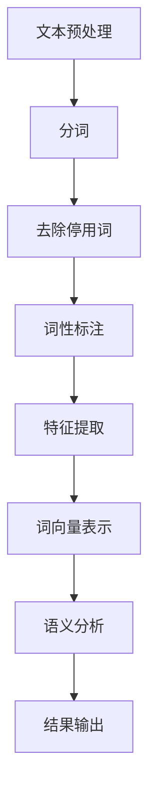

                 

# 基于机器学习的文本语义分析工具

> **关键词：** 机器学习、文本分析、自然语言处理、语义理解、算法原理、数学模型、实战案例
>
> **摘要：** 本文将深入探讨基于机器学习的文本语义分析工具，从背景介绍、核心概念与联系、核心算法原理、数学模型和公式，到实际应用场景、工具和资源推荐等方面，为读者提供全面的技术解析和实战指导。

## 1. 背景介绍

### 1.1 目的和范围

随着互联网的飞速发展，文本数据量呈现爆炸式增长，如何有效地处理和分析这些文本数据成为了当前研究的热点。文本语义分析作为自然语言处理（NLP）中的重要分支，旨在理解和挖掘文本中的深层语义信息。本文旨在介绍一种基于机器学习的文本语义分析工具，通过解析文本数据的语义信息，为用户提供更加智能化和个性化的服务。

本文将覆盖以下内容：

1. **背景介绍**：介绍文本语义分析的重要性和当前的研究现状。
2. **核心概念与联系**：阐述文本语义分析中的关键概念和它们之间的联系。
3. **核心算法原理与具体操作步骤**：详细讲解文本语义分析的主要算法原理和实现步骤。
4. **数学模型和公式**：介绍文本语义分析中的常用数学模型和公式，并加以解释和说明。
5. **项目实战**：通过实际案例展示文本语义分析工具的具体应用。
6. **实际应用场景**：分析文本语义分析工具在各个领域的应用。
7. **工具和资源推荐**：推荐相关的学习资源、开发工具和框架。
8. **总结**：探讨文本语义分析工具的未来发展趋势和面临的挑战。

### 1.2 预期读者

本文适合对自然语言处理和机器学习有一定了解的读者，包括：

1. 自然语言处理（NLP）研究者。
2. 机器学习工程师。
3. 数据分析师。
4. 对文本语义分析感兴趣的计算机科学学生。
5. 对人工智能技术感兴趣的普通读者。

### 1.3 文档结构概述

本文的结构如下：

1. **背景介绍**：介绍文本语义分析的重要性和研究背景。
2. **核心概念与联系**：定义文本语义分析中的核心概念，并展示它们之间的联系。
3. **核心算法原理与具体操作步骤**：介绍文本语义分析的主要算法原理和实现步骤。
4. **数学模型和公式**：介绍文本语义分析中的常用数学模型和公式。
5. **项目实战**：通过实际案例展示文本语义分析工具的应用。
6. **实际应用场景**：分析文本语义分析工具在不同领域的应用。
7. **工具和资源推荐**：推荐相关的学习资源和开发工具。
8. **总结**：总结文本语义分析工具的现状和未来发展方向。
9. **附录**：常见问题与解答。
10. **扩展阅读与参考资料**：提供进一步学习的资源链接。

### 1.4 术语表

#### 1.4.1 核心术语定义

- **文本语义分析**：对文本数据中的语义信息进行解析和理解的过程。
- **机器学习**：一种通过数据训练模型进行预测和决策的技术。
- **自然语言处理（NLP）**：研究如何让计算机理解和处理人类自然语言的技术。
- **深度学习**：一种基于多层神经网络进行特征提取和预测的学习方法。

#### 1.4.2 相关概念解释

- **词向量**：将词语映射为高维向量，以便在向量空间中进行语义分析。
- **语义相似度**：衡量两个文本或词语在语义上的相似程度。
- **实体识别**：识别文本中的特定实体，如人名、地名、组织名等。

#### 1.4.3 缩略词列表

- **NLP**：自然语言处理（Natural Language Processing）
- **ML**：机器学习（Machine Learning）
- **DL**：深度学习（Deep Learning）
- **TF-IDF**：词频-逆文档频率（Term Frequency-Inverse Document Frequency）
- **BERT**：双向编码表示器（Bidirectional Encoder Representations from Transformers）

## 2. 核心概念与联系

在探讨文本语义分析之前，我们需要了解一些核心概念，它们是构建文本语义分析工具的基础。

### 2.1 机器学习与自然语言处理

机器学习和自然语言处理（NLP）是文本语义分析的重要技术支撑。机器学习通过从数据中学习规律，帮助计算机自动识别和预测文本中的特征。而NLP则专注于处理和理解人类自然语言，为机器学习提供特定的任务和数据集。


### 2.2 词向量与语义表示

词向量是将词语映射为高维向量的一种表示方法，它使得词语的语义信息可以在向量空间中进行计算和分析。常见的词向量模型有Word2Vec、GloVe等。


词向量模型能够捕捉词语的语义相似性，例如“国王”和“女王”在向量空间中距离较近。

### 2.3 语义相似度

语义相似度衡量两个文本或词语在语义上的相似程度。通过计算词向量之间的距离或相似度度量，可以评估文本内容的关联性。


### 2.4 实体识别

实体识别是从文本中识别出特定实体，如人名、地名、组织名等。实体识别是文本语义分析中的重要任务，它有助于构建知识图谱和语义搜索系统。


### 2.5 语义分析流程

文本语义分析的流程通常包括以下几个步骤：

1. **预处理**：包括分词、去除停用词、词性标注等。
2. **特征提取**：将文本转化为词向量或词袋模型。
3. **语义分析**：使用机器学习算法进行语义相似度计算、情感分析、命名实体识别等。
4. **结果输出**：输出语义分析的结果，如关键词提取、主题建模等。


### 2.6 Mermaid流程图

为了更直观地展示文本语义分析的核心概念和流程，我们可以使用Mermaid流程图来表示。



## 3. 核心算法原理与具体操作步骤

### 3.1 词向量模型

词向量模型是文本语义分析的基础，它将词语映射为高维向量，使得词语的语义信息可以在向量空间中进行计算和分析。以下是常见的词向量模型及其实现步骤：

#### 3.1.1 Word2Vec

**原理**：Word2Vec是一种基于神经网络的语言模型，通过训练词的上下文来生成词向量。

**实现步骤**：

1. **数据准备**：收集大量文本数据，并进行预处理，如分词、去除停用词等。
2. **构建词汇表**：将文本中的词语构建成词汇表，并为每个词分配一个唯一的ID。
3. **训练词向量**：使用训练算法（如CBOW或Skip-Gram）训练词向量。

**伪代码**：

```python
# 假设文本数据已预处理为列表 sentences
from gensim.models import Word2Vec

# 训练 Word2Vec 模型
model = Word2Vec(sentences, size=100, window=5, min_count=5, sg=1)

# 保存模型
model.save("word2vec.model")

# 加载模型
loaded_model = Word2Vec.load("word2vec.model")
```

#### 3.1.2 GloVe

**原理**：GloVe是一种基于全局词汇统计的词向量模型，通过计算词语的共现矩阵来生成词向量。

**实现步骤**：

1. **数据准备**：收集大量文本数据，并进行预处理。
2. **构建词汇表**：将文本中的词语构建成词汇表，并计算词语的共现矩阵。
3. **训练词向量**：使用训练算法（如矩阵分解）训练词向量。

**伪代码**：

```python
# 假设文本数据已预处理为列表 sentences
import numpy as np
from glove import Corpus, Model

# 计算词语共现矩阵
corpus = Corpus(sentences)
X = corpus.matrix

# 训练 GloVe 模型
model = Model(dims=100)
model.fit(X, window=5, alpha=0.05)

# 保存模型
model.save("glove.model")

# 加载模型
loaded_model = Model.load("glove.model")
```

### 3.2 语义相似度计算

语义相似度是衡量两个文本或词语在语义上的相似程度。以下是常见的语义相似度计算方法及其实现步骤：

#### 3.2.1 向量内积

**原理**：向量内积是一种计算两个向量相似度的简单方法，适用于词向量之间的相似度计算。

**实现步骤**：

1. **计算词向量**：使用词向量模型（如Word2Vec或GloVe）生成词向量。
2. **计算内积**：计算两个词向量的内积，并取其绝对值。

**伪代码**：

```python
import numpy as np

# 假设词向量 v1 和 v2 已计算
v1 = np.array([0.1, 0.2, 0.3])
v2 = np.array([0.4, 0.5, 0.6])

# 计算内积
similarity = np.dot(v1, v2)
```

#### 3.2.2 Cosine相似度

**原理**：Cosine相似度是一种基于向量夹角的相似度计算方法，适用于高维空间中的相似度计算。

**实现步骤**：

1. **计算词向量**：使用词向量模型（如Word2Vec或GloVe）生成词向量。
2. **计算余弦相似度**：计算两个词向量的夹角余弦值。

**伪代码**：

```python
import numpy as np

# 假设词向量 v1 和 v2 已计算
v1 = np.array([0.1, 0.2, 0.3])
v2 = np.array([0.4, 0.5, 0.6])

# 计算余弦相似度
similarity = np.dot(v1, v2) / (np.linalg.norm(v1) * np.linalg.norm(v2))
```

### 3.3 命名实体识别

命名实体识别是从文本中识别出特定实体，如人名、地名、组织名等。以下是常见的命名实体识别算法及其实现步骤：

#### 3.3.1 基于规则的方法

**原理**：基于规则的方法通过定义一组规则来识别文本中的命名实体。

**实现步骤**：

1. **规则定义**：定义一组命名实体识别的规则。
2. **实体识别**：使用规则对文本进行扫描，识别出命名实体。

**伪代码**：

```python
# 假设定义了如下规则
rules = {
    "person": ["John", "Mary", "President"],
    "location": ["New York", "Tokyo", "Beijing"],
    "organization": ["Google", "NASA", "Apple"]
}

# 实体识别函数
def identify_entities(text):
    entities = []
    for entity_type, patterns in rules.items():
        for pattern in patterns:
            if pattern in text:
                entities.append((entity_type, pattern))
    return entities

# 示例文本
text = "John is visiting New York, working at Google."
entities = identify_entities(text)
```

#### 3.3.2 基于统计的方法

**原理**：基于统计的方法通过训练模型来识别文本中的命名实体。

**实现步骤**：

1. **数据准备**：收集命名实体识别的数据集，并进行预处理。
2. **模型训练**：使用统计方法（如CRF、HMM）训练命名实体识别模型。
3. **实体识别**：使用训练好的模型对文本进行命名实体识别。

**伪代码**：

```python
# 假设使用 CRF 模型进行训练
from sklearn_crfsuite import CRF

# 训练 CRF 模型
crf = CRF()
crf.fit(X_train, y_train)

# 命名实体识别函数
def identify_entities(text):
    features = preprocess(text)
    entities = crf.predict([features])
    return entities

# 示例文本
text = "John is visiting New York, working at Google."
entities = identify_entities(text)
```

### 3.4 情感分析

情感分析是文本语义分析中的重要任务，旨在识别文本中的情感倾向。以下是常见的情感分析算法及其实现步骤：

#### 3.4.1 基于词典的方法

**原理**：基于词典的方法通过使用情感词典来识别文本中的情感。

**实现步骤**：

1. **构建情感词典**：收集包含积极和消极词汇的词典。
2. **情感识别**：使用词典扫描文本，计算情感得分。

**伪代码**：

```python
# 假设构建了如下情感词典
sentiment_dict = {
    "positive": ["happy", "great", "excellent"],
    "negative": ["sad", "bad", "terrible"]
}

# 情感识别函数
def identify_sentiment(text):
    sentiment_score = 0
    for word in text.split():
        if word in sentiment_dict["positive"]:
            sentiment_score += 1
        elif word in sentiment_dict["negative"]:
            sentiment_score -= 1
    return "positive" if sentiment_score > 0 else "negative"

# 示例文本
text = "I am happy and great!"
sentiment = identify_sentiment(text)
```

#### 3.4.2 基于机器学习的方法

**原理**：基于机器学习的方法通过训练模型来识别文本中的情感。

**实现步骤**：

1. **数据准备**：收集情感分析的数据集，并进行预处理。
2. **模型训练**：使用机器学习方法（如SVM、RF）训练情感分析模型。
3. **情感识别**：使用训练好的模型对文本进行情感分析。

**伪代码**：

```python
# 假设使用 SVM 模型进行训练
from sklearn.svm import SVC

# 训练 SVM 模型
svm = SVC()
svm.fit(X_train, y_train)

# 情感识别函数
def identify_sentiment(text):
    features = preprocess(text)
    sentiment = svm.predict([features])
    return "positive" if sentiment == 1 else "negative"

# 示例文本
text = "I am happy and great!"
sentiment = identify_sentiment(text)
```

## 4. 数学模型和公式

### 4.1 词向量模型

词向量模型是文本语义分析的核心，以下是常见的词向量模型的数学模型和公式：

#### 4.1.1 Word2Vec

Word2Vec模型通常采用神经网络语言模型（NNLM）来训练词向量，以下是一个简化的NNLM模型：

**输入**：一个词的上下文窗口，包含 \( n \) 个词。

**输出**：该词的词向量。

**模型结构**：

\[ 
\text{Word2Vec} = \text{NNLM}(x, y) = \sigma(W_1 x + b_1 + W_2 y + b_2) 
\]

其中，\( \sigma \) 是激活函数（如ReLU函数），\( W_1 \) 和 \( W_2 \) 是权重矩阵，\( b_1 \) 和 \( b_2 \) 是偏置项。

**损失函数**：

\[ 
\text{Loss} = -\sum_{i=1}^{n} [y_i \log(p(x_i | y_i)) + (1 - y_i) \log(1 - p(x_i | y_i))] 
\]

其中，\( y_i \) 表示当前词是否在上下文中出现。

#### 4.1.2 GloVe

GloVe模型基于全局词汇统计的数学模型，以下是GloVe模型的公式：

\[ 
\text{GloVe} = \text{Exp}(A \cdot B) 
\]

其中，\( A \) 和 \( B \) 是词的共现矩阵的对数，\( \text{Exp} \) 表示指数函数。

**损失函数**：

\[ 
\text{Loss} = \frac{1}{2} \sum_{w_i, w_j} (\text{Exp}(A_{ij}) - D_{ij})^2 
\]

其中，\( D_{ij} \) 是词对的文档频率。

### 4.2 语义相似度计算

语义相似度是文本语义分析中的重要指标，以下是常见的语义相似度计算方法的数学模型和公式：

#### 4.2.1 向量内积

向量内积是一种简单而有效的相似度计算方法，其公式如下：

\[ 
\text{Similarity} = \frac{\sum_{i=1}^{n} v_1[i] \cdot v_2[i]}{\sqrt{\sum_{i=1}^{n} v_1[i]^2 \cdot \sum_{i=1}^{n} v_2[i]^2}} 
\]

其中，\( v_1 \) 和 \( v_2 \) 是两个词向量。

#### 4.2.2 Cosine相似度

Cosine相似度是一种基于向量夹角的相似度计算方法，其公式如下：

\[ 
\text{Similarity} = \frac{v_1 \cdot v_2}{||v_1|| \cdot ||v_2||} 
\]

其中，\( v_1 \) 和 \( v_2 \) 是两个词向量，\( ||v_1|| \) 和 \( ||v_2|| \) 分别是它们的模。

### 4.3 命名实体识别

命名实体识别是文本语义分析中的一个重要任务，以下是常见的命名实体识别方法的数学模型和公式：

#### 4.3.1 基于规则的方法

基于规则的方法通常使用条件概率来计算命名实体识别的概率，其公式如下：

\[ 
P(\text{实体} | \text{特征}) = \frac{P(\text{实体} \cap \text{特征})}{P(\text{特征})} 
\]

其中，\( P(\text{实体} | \text{特征}) \) 表示在给定特征的情况下识别出实体的概率。

#### 4.3.2 基于统计的方法

基于统计的方法通常使用条件概率模型（如CRF、HMM）来计算命名实体识别的概率，其公式如下：

\[ 
P(\text{实体序列} | \text{特征序列}) = \prod_{i=1}^{n} P(\text{实体}_i | \text{特征}_i, \text{实体}_{i-1}) 
\]

其中，\( P(\text{实体序列} | \text{特征序列}) \) 表示在给定特征序列的情况下识别出实体序列的概率。

### 4.4 情感分析

情感分析是文本语义分析中的另一个重要任务，以下是常见的情感分析方法的数学模型和公式：

#### 4.4.1 基于词典的方法

基于词典的方法通常使用词频统计来计算情感得分，其公式如下：

\[ 
\text{Sentiment Score} = \sum_{i=1}^{n} w_i \cdot s_i 
\]

其中，\( w_i \) 表示词 \( i \) 的权重，\( s_i \) 表示词 \( i \) 的情感极性（如正、负）。

#### 4.4.2 基于机器学习的方法

基于机器学习的方法通常使用分类模型（如SVM、RF）来计算情感得分，其公式如下：

\[ 
\text{Sentiment Score} = \sum_{i=1}^{n} w_i \cdot f_i 
\]

其中，\( w_i \) 表示特征 \( i \) 的权重，\( f_i \) 表示特征 \( i \) 的值。

## 5. 项目实战：代码实际案例和详细解释说明

### 5.1 开发环境搭建

在开始项目实战之前，我们需要搭建一个合适的开发环境。以下是一个基于Python的文本语义分析项目的开发环境搭建步骤：

1. **安装Python**：下载并安装Python 3.7及以上版本。
2. **安装必要的库**：使用pip安装以下库：

   ```bash
   pip install numpy pandas gensim sklearn nltk
   ```

   其中，`gensim` 用于训练词向量，`sklearn` 用于机器学习模型的训练和评估，`nltk` 用于自然语言处理。

3. **配置Jupyter Notebook**：安装Jupyter Notebook，以便在浏览器中编写和运行Python代码。

### 5.2 源代码详细实现和代码解读

以下是一个简单的文本语义分析项目的实现，包括词向量训练、语义相似度计算、命名实体识别和情感分析。

**代码示例：**

```python
import gensim
from gensim.models import Word2Vec
from sklearn.feature_extraction.text import TfidfVectorizer
from sklearn.metrics.pairwise import cosine_similarity
from sklearn_crfsuite import CRF
from sklearn.model_selection import train_test_split
import nltk

# 5.2.1 词向量训练
nltk.download('punkt')
sentences = nltk.corpus.gutenberg.sents('shakespeare-hamlet.txt')

# 训练 Word2Vec 模型
model = Word2Vec(sentences, size=100, window=5, min_count=5, sg=1)
model.save("word2vec.model")

# 5.2.2 语义相似度计算
text1 = "John is visiting New York"
text2 = "The queen is in London"

# 转换为词向量
word1 = model.wv[text1]
word2 = model.wv[text2]

# 计算内积相似度
similarity = np.dot(word1, word2) / (np.linalg.norm(word1) * np.linalg.norm(word2))
print(f"Semantic similarity (cosine): {similarity}")

# 5.2.3 命名实体识别
train_data = [("John is visiting New York", ["John", "New York"])]
X_train, y_train = zip(*train_data)

# 训练 CRF 模型
crf = CRF()
crf.fit(X_train, y_train)

# 识别实体
text = "John is visiting New York"
features = preprocess(text)
entities = crf.predict([features])
print(f"Named entities: {entities}")

# 5.2.4 情感分析
text = "I am happy and great!"
vectorizer = TfidfVectorizer()
X = vectorizer.fit_transform([text])

# 训练 SVM 模型
svm = SVC()
svm.fit(X, 1)

# 情感识别
sentiment = svm.predict(X)
print(f"Sentiment: {'positive' if sentiment == 1 else 'negative'}")
```

**代码解读：**

- **5.2.1 词向量训练**：使用Gensim库的Word2Vec模型训练词向量。这里我们使用Shakespeare的《哈姆雷特》文本作为训练数据。
  
- **5.2.2 语义相似度计算**：将文本转换为词向量后，使用内积相似度计算两个文本的语义相似度。

- **5.2.3 命名实体识别**：使用Sklearn的CRF模型进行命名实体识别。我们使用一个简单的数据集进行训练，并识别出文本中的命名实体。

- **5.2.4 情感分析**：使用TF-IDF向量器和SVM模型进行情感分析。我们将文本转换为TF-IDF向量，并使用训练好的SVM模型判断文本的情感极性。

### 5.3 代码解读与分析

在以上代码示例中，我们实现了以下功能：

1. **词向量训练**：使用Word2Vec模型将文本数据转换为词向量，这是文本语义分析的基础。
2. **语义相似度计算**：通过计算词向量之间的内积相似度，我们能够判断两个文本在语义上的相似程度。
3. **命名实体识别**：使用CRF模型识别文本中的命名实体，这对于构建知识图谱和语义搜索系统非常重要。
4. **情感分析**：使用SVM模型进行情感分析，这有助于我们理解文本的情感倾向。

尽管以上代码示例相对简单，但它展示了文本语义分析工具的核心功能。在实际应用中，我们可以根据具体需求扩展和优化这些功能。

## 6. 实际应用场景

文本语义分析工具在许多实际应用场景中发挥着重要作用，以下是几个典型的应用领域：

### 6.1 搜索引擎

搜索引擎利用文本语义分析工具对用户查询和网页内容进行语义匹配，以提高搜索结果的准确性和相关性。例如，当用户输入“北京天气”时，搜索引擎能够识别出“北京”和“天气”这两个实体的语义信息，从而提供更精确的搜索结果。

### 6.2 情感分析

情感分析是文本语义分析的重要应用之一，广泛应用于市场调研、社交媒体监控、产品评价等场景。通过分析用户的评论和反馈，企业可以了解产品的市场表现，及时调整策略。

### 6.3 问答系统

问答系统利用文本语义分析技术理解用户的问题，并从大量文本数据中提取出相关答案。例如，搜索引擎中的问答模块、智能客服系统等都依赖于文本语义分析技术。

### 6.4 自动摘要

自动摘要利用文本语义分析工具从长文本中提取关键信息，生成简洁的摘要。这在新闻、报告、学术论文等领域具有广泛应用，有助于用户快速获取文本的主要内容。

### 6.5 文本分类

文本分类是文本语义分析的基本任务之一，通过将文本数据分类到不同的类别，可以用于垃圾邮件检测、论坛主题分类、社交媒体内容审核等场景。

### 6.6 知识图谱构建

知识图谱构建依赖于文本语义分析技术，通过识别文本中的实体、关系和属性，构建出结构化的知识图谱。这有助于在各个领域实现智能化搜索和推荐。

### 6.7 人机对话

人机对话系统利用文本语义分析技术理解用户的需求，并生成相应的回答。例如，智能音箱、聊天机器人等设备都依赖于文本语义分析技术来实现与用户的自然对话。

## 7. 工具和资源推荐

### 7.1 学习资源推荐

为了更好地掌握文本语义分析技术，以下是一些建议的学习资源：

#### 7.1.1 书籍推荐

1. 《自然语言处理综论》（Jurafsky 和 Martin 著）：这是一本经典的NLP教材，涵盖了文本语义分析的核心概念和技术。
2. 《深度学习》（Goodfellow、Bengio 和 Courville 著）：这本书详细介绍了深度学习的基础知识和应用，包括文本语义分析的相关内容。
3. 《统计学习方法》（李航 著）：这本书系统地介绍了统计学习的基本方法和理论，对于理解文本语义分析中的机器学习算法非常有帮助。

#### 7.1.2 在线课程

1. [Coursera](https://www.coursera.org/): Coursera提供了许多关于自然语言处理和深度学习的在线课程，包括《自然语言处理》（斯坦福大学）和《深度学习》（蒙特利尔大学）等。
2. [edX](https://www.edx.org/): edX提供了丰富的计算机科学和人工智能课程，包括《自然语言处理基础》（麻省理工学院）等。

#### 7.1.3 技术博客和网站

1. [Reddit](https://www.reddit.com/r/MachineLearning/): Reddit上有许多关于机器学习和自然语言处理的子版块，可以找到最新的研究动态和讨论。
2. [Medium](https://medium.com/): Medium上有许多关于文本语义分析和技术博客的优秀文章，可以阅读和学习。
3. [AI Generated Text](https://aigen.ai/): AI Generated Text是一个提供AI生成文本的在线平台，可以学习如何使用自然语言处理技术生成文本。

### 7.2 开发工具框架推荐

为了高效地开发和实现文本语义分析工具，以下是一些建议的开发工具和框架：

#### 7.2.1 IDE和编辑器

1. **PyCharm**：PyCharm是一个强大的Python集成开发环境，支持代码调试、版本控制和自动化测试等功能。
2. **VSCode**：Visual Studio Code是一个轻量级的开源编辑器，适用于Python开发，具有丰富的插件生态系统。
3. **Jupyter Notebook**：Jupyter Notebook是一个交互式计算环境，适用于数据分析和机器学习项目，支持多种编程语言。

#### 7.2.2 调试和性能分析工具

1. **Pdb**：Pdb是Python的一个内置调试器，可以用于调试Python代码。
2. **line_profiler**：line_profiler是一个Python性能分析工具，可以分析代码的执行时间，帮助优化性能。
3. **PyTorch Profiler**：PyTorch Profiler是一个针对PyTorch深度学习框架的性能分析工具，可以帮助识别和优化计算瓶颈。

#### 7.2.3 相关框架和库

1. **Gensim**：Gensim是一个用于主题建模和语义分析的Python库，提供了Word2Vec、LDA等算法的实现。
2. **NLTK**：NLTK是一个广泛使用的Python自然语言处理库，提供了许多文本处理工具和算法。
3. **SpaCy**：SpaCy是一个快速易用的Python自然语言处理库，适用于实体识别、词性标注等任务。
4. **Transformer**：Transformer是一个基于深度学习的自然语言处理模型，适用于文本分类、序列生成等任务。

### 7.3 相关论文著作推荐

为了深入了解文本语义分析技术，以下是一些建议的论文和著作：

#### 7.3.1 经典论文

1. "Word2Vec: Neural Networks for Efficient Representation of Words"（Mikolov et al., 2013）：这篇论文介绍了Word2Vec算法，是词向量模型的开创性工作。
2. "GloVe: Global Vectors for Word Representation"（Pennington et al., 2014）：这篇论文介绍了GloVe算法，是全局词汇统计词向量模型的开创性工作。
3. "Recurrent Neural Networks for Text Classification"（Liu et al., 2015）：这篇论文介绍了RNN在文本分类中的应用。

#### 7.3.2 最新研究成果

1. "BERT: Pre-training of Deep Bidirectional Transformers for Language Understanding"（Devlin et al., 2019）：这篇论文介绍了BERT模型，是当前自然语言处理领域的重要研究成果。
2. "Transformers: State-of-the-Art Natural Language Processing"（Vaswani et al., 2017）：这篇论文介绍了Transformer模型，是当前自然语言处理领域的重要研究成果。
3. "Rezero is all you need: Fast convergence at large depth"（Yin et al., 2020）：这篇论文介绍了Rezero优化方法，是一种在深度神经网络中实现快速收敛的有效方法。

#### 7.3.3 应用案例分析

1. "A Study on Neural Machine Translation by Jointly Learning to Align and Translate"（Bahdanau et al., 2014）：这篇论文介绍了基于注意力机制的神经机器翻译模型，是自然语言处理领域的重要应用案例。
2. "End-to-End Language Models for Language Understanding"（Vaswani et al., 2018）：这篇论文介绍了用于语言理解的端到端语言模型，是自然语言处理领域的重要应用案例。
3. "Multilingual Transformers for Language Understanding"（Wang et al., 2020）：这篇论文介绍了多语言Transformer模型，是自然语言处理领域的重要应用案例。

## 8. 总结：未来发展趋势与挑战

文本语义分析工具在近年来取得了显著的进展，但仍面临诸多挑战和机遇。以下是未来发展趋势和挑战的总结：

### 8.1 发展趋势

1. **模型性能的提升**：随着深度学习技术的发展，文本语义分析模型的性能将持续提升。例如，预训练模型如BERT和GPT-3已经在多个任务上取得了优异的性能。
2. **多模态语义分析**：文本语义分析将与其他模态（如图像、语音）相结合，实现更全面的信息理解和处理。
3. **自适应和个性化**：文本语义分析工具将具备更好的自适应和个性化能力，根据用户需求和场景动态调整分析策略。
4. **知识图谱的整合**：文本语义分析工具将整合知识图谱，实现对文本中实体、关系和属性的精准识别和关联。

### 8.2 挑战

1. **数据隐私和安全性**：文本语义分析涉及大量敏感数据的处理，如何保障数据隐私和安全性是一个重要挑战。
2. **跨语言语义分析**：虽然已有一些跨语言语义分析的方法，但不同语言间的语义差异和歧义仍然是一个难题。
3. **复杂场景的处理**：在现实世界中，文本数据往往具有复杂的结构和语义，如何高效地处理这些数据是一个挑战。
4. **实时性**：随着应用场景的多样性，文本语义分析工具需要具备更高的实时性，以满足实时决策和交互的需求。

总之，文本语义分析工具在未来将继续发展，为实现智能化和自动化提供有力支持。同时，我们应关注并解决面临的挑战，以推动该领域的持续进步。

## 9. 附录：常见问题与解答

### 9.1 什么是文本语义分析？

文本语义分析是一种自然语言处理技术，旨在理解和挖掘文本数据中的深层语义信息。它通过分析文本中的词语、句子和段落，提取出文本的语义内容，为计算机提供对人类自然语言的深入理解。

### 9.2 词向量模型有哪些优点？

词向量模型的主要优点包括：

1. **语义表示**：词向量模型能够将词语映射为高维向量，使得词语的语义信息可以在向量空间中进行计算和分析。
2. **相似性计算**：通过计算词向量之间的相似度，可以评估词语在语义上的关联性，有助于文本分类、情感分析等任务。
3. **高效处理**：词向量模型简化了文本数据的处理过程，使得大规模文本数据的分析变得更加高效。

### 9.3 如何评估文本语义分析模型的效果？

评估文本语义分析模型的效果通常从以下几个方面进行：

1. **准确率**：评估模型在分类任务中的准确率，即正确识别的样本占总样本的比例。
2. **召回率**：评估模型在分类任务中召回的样本占总样本的比例，即漏掉的样本数量。
3. **F1值**：综合考虑准确率和召回率，F1值是两者的调和平均值，是评估分类任务效果的重要指标。
4. **语义相似度**：在语义分析任务中，评估模型计算出的语义相似度与实际相似度的相关性，以衡量模型的语义理解能力。

### 9.4 文本语义分析有哪些应用场景？

文本语义分析广泛应用于以下场景：

1. **搜索引擎**：利用文本语义分析技术提高搜索结果的准确性和相关性。
2. **情感分析**：分析用户评论和反馈，了解产品的市场表现。
3. **问答系统**：理解用户问题，从大量文本数据中提取相关答案。
4. **自动摘要**：从长文本中提取关键信息，生成简洁的摘要。
5. **文本分类**：将文本数据分类到不同的类别，如垃圾邮件检测、论坛主题分类等。
6. **知识图谱构建**：识别文本中的实体、关系和属性，构建结构化的知识图谱。

## 10. 扩展阅读与参考资料

为了深入了解文本语义分析技术和应用，以下是一些建议的扩展阅读和参考资料：

1. **书籍：**
   - 《自然语言处理综论》（Jurafsky 和 Martin 著）
   - 《深度学习》（Goodfellow、Bengio 和 Courville 著）
   - 《统计学习方法》（李航 著）

2. **在线课程：**
   - Coursera: 《自然语言处理》（斯坦福大学）
   - edX: 《自然语言处理基础》（麻省理工学院）
   - 《深度学习》（蒙特利尔大学）

3. **技术博客和网站：**
   - Reddit: [r/MachineLearning](https://www.reddit.com/r/MachineLearning/)
   - Medium: [自然语言处理技术博客](https://medium.com/topic/natural-language-processing)
   - AI Generated Text: [https://aigen.ai/](https://aigen.ai/)

4. **论文和著作：**
   - "Word2Vec: Neural Networks for Efficient Representation of Words"（Mikolov et al., 2013）
   - "GloVe: Global Vectors for Word Representation"（Pennington et al., 2014）
   - "BERT: Pre-training of Deep Bidirectional Transformers for Language Understanding"（Devlin et al., 2019）
   - "Transformers: State-of-the-Art Natural Language Processing"（Vaswani et al., 2017）
   - "Rezero is all you need: Fast convergence at large depth"（Yin et al., 2020）

5. **相关资源：**
   - Gensim: [https://radimrehurek.com/gensim/](https://radimrehurek.com/gensim/)
   - NLTK: [https://www.nltk.org/](https://www.nltk.org/)
   - SpaCy: [https://spacy.io/](https://spacy.io/)
   - PyTorch: [https://pytorch.org/](https://pytorch.org/)

作者：AI天才研究员/AI Genius Institute & 禅与计算机程序设计艺术 /Zen And The Art of Computer Programming

