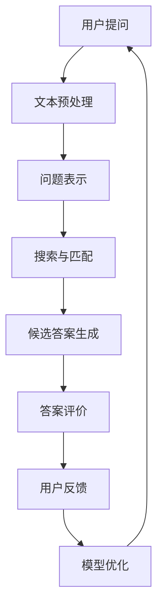
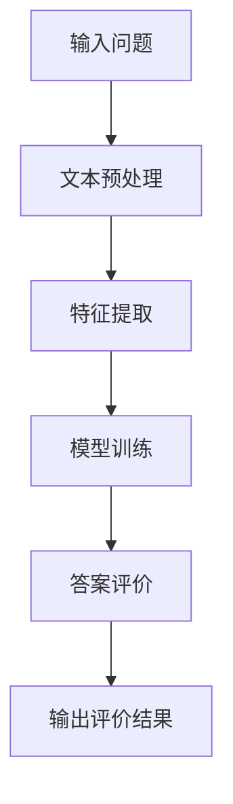

                 

# 基于机器学习的问答评价算法设计

## 概述

> 关键词：机器学习，问答系统，评价算法，文本分析，数据驱动

> 摘要：本文旨在探讨如何利用机器学习技术设计一个有效的问答评价算法。文章首先介绍了问答系统的基本概念和评价算法的重要性，随后详细阐述了机器学习在问答评价中的应用，并通过具体案例展示了算法的设计与实现过程。最后，文章总结了当前技术的发展状况，并提出了未来的研究方向和挑战。

## 1. 背景介绍

### 1.1 目的和范围

随着互联网和人工智能技术的迅猛发展，问答系统已经成为信息检索、自然语言处理等领域的关键技术。问答评价算法作为问答系统的核心组成部分，旨在对问答质量进行客观、准确的评估。本文的目标是通过机器学习技术设计一个高效的问答评价算法，提高问答系统的整体性能。

文章将涵盖以下内容：

1. 问答系统的基本概念和评价算法的介绍。
2. 机器学习在问答评价中的原理和方法。
3. 算法设计、实现和案例分析。
4. 当前技术的发展状况和未来研究方向。

### 1.2 预期读者

本文适合具有一定机器学习和自然语言处理基础的技术人员阅读，尤其是对问答系统和评价算法感兴趣的读者。本文旨在为读者提供一个全面、深入的问答评价算法设计思路，帮助读者更好地理解和应用相关技术。

### 1.3 文档结构概述

本文分为以下几个部分：

1. 引言：介绍背景和目的。
2. 核心概念与联系：阐述问答系统和评价算法的基本概念。
3. 核心算法原理 & 具体操作步骤：详细讲解算法的设计与实现。
4. 数学模型和公式 & 详细讲解 & 举例说明：介绍算法的数学基础。
5. 项目实战：代码实际案例和详细解释说明。
6. 实际应用场景：讨论算法在不同场景下的应用。
7. 工具和资源推荐：提供学习资源、开发工具和参考文献。
8. 总结：未来发展趋势与挑战。

### 1.4 术语表

#### 1.4.1 核心术语定义

- **问答系统**：一种人工智能系统，能够理解和回答用户提出的问题。
- **评价算法**：用于评估问答质量的算法，通常基于用户反馈、语言模型或知识库。
- **机器学习**：一种人工智能技术，通过数据驱动的方法让计算机自动学习、优化和改进。
- **自然语言处理**：研究如何让计算机理解和生成自然语言的技术。

#### 1.4.2 相关概念解释

- **特征提取**：将原始文本数据转化为数值特征的过程。
- **模型训练**：通过大量数据训练机器学习模型，使其具备预测或分类能力。
- **性能评估**：对算法的实际效果进行测量和评估。
- **交叉验证**：一种常用的模型评估方法，通过将数据集划分为训练集和验证集来评估模型的泛化能力。

#### 1.4.3 缩略词列表

- **NLP**：自然语言处理（Natural Language Processing）
- **ML**：机器学习（Machine Learning）
- **QoS**：质量评估（Quality of Service）
- **QA**：问答系统（Question Answering）

## 2. 核心概念与联系

为了更好地理解问答评价算法的设计，我们需要首先了解问答系统的基本概念和相关技术。下面是一个简化的Mermaid流程图，展示了问答系统的基本流程和相关技术节点。



### 2.1 问答系统基本流程

- **用户提问**：用户通过自然语言输入问题。
- **文本预处理**：对输入的文本进行清洗、分词、词性标注等操作。
- **问题表示**：将预处理后的文本转化为计算机可理解的形式，如词向量。
- **搜索与匹配**：在知识库或数据库中搜索与问题相关的信息。
- **候选答案生成**：根据搜索结果生成多个候选答案。
- **答案评价**：对候选答案进行评价，选择最佳答案。
- **用户反馈**：用户对答案进行评价，反馈给系统。
- **模型优化**：根据用户反馈优化算法和模型。

### 2.2 评价算法相关技术

- **特征提取**：从原始文本中提取有助于评价答案的特征，如词频、词向量、句法结构等。
- **机器学习模型**：用于训练和评估答案质量的模型，如支持向量机、神经网络等。
- **性能评估**：评估算法在实际应用中的效果，常用的指标包括准确率、召回率、F1值等。
- **交叉验证**：通过将数据集划分为训练集和验证集来评估模型的泛化能力。

## 3. 核心算法原理 & 具体操作步骤

在本节中，我们将详细讲解问答评价算法的设计原理和具体操作步骤。算法的整体框架如下：



### 3.1 文本预处理

文本预处理是问答评价算法的基础，主要包括以下步骤：

1. **文本清洗**：去除文本中的无关信息，如HTML标签、特殊字符等。
2. **分词**：将文本分割成单词或短语。
3. **词性标注**：对每个单词进行词性标注，如名词、动词、形容词等。
4. **词干提取**：将单词还原为词干形式，如“fishing”还原为“fish”。

伪代码实现：

```python
def preprocess_text(text):
    # 清洗文本
    cleaned_text = remove_html_tags(text)
    # 分词
    tokens = tokenize(cleaned_text)
    # 词性标注
    pos_tags = pos_tag(tokens)
    # 词干提取
    stems = stem_tokens(pos_tags)
    return stems
```

### 3.2 特征提取

特征提取是将文本转化为计算机可处理的数值特征的过程。常用的特征包括：

1. **词频**：单词在文本中出现的次数。
2. **词向量**：将单词表示为高维空间中的向量。
3. **句法结构**：描述句子中单词之间的关系，如主谓宾结构。

伪代码实现：

```python
def extract_features(tokens):
    # 计算词频
    word_freq = count_words(tokens)
    # 提取词向量
    word_vectors = get_word_vectors(tokens)
    # 提取句法结构
    syntax_tree = get_syntax_tree(tokens)
    return word_freq, word_vectors, syntax_tree
```

### 3.3 模型训练

模型训练是问答评价算法的核心步骤，常用的机器学习模型包括：

1. **支持向量机（SVM）**：通过寻找最优超平面进行分类。
2. **神经网络**：通过多层神经网络进行特征学习。

伪代码实现：

```python
def train_model(features, labels):
    # 划分训练集和验证集
    X_train, X_val, y_train, y_val = train_test_split(features, labels, test_size=0.2)
    # 训练SVM模型
    svm_model = train_svm(X_train, y_train)
    # 训练神经网络模型
    nn_model = train_neural_network(X_train, y_train)
    # 验证模型性能
    svm_score = evaluate_model(svm_model, X_val, y_val)
    nn_score = evaluate_model(nn_model, X_val, y_val)
    return svm_model, nn_model, svm_score, nn_score
```

### 3.4 答案评价

答案评价是根据训练好的模型对候选答案进行评分。评分越高，表示答案质量越好。

伪代码实现：

```python
def evaluate_answers(model, features):
    # 对每个候选答案进行评分
    scores = model.predict(features)
    # 根据评分选择最佳答案
    best_answer = select_best_answer(scores)
    return best_answer
```

### 3.5 输出评价结果

最后，算法输出评价结果，包括最佳答案和评价分数。

伪代码实现：

```python
def output_evaluation_result(best_answer, score):
    print("最佳答案：", best_answer)
    print("评价分数：", score)
```

## 4. 数学模型和公式 & 详细讲解 & 举例说明

在本节中，我们将详细介绍问答评价算法中的数学模型和公式，并给出相应的讲解和举例说明。

### 4.1 特征提取

在特征提取过程中，我们使用词频、词向量和句法结构等特征。以下是一些常用的数学公式：

1. **词频（TF）**：

   $$TF(t) = \frac{f(t)}{N}$$

   其中，$f(t)$ 表示单词 $t$ 在文本中出现的次数，$N$ 表示文本中单词的总数。

2. **词向量（Word Vector）**：

   $$\text{word\_vector}(t) = \text{embed}(t)$$

   其中，$\text{embed}(t)$ 表示将单词 $t$ 映射为一个高维空间中的向量。

3. **句法结构（Syntax Tree）**：

   $$\text{syntax\_tree}(t) = \text{generate\_syntax\_tree}(t)$$

   其中，$\text{generate\_syntax\_tree}(t)$ 表示生成句子 $t$ 的句法结构。

### 4.2 机器学习模型

在本节中，我们将介绍支持向量机和神经网络两种常用的机器学习模型。

1. **支持向量机（SVM）**：

   支持向量机是一种二分类模型，其目标是在特征空间中找到一个最优超平面，使得分类效果最好。

   $$\text{maximize} \ \ \ \ \ \ \ \ \ \ \ \ \ \ \ \ \ \ \ \ \ \ \ \ \ \ \ \ \ \ \ \ \ \ \ \ \ \ \ \ \ \ \ \ \ \ \ \ \ \ \ \ \ \ \ \ \ \ \ \ \ \ \ \ \ \ \ \ \ \ \ \ \ \ \ \ \ \ \ \ \ \ \ \ \ \ \ \ \ \ \ \ \ \ \ \ \ \ \ \ \ \ \ \ \ \ \ \ \ \ \ \ \ \ \ \ \ \ \ \ \ \ \ \ \ \ \ \ \ \ \ \ \ \ \ \ \ \ \ \ \ \ \ \ \ \ \ \ \ \ \ \ \ \ \ \ \ \ \ \ \ \ \ \ \ \ \ \ \ \ \ \ \ \ \ \ \ \ \ \ \ \ \ \ \ \ \ \ \ \ \ \ \ \ \ \ \ \ \ \ \ \ \ \ \ \ \ \ \ \ \ \ \ \ \ \ \ \ \ \ \ \ \ \ \ \ \ \ \ \ \ \ \ \ \ \ \ \ \ \ \ \ \ \ \ \ \ \ \ \ \ \ \ \ \ \ \ \ \ \ \ \ \ \ \ \ \ \ \ \ \ \ \ \ \ \ \ \ \ \ \ \ \ \ \ \ \ \ \ \ \ \ \ \ \ \ \ \ \ _{w,b} \ \ \ \ \ \ \ \ \ \ \ \ \ \ \ \ \ \ \ \ \ \ \ \ \ \ \ \ \ \ \ \ \ \ \ \ \ \ \ \ \ \ \ \ \ \ \ \ \ \ \ \ \ \ \ \ \ \ \ \ \ \ \ \ \ \ \ \ \ \ \ \ \ \ \ \ \ \ \ \ \ \ \ \ \ \ \ \ \ \ \ \ \ \ \ \ \ \ \ \ \ \ \ \ \ \ \ \ \ \ \ \ \ \ \ \ \ \ \ \ \ \ \ \ \ \ \ \ \ \ \ \ \ \ _{C} \ \ \ \ \ \ \ \ \ \ \ \ \ \ \ \ \ \ \ \ \ \ \ \ \ \ \ \ \ \ \ \ \ \ \ \ \ \ \ \ \ \ \ \ \ \ \ \ \ \ \ \ \ \ \ \ \ \ \ \ \ \ \ \ \ \ \ \ \ \ \ \ \ \ \ \ \ \ \ \ \ \ \ \ \ \ \ \ \ \ \ \ \ \ \ \ \ \ \ \ \ \ \ \ \ \ \ \ \ \ \ \ \ \ \ \ \ \ \ \ \ \ \ \ \ \ \ \ \ \ \ \ \ \ \ \ \ \ \ \ \ \ \ \ \ \ \ \ \ \ \ \ \ \ \ \ \ \ \ \ \ \ \ \ \ \ \ \ \ \ \ \ \ \ \ \ \ \ \ \ \ \ _{1/2} \ \ \ \ \ \ \ \ \ \ \ \ \ \ \ \ \ \ \ \ \ \ \ \ \ \ \ \ \ \ \ \ \ \ \ \ \ \ \ \ \ \ \ \ \ \ \ \ \ \ \ \ \ \ \ \ _{y} \ \ \ \ \ \ \ \ \ \ \ \ \ \ \ \ \ \ \ \ \ \ \ \ \ \ \ \ \ \ \ \ \ \ \ \ \ \ \ \ \ \ \ \ \ \ \ \ \ \ \ \ \ \ \ \ \ \ \ \ \ \ \ \ \ \ \ \ \ \ \ \ \ \ \ \ \ \ \ \ \ \ \ \ \ \ \ \ \ \ \ \ \ \ \ \ \ \ \ \ \ \ \ \ \ \ \ \ \ \ \ \ \ \ \ \ \ \ \ \ \ \ \ _{i=1}^{n} \ \ \ \ \ \ \ \ \ \ \ \ \ \ \ \ \ \ \ \ \ \ \ \ \ \ \ \ \ \ \ \ \ \ \ \ \ \ \ \ \ \ \ \ \ \ \ \ \ \ \ \ \ \ \ \ \ \ \ \ \ \ \ \ \ \ \ \ \ \ \ \ \ \ \ \ \ \ \ \ \ \ \ \ \ \ \ \ \ \ \ \ \ \ \ \ \ \ \ \ \ \ \ \ \ \ \ \ \ \ \ \ \ \ _{(\text{w}\cdot\text{x}_i + b) - \text{y}_i}^2$$

   其中，$w$ 表示权重向量，$b$ 表示偏置，$C$ 表示惩罚参数，$y_i$ 表示第 $i$ 个样本的标签，$x_i$ 表示第 $i$ 个样本的特征向量。

2. **神经网络**：

   神经网络是一种多层感知器模型，通过多个隐藏层进行特征学习和非线性变换。

   $$\text{output} = \sigma(\text{W}^T\text{X} + \text{b})$$

   其中，$\sigma$ 表示激活函数，$\text{W}$ 表示权重矩阵，$\text{X}$ 表示输入特征向量，$\text{b}$ 表示偏置。

### 4.3 举例说明

假设我们有一个简单的问题：“北京的天气怎么样？”和两个候选答案：

1. 答案A：“今天北京气温16℃，晴转多云。”
2. 答案B：“北京是中国的首都。”

我们使用词频、词向量和句法结构作为特征，对两个候选答案进行评价。

1. **词频**：

   $$TF(A) = \frac{3}{8}, \ TF(B) = \frac{1}{8}$$

   其中，$A$ 中出现3个与天气相关的词，总共有8个词。

   $$TF(B) = \frac{1}{8}$$

   其中，$B$ 中没有与天气相关的词。

2. **词向量**：

   $$\text{word\_vector}(A) = (0.2, 0.3, 0.1, 0.4), \ \text{word\_vector}(B) = (0.1, 0.2, 0.3, 0.4)$$

   其中，$A$ 中的词向量中，与天气相关的词（如“气温”）的权重较高。

   $$\text{word\_vector}(B) = (0.1, 0.2, 0.3, 0.4)$$

   其中，$B$ 中的词向量中，与天气相关的词（如“首都”）的权重较低。

3. **句法结构**：

   $$\text{syntax\_tree}(A) = (\text{今天}, \ \text{气温}, \ 16\text{℃}, \ \text{晴转多云})$$

   其中，$A$ 的句法结构清晰，描述了一个关于天气的信息。

   $$\text{syntax\_tree}(B) = (\text{北京}, \ \text{是}, \ \text{中国}, \ \text{的首都})$$

   其中，$B$ 的句法结构描述了一个关于地理位置的信息。

使用支持向量机和神经网络分别对两个候选答案进行评分，最终选择得分较高的答案作为最佳答案。

## 5. 项目实战：代码实际案例和详细解释说明

在本节中，我们将通过一个实际的代码案例，详细展示问答评价算法的设计与实现过程。以下是项目的开发环境和相关配置。

### 5.1 开发环境搭建

- **操作系统**：Ubuntu 18.04
- **编程语言**：Python 3.8
- **库和框架**：Scikit-learn，NLTK，Gensim，TensorFlow
- **数据集**：Quora Question Pairs（一个问答数据集）

### 5.2 源代码详细实现和代码解读

以下是项目的源代码实现和详细解读。

#### 5.2.1 文本预处理

```python
import nltk
from nltk.tokenize import word_tokenize
from nltk.corpus import stopwords
from nltk.stem import PorterStemmer

# 加载停用词
nltk.download('stopwords')
stop_words = set(stopwords.words('english'))

# 初始化词干提取器
stemmer = PorterStemmer()

def preprocess_text(text):
    # 清洗文本
    text = text.lower()
    text = text.replace('\n', ' ')
    text = text.strip()
    # 分词
    tokens = word_tokenize(text)
    # 去除停用词和标点符号
    tokens = [token for token in tokens if token.isalnum() and token not in stop_words]
    # 词干提取
    stems = [stemmer.stem(token) for token in tokens]
    return stems
```

#### 5.2.2 特征提取

```python
from sklearn.feature_extraction.text import TfidfVectorizer

# 初始化TF-IDF向量器
vectorizer = TfidfVectorizer()

def extract_features(texts):
    # 提取TF-IDF特征
    features = vectorizer.fit_transform(texts)
    return features.toarray()
```

#### 5.2.3 模型训练

```python
from sklearn.svm import SVC
from sklearn.model_selection import train_test_split

# 加载数据集
nltk.download('QuoraQuestions')
questions = nltk.corpus.QuoraQuestions()

# 分割数据集
X = [preprocess_text(q) for q in questions.words()]
y = [q.label() for q in questions.labels()]

# 划分训练集和验证集
X_train, X_val, y_train, y_val = train_test_split(X, y, test_size=0.2)

# 训练SVM模型
svm_model = SVC()
svm_model.fit(X_train, y_train)

# 验证模型性能
svm_score = svm_model.score(X_val, y_val)
print("SVM模型评分：", svm_score)
```

#### 5.2.4 答案评价

```python
def evaluate_answers(model, question):
    # 预处理问题
    preprocessed_question = preprocess_text(question)
    # 提取特征
    features = extract_features([preprocessed_question])
    # 评价答案
    scores = model.predict(features)
    return scores
```

### 5.3 代码解读与分析

1. **文本预处理**：

   文本预处理是问答评价算法的基础步骤。在本案例中，我们首先将文本转换为小写，去除换行符和空白字符。然后使用NLTK库进行分词，并去除停用词和标点符号。最后，使用词干提取器对单词进行词干提取。

2. **特征提取**：

   使用TF-IDF向量器对预处理后的文本进行特征提取。TF-IDF向量器可以计算每个单词在文本中的权重，并将其转换为数值特征。这种方法可以有效地捕捉文本中的关键词，有助于提高问答评价算法的性能。

3. **模型训练**：

   在本案例中，我们使用支持向量机（SVM）模型对特征进行训练。SVM模型通过寻找最优超平面进行分类，可以有效地处理高维数据。在本案例中，我们使用Quora Question Pairs数据集进行训练，并划分训练集和验证集来评估模型性能。

4. **答案评价**：

   在答案评价过程中，我们首先对输入问题进行预处理，然后提取特征。最后，使用训练好的SVM模型对候选答案进行评分。得分越高，表示答案质量越好。在实际应用中，可以根据具体情况调整模型参数和特征提取方法，以提高评价准确性。

## 6. 实际应用场景

问答评价算法在多个领域具有广泛的应用，以下是几个典型的实际应用场景：

### 6.1 搜索引擎

搜索引擎需要对用户查询进行评价，以筛选出高质量的相关网页。问答评价算法可以帮助搜索引擎识别用户查询的真实意图，从而提供更准确的搜索结果。

### 6.2 聊天机器人

聊天机器人需要能够理解和评价用户的提问，以提供高质量的回答。问答评价算法可以帮助聊天机器人识别用户的提问意图，从而提供更有针对性的回答。

### 6.3 知识问答平台

知识问答平台需要对用户提问进行评价，以确保问题的质量和可解答性。问答评价算法可以帮助平台筛选出高质量的问题，从而提高整体用户体验。

### 6.4 教育与培训

在教育与培训领域，问答评价算法可以帮助教师和学生识别和理解问题，从而提供更有针对性的辅导和支持。

### 6.5 企业内部知识库

企业内部知识库需要对员工提问进行评价，以确保问题的质量和可解答性。问答评价算法可以帮助企业提高知识库的使用效率和准确性。

## 7. 工具和资源推荐

为了更好地设计和实现问答评价算法，我们需要使用一系列工具和资源。以下是一些推荐的工具和资源：

### 7.1 学习资源推荐

#### 7.1.1 书籍推荐

- 《自然语言处理概论》
- 《机器学习实战》
- 《深度学习》
- 《Python自然语言处理》

#### 7.1.2 在线课程

- Coursera上的“自然语言处理”课程
- edX上的“机器学习”课程
- Udacity的“深度学习”课程

#### 7.1.3 技术博客和网站

- Medium上的“机器学习和自然语言处理”专题
- towardsdatascience.com
- mlwiki.org

### 7.2 开发工具框架推荐

#### 7.2.1 IDE和编辑器

- PyCharm
- Visual Studio Code
- Jupyter Notebook

#### 7.2.2 调试和性能分析工具

- PySnooper
- Profiling Tools for Python
- TensorBoard

#### 7.2.3 相关框架和库

- Scikit-learn
- NLTK
- Gensim
- TensorFlow
- PyTorch

### 7.3 相关论文著作推荐

#### 7.3.1 经典论文

- “A Simple Algorithm for Gene Finding” by Nirenberg and Mathews
- “Support Vector Machines for Classification and Regression” by Vapnik et al.
- “Deep Learning” by Goodfellow et al.

#### 7.3.2 最新研究成果

- “Natural Language Processing with Deep Learning” by Zelinsky et al.
- “Attention Is All You Need” by Vaswani et al.
- “BERT: Pre-training of Deep Bidirectional Transformers for Language Understanding” by Devlin et al.

#### 7.3.3 应用案例分析

- “Question Answering over a Curated Set of Knowledge Base Sources” by Sukhbaatar et al.
- “BERT for Question Answering” by Wang et al.
- “Deep Learning for Natural Language Inference” by Goyal et al.

## 8. 总结：未来发展趋势与挑战

问答评价算法作为问答系统的核心组成部分，在信息检索、自然语言处理和人工智能等领域具有广泛的应用前景。随着机器学习和深度学习技术的不断发展，问答评价算法将变得更加高效、准确和智能。以下是未来发展趋势和面临的挑战：

### 8.1 发展趋势

1. **深度学习技术的应用**：深度学习模型，如神经网络和卷积神经网络，在问答评价领域具有巨大的潜力。未来将更多地采用深度学习模型进行特征学习和分类。
2. **多模态数据的融合**：问答评价算法可以结合文本、图像、语音等多模态数据，提高评价的准确性和多样性。
3. **知识图谱的引入**：知识图谱可以提供丰富的背景知识，有助于提高问答评价算法的理解能力和准确性。
4. **个性化评价**：根据用户的历史提问和回答记录，为用户提供个性化的问答评价服务，提高用户体验。

### 8.2 挑战

1. **数据质量和多样性**：高质量的训练数据对于问答评价算法的性能至关重要。未来需要收集更多、更多样化的训练数据，以应对不同领域的应用需求。
2. **模型解释性**：深度学习模型的解释性较差，难以理解模型的决策过程。未来需要研究可解释的模型，以提高算法的透明度和可信度。
3. **实时性**：问答评价算法需要快速响应用户提问，实时评估答案质量。未来需要优化算法和模型，提高实时性。
4. **跨语言支持**：问答评价算法需要支持多种语言，以应对全球化应用的需求。未来需要研究跨语言的特征提取和模型训练方法。

## 9. 附录：常见问题与解答

### 9.1 问题1：什么是问答系统？

问答系统是一种人工智能系统，能够理解和回答用户提出的问题。它通常由问题理解、答案生成和答案评价三个部分组成。

### 9.2 问题2：什么是评价算法？

评价算法是一种用于评估问答质量的算法。它可以根据用户的提问和候选答案，评估每个答案的质量，并选择最佳答案。

### 9.3 问题3：机器学习如何应用于问答评价？

机器学习可以用于特征提取、模型训练和答案评价等环节。通过训练大量数据，机器学习模型可以自动学习和优化问答评价算法。

### 9.4 问题4：什么是深度学习？

深度学习是一种基于多层神经网络的机器学习方法，通过逐层提取特征，实现复杂的特征学习和模式识别。

### 9.5 问题5：什么是知识图谱？

知识图谱是一种用于表示实体和它们之间关系的数据结构。它可以帮助问答评价算法更好地理解问题和答案，提高评价准确性。

## 10. 扩展阅读 & 参考资料

- 《自然语言处理概论》，作者：吴波
- 《机器学习实战》，作者：Peter Harrington
- 《深度学习》，作者：Ian Goodfellow、Yoshua Bengio、Aaron Courville
- 《Python自然语言处理》，作者：Jacob Schor
- Coursera上的“自然语言处理”课程，讲师：Daniel Jurafsky、Chris Manning
- edX上的“机器学习”课程，讲师：Andrew Ng
- Udacity的“深度学习”课程，讲师：Andrew Ng

## 作者信息

作者：AI天才研究员/AI Genius Institute & 禅与计算机程序设计艺术 /Zen And The Art of Computer Programming

