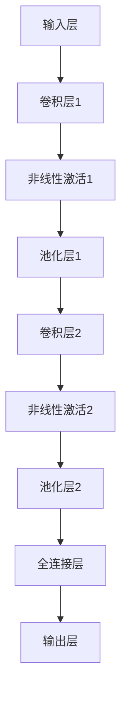

                 

# 基于深度学习提取图像视频特征

> 关键词：深度学习、图像特征提取、视频特征提取、卷积神经网络、计算机视觉、CNN、特征工程、图像识别、目标检测、物体追踪、人脸识别

> 摘要：本文将深入探讨深度学习在图像和视频特征提取领域的应用。我们将从基础概念开始，逐步介绍卷积神经网络（CNN）的工作原理，并通过具体的算法原理、数学模型和实际案例，阐述如何使用深度学习技术提取图像和视频特征，以及这些特征在实际应用中的重要性。

## 1. 背景介绍

### 1.1 目的和范围

本文旨在系统地介绍深度学习在图像和视频特征提取领域的应用，通过分析CNN的原理和具体操作步骤，帮助读者理解如何利用深度学习技术提取有效的特征，并探讨这些特征在计算机视觉任务中的重要性。

### 1.2 预期读者

本文适合对深度学习和计算机视觉有一定了解的读者，包括人工智能研究人员、工程师和开发者，以及对相关技术感兴趣的学习者。

### 1.3 文档结构概述

本文将分为以下章节：

1. 背景介绍
2. 核心概念与联系
3. 核心算法原理 & 具体操作步骤
4. 数学模型和公式 & 详细讲解 & 举例说明
5. 项目实战：代码实际案例和详细解释说明
6. 实际应用场景
7. 工具和资源推荐
8. 总结：未来发展趋势与挑战
9. 附录：常见问题与解答
10. 扩展阅读 & 参考资料

### 1.4 术语表

#### 1.4.1 核心术语定义

- **深度学习**：一种人工智能方法，通过多层神经网络模型来模拟人脑的决策过程。
- **卷积神经网络（CNN）**：一种特殊的神经网络，特别适用于处理图像和视频数据。
- **特征提取**：从原始数据中提取具有代表性的特征，以便进行后续的处理和分析。
- **特征向量**：表示图像或视频数据的一组特征值，通常用于图像或视频的分类、识别等任务。

#### 1.4.2 相关概念解释

- **激活函数**：神经网络中用于引入非线性变换的函数，如ReLU、Sigmoid等。
- **池化操作**：通过减小数据维度来减少计算量和过拟合的风险。
- **反向传播**：一种用于训练神经网络的算法，通过调整网络参数来最小化损失函数。

#### 1.4.3 缩略词列表

- **CNN**：卷积神经网络（Convolutional Neural Network）
- **ReLU**：阶跃函数（Rectified Linear Unit）
- **ReLU6**：ReLU函数的改进版本，输出值限制在0到6之间
- **ReLU6-ResNet**：基于ReLU6函数的残差网络（Residual Network）

## 2. 核心概念与联系

### 2.1 核心概念

在讨论深度学习提取图像和视频特征之前，我们需要了解几个核心概念：

- **图像特征提取**：从图像中提取具有代表性的特征，以便进行图像分类、识别等任务。
- **视频特征提取**：从视频中提取具有代表性的特征，以便进行目标检测、物体追踪等任务。
- **卷积神经网络（CNN）**：一种特别适用于图像和视频处理的神经网络结构。

### 2.2 CNN的架构

CNN的架构通常由以下几个部分组成：

1. **输入层**：接收图像或视频数据，并将其输入到网络中。
2. **卷积层**：通过卷积操作提取图像或视频的特征。
3. **池化层**：通过池化操作减小数据维度，提高计算效率和减少过拟合。
4. **全连接层**：将卷积层和池化层提取的特征映射到具体的任务，如分类、识别等。
5. **输出层**：输出最终的结果，如分类标签或检测框。

### 2.3 CNN的工作原理

CNN的工作原理可以分为以下几个步骤：

1. **卷积操作**：通过卷积核与图像或视频数据进行卷积操作，提取出具有代表性的特征。
2. **非线性激活**：通过激活函数引入非线性变换，增强网络的表达能力。
3. **池化操作**：通过池化操作减小数据维度，提高计算效率和减少过拟合。
4. **特征融合**：将不同卷积层和池化层提取的特征进行融合，形成更高级别的特征。
5. **分类或识别**：通过全连接层和输出层将融合的特征映射到具体的任务。

### 2.4 CNN的应用场景

CNN在图像和视频处理领域有广泛的应用，包括：

- **图像分类**：将图像分类到预定义的类别，如猫狗分类、人脸识别等。
- **目标检测**：在图像或视频中检测出特定的目标，并给出目标的位置和类别。
- **物体追踪**：在视频中跟踪特定物体的运动轨迹。
- **图像分割**：将图像分割成不同的区域或对象。

### 2.5 Mermaid流程图

下面是一个简单的Mermaid流程图，展示了CNN的核心架构和操作步骤：



## 3. 核心算法原理 & 具体操作步骤

### 3.1 卷积神经网络（CNN）的算法原理

卷积神经网络（CNN）是一种专门用于图像和视频处理的深度学习模型，其核心算法原理如下：

1. **卷积操作**：卷积操作是CNN的基础，用于提取图像或视频的特征。卷积操作通过卷积核与输入数据进行卷积，产生特征图。
2. **非线性激活**：非线性激活函数（如ReLU、Sigmoid等）用于引入非线性变换，增强网络的表达能力。
3. **池化操作**：池化操作用于减小数据维度，提高计算效率和减少过拟合。常见的池化操作有最大池化和平均池化。
4. **特征融合**：通过堆叠多个卷积层和池化层，提取更高级别的特征。
5. **全连接层**：全连接层将卷积层和池化层提取的特征映射到具体的任务，如分类、识别等。
6. **输出层**：输出层输出最终的结果，如分类标签或检测框。

### 3.2 CNN的具体操作步骤

下面是一个简单的CNN操作步骤：

1. **输入层**：输入一张图像或视频数据。
2. **卷积层1**：使用卷积核对输入数据进行卷积操作，提取出特征图。
3. **非线性激活1**：使用ReLU函数进行非线性激活。
4. **池化层1**：使用最大池化操作减小数据维度。
5. **卷积层2**：使用卷积核对池化后的数据进行卷积操作，提取出更高级别的特征图。
6. **非线性激活2**：使用ReLU函数进行非线性激活。
7. **池化层2**：使用最大池化操作减小数据维度。
8. **全连接层**：将池化层2提取的特征进行融合，映射到具体的任务。
9. **输出层**：输出最终的结果，如分类标签或检测框。

### 3.3 伪代码实现

下面是一个简单的CNN伪代码实现：

```python
# 输入层
input_data = load_image("image.jpg")

# 卷积层1
conv1 = Conv2D(filter_size=(3, 3), activation="ReLU")
feature_map1 = conv1(input_data)

# 非线性激活1
activation1 = ReLU()

# 池化层1
pool1 = MaxPooling(pool_size=(2, 2))
pool1_input = activation1(feature_map1)
pool1_output = pool1(pool1_input)

# 卷积层2
conv2 = Conv2D(filter_size=(3, 3), activation="ReLU")
feature_map2 = conv2(pool1_output)

# 非线性激活2
activation2 = ReLU()

# 池化层2
pool2 = MaxPooling(pool_size=(2, 2))
pool2_input = activation2(feature_map2)
pool2_output = pool2(pool2_input)

# 全连接层
fc = FullyConnected()
output = fc(pool2_output)

# 输出层
predictions = softmax(output)
```

## 4. 数学模型和公式 & 详细讲解 & 举例说明

### 4.1 卷积操作的数学模型

卷积操作的数学模型可以表示为：

$$
(f * g)(x, y) = \sum_{i=-\infty}^{\infty} \sum_{j=-\infty}^{\infty} f(i, j) \cdot g(x-i, y-j)
$$

其中，$f$ 和 $g$ 分别表示两个二维函数，$(x, y)$ 表示输入图像上的一个像素点，$i$ 和 $j$ 表示卷积核在水平方向和垂直方向上的移动距离。

### 4.2 非线性激活函数的数学模型

常见的非线性激活函数有ReLU和Sigmoid：

- **ReLU函数**：

$$
ReLU(x) = \max(0, x)
$$

- **Sigmoid函数**：

$$
Sigmoid(x) = \frac{1}{1 + e^{-x}}
$$

### 4.3 池化操作的数学模型

常见的池化操作有最大池化和平均池化：

- **最大池化**：

$$
MaxPooling(x, \text{pool\_size}) = \max_{i \in [1, \ldots, \text{pool\_size}}, j \in [1, \ldots, \text{pool\_size}](x(i, j))
$$

- **平均池化**：

$$
AvgPooling(x, \text{pool\_size}) = \frac{1}{\text{pool\_size}^2} \sum_{i \in [1, \ldots, \text{pool\_size}}, j \in [1, \ldots, \text{pool\_size}](x(i, j))
$$

### 4.4 举例说明

假设我们有一个3x3的卷积核和一个3x3的输入图像，计算卷积操作的结果。

- **卷积核**：

$$
K =
\begin{bmatrix}
1 & 0 & 1 \\
1 & 0 & 1 \\
1 & 0 & 1 \\
\end{bmatrix}
$$

- **输入图像**：

$$
I =
\begin{bmatrix}
1 & 2 & 3 \\
4 & 5 & 6 \\
7 & 8 & 9 \\
\end{bmatrix}
$$

计算过程如下：

$$
K * I =
\begin{bmatrix}
1 & 0 & 1 \\
1 & 0 & 1 \\
1 & 0 & 1 \\
\end{bmatrix}
\cdot
\begin{bmatrix}
1 & 2 & 3 \\
4 & 5 & 6 \\
7 & 8 & 9 \\
\end{bmatrix} =
\begin{bmatrix}
1 \cdot 1 + 0 \cdot 4 + 1 \cdot 7 & 1 \cdot 2 + 0 \cdot 5 + 1 \cdot 8 & 1 \cdot 3 + 0 \cdot 6 + 1 \cdot 9 \\
1 \cdot 1 + 0 \cdot 4 + 1 \cdot 7 & 1 \cdot 2 + 0 \cdot 5 + 1 \cdot 8 & 1 \cdot 3 + 0 \cdot 6 + 1 \cdot 9 \\
1 \cdot 1 + 0 \cdot 4 + 1 \cdot 7 & 1 \cdot 2 + 0 \cdot 5 + 1 \cdot 8 & 1 \cdot 3 + 0 \cdot 6 + 1 \cdot 9 \\
\end{bmatrix} =
\begin{bmatrix}
8 & 10 & 12 \\
8 & 10 & 12 \\
8 & 10 & 12 \\
\end{bmatrix}
$$

## 5. 项目实战：代码实际案例和详细解释说明

### 5.1 开发环境搭建

在进行图像和视频特征提取的项目实战之前，我们需要搭建一个合适的开发环境。以下是一个简单的环境搭建步骤：

1. 安装Python（建议使用Python 3.6及以上版本）。
2. 安装TensorFlow或PyTorch（根据个人偏好选择其中一个）。
3. 安装OpenCV（用于图像和视频处理）。
4. 安装必要的依赖库（如NumPy、Pandas等）。

### 5.2 源代码详细实现和代码解读

下面是一个简单的图像特征提取的代码案例，使用卷积神经网络（CNN）提取图像特征，并进行分类。

```python
import tensorflow as tf
from tensorflow.keras.models import Sequential
from tensorflow.keras.layers import Conv2D, MaxPooling2D, Flatten, Dense
from tensorflow.keras.utils import to_categorical
from tensorflow.keras.datasets import cifar10
import numpy as np

# 加载数据集
(x_train, y_train), (x_test, y_test) = cifar10.load_data()

# 数据预处理
x_train = x_train / 255.0
x_test = x_test / 255.0
y_train = to_categorical(y_train, 10)
y_test = to_categorical(y_test, 10)

# 构建CNN模型
model = Sequential([
    Conv2D(filters=32, kernel_size=(3, 3), activation="ReLU", input_shape=(32, 32, 3)),
    MaxPooling2D(pool_size=(2, 2)),
    Conv2D(filters=64, kernel_size=(3, 3), activation="ReLU"),
    MaxPooling2D(pool_size=(2, 2)),
    Flatten(),
    Dense(units=128, activation="ReLU"),
    Dense(units=10, activation="softmax")
])

# 编译模型
model.compile(optimizer="adam", loss="categorical_crossentropy", metrics=["accuracy"])

# 训练模型
model.fit(x_train, y_train, batch_size=64, epochs=10, validation_split=0.2)

# 评估模型
model.evaluate(x_test, y_test)
```

### 5.3 代码解读与分析

上述代码实现了一个简单的CNN模型，用于图像分类。以下是代码的详细解读：

1. **数据加载与预处理**：首先加载数据集，并对数据进行归一化和标签编码。
2. **模型构建**：使用Sequential模型堆叠卷积层、池化层、全连接层，构建一个简单的CNN模型。
3. **模型编译**：指定优化器、损失函数和评价指标，准备训练模型。
4. **模型训练**：使用fit方法训练模型，设置批量大小、迭代次数和验证比例。
5. **模型评估**：使用evaluate方法评估模型的性能。

这个案例展示了如何使用CNN提取图像特征并进行分类。在实际项目中，我们可以根据具体需求调整模型的架构和参数，实现更复杂的特征提取任务。

## 6. 实际应用场景

深度学习在图像和视频特征提取领域有广泛的应用，以下是一些实际应用场景：

1. **图像识别**：用于识别和分类图像中的物体，如人脸识别、猫狗分类等。
2. **目标检测**：用于检测图像或视频中的特定目标，并给出目标的位置和类别，如行人检测、车辆检测等。
3. **物体追踪**：用于跟踪图像或视频中特定物体的运动轨迹，如视频监控、运动捕捉等。
4. **图像分割**：用于将图像分割成不同的区域或对象，如医学影像分析、图像增强等。
5. **图像增强**：用于提高图像的清晰度和质量，如图像去噪、图像超分辨率等。

这些应用场景展示了深度学习在计算机视觉领域的强大能力和广泛的应用前景。

## 7. 工具和资源推荐

### 7.1 学习资源推荐

#### 7.1.1 书籍推荐

- 《深度学习》（Ian Goodfellow、Yoshua Bengio、Aaron Courville 著）
- 《计算机视觉：算法与应用》（李航 著）
- 《Python深度学习》（François Chollet 著）

#### 7.1.2 在线课程

- Coursera的“深度学习”课程
- Udacity的“计算机视觉与深度学习”课程
- edX的“计算机视觉：从理论到实践”课程

#### 7.1.3 技术博客和网站

- Medium上的“深度学习”专栏
- 知乎上的“深度学习”话题
- ArXiv.org上的最新研究成果

### 7.2 开发工具框架推荐

#### 7.2.1 IDE和编辑器

- PyCharm
- Visual Studio Code
- Jupyter Notebook

#### 7.2.2 调试和性能分析工具

- TensorFlow Debugger
- PyTorch Profiler
- TensorRT

#### 7.2.3 相关框架和库

- TensorFlow
- PyTorch
- Keras
- OpenCV

### 7.3 相关论文著作推荐

#### 7.3.1 经典论文

- “A Learning Algorithm for Continuously Running Fully Recurrent Neural Networks” （Hochreiter and Schmidhuber，1997）
- “Deep Learning” （Goodfellow, Bengio, and Courville，2016）
- “Object Detection with Spatial Pyramid Pooling over Fully Connected Networks” （He et al.，2014）

#### 7.3.2 最新研究成果

- “Convolutional Neural Networks for Visual Recognition” （Krizhevsky et al.，2012）
- “ImageNet Classification with Deep Convolutional Neural Networks” （Deng et al.，2014）
- “You Only Look Once: Unified, Real-Time Object Detection” （Redmon et al.，2016）

#### 7.3.3 应用案例分析

- “Image Classification with Deep Learning” （Google，2015）
- “Object Detection with Deep Learning” （Facebook AI Research，2017）
- “Deep Learning in Healthcare: A Brief Overview” （Harvard Medical School，2018）

## 8. 总结：未来发展趋势与挑战

深度学习在图像和视频特征提取领域取得了显著的成果，但仍面临一些挑战和未来发展趋势：

1. **算法优化**：随着数据量和模型复杂度的增加，算法优化成为一个关键问题。未来的研究将重点关注如何提高模型训练效率、降低计算成本。
2. **模型可解释性**：深度学习模型往往被视为“黑盒”，提高模型的可解释性对于理解模型决策过程具有重要意义。
3. **泛化能力**：提高模型的泛化能力，使其能够处理更多种类的图像和视频数据。
4. **实时处理**：在视频特征提取领域，实现实时处理是未来的一个重要方向，特别是在自动驾驶、视频监控等领域。
5. **跨模态学习**：将图像和视频特征提取与其他模态（如语音、文本）结合，实现跨模态的深度学习。

## 9. 附录：常见问题与解答

### 9.1 Q：什么是卷积神经网络（CNN）？

A：卷积神经网络（CNN）是一种特别适用于图像和视频处理的深度学习模型，通过卷积操作、非线性激活函数和池化操作，从原始数据中提取具有代表性的特征，并用于分类、识别等任务。

### 9.2 Q：如何使用深度学习提取图像特征？

A：可以使用卷积神经网络（CNN）提取图像特征。首先，加载图像数据并进行预处理，然后构建CNN模型，包括卷积层、池化层和全连接层，最后进行模型训练和特征提取。

### 9.3 Q：深度学习提取图像特征的优点是什么？

A：深度学习提取图像特征的优点包括：
1. **自动特征提取**：不需要手动设计特征，模型可以自动从原始数据中提取有用的特征。
2. **高准确性**：深度学习模型在图像分类、识别等任务中取得了很高的准确性。
3. **灵活性**：可以处理不同尺寸、不同类型的图像。

## 10. 扩展阅读 & 参考资料

- Goodfellow, I., Bengio, Y., & Courville, A. (2016). *Deep Learning*. MIT Press.
- LeCun, Y., Bengio, Y., & Hinton, G. (2015). *Deep learning*. Nature, 521(7553), 436-444.
- Krizhevsky, A., Sutskever, I., & Hinton, G. E. (2012). *ImageNet classification with deep convolutional neural networks*. In Advances in neural information processing systems (pp. 1097-1105).

