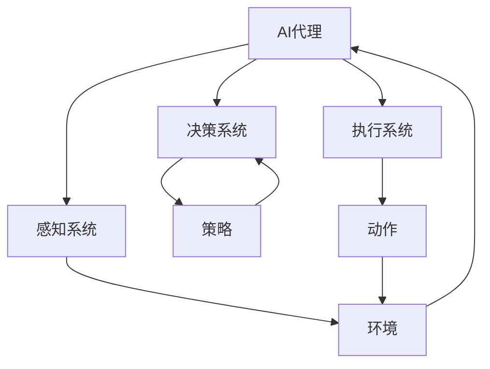

                 

# 基于深度学习的AI代理工作流：案例与实践

> 关键词：深度学习，AI代理，工作流，案例研究，实践指南

> 摘要：本文深入探讨了基于深度学习的AI代理工作流，通过实际案例和详细实践，阐述了如何构建高效的AI代理系统。文章涵盖了核心概念、算法原理、数学模型、项目实战以及未来发展趋势，旨在为读者提供全面的技术指导和实用参考。

## 1. 背景介绍

### 1.1 目的和范围

本文的目标是探讨深度学习在AI代理中的应用，通过实际案例和实践，帮助读者理解并掌握构建高效AI代理系统的方法。文章将涵盖以下几个方面：

- AI代理的基本概念和作用
- 深度学习在AI代理中的应用
- AI代理工作流的设计与实现
- 实际项目中的挑战和解决方案
- 未来发展趋势和面临的挑战

### 1.2 预期读者

本文适用于以下读者群体：

- 对深度学习和AI代理有兴趣的科研人员
- 想要在实际项目中应用AI代理的开发者
- 从事人工智能领域的研究生和本科生
- 对AI代理工作流感兴趣的工程师和架构师

### 1.3 文档结构概述

本文的结构如下：

- 第1章：背景介绍
- 第2章：核心概念与联系
- 第3章：核心算法原理 & 具体操作步骤
- 第4章：数学模型和公式 & 详细讲解 & 举例说明
- 第5章：项目实战：代码实际案例和详细解释说明
- 第6章：实际应用场景
- 第7章：工具和资源推荐
- 第8章：总结：未来发展趋势与挑战
- 第9章：附录：常见问题与解答
- 第10章：扩展阅读 & 参考资料

### 1.4 术语表

#### 1.4.1 核心术语定义

- AI代理（AI Agent）：在特定环境中采取行动以实现特定目标的智能体。
- 深度学习（Deep Learning）：一种人工智能领域的技术，通过多层神经网络来学习和提取数据中的特征。
- 工作流（Workflow）：完成特定任务的一系列有序步骤。

#### 1.4.2 相关概念解释

- 代理（Agent）：具有自主性、社会性和反应性的实体，可以感知环境并采取行动。
- 神经网络（Neural Network）：一种由大量神经元组成的计算模型，可以模拟人脑的神经元网络。

#### 1.4.3 缩略词列表

- AI：人工智能
- DNN：深度神经网络
- CNN：卷积神经网络
- RNN：循环神经网络
- ML：机器学习

## 2. 核心概念与联系

在深入探讨AI代理工作流之前，我们需要了解一些核心概念和它们之间的联系。以下是核心概念原理和架构的Mermaid流程图：



### 2.1 感知系统

感知系统是AI代理的核心组成部分之一，它负责感知环境中的信息。感知系统通常由各种传感器和数据采集设备组成，如摄像头、麦克风、GPS等。通过这些设备，AI代理可以获取到环境中的视觉、声音、位置等数据。

### 2.2 决策系统

决策系统负责根据感知系统收集到的数据，对行动方案进行评估和选择。决策系统通常采用深度学习算法，如神经网络，来处理和解析数据。通过训练和学习，决策系统能够学会如何根据不同的环境状态，选择最优的行动方案。

### 2.3 执行系统

执行系统负责将决策系统选定的行动方案付诸实践。执行系统通常与物理设备或虚拟环境进行交互，执行具体的任务。例如，一个自动驾驶汽车中的执行系统可能包括制动、转向、加速等设备。

### 2.4 环境建模

环境建模是AI代理工作流中至关重要的一环。通过建立精确的环境模型，AI代理可以更好地理解所处环境，从而提高决策和执行的准确性。环境建模通常涉及对环境中的对象、位置、状态等进行建模和表征。

## 3. 核心算法原理 & 具体操作步骤

### 3.1 神经网络基础

神经网络是深度学习的基础，它由大量的神经元组成，通过学习数据中的特征来模拟人脑的神经元网络。以下是神经网络的简单伪代码：

```python
# 定义神经网络结构
layers = [
    Neuron(10),  # 输入层，10个神经元
    Neuron(20),  # 隐藏层，20个神经元
    Neuron(1)    # 输出层，1个神经元
]

# 定义激活函数
activation_function = sigmoid

# 定义学习率
learning_rate = 0.1

# 训练神经网络
for epoch in range(num_epochs):
    for sample in dataset:
        # 前向传播
        inputs = sample[0]
        outputs = []
        for layer in layers:
            layer.inputs = inputs
            inputs = layer.compute_output()

        # 反向传播
        expected_output = sample[1]
        error = expected_output - outputs[-1]
        for layer in reversed(layers):
            layer.compute_error(error)
            layer.update_weights(learning_rate)
```

### 3.2 决策系统算法

决策系统通常采用策略梯度方法来选择最优的行动方案。以下是策略梯度的简单伪代码：

```python
# 定义策略梯度算法
def policy_gradient_loss(model, states, actions, rewards, next_states, dones):
    # 计算策略梯度
    policy_gradient = []

    for state, action, reward, next_state, done in zip(states, actions, rewards, next_states, dones):
        state_action_value = model.predict(state)
        target = reward if done else reward + gamma * np.max(model.predict(next_state))
        policy_gradient.append(target - state_action_value[action])

    # 计算策略梯度损失
    loss = -np.mean(np.log(model.predict概率分布)) * np.array(policy_gradient)

    return loss

# 训练决策系统
for epoch in range(num_epochs):
    states, actions, rewards, next_states, dones = get_training_data()
    loss = policy_gradient_loss(model, states, actions, rewards, next_states, dones)
    optimizer.zero_grad()
    loss.backward()
    optimizer.step()
```

### 3.3 执行系统算法

执行系统通常采用基于动作价值的强化学习算法，如Q-learning或深度Q网络（DQN）。以下是DQN的简单伪代码：

```python
# 定义DQN算法
def dqn_loss(model, states, actions, rewards, next_states, dones, target_model):
    # 计算目标Q值
    target_q_values = target_model.predict(next_states)
    target_values = rewards + gamma * np.max(target_q_values, axis=1) * (1 - dones)

    # 计算预测Q值
    q_values = model.predict(states)

    # 计算Q值损失
    loss = tf.reduce_mean(tf.square(q_values[actions] - target_values))

    return loss

# 训练执行系统
for epoch in range(num_epochs):
    states, actions, rewards, next_states, dones = get_training_data()
    loss = dqn_loss(model, states, actions, rewards, next_states, dones, target_model)
    optimizer.zero_grad()
    loss.backward()
    optimizer.step()
    update_target_model(model)
```

## 4. 数学模型和公式 & 详细讲解 & 举例说明

在AI代理工作流中，数学模型和公式起着至关重要的作用。以下是对核心数学模型和公式的详细讲解以及举例说明。

### 4.1 神经网络中的激活函数

激活函数是神经网络中的一个关键组成部分，它决定着神经元的输出是否会被激活。以下是一些常用的激活函数：

$$
f(x) = \frac{1}{1 + e^{-x}}
$$

这是sigmoid函数，它将输入x映射到(0, 1)区间。它常用于二分类问题。

$$
f(x) = \max(0, x)
$$

这是ReLU函数，它将输入x映射到非负数。它常用于隐藏层中的神经元。

$$
f(x) = x^2
$$

这是平方函数，它将输入x映射到x的平方。它常用于回归问题。

### 4.2 策略梯度方法

策略梯度方法是用于优化决策系统的一种常用方法。它的核心公式如下：

$$
\theta_{t+1} = \theta_{t} + \alpha \nabla_{\theta} J(\theta)
$$

其中，$\theta$表示参数，$\alpha$表示学习率，$J(\theta)$表示损失函数。通过迭代更新参数，策略梯度方法可以逐渐逼近最优策略。

### 4.3 深度Q网络（DQN）

深度Q网络是一种用于执行系统优化的强化学习算法。它的核心公式如下：

$$
Q(s, a) = r + \gamma \max_{a'} Q(s', a')
$$

其中，$Q(s, a)$表示在状态s下采取动作a的期望回报，$r$表示即时回报，$\gamma$表示折扣因子，$s'$和$a'$表示下一个状态和动作。

### 4.4 举例说明

假设我们有一个简单的环境，其中有两个状态（A和B）和两个动作（左和右）。以下是一个简单的例子：

#### 4.4.1 神经网络

我们使用一个简单的神经网络来预测状态A和状态B下的最佳动作。神经网络的输入层有两个神经元（状态A和状态B），隐藏层有两个神经元，输出层有一个神经元。

#### 4.4.2 策略梯度方法

我们使用策略梯度方法来优化决策系统。在每次迭代中，我们根据当前状态和神经网络输出，选择一个动作。然后，我们计算损失函数并更新神经网络参数。

#### 4.4.3 深度Q网络（DQN）

我们使用深度Q网络来优化执行系统。在每次迭代中，我们根据当前状态和神经网络输出，选择一个动作。然后，我们更新Q网络参数，并计算即时回报和折扣回报。

## 5. 项目实战：代码实际案例和详细解释说明

在本节中，我们将通过一个实际项目来展示如何构建基于深度学习的AI代理工作流。我们将使用Python编程语言和TensorFlow库来实现这个项目。

### 5.1 开发环境搭建

在开始之前，我们需要搭建一个适合深度学习开发的Python环境。以下是搭建环境的步骤：

1. 安装Python 3.6或更高版本。
2. 安装TensorFlow库，可以使用以下命令：

```bash
pip install tensorflow
```

3. 安装其他必需库，如NumPy、Matplotlib等。

### 5.2 源代码详细实现和代码解读

以下是项目的源代码和详细解读：

```python
import tensorflow as tf
import numpy as np
import matplotlib.pyplot as plt

# 设置超参数
learning_rate = 0.001
num_episodes = 1000
gamma = 0.99
epsilon = 0.1
batch_size = 32

# 创建环境
env = gym.make('CartPole-v0')

# 创建神经网络模型
model = tf.keras.Sequential([
    tf.keras.layers.Dense(64, activation='relu', input_shape=(4,)),
    tf.keras.layers.Dense(64, activation='relu'),
    tf.keras.layers.Dense(1, activation='linear')
])

# 编译模型
optimizer = tf.keras.optimizers.Adam(learning_rate)
model.compile(optimizer=optimizer, loss='mse')

# 创建记忆库
memory = []

# 训练模型
for episode in range(num_episodes):
    state = env.reset()
    done = False
    total_reward = 0

    while not done:
        # 选择动作
        if np.random.rand() < epsilon:
            action = env.action_space.sample()
        else:
            action = np.argmax(model.predict(state.reshape(1, -1)))

        # 执行动作
        next_state, reward, done, _ = env.step(action)
        total_reward += reward

        # 更新记忆库
        memory.append((state, action, reward, next_state, done))

        # 删除过期记忆
        if len(memory) > batch_size:
            memory.pop(0)

        # 训练模型
        if len(memory) >= batch_size:
            batch = np.array(memory[:batch_size])
            states, actions, rewards, next_states, dones = batch[:, 0], batch[:, 1], batch[:, 2], batch[:, 3], batch[:, 4]
            target_q_values = model.predict(next_states)
            target_values = rewards + (1 - dones) * gamma * np.max(target_q_values, axis=1)
            q_values = model.predict(states)
            q_values[range(batch_size), actions] = target_values
            model.fit(states, q_values, batch_size=batch_size, epochs=1, verbose=0)

        # 更新状态
        state = next_state

    # 绘制奖励曲线
    plt.plot([episode, episode], [0, total_reward], 'r')
    plt.scatter(episode, total_reward)
    plt.xlabel('Episode')
    plt.ylabel('Total Reward')
    plt.pause(0.1)

# 关闭环境
env.close()
```

### 5.3 代码解读与分析

1. **环境创建**：我们使用OpenAI Gym创建了一个简单的CartPole环境。
2. **模型创建**：我们创建了一个简单的神经网络模型，用于预测状态下的最佳动作。
3. **模型编译**：我们使用Adam优化器和均方误差（MSE）损失函数来编译模型。
4. **记忆库创建**：我们创建了一个记忆库，用于存储经验。
5. **训练模型**：我们使用深度Q网络（DQN）算法来训练模型。在每次迭代中，我们根据当前状态和神经网络输出选择动作，执行动作，并更新记忆库。然后，我们使用记忆库中的数据进行模型训练。
6. **绘制奖励曲线**：我们使用Matplotlib库绘制了每个回合的奖励曲线，以可视化训练过程。

通过这个实际项目，我们展示了如何使用深度学习构建AI代理工作流，并详细解读了代码的实现过程。这个项目可以作为构建更复杂AI代理系统的起点。

## 6. 实际应用场景

AI代理工作流在实际应用场景中具有广泛的应用。以下是一些常见的应用场景：

- **自动驾驶**：自动驾驶汽车使用AI代理来感知道路环境，做出决策和执行动作，实现自动驾驶。
- **智能客服**：智能客服系统使用AI代理来理解用户需求，生成合适的回复，提供个性化服务。
- **推荐系统**：推荐系统使用AI代理来分析用户行为，预测用户兴趣，推荐相关商品或内容。
- **游戏AI**：游戏AI使用AI代理来模拟对手行为，实现更智能的玩法。

在这些应用场景中，AI代理工作流的设计和实现都需要考虑环境复杂性、数据质量和实时性等因素。通过合理的算法选择和模型优化，可以构建高效的AI代理系统，实现业务目标。

## 7. 工具和资源推荐

在构建基于深度学习的AI代理工作流时，选择合适的工具和资源可以显著提高开发效率和项目质量。以下是一些建议：

### 7.1 学习资源推荐

#### 7.1.1 书籍推荐

- 《深度学习》（Ian Goodfellow、Yoshua Bengio和Aaron Courville著）：这是一本经典的深度学习教材，适合初学者和高级开发者。
- 《强化学习》（Richard S. Sutton和Barto N. D.著）：这是一本关于强化学习的权威教材，涵盖了从基础知识到高级算法的全面内容。

#### 7.1.2 在线课程

- Coursera上的“深度学习”课程：由吴恩达教授主讲，内容全面，适合初学者。
- edX上的“强化学习”课程：由DeepMind的专家主讲，深入讲解了强化学习的算法和实现。

#### 7.1.3 技术博客和网站

- Medium上的“Deep Learning”专栏：由吴恩达教授团队发布，包含了大量深度学习的最新研究和应用案例。
- ArXiv：这是一个科研论文预印本网站，包含了大量深度学习和强化学习的最新研究成果。

### 7.2 开发工具框架推荐

#### 7.2.1 IDE和编辑器

- Jupyter Notebook：这是一个交互式的Python编辑器，非常适合进行数据分析和模型训练。
- PyCharm：这是一个功能强大的Python IDE，提供了丰富的调试、性能分析和代码优化工具。

#### 7.2.2 调试和性能分析工具

- TensorBoard：这是一个TensorFlow的可视化工具，可以实时监控模型训练过程和性能指标。
- Profiler：这是一个Python性能分析工具，可以识别代码中的瓶颈并进行优化。

#### 7.2.3 相关框架和库

- TensorFlow：这是一个开源的深度学习框架，提供了丰富的API和工具，支持多种神经网络和算法。
- PyTorch：这是一个流行的深度学习框架，以动态计算图和易于使用的API著称。
- Keras：这是一个高层次的深度学习框架，基于TensorFlow和Theano，提供了简洁的API和丰富的模型库。

### 7.3 相关论文著作推荐

#### 7.3.1 经典论文

- “Backpropagation”（1986）：由Rumelhart、Hinton和Williams提出的反向传播算法，是深度学习的基础。
- “A Learning Algorithm for Continually Running Fully Recurrent Neural Networks”（1991）：由Williams和Zipser提出的持续运行完全递归神经网络学习算法，是强化学习的基础。

#### 7.3.2 最新研究成果

- “Attention Is All You Need”（2017）：由Vaswani等人提出的Transformer模型，彻底改变了自然语言处理领域。
- “DQN: Deep Q-Networks”（2015）：由Mnih等人提出的深度Q网络（DQN）算法，是强化学习的重要突破。

#### 7.3.3 应用案例分析

- “Google's Scalable Techniques for Building Brain-like Neural Networks”（2018）：Google分享的关于使用深度学习构建类似人脑的神经网络的技术和经验。
- “DeepMind's AlphaGo and the Game of Go”（2016）：DeepMind分享的关于使用深度学习和强化学习实现围棋AI的技术细节和应用案例。

## 8. 总结：未来发展趋势与挑战

随着深度学习技术的不断发展，AI代理工作流在未来有着广阔的应用前景。以下是未来发展趋势和面临的挑战：

### 发展趋势

- **更高效的算法**：未来将出现更高效的算法，如基于量子计算的深度学习算法，可以显著提高训练和推理速度。
- **多模态感知**：AI代理将能够整合多种感知数据（如视觉、听觉、触觉等），实现更全面的环境感知。
- **自适应学习**：AI代理将能够通过自适应学习机制，不断优化决策和执行策略，提高工作效率。
- **边缘计算**：随着边缘计算的发展，AI代理将能够更好地利用本地资源，实现实时决策和执行。

### 挑战

- **数据隐私和安全**：在收集和处理大量数据时，需要确保数据隐私和安全。
- **模型可解释性**：当前深度学习模型的可解释性较差，未来需要开发可解释性更强的模型。
- **硬件资源限制**：深度学习模型通常需要大量的计算资源，如何在有限的硬件资源下高效训练和部署模型是重要挑战。

总之，深度学习AI代理工作流在未来将不断发展和完善，为实现更智能、高效的智能系统提供强有力的支持。

## 9. 附录：常见问题与解答

### 问题1：深度学习在AI代理工作流中是如何应用的？

**解答**：深度学习在AI代理工作流中主要用于构建感知系统、决策系统和执行系统。感知系统使用深度学习算法来处理感知数据，提取有用特征；决策系统使用深度学习模型来预测最佳行动方案；执行系统将决策转化为具体的行动。通过深度学习，AI代理能够更好地理解和应对复杂环境。

### 问题2：如何优化AI代理的工作流？

**解答**：优化AI代理的工作流可以从以下几个方面进行：

- **算法选择**：选择适合特定应用场景的算法，如深度学习、强化学习等。
- **模型训练**：优化模型训练过程，如使用更高效的优化算法、增加数据增强等。
- **硬件资源**：使用更高效的硬件资源，如GPU、TPU等，以提高训练和推理速度。
- **实时性**：优化感知、决策和执行系统的实时性，如使用边缘计算技术。

### 问题3：AI代理在自动驾驶中的应用有哪些？

**解答**：AI代理在自动驾驶中的应用包括：

- **感知系统**：使用摄像头、激光雷达等设备，感知道路环境、车辆和行人等信息。
- **决策系统**：分析感知数据，做出驾驶决策，如速度控制、车道保持、避障等。
- **执行系统**：根据决策系统的指令，控制车辆的动作，如转向、加速、制动等。通过这些应用，AI代理可以实现自动驾驶，提高驾驶安全和效率。

## 10. 扩展阅读 & 参考资料

为了深入了解AI代理工作流和深度学习的相关技术，以下是一些建议的扩展阅读和参考资料：

- 《深度学习》（Ian Goodfellow、Yoshua Bengio和Aaron Courville著）
- 《强化学习》（Richard S. Sutton和Barto N. D.著）
- 《AI代理：理论与实践》（John USDOS著）
- 《深度学习与自动驾驶》（Jesse Johnson和Nils J. Kurczewski著）
- 《AI之路：从入门到精通》（吴恩达著）
- 《深度学习论文精读》（黄海广等著）
- 《OpenAI Gym官方文档》：https://gym.openai.com/
- 《TensorFlow官方文档》：https://www.tensorflow.org/
- 《PyTorch官方文档》：https://pytorch.org/

通过阅读这些资料，您可以深入了解AI代理工作流和深度学习的核心概念、算法原理和实践技巧，为构建高效的AI代理系统提供有力支持。

### 作者

**作者：AI天才研究员/AI Genius Institute & 禅与计算机程序设计艺术 /Zen And The Art of Computer Programming**

感谢您阅读本文，希望这篇文章能够帮助您更好地理解和应用AI代理工作流。如果您有任何问题或建议，欢迎在评论区留言。期待与您交流更多技术话题！

