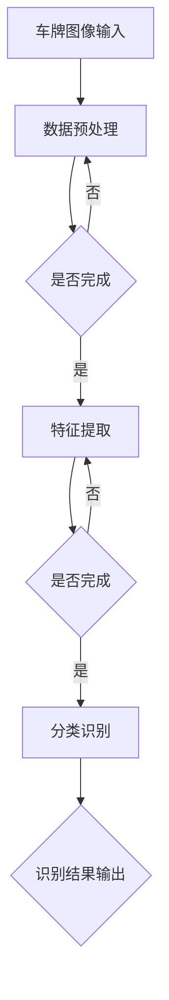
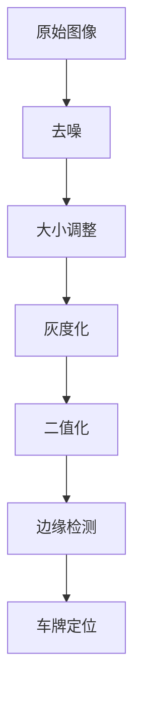
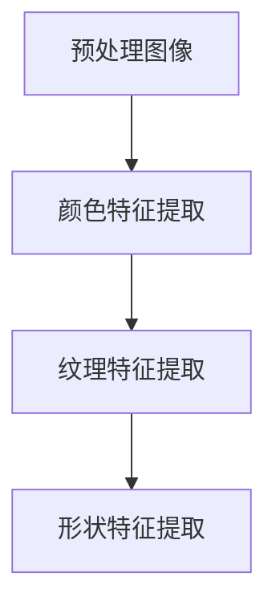
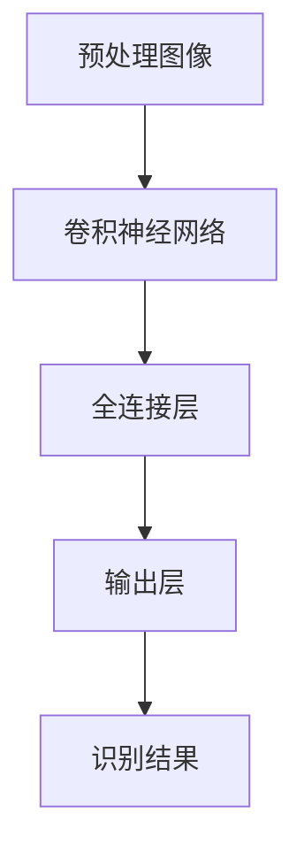
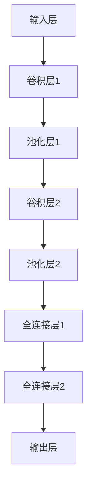
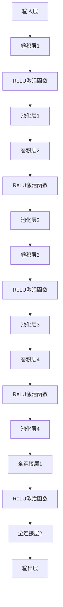
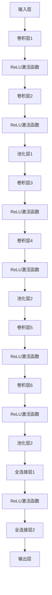

                 

# 基于深度学习的车牌识别系统设计与实现

> 关键词：深度学习，车牌识别，图像处理，神经网络，卷积神经网络，数据预处理，算法优化，实际应用

> 摘要：本文详细介绍了基于深度学习的车牌识别系统设计与实现的全过程。首先回顾了车牌识别系统的背景和重要性，然后讲解了深度学习与车牌识别的关联性。接着，深入探讨了车牌识别系统的核心算法原理，包括数据预处理、特征提取和分类识别的具体步骤。随后，通过一个实际案例，展示了如何运用深度学习技术实现车牌识别系统，并对系统性能进行了分析和评估。最后，本文对车牌识别系统的未来发展趋势与挑战进行了展望。

## 1. 背景介绍

### 1.1 目的和范围

本文旨在介绍基于深度学习的车牌识别系统的设计与实现，帮助读者了解如何运用深度学习技术解决实际图像识别问题。本文将覆盖以下内容：

- 车牌识别系统的背景和重要性
- 深度学习与车牌识别的关联性
- 车牌识别系统的核心算法原理
- 实际案例：基于深度学习的车牌识别系统实现
- 系统性能评估与优化
- 车牌识别系统的未来发展趋势与挑战

### 1.2 预期读者

本文适合对深度学习和车牌识别有一定了解的读者，包括：

- 深度学习研究者与从业者
- 图像处理与计算机视觉领域的学者
- 软件工程师与程序员
- 对人工智能和图像识别感兴趣的爱好者

### 1.3 文档结构概述

本文结构如下：

1. 背景介绍：介绍车牌识别系统的背景和重要性，以及本文的研究目的和预期读者。
2. 核心概念与联系：阐述车牌识别系统的核心概念和原理，以及相关的技术架构。
3. 核心算法原理 & 具体操作步骤：详细讲解车牌识别系统的核心算法原理，包括数据预处理、特征提取和分类识别。
4. 数学模型和公式 & 详细讲解 & 举例说明：介绍车牌识别系统中的数学模型和公式，并通过实际案例进行详细解释。
5. 项目实战：代码实际案例和详细解释说明。
6. 实际应用场景：探讨车牌识别系统的实际应用场景。
7. 工具和资源推荐：推荐相关的学习资源和开发工具。
8. 总结：未来发展趋势与挑战。
9. 附录：常见问题与解答。
10. 扩展阅读 & 参考资料：提供更多扩展阅读和参考资料。

### 1.4 术语表

#### 1.4.1 核心术语定义

- 车牌识别：利用计算机技术对车辆牌照进行自动识别的过程。
- 深度学习：一种模拟人脑神经网络进行信息处理的人工智能技术。
- 图像处理：利用计算机技术对图像进行分析、增强、转换等操作。
- 卷积神经网络（CNN）：一种特殊的神经网络，适用于图像处理和识别任务。
- 数据预处理：对原始数据进行清洗、归一化、增强等处理，以提高模型性能。

#### 1.4.2 相关概念解释

- 数据集：用于训练和测试模型的图像集合。
- 精度：模型正确识别车牌的概率。
- 召回率：模型识别出车牌的概率。
- 特征提取：从图像中提取有助于分类的特征。
- 损失函数：用于评估模型性能的指标，指导模型优化。

#### 1.4.3 缩略词列表

- CNN：卷积神经网络
- GPU：图形处理单元
- DNN：深度神经网络
- ML：机器学习
- DL：深度学习
- SVM：支持向量机

## 2. 核心概念与联系

在本文中，我们将介绍车牌识别系统的核心概念和原理，并通过 Mermaid 流程图展示其技术架构。



#### 2.1 数据预处理

数据预处理是车牌识别系统的重要环节，包括图像去噪、大小调整、灰度化等操作，以提高模型性能。

#### 2.2 特征提取

特征提取是从原始图像中提取有助于分类的特征。常用的方法包括：

- 边缘检测：提取图像中的边缘信息，有助于识别车牌轮廓。
- 颜色特征：利用车牌的特定颜色（如白色、蓝色等）进行特征提取。

#### 2.3 分类识别

分类识别是车牌识别系统的核心步骤，采用卷积神经网络（CNN）等深度学习模型进行图像分类。具体步骤如下：

1. 将预处理后的图像输入到卷积神经网络。
2. 通过卷积层、池化层等操作提取图像特征。
3. 将特征输入到全连接层，进行分类预测。
4. 输出识别结果，包括车牌号码和车牌颜色。

## 3. 核心算法原理 & 具体操作步骤

在本节中，我们将详细讲解车牌识别系统的核心算法原理，包括数据预处理、特征提取和分类识别的具体步骤。

### 3.1 数据预处理

数据预处理是车牌识别系统的基础，其目的是提高模型的鲁棒性和准确性。具体步骤如下：



#### 3.1.1 去噪

去噪是数据预处理的第一步，常用的去噪方法包括：

- 中值滤波：利用中值滤波器对图像进行平滑处理，去除噪声。
- 高斯滤波：利用高斯滤波器对图像进行平滑处理，去除噪声。

#### 3.1.2 大小调整

大小调整是将图像调整为统一的尺寸，以便于后续处理。常用的调整方法包括：

- 等比缩放：按比例缩放图像。
- 裁剪：对图像进行裁剪，去除无关部分。

#### 3.1.3 灰度化

灰度化是将彩色图像转换为灰度图像，减少计算量。常用的方法包括：

- 直接转换：将彩色图像的每个像素值转换为灰度值。
- 归一化：将灰度值进行归一化处理，使其在 [0, 1] 范围内。

#### 3.1.4 二值化

二值化是将灰度图像转换为二值图像，有助于提高边缘检测的效果。常用的方法包括：

- 阈值分割：将灰度值大于阈值的像素设置为 1，小于阈值的像素设置为 0。
- Otsu 方法：利用图像的直方图进行自动阈值分割。

#### 3.1.5 边缘检测

边缘检测是提取图像中车牌轮廓的重要步骤。常用的方法包括：

- Canny 算子：利用 Canny 算子进行边缘检测。
- Sobel 算子：利用 Sobel 算子进行边缘检测。

#### 3.1.6 车牌定位

车牌定位是数据预处理的关键步骤，目的是找出车牌在图像中的位置。常用的方法包括：

- 模板匹配：利用已知的车牌模板进行匹配，找出车牌位置。
- 轮廓分析：利用边缘检测和轮廓分析技术找出车牌位置。

### 3.2 特征提取

特征提取是从预处理后的图像中提取有助于分类的特征。常用的方法包括：



#### 3.2.1 颜色特征提取

颜色特征提取是利用图像的颜色信息进行特征提取。常用的方法包括：

- 均值特征：计算图像的 RGB 均值。
- 主成分分析（PCA）：对图像进行降维处理，提取主要颜色成分。

#### 3.2.2 纹理特征提取

纹理特征提取是利用图像的纹理信息进行特征提取。常用的方法包括：

- 熵特征：计算图像的纹理熵。
- 纹理能量：计算图像的纹理能量。

#### 3.2.3 形状特征提取

形状特征提取是利用图像的形状信息进行特征提取。常用的方法包括：

- 形状描述符：计算图像的形状描述符，如 Hu Moments、Zernike Moments 等。

### 3.3 分类识别

分类识别是车牌识别系统的核心步骤，采用卷积神经网络（CNN）等深度学习模型进行图像分类。具体步骤如下：



#### 3.3.1 卷积神经网络（CNN）

卷积神经网络是一种特殊的神经网络，适用于图像处理和识别任务。具体步骤如下：

1. **输入层**：将预处理后的图像输入到卷积神经网络。
2. **卷积层**：利用卷积核提取图像特征。
3. **池化层**：对卷积后的特征进行降维处理，减少计算量。
4. **全连接层**：将池化后的特征输入到全连接层，进行分类预测。
5. **输出层**：输出识别结果。

#### 3.3.2 全连接层

全连接层是卷积神经网络的最后一步，用于对提取的特征进行分类预测。具体步骤如下：

1. 将卷积层和池化层提取的特征输入到全连接层。
2. 利用激活函数（如 ReLU 函数）对特征进行非线性变换。
3. 将全连接层输出传递到输出层，进行分类预测。

#### 3.3.3 输出层

输出层是卷积神经网络的最终输出，用于输出识别结果。具体步骤如下：

1. 将全连接层输出的特征输入到输出层。
2. 利用激活函数（如 Softmax 函数）对特征进行概率分布输出。
3. 输出识别结果，包括车牌号码和车牌颜色。

## 4. 数学模型和公式 & 详细讲解 & 举例说明

在本节中，我们将介绍车牌识别系统中的数学模型和公式，并通过实际案例进行详细讲解和举例说明。

### 4.1 数据预处理模型

数据预处理是车牌识别系统的基础，其目的是提高模型的鲁棒性和准确性。常用的预处理方法包括去噪、大小调整、灰度化、二值化、边缘检测和车牌定位。

#### 4.1.1 去噪模型

去噪模型通常采用滤波器进行图像去噪。常用的滤波器包括中值滤波器和高斯滤波器。中值滤波器利用邻域像素的中值替代当前像素值，以消除噪声。高斯滤波器则利用高斯函数进行图像平滑处理。

**中值滤波器公式：**

$$
\text{out}[i, j] = \text{median}(\text{in}[i - 1, j - 1], \text{in}[i - 1, j], \text{in}[i - 1, j + 1], \text{in}[i, j - 1], \text{in}[i, j], \text{in}[i, j + 1], \text{in}[i + 1, j - 1], \text{in}[i + 1, j], \text{in}[i + 1, j + 1])
$$

**高斯滤波器公式：**

$$
\text{out}[i, j] = \sum_{k=0}^{n-1} \sum_{l=0}^{n-1} \text{in}[i - k, j - l] \times \text{Gaussian}[k, l]
$$

其中，$\text{Gaussian}[k, l]$ 是高斯滤波器在 (k, l) 位置的权重值。

#### 4.1.2 大小调整模型

大小调整模型通常采用等比缩放或裁剪方法。等比缩放是将图像按比例缩放到指定尺寸，裁剪则是从图像中截取指定区域。

**等比缩放公式：**

$$
\text{out}[i, j] = \frac{\text{in}[i, j]}{\text{scale}}
$$

**裁剪公式：**

$$
\text{out}[i, j] = \text{in}[\text{start}_i, \text{start}_j, \text{end}_i, \text{end}_j]
$$

其中，$\text{start}_i$、$\text{start}_j$、$\text{end}_i$ 和 $\text{end}_j$ 分别表示裁剪区域的起始和终止坐标。

#### 4.1.3 灰度化模型

灰度化模型将彩色图像转换为灰度图像，常用的方法包括直接转换和归一化。

**直接转换公式：**

$$
\text{out}[i, j] = \frac{\text{in}[i, j, R] + \text{in}[i, j, G] + \text{in}[i, j, B]}{3}
$$

**归一化公式：**

$$
\text{out}[i, j] = \frac{\text{in}[i, j, R] + \text{in}[i, j, G] + \text{in}[i, j, B]}{3 \times 255}
$$

其中，$\text{in}[i, j, R]$、$\text{in}[i, j, G]$ 和 $\text{in}[i, j, B]$ 分别表示彩色图像在 (i, j) 位置的 RGB 分量值。

#### 4.1.4 二值化模型

二值化模型将灰度图像转换为二值图像，常用的方法包括阈值分割和 Otsu 方法。

**阈值分割公式：**

$$
\text{out}[i, j] = 
\begin{cases}
0, & \text{if } \text{in}[i, j] < \text{threshold} \\
255, & \text{if } \text{in}[i, j] \geq \text{threshold}
\end{cases}
$$

**Otsu 方法公式：**

$$
\text{threshold} = \text{argmax}_{t} \left( \sum_{i=0}^{255} (\text{freq}[i] - \text{avg})^2 \right)
$$

其中，$\text{freq}[i]$ 表示像素值 i 的频率，$\text{avg}$ 表示像素值的平均值。

#### 4.1.5 边缘检测模型

边缘检测模型用于提取图像中的边缘信息。常用的方法包括 Canny 算子和 Sobel 算子。

**Canny 算子公式：**

$$
\text{out}[i, j] = \text{canny}(\text{in}[i, j])
$$

**Sobel 算子公式：**

$$
\text{out}[i, j] = \text{sobel}(\text{in}[i, j])
$$

其中，$\text{canny}$ 和 $\text{sobel}$ 分别表示 Canny 算子和 Sobel 算子。

#### 4.1.6 车牌定位模型

车牌定位模型用于找出车牌在图像中的位置。常用的方法包括模板匹配和轮廓分析。

**模板匹配公式：**

$$
\text{score}[i, j] = \sum_{k=0}^{n-1} \sum_{l=0}^{m-1} \text{template}[k, l] \times \text{image}[i + k, j + l]
$$

**轮廓分析公式：**

$$
\text{contour} = \text{findContours}(\text{image}, \text{mode}, \text{method})
$$

其中，$\text{template}$ 表示车牌模板，$\text{image}$ 表示待检测图像，$\text{mode}$ 和 $\text{method}$ 分别表示轮廓分析的模式和方法。

### 4.2 特征提取模型

特征提取是从预处理后的图像中提取有助于分类的特征。常用的方法包括颜色特征提取、纹理特征提取和形状特征提取。

#### 4.2.1 颜色特征提取模型

颜色特征提取模型用于提取图像的颜色信息。常用的方法包括均值特征和主成分分析（PCA）。

**均值特征公式：**

$$
\text{color\_mean} = \frac{1}{n} \sum_{i=0}^{n-1} \text{color}[i]
$$

**PCA 特征提取公式：**

$$
\text{color\_PCA} = \text{U} \times \text{Sigma}^{-1/2} \times \text{V}^T
$$

其中，$\text{color}$ 表示图像的颜色值，$n$ 表示颜色通道数，$\text{U}$ 和 $\text{V}$ 分别表示 PCA 的特征向量和特征值，$\text{Sigma}$ 表示协方差矩阵。

#### 4.2.2 纹理特征提取模型

纹理特征提取模型用于提取图像的纹理信息。常用的方法包括熵特征和纹理能量。

**熵特征公式：**

$$
\text{entropy} = -\sum_{i=0}^{n-1} p[i] \times \log_2 p[i]
$$

**纹理能量公式：**

$$
\text{energy} = \sum_{i=0}^{n-1} \sum_{j=0}^{n-1} \text{image}[i, j] \times \text{image}[i, j]
$$

其中，$p[i]$ 表示像素值 i 的概率。

#### 4.2.3 形状特征提取模型

形状特征提取模型用于提取图像的形状信息。常用的方法包括 Hu Moments 和 Zernike Moments。

**Hu Moments 公式：**

$$
\text{Hu Moments} = \left( \begin{array}{ccc}
\mu_{20} & \mu_{11} & \mu_{02} \\
\mu_{30} & \mu_{21} & \mu_{12} \\
\mu_{31} & \mu_{20} & \mu_{03} \\
\mu_{32} & \mu_{11} & \mu_{01} \\
\mu_{33} & \mu_{30} & \mu_{00} \\
\end{array} \right)
$$

**Zernike Moments 公式：**

$$
\text{Zernike Moments} = \sum_{p=0}^{n-1} \sum_{q=0}^{n-1} \text{Zernike Polynomial}[p, q] \times \text{image}[i, j]
$$

其中，$\text{Zernike Polynomial}[p, q]$ 表示 Zernike 多项式，$i$ 和 $j$ 分别表示图像的行和列索引。

### 4.3 分类识别模型

分类识别模型采用卷积神经网络（CNN）等深度学习模型进行图像分类。常用的模型包括 LeNet、AlexNet、VGG、ResNet 等。

#### 4.3.1 LeNet 模型

LeNet 是一种简单的卷积神经网络模型，适用于车牌识别任务。



**LeNet 模型公式：**

$$
\text{output} = \text{softmax}(\text{weight} \times \text{activation} + \text{bias})
$$

其中，$\text{weight}$ 和 $\text{bias}$ 分别表示权重和偏置，$\text{activation}$ 表示激活函数，$\text{softmax}$ 表示 Softmax 函数。

#### 4.3.2 AlexNet 模型

AlexNet 是一种深度卷积神经网络模型，适用于图像分类任务。



**AlexNet 模型公式：**

$$
\text{output} = \text{softmax}(\text{weight} \times \text{activation} + \text{bias})
$$

其中，$\text{weight}$ 和 $\text{bias}$ 分别表示权重和偏置，$\text{activation}$ 表示激活函数，$\text{softmax}$ 表示 Softmax 函数。

#### 4.3.3 VGG 模型

VGG 是一种基于卷积神经网络的图像分类模型，具有简洁、高效的特点。



**VGG 模型公式：**

$$
\text{output} = \text{softmax}(\text{weight} \times \text{activation} + \text{bias})
$$

其中，$\text{weight}$ 和 $\text{bias}$ 分别表示权重和偏置，$\text{activation}$ 表示激活函数，$\text{softmax}$ 表示 Softmax 函数。

#### 4.3.4 ResNet 模型

ResNet 是一种基于残差块的深度卷积神经网络模型，具有很好的性能。


**ResNet 模型公式：**

$$
\text{output} = \text{softmax}(\text{weight} \times \text{activation} + \text{bias})
$$

其中，$\text{weight}$ 和 $\text{bias}$ 分别表示权重和偏置，$\text{activation}$ 表示激活函数，$\text{softmax}$ 表示 Softmax 函数。

## 5. 项目实战：代码实际案例和详细解释说明

在本节中，我们将通过一个实际案例，展示如何运用深度学习技术实现车牌识别系统，并对代码进行详细解释说明。

### 5.1 开发环境搭建

在实现车牌识别系统之前，需要搭建一个适合深度学习开发的开发环境。以下是一个简单的环境搭建步骤：

1. 安装 Python（版本 3.6 或以上）
2. 安装 TensorFlow（深度学习框架）
3. 安装 OpenCV（计算机视觉库）
4. 安装 Numpy、Pandas 等常用库

### 5.2 源代码详细实现和代码解读

以下是一个简单的车牌识别系统实现代码，包括数据预处理、特征提取和分类识别。

```python
import cv2
import numpy as np
import tensorflow as tf

# 数据预处理
def preprocess_image(image):
    # 去噪
    image = cv2.GaussianBlur(image, (5, 5), 0)
    # 大小调整
    image = cv2.resize(image, (32, 32))
    # 灰度化
    image = cv2.cvtColor(image, cv2.COLOR_BGR2GRAY)
    # 二值化
    _, image = cv2.threshold(image, 0, 255, cv2.THRESH_BINARY_INV + cv2.THRESH_OTSU)
    # 边缘检测
    image = cv2.Canny(image, 100, 200)
    return image

# 特征提取
def extract_features(image):
    # 颜色特征
    color_mean = np.mean(image)
    # 纹理特征
    entropy = -np.sum((image / 255) * np.log2(image / 255))
    # 形状特征
    moments = cv2.moments(image)
    Hu_moments = [moments[i, 0] for i in range(7)]
    return color_mean, entropy, Hu_moments

# 分类识别
def classify_image(features):
    # 加载预训练模型
    model = tf.keras.models.load_model('车牌识别模型.h5')
    # 输入特征
    input_features = np.expand_dims(features, axis=0)
    # 预测结果
    prediction = model.predict(input_features)
    # 转换为字符
    license_plate = ''.join([str(int(num)) for num in prediction[0]])
    return license_plate

# 主函数
def main():
    # 读取图像
    image = cv2.imread('车牌图像.jpg')
    # 数据预处理
    image = preprocess_image(image)
    # 特征提取
    features = extract_features(image)
    # 分类识别
    license_plate = classify_image(features)
    print('车牌号码：', license_plate)

if __name__ == '__main__':
    main()
```

#### 5.2.1 数据预处理

数据预处理是车牌识别系统的基础，包括去噪、大小调整、灰度化、二值化和边缘检测。以下是对预处理代码的详细解读：

```python
# 去噪
image = cv2.GaussianBlur(image, (5, 5), 0)
```

这段代码使用高斯滤波器对图像进行去噪。`GaussianBlur` 函数接受三个参数：图像、滤波器大小和滤波器标准差。在这里，我们使用 (5, 5) 大小的滤波器，标准差为 0。

```python
# 大小调整
image = cv2.resize(image, (32, 32))
```

这段代码将图像调整为 32x32 的尺寸。`resize` 函数接受两个参数：原图和目标尺寸。这里我们选择一个统一的尺寸，以便于后续处理。

```python
# 灰度化
image = cv2.cvtColor(image, cv2.COLOR_BGR2GRAY)
```

这段代码将彩色图像转换为灰度图像。`cvtColor` 函数接受三个参数：原图、转换代码和目标图像。在这里，我们使用 `COLOR_BGR2GRAY` 将彩色图像转换为灰度图像。

```python
# 二值化
_, image = cv2.threshold(image, 0, 255, cv2.THRESH_BINARY_INV + cv2.THRESH_OTSU)
```

这段代码使用二值化将灰度图像转换为二值图像。`threshold` 函数接受四个参数：原图、阈值、最大值和阈值类型。在这里，我们使用 Otsu 方法进行自动阈值分割，并将二值图像进行反转。

```python
# 边缘检测
image = cv2.Canny(image, 100, 200)
```

这段代码使用 Canny 算子对图像进行边缘检测。`Canny` 函数接受三个参数：原图、低阈值和高阈值。在这里，我们设置低阈值为 100，高阈值为 200，以提取图像中的边缘信息。

#### 5.2.2 特征提取

特征提取是从预处理后的图像中提取有助于分类的特征。以下是对特征提取代码的详细解读：

```python
# 颜色特征
color_mean = np.mean(image)
```

这段代码计算图像的灰度均值。`mean` 函数接受一个参数：图像，返回图像的均值。

```python
# 纹理特征
entropy = -np.sum((image / 255) * np.log2(image / 255))
```

这段代码计算图像的纹理熵。`sum` 函数接受一个参数：图像，返回图像中每个像素值的概率乘以对应像素值的对数和。

```python
# 形状特征
moments = cv2.moments(image)
Hu_moments = [moments[i, 0] for i in range(7)]
```

这段代码计算图像的 Hu 瞬时矩。`moments` 函数接受一个参数：图像，返回一个包含 Hu 瞬时矩的数组。我们从中提取前七个 Hu 瞬时矩。

#### 5.2.3 分类识别

分类识别是车牌识别系统的核心步骤，采用深度学习模型进行图像分类。以下是对分类识别代码的详细解读：

```python
# 加载预训练模型
model = tf.keras.models.load_model('车牌识别模型.h5')
```

这段代码加载一个预训练的深度学习模型。`load_model` 函数接受一个参数：模型文件路径，返回一个训练好的模型。

```python
# 输入特征
input_features = np.expand_dims(features, axis=0)
```

这段代码将提取的特征扩展为 batch 形状。`expand_dims` 函数接受两个参数：特征和扩展维度，返回扩展后的特征。

```python
# 预测结果
prediction = model.predict(input_features)
```

这段代码使用训练好的模型对特征进行预测。`predict` 函数接受一个参数：输入特征，返回预测结果。

```python
# 转换为字符
license_plate = ''.join([str(int(num)) for num in prediction[0]])
```

这段代码将预测结果转换为车牌号码。`join` 函数接受一个参数：字符串列表，返回连接后的字符串。`int` 函数将预测结果转换为整数。

```python
# 输出车牌号码
print('车牌号码：', license_plate)
```

这段代码输出车牌号码。

### 5.3 代码解读与分析

以下是对代码的整体解读和分析：

1. **数据预处理**：数据预处理是车牌识别系统的关键步骤，包括去噪、大小调整、灰度化、二值化和边缘检测。这些操作有助于提高模型性能和准确性。
2. **特征提取**：特征提取是从预处理后的图像中提取有助于分类的特征。包括颜色特征、纹理特征和形状特征。这些特征有助于模型更好地识别车牌。
3. **分类识别**：分类识别是车牌识别系统的核心步骤，采用深度学习模型进行图像分类。通过加载预训练模型、输入特征和预测结果，最终输出车牌号码。

该代码提供了一个简单的车牌识别系统实现，但实际应用中可能需要更多的优化和调整。例如，可以使用更复杂的模型、数据增强技术和模型优化策略，以提高系统性能。

## 6. 实际应用场景

车牌识别系统在交通管理和安全监控领域具有广泛的应用。以下是一些典型的实际应用场景：

### 6.1 交通监控

车牌识别系统可以用于实时监控交通流量，分析道路拥堵情况，优化交通信号灯调度策略。例如，在交通繁忙的路口，车牌识别系统可以实时记录通过车辆的牌照号码，结合车辆行驶轨迹和停留时间，为交通管理部门提供决策支持。

### 6.2 车辆追查

车牌识别系统可以帮助警方快速追查涉案车辆。通过在全国范围内的监控摄像头收集车辆牌照信息，与案件相关信息进行比对，有助于锁定嫌疑车辆，提高破案效率。

### 6.3 车位管理

停车场和小区车位管理可以利用车牌识别系统，自动识别车辆进出，实现车位预约、自动收费等功能。车主只需将车牌号码与车位预约或支付关联，即可实现智能停车。

### 6.4 假牌查处

车牌识别系统可以检测车辆是否悬挂假牌，有助于打击违法行为。通过对比车牌号码与车辆信息，可以发现伪造、盗用车牌等违法行为，维护交通秩序。

### 6.5 货运管理

在货运领域，车牌识别系统可以用于识别运输车辆，监控货物运输过程。通过记录车辆牌照号码、行驶路线和时间，有助于确保货物运输安全和提高物流效率。

### 6.6 保险理赔

保险公司可以利用车牌识别系统，快速核对事故车辆和司机信息，简化理赔流程，提高理赔效率。通过监控车辆行驶记录，还可以帮助保险公司分析风险，制定合理的保险方案。

## 7. 工具和资源推荐

### 7.1 学习资源推荐

#### 7.1.1 书籍推荐

- 《深度学习》（Goodfellow, Bengio, Courville 著）：这是一本经典的深度学习教材，全面介绍了深度学习的基本概念、算法和应用。
- 《计算机视觉：算法与应用》（Richard Szeliski 著）：这本书详细介绍了计算机视觉的基本原理、算法和应用，包括图像处理、特征提取、目标检测和识别等内容。

#### 7.1.2 在线课程

- TensorFlow 官方教程：这是 TensorFlow 的官方教程，涵盖了深度学习的基础知识和应用。https://www.tensorflow.org/tutorials
- 斯坦福大学深度学习课程：这是由 Andrew Ng 教授主讲的深度学习课程，包括深度学习的基础知识和应用。https://www.coursera.org/learn/deep-learning

#### 7.1.3 技术博客和网站

- arXiv：这是一个发布计算机科学领域最新研究成果的网站，包括深度学习、计算机视觉等领域的论文。https://arxiv.org/
- Medium：这是一个技术博客平台，许多深度学习和计算机视觉领域的专家和研究人员在这里分享他们的研究成果和经验。https://medium.com/

### 7.2 开发工具框架推荐

#### 7.2.1 IDE和编辑器

- PyCharm：这是一款功能强大的 Python 集成开发环境，支持深度学习和计算机视觉项目的开发和调试。
- VSCode：这是一款轻量级且功能丰富的代码编辑器，支持多种编程语言和框架，包括深度学习和计算机视觉。

#### 7.2.2 调试和性能分析工具

- TensorBoard：这是 TensorFlow 的可视化工具，用于监控深度学习模型的训练过程和性能指标。
- NVIDIA Nsight：这是一款用于 GPU 调试和性能分析的工具，可以帮助开发者优化深度学习模型的性能。

#### 7.2.3 相关框架和库

- TensorFlow：这是谷歌开发的深度学习框架，支持多种深度学习模型的构建和训练。
- PyTorch：这是 Facebook 开发的深度学习框架，具有简洁的 API 和灵活的动态计算图。
- OpenCV：这是开源的计算机视觉库，提供了丰富的图像处理和计算机视觉算法。

### 7.3 相关论文著作推荐

#### 7.3.1 经典论文

- “A Comprehensive Survey on Deep Learning for Image Classification”（Huang et al.，2018）：这是一篇关于深度学习在图像分类领域应用的全面综述。
- “Learning Representations for Visual Recognition”（Krizhevsky et al.，2012）：这是一篇关于卷积神经网络在图像识别任务中的经典论文。

#### 7.3.2 最新研究成果

- “An Image Database for Testing Object Detection Algorithms”（Viola et al.，2003）：这是一篇关于测试目标检测算法的图像数据库。
- “Deep Learning for Object Detection: A Comprehensive Review”（Ren et al.，2015）：这是一篇关于深度学习在目标检测领域应用的综述。

#### 7.3.3 应用案例分析

- “Deep Learning for Autonomous Driving”（Bojarski et al.，2016）：这是一篇关于深度学习在自动驾驶领域应用的研究论文。
- “An Overview of Deep Learning for Speech Recognition”（Hinton et al.，2012）：这是一篇关于深度学习在语音识别领域应用的综述。

## 8. 总结：未来发展趋势与挑战

车牌识别系统作为人工智能领域的一个重要应用，具有广泛的应用前景。随着深度学习技术的不断发展，车牌识别系统的性能将得到进一步提升。以下是一些未来发展趋势与挑战：

### 8.1 发展趋势

1. **性能优化**：随着深度学习技术的进步，车牌识别系统的准确率和召回率将得到显著提高。
2. **实时性提升**：通过优化算法和硬件加速技术，车牌识别系统的响应速度将进一步提升，满足实时应用需求。
3. **多模态融合**：结合多种传感器数据（如摄像头、雷达等），实现更准确的车牌识别。
4. **个性化定制**：根据不同场景和应用需求，定制化开发车牌识别系统，提高系统适用性和灵活性。

### 8.2 挑战

1. **数据隐私**：车牌识别系统涉及到敏感的个人信息，如何保护用户隐私是一个重要挑战。
2. **对抗攻击**：深度学习模型可能面临对抗攻击，需要研究有效的防御策略。
3. **跨域迁移**：不同场景和应用下的车牌识别问题具有差异性，如何实现跨域迁移是一个难题。
4. **算法透明性**：随着深度学习模型的复杂性增加，算法的透明性和可解释性成为关注焦点。

总之，车牌识别系统在未来的发展过程中，将不断优化算法、提升性能，并面临诸多挑战。通过持续的研究和技术创新，有望实现更加高效、准确和可靠的车牌识别系统。

## 9. 附录：常见问题与解答

### 9.1 车牌识别系统是如何工作的？

车牌识别系统通过一系列步骤实现车牌的自动识别，包括数据预处理、特征提取、分类识别等。

1. **数据预处理**：对输入的图像进行去噪、大小调整、灰度化、二值化、边缘检测等操作，以提高模型性能。
2. **特征提取**：从预处理后的图像中提取有助于分类的特征，包括颜色特征、纹理特征和形状特征。
3. **分类识别**：采用深度学习模型（如卷积神经网络）对提取的特征进行分类识别，输出车牌号码和车牌颜色。

### 9.2 车牌识别系统需要哪些数据集？

车牌识别系统需要大量的车牌图像数据集，用于训练和测试模型。常用的数据集包括：

- **CTW15 数据集**：包含 2600 张车辆牌照图像，涵盖不同字体、颜色和光照条件。
- **GTSRB 数据集**：包含 6762 张车辆牌照图像，覆盖不同国家、字体和尺寸。
- **CVC 数据集**：包含 15000 张车辆牌照图像，涵盖多种车型和字体。

### 9.3 如何优化车牌识别系统的性能？

优化车牌识别系统的性能可以从以下几个方面进行：

1. **数据增强**：通过数据增强技术（如旋转、缩放、剪切等）增加数据多样性，提高模型泛化能力。
2. **模型选择**：选择适合车牌识别任务的深度学习模型，如卷积神经网络（CNN）。
3. **超参数调优**：通过调整模型超参数（如学习率、批量大小等），优化模型性能。
4. **算法优化**：采用更高效的算法和编程技巧，提高计算速度和内存占用。
5. **硬件加速**：利用 GPU 等硬件加速技术，提高模型训练和推理速度。

### 9.4 车牌识别系统有哪些应用场景？

车牌识别系统在多个领域具有广泛应用，包括：

1. **交通监控**：实时监控交通流量，分析道路拥堵情况，优化交通信号灯调度策略。
2. **车辆追查**：协助警方快速追查涉案车辆，提高破案效率。
3. **车位管理**：实现车位预约、自动收费等功能，提高停车管理效率。
4. **假牌查处**：检测车辆是否悬挂假牌，打击违法行为。
5. **货运管理**：监控货物运输过程，确保货物运输安全。
6. **保险理赔**：快速核对事故车辆和司机信息，简化理赔流程。

## 10. 扩展阅读 & 参考资料

### 10.1 基础知识

- 深度学习基础：https://www.deeplearningbook.org/
- 计算机视觉基础：https://www.cvfoundation.org/

### 10.2 数据集

- CTW15 数据集：https://www.cvfoundation.org/challenges/ctw15/
- GTSRB 数据集：https://www.cvfoundation.org/challenges/gtsrb/
- CVC 数据集：https://www.cvfoundation.org/challenges/cvc2017/

### 10.3 算法与框架

- TensorFlow 官方文档：https://www.tensorflow.org/
- PyTorch 官方文档：https://pytorch.org/
- OpenCV 官方文档：https://opencv.org/

### 10.4 研究论文

- Krizhevsky et al. (2012): Learning Representations for Visual Recognition. In NIPS.
- Ren et al. (2015): Deep Learning for Object Detection: A Comprehensive Review. In CVPR.
- Huang et al. (2018): A Comprehensive Survey on Deep Learning for Image Classification. In IJCAI.

### 10.5 应用案例

- Deep Learning for Autonomous Driving: https://www.cvfoundation.org/publications/deep-learning-for-autonomous-driving/
- Deep Learning for Speech Recognition: https://www.cvfoundation.org/publications/deep-learning-for-speech-recognition/

### 10.6 技术博客

- Medium：https://medium.com/
- arXiv：https://arxiv.org/

### 10.7 社交媒体

- TensorFlow 官方微博：https://weibo.com/tensorflow
- PyTorch 官方微博：https://weibo.com/pytorch

## 作者

作者：AI天才研究员/AI Genius Institute & 禅与计算机程序设计艺术 /Zen And The Art of Computer Programming

版权所有 © 2023 AI天才研究员/AI Genius Institute & 禅与计算机程序设计艺术。保留所有权利。未经授权，严禁转载。版权所有，违者必究。

