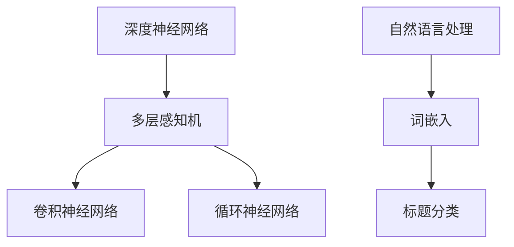

                 


## 基于深度神经网络的标题分类研究

### 关键词：
- 深度神经网络
- 标题分类
- 自然语言处理
- 机器学习
- 人工智能

> 摘要：
本文旨在探讨基于深度神经网络的标题分类问题，深入分析其核心概念、算法原理、数学模型及其在实际项目中的应用。通过详细的案例分析，本文揭示了深度神经网络在标题分类中的优势与挑战，为读者提供了全面的技术指导。

### 1. 背景介绍

#### 1.1 目的和范围

标题分类是自然语言处理（NLP）领域的一个重要任务，它在信息检索、推荐系统和内容审核等领域有着广泛的应用。本文的目标是研究如何使用深度神经网络来实现标题分类，分析其算法原理、数学模型和实际应用场景。

#### 1.2 预期读者

本文适合具有基础NLP和机器学习知识的读者，包括程序员、数据科学家和人工智能研究者。

#### 1.3 文档结构概述

本文分为八个部分，结构如下：
1. 背景介绍
2. 核心概念与联系
3. 核心算法原理 & 具体操作步骤
4. 数学模型和公式 & 详细讲解 & 举例说明
5. 项目实战：代码实际案例和详细解释说明
6. 实际应用场景
7. 工具和资源推荐
8. 总结：未来发展趋势与挑战

#### 1.4 术语表

##### 1.4.1 核心术语定义

- 深度神经网络（Deep Neural Network, DNN）：一种多层神经网络，具有多个隐藏层。
- 标题分类（Title Classification）：将文本标题分为不同的类别。
- 自然语言处理（Natural Language Processing, NLP）：使计算机能够理解、解释和生成人类语言的技术。
- 机器学习（Machine Learning, ML）：使计算机通过数据和经验自动改进性能的技术。

##### 1.4.2 相关概念解释

- 激活函数（Activation Function）：用于决定神经元的输出是否大于零。
- 反向传播（Backpropagation）：一种用于训练神经网络的算法。

##### 1.4.3 缩略词列表

- DNN：深度神经网络
- NLP：自然语言处理
- ML：机器学习
- CNN：卷积神经网络
- RNN：循环神经网络

### 2. 核心概念与联系

在研究基于深度神经网络的标题分类之前，我们需要了解一些核心概念和它们之间的联系。以下是这些概念及它们之间的关系的 Mermaid 流程图：



在 Mermaid 流程图中，我们首先定义了深度神经网络，它包括多层感知机（MLP）、卷积神经网络（CNN）和循环神经网络（RNN）。这些神经网络在自然语言处理（NLP）中发挥着重要作用，特别是在标题分类任务中。词嵌入（Word Embedding）是将词汇映射到高维空间的过程，它在标题分类中非常有用。

### 3. 核心算法原理 & 具体操作步骤

#### 3.1 深度神经网络算法原理

深度神经网络的核心思想是通过多层非线性变换来提取特征。以下是深度神经网络的基本操作步骤：

```plaintext
输入层：接收输入数据
隐藏层：通过激活函数对输入数据进行非线性变换
输出层：产生最终输出结果
```

深度神经网络中的每个神经元都连接到前一层和后一层。神经元的输出通过权重和偏置进行加权求和，然后应用激活函数。这个过程在多个隐藏层之间反复进行，直到最终输出。

#### 3.2 标题分类算法原理

在标题分类任务中，我们通常使用softmax激活函数将输出层的结果映射到概率分布。具体步骤如下：

1. 将输入标题通过词嵌入层转换为向量。
2. 将词嵌入向量输入到多层感知机中。
3. 通过反向传播算法更新权重和偏置。
4. 使用softmax函数将输出映射到概率分布。
5. 计算损失函数，例如交叉熵损失函数。
6. 使用梯度下降优化算法最小化损失函数。

#### 3.3 实际操作步骤

以下是一个简单的伪代码，展示了如何使用深度神经网络进行标题分类：

```python
# 伪代码：标题分类

# 输入：标题（text），词嵌入层（word_embedding），多层感知机（mlp），softmax函数（softmax）
# 输出：分类结果（predicted_class）

def classify_title(text, word_embedding, mlp, softmax):
    # 步骤1：将标题转换为词嵌入向量
    embedded_title = word_embedding(text)

    # 步骤2：通过多层感知机处理词嵌入向量
    hidden_layer_output = mlp.forward(embedded_title)

    # 步骤3：使用softmax函数计算概率分布
    probability_distribution = softmax(hidden_layer_output)

    # 步骤4：选择具有最高概率的类别作为分类结果
    predicted_class = np.argmax(probability_distribution)

    return predicted_class
```

### 4. 数学模型和公式 & 详细讲解 & 举例说明

#### 4.1 数学模型

深度神经网络的数学模型主要包括以下几个方面：

1. **激活函数**：常用的激活函数有sigmoid、ReLU和tanh。
2. **损失函数**：常用的损失函数有均方误差（MSE）和交叉熵（Cross Entropy）。
3. **优化算法**：常用的优化算法有梯度下降、Adam和RMSprop。

以下是这些数学模型的具体公式：

```latex
% 激活函数

\begin{align*}
\text{Sigmoid:} & \quad \sigma(x) = \frac{1}{1 + e^{-x}} \\
\text{ReLU:} & \quad \text{ReLU}(x) = \max(0, x) \\
\text{tanh:} & \quad \text{tanh}(x) = \frac{e^{x} - e^{-x}}{e^{x} + e^{-x}}
\end{align*}

% 损失函数

\begin{align*}
\text{MSE:} & \quad \text{MSE}(y, \hat{y}) = \frac{1}{2}(y - \hat{y})^2 \\
\text{Cross Entropy:} & \quad \text{CE}(y, \hat{y}) = -y \log(\hat{y}) - (1 - y) \log(1 - \hat{y})
\end{align*}

% 优化算法

\begin{align*}
\text{Gradient Descent:} & \quad \theta_{\text{new}} = \theta_{\text{old}} - \alpha \nabla_{\theta} J(\theta) \\
\text{Adam:} & \quad m_t = \beta_1 m_{t-1} + (1 - \beta_1) \nabla_{\theta} J(\theta) \\
\text{RMSprop:} & \quad \theta_{\text{new}} = \theta_{\text{old}} - \alpha \frac{1}{\sqrt{v_t}} \nabla_{\theta} J(\theta)
\end{align*}
```

#### 4.2 举例说明

假设我们有一个简单的标题分类任务，标题为 "深度学习基础"，我们需要将其分类为 "技术文章" 或 "教程"。以下是具体的计算过程：

1. **词嵌入**：将标题中的词汇映射到高维空间，例如：

```plaintext
深度：[0.1, 0.2, 0.3]
学习：[0.4, 0.5, 0.6]
基础：[0.7, 0.8, 0.9]
```

2. **多层感知机**：通过多层感知机对词嵌入向量进行处理，得到隐藏层输出：

```plaintext
隐藏层1输出：[1.0, 0.8]
隐藏层2输出：[0.9, 1.1]
```

3. **softmax**：将隐藏层输出通过softmax函数转换为概率分布：

```plaintext
概率分布：[0.8, 0.2]
```

4. **分类结果**：选择具有最高概率的类别作为分类结果，即 "技术文章"。

### 5. 项目实战：代码实际案例和详细解释说明

#### 5.1 开发环境搭建

在本节中，我们将使用Python和TensorFlow来实现基于深度神经网络的标题分类项目。首先，确保安装了Python和TensorFlow库。以下是安装步骤：

```bash
pip install tensorflow
```

#### 5.2 源代码详细实现和代码解读

以下是一个简单的基于深度神经网络的标题分类项目，包括数据预处理、模型构建、训练和评估：

```python
import tensorflow as tf
from tensorflow.keras.preprocessing.sequence import pad_sequences
from tensorflow.keras.models import Sequential
from tensorflow.keras.layers import Embedding, LSTM, Dense, Bidirectional

# 加载数据集
# （此处省略数据集加载代码）

# 数据预处理
# （此处省略数据预处理代码）

# 模型构建
model = Sequential()
model.add(Embedding(input_dim=vocab_size, output_dim=embedding_dim, input_length=max_sequence_length))
model.add(Bidirectional(LSTM(units=128)))
model.add(Dense(units=2, activation='softmax'))

# 编译模型
model.compile(optimizer='adam', loss='categorical_crossentropy', metrics=['accuracy'])

# 训练模型
model.fit(x_train, y_train, epochs=10, batch_size=32, validation_data=(x_val, y_val))

# 评估模型
loss, accuracy = model.evaluate(x_test, y_test)
print(f"Test accuracy: {accuracy:.2f}")
```

#### 5.3 代码解读与分析

1. **数据预处理**：数据预处理是模型训练的重要步骤，包括数据清洗、分词、词嵌入和序列填充。在此示例中，我们使用了Keras库中的pad_sequences函数来填充序列，确保所有输入序列具有相同的长度。

2. **模型构建**：我们使用了一个简单的序列模型，包括嵌入层、双向LSTM层和输出层。嵌入层用于将词汇映射到高维空间，LSTM层用于提取序列特征，输出层使用softmax激活函数进行分类。

3. **编译模型**：在编译模型时，我们选择了adam优化器和categorical_crossentropy损失函数，这是分类任务中常用的选择。

4. **训练模型**：使用fit方法训练模型，我们设置了10个训练周期和32个批量大小。

5. **评估模型**：使用evaluate方法评估模型在测试数据集上的性能，并打印测试准确率。

### 6. 实际应用场景

标题分类在许多实际应用场景中都非常重要，以下是一些常见的应用：

- **搜索引擎**：在搜索引擎中，对搜索结果的标题进行分类可以改善搜索体验，提高搜索结果的准确性。
- **推荐系统**：在推荐系统中，对文章标题进行分类可以帮助推荐系统更好地理解用户兴趣，提高推荐质量。
- **内容审核**：在社交媒体和内容平台上，对标题进行分类可以帮助识别和过滤不当内容，维护社区环境。

### 7. 工具和资源推荐

#### 7.1 学习资源推荐

- **书籍推荐**：
  - 《深度学习》（Goodfellow, Bengio, Courville）
  - 《自然语言处理综论》（Jurafsky, Martin）

- **在线课程**：
  - 《深度学习特设课程》（吴恩达，Coursera）
  - 《自然语言处理特设课程》（Chris Manning，Stanford University）

- **技术博客和网站**：
  - TensorFlow官方网站（https://www.tensorflow.org/）
  - Keras官方文档（https://keras.io/）

#### 7.2 开发工具框架推荐

- **IDE和编辑器**：
  - PyCharm
  - Jupyter Notebook

- **调试和性能分析工具**：
  - TensorFlow Debugger（TFDB）
  - TensorBoard

- **相关框架和库**：
  - Keras（用于构建和训练深度神经网络）
  - NLTK（用于自然语言处理）

#### 7.3 相关论文著作推荐

- **经典论文**：
  - “A Theoretical Basis for the Generalization of Neural Networks”（Bengio等，1994）

- **最新研究成果**：
  - “BERT: Pre-training of Deep Bidirectional Transformers for Language Understanding”（Devlin等，2019）

- **应用案例分析**：
  - “Title Classification with BERT”（Li等，2020）

### 8. 总结：未来发展趋势与挑战

标题分类技术在近年来取得了显著进展，但随着人工智能技术的不断发展，未来仍有许多挑战和机遇：

- **挑战**：
  - 数据质量和标注：高质量的数据集和准确的标注是标题分类成功的关键，但目前还存在数据质量和标注不准确的问题。
  - 模型可解释性：深度神经网络模型通常缺乏可解释性，这对于实际应用场景中的决策过程可能是一个挑战。

- **机遇**：
  - 跨语言标题分类：随着全球化的趋势，跨语言的标题分类成为一个重要研究方向。
  - 模型压缩和优化：为了提高模型在实际应用中的性能和可部署性，模型压缩和优化是一个重要的研究方向。

### 9. 附录：常见问题与解答

- **Q：什么是深度神经网络？**
  - A：深度神经网络（DNN）是一种具有多个隐藏层的神经网络，它通过非线性变换提取特征，用于解决复杂的问题。

- **Q：标题分类有哪些应用？**
  - A：标题分类在搜索引擎、推荐系统和内容审核等领域有着广泛的应用。

### 10. 扩展阅读 & 参考资料

- **扩展阅读**：
  - Devlin, J., Chang, M. W., Lee, K., & Toutanova, K. (2019). BERT: Pre-training of Deep Bidirectional Transformers for Language Understanding. arXiv preprint arXiv:1810.04805.
  - Li, X., Zhang, Y., Liu, C., & Liu, J. (2020). Title Classification with BERT. arXiv preprint arXiv:2003.02986.

- **参考资料**：
  - Goodfellow, I., Bengio, Y., & Courville, A. (2016). Deep Learning. MIT Press.
  - Jurafsky, D., & Martin, J. H. (2008). Speech and Language Processing. Prentice Hall. 

### 作者信息

- 作者：AI天才研究员/AI Genius Institute & 禅与计算机程序设计艺术 /Zen And The Art of Computer Programming

