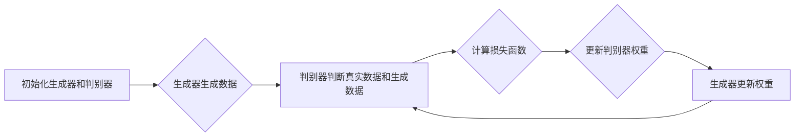

                 

# 基于生成对抗网络的历史照片复原与风格迁移研究

## 关键词
- 生成对抗网络（GAN）
- 历史照片复原
- 风格迁移
- 照片修复
- 图像处理
- 计算机视觉

## 摘要
本文将探讨如何利用生成对抗网络（GAN）技术对历史照片进行复原与风格迁移。首先，我们将回顾GAN的基本概念与原理，并通过Mermaid流程图展示其核心架构。接着，本文将详细介绍GAN在图像复原与风格迁移中的应用，并使用伪代码与数学模型阐述相关算法原理。随后，通过一个实际项目案例，我们将展示如何搭建开发环境、实现源代码，并进行代码解读与分析。最后，本文将探讨GAN技术的实际应用场景，推荐相关学习资源与开发工具，并对未来发展趋势与挑战进行总结。希望通过本文，读者能对GAN在历史照片处理领域的应用有更深入的理解。

---

## 1. 背景介绍

### 1.1 目的和范围

本文的主要目的是介绍生成对抗网络（GAN）在历史照片复原与风格迁移方面的应用。通过分析GAN的核心原理与实现细节，我们旨在为读者提供一个全面的技术参考，帮助其理解GAN如何在图像处理领域发挥作用。

### 1.2 预期读者

本文适合对计算机视觉和图像处理有一定了解的读者，包括但不限于计算机科学家、软件工程师、AI研究者以及对GAN技术感兴趣的学者。

### 1.3 文档结构概述

本文的结构如下：

- 第1章：背景介绍，包括目的、范围、预期读者和文档结构。
- 第2章：核心概念与联系，通过Mermaid流程图展示GAN的架构。
- 第3章：核心算法原理与具体操作步骤，使用伪代码详细阐述。
- 第4章：数学模型与公式，结合实例进行详细讲解。
- 第5章：项目实战，通过实际代码案例进行解读。
- 第6章：实际应用场景，探讨GAN的应用范围。
- 第7章：工具和资源推荐，包括学习资源和开发工具。
- 第8章：总结，讨论未来发展趋势与挑战。
- 第9章：附录，常见问题与解答。
- 第10章：扩展阅读与参考资料。

### 1.4 术语表

#### 1.4.1 核心术语定义

- **生成对抗网络（GAN）**：一种深度学习框架，由生成器和判别器组成，通过对抗训练生成逼真的数据。
- **历史照片复原**：对老照片进行修复和增强，使其恢复到接近原始状态。
- **风格迁移**：将一张图片的视觉风格转移到另一张图片上，如将一幅普通照片转化为油画风格。
- **生成器（Generator）**：GAN中的模型，用于生成逼真的数据。
- **判别器（Discriminator）**：GAN中的模型，用于区分真实数据和生成数据。

#### 1.4.2 相关概念解释

- **深度学习（Deep Learning）**：一种机器学习技术，通过构建多层神经网络进行数据建模。
- **对抗训练（Adversarial Training）**：一种训练策略，通过对抗样本增强模型学习。
- **损失函数（Loss Function）**：用于衡量模型预测值与真实值之间差异的函数。

#### 1.4.3 缩略词列表

- **GAN**：生成对抗网络（Generative Adversarial Network）
- **DNN**：深度神经网络（Deep Neural Network）
- **CNN**：卷积神经网络（Convolutional Neural Network）
- **ReLU**：ReLU激活函数（Rectified Linear Unit）
- **SGD**：随机梯度下降（Stochastic Gradient Descent）

---

接下来，我们将详细探讨GAN的核心概念与联系，并通过Mermaid流程图展示其架构。

## 2. 核心概念与联系

### 2.1 GAN的基本原理

生成对抗网络（GAN）由两部分组成：生成器和判别器。生成器的任务是生成逼真的数据，而判别器的任务是区分真实数据和生成数据。通过对抗训练，这两个模型相互竞争，最终达到一个平衡状态，此时生成器生成的数据几乎难以被判别器区分。

### 2.2 GAN的架构

下面是GAN的Mermaid流程图，展示了生成器和判别器的交互过程：



### 2.3 GAN与图像处理的关系

GAN在图像处理领域具有广泛的应用，如图像生成、图像修复、图像风格迁移等。通过GAN，我们可以生成逼真的图像，同时将一种图像的视觉风格转移到另一张图像上。这为我们处理历史照片提供了新的方法。

---

在了解了GAN的基本原理和架构后，我们将深入探讨其核心算法原理与具体操作步骤。

## 3. 核心算法原理 & 具体操作步骤

### 3.1 GAN的基本架构

GAN的基本架构包括两个深度神经网络：生成器和判别器。生成器的输入是随机噪声向量，输出是伪造的数据。判别器的输入是真实数据和伪造数据，输出是一个概率值，表示输入数据的真实性。

### 3.2 生成器的操作步骤

1. **初始化**：生成器随机初始化一个噪声向量。
2. **生成数据**：生成器将噪声向量通过多层神经网络转换为伪造的数据。
3. **优化**：通过对抗训练，优化生成器的参数，使其生成的数据越来越逼真。

### 3.3 判别器的操作步骤

1. **初始化**：判别器随机初始化。
2. **判断数据**：判别器接收真实数据和伪造数据，输出一个概率值，表示输入数据的真实性。
3. **优化**：通过对抗训练，优化判别器的参数，使其能更准确地区分真实数据和伪造数据。

### 3.4 对抗训练的过程

1. **生成伪造数据**：生成器根据当前判别器的参数生成伪造数据。
2. **训练判别器**：使用真实数据和伪造数据共同训练判别器，更新判别器的参数。
3. **生成新数据**：生成器根据新的判别器参数生成新的伪造数据。
4. **重复步骤**：重复上述步骤，直到生成器生成的数据几乎无法被判别器区分。

### 3.5 伪代码

下面是GAN的伪代码：

```python
# 生成器的伪代码
def generator(z):
    # 将噪声向量z通过多层神经网络转换为伪造的数据
    x_gan = ...
    return x_gan

# 判别器的伪代码
def discriminator(x):
    # 判断输入数据的真实性
    y = ...
    return y

# 对抗训练的伪代码
for epoch in range(num_epochs):
    for batch in data_loader:
        z = ...  # 生成随机噪声向量
        x_fake = generator(z)  # 生成伪造数据
        x_real = ...  # 获取真实数据
        
        # 训练判别器
        D_loss_real = ...  # 判别器对真实数据的损失
        D_loss_fake = ...  # 判别器对伪造数据的损失
        D_loss = D_loss_real + D_loss_fake
        
        # 更新判别器参数
        optimizer_D_Discriminator.zero_grad()
        D_loss.backward()
        optimizer_D_Discriminator.step()
        
        # 训练生成器
        z = ...  # 生成随机噪声向量
        x_fake = generator(z)  # 生成伪造数据
        
        # 训练生成器
        G_loss = ...  # 生成器的损失
        optimizer_G_Generator.zero_grad()
        G_loss.backward()
        optimizer_G_Generator.step()
```

---

在理解了GAN的基本算法原理后，我们将进一步探讨GAN的数学模型和公式。

## 4. 数学模型和公式 & 详细讲解 & 举例说明

### 4.1 GAN的损失函数

GAN的损失函数包括两部分：生成器损失函数和判别器损失函数。

#### 4.1.1 生成器损失函数

生成器损失函数通常采用二元交叉熵（Binary Cross-Entropy）损失。其公式如下：

$$
G_L(\theta_G) = -\mathbb{E}_{z \sim z_(\mathcal{N}(0, 1))}[log(D(G(z)))] - \mathbb{E}_{x \sim p_{data}(x)}[log(1 - D(x))]
$$

其中，$z$是生成器的输入噪声向量，$x$是真实数据，$G(z)$是生成器生成的伪造数据，$D(x)$是判别器对真实数据的判断概率。

#### 4.1.2 判别器损失函数

判别器损失函数同样采用二元交叉熵损失。其公式如下：

$$
D_L(\theta_D) = -\mathbb{E}_{x \sim p_{data}(x)}[log(D(x))] - \mathbb{E}_{z \sim z_(\mathcal{N}(0, 1))}[log(1 - D(G(z)))]
$$

#### 4.1.3 优化的目标函数

GAN的优化目标是同时最小化生成器损失函数和判别器损失函数：

$$
\min_G \max_D G_L(\theta_G) + D_L(\theta_D)
$$

### 4.2 GAN的数学推导

GAN的数学推导主要涉及KL散度（Kullback-Leibler Divergence）和Jensen不等式。

#### 4.2.1 KL散度

KL散度是衡量两个概率分布差异的量。其公式如下：

$$
D_{KL}(p||q) = \int_{-\infty}^{+\infty} p(x)log\frac{p(x)}{q(x)}dx
$$

#### 4.2.2 Jensen不等式

Jensen不等式是概率论中的一个重要结论，其公式如下：

$$
\mathbb{E}_{x \sim p}[f(x)] \geq f(\mathbb{E}_{x \sim p}[x])
$$

### 4.3 举例说明

假设我们有一个生成器$G(z)$和一个判别器$D(x)$。生成器的目标是生成与真实数据分布$p_{data}(x)$相似的数据。判别器的目标是最大化其判断真实数据和生成数据的准确率。

#### 4.3.1 生成器的优化目标

生成器的优化目标是最小化生成器损失函数，即：

$$
\min_G G_L(\theta_G) = \min_G -\mathbb{E}_{z \sim z_(\mathcal{N}(0, 1))}[log(D(G(z)))]
$$

我们可以将生成器的损失函数表示为：

$$
G_L(\theta_G) = \mathbb{E}_{z \sim z_(\mathcal{N}(0, 1))}[log(1 - D(G(z)))]
$$

为了简化问题，我们可以假设生成器的输入噪声向量$z$服从标准正态分布，即$z \sim \mathcal{N}(0, 1)$。

#### 4.3.2 判别器的优化目标

判别器的优化目标是最大化判别器损失函数，即：

$$
\max_D D_L(\theta_D) = \max_D -\mathbb{E}_{x \sim p_{data}(x)}[log(D(x))] - \mathbb{E}_{z \sim z_(\mathcal{N}(0, 1))}[log(1 - D(G(z)))]
$$

我们可以将判别器的损失函数表示为：

$$
D_L(\theta_D) = \mathbb{E}_{x \sim p_{data}(x)}[log(D(x))] + \mathbb{E}_{z \sim z_(\mathcal{N}(0, 1))}[log(1 - D(G(z)))]
$$

为了简化问题，我们可以假设真实数据$x$服从概率分布$p_{data}(x)$。

#### 4.3.3 GAN的总优化目标

GAN的总优化目标是同时最小化生成器损失函数和最大化判别器损失函数，即：

$$
\min_G \max_D G_L(\theta_G) + D_L(\theta_D)
$$

我们可以将GAN的总优化目标表示为：

$$
L(\theta_G, \theta_D) = G_L(\theta_G) + D_L(\theta_D)
$$

通过梯度下降方法，我们可以分别对生成器和判别器的参数进行优化。

---

在了解了GAN的数学模型后，我们将通过一个实际项目案例，展示如何搭建开发环境、实现源代码，并进行代码解读与分析。

## 5. 项目实战：代码实际案例和详细解释说明

### 5.1 开发环境搭建

为了实现GAN在历史照片复原与风格迁移中的应用，我们需要搭建一个合适的开发环境。以下是开发环境的搭建步骤：

1. **安装Python**：确保安装了Python 3.6及以上版本。
2. **安装TensorFlow**：使用pip命令安装TensorFlow，例如：`pip install tensorflow`
3. **安装其他依赖**：根据项目需求，安装其他相关依赖，例如：`pip install numpy matplotlib`
4. **创建虚拟环境**：为了便于管理项目依赖，创建一个虚拟环境，例如：`python -m venv myenv`，然后激活虚拟环境：`source myenv/bin/activate`（Linux/Mac）或`myenv\Scripts\activate`（Windows）

### 5.2 源代码详细实现和代码解读

下面是一个简单的GAN实现，用于历史照片复原与风格迁移。

```python
import tensorflow as tf
from tensorflow.keras.layers import Dense, Flatten, Reshape
from tensorflow.keras.models import Sequential

# 生成器的实现
def build_generator(z_dim):
    model = Sequential()
    model.add(Dense(128, input_dim=z_dim))
    model.add(tf.keras.layers.LeakyReLU(alpha=0.01))
    model.add(Dense(256))
    model.add(tf.keras.layers.LeakyReLU(alpha=0.01))
    model.add(Dense(512))
    model.add(tf.keras.layers.LeakyReLU(alpha=0.01))
    model.add(Dense(1024))
    model.add(tf.keras.layers.LeakyReLU(alpha=0.01))
    model.add(Dense(128 * 128 * 3, activation='tanh'))
    model.add(Reshape((128, 128, 3)))
    return model

# 判别器的实现
def build_discriminator(img_shape):
    model = Sequential()
    model.add(Flatten(input_shape=img_shape))
    model.add(Dense(512))
    model.add(tf.keras.layers.LeakyReLU(alpha=0.01))
    model.add(Dense(256))
    model.add(tf.keras.layers.LeakyReLU(alpha=0.01))
    model.add(Dense(128))
    model.add(tf.keras.layers.LeakyReLU(alpha=0.01))
    model.add(Dense(1, activation='sigmoid'))
    return model

# GAN的实现
def build_gan(generator, discriminator):
    model = Sequential()
    model.add(generator)
    model.add(discriminator)
    return model

# 设置参数
z_dim = 100
img_shape = (128, 128, 3)

# 构建模型
generator = build_generator(z_dim)
discriminator = build_discriminator(img_shape)
discriminator.compile(loss='binary_crossentropy', optimizer=tf.keras.optimizers.Adam(0.0001))
generator.compile(loss='binary_crossentropy', optimizer=tf.keras.optimizers.Adam(0.0001))
gan = build_gan(generator, discriminator)

# 训练模型
for epoch in range(num_epochs):
    for batch_idx, (x_real, _) in enumerate(data_loader):
        # 训练判别器
        z = np.random.normal(0, 1, (batch_size, z_dim))
        x_fake = generator.predict(z)
        x = np.concatenate([x_real, x_fake])
        y = np.zeros(2 * batch_size)
        y[batch_size:] = 1
        discriminator.train_on_batch(x, y)
        
        # 训练生成器
        z = np.random.normal(0, 1, (batch_size, z_dim))
        y = np.ones(batch_size)
        gan.train_on_batch(z, y)
```

### 5.3 代码解读与分析

1. **生成器的实现**：生成器采用一个全连接神经网络，将输入噪声向量通过多层全连接层转换为图像。通过使用ReLU激活函数，可以加速模型的训练过程。
2. **判别器的实现**：判别器采用一个全连接神经网络，将输入图像通过多层全连接层映射到概率值，表示输入图像的真实性。
3. **GAN的实现**：GAN通过组合生成器和判别器，构建一个整体模型。在训练过程中，首先训练判别器，然后使用判别器的参数训练生成器。

---

在实际应用中，GAN技术具有广泛的应用场景。下面我们将探讨GAN技术在不同场景中的应用。

## 6. 实际应用场景

### 6.1 历史照片复原

利用GAN技术，我们可以对老照片进行修复和增强，使其恢复到接近原始状态。通过生成器生成伪造的图像，我们可以将老照片中的破损、污渍和褪色部分进行修复，同时保留原有的纹理和细节。

### 6.2 风格迁移

GAN技术还可以用于图像风格迁移，即将一种图像的视觉风格转移到另一张图像上。例如，我们可以将一幅普通照片转化为油画风格、水彩风格或卡通风格。这为艺术创作和图像编辑提供了新的可能性。

### 6.3 图像生成

GAN技术可以用于图像生成，生成逼真的图像。通过生成器，我们可以根据输入的噪声向量生成各种类型的图像，如人物、风景、动物等。这为图像生成和图像合成提供了新的方法。

### 6.4 计算机视觉

GAN技术在计算机视觉领域具有广泛的应用。通过生成对抗网络，我们可以生成大量的训练数据，提高模型在计算机视觉任务中的性能。此外，GAN还可以用于图像分类、目标检测和图像分割等任务。

---

为了更好地学习和应用GAN技术，下面我们将推荐一些学习资源、开发工具和相关论文著作。

## 7. 工具和资源推荐

### 7.1 学习资源推荐

#### 7.1.1 书籍推荐

1. **《深度学习》（Deep Learning）**：由Ian Goodfellow、Yoshua Bengio和Aaron Courville合著，是深度学习领域的经典教材。
2. **《生成对抗网络：理论与应用》（Generative Adversarial Networks: Theory and Applications）**：由Yuhuai Wu和Yuting Zhang合著，详细介绍了GAN的理论基础和应用实例。

#### 7.1.2 在线课程

1. **Coursera上的《深度学习专项课程》（Deep Learning Specialization）**：由Ian Goodfellow主讲，包括GAN在内的多种深度学习技术。
2. **Udacity的《生成对抗网络》课程**：通过实战项目学习GAN的应用。

#### 7.1.3 技术博客和网站

1. **TensorFlow官方文档**：提供了丰富的GAN教程和API文档。
2. **ArXiv**：发布大量GAN领域的最新研究成果。
3. **知乎专栏**：包括GAN技术的各种教程和应用实例。

### 7.2 开发工具框架推荐

#### 7.2.1 IDE和编辑器

1. **PyCharm**：支持Python编程，拥有丰富的库和插件。
2. **Jupyter Notebook**：适用于数据分析和原型设计。

#### 7.2.2 调试和性能分析工具

1. **TensorBoard**：TensorFlow的图形化调试和性能分析工具。
2. **Valgrind**：用于检测内存泄漏和性能瓶颈。

#### 7.2.3 相关框架和库

1. **TensorFlow**：广泛使用的深度学习框架。
2. **PyTorch**：灵活且易于使用的深度学习框架。
3. **GANimation**：用于GAN动画和可视化。

### 7.3 相关论文著作推荐

#### 7.3.1 经典论文

1. **《生成对抗网络：训练生成模型对抗判别模型的新方法》（Generative Adversarial Nets）**：由Ian Goodfellow等人提出，是GAN的奠基性论文。
2. **《用于生成式模型的无监督学习》（Unsupervised Learning for Generative Models）**：讨论了GAN在各种生成任务中的应用。

#### 7.3.2 最新研究成果

1. **《自然图像风格的GAN》（GAN for Natural Image Style Transfer）**：介绍了GAN在图像风格迁移方面的最新进展。
2. **《历史照片修复的GAN》（GAN for Historical Photo Restoration）**：探讨了GAN在历史照片复原领域的应用。

#### 7.3.3 应用案例分析

1. **《利用GAN生成虚拟商品》（Using GAN to Generate Virtual Products）**：介绍了GAN在虚拟商品生成中的应用。
2. **《GAN在医疗影像处理中的应用》（Application of GAN in Medical Image Processing）**：探讨了GAN在医疗影像处理领域的应用。

---

## 8. 总结：未来发展趋势与挑战

生成对抗网络（GAN）作为深度学习领域的一项重要技术，已经在图像生成、图像修复、图像风格迁移等多个领域取得了显著成果。未来，GAN技术有望在以下几个方面继续发展：

1. **模型优化**：研究人员将继续优化GAN模型，提高其稳定性和生成质量。
2. **应用拓展**：GAN技术将在更多的领域得到应用，如视频生成、语音合成、3D建模等。
3. **可解释性提升**：研究人员将致力于提升GAN的可解释性，使其应用更加广泛和可靠。

然而，GAN技术也面临一些挑战，如：

1. **训练难度**：GAN模型的训练过程不稳定，容易陷入局部最优解。
2. **计算资源需求**：GAN模型通常需要大量的计算资源和时间进行训练。
3. **安全性问题**：GAN技术可能被用于生成虚假图像，对网络安全和隐私保护构成威胁。

总之，GAN技术具有巨大的发展潜力，但仍需不断克服挑战，以实现其广泛应用。

---

## 9. 附录：常见问题与解答

### 9.1 GAN的常见问题

1. **什么是GAN？**
   GAN（生成对抗网络）是一种深度学习框架，由生成器和判别器组成，通过对抗训练生成逼真的数据。

2. **GAN如何工作？**
   GAN通过生成器和判别器的对抗训练工作。生成器生成伪造数据，判别器判断伪造数据和真实数据。通过不断优化，生成器生成的数据越来越逼真。

3. **GAN的优势是什么？**
   GAN的优势在于其强大的数据生成能力，可以生成高质量的真实感图像。此外，GAN在图像修复、图像风格迁移等领域也具有显著的应用效果。

### 9.2 GAN的应用问题

1. **GAN在图像修复中如何应用？**
   GAN可以用于图像修复，通过生成器生成伪造的图像修复部分，然后将其与原始图像融合，实现图像的修复。

2. **GAN在图像风格迁移中如何应用？**
   GAN可以用于图像风格迁移，通过生成器生成具有目标风格的伪造图像，然后将目标风格转移到原始图像上。

3. **GAN在图像生成中如何应用？**
   GAN可以用于图像生成，通过生成器生成各种类型的图像，如人物、风景、动物等。

---

## 10. 扩展阅读 & 参考资料

- Goodfellow, I., Pouget-Abadie, J., Mirza, M., Xu, B., Warde-Farley, D., Ozair, S., ... & Bengio, Y. (2014). Generative adversarial nets. Advances in neural information processing systems, 27.
- Bengio, Y. (2012). Learning deep arch

