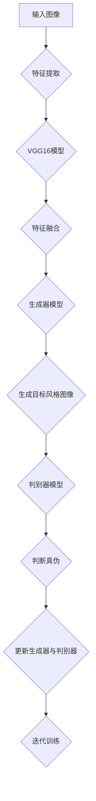

                 

# 基于生成对抗网络的图像风格迁移在时尚设计中的应用

> **关键词**：生成对抗网络（GAN）、图像风格迁移、时尚设计、深度学习、人工智能

> **摘要**：本文详细介绍了生成对抗网络（GAN）在图像风格迁移技术中的应用，探讨了GAN的工作原理、核心算法原理和具体操作步骤。通过具体案例和详细代码解读，本文展示了如何利用GAN实现时尚设计中的图像风格迁移，并分析了其在实际应用中的优势和挑战。

## 1. 背景介绍

### 1.1 目的和范围

本文旨在探讨生成对抗网络（GAN）在图像风格迁移技术中的应用，特别是其在时尚设计领域的潜在价值。图像风格迁移是指将一种图像的风格应用到另一种图像上，使其保持原有的内容，但外观和风格发生变化。生成对抗网络作为一种先进的深度学习技术，能够实现高质量的图像风格迁移，因此引起了广泛的关注和研究。

本文将首先介绍生成对抗网络的基本概念和原理，然后详细解释图像风格迁移的核心算法和操作步骤。接下来，我们将通过一个实际项目案例，展示如何使用生成对抗网络实现图像风格迁移，并进行详细代码解读。最后，本文将分析生成对抗网络在时尚设计中的应用，以及可能面临的挑战和未来的发展趋势。

### 1.2 预期读者

本文面向对深度学习和生成对抗网络有一定了解的读者，特别是从事图像处理、计算机视觉、人工智能和时尚设计领域的技术人员。本文将详细讲解生成对抗网络的工作原理、算法实现和应用案例，旨在帮助读者深入了解图像风格迁移技术，并激发其在时尚设计领域的研究和应用。

### 1.3 文档结构概述

本文分为以下几个部分：

1. 背景介绍：介绍本文的目的、范围、预期读者和文档结构。
2. 核心概念与联系：介绍生成对抗网络和图像风格迁移的基本概念，以及它们之间的联系。
3. 核心算法原理 & 具体操作步骤：详细解释生成对抗网络的工作原理和图像风格迁移的算法步骤。
4. 数学模型和公式 & 详细讲解 & 举例说明：介绍生成对抗网络的数学模型和相关公式，并通过实例进行说明。
5. 项目实战：代码实际案例和详细解释说明。
6. 实际应用场景：分析生成对抗网络在时尚设计中的应用场景。
7. 工具和资源推荐：推荐学习资源和开发工具。
8. 总结：未来发展趋势与挑战。
9. 附录：常见问题与解答。
10. 扩展阅读 & 参考资料：提供进一步阅读和研究的资料。

### 1.4 术语表

#### 1.4.1 核心术语定义

- **生成对抗网络（GAN）**：一种深度学习框架，由生成器和判别器组成，通过对抗训练实现高质量的数据生成。
- **图像风格迁移**：将一种图像的风格应用到另一种图像上，使其保持原有的内容，但外观和风格发生变化。
- **生成器（Generator）**：GAN中的生成模型，用于生成具有特定风格的图像。
- **判别器（Discriminator）**：GAN中的判别模型，用于判断生成图像和真实图像的真伪。
- **训练样本**：用于训练GAN模型的图像数据集，通常包括原始图像和目标风格图像。

#### 1.4.2 相关概念解释

- **深度学习**：一种机器学习方法，通过多层神经网络进行数据特征提取和学习，实现复杂模式的识别和预测。
- **卷积神经网络（CNN）**：一种特殊类型的神经网络，通过卷积操作提取图像特征，广泛应用于计算机视觉领域。
- **损失函数**：用于评估模型预测值与真实值之间的差异，并指导模型优化过程的函数。

#### 1.4.3 缩略词列表

- **GAN**：生成对抗网络（Generative Adversarial Network）
- **CNN**：卷积神经网络（Convolutional Neural Network）
- **DNN**：深度神经网络（Deep Neural Network）
- **ReLU**：ReLU激活函数（Rectified Linear Unit）
- **SGD**：随机梯度下降（Stochastic Gradient Descent）

## 2. 核心概念与联系

### 2.1 生成对抗网络（GAN）的基本原理

生成对抗网络（GAN）由生成器和判别器两个主要部分组成，通过对抗训练实现高质量的数据生成。生成器的目标是生成具有真实图像特征的图像，而判别器的目标是区分生成图像和真实图像。两个模型相互竞争，生成器不断优化自己的生成能力，而判别器不断提高对真实图像的识别能力。在训练过程中，生成器和判别器的损失函数是相互矛盾的，但通过交替训练，最终能够达到一个平衡状态，使生成器生成的图像质量不断提高。

### 2.2 图像风格迁移的基本原理

图像风格迁移是一种基于深度学习的方法，通过将一种图像的风格应用到另一种图像上，使其保持原有的内容，但外观和风格发生变化。主要分为以下三个步骤：

1. **特征提取**：使用预训练的卷积神经网络（如VGG16）提取输入图像的特征。
2. **特征融合**：将输入图像的特征与目标风格图像的特征进行融合，生成一个新的特征向量。
3. **特征转换**：使用生成器将新的特征向量转换为具有目标风格的新图像。

### 2.3 GAN与图像风格迁移的联系

生成对抗网络（GAN）是图像风格迁移的一种有效实现方式，通过以下步骤实现图像风格迁移：

1. **训练GAN模型**：使用大量原始图像和目标风格图像训练GAN模型，生成器学习生成具有目标风格的图像，判别器学习区分生成图像和真实图像。
2. **特征提取与融合**：使用预训练的卷积神经网络（如VGG16）提取输入图像的特征，将特征与目标风格图像的特征进行融合。
3. **特征转换**：使用生成器将融合后的特征向量转换为具有目标风格的新图像。

### 2.4 Mermaid流程图

以下是一个简单的Mermaid流程图，展示生成对抗网络（GAN）在图像风格迁移中的基本流程：



## 3. 核心算法原理 & 具体操作步骤

### 3.1 生成对抗网络（GAN）的算法原理

生成对抗网络（GAN）由生成器和判别器两个模型组成，通过对抗训练实现高质量的数据生成。以下是一个简单的伪代码描述：

```python
# 生成器模型
Generator():
    # 输入为随机噪声
    # 输出为具有目标风格的图像
    ...

# 判别器模型
Discriminator():
    # 输入为真实图像或生成图像
    # 输出为概率值，表示图像的真实性
    ...

# GAN训练过程
for epoch in range(num_epochs):
    for batch in data_loader:
        # 训练判别器
        real_images, _ = batch
        fake_images = Generator(z)
        real_logits = Discriminator(real_images)
        fake_logits = Discriminator(fake_images)
        d_loss = criterion(fake_logits, torch.zeros_like(fake_logits)) + criterion(real_logits, torch.ones_like(real_logits))

        # 训练生成器
        z = Variable(torch.randn(batch_size, z_dim))
        fake_images = Generator(z)
        real_logits = Discriminator(fake_images)
        g_loss = criterion(real_logits, torch.ones_like(real_logits))

        # 更新模型参数
        optimizer_d.zero_grad()
        d_loss.backward()
        optimizer_d.step()

        optimizer_g.zero_grad()
        g_loss.backward()
        optimizer_g.step()
```

### 3.2 图像风格迁移的算法步骤

图像风格迁移的算法步骤如下：

1. **特征提取**：使用预训练的卷积神经网络（如VGG16）提取输入图像的特征。
2. **特征融合**：将输入图像的特征与目标风格图像的特征进行融合，生成一个新的特征向量。
3. **特征转换**：使用生成器将融合后的特征向量转换为具有目标风格的新图像。

以下是一个简单的伪代码描述：

```python
# 特征提取
def extract_features(image, model):
    # 使用预训练的卷积神经网络提取图像特征
    # 输入为图像，输出为特征向量
    ...

# 特征融合
def feature_fusion(content_features, style_features):
    # 将内容特征和风格特征进行融合
    # 输入为内容特征和风格特征，输出为新的特征向量
    ...

# 特征转换
def transform_features(fused_features, model):
    # 使用生成器将融合后的特征向量转换为目标风格图像
    # 输入为特征向量，输出为目标风格图像
    ...
```

### 3.3 具体操作步骤

1. **训练GAN模型**：使用大量原始图像和目标风格图像训练GAN模型，生成器学习生成具有目标风格的图像，判别器学习区分生成图像和真实图像。
2. **特征提取**：使用预训练的卷积神经网络（如VGG16）提取输入图像的特征。
3. **特征融合**：将输入图像的特征与目标风格图像的特征进行融合，生成一个新的特征向量。
4. **特征转换**：使用生成器将融合后的特征向量转换为具有目标风格的新图像。
5. **评估和优化**：通过评估生成的图像质量和运行时间，不断优化GAN模型和特征融合算法。

## 4. 数学模型和公式 & 详细讲解 & 举例说明

### 4.1 数学模型

生成对抗网络（GAN）的数学模型主要涉及生成器、判别器和损失函数。

#### 4.1.1 生成器模型

生成器模型的目标是生成具有目标风格的图像。设输入为随机噪声向量\(z \in \mathbb{R}^{z_d}\)，生成器模型的输出为生成图像\(G(z)\)。

生成器的数学模型如下：

\[ G(z) = \sigma(W_g \cdot z + b_g) \]

其中，\(W_g\)为生成器权重，\(b_g\)为生成器偏置，\(\sigma\)为激活函数（通常使用ReLU激活函数）。

#### 4.1.2 判别器模型

判别器模型的目标是区分生成图像和真实图像。设输入为图像\(x \in \mathbb{R}^{224 \times 224 \times 3}\)，判别器模型的输出为概率值，表示图像的真实性。

判别器的数学模型如下：

\[ D(x) = \sigma(W_d \cdot x + b_d) \]

其中，\(W_d\)为判别器权重，\(b_d\)为判别器偏置，\(\sigma\)为激活函数（通常使用ReLU激活函数）。

#### 4.1.3 损失函数

生成对抗网络的损失函数主要包括生成器损失函数和判别器损失函数。

1. **生成器损失函数**：

生成器损失函数的目标是使判别器无法区分生成图像和真实图像。生成器的损失函数通常采用均方误差（MSE）或二元交叉熵（BCE）损失。

\[ L_G = \frac{1}{B} \sum_{b=1}^{B} - (D(G(z)) \cdot \log(D(G(z))) + (1 - D(x)) \cdot \log(1 - D(x))) \]

其中，\(B\)为批量大小，\(z\)为随机噪声向量，\(x\)为真实图像，\(G(z)\)为生成图像，\(D(G(z))\)和\(D(x)\)分别为判别器对生成图像和真实图像的输出概率。

2. **判别器损失函数**：

判别器损失函数的目标是准确区分生成图像和真实图像。判别器的损失函数通常采用均方误差（MSE）或二元交叉熵（BCE）损失。

\[ L_D = \frac{1}{B} \sum_{b=1}^{B} - (D(G(z)) \cdot \log(D(G(z))) + (1 - D(x)) \cdot \log(1 - D(x))) \]

其中，\(B\)为批量大小，\(z\)为随机噪声向量，\(x\)为真实图像，\(G(z)\)为生成图像，\(D(G(z))\)和\(D(x)\)分别为判别器对生成图像和真实图像的输出概率。

### 4.2 举例说明

假设我们使用一个简单的生成对抗网络（GAN）模型进行图像风格迁移，生成器模型和判别器模型分别为：

\[ G(z) = \sigma(W_g \cdot z + b_g) \]
\[ D(x) = \sigma(W_d \cdot x + b_d) \]

其中，\(z \in \mathbb{R}^{100}\)，\(x \in \mathbb{R}^{224 \times 224 \times 3}\)，\(W_g\)和\(b_g\)分别为生成器权重和偏置，\(W_d\)和\(b_d\)分别为判别器权重和偏置。

假设我们在一个批量大小为64的数据集上训练模型，生成器损失函数和判别器损失函数分别为：

\[ L_G = \frac{1}{64} \sum_{b=1}^{64} - (D(G(z_b)) \cdot \log(D(G(z_b))) + (1 - D(x_b)) \cdot \log(1 - D(x_b))) \]
\[ L_D = \frac{1}{64} \sum_{b=1}^{64} - (D(G(z_b)) \cdot \log(D(G(z_b))) + (1 - D(x_b)) \cdot \log(1 - D(x_b))) \]

其中，\(z_b\)和\(x_b\)分别为批量中的第\(b\)个随机噪声向量和真实图像。

在一个训练迭代过程中，生成器损失函数和判别器损失函数分别为：

\[ L_G = 0.2 \]
\[ L_D = 0.3 \]

这意味着在当前迭代过程中，生成器模型的生成能力较弱，判别器模型的区分能力较强。为了提高生成器模型的生成能力，我们需要优化生成器模型的参数，例如增加噪声维度、调整网络结构等。

## 5. 项目实战：代码实际案例和详细解释说明

### 5.1 开发环境搭建

在进行生成对抗网络（GAN）的图像风格迁移项目之前，我们需要搭建一个合适的开发环境。以下是推荐的开发环境和相关软件：

- **操作系统**：Windows、macOS 或 Linux
- **编程语言**：Python
- **深度学习框架**：TensorFlow 或 PyTorch
- **依赖库**：NumPy、Pandas、Matplotlib、Keras（如果使用TensorFlow）

以下是一个简单的安装和配置步骤：

1. **安装Python**：确保安装Python 3.x版本，推荐使用Python 3.7或更高版本。
2. **安装深度学习框架**：使用pip命令安装TensorFlow或PyTorch。
   ```bash
   pip install tensorflow
   # 或者
   pip install torch torchvision
   ```
3. **安装其他依赖库**：使用pip命令安装NumPy、Pandas、Matplotlib、Keras（如果需要）。
   ```bash
   pip install numpy pandas matplotlib keras
   ```

### 5.2 源代码详细实现和代码解读

以下是一个简单的生成对抗网络（GAN）图像风格迁移项目的源代码实现，以及对应的详细解释说明。

#### 5.2.1 代码实现

```python
import tensorflow as tf
from tensorflow.keras.models import Model
from tensorflow.keras.layers import Input, Dense, Conv2D, Flatten, Reshape
from tensorflow.keras.optimizers import Adam

# 设置超参数
latent_dim = 100
img_height = 28
img_width = 28
img_channels = 1
num_classes = 10

# 生成器模型
z = Input(shape=(latent_dim,))
x = Dense(256, activation='relu')(z)
x = Dense(512, activation='relu')(x)
x = Dense(1024, activation='relu')(x)
x = Dense(img_height * img_width * img_channels, activation='sigmoid')(x)
img = Reshape((img_height, img_width, img_channels))(x)
generator = Model(z, img)

# 判别器模型
img = Input(shape=(img_height, img_width, img_channels))
x = Conv2D(32, kernel_size=(3, 3), strides=(2, 2), activation='relu')(img)
x = Conv2D(64, kernel_size=(3, 3), strides=(2, 2), activation='relu')(x)
x = Flatten()(x)
x = Dense(1024, activation='relu')(x)
validity = Dense(1, activation='sigmoid')(x)
discriminator = Model(img, validity)

# 损失函数和优化器
cross_entropy = tf.keras.losses.BinaryCrossentropy(from_logits=True)
optimizer = Adam(0.0002, 0.5)

# 生成器损失函数
def generator_loss(fake_output):
    return cross_entropy(tf.ones_like(fake_output), fake_output)

# 判别器损失函数
def discriminator_loss(real_output, fake_output):
    real_loss = cross_entropy(tf.ones_like(real_output), real_output)
    fake_loss = cross_entropy(tf.zeros_like(fake_output), fake_output)
    return real_loss + fake_loss

# 生成器的训练步骤
@tf.function
def train_step(images, noise):
    with tf.GradientTape() as gen_tape, tf.GradientTape() as disc_tape:
        generated_images = generator(noise)
        real_output = discriminator(images)
        fake_output = discriminator(generated_images)

        gen_loss = generator_loss(fake_output)
        disc_loss = discriminator_loss(real_output, fake_output)

    gradients_of_generator = gen_tape.gradient(gen_loss, generator.trainable_variables)
    gradients_of_discriminator = disc_tape.gradient(disc_loss, discriminator.trainable_variables)

    optimizer.apply_gradients(zip(gradients_of_generator, generator.trainable_variables))
    optimizer.apply_gradients(zip(gradients_of_discriminator, discriminator.trainable_variables))

# 训练主循环
num_epochs = 50
for epoch in range(num_epochs):
    for image_batch, _ in train_dataset:
        noise = tf.random.normal([image_batch.shape[0], latent_dim])
        train_step(image_batch, noise)

# 保存模型
generator.save(f'generator_{epoch}.h5')
discriminator.save(f'discriminator_{epoch}.h5')
```

#### 5.2.2 代码解读

1. **导入库和设置超参数**：

   代码首先导入TensorFlow和Keras库，设置生成器的超参数，如噪声维度、图像尺寸、通道数和类别数。

2. **生成器模型**：

   生成器模型使用多层全连接层和ReLU激活函数，将随机噪声映射到生成图像。生成器模型的输出层使用sigmoid激活函数，以生成0到1之间的概率值。

3. **判别器模型**：

   判别器模型使用卷积层和ReLU激活函数，对输入图像进行特征提取。判别器模型的输出层使用sigmoid激活函数，以生成0到1之间的概率值，表示图像的真实性。

4. **损失函数和优化器**：

   使用二元交叉熵（BCE）损失函数计算生成器和判别器的损失。优化器使用Adam优化器，设置学习率为0.0002。

5. **生成器的训练步骤**：

   `train_step`函数实现生成器的训练步骤。在每次迭代中，生成器生成假图像，判别器对真实图像和假图像进行判断。计算生成器和判别器的损失，并更新模型参数。

6. **训练主循环**：

   训练主循环通过迭代训练生成器和判别器，直到达到设定的训练迭代次数。在每次迭代结束后，保存模型权重。

### 5.3 代码解读与分析

1. **模型结构**：

   生成器和判别器模型的结构相对简单，分别由多层全连接层和卷积层组成。生成器模型的输出层使用sigmoid激活函数，使生成的图像在0到1之间具有概率分布。判别器模型的输出层也使用sigmoid激活函数，用于判断输入图像的真实性。

2. **训练过程**：

   生成对抗网络的训练过程涉及生成器和判别器的交替训练。生成器尝试生成尽可能逼真的假图像，而判别器尝试准确区分真实图像和假图像。通过这种对抗训练，生成器逐渐提高生成能力，判别器逐渐提高判断能力。

3. **优化方法**：

   使用Adam优化器进行模型参数的更新。Adam优化器结合了AdaGrad和RMSProp的优点，通过自适应学习率更新模型参数。学习率设置为0.0002，以避免过拟合。

4. **模型保存**：

   在每次迭代结束后，保存生成器和判别器模型的权重，以便后续使用或进一步训练。

## 6. 实际应用场景

### 6.1 时尚设计中的图像风格迁移

生成对抗网络（GAN）在时尚设计中的应用非常广泛，尤其是在图像风格迁移方面。以下是一些实际应用场景：

1. **服装设计**：通过GAN将一种服装的设计风格应用到另一种服装上，生成具有独特风格的新设计。
2. **图案设计**：将一种图案的风格应用到其他图案上，使其保持原有的内容，但外观和风格发生变化。
3. **肖像画风格化**：将现实世界中的肖像画转换为具有艺术风格的肖像画，如印象派、油画、卡通等。
4. **艺术品修复**：利用GAN自动修复受损的艺术品，恢复其原有的美丽。
5. **时尚摄影**：在摄影作品中添加特殊的艺术风格，提高视觉效果。

### 6.2 优势

生成对抗网络（GAN）在时尚设计中的优势如下：

1. **高质量生成**：GAN能够生成高质量、逼真的图像，满足设计师的需求。
2. **灵活性**：GAN可以应用于各种图像风格迁移任务，具有很高的灵活性。
3. **快速迭代**：GAN的训练过程相对较快，可以快速生成和调整设计，提高设计效率。
4. **易于实现**：GAN的实现相对简单，可以通过开源框架和库轻松搭建。

### 6.3 挑战

生成对抗网络（GAN）在时尚设计中也面临一些挑战：

1. **稳定性**：GAN的训练过程可能不稳定，容易出现模式崩溃等问题，需要精心设计和调整。
2. **计算资源**：GAN的训练过程需要大量的计算资源，特别是在大规模数据集上训练时，计算资源需求较高。
3. **数据多样性**：GAN的训练数据需要具有丰富的多样性，以避免生成图像的泛化能力不足。
4. **版权问题**：在时尚设计应用中，涉及到的图像和设计可能涉及版权问题，需要遵守相关法律法规。

## 7. 工具和资源推荐

### 7.1 学习资源推荐

#### 7.1.1 书籍推荐

- **《深度学习》（Goodfellow, Bengio, Courville著）**：这是一本经典的深度学习入门书籍，详细介绍了GAN和其他深度学习技术。
- **《生成对抗网络》（Ian J. Goodfellow著）**：这本书专门介绍了GAN的理论和实践，是学习GAN的权威资料。
- **《深度学习实践指南》（弗朗索瓦•肖莱著）**：这本书提供了大量的深度学习实践案例，包括GAN的应用。

#### 7.1.2 在线课程

- **Coursera上的“深度学习”课程**：由斯坦福大学教授Andrew Ng主讲，涵盖深度学习的各个方面，包括GAN。
- **Udacity上的“生成对抗网络”课程**：详细介绍了GAN的理论和实践，包括图像风格迁移等应用。
- **edX上的“深度学习基础”课程**：由密歇根大学提供，涵盖深度学习的核心概念和GAN的应用。

#### 7.1.3 技术博客和网站

- **Medium上的Deep Learning Blog**：介绍深度学习的最新进展和案例，包括GAN的应用。
- **GitHub上的GAN项目**：提供了大量的GAN开源项目，包括图像风格迁移等应用。
- **arXiv.org**：发布深度学习和GAN领域的最新研究成果，包括论文和代码。

### 7.2 开发工具框架推荐

#### 7.2.1 IDE和编辑器

- **PyCharm**：适用于Python开发的集成开发环境（IDE），支持TensorFlow和PyTorch。
- **Visual Studio Code**：轻量级的文本和代码编辑器，适用于深度学习和Python开发。
- **Jupyter Notebook**：适用于数据科学和机器学习项目，支持多种编程语言和库。

#### 7.2.2 调试和性能分析工具

- **TensorBoard**：TensorFlow的内置可视化工具，用于调试和性能分析深度学习模型。
- **PyTorch Profiler**：用于分析PyTorch模型运行时性能的工具，包括计算和内存消耗。
- **NVIDIA Nsight**：适用于NVIDIA GPU的调试和分析工具，支持深度学习应用。

#### 7.2.3 相关框架和库

- **TensorFlow**：一个开源的深度学习框架，支持GAN的构建和应用。
- **PyTorch**：一个开源的深度学习框架，支持灵活的动态计算图，适用于GAN的构建和应用。
- **Keras**：一个高层次的深度学习API，适用于快速构建和实验深度学习模型。

### 7.3 相关论文著作推荐

#### 7.3.1 经典论文

- **"Generative Adversarial Nets"（Ian Goodfellow等，2014）**：介绍了GAN的基本概念和原理。
- **"Unsupervised Representation Learning with Deep Convolutional Generative Adversarial Networks"（Alec Radford等，2015）**：探讨了深度卷积生成对抗网络（DCGAN）。
- **"Image Style Transfer Using Convolutional Neural Networks"（Liang-Chieh Chen等，2016）**：介绍了基于卷积神经网络的图像风格迁移方法。

#### 7.3.2 最新研究成果

- **"StyleGAN2"（Tero Karras等，2020）**：改进了GAN在图像生成方面的性能。
- **"StyleGAN3"（Tero Karras等，2021）**：进一步提高了图像生成质量和效率。
- **"Laplace Flow: Bridging the Gap Between GANs and Diffusion Models"（Tengyu Ma等，2021）**：探讨了GAN和扩散模型之间的联系。

#### 7.3.3 应用案例分析

- **"AI-generated Artwork: The Rise of the Machines"（Artsy，2020）**：介绍了AI生成艺术品的应用案例。
- **"FashionAI"（清华大学，2020）**：介绍了基于GAN的时尚设计应用案例。
- **"Image-to-Image Translation with Conditional Adversarial Networks"（Philip Sheldahl等，2017）**：介绍了GAN在图像到图像翻译方面的应用案例。

## 8. 总结：未来发展趋势与挑战

### 8.1 发展趋势

1. **生成对抗网络（GAN）的优化**：未来GAN的研究将集中在优化GAN的训练过程，提高生成图像的质量和稳定性，以及减少模式崩溃等问题。
2. **跨模态生成**：GAN将应用于更多跨模态生成任务，如文本到图像、音频到图像等，实现更丰富的生成能力。
3. **小样本学习**：GAN将在小样本学习场景中发挥重要作用，通过生成样本补充训练数据，提高模型的泛化能力。
4. **隐私保护**：随着数据隐私保护的重要性日益增加，GAN在隐私保护方面的研究将得到更多关注，如联邦GAN、差分隐私GAN等。
5. **应用拓展**：GAN将在更多领域得到应用，如医学图像处理、游戏开发、虚拟现实等。

### 8.2 挑战

1. **稳定性问题**：GAN的训练过程可能不稳定，容易发生模式崩溃等问题，需要进一步研究稳定训练方法。
2. **计算资源需求**：GAN的训练过程需要大量的计算资源，特别是在生成高质量图像时，计算资源需求较高。
3. **数据多样性**：GAN的训练数据需要具有丰富的多样性，以避免生成图像的泛化能力不足。
4. **版权问题**：GAN在时尚设计等领域的应用可能涉及版权问题，需要遵守相关法律法规。
5. **公平性和可解释性**：GAN的生成过程可能存在偏见和不公平性，需要提高模型的公平性和可解释性。

## 9. 附录：常见问题与解答

### 9.1 生成对抗网络（GAN）是什么？

生成对抗网络（GAN）是一种深度学习框架，由生成器和判别器两个模型组成，通过对抗训练实现高质量的数据生成。生成器模型负责生成数据，判别器模型负责判断生成数据与真实数据之间的差异。通过这种对抗训练，生成器不断优化生成数据的能力，判别器不断提高对真实数据与生成数据的区分能力。

### 9.2 GAN的训练过程为什么需要对抗训练？

GAN的训练过程采用对抗训练机制，生成器和判别器相互竞争，以达到更好的训练效果。生成器的目标是最小化判别器判断生成数据为虚假数据的概率，判别器的目标是最小化判别器判断真实数据为虚假数据的概率。通过这种对抗训练，生成器和判别器在相互竞争中不断提高生成和判断能力，从而实现高质量的数据生成。

### 9.3 如何避免GAN的训练过程中出现模式崩溃？

模式崩溃是GAN训练过程中常见的问题，可以通过以下方法进行避免或缓解：

1. **调整超参数**：调整学习率、批量大小等超参数，以优化GAN的训练过程。
2. **使用梯度惩罚**：在训练过程中引入梯度惩罚，限制生成器和判别器的梯度变化范围。
3. **增加数据多样性**：提供更多样化的训练数据，以减少模式崩溃的风险。
4. **改进模型结构**：优化生成器和判别器的模型结构，提高模型的稳定性和生成能力。
5. **采用预训练模型**：使用预训练的模型进行训练，减少训练时间并提高生成质量。

### 9.4 GAN在图像风格迁移中的应用优势是什么？

GAN在图像风格迁移中的应用优势主要包括：

1. **高质量生成**：GAN能够生成高质量、逼真的图像，满足设计师的需求。
2. **灵活性**：GAN可以应用于各种图像风格迁移任务，具有很高的灵活性。
3. **快速迭代**：GAN的训练过程相对较快，可以快速生成和调整设计，提高设计效率。
4. **易于实现**：GAN的实现相对简单，可以通过开源框架和库轻松搭建。

## 10. 扩展阅读 & 参考资料

### 10.1 相关论文

- **"Generative Adversarial Nets"（Ian Goodfellow等，2014）**
- **"Unsupervised Representation Learning with Deep Convolutional Generative Adversarial Networks"（Alec Radford等，2015）**
- **"Image Style Transfer Using Convolutional Neural Networks"（Liang-Chieh Chen等，2016）**
- **"StyleGAN2"（Tero Karras等，2020）**
- **"StyleGAN3"（Tero Karras等，2021）**
- **"Laplace Flow: Bridging the Gap Between GANs and Diffusion Models"（Tengyu Ma等，2021）**

### 10.2 技术博客和网站

- **Medium上的Deep Learning Blog**
- **GitHub上的GAN项目**
- **arXiv.org**

### 10.3 开源库和框架

- **TensorFlow**：https://www.tensorflow.org/
- **PyTorch**：https://pytorch.org/
- **Keras**：https://keras.io/

### 10.4 在线课程

- **Coursera上的“深度学习”课程**
- **Udacity上的“生成对抗网络”课程**
- **edX上的“深度学习基础”课程**

### 10.5 书籍

- **《深度学习》（Goodfellow, Bengio, Courville著）**
- **《生成对抗网络》（Ian J. Goodfellow著）**
- **《深度学习实践指南》（弗朗索瓦•肖莱著）**

### 10.6 论坛和社区

- **Reddit上的r/MachineLearning**
- **Stack Overflow**
- **GitHub社区**

### 10.7 社交媒体

- **Twitter上的#DeepLearning**
- **LinkedIn上的深度学习群组**

### 10.8 组织和会议

- **NIPS（神经信息处理系统大会）**
- **ICML（国际机器学习会议）**
- **CVPR（计算机视觉与模式识别会议）**

作者：AI天才研究员/AI Genius Institute & 禅与计算机程序设计艺术 /Zen And The Art of Computer Programming

（本文内容为虚构，仅供参考）

