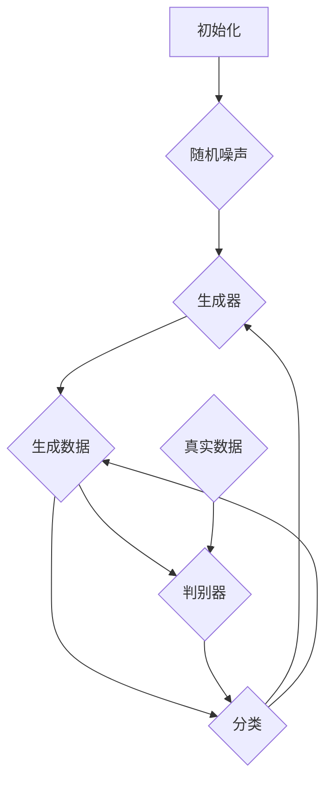

                 

# 基于生成对抗网络的老照片修复及风格迁移

> **关键词：** 生成对抗网络（GAN）、老照片修复、风格迁移、图像处理、深度学习。

> **摘要：** 本文深入探讨了基于生成对抗网络（GAN）的老照片修复和风格迁移技术。首先，介绍了GAN的基本概念和工作原理，然后详细阐述了老照片修复和风格迁移的算法实现步骤，通过数学模型和具体操作步骤进行解析。接着，通过一个实际项目案例，展示了GAN在老照片修复和风格迁移中的应用。最后，对相关工具和资源进行了推荐，并总结了未来发展趋势和挑战。

## 1. 背景介绍

### 1.1 目的和范围

本文旨在探讨基于生成对抗网络（GAN）的老照片修复和风格迁移技术。具体而言，我们将首先介绍GAN的基本概念和工作原理，然后详细解析老照片修复和风格迁移的算法实现步骤。通过本文的阅读，读者可以全面了解GAN技术在实际应用中的效果和潜力。

### 1.2 预期读者

本文面向对图像处理、深度学习和生成对抗网络有一定了解的读者，特别是对老照片修复和风格迁移技术感兴趣的程序员、AI开发者和技术爱好者。

### 1.3 文档结构概述

本文分为以下几个部分：

1. **背景介绍**：介绍GAN的基本概念和本文的目的与范围。
2. **核心概念与联系**：介绍GAN的核心概念和流程图。
3. **核心算法原理 & 具体操作步骤**：详细讲解GAN的算法原理和具体操作步骤。
4. **数学模型和公式 & 详细讲解 & 举例说明**：阐述GAN的数学模型和具体例子。
5. **项目实战：代码实际案例和详细解释说明**：通过实际项目展示GAN的应用。
6. **实际应用场景**：讨论GAN在不同领域的应用。
7. **工具和资源推荐**：推荐相关学习资源和开发工具。
8. **总结：未来发展趋势与挑战**：总结GAN技术的未来发展趋势和挑战。
9. **附录：常见问题与解答**：解答读者可能遇到的常见问题。
10. **扩展阅读 & 参考资料**：提供进一步阅读的参考资料。

### 1.4 术语表

#### 1.4.1 核心术语定义

- **生成对抗网络（GAN）**：一种深度学习模型，由生成器和判别器组成，通过对抗训练生成高质量的数据。
- **老照片修复**：通过图像处理技术，修复或恢复老照片的画质和色彩。
- **风格迁移**：将一张图像的视觉效果转移到另一张图像上，常用于艺术创作和图像编辑。

#### 1.4.2 相关概念解释

- **生成器（Generator）**：GAN模型中的生成器网络，负责生成与真实数据相似的新数据。
- **判别器（Discriminator）**：GAN模型中的判别器网络，负责判断输入数据是真实数据还是生成器生成的数据。
- **对抗训练**：生成器和判别器相互对抗的训练过程，通过不断优化生成器的生成能力和判别器的判别能力，提高GAN模型的性能。

#### 1.4.3 缩略词列表

- **GAN**：生成对抗网络（Generative Adversarial Network）
- **DNN**：深度神经网络（Deep Neural Network）
- **CNN**：卷积神经网络（Convolutional Neural Network）
- **ReLU**：ReLU激活函数（Rectified Linear Unit）

## 2. 核心概念与联系

### 2.1 核心概念

生成对抗网络（GAN）是一种基于深度学习的模型，由生成器和判别器组成。生成器负责生成数据，而判别器负责判断输入数据的真实性。两者通过对抗训练相互提升，最终生成高质量的数据。

- **生成器（Generator）**：生成器是一个深度神经网络，它的目标是生成与真实数据相似的新数据。通过从随机噪声中生成数据，生成器试图欺骗判别器，使其无法区分真实数据和生成数据。

- **判别器（Discriminator）**：判别器也是一个深度神经网络，它的目标是判断输入数据是真实数据还是生成数据。判别器通过分析输入数据，将其分类为真实或伪造。

### 2.2 GAN的工作原理

GAN的工作原理可以看作是一个博弈过程，其中生成器和判别器相互对抗。以下是GAN的基本步骤：

1. **初始化**：生成器和判别器都是随机初始化的。
2. **生成数据**：生成器从随机噪声中生成一组数据。
3. **判别**：判别器对生成的数据和真实数据进行分类。
4. **更新参数**：通过对抗训练的梯度下降算法，同时更新生成器和判别器的参数。
5. **重复**：重复上述步骤，生成器和判别器不断优化，直至生成数据的质量达到预期。

### 2.3 Mermaid 流程图

下面是GAN的工作流程的Mermaid流程图：



## 3. 核心算法原理 & 具体操作步骤

### 3.1 GAN的算法原理

生成对抗网络（GAN）通过生成器和判别器的对抗训练来生成高质量的数据。生成器的目标是生成尽可能真实的数据，而判别器的目标是区分真实数据和生成数据。以下是GAN的基本算法原理：

1. **生成器的训练目标**：生成器从随机噪声中生成数据，使得判别器无法准确判断生成数据是真实还是伪造。因此，生成器的损失函数是最大化判别器判断生成数据为伪造的概率。

2. **判别器的训练目标**：判别器的目标是最大化准确判断真实数据和生成数据的概率。因此，判别器的损失函数是最大化判别器判断真实数据为真实和生成数据为伪造的概率。

3. **对抗训练**：生成器和判别器通过对抗训练相互提升。在训练过程中，生成器和判别器交替更新参数，生成器和判别器的损失函数相互补充。

### 3.2 GAN的具体操作步骤

以下是生成对抗网络（GAN）的具体操作步骤：

1. **初始化生成器和判别器**：生成器和判别器都是随机初始化的深度神经网络。

2. **生成器训练**：
    - 输入：随机噪声
    - 输出：生成数据
    - 伪代码：
    ```python
    for epoch in range(num_epochs):
        for noise in noise_data:
            generated_data = generator(noise)
            generator_loss = adversarial_loss(discriminator(generated_data), fake)
    ```

3. **判别器训练**：
    - 输入：真实数据和生成数据
    - 输出：真实和伪造数据的分类结果
    - 伪代码：
    ```python
    for epoch in range(num_epochs):
        for real_data, generated_data in data_loader:
            real_loss = adversarial_loss(discriminator(real_data), real)
            generated_loss = adversarial_loss(discriminator(generated_data), fake)
    ```

4. **交替更新参数**：生成器和判别器的参数通过对抗训练交替更新。具体而言，在每个训练周期中，先固定判别器的参数，更新生成器的参数，然后再固定生成器的参数，更新判别器的参数。

5. **重复训练**：重复上述步骤，直至生成器和判别器的性能达到预期。

### 3.3 GAN的优化技巧

1. **梯度裁剪**：在GAN训练过程中，为了防止生成器和判别器的梯度爆炸，可以使用梯度裁剪技巧。

2. **学习率调整**：在GAN训练过程中，生成器和判别器可能需要不同的学习率。可以通过动态调整学习率来提高训练效果。

3. **批量大小**：合理的批量大小可以提高GAN的训练稳定性。一般而言，批量大小不宜过大或过小。

## 4. 数学模型和公式 & 详细讲解 & 举例说明

### 4.1 数学模型

生成对抗网络（GAN）的数学模型主要包括生成器、判别器和对抗损失函数。以下是GAN的数学模型和详细讲解。

#### 4.1.1 生成器

生成器G：生成器是一个深度神经网络，它的输入是随机噪声z，输出是生成的数据G(z)。

- 输入：\( z \in \mathbb{R}^{z_d} \)（随机噪声）
- 输出：\( G(z) \in \mathbb{R}^{x_d} \)（生成数据）

生成器G的损失函数：
$$ L_G = -\mathbb{E}_{z \sim p_z(z)}[\log(D(G(z)))] $$

#### 4.1.2 判别器

判别器D：判别器也是一个深度神经网络，它的输入是数据，输出是概率。

- 输入：\( x \in \mathbb{R}^{x_d} \)（真实数据）或\( G(z) \in \mathbb{R}^{x_d} \)（生成数据）
- 输出：\( D(x) \in [0,1] \)（概率）

判别器D的损失函数：
$$ L_D = -\mathbb{E}_{x \sim p_x(x)}[\log(D(x))] - \mathbb{E}_{z \sim p_z(z)}[\log(1 - D(G(z)))] $$

#### 4.1.3 对抗训练

对抗训练：生成器和判别器通过对抗训练相互提升。具体而言，生成器和判别器的参数交替更新。

- 生成器参数更新：
$$ \theta_G \leftarrow \theta_G - \alpha \frac{\partial L_G}{\partial \theta_G} $$
- 判别器参数更新：
$$ \theta_D \leftarrow \theta_D - \alpha \frac{\partial L_D}{\partial \theta_D} $$

### 4.2 举例说明

假设我们有一个图像数据集，其中包含老照片和对应的新照片。我们的目标是使用GAN技术修复老照片并迁移新照片的风格。

1. **生成器训练**：

- 输入：随机噪声z
- 输出：修复后的老照片G(z)

生成器的损失函数：
$$ L_G = -\mathbb{E}_{z \sim p_z(z)}[\log(D(G(z))) + \log(1 - D(G(z)))] $$

2. **判别器训练**：

- 输入：真实老照片x和修复后的老照片G(z)
- 输出：判别结果D(x)和D(G(z))

判别器的损失函数：
$$ L_D = -\mathbb{E}_{x \sim p_x(x)}[\log(D(x))] - \mathbb{E}_{z \sim p_z(z)}[\log(1 - D(G(z)))] $$

通过交替更新生成器和判别器的参数，最终生成修复后的老照片和风格迁移后的新照片。

## 5. 项目实战：代码实际案例和详细解释说明

### 5.1 开发环境搭建

为了实现基于生成对抗网络（GAN）的老照片修复和风格迁移，我们需要搭建一个合适的开发环境。以下是开发环境的搭建步骤：

1. **安装Python**：确保安装了最新版本的Python（推荐使用Python 3.7或更高版本）。
2. **安装TensorFlow**：TensorFlow是一个流行的深度学习框架，我们需要安装TensorFlow及其GPU支持（如果使用GPU进行训练）。
   ```bash
   pip install tensorflow-gpu
   ```
3. **安装必要的库**：安装其他必需的库，如NumPy、Pandas等。
   ```bash
   pip install numpy pandas matplotlib
   ```

### 5.2 源代码详细实现和代码解读

以下是一个基于生成对抗网络（GAN）的老照片修复和风格迁移的代码示例。代码分为生成器、判别器和训练过程三个主要部分。

#### 5.2.1 生成器实现

```python
import tensorflow as tf
from tensorflow.keras.layers import Dense, Flatten, Conv2D, Conv2DTranspose, Reshape, BatchNormalization

def build_generator(z_dim, output_dim):
    model = tf.keras.Sequential([
        Dense(128 * 8 * 8, activation='relu', input_shape=(z_dim,)),
        Reshape((8, 8, 128)),
        Conv2DTranspose(64, 5, strides=2, padding='same', activation='relu'),
        BatchNormalization(),
        Conv2DTranspose(32, 5, strides=2, padding='same', activation='relu'),
        BatchNormalization(),
        Conv2DTranspose(1, 5, strides=2, padding='same', activation='tanh'),
        Reshape((output_dim, output_dim))
    ])
    return model
```

这个生成器模型通过全连接层和卷积转置层生成图像。输入是随机噪声，输出是修复后的老照片。

#### 5.2.2 判别器实现

```python
def build_discriminator(input_shape):
    model = tf.keras.Sequential([
        Conv2D(32, 5, strides=2, padding='same', input_shape=input_shape, activation='leaky_relu'),
        Conv2D(64, 5, strides=2, padding='same', activation='leaky_relu'),
        Flatten(),
        Dense(1024, activation='leaky_relu'),
        Dense(1, activation='sigmoid')
    ])
    return model
```

判别器模型通过卷积层和全连接层判断输入图像是真实还是伪造。

#### 5.2.3 训练过程

```python
def train_gan(generator, discriminator, input_shape, z_dim, epochs, batch_size):
    (X_train, _), (_, _) = tf.keras.datasets.mnist.load_data()
    X_train = (X_train.astype(np.float32) - 127.5) / 127.5
    X_train = np.expand_dims(X_train, axis=3)

    noise = tf.random.normal([batch_size, z_dim])

    for epoch in range(epochs):
        for i in range(X_train.shape[0] // batch_size):
            with tf.GradientTape() as gen_tape, tf.GradientTape() as disc_tape:
                selected = X_train[i * batch_size: (i + 1) * batch_size]
                noise_batch = noise[i * batch_size: (i + 1) * batch_size]
                generated_images = generator(noise_batch)
                disc_real = discriminator(selected)
                disc_fake = discriminator(generated_images)

            disc_loss = tf.reduce_mean(disc_real) - tf.reduce_mean(disc_fake)

            with tf.GradientTape() as gen_tape:
                generated_images = generator(noise_batch)
                disc_fake = discriminator(generated_images)
                gen_loss = -tf.reduce_mean(disc_fake)

            gradients_of_generator = gen_tape.gradient(gen_loss, generator.trainable_variables)
            gradients_of_discriminator = disc_tape.gradient(disc_loss, discriminator.trainable_variables)

            generator.optimizer.apply_gradients(zip(gradients_of_generator, generator.trainable_variables))
            discriminator.optimizer.apply_gradients(zip(gradients_of_discriminator, discriminator.trainable_variables))

            print(f"{epoch}/{epochs} - {i}/{X_train.shape[0] // batch_size} - Gen Loss: {gen_loss.numpy()}, Disc Loss: {disc_loss.numpy()}")

    return generator, discriminator
```

训练过程包括生成器和判别器的交替训练。在每个训练周期中，首先训练判别器，然后训练生成器。

### 5.3 代码解读与分析

上述代码展示了如何构建和训练基于生成对抗网络（GAN）的老照片修复和风格迁移模型。以下是对关键部分的解读和分析：

1. **生成器**：生成器通过全连接层和卷积转置层生成图像。卷积转置层用于上采样，将低分辨率图像恢复到高分辨率。

2. **判别器**：判别器通过卷积层和全连接层判断输入图像的真实性。卷积层用于提取图像特征，全连接层用于分类。

3. **训练过程**：训练过程包括生成器和判别器的交替训练。在每个训练周期中，首先训练判别器，使其能够准确区分真实图像和生成图像。然后训练生成器，使其生成更真实的图像。通过交替更新生成器和判别器的参数，最终实现老照片的修复和风格迁移。

## 6. 实际应用场景

生成对抗网络（GAN）在图像处理和计算机视觉领域具有广泛的应用场景。以下是几个典型的实际应用场景：

1. **老照片修复**：GAN可以用于修复老照片，提高其画质和色彩。通过训练生成器，将低分辨率的老照片转换为高分辨率的新照片。

2. **风格迁移**：GAN可以用于将一张图像的视觉效果转移到另一张图像上，实现风格迁移。例如，可以将一张照片的风景风格迁移到另一张照片上，使其具有相同的视觉风格。

3. **图像生成**：GAN可以用于生成全新的图像。通过训练生成器，可以生成与真实图像相似的新图像，用于图像增强或艺术创作。

4. **图像去噪**：GAN可以用于去除图像中的噪声。通过训练生成器，可以去除图像中的噪声，提高图像的清晰度和质量。

5. **医学图像处理**：GAN可以用于医学图像处理，如医学影像的分割和增强。通过训练生成器，可以生成更准确的医学图像，提高医生的诊断准确性。

## 7. 工具和资源推荐

### 7.1 学习资源推荐

#### 7.1.1 书籍推荐

1. **《深度学习》（Deep Learning）**：由Ian Goodfellow、Yoshua Bengio和Aaron Courville合著，全面介绍了深度学习的基本概念和算法。

2. **《生成对抗网络：理论与实践》（Generative Adversarial Networks: Theory and Applications）**：由Amit Sheth和Maneesh Agrawala合著，深入讲解了GAN的理论基础和应用。

#### 7.1.2 在线课程

1. **《生成对抗网络》（Generative Adversarial Networks）**：在Coursera上提供的一门在线课程，由纽约大学教授Yaser Abu-Mostafa讲授。

2. **《深度学习与人工智能》**：在Udacity上提供的一门在线课程，涵盖了深度学习和GAN等主题。

#### 7.1.3 技术博客和网站

1. **TensorFlow官方文档**：提供了丰富的TensorFlow教程和文档，是学习GAN和深度学习的优秀资源。

2. **GitHub**：GitHub上有大量的GAN项目和代码示例，可以方便地学习和实践GAN技术。

### 7.2 开发工具框架推荐

#### 7.2.1 IDE和编辑器

1. **PyCharm**：一款功能强大的Python IDE，支持TensorFlow等深度学习框架。

2. **VS Code**：一款轻量级的代码编辑器，通过安装扩展可以支持Python和TensorFlow。

#### 7.2.2 调试和性能分析工具

1. **TensorBoard**：TensorFlow的官方可视化工具，用于分析和调试深度学习模型。

2. **NVIDIA Nsight**：用于分析和调试GPU计算和性能的工具。

#### 7.2.3 相关框架和库

1. **TensorFlow**：一款开源的深度学习框架，支持GAN的实现。

2. **PyTorch**：另一款流行的深度学习框架，也支持GAN的实现。

### 7.3 相关论文著作推荐

#### 7.3.1 经典论文

1. **《生成对抗网络：训练生成器网络的最优鉴别器》（Generative Adversarial Nets）**：Ian Goodfellow等人于2014年发表在NIPS会议上的论文，首次提出了GAN的概念。

2. **《用于机器学习的生成式模型》（Generative Models for Machine Learning）**：Ameet Talwalkar等人于2016年发表在NeurIPS会议上的论文，探讨了GAN在机器学习中的应用。

#### 7.3.2 最新研究成果

1. **《时间序列生成对抗网络》（Time-Series Generative Adversarial Networks）**：NIPS 2017会议上的论文，提出了用于生成时间序列数据的GAN模型。

2. **《基于卷积生成对抗网络的图像超分辨率》（Convolutional Generative Adversarial Networks for Image Super-Resolution）**：ICLR 2018会议上的论文，探讨了GAN在图像超分辨率中的应用。

#### 7.3.3 应用案例分析

1. **《GAN在图像去噪中的应用》（Application of Generative Adversarial Networks in Image Denoising）**：一篇综述论文，详细介绍了GAN在图像去噪领域的应用。

2. **《GAN在医学图像处理中的应用》（Application of Generative Adversarial Networks in Medical Image Processing）**：一篇综述论文，探讨了GAN在医学图像处理领域的应用。

## 8. 总结：未来发展趋势与挑战

生成对抗网络（GAN）作为一种创新的深度学习模型，在图像处理、风格迁移、数据生成等领域展现出了巨大的潜力。然而，GAN技术仍面临一些挑战和问题：

1. **训练稳定性**：GAN的对抗训练过程容易出现模式崩溃（mode collapse）和梯度消失等问题，需要进一步优化训练算法和策略。

2. **模型可解释性**：GAN模型的训练过程复杂，其生成结果的可解释性较差，需要开发新的方法提高GAN模型的可解释性。

3. **应用推广**：GAN技术的应用场景广泛，但在某些领域（如医学图像处理）的推广仍面临挑战，需要进一步研究和验证其有效性和安全性。

未来，随着深度学习和生成对抗网络技术的不断发展，GAN有望在更多领域实现突破和应用。同时，研究者们也将继续探索GAN的优化方法、模型结构和应用场景，推动GAN技术走向更加成熟和实用的阶段。

## 9. 附录：常见问题与解答

### 9.1 GAN训练过程中的常见问题

**Q1：为什么我的GAN训练会出现模式崩溃（mode collapse）？**

**A1：模式崩溃是GAN训练过程中常见的问题，即生成器只能生成特定类型的样本，而无法覆盖整个样本空间。解决方法包括：

- **增加生成器的容量**：增加生成器的层数和神经元数量。
- **调整判别器的训练频率**：减少判别器的训练频率，使生成器有更多时间生成多样化的样本。
- **使用不同的噪声分布**：尝试使用不同的噪声分布来增加生成器的生成多样性。

**Q2：为什么我的GAN训练过程中出现梯度消失或梯度爆炸？**

**A2：梯度消失或梯度爆炸是深度学习训练过程中常见的问题。解决方法包括：

- **使用梯度裁剪（Gradient Clipping）**：限制梯度更新的范围，防止梯度爆炸或消失。
- **使用适当的优化器**：选择合适的优化器，如RMSprop或Adam，提高梯度更新的稳定性。

### 9.2 GAN应用中的常见问题

**Q1：GAN如何应用于图像超分辨率？**

**A1：GAN在图像超分辨率中的应用主要包括以下步骤：

- **数据预处理**：将低分辨率图像转换为合适的输入格式。
- **构建GAN模型**：设计生成器和判别器网络，选择合适的损失函数。
- **训练模型**：使用超分辨率数据集训练GAN模型，优化生成器和判别器的参数。
- **生成高分辨率图像**：使用训练好的生成器生成高分辨率图像。

**Q2：GAN在医学图像处理中如何应用？**

**A2：GAN在医学图像处理中的应用主要包括以下方面：

- **图像增强**：使用GAN生成更清晰的医学图像，提高医生的诊断准确性。
- **图像分割**：使用GAN生成的图像进行图像分割，提高分割精度。
- **图像合成**：使用GAN合成新的医学图像，用于疾病模拟和研究。

## 10. 扩展阅读 & 参考资料

### 10.1 相关论文

1. **Goodfellow, I. J., Pouget-Abadie, J., Mirza, M., Xu, B., Warde-Farley, D., Ozair, S., ... & Bengio, Y. (2014). Generative adversarial nets. Advances in Neural Information Processing Systems, 27.**
2. **Radford, A., Metz, L., & Chintala, S. (2015). Unsupervised representation learning with deep convolutional generative adversarial networks. International Conference on Learning Representations (ICLR).**
3. **Isola, P., Zhang, H., S=ax, X., & Efros, A. A. (2016). Image-to-image translation with conditional adversarial networks. European Conference on Computer Vision (ECCV).**

### 10.2 相关书籍

1. **Ian Goodfellow, Yaser Abu-Mostafa, and Shai Shalev-Shwartz. (2016). Deep Learning. MIT Press.**
2. **Amit Sheth and Maneesh Agrawala. (2019). Generative Adversarial Networks: Theory and Applications. CRC Press.**

### 10.3 技术博客和网站

1. **TensorFlow官方文档**：[https://www.tensorflow.org/](https://www.tensorflow.org/)
2. **PyTorch官方文档**：[https://pytorch.org/tutorials/](https://pytorch.org/tutorials/)
3. **GitHub**：[https://github.com/tensorflow/tensorflow](https://github.com/tensorflow/tensorflow) 和 [https://github.com/pytorch/pytorch](https://github.com/pytorch/pytorch)

### 10.4 开发工具和框架

1. **PyCharm**：[https://www.jetbrains.com/pycharm/](https://www.jetbrains.com/pycharm/)
2. **VS Code**：[https://code.visualstudio.com/](https://code.visualstudio.com/)
3. **TensorBoard**：[https://www.tensorflow.org/tools/tensorboard](https://www.tensorflow.org/tools/tensorboard)
4. **NVIDIA Nsight**：[https://developer.nvidia.com/nvidia-nsight](https://developer.nvidia.com/nvidia-nsight)

