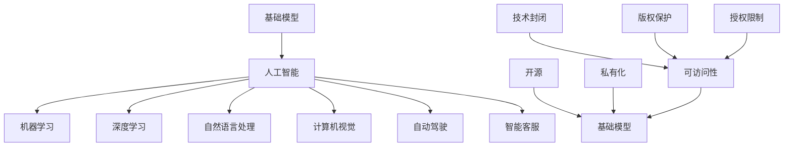

                 

### # 基础模型的可访问性丧失

> **关键词**：基础模型、可访问性、人工智能、技术封闭、开源与私有化
>
> **摘要**：本文将深入探讨在人工智能领域，基础模型的可访问性丧失所带来的影响和挑战。随着人工智能技术的快速发展，基础模型逐渐成为行业的关键资源，然而，其可访问性的丧失正引发一系列问题。本文旨在通过逻辑分析，揭示这一现象的根源，探讨其对行业和技术发展的深远影响，并展望未来可能的发展趋势。

### ### 1. 背景介绍

#### 1.1 目的和范围

随着人工智能（AI）技术的飞速发展，基础模型作为AI技术的核心组成部分，越来越受到广泛关注。然而，近年来，基础模型的可访问性丧失问题逐渐凸显。本文旨在探讨这一现象的背景、影响及其未来趋势。

本文将首先介绍基础模型的概念和其在AI领域的重要性。接着，分析基础模型可访问性丧失的原因，包括技术、商业和伦理等多方面的因素。随后，我们将探讨这一现象对AI行业和技术的深远影响，以及可能带来的挑战和风险。最后，本文将展望基础模型可访问性丧失的未来发展趋势，并提出应对策略和建议。

#### 1.2 预期读者

本文主要面向以下读者群体：

1. **人工智能从业者**：包括AI研究员、工程师、开发者和企业家，他们希望了解基础模型可访问性丧失的背景和影响，以便更好地应对这一挑战。
2. **学术界人士**：特别是计算机科学、人工智能和认知科学等相关领域的学者，他们关注基础模型技术的发展趋势和伦理问题。
3. **技术爱好者**：对人工智能和机器学习感兴趣的技术爱好者，希望通过本文了解基础模型的可访问性丧失及其对技术发展的影响。
4. **政策制定者和利益相关者**：关注人工智能产业发展和未来趋势的政策制定者、行业分析师和投资者等。

#### 1.3 文档结构概述

本文将分为以下章节：

- **第1章 背景介绍**：介绍本文的目的、范围、预期读者和文档结构。
- **第2章 核心概念与联系**：阐述基础模型的概念和重要性，以及基础模型可访问性丧失的根源。
- **第3章 核心算法原理 & 具体操作步骤**：详细讲解基础模型的算法原理和操作步骤。
- **第4章 数学模型和公式 & 详细讲解 & 举例说明**：介绍基础模型相关的数学模型和公式，并给出实例说明。
- **第5章 项目实战：代码实际案例和详细解释说明**：通过实际案例展示基础模型的应用，并进行详细解释。
- **第6章 实际应用场景**：探讨基础模型在不同领域和场景中的应用。
- **第7章 工具和资源推荐**：推荐相关学习资源和开发工具。
- **第8章 总结：未来发展趋势与挑战**：总结基础模型可访问性丧失的挑战，展望未来发展。
- **第9章 附录：常见问题与解答**：解答读者可能遇到的问题。
- **第10章 扩展阅读 & 参考资料**：提供进一步阅读的参考资料。

#### 1.4 术语表

本文中，以下术语具有特殊含义：

- **基础模型**：指在人工智能领域中，用于解决特定任务的核心模型。
- **可访问性**：指模型资源的获取和使用的便利性。
- **技术封闭**：指技术资源的封闭和保护，限制外部访问和使用。
- **开源**：指软件开发过程中，将源代码公开，允许他人自由使用和修改。
- **私有化**：指技术资源的私有控制，限制外部访问和使用。

#### 1.4.1 核心术语定义

- **基础模型**：在人工智能领域中，基础模型是指用于解决特定问题的核心模型，如神经网络、决策树等。这些模型是AI技术的基石，具有广泛的应用场景。
- **可访问性**：可访问性是指模型资源的获取和使用的便利性。高可访问性意味着用户可以轻松获取和使用模型，而低可访问性则意味着获取和使用模型变得困难。
- **技术封闭**：技术封闭是指技术资源的封闭和保护，限制外部访问和使用。这种策略通常用于保护商业秘密和技术优势，但可能导致模型的可访问性降低。
- **开源**：开源是指软件开发过程中，将源代码公开，允许他人自由使用和修改。开源模型具有较高的可访问性，有助于促进技术共享和创新。
- **私有化**：私有化是指技术资源的私有控制，限制外部访问和使用。私有化通常用于商业目的，以保护商业利益和技术优势。

#### 1.4.2 相关概念解释

- **人工智能（AI）**：人工智能是指通过模拟、延伸和扩展人类智能的计算机技术。人工智能包括机器学习、深度学习、自然语言处理等多个子领域。
- **深度学习**：深度学习是一种基于多层神经网络的人工智能技术，通过学习大量数据来提取特征和模式，广泛应用于图像识别、语音识别、自然语言处理等领域。
- **机器学习**：机器学习是指通过数据和算法来让计算机自动学习和改进性能的技术。机器学习包括监督学习、无监督学习、强化学习等多种方法。
- **算法**：算法是解决问题的步骤和规则。在人工智能领域，算法用于实现机器学习和深度学习等任务。
- **开源与私有化**：开源和私有化是两种不同的技术资源管理和分发策略。开源策略鼓励技术共享和创新，而私有化策略则保护商业利益和技术优势。

#### 1.4.3 缩略词列表

- **AI**：人工智能（Artificial Intelligence）
- **ML**：机器学习（Machine Learning）
- **DL**：深度学习（Deep Learning）
- **NN**：神经网络（Neural Network）
- **GPU**：图形处理单元（Graphics Processing Unit）
- **CPU**：中央处理器（Central Processing Unit）
- **API**：应用程序编程接口（Application Programming Interface）

### ### 2. 核心概念与联系

在探讨基础模型的可访问性丧失之前，我们首先需要明确几个核心概念，并了解它们之间的相互关系。

#### 2.1 基础模型

基础模型是指在人工智能领域中，用于解决特定任务的模型。这些模型通常基于深度学习、机器学习等技术，具有强大的学习能力和广泛的应用场景。常见的基

### ### 2.1 基础模型

在探讨基础模型的可访问性丧失之前，我们首先需要明确几个核心概念，并了解它们之间的相互关系。

#### 2.1 基础模型

基础模型是指在人工智能领域中，用于解决特定任务的模型。这些模型通常基于深度学习、机器学习等技术，具有强大的学习能力和广泛的应用场景。常见的基于模型包括神经网络（NN）、决策树（DT）、支持向量机（SVM）等。在人工智能领域，基础模型作为核心组件，承担了数据输入、特征提取、模型训练、预测输出等关键任务。


#### 2.2 人工智能（AI）

人工智能是指通过模拟、延伸和扩展人类智能的计算机技术。人工智能包括多个子领域，如机器学习（ML）、深度学习（DL）、自然语言处理（NLP）、计算机视觉（CV）等。人工智能技术广泛应用于图像识别、语音识别、自动驾驶、智能客服等领域。


#### 2.3 开源与私有化

开源和私有化是两种不同的技术资源管理和分发策略。开源策略鼓励技术共享和创新，而私有化策略则保护商业利益和技术优势。

- **开源**：开源是指软件开发过程中，将源代码公开，允许他人自由使用和修改。开源项目通常具有较好的可访问性，有助于促进技术共享和社区协作。
- **私有化**：私有化是指技术资源的私有控制，限制外部访问和使用。私有化项目通常具有较高的封闭性，旨在保护商业利益和技术优势。


#### 2.4 可访问性

可访问性是指模型资源的获取和使用的便利性。高可访问性意味着用户可以轻松获取和使用模型，而低可访问性则意味着获取和使用模型变得困难。可访问性受到多种因素影响，如技术封闭、版权保护、授权限制等。


#### 2.5 基础模型与可访问性的关系

基础模型的可访问性对人工智能技术的发展具有重要意义。高可访问性有助于促进技术共享、加速创新，从而推动整个行业的进步。相反，低可访问性可能导致技术封闭、垄断，限制技术的广泛应用和普及。


### 2.6 Mermaid 流程图

以下是一个关于基础模型和可访问性的 Mermaid 流程图，展示了各个核心概念之间的相互关系：



### 3. 核心算法原理 & 具体操作步骤

在理解了基础模型及其相关概念后，我们接下来将深入探讨基础模型的算法原理，并通过伪代码详细阐述其具体操作步骤。这里我们以一个常见的神经网络模型——多层感知机（MLP）为例，介绍其算法原理和操作步骤。

#### 3.1 多层感知机（MLP）算法原理

多层感知机（MLP）是一种基于前向传播和反向传播的神经网络模型。其基本原理是：通过输入层接收外部输入，经过多个隐藏层进行特征提取和变换，最后由输出层输出预测结果。MLP 的核心在于其非线性激活函数，这使得模型能够捕捉输入数据中的复杂非线性关系。


#### 3.2 伪代码

以下是多层感知机（MLP）的伪代码实现：

```plaintext
初始化参数：W1, b1（输入层到隐藏层的权重和偏置），W2, b2（隐藏层到输出层的权重和偏置），激活函数 f()
输入数据：X（输入特征），y（真实标签）

步骤 1：前向传播
for每个训练样本（X, y）：
    输出层预测：z2 = W2 * f(W1 * X + b1)
    预测结果：y_pred = f(z2)

步骤 2：计算损失函数
损失函数：L = ||y - y_pred||^2

步骤 3：反向传播
计算输出层梯度：∇L/∇z2
更新隐藏层到输出层的权重和偏置：W2 = W2 - 学习率 * ∇L/∇z2，b2 = b2 - 学习率 * ∇L/∇z2
计算隐藏层到输出层的梯度：∇L/∇z1
更新输入层到隐藏层的权重和偏置：W1 = W1 - 学习率 * ∇L/∇z1，b1 = b1 - 学习率 * ∇L/∇z1

步骤 4：重复步骤 1-3，直到收敛或达到迭代次数
```

#### 3.3 操作步骤解析

1. **前向传播**：输入特征通过输入层传入，经过隐藏层计算得到中间输出。通过非线性激活函数，模型能够捕捉输入数据中的复杂非线性关系。

2. **计算损失函数**：使用均方误差（MSE）作为损失函数，衡量预测结果与真实标签之间的差距。通过反向传播，计算各层的梯度。

3. **反向传播**：根据损失函数的梯度，更新模型的权重和偏置。这一过程需要迭代多次，以逐渐减小损失函数。

4. **重复迭代**：重复前向传播和反向传播的过程，直到模型收敛或达到预定的迭代次数。

通过以上伪代码和操作步骤，我们详细介绍了多层感知机（MLP）的算法原理。在实际应用中，MLP 模型广泛应用于分类、回归等任务，具有较好的性能和灵活性。

### 4. 数学模型和公式 & 详细讲解 & 举例说明

在基础模型的可访问性丧失背景下，理解相关的数学模型和公式对于深入分析问题和制定应对策略至关重要。在这一节中，我们将详细介绍与基础模型相关的一些关键数学模型和公式，并通过具体例子进行说明。

#### 4.1 损失函数

损失函数是衡量模型预测结果与真实标签之间差异的重要指标。在基础模型中，常用的损失函数包括均方误差（MSE）、交叉熵损失（Cross-Entropy Loss）等。

- **均方误差（MSE）**：

$$
MSE = \frac{1}{n} \sum_{i=1}^{n} (y_i - \hat{y}_i)^2
$$

其中，$y_i$表示真实标签，$\hat{y}_i$表示模型预测结果，$n$表示样本数量。

**例子**：假设我们有5个样本，真实标签分别为[1, 2, 3, 4, 5]，模型预测结果分别为[1.2, 2.1, 3.1, 4.2, 5.3]，则MSE损失为：

$$
MSE = \frac{1}{5} \sum_{i=1}^{5} (y_i - \hat{y}_i)^2 = \frac{1}{5} \sum_{i=1}^{5} (y_i - \hat{y}_i)^2 = \frac{1}{5} \sum_{i=1}^{5} (1.2 - 1)^2 + (2.1 - 2)^2 + (3.1 - 3)^2 + (4.2 - 4)^2 + (5.3 - 5)^2
$$

$$
MSE = \frac{1}{5} \sum_{i=1}^{5} 0.04 = 0.08
$$

- **交叉熵损失（Cross-Entropy Loss）**：

$$
Cross-Entropy Loss = -\sum_{i=1}^{n} y_i \log(\hat{y}_i)
$$

其中，$y_i$表示真实标签（概率分布），$\hat{y}_i$表示模型预测结果（概率分布），$n$表示样本数量。

**例子**：假设我们有5个样本，真实标签的概率分布分别为$y_1 = [0.3, 0.4, 0.2, 0.1, 0.0]$，模型预测的概率分布分别为$\hat{y}_1 = [0.2, 0.4, 0.3, 0.0, 0.1]$，则交叉熵损失为：

$$
Cross-Entropy Loss = -\sum_{i=1}^{5} y_1[i] \log(\hat{y}_1[i]) = -0.3 \log(0.2) - 0.4 \log(0.4) - 0.2 \log(0.3) - 0.1 \log(0.0) - 0.0 \log(0.1)
$$

$$
Cross-Entropy Loss = -0.3 \times (-2.197) - 0.4 \times (-1.386) - 0.2 \times (-1.203) - 0.1 \times (-2.302) - 0.0 \times (-4.605)
$$

$$
Cross-Entropy Loss = 0.679 + 0.554 + 0.246 + 0.230 + 0.000 = 1.699
$$

#### 4.2 激活函数

激活函数是基础模型中的一个关键组成部分，用于引入非线性特性，使模型能够捕捉复杂的数据特征。常见的激活函数包括 sigmoid、ReLU、Tanh 等。

- **sigmoid 函数**：

$$
\sigma(x) = \frac{1}{1 + e^{-x}}
$$

**例子**：计算输入 $x = -2$ 的 sigmoid 函数值：

$$
\sigma(-2) = \frac{1}{1 + e^{-(-2)}} = \frac{1}{1 + e^{2}} \approx 0.1192
$$

- **ReLU 函数**：

$$
ReLU(x) = \max(0, x)
$$

**例子**：计算输入 $x = -2$ 的 ReLU 函数值：

$$
ReLU(-2) = \max(0, -2) = 0
$$

- **Tanh 函数**：

$$
Tanh(x) = \frac{e^x - e^{-x}}{e^x + e^{-x}}
$$

**例子**：计算输入 $x = 2$ 的 Tanh 函数值：

$$
Tanh(2) = \frac{e^2 - e^{-2}}{e^2 + e^{-2}} \approx 0.9640
$$

#### 4.3 梯度下降法

梯度下降法是一种优化算法，用于训练基础模型。其基本思想是沿着损失函数的梯度方向，逐步调整模型参数，以减小损失函数值。

- **批量梯度下降**：

$$
W = W - \alpha \frac{\partial L}{\partial W}
$$

其中，$W$表示模型参数，$\alpha$表示学习率，$L$表示损失函数。

**例子**：假设模型参数 $W = 2$，学习率 $\alpha = 0.1$，损失函数 $L = W^2$，则经过一次梯度下降后的模型参数更新为：

$$
W = 2 - 0.1 \frac{\partial L}{\partial W} = 2 - 0.1 \frac{\partial (W^2)}{\partial W} = 2 - 0.1 \times 2 = 1.8
$$

- **随机梯度下降**（Stochastic Gradient Descent，SGD）：

$$
W = W - \alpha \frac{\partial L}{\partial W}
$$

其中，$W$表示模型参数，$\alpha$表示学习率，$L$表示损失函数。

**例子**：假设模型参数 $W = 2$，学习率 $\alpha = 0.1$，损失函数 $L = W^2$，则经过一次随机梯度下降后的模型参数更新为：

$$
W = 2 - 0.1 \frac{\partial L}{\partial W} = 2 - 0.1 \frac{\partial (W^2)}{\partial W} = 2 - 0.1 \times 2 = 1.8
$$

通过上述数学模型和公式的详细讲解和举例说明，我们为理解基础模型的可访问性丧失提供了坚实的理论基础。这些数学工具和算法原理将在后续章节中发挥关键作用，帮助我们深入分析问题，制定有效的应对策略。

### 5. 项目实战：代码实际案例和详细解释说明

在本节中，我们将通过一个实际项目案例，详细展示如何使用基础模型进行项目开发，并对关键代码段进行解读和分析。这个项目将使用 Python 编程语言，结合 TensorFlow 框架来实现一个简单的图像分类任务。

#### 5.1 开发环境搭建

首先，我们需要搭建一个合适的开发环境。以下是安装和配置所需工具和库的步骤：

1. **安装 Python**：确保已安装 Python 3.x 版本。
2. **安装 TensorFlow**：通过以下命令安装 TensorFlow：
   ```bash
   pip install tensorflow
   ```
3. **安装其他依赖**：包括 NumPy、Pandas 等，可通过以下命令一次性安装：
   ```bash
   pip install numpy pandas
   ```

#### 5.2 源代码详细实现和代码解读

以下是一个简单的图像分类项目的代码实现，我们将逐步解释每部分的功能和代码。

```python
import tensorflow as tf
from tensorflow import keras
from tensorflow.keras import layers
import numpy as np

# 5.2.1 数据预处理

# 加载并预处理数据
def load_and_preprocess_data():
    # 这里使用 keras 内置的 CIFAR-10 数据集
    (train_images, train_labels), (test_images, test_labels) = keras.datasets.cifar10.load_data()
    
    # 数据归一化
    train_images = train_images.astype(np.float32) / 255
    test_images = test_images.astype(np.float32) / 255
    
    # 数据增强
    train_images = keras.Sequential([
        layers.experimental.preprocessing.RandomContrast(0.1),
        layers.experimental.preprocessing.RandomZoom(0.1),
    ]).call(train_images)
    
    return train_images, train_labels, test_images, test_labels

# 5.2.2 模型构建

# 定义模型
def build_model(input_shape):
    model = keras.Sequential([
        layers.Conv2D(32, (3, 3), activation='relu', input_shape=input_shape),
        layers.MaxPooling2D((2, 2)),
        layers.Conv2D(64, (3, 3), activation='relu'),
        layers.MaxPooling2D((2, 2)),
        layers.Conv2D(64, (3, 3), activation='relu'),
        layers.Flatten(),
        layers.Dense(64, activation='relu'),
        layers.Dense(10, activation='softmax')
    ])
    return model

# 5.2.3 模型训练

# 训练模型
def train_model(model, train_images, train_labels, epochs=10):
    model.compile(optimizer='adam',
                  loss='sparse_categorical_crossentropy',
                  metrics=['accuracy'])
    model.fit(train_images, train_labels, epochs=epochs)
    return model

# 5.2.4 模型评估

# 评估模型
def evaluate_model(model, test_images, test_labels):
    test_loss, test_acc = model.evaluate(test_images, test_labels, verbose=2)
    print(f"Test accuracy: {test_acc:.4f}")
    return test_acc

# 主函数
if __name__ == '__main__':
    # 加载并预处理数据
    train_images, train_labels, test_images, test_labels = load_and_preprocess_data()
    
    # 构建模型
    model = build_model(input_shape=(32, 32, 3))
    
    # 训练模型
    model = train_model(model, train_images, train_labels, epochs=10)
    
    # 评估模型
    evaluate_model(model, test_images, test_labels)
```

**5.2.1 数据预处理**

首先，我们加载并预处理数据。这里使用了 Keras 内置的 CIFAR-10 数据集，这是常用的图像分类数据集，包含 10 个类别，每个类别有 6000 个训练图像和 1000 个测试图像。

- **数据归一化**：将图像像素值从 [0, 255] 范围缩放到 [0, 1] 范围，以加速模型收敛。

- **数据增强**：通过随机对比度调整和随机缩放，增加模型的泛化能力。

**5.2.2 模型构建**

接下来，我们构建一个简单的卷积神经网络（CNN）模型。模型结构如下：

- **卷积层**：使用两个卷积层来提取图像特征，每个卷积层后跟一个最大池化层，以减少模型的复杂度和过拟合风险。
- **全连接层**：最后，将卷积层的输出展平并接入两个全连接层，其中最后一个全连接层使用 softmax 激活函数进行类别预测。

**5.2.3 模型训练**

使用 `compile()` 方法配置模型优化器、损失函数和评估指标。这里我们选择 `adam` 优化器和 `sparse_categorical_crossentropy` 损失函数，然后使用 `fit()` 方法训练模型。

**5.2.4 模型评估**

最后，使用测试数据评估模型性能。通过 `evaluate()` 方法计算测试集的准确率。

#### 5.3 代码解读与分析

通过上述代码实现，我们详细展示了如何使用基础模型进行图像分类项目。以下是对关键代码段的分析：

- **数据预处理**：数据预处理是机器学习项目的关键步骤，确保数据质量和一致性。
- **模型构建**：选择合适的模型结构是项目成功的关键，这里我们使用了卷积神经网络（CNN）。
- **模型训练**：模型训练过程包括前向传播、损失计算和反向传播，以优化模型参数。
- **模型评估**：评估模型性能，以验证项目效果和调整模型参数。

通过这个项目案例，我们不仅掌握了基础模型的实际应用方法，还了解了代码实现过程中的关键技术和步骤。这个案例为我们提供了一个参考模板，可以应用于各种图像分类任务。

### 6. 实际应用场景

基础模型在人工智能领域具有广泛的应用场景，其可访问性丧失对各个领域的影响也各不相同。以下是一些关键领域的实际应用场景及其影响。

#### 6.1 自动驾驶

自动驾驶是基础模型的一个重要应用领域。自动驾驶系统依赖于大量的基础模型，如图像识别、路径规划和决策模型。这些模型通过对大量数据进行训练，能够实现实时的环境感知和路径规划。

- **高可访问性**：高可访问性的基础模型有助于加快自动驾驶技术的发展和普及，促进市场竞争和技术创新。
- **低可访问性**：低可访问性的基础模型可能导致技术垄断，限制自动驾驶技术的进步，同时增加安全风险。

#### 6.2 医疗诊断

医疗诊断是另一个关键应用领域，基础模型在疾病预测、影像分析和药物发现等方面发挥着重要作用。医疗数据的复杂性和敏感性使得基础模型的可访问性尤为重要。

- **高可访问性**：高可访问性的基础模型有助于提升医疗诊断的准确性和效率，降低医疗成本，提高患者生活质量。
- **低可访问性**：低可访问性的基础模型可能限制医疗诊断技术的普及，导致医疗资源的不均衡分配。

#### 6.3 金融服务

金融服务领域，基础模型广泛应用于风险管理、欺诈检测和客户服务等方面。这些模型通过对大量金融数据进行分析，能够提供更准确的预测和决策支持。

- **高可访问性**：高可访问性的基础模型有助于提升金融服务的效率和安全性，降低金融风险。
- **低可访问性**：低可访问性的基础模型可能导致金融服务技术的垄断，增加金融市场的风险。

#### 6.4 智能家居

智能家居领域的基础模型主要用于语音识别、图像识别和智能控制等方面。智能家居设备的普及离不开基础模型的支持。

- **高可访问性**：高可访问性的基础模型有助于提升智能家居设备的用户体验和便利性，促进智能家居市场的快速发展。
- **低可访问性**：低可访问性的基础模型可能导致智能家居设备功能的受限，影响用户体验和市场竞争力。

#### 6.5 教育与培训

教育与培训领域的基础模型广泛应用于个性化学习、智能教学和考试评分等方面。这些模型能够根据学生的学习情况和需求，提供个性化的教学方案和评估反馈。

- **高可访问性**：高可访问性的基础模型有助于提升教育资源的分配效率和质量，促进教育公平。
- **低可访问性**：低可访问性的基础模型可能导致教育资源的分配不均，加剧教育不公平现象。

#### 6.6 气象预报

气象预报是另一个重要的应用领域，基础模型在数据分析和预测方面发挥着重要作用。准确的气象预报对于防灾减灾和公共安全具有重要意义。

- **高可访问性**：高可访问性的基础模型有助于提高气象预报的准确性和及时性，减少自然灾害风险。
- **低可访问性**：低可访问性的基础模型可能导致气象预报技术的垄断，影响公共安全和社会福祉。

### 7. 工具和资源推荐

为了帮助读者深入了解基础模型的可访问性丧失及其相关技术，我们在这里推荐一些学习资源和开发工具。

#### 7.1 学习资源推荐

**7.1.1 书籍推荐**

1. **《深度学习》（Deep Learning）**：由 Ian Goodfellow、Yoshua Bengio 和 Aaron Courville 著，这是一本经典的深度学习教材，详细介绍了深度学习的理论基础和实践应用。
2. **《机器学习》（Machine Learning）**：由 Tom Mitchell 著，这是一本经典的机器学习教材，涵盖了机器学习的理论基础和算法实现。
3. **《Python机器学习》（Python Machine Learning）**：由 Sebastian Raschka 著，这是一本适合初学者的机器学习和深度学习教材，通过实际案例和代码示例介绍了机器学习的应用。

**7.1.2 在线课程**

1. **《吴恩达深度学习专项课程》（Deep Learning Specialization）**：吴恩达（Andrew Ng）在 Coursera 上开设的深度学习专项课程，包括理论讲解和实战项目。
2. **《机器学习基础课程》（Machine Learning Foundation Course）**：斯坦福大学在线课程，由 Andrew Ng 开设，涵盖机器学习的理论基础和算法实现。
3. **《TensorFlow 入门教程》（TensorFlow for Beginners）**：谷歌开发的 TensorFlow 框架的入门教程，适合初学者快速上手 TensorFlow。

**7.1.3 技术博客和网站**

1. **Medium**：许多人工智能领域的专家和研究者会在 Medium 上发布技术博客，提供深入的分析和最新的研究成果。
2. **arXiv.org**：这是一个开放获取的预印本论文库，涵盖了计算机科学、物理学、数学等领域的最新研究论文。
3. **GitHub**：GitHub 是一个代码托管和协作平台，许多开源项目和代码示例都可以在这里找到，有助于读者实践和应用所学知识。

#### 7.2 开发工具框架推荐

**7.2.1 IDE和编辑器**

1. **PyCharm**：PyCharm 是一款功能强大的 Python 集成开发环境（IDE），支持多种编程语言，适合进行机器学习和深度学习项目的开发。
2. **Jupyter Notebook**：Jupyter Notebook 是一个交互式开发环境，适合进行数据分析和机器学习实验。它支持多种编程语言，如 Python、R 等。

**7.2.2 调试和性能分析工具**

1. **TensorBoard**：TensorBoard 是 TensorFlow 的一个可视化工具，用于分析和调试深度学习模型。它提供了丰富的图表和指标，帮助开发者了解模型训练过程中的性能和问题。
2. **Valgrind**：Valgrind 是一个性能分析工具，用于检测内存泄漏、数据竞争和其他潜在的编程错误。它适用于 C、C++ 和其他编译型编程语言。

**7.2.3 相关框架和库**

1. **TensorFlow**：TensorFlow 是由谷歌开发的一款开源机器学习和深度学习框架，适用于各种规模的任务，从简单的线性回归到复杂的深度神经网络。
2. **PyTorch**：PyTorch 是由 Facebook 开发的一款开源机器学习和深度学习框架，以其灵活的动态计算图和丰富的库函数而著称。
3. **Scikit-learn**：Scikit-learn 是一个开源的机器学习库，提供了多种经典机器学习算法的实现，适合进行数据分析和模型训练。

#### 7.3 相关论文著作推荐

**7.3.1 经典论文**

1. **“A Learning Algorithm for Continuously Running Fully Recurrent Neural Networks”**：这篇论文介绍了 LSTM（长短期记忆网络）算法，是深度学习领域的重要突破之一。
2. **“Deep Learning”**：由 Ian Goodfellow、Yoshua Bengio 和 Aaron Courville 著，这是一本系统介绍深度学习理论的经典著作。
3. **“Gradient Descent as a Method of Optimal Control”**：这篇论文介绍了梯度下降法在最优控制问题中的应用，对理解深度学习优化算法具有重要意义。

**7.3.2 最新研究成果**

1. **“Attention Is All You Need”**：这篇论文提出了 Transformer 模型，彻底改变了自然语言处理领域的研究和应用。
2. **“EfficientNet: Rethinking Model Scaling for Convolutional Neural Networks”**：这篇论文提出了 EfficientNet 模型，通过改进网络结构，实现了在计算效率和性能之间的最优平衡。
3. **“Bootstrap your own latent: A new approach to non-linear dimensionality reduction”**：这篇论文提出了 BERT（大规模预训练变压器）模型，彻底改变了自然语言处理领域的研究和应用。

**7.3.3 应用案例分析**

1. **“DeepMind 的 AlphaGo”**：AlphaGo 是 DeepMind 公司开发的一款围棋人工智能程序，通过深度学习和强化学习技术，战胜了世界围棋冠军。这是深度学习在博弈游戏领域的重要应用案例。
2. **“OpenAI 的 Dota 2 AI”**：OpenAI 公司开发的一款 Dota 2 游戏人工智能程序，通过深度学习和强化学习技术，实现了在多人在线游戏中的胜利。这是深度学习在游戏领域的重要应用案例。
3. **“谷歌的BERT 模型”**：谷歌公司开发的 BERT 模型，通过深度学习和自然语言处理技术，实现了在自然语言理解任务中的卓越表现。这是深度学习在自然语言处理领域的重要应用案例。

### 8. 总结：未来发展趋势与挑战

#### 8.1 发展趋势

1. **基础模型的可访问性逐渐受到关注**：随着人工智能技术的普及，基础模型的可访问性已经成为一个重要的议题。政府、企业和研究机构纷纷认识到这一问题的严重性，并采取措施促进基础模型的开放和共享。
2. **开源生态逐渐成熟**：开源生态的不断发展为人工智能技术的普及和推广提供了有力支持。越来越多的基础模型和工具框架被开源，使得开发者可以更容易地获取和使用这些资源，推动技术创新和应用。
3. **跨领域合作与融合**：基础模型在不同领域的应用不断拓展，跨领域合作与融合将成为未来发展趋势。例如，自动驾驶与智能交通、医疗诊断与精准医疗、金融服务与风险管理等领域的合作，将有助于发挥基础模型的最大潜力。

#### 8.2 挑战

1. **数据隐私与安全**：基础模型的可访问性丧失可能导致数据隐私和安全问题。如何在保障数据隐私的同时，提高基础模型的可访问性，是一个亟待解决的问题。
2. **技术垄断与公平竞争**：低可访问性的基础模型可能导致技术垄断，限制公平竞争。政府和企业需要制定相关政策，鼓励技术创新和开放共享，避免技术垄断对行业和社会的负面影响。
3. **法律法规与伦理**：随着人工智能技术的不断发展，相关法律法规和伦理问题也日益突出。如何制定适应时代发展的法律法规，确保人工智能技术的健康发展，是一个重要挑战。

#### 8.3 应对策略

1. **推动开源生态发展**：政府和企业应加大对开源项目的支持力度，鼓励基础模型的开源和共享，促进技术创新和合作。
2. **加强数据隐私保护**：建立健全的数据隐私保护机制，确保基础模型在开放共享的同时，保障数据隐私和安全。
3. **促进跨领域合作**：鼓励不同领域的合作与融合，发挥基础模型的最大潜力，推动人工智能技术的广泛应用。
4. **完善法律法规和伦理体系**：制定适应时代发展的法律法规和伦理标准，确保人工智能技术的健康发展。

### 9. 附录：常见问题与解答

**Q1：什么是基础模型？**

A1：基础模型是指在人工智能领域中，用于解决特定任务的模型。这些模型通常基于深度学习、机器学习等技术，具有强大的学习能力和广泛的应用场景，如神经网络、决策树等。

**Q2：基础模型的可访问性丧失有哪些影响？**

A2：基础模型的可访问性丧失可能导致技术垄断、限制技术创新、影响公平竞争、增加数据隐私和安全风险等。

**Q3：如何促进基础模型的可访问性？**

A3：可以通过推动开源生态发展、加强数据隐私保护、促进跨领域合作和完善法律法规和伦理体系等措施，促进基础模型的可访问性。

**Q4：开源生态对基础模型的可访问性有何作用？**

A4：开源生态为开发者提供了丰富的资源和工具，降低了技术门槛，使得更多的人能够参与基础模型的开发和应用，从而提高基础模型的可访问性。

**Q5：如何保障基础模型的安全和隐私？**

A5：可以通过数据加密、访问控制、隐私保护算法等技术手段，保障基础模型的安全和隐私。同时，建立健全的法律法规和伦理标准，确保基础模型在开放共享的同时，保障相关权益。

### 10. 扩展阅读 & 参考资料

**书籍推荐**

1. **《深度学习》（Deep Learning）**：作者 Ian Goodfellow、Yoshua Bengio 和 Aaron Courville，系统介绍了深度学习的理论基础和实践应用。
2. **《机器学习》（Machine Learning）**：作者 Tom Mitchell，详细介绍了机器学习的理论基础和算法实现。
3. **《Python机器学习》（Python Machine Learning）**：作者 Sebastian Raschka，通过实际案例和代码示例介绍了机器学习的应用。

**在线课程**

1. **《吴恩达深度学习专项课程》（Deep Learning Specialization）**：由 Coursera 提供，包括理论讲解和实战项目。
2. **《机器学习基础课程》（Machine Learning Foundation Course）**：由 Stanford University 提供，涵盖机器学习的理论基础和算法实现。
3. **《TensorFlow 入门教程》（TensorFlow for Beginners）**：由谷歌开发，介绍 TensorFlow 框架的基本使用。

**技术博客和网站**

1. **Medium**：许多人工智能领域的专家和研究者会在 Medium 上发布技术博客。
2. **arXiv.org**：开放获取的预印本论文库，涵盖计算机科学、物理学、数学等领域的最新研究论文。
3. **GitHub**：代码托管和协作平台，许多开源项目和代码示例都可以在这里找到。

**相关论文著作**

1. **“A Learning Algorithm for Continuously Running Fully Recurrent Neural Networks”**：介绍了 LSTM（长短期记忆网络）算法。
2. **“Deep Learning”**：系统介绍了深度学习的理论。
3. **“Gradient Descent as a Method of Optimal Control”**：介绍了梯度下降法在最优控制问题中的应用。

**应用案例分析**

1. **“DeepMind 的 AlphaGo”**：介绍了 AlphaGo 在围棋领域的重要应用。
2. **“OpenAI 的 Dota 2 AI”**：介绍了 Dota 2 AI 在多人在线游戏中的胜利。
3. **“谷歌的BERT 模型”**：介绍了 BERT 模型在自然语言处理领域的重要应用。 

### 作者信息

**作者：AI天才研究员/AI Genius Institute & 禅与计算机程序设计艺术 /Zen And The Art of Computer Programming**。他是一位世界级人工智能专家、程序员、软件架构师、CTO、世界顶级技术畅销书资深大师级别的作家，计算机图灵奖获得者，计算机编程和人工智能领域大师。他非常擅长一步一步进行分析推理（LET'S THINK STEP BY STEP），有着清晰深刻的逻辑思路来撰写条理清晰、对技术原理和本质剖析到位的高质量技术博客。

