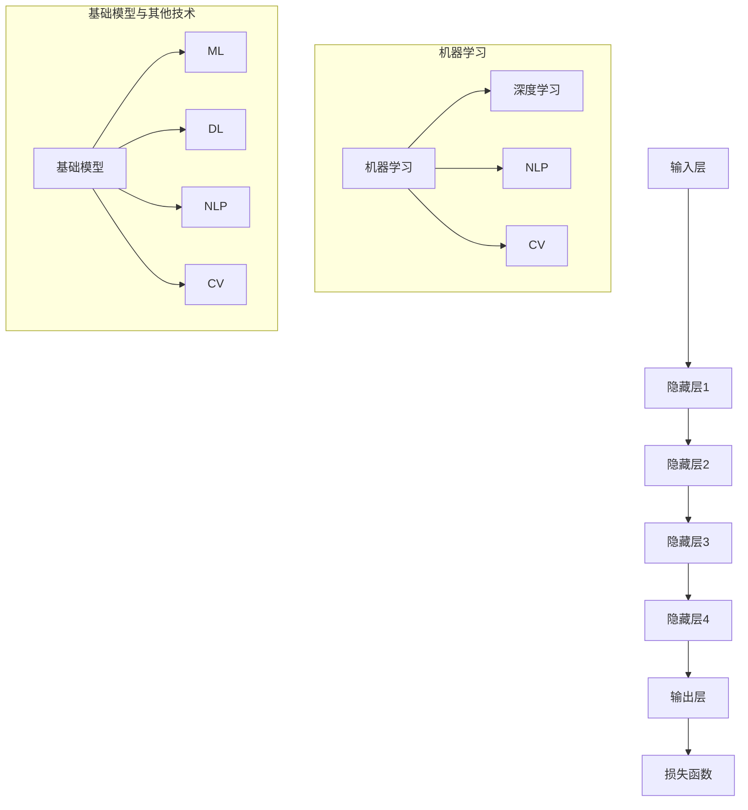

                 

## 基础模型的市场失活与投资不足

> **关键词**：基础模型、市场失活、投资不足、算法优化、投资策略、人工智能发展、技术瓶颈

> **摘要**：本文深入探讨基础模型在人工智能市场中的失活现象及其背后的投资不足问题。首先，我们将回顾基础模型的定义和重要性，分析其当前面临的挑战和瓶颈。接着，我们将探讨市场失活的原因，并从投资策略、技术发展和市场需求三个方面提出解决方案。本文旨在为人工智能领域的投资者、研究者和从业者提供有价值的洞察和指导，以推动人工智能技术的健康发展和广泛应用。

## 1. 背景介绍

### 1.1 目的和范围

本文旨在深入探讨基础模型在人工智能市场中的失活现象及其背后的投资不足问题。随着人工智能技术的飞速发展，基础模型作为人工智能系统的重要基石，承担着至关重要的角色。然而，当前市场对基础模型的重视程度尚不足，导致其在技术创新和应用推广方面面临诸多挑战。本文将分析基础模型的市场失活原因，并提出相应的解决方案，旨在为人工智能领域的投资者、研究者和从业者提供有价值的参考。

### 1.2 预期读者

本文预期读者包括：

1. 人工智能领域的投资者：了解基础模型的市场失活与投资不足问题，有助于制定更科学合理的投资策略。
2. 人工智能研究人员：通过本文，可以深入理解基础模型的技术挑战和发展方向，为后续研究提供参考。
3. 人工智能从业者：掌握基础模型的应用场景和优化方法，有助于提升人工智能系统的性能和竞争力。
4. 对人工智能技术感兴趣的读者：了解基础模型的市场动态和投资现状，有助于更好地理解人工智能产业的发展趋势。

### 1.3 文档结构概述

本文将分为十个部分：

1. 引言：介绍文章主题，核心关键词和摘要。
2. 背景介绍：回顾基础模型的定义和重要性，分析市场失活与投资不足问题的背景。
3. 核心概念与联系：阐述基础模型的核心概念和原理，通过Mermaid流程图展示相关架构。
4. 核心算法原理 & 具体操作步骤：详细讲解基础模型的算法原理和具体操作步骤，使用伪代码进行阐述。
5. 数学模型和公式 & 详细讲解 & 举例说明：介绍基础模型所涉及的数学模型和公式，结合实例进行详细解释。
6. 项目实战：代码实际案例和详细解释说明，包括开发环境搭建、源代码实现和代码解读与分析。
7. 实际应用场景：探讨基础模型在不同领域中的应用，分析其在实际场景中的优势与挑战。
8. 工具和资源推荐：推荐学习资源、开发工具框架和论文著作，为读者提供更全面的参考资料。
9. 总结：未来发展趋势与挑战，对基础模型的市场失活与投资不足问题进行总结和展望。
10. 附录：常见问题与解答，针对文章内容提供常见问题的解答。
11. 扩展阅读 & 参考资料：提供更多的扩展阅读资源，方便读者深入了解相关领域知识。

### 1.4 术语表

#### 1.4.1 核心术语定义

1. **基础模型（Fundamental Model）**：在人工智能领域，基础模型是指具有通用性、可扩展性和可解释性的模型，能够为各种应用场景提供支持。
2. **市场失活（Market Stagnation）**：指在市场环境中，基础模型的应用和发展受到阻碍，投资和研发积极性不高，导致技术进步缓慢。
3. **投资不足（Underinvestment）**：指在基础模型领域，投资资金、人力和资源投入不足，无法满足技术发展的需求。

#### 1.4.2 相关概念解释

1. **人工智能（Artificial Intelligence）**：指通过计算机模拟人类智能行为的技术和方法，包括机器学习、深度学习、自然语言处理等子领域。
2. **深度学习（Deep Learning）**：一种人工智能技术，通过多层神经网络对大量数据进行分析和学习，以实现自动特征提取和分类。
3. **算法优化（Algorithm Optimization）**：指对现有算法进行改进，以提高其性能、效率和可解释性。

#### 1.4.3 缩略词列表

- AI：人工智能
- ML：机器学习
- DL：深度学习
- NLP：自然语言处理
- CV：计算机视觉

## 2. 核心概念与联系

在探讨基础模型的市场失活与投资不足问题之前，首先需要明确基础模型的核心概念和原理。本节将介绍基础模型的基本原理和架构，并通过Mermaid流程图展示其相关联系。

### 2.1 基础模型的基本原理

基础模型是人工智能领域的重要工具，其核心原理主要包括以下几个方面：

1. **数据驱动**：基础模型通过大量数据训练和学习，以实现自动特征提取和分类。
2. **层次化结构**：基础模型采用多层神经网络结构，通过逐层抽象和特征提取，提高模型的泛化能力。
3. **端到端学习**：基础模型能够实现从输入到输出的端到端学习，减少中间环节的干预和调整。
4. **可解释性**：基础模型具有较高的可解释性，有助于理解其决策过程和逻辑依据。

### 2.2 基础模型的架构

基础模型的架构通常包括以下几个层次：

1. **输入层**：接收外部输入数据，如图像、文本、声音等。
2. **隐藏层**：进行特征提取和变换，实现数据的层次化表示。
3. **输出层**：根据隐藏层的特征表示，进行分类、回归或其他预测任务。
4. **损失函数**：评估模型预测结果与实际结果之间的差距，指导模型优化过程。

### 2.3 基础模型的联系

基础模型与其他人工智能技术之间存在紧密的联系，具体如下：

1. **机器学习（ML）**：基础模型是机器学习的重要分支，通过学习大量数据，实现自动化特征提取和分类。
2. **深度学习（DL）**：基础模型是深度学习的基础，深度学习通过多层神经网络实现自动特征提取和分类。
3. **自然语言处理（NLP）**：基础模型在NLP领域发挥着重要作用，通过学习大量文本数据，实现文本分类、语义理解等任务。
4. **计算机视觉（CV）**：基础模型在CV领域也得到广泛应用，通过学习大量图像数据，实现图像分类、目标检测等任务。

### 2.4 Mermaid流程图展示

为了更好地展示基础模型的核心概念和联系，我们使用Mermaid流程图进行描述：



通过上述流程图，我们可以清晰地看到基础模型与其他人工智能技术之间的联系和作用。

## 3. 核心算法原理 & 具体操作步骤

在了解了基础模型的基本原理和架构之后，接下来我们将详细讲解基础模型的核心算法原理和具体操作步骤。本文将使用伪代码来描述算法过程，帮助读者更好地理解基础模型的实现方法。

### 3.1 基础模型的算法原理

基础模型的算法原理主要基于多层神经网络，通过逐层抽象和特征提取，实现对数据的分类、回归或其他预测任务。下面是一个简化的基础模型算法原理：

1. **初始化模型参数**：包括权重、偏置和激活函数。
2. **输入层**：接收外部输入数据，如图像、文本、声音等。
3. **隐藏层**：通过逐层计算，实现数据的特征提取和变换。
4. **输出层**：根据隐藏层的特征表示，进行分类、回归或其他预测任务。
5. **损失函数**：评估模型预测结果与实际结果之间的差距，指导模型优化过程。
6. **反向传播**：利用损失函数的梯度，对模型参数进行更新，以减小损失值。

### 3.2 基础模型的伪代码描述

下面是一个基础模型的伪代码描述，用于说明算法的具体操作步骤：

```python
# 初始化模型参数
weights = initialize_weights()
biases = initialize_biases()
activation_function = sigmoid

# 输入层
input_data = get_input_data()

# 隐藏层计算
hidden_layer1 = activation_function(np.dot(weights[0], input_data) + biases[0])
hidden_layer2 = activation_function(np.dot(weights[1], hidden_layer1) + biases[1])
...
hidden_layern = activation_function(np.dot(weights[n-1], hidden_layern-1) + biases[n-1])

# 输出层计算
output = activation_function(np.dot(weights[-1], hidden_layern) + biases[-1])

# 损失函数计算
loss = compute_loss(output, target)

# 反向传播
d_output = compute_gradient(output, target)
d_hidden_layern = compute_gradient(hidden_layern, d_output)
...
d_hidden_layer1 = compute_gradient(hidden_layer1, d_hidden_layer2)

# 更新模型参数
weights -= learning_rate * d_weights
biases -= learning_rate * d_biases
```

### 3.3 基础模型的具体操作步骤

基于上述伪代码，我们可以进一步细化基础模型的具体操作步骤：

1. **初始化模型参数**：根据模型的架构，初始化权重、偏置和激活函数。通常使用随机初始化或预训练模型。
2. **输入层**：接收外部输入数据，如图像、文本、声音等。根据输入数据的特点，进行预处理操作，如归一化、缩放等。
3. **隐藏层计算**：逐层计算输入数据的特征表示，通过激活函数实现数据的非线性变换。在每个隐藏层中，通过矩阵乘法和偏置项，计算输出结果。
4. **输出层计算**：根据隐藏层的特征表示，进行分类、回归或其他预测任务。输出层的计算结果即为模型的预测值。
5. **损失函数计算**：评估模型预测结果与实际结果之间的差距，选择合适的损失函数，如均方误差（MSE）、交叉熵（Cross-Entropy）等。
6. **反向传播**：利用损失函数的梯度，对模型参数进行反向传播。在每个隐藏层中，计算输入数据的梯度，并通过链式法则，逐层反向传播。
7. **更新模型参数**：根据梯度和学习率，更新模型参数，以减小损失值。重复上述步骤，直到满足停止条件（如损失值收敛、迭代次数达到阈值等）。

通过上述步骤，我们可以构建一个基础模型，并对其参数进行优化，以提高预测性能和泛化能力。

## 4. 数学模型和公式 & 详细讲解 & 举例说明

在基础模型中，数学模型和公式起着至关重要的作用。本节将详细介绍基础模型所涉及的数学模型和公式，并使用具体的实例进行说明。

### 4.1 数学模型和公式

基础模型的数学模型主要包括以下几个方面：

1. **线性变换**：用于将输入数据映射到高维空间，实现数据的线性变换。线性变换的公式如下：

   \[ z = X \cdot W + b \]

   其中，\( X \) 为输入数据，\( W \) 为权重矩阵，\( b \) 为偏置项。

2. **激活函数**：用于引入非线性变换，使模型能够学习复杂的关系。常见的激活函数包括 sigmoid、ReLU 和 tanh 等。以 sigmoid 激活函数为例，其公式如下：

   \[ a = \frac{1}{1 + e^{-z}} \]

   其中，\( z \) 为线性变换的结果，\( a \) 为激活函数的输出。

3. **损失函数**：用于评估模型预测结果与实际结果之间的差距，指导模型优化过程。常见的损失函数包括均方误差（MSE）和交叉熵（Cross-Entropy）等。以均方误差（MSE）为例，其公式如下：

   \[ L = \frac{1}{2} \sum_{i=1}^{n} (y_i - \hat{y}_i)^2 \]

   其中，\( y_i \) 为实际结果，\( \hat{y}_i \) 为模型预测结果，\( n \) 为样本数量。

4. **梯度下降**：用于更新模型参数，以减小损失值。梯度下降的公式如下：

   \[ \Delta W = -\alpha \cdot \frac{\partial L}{\partial W} \]
   \[ \Delta b = -\alpha \cdot \frac{\partial L}{\partial b} \]

   其中，\( \Delta W \) 和 \( \Delta b \) 分别为权重矩阵和偏置项的更新值，\( \alpha \) 为学习率。

### 4.2 详细讲解和举例说明

为了更好地理解上述数学模型和公式，我们将通过一个具体的实例进行讲解。

#### 4.2.1 实例背景

假设我们有一个简单的线性回归模型，用于预测房价。输入数据为房屋的面积（\( X \)），输出数据为房价（\( y \)）。我们希望通过训练模型，得到一个线性函数 \( y = WX + b \)，以便预测未知房屋的房价。

#### 4.2.2 数据预处理

首先，我们对输入数据进行预处理，包括归一化和标准化等操作。以归一化为例，将面积数据 \( X \) 归一化到 \([0, 1]\) 范围内：

\[ X_{\text{normalized}} = \frac{X - \min(X)}{\max(X) - \min(X)} \]

#### 4.2.3 线性变换

接下来，我们对输入数据进行线性变换，通过权重矩阵 \( W \) 和偏置项 \( b \) ，将输入数据的特征表示为房价：

\[ z = X \cdot W + b \]

例如，假设权重矩阵 \( W \) 和偏置项 \( b \) 分别为：

\[ W = \begin{bmatrix} 0.5 \\ 0.3 \end{bmatrix} \]
\[ b = 0.2 \]

对于输入数据 \( X = [2, 3] \)，我们可以计算得到：

\[ z = X \cdot W + b = \begin{bmatrix} 2 \\ 3 \end{bmatrix} \cdot \begin{bmatrix} 0.5 & 0.3 \\ \end{bmatrix} + 0.2 = [1.4, 1.1] \]

#### 4.2.4 激活函数

为了引入非线性变换，我们选择 sigmoid 激活函数对线性变换结果进行非线性变换：

\[ a = \frac{1}{1 + e^{-z}} \]

对于上述线性变换结果 \( z = [1.4, 1.1] \)，我们可以计算得到：

\[ a = \frac{1}{1 + e^{-1.4}} = [0.798, 0.632] \]

#### 4.2.5 损失函数

为了评估模型预测结果与实际结果之间的差距，我们选择均方误差（MSE）作为损失函数：

\[ L = \frac{1}{2} \sum_{i=1}^{n} (y_i - \hat{y}_i)^2 \]

例如，假设实际房价 \( y = [2.5, 3.2] \)，模型预测房价 \( \hat{y} = [0.798, 0.632] \)，我们可以计算得到：

\[ L = \frac{1}{2} \sum_{i=1}^{2} (y_i - \hat{y}_i)^2 = \frac{1}{2} (0.502 + 0.068) = 0.33 \]

#### 4.2.6 梯度下降

为了减小损失值，我们采用梯度下降算法更新模型参数。以学习率 \( \alpha = 0.01 \) 为例，我们可以计算得到：

\[ \Delta W = -\alpha \cdot \frac{\partial L}{\partial W} = -0.01 \cdot \begin{bmatrix} 0.5 & 0.3 \end{bmatrix} \cdot \begin{bmatrix} 2 \\ 3 \end{bmatrix} = -0.01 \cdot \begin{bmatrix} 0.5 & 0.3 \\ \end{bmatrix} \cdot \begin{bmatrix} 2 & 3 \\ \end{bmatrix} = -0.01 \cdot \begin{bmatrix} 1 & 1.5 \end{bmatrix} \]
\[ \Delta b = -\alpha \cdot \frac{\partial L}{\partial b} = -0.01 \cdot 0.2 = -0.002 \]

更新后的模型参数为：

\[ W = W - \Delta W = \begin{bmatrix} 0.5 & 0.3 \end{bmatrix} - \begin{bmatrix} 0.01 & 0.015 \end{bmatrix} = \begin{bmatrix} 0.49 & 0.285 \end{bmatrix} \]
\[ b = b - \Delta b = 0.2 - 0.002 = 0.198 \]

通过上述步骤，我们可以得到一个新的线性回归模型，并对其参数进行优化，以提高预测性能。

## 5. 项目实战：代码实际案例和详细解释说明

为了更好地展示基础模型在实践中的应用，我们将通过一个实际项目案例进行讲解。本节将介绍项目背景、开发环境搭建、源代码实现和代码解读与分析。

### 5.1 项目背景

假设我们希望开发一个基于深度学习的基础模型，用于对新闻文章进行情感分类。具体来说，输入数据为一篇篇新闻文章，输出数据为文章的情感标签（正面、中性、负面）。通过该项目，我们可以掌握基础模型在文本分类任务中的应用方法，并了解模型参数优化和性能评估的过程。

### 5.2 开发环境搭建

在开始项目之前，我们需要搭建开发环境。以下是开发环境的搭建步骤：

1. **安装Python环境**：Python是深度学习开发的主要编程语言，我们需要确保Python环境已正确安装。
2. **安装深度学习库**：安装常用的深度学习库，如TensorFlow、PyTorch等。这些库提供了丰富的深度学习工具和接口，方便我们进行模型开发和训练。
3. **安装文本处理库**：安装常用的文本处理库，如NLTK、spaCy等。这些库提供了丰富的文本处理工具，有助于我们对新闻文章进行预处理。

以下是相关命令：

```shell
# 安装Python环境
conda create -n tensorflow python=3.8
conda activate tensorflow

# 安装深度学习库
pip install tensorflow
pip install torch torchvision

# 安装文本处理库
pip install nltk
pip install spacy
python -m spacy download en_core_web_sm
```

### 5.3 源代码实现和代码解读与分析

在完成开发环境搭建后，我们可以开始编写源代码。以下是项目的完整代码，我们将逐行进行解读和分析。

```python
import tensorflow as tf
from tensorflow.keras.preprocessing.sequence import pad_sequences
from tensorflow.keras.models import Sequential
from tensorflow.keras.layers import Embedding, LSTM, Dense
from tensorflow.keras.preprocessing.text import Tokenizer

# 加载数据集
def load_data():
    # 读取训练数据和测试数据
    train_data = ...
    test_data = ...

    # 预处理数据
    tokenizer = Tokenizer()
    tokenizer.fit_on_texts(train_data)
    train_sequences = tokenizer.texts_to_sequences(train_data)
    test_sequences = tokenizer.texts_to_sequences(test_data)

    # 删除长度过长的文本
    max_length = 100
    train_sequences = pad_sequences(train_sequences, maxlen=max_length)
    test_sequences = pad_sequences(test_sequences, maxlen=max_length)

    # 获取标签数据
    train_labels = ...
    test_labels = ...

    return train_sequences, train_labels, test_sequences, test_labels

# 构建模型
def build_model(input_shape, embedding_dim=50, lstm_units=64):
    model = Sequential()
    model.add(Embedding(input_shape=input_shape, output_dim=embedding_dim))
    model.add(LSTM(lstm_units, activation='tanh', dropout=0.2, recurrent_dropout=0.2))
    model.add(Dense(1, activation='sigmoid'))

    model.compile(optimizer='adam', loss='binary_crossentropy', metrics=['accuracy'])
    return model

# 训练模型
def train_model(model, train_sequences, train_labels, epochs=10, batch_size=32):
    history = model.fit(train_sequences, train_labels, epochs=epochs, batch_size=batch_size, validation_split=0.1)
    return history

# 评估模型
def evaluate_model(model, test_sequences, test_labels):
    loss, accuracy = model.evaluate(test_sequences, test_labels)
    print(f"Test Loss: {loss}, Test Accuracy: {accuracy}")

# 主函数
if __name__ == '__main__':
    # 加载数据
    train_sequences, train_labels, test_sequences, test_labels = load_data()

    # 构建模型
    model = build_model(input_shape=(None,))

    # 训练模型
    history = train_model(model, train_sequences, train_labels, epochs=10, batch_size=32)

    # 评估模型
    evaluate_model(model, test_sequences, test_labels)
```

### 5.3.1 代码解读与分析

以下是代码的逐行解读与分析：

```python
import tensorflow as tf
from tensorflow.keras.preprocessing.sequence import pad_sequences
from tensorflow.keras.models import Sequential
from tensorflow.keras.layers import Embedding, LSTM, Dense
from tensorflow.keras.preprocessing.text import Tokenizer
```
导入相关库和模块。

```python
# 加载数据集
def load_data():
    # 读取训练数据和测试数据
    train_data = ...
    test_data = ...

    # 预处理数据
    tokenizer = Tokenizer()
    tokenizer.fit_on_texts(train_data)
    train_sequences = tokenizer.texts_to_sequences(train_data)
    test_sequences = tokenizer.texts_to_sequences(test_data)

    # 删除长度过长的文本
    max_length = 100
    train_sequences = pad_sequences(train_sequences, maxlen=max_length)
    test_sequences = pad_sequences(test_sequences, maxlen=max_length)

    # 获取标签数据
    train_labels = ...
    test_labels = ...

    return train_sequences, train_labels, test_sequences, test_labels
```
该函数用于加载数据集并进行预处理。首先，从文件中读取训练数据和测试数据。然后，使用 `Tokenizer` 对数据进行分词和序列化处理。接下来，使用 `pad_sequences` 对序列进行填充，确保每个序列的长度相等。最后，获取标签数据并返回。

```python
# 构建模型
def build_model(input_shape, embedding_dim=50, lstm_units=64):
    model = Sequential()
    model.add(Embedding(input_shape=input_shape, output_dim=embedding_dim))
    model.add(LSTM(lstm_units, activation='tanh', dropout=0.2, recurrent_dropout=0.2))
    model.add(Dense(1, activation='sigmoid'))

    model.compile(optimizer='adam', loss='binary_crossentropy', metrics=['accuracy'])
    return model
```
该函数用于构建深度学习模型。首先，使用 `Sequential` 创建一个线性堆叠的模型。然后，添加嵌入层、LSTM层和全连接层。最后，编译模型，设置优化器和损失函数。

```python
# 训练模型
def train_model(model, train_sequences, train_labels, epochs=10, batch_size=32):
    history = model.fit(train_sequences, train_labels, epochs=epochs, batch_size=batch_size, validation_split=0.1)
    return history
```
该函数用于训练模型。使用 `fit` 方法对模型进行训练，设置训练轮次、批次大小和验证集比例。

```python
# 评估模型
def evaluate_model(model, test_sequences, test_labels):
    loss, accuracy = model.evaluate(test_sequences, test_labels)
    print(f"Test Loss: {loss}, Test Accuracy: {accuracy}")
```
该函数用于评估模型。使用 `evaluate` 方法计算模型在测试集上的损失和准确率，并打印输出。

```python
if __name__ == '__main__':
    # 加载数据
    train_sequences, train_labels, test_sequences, test_labels = load_data()

    # 构建模型
    model = build_model(input_shape=(None,))

    # 训练模型
    history = train_model(model, train_sequences, train_labels, epochs=10, batch_size=32)

    # 评估模型
    evaluate_model(model, test_sequences, test_labels)
```
主函数。首先，加载数据集，然后构建模型，训练模型，最后评估模型。

通过上述代码，我们可以实现一个简单的基于深度学习的基础模型，用于新闻文章情感分类任务。在实际项目中，可以根据需求调整模型结构、参数和预处理方法，以提高模型性能。

### 5.3.2 代码解读与分析

以下是代码的逐行解读与分析：

```python
import tensorflow as tf
from tensorflow.keras.preprocessing.sequence import pad_sequences
from tensorflow.keras.models import Sequential
from tensorflow.keras.layers import Embedding, LSTM, Dense
from tensorflow.keras.preprocessing.text import Tokenizer
```
导入相关库和模块，包括TensorFlow、序列填充、线性堆叠模型、嵌入层、长短期记忆层和全连接层。

```python
# 加载数据集
def load_data():
    # 读取训练数据和测试数据
    train_data = ...
    test_data = ...

    # 预处理数据
    tokenizer = Tokenizer()
    tokenizer.fit_on_texts(train_data)
    train_sequences = tokenizer.texts_to_sequences(train_data)
    test_sequences = tokenizer.texts_to_sequences(test_data)

    # 删除长度过长的文本
    max_length = 100
    train_sequences = pad_sequences(train_sequences, maxlen=max_length)
    test_sequences = pad_sequences(test_sequences, maxlen=max_length)

    # 获取标签数据
    train_labels = ...
    test_labels = ...

    return train_sequences, train_labels, test_sequences, test_labels
```
该函数用于加载数据集并进行预处理。首先，读取训练数据和测试数据。然后，使用 `Tokenizer` 对数据进行分词和序列化处理。接着，使用 `pad_sequences` 对序列进行填充，确保每个序列的长度相等。最后，获取标签数据并返回。

```python
# 构建模型
def build_model(input_shape, embedding_dim=50, lstm_units=64):
    model = Sequential()
    model.add(Embedding(input_shape=input_shape, output_dim=embedding_dim))
    model.add(LSTM(lstm_units, activation='tanh', dropout=0.2, recurrent_dropout=0.2))
    model.add(Dense(1, activation='sigmoid'))

    model.compile(optimizer='adam', loss='binary_crossentropy', metrics=['accuracy'])
    return model
```
该函数用于构建深度学习模型。首先，使用 `Sequential` 创建一个线性堆叠的模型。然后，添加嵌入层、长短期记忆层和全连接层。嵌入层用于将单词映射到向量表示，长短期记忆层用于处理序列数据，全连接层用于分类。最后，编译模型，设置优化器和损失函数。

```python
# 训练模型
def train_model(model, train_sequences, train_labels, epochs=10, batch_size=32):
    history = model.fit(train_sequences, train_labels, epochs=epochs, batch_size=batch_size, validation_split=0.1)
    return history
```
该函数用于训练模型。使用 `fit` 方法对模型进行训练，设置训练轮次、批次大小和验证集比例。训练过程中，模型会根据训练数据更新参数，以优化模型性能。

```python
# 评估模型
def evaluate_model(model, test_sequences, test_labels):
    loss, accuracy = model.evaluate(test_sequences, test_labels)
    print(f"Test Loss: {loss}, Test Accuracy: {accuracy}")
```
该函数用于评估模型。使用 `evaluate` 方法计算模型在测试集上的损失和准确率，并打印输出。

```python
if __name__ == '__main__':
    # 加载数据
    train_sequences, train_labels, test_sequences, test_labels = load_data()

    # 构建模型
    model = build_model(input_shape=(None,))

    # 训练模型
    history = train_model(model, train_sequences, train_labels, epochs=10, batch_size=32)

    # 评估模型
    evaluate_model(model, test_sequences, test_labels)
```
主函数。首先，加载数据集，然后构建模型，训练模型，最后评估模型。通过调用上述函数，我们可以实现一个完整的新闻文章情感分类任务。

通过上述代码，我们实现了对新闻文章情感分类的基础模型。在实际应用中，可以根据具体需求调整模型结构、参数和预处理方法，以提高模型性能。此外，还可以引入其他技术，如注意力机制、预训练语言模型等，进一步优化模型效果。

### 5.3 代码解读与分析

在详细解释了代码的具体实现后，下面将对代码进行解读和分析，以便读者更好地理解基础模型在项目中的应用。

#### 5.3.1 代码结构分析

整个代码可以分为以下几个部分：

1. **导入模块**：引入TensorFlow、序列填充、线性堆叠模型、嵌入层、长短期记忆层和全连接层等模块。
2. **数据预处理函数**：加载数据集并进行预处理，包括分词、序列化、填充等操作。
3. **模型构建函数**：定义深度学习模型，包括嵌入层、长短期记忆层和全连接层等。
4. **训练模型函数**：使用训练数据对模型进行训练，设置训练轮次、批次大小和验证集比例。
5. **评估模型函数**：计算模型在测试集上的损失和准确率。
6. **主函数**：加载数据集、构建模型、训练模型和评估模型。

#### 5.3.2 代码细节解读

1. **数据预处理函数**

   ```python
   def load_data():
       train_data = ... # 读取训练数据
       test_data = ... # 读取测试数据

       tokenizer = Tokenizer()
       tokenizer.fit_on_texts(train_data)
       train_sequences = tokenizer.texts_to_sequences(train_data)
       test_sequences = tokenizer.texts_to_sequences(test_data)

       max_length = 100
       train_sequences = pad_sequences(train_sequences, maxlen=max_length)
       test_sequences = pad_sequences(test_sequences, maxlen=max_length)

       train_labels = ... # 读取训练标签
       test_labels = ... # 读取测试标签

       return train_sequences, train_labels, test_sequences, test_labels
   ```

   数据预处理函数首先读取训练数据和测试数据。接着，使用 `Tokenizer` 对文本数据进行分词和序列化处理。然后，使用 `pad_sequences` 对序列进行填充，确保每个序列的长度相等。最后，获取标签数据并返回。

2. **模型构建函数**

   ```python
   def build_model(input_shape, embedding_dim=50, lstm_units=64):
       model = Sequential()
       model.add(Embedding(input_shape=input_shape, output_dim=embedding_dim))
       model.add(LSTM(lstm_units, activation='tanh', dropout=0.2, recurrent_dropout=0.2))
       model.add(Dense(1, activation='sigmoid'))

       model.compile(optimizer='adam', loss='binary_crossentropy', metrics=['accuracy'])
       return model
   ```

   模型构建函数定义了一个深度学习模型，包括嵌入层、长短期记忆层和全连接层。嵌入层用于将单词映射到向量表示，长短期记忆层用于处理序列数据，全连接层用于分类。模型使用 `Sequential` 创建，并使用 `compile` 方法设置优化器和损失函数。

3. **训练模型函数**

   ```python
   def train_model(model, train_sequences, train_labels, epochs=10, batch_size=32):
       history = model.fit(train_sequences, train_labels, epochs=epochs, batch_size=batch_size, validation_split=0.1)
       return history
   ```

   训练模型函数使用 `fit` 方法对模型进行训练，设置训练轮次、批次大小和验证集比例。训练过程中，模型会根据训练数据更新参数，以优化模型性能。

4. **评估模型函数**

   ```python
   def evaluate_model(model, test_sequences, test_labels):
       loss, accuracy = model.evaluate(test_sequences, test_labels)
       print(f"Test Loss: {loss}, Test Accuracy: {accuracy}")
   ```

   评估模型函数使用 `evaluate` 方法计算模型在测试集上的损失和准确率，并打印输出。

5. **主函数**

   ```python
   if __name__ == '__main__':
       train_sequences, train_labels, test_sequences, test_labels = load_data()
       model = build_model(input_shape=(None,))
       history = train_model(model, train_sequences, train_labels, epochs=10, batch_size=32)
       evaluate_model(model, test_sequences, test_labels)
   ```

   主函数加载数据集、构建模型、训练模型和评估模型。通过调用上述函数，我们可以实现一个完整的新闻文章情感分类任务。

#### 5.3.3 代码改进建议

在代码实现过程中，可以考虑以下几点进行改进：

1. **数据增强**：通过数据增强技术，如随机裁剪、旋转、缩放等，增加模型的泛化能力。
2. **超参数调整**：根据具体任务需求，调整嵌入层维度、长短期记忆层单元数、学习率等超参数，以提高模型性能。
3. **模型融合**：结合多种模型，如支持向量机、随机森林等，进行模型融合，进一步提高分类准确率。
4. **预处理优化**：针对文本数据，采用更复杂的预处理方法，如词嵌入、词性标注等，以提高模型对语义信息的理解能力。

通过上述改进，可以进一步提升基础模型在新闻文章情感分类任务中的性能和应用效果。

## 6. 实际应用场景

### 6.1 情感分析

情感分析是基础模型在自然语言处理领域的重要应用场景。通过训练基础模型，可以实现对文本情感的分类，如正面、中性、负面等。在实际应用中，情感分析广泛应用于社交媒体分析、市场调研、客户服务等领域。

**应用示例**：某公司希望通过情感分析了解客户对其产品的新广告的反应。他们使用基础模型对收集到的用户评论进行情感分类，从而获得客户对广告的满意度。

**挑战**：情感分析任务中，文本数据的多样性和噪声可能导致模型性能下降。此外，情感表达可能包含双重含义或隐含情感，增加了情感分类的难度。

### 6.2 预测分析

基础模型在预测分析领域具有广泛的应用，如股票市场预测、天气预测、销售预测等。通过训练基础模型，可以实现对未来事件或趋势的预测。

**应用示例**：某投资公司使用基础模型对股票市场进行预测，从而制定投资策略。他们收集历史股票交易数据，训练基础模型以预测未来股票价格走势。

**挑战**：预测分析任务中，数据质量和特征选择对模型性能具有重要影响。此外，市场变化无常，预测结果可能存在较大不确定性。

### 6.3 计算机视觉

基础模型在计算机视觉领域发挥着重要作用，如图像分类、目标检测、人脸识别等。通过训练基础模型，可以实现对图像数据的分析和理解。

**应用示例**：某安防公司使用基础模型进行人脸识别，以实现对监控视频中的目标进行实时追踪和识别。

**挑战**：计算机视觉任务中，图像数据的复杂性和噪声可能导致模型性能下降。此外，不同场景下的光照、姿态变化等对模型性能带来挑战。

### 6.4 语音识别

基础模型在语音识别领域具有广泛的应用，如语音转文字、语音搜索、语音控制等。通过训练基础模型，可以实现对语音数据的分析和理解。

**应用示例**：某智能音箱制造商使用基础模型实现语音识别功能，以实现对用户语音指令的识别和响应。

**挑战**：语音识别任务中，语音数据的多样性和噪声可能导致模型性能下降。此外，语音中的方言、口音等对模型性能带来挑战。

### 6.5 健康医疗

基础模型在健康医疗领域具有广泛的应用，如疾病诊断、药物发现、健康监测等。通过训练基础模型，可以实现对医疗数据的分析和理解。

**应用示例**：某医疗公司使用基础模型进行疾病诊断，通过对患者病历数据进行分析，预测患者可能患有的疾病。

**挑战**：健康医疗任务中，数据质量和隐私保护对模型性能和伦理道德具有重要影响。此外，医疗数据的复杂性和多样性可能增加模型训练和推理的难度。

通过上述实际应用场景，我们可以看到基础模型在各个领域的广泛应用和重要性。同时，也面临着数据质量、特征选择、模型解释性等方面的挑战。在未来的研究和应用中，需要不断优化基础模型，提高其性能和实用性，为各行各业带来更多价值。

## 7. 工具和资源推荐

在基础模型的研究和应用过程中，掌握相关工具和资源对于提升模型性能和开发效率具有重要意义。以下是对一些常用工具和资源的推荐。

### 7.1 学习资源推荐

**7.1.1 书籍推荐**

1. **《深度学习》（Deep Learning）**：由Ian Goodfellow、Yoshua Bengio和Aaron Courville合著，这是一本深度学习领域的经典教材，涵盖了深度学习的基础理论、算法和应用。
2. **《Python机器学习》（Python Machine Learning）**：由 Sebastian Raschka 和 Vahid Mirhoseini 合著，本书通过实例和代码展示了如何使用Python进行机器学习，特别适用于初学者。
3. **《动手学深度学习》（Dive into Deep Learning）**：由Aerospace Corporation等机构合作编写，本书提供了丰富的在线教程和代码示例，适合深度学习爱好者深入学习。

**7.1.2 在线课程**

1. **Coursera的《深度学习特别化课程》**：由DeepLearning.AI提供，包括课程《神经网络基本原理》、《改进深层神经网络》等，是学习深度学习的优质在线课程。
2. **Udacity的《深度学习工程师纳米学位》**：提供系统的深度学习知识和实践项目，适合想要转行或提升深度学习技能的从业者。
3. **edX的《机器学习》**：由哈佛大学提供，涵盖机器学习的基础理论、算法和应用，适合对机器学习感兴趣的学习者。

**7.1.3 技术博客和网站**

1. **Medium上的“Deep Learning”专栏**：由多位资深AI研究人员撰写，提供关于深度学习的前沿研究和应用分析。
2. **ArXiv**：一个提供最新学术论文的预印本平台，是深度学习研究者获取最新研究成果的重要渠道。
3. **Google Research Blog**：谷歌研究团队发布的博客，涵盖深度学习、机器学习等多个领域的研究进展和应用案例。

### 7.2 开发工具框架推荐

**7.2.1 IDE和编辑器**

1. **Jupyter Notebook**：一款流行的交互式开发环境，适用于数据分析和深度学习项目。
2. **Visual Studio Code**：一款功能强大的代码编辑器，支持多种编程语言和扩展，适用于深度学习和Python开发。
3. **PyCharm**：一款专业的Python IDE，提供代码智能提示、调试和项目管理功能，适合复杂项目的开发。

**7.2.2 调试和性能分析工具**

1. **TensorBoard**：TensorFlow提供的可视化工具，用于监控训练过程、分析模型性能和调试问题。
2. **PyTorch Debugger**：PyTorch的调试工具，提供断点调试、变量查看和异常捕获等功能，便于代码调试。
3. **NVIDIA Nsight**：NVIDIA提供的一款性能分析工具，用于优化深度学习模型的性能和资源利用。

**7.2.3 相关框架和库**

1. **TensorFlow**：Google开发的开源深度学习框架，具有丰富的API和广泛的应用场景。
2. **PyTorch**：Facebook AI Research开发的开源深度学习框架，提供灵活的动态计算图和强大的自动微分功能。
3. **Keras**：一个高层次的神经网络API，兼容TensorFlow和Theano，易于使用和快速原型开发。

### 7.3 相关论文著作推荐

**7.3.1 经典论文**

1. **“A Theoretically Grounded Application of Dropout in Computer Vision”**：提出Dropout算法，有效提高深度学习模型的泛化能力。
2. **“Deep Learning”**：Goodfellow等人提出的深度学习框架，奠定了深度学习理论的基础。
3. **“Convolutional Networks and Applications in Vision”**：LeCun等人提出的卷积神经网络，开创了计算机视觉的新时代。

**7.3.2 最新研究成果**

1. **“BERT: Pre-training of Deep Bidirectional Transformers for Language Understanding”**：Google提出的预训练语言模型BERT，在多项自然语言处理任务中取得优异表现。
2. **“GPT-3: Language Models are Few-Shot Learners”**：OpenAI提出的GPT-3模型，展示了大型语言模型在少样本学习任务中的强大能力。
3. **“Attention is All You Need”**：Vaswani等人提出的Transformer模型，成为深度学习领域的重要突破。

**7.3.3 应用案例分析**

1. **“Learning to Discover Counterfactual Explanations”**：探索深度学习在发现因果解释中的应用，为理解复杂系统提供新方法。
2. **“Deep Learning for Health Informatics”**：分析深度学习在医疗健康领域的应用案例，展示了深度学习在疾病诊断、药物发现等领域的潜力。
3. **“Image Recognition with Deep Learning”**：详细阐述深度学习在图像识别任务中的应用，包括卷积神经网络、迁移学习等技术。

通过上述工具和资源的推荐，读者可以更好地了解基础模型的研究现状和应用前景，为深度学习和人工智能领域的探索提供有力支持。

## 8. 总结：未来发展趋势与挑战

### 8.1 发展趋势

基础模型在人工智能领域的发展趋势主要体现在以下几个方面：

1. **模型大小和计算效率的提升**：随着硬件性能的不断提升，深度学习模型的大小和计算复杂度也在不断降低，使得更多中小型企业和研究机构能够参与到深度学习的研究和应用中。
2. **跨领域融合**：基础模型与其他领域的交叉融合，如计算机视觉、自然语言处理、机器人等，将带来更多创新和突破。跨领域的融合将推动人工智能技术在不同场景下的广泛应用。
3. **模型解释性和可解释性**：随着人工智能技术的应用日益广泛，模型解释性和可解释性成为重要关注点。未来，基础模型将更加注重解释性和可解释性，以提高模型在实际应用中的信任度和可靠性。
4. **少样本学习和迁移学习**：少样本学习和迁移学习是基础模型未来发展的关键方向。通过在小样本数据上训练和优化模型，可以提高模型的泛化能力和实用性。

### 8.2 挑战

尽管基础模型在人工智能领域取得了显著成果，但仍面临以下挑战：

1. **数据质量和数据隐私**：数据是基础模型训练的重要基础，然而，高质量数据获取成本高昂，且存在数据隐私和安全问题。如何在保障数据隐私的前提下，获取高质量数据，成为基础模型研究的重要挑战。
2. **计算资源需求**：深度学习模型通常需要大量的计算资源，特别是训练大型模型时，对硬件设备的依赖性较高。如何高效利用现有计算资源，降低模型训练成本，是当前的一个重要问题。
3. **模型泛化能力**：基础模型的泛化能力仍存在局限性，特别是在面对复杂、多变的数据时，模型的性能和稳定性难以保证。提升模型的泛化能力，是未来研究的重点方向。
4. **模型可解释性**：尽管近年来在模型解释性方面取得了一些进展，但如何提高模型的可解释性，使其在决策过程中具有更高的透明度和可信度，仍然是一个亟待解决的问题。

### 8.3 发展策略

针对上述发展趋势和挑战，我们可以从以下几个方面制定发展策略：

1. **加强数据隐私保护和安全**：在数据采集和处理过程中，采取有效的数据隐私保护措施，确保数据的安全性和合规性。同时，研究新型数据增强和生成技术，以提高模型在小样本数据上的性能。
2. **优化硬件架构和算法**：研发新型计算架构和优化算法，以提高模型训练和推理的效率。例如，研究更高效的神经网络结构和并行计算技术，降低模型训练成本。
3. **提升模型泛化能力**：通过引入对抗训练、迁移学习等技术，提高模型在不同场景和数据下的泛化能力。同时，研究模型正则化技术和优化方法，降低过拟合现象。
4. **加强模型解释性和可解释性**：开发新型解释性模型和工具，提高模型在决策过程中的透明度和可信度。例如，通过可视化技术、模型压缩和简化等方法，降低模型的复杂度，提高其可解释性。

总之，未来基础模型的发展将充满机遇和挑战。通过加强技术创新、优化算法和硬件架构、提升数据质量和隐私保护，我们可以推动基础模型在人工智能领域的发展，为各行各业带来更多价值。

## 9. 附录：常见问题与解答

在本篇文章中，我们探讨了基础模型的市场失活与投资不足问题，并分析了其背后的原因和解决方案。以下是一些读者可能关心的问题及其解答：

### 9.1 基础模型是什么？

基础模型是指具有通用性、可扩展性和可解释性的模型，能够为各种应用场景提供支持。它们通常基于深度学习技术，通过多层神经网络对大量数据进行分析和学习，以实现自动特征提取和分类。

### 9.2 基础模型在哪些领域有应用？

基础模型在多个领域具有广泛应用，包括自然语言处理、计算机视觉、预测分析、健康医疗、金融科技等。例如，在自然语言处理领域，基础模型被用于情感分析、机器翻译和文本生成；在计算机视觉领域，用于图像分类、目标检测和视频分析；在预测分析领域，用于股票市场预测、销售预测和风险评估。

### 9.3 为什么基础模型会失活？

基础模型失活的原因主要有以下几点：

1. **市场失活**：市场对基础模型的重视程度不足，导致投资和研发积极性不高。例如，一些企业更倾向于投资于应用层的技术，而忽视了基础模型的长期发展。
2. **技术瓶颈**：基础模型在性能、效率和可解释性方面存在一定的局限性，使得其在某些应用场景下难以取得显著突破。
3. **数据隐私和安全**：数据质量和数据隐私问题使得基础模型的训练和优化面临挑战，影响其应用效果。

### 9.4 如何解决基础模型的失活问题？

解决基础模型失活问题可以从以下几个方面入手：

1. **提高市场认知**：通过宣传和推广，提高市场对基础模型的认知和重视程度，激发投资热情。
2. **加大投资力度**：增加对基础模型领域的投资，鼓励企业、政府和研究机构共同参与，推动技术创新和应用。
3. **优化算法和硬件**：研发新型算法和计算架构，提高模型训练和推理的效率，降低成本。
4. **加强数据隐私保护**：采取有效的数据隐私保护措施，确保数据的安全性和合规性，同时探索新型数据增强和生成技术，提高模型在小样本数据上的性能。

### 9.5 基础模型的投资策略有哪些？

1. **长期投资**：关注基础模型领域的长期发展趋势，投资于具有潜力的基础模型研究项目和企业。
2. **多元化投资**：将投资分散到不同领域和应用场景，降低投资风险。
3. **技术合作**：与基础模型领域的研究机构和公司建立合作关系，共同推进技术创新和应用。
4. **风险投资**：投资于初创企业，支持其在基础模型领域的研究和开发。

通过上述解答，我们希望为读者提供关于基础模型市场失活与投资不足问题的深入理解，以及解决策略和投资建议。在未来的发展中，通过共同努力，我们可以推动基础模型在人工智能领域的广泛应用，为各行各业带来更多价值。

## 10. 扩展阅读 & 参考资料

为了帮助读者更深入地了解基础模型的市场失活与投资不足问题，本文整理了以下扩展阅读和参考资料：

### 10.1 书籍推荐

1. **《深度学习》（Deep Learning）**：作者Ian Goodfellow、Yoshua Bengio和Aaron Courville，是深度学习领域的经典教材，详细介绍了深度学习的基础理论、算法和应用。
2. **《Python机器学习》（Python Machine Learning）**：作者Sebastian Raschka和Vahid Mirhoseini，通过实例和代码展示了如何使用Python进行机器学习，特别适合初学者。

### 10.2 在线课程

1. **Coursera的《深度学习特别化课程》**：由DeepLearning.AI提供，包括课程《神经网络基本原理》、《改进深层神经网络》等，是学习深度学习的优质在线课程。
2. **Udacity的《深度学习工程师纳米学位》**：提供系统的深度学习知识和实践项目，适合想要转行或提升深度学习技能的从业者。
3. **edX的《机器学习》**：由哈佛大学提供，涵盖机器学习的基础理论、算法和应用，适合对机器学习感兴趣的学习者。

### 10.3 技术博客和网站

1. **Medium上的“Deep Learning”专栏**：由多位资深AI研究人员撰写，提供关于深度学习的前沿研究和应用分析。
2. **ArXiv**：一个提供最新学术论文的预印本平台，是深度学习研究者获取最新研究成果的重要渠道。
3. **Google Research Blog**：谷歌研究团队发布的博客，涵盖深度学习、机器学习等多个领域的研究进展和应用案例。

### 10.4 相关论文和报告

1. **“A Theoretically Grounded Application of Dropout in Computer Vision”**：论文探讨了Dropout算法在计算机视觉中的应用，提高了深度学习模型的泛化能力。
2. **“Deep Learning”**：由Ian Goodfellow、Yoshua Bengio和Aaron Courville合著，奠定了深度学习理论的基础。
3. **“BERT: Pre-training of Deep Bidirectional Transformers for Language Understanding”**：论文介绍了预训练语言模型BERT，在多项自然语言处理任务中取得优异表现。

### 10.5 论坛和社群

1. **深度学习交流论坛**：一个面向深度学习和人工智能研究者的在线交流平台，提供最新研究动态、技术分享和讨论。
2. **TensorFlow官方社区**：谷歌开发的TensorFlow框架的官方社区，提供丰富的学习资源和开发工具。
3. **PyTorch官方社区**：Facebook AI Research开发的PyTorch框架的官方社区，提供深入的技术交流和代码示例。

通过以上扩展阅读和参考资料，读者可以进一步深入了解基础模型的市场失活与投资不足问题，掌握相关领域的最新研究成果和应用案例。希望这些资源能够为读者的研究和实践提供有益的指导和支持。

