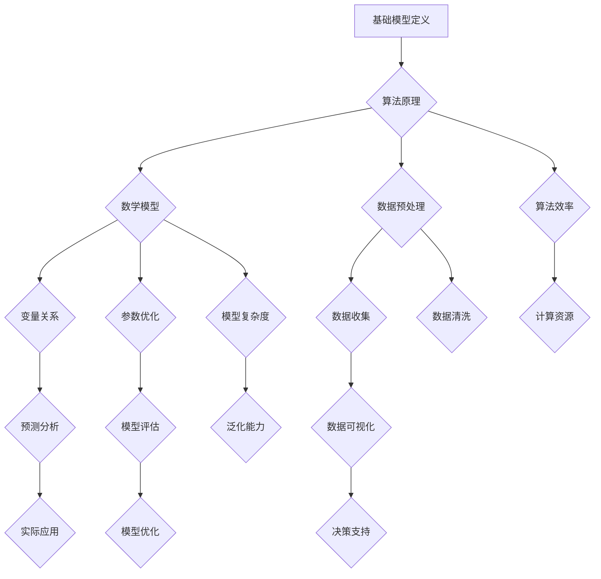

                 

# 基础模型的社会合作与技术发展

> 关键词：基础模型、社会合作、技术发展、算法原理、数学模型、实际应用、未来趋势

> 摘要：本文将深入探讨基础模型在社会合作与技术发展中的重要作用。通过分析基础模型的定义、核心概念及其在社会技术中的角色，本文将逐步阐述其算法原理、数学模型、实际应用，并对未来发展趋势和挑战进行展望。文章旨在为读者提供全面而深入的理解，引导其在技术领域的发展与应用。

## 1. 背景介绍

### 1.1 目的和范围

本文旨在探讨基础模型在社会合作与技术发展中的关键作用。我们将从基础模型的定义出发，逐步分析其在社会技术中的角色和重要性。通过详细阐述其算法原理、数学模型和实际应用，我们将揭示基础模型如何推动技术进步和社会合作。此外，本文还将对未来的发展趋势和挑战进行展望，以帮助读者理解基础模型在技术发展中的潜力与局限。

### 1.2 预期读者

本文主要面向对计算机科学、人工智能和数学感兴趣的读者，特别是那些希望深入了解基础模型在社会技术中作用的科技工作者、研究人员和学生。同时，对技术发展有热情的普通读者也将从本文中获得丰富的知识和见解。

### 1.3 文档结构概述

本文分为十个主要部分，每个部分都围绕基础模型的不同方面展开。首先，我们将介绍基础模型的基本概念和定义。随后，通过Mermaid流程图，我们将详细展示基础模型的核心概念和架构。接着，我们将深入分析基础模型的算法原理和操作步骤，并使用数学模型进行详细讲解。此外，我们还将通过实际案例展示基础模型在项目实战中的应用。随后，本文将探讨基础模型在多种实际应用场景中的表现，并提供一系列学习资源和工具推荐。最后，我们将总结基础模型的发展趋势与挑战，并为读者提供常见问题解答和扩展阅读建议。

### 1.4 术语表

#### 1.4.1 核心术语定义

- **基础模型**：一种用于描述复杂系统或现象的抽象结构，通常包含一组规则和算法，用于理解和预测系统行为。
- **社会合作**：不同个体、组织或群体之间为了共同目标而进行的协作和互动。
- **技术发展**：通过研究和创新，推动科技产品和服务的进步和改进。

#### 1.4.2 相关概念解释

- **算法原理**：基础模型的核心组成部分，描述了如何通过特定步骤和操作解决问题或实现目标。
- **数学模型**：用于描述基础模型中变量、参数和关系的形式化数学表达式。
- **实际应用**：基础模型在实际问题或场景中的具体实现和运用。

#### 1.4.3 缩略词列表

- **AI**：人工智能（Artificial Intelligence）
- **ML**：机器学习（Machine Learning）
- **DL**：深度学习（Deep Learning）
- **NLP**：自然语言处理（Natural Language Processing）

## 2. 核心概念与联系

为了更好地理解基础模型在社会合作和技术发展中的关键作用，我们需要首先明确其核心概念和架构。以下是通过Mermaid流程图展示的基础模型的核心概念和联系：



在这个流程图中，基础模型的核心概念包括：

- **算法原理**：基础模型的核心组成部分，描述了解决问题的算法和步骤。
- **数学模型**：用于描述基础模型中变量、参数和关系的形式化数学表达式。
- **数据预处理**：包括数据收集、数据清洗和数据可视化，为算法原理和数学模型提供高质量的数据输入。
- **变量关系**：数学模型中的变量和参数之间的关系，影响模型的预测性能和泛化能力。
- **参数优化**：通过调整参数来优化模型性能，提高算法效率和模型复杂度。
- **模型评估**：评估模型的性能和泛化能力，为模型优化提供依据。
- **实际应用**：基础模型在实际问题或场景中的具体实现和运用。

通过这个流程图，我们可以清晰地看到基础模型的核心概念和联系，为后续的详细分析提供了基础。

## 3. 核心算法原理 & 具体操作步骤

### 3.1 算法原理

基础模型的算法原理是其核心，决定了模型的功能和性能。算法原理通常包括以下几个关键部分：

- **输入与输出**：基础模型接收输入数据（如文本、图像、声音等），通过算法处理生成预测结果或决策。
- **数据处理**：对输入数据进行预处理，包括数据清洗、归一化、特征提取等，以提高算法的效率和准确性。
- **模型结构**：基础模型的结构设计，通常包括多个层（如神经网络中的隐藏层），每个层负责不同的数据处理任务。
- **激活函数**：用于引入非线性关系，使模型能够学习复杂的数据特征。
- **损失函数**：用于评估模型预测结果与真实结果的差距，指导模型参数的优化。
- **优化算法**：通过迭代优化模型参数，以最小化损失函数，提高模型性能。

以下是一个简化版的神经网络算法原理伪代码：

```pseudo
initialize parameters (weights and biases)
for each epoch do
    for each sample in training dataset do
        forward_pass(sample)
        calculate_loss(predicted_output, actual_output)
        backward_pass(loss)
        update_parameters(learning_rate)
    end for
end for
```

### 3.2 具体操作步骤

1. **初始化参数**：
   - 随机初始化模型的权重（weights）和偏置（biases）。
   
2. **前向传播**：
   - 对输入数据进行处理，通过网络的多个层进行计算，得到模型的预测输出。

3. **计算损失**：
   - 使用损失函数（如均方误差MSE）计算预测输出与实际输出之间的差距。

4. **反向传播**：
   - 计算梯度，将损失函数关于参数的导数反向传播到每个层，以更新参数。

5. **参数更新**：
   - 根据梯度下降算法，更新模型参数，以最小化损失函数。

6. **模型评估**：
   - 在验证集上评估模型的性能，调整学习率等超参数，以避免过拟合。

7. **迭代优化**：
   - 重复前向传播、反向传播和参数更新的过程，直到满足停止条件（如达到预定的迭代次数或模型性能不再提高）。

通过这些具体操作步骤，基础模型可以逐步学习并优化其参数，从而提高预测准确性和泛化能力。

## 4. 数学模型和公式 & 详细讲解 & 举例说明

### 4.1 数学模型概述

基础模型通常基于数学模型进行设计和优化。数学模型的核心在于描述变量之间的关系，并通过这些关系来预测或优化系统行为。以下是一个简单的神经网络数学模型，用于处理回归问题：

#### 回归问题的神经网络模型：

假设我们有 \(n\) 个输入特征 \(x_1, x_2, ..., x_n\) 和一个输出特征 \(y\)，神经网络模型可以表示为：

$$
\hat{y} = \sigma(\sum_{i=1}^{n} w_i x_i + b)
$$

其中：
- \(\hat{y}\) 是预测的输出值。
- \(\sigma\) 是激活函数，通常使用 sigmoid 函数：
  $$
  \sigma(z) = \frac{1}{1 + e^{-z}}
  $$
- \(w_i\) 是第 \(i\) 个输入特征的权重。
- \(b\) 是偏置项。

#### 损失函数

为了评估模型预测的准确性，我们通常使用均方误差（MSE）作为损失函数：

$$
\text{MSE} = \frac{1}{2} \sum_{i=1}^{n} (\hat{y}_i - y_i)^2
$$

其中：
- \(\hat{y}_i\) 是模型对第 \(i\) 个样本的预测值。
- \(y_i\) 是第 \(i\) 个样本的真实输出值。

### 4.2 公式详细讲解

1. **激活函数**：

   激活函数是神经网络中的一个关键组成部分，用于引入非线性关系。常见的激活函数有 sigmoid、ReLU（Rectified Linear Unit）和 tanh（双曲正切函数）。

   - **sigmoid 函数**：

     $$
     \sigma(z) = \frac{1}{1 + e^{-z}}
     $$

     sigmoid 函数在神经网络中常用于输出层，将线性组合的值映射到 \(0\) 到 \(1\) 之间。

   - **ReLU 函数**：

     $$
     \text{ReLU}(z) = \max(0, z)
     $$

     ReLU 函数在输入为负值时输出 \(0\)，在输入为正值时输出输入值。ReLU 函数在训练过程中加速收敛，并且减少了梯度消失的问题。

   - **tanh 函数**：

     $$
     \text{tanh}(z) = \frac{e^z - e^{-z}}{e^z + e^{-z}}
     $$

     tanh 函数与 sigmoid 函数类似，但输出范围在 \(-1\) 到 \(1\) 之间，可以更好地处理输入数据的范围。

2. **损失函数**：

   损失函数用于衡量模型预测值与真实值之间的差距。均方误差（MSE）是一种常用的损失函数，可以直观地表示预测误差的平方和。其他常用的损失函数还包括交叉熵（Cross-Entropy）和平均绝对误差（MAE）。

### 4.3 举例说明

假设我们有一个简单的一层神经网络，用于预测房价。输入特征包括房屋面积、房间数量和建造年份。我们使用均方误差（MSE）作为损失函数，学习率设为 \(0.01\)。

1. **初始化参数**：

   - 权重 \(w_1 = 0.1\), \(w_2 = 0.2\), \(w_3 = 0.3\)
   - 偏置 \(b = 0.5\)

2. **前向传播**：

   - 输入特征 \(x_1 = 1500\), \(x_2 = 3\), \(x_3 = 2000\)
   - 预测输出 \(\hat{y} = \sigma(w_1 x_1 + w_2 x_2 + w_3 x_3 + b) = \sigma(0.1 \times 1500 + 0.2 \times 3 + 0.3 \times 2000 + 0.5) = 0.824\)

3. **计算损失**：

   - 真实输出 \(y = 200,000\)
   - 损失 \(L = \text{MSE}(\hat{y}, y) = \frac{1}{2} ((0.824 - 200)^2) = 64.37\)

4. **反向传播**：

   - 计算梯度：
     $$
     \frac{\partial L}{\partial w_1} = 0.824 \times (1 - 0.824) \times x_1 = 0.104
     $$
     $$
     \frac{\partial L}{\partial w_2} = 0.824 \times (1 - 0.824) \times x_2 = 0.206
     $$
     $$
     \frac{\partial L}{\partial w_3} = 0.824 \times (1 - 0.824) \times x_3 = 0.318
     $$
     $$
     \frac{\partial L}{\partial b} = 0.824 \times (1 - 0.824) = 0.104
     $$

5. **参数更新**：

   - 新的权重和偏置：
     $$
     w_1 = w_1 - \alpha \times \frac{\partial L}{\partial w_1} = 0.1 - 0.01 \times 0.104 = 0.096
     $$
     $$
     w_2 = w_2 - \alpha \times \frac{\partial L}{\partial w_2} = 0.2 - 0.01 \times 0.206 = 0.194
     $$
     $$
     w_3 = w_3 - \alpha \times \frac{\partial L}{\partial w_3} = 0.3 - 0.01 \times 0.318 = 0.292
     $$
     $$
     b = b - \alpha \times \frac{\partial L}{\partial b} = 0.5 - 0.01 \times 0.104 = 0.496
     $$

通过这个简单的例子，我们可以看到神经网络模型的基本工作原理。在实际应用中，神经网络通常包含多层和更复杂的结构，但基本原理是类似的。

## 5. 项目实战：代码实际案例和详细解释说明

### 5.1 开发环境搭建

为了演示基础模型在项目实战中的应用，我们将使用 Python 语言和 TensorFlow 深度学习框架进行开发。以下步骤将指导您搭建一个基本的开发环境：

1. **安装 Python**：

   - 从 [Python 官网](https://www.python.org/) 下载并安装 Python 3.x 版本。

2. **安装 TensorFlow**：

   - 打开终端或命令提示符，运行以下命令安装 TensorFlow：

     ```
     pip install tensorflow
     ```

3. **安装其他依赖**：

   - 安装以下常用依赖库：

     ```
     pip install numpy pandas matplotlib
     ```

### 5.2 源代码详细实现和代码解读

下面是一个简单的 TensorFlow 神经网络模型，用于对 Iris 数据集进行分类。我们将逐步解释每个部分的代码和功能。

```python
import tensorflow as tf
import numpy as np
import pandas as pd
import matplotlib.pyplot as plt

# 5.2.1 加载数据集
iris_data = pd.read_csv('iris_data.csv')
X = iris_data.iloc[:, 0:4].values
y = iris_data.iloc[:, 4].values

# 5.2.2 数据预处理
from sklearn.model_selection import train_test_split
from sklearn.preprocessing import StandardScaler

X_train, X_test, y_train, y_test = train_test_split(X, y, test_size=0.2, random_state=42)
scaler = StandardScaler()
X_train = scaler.fit_transform(X_train)
X_test = scaler.transform(X_test)

# 5.2.3 构建模型
model = tf.keras.Sequential([
    tf.keras.layers.Dense(units=32, activation='relu', input_shape=(4,)),
    tf.keras.layers.Dense(units=16, activation='relu'),
    tf.keras.layers.Dense(units=3, activation='softmax')
])

# 5.2.4 编译模型
model.compile(optimizer='adam', loss='sparse_categorical_crossentropy', metrics=['accuracy'])

# 5.2.5 训练模型
history = model.fit(X_train, y_train, epochs=100, batch_size=32, validation_split=0.2)

# 5.2.6 评估模型
test_loss, test_acc = model.evaluate(X_test, y_test)
print(f"Test accuracy: {test_acc:.2f}")

# 5.2.7 可视化训练过程
plt.plot(history.history['accuracy'])
plt.plot(history.history['val_accuracy'])
plt.title('Model accuracy')
plt.ylabel('Accuracy')
plt.xlabel('Epoch')
plt.legend(['Train', 'Test'], loc='upper left')
plt.show()
```

**代码解读**：

- **5.2.1 加载数据集**：我们使用 Pandas 库加载数据集，并进行分割。`iris_data.csv` 文件包含了 Iris 数据集，其中前四个特征为输入，最后一个特征为标签。

- **5.2.2 数据预处理**：使用 Scikit-learn 的 `train_test_split` 函数分割训练集和测试集。`StandardScaler` 用于对数据进行归一化处理，以消除不同特征之间的尺度差异。

- **5.2.3 构建模型**：我们使用 TensorFlow 的 `Sequential` 模型，并添加了三个全连接层。第一个层有32个神经元，使用 ReLU 激活函数。第二个层有16个神经元，也使用 ReLU 激活函数。输出层有3个神经元，使用 softmax 激活函数进行分类。

- **5.2.4 编译模型**：我们使用 `compile` 方法配置模型的优化器、损失函数和评估指标。

- **5.2.5 训练模型**：使用 `fit` 方法训练模型。我们设置了训练轮数（epochs）、批量大小（batch_size）和验证集比例（validation_split）。

- **5.2.6 评估模型**：使用 `evaluate` 方法评估模型在测试集上的性能。

- **5.2.7 可视化训练过程**：使用 Matplotlib 库绘制训练过程中准确性的变化。

### 5.3 代码解读与分析

- **数据预处理**：数据预处理是深度学习项目中至关重要的一步。归一化处理可以加速模型训练过程，并提高模型的泛化能力。

- **模型构建**：神经网络的结构设计对模型的性能有重要影响。在这段代码中，我们使用了 ReLU 激活函数，因为它可以加速模型的收敛速度，并避免梯度消失问题。

- **训练过程**：训练过程中，模型通过迭代优化其参数，以最小化损失函数。我们使用了验证集来监控模型在未训练数据上的性能，以避免过拟合。

- **模型评估**：模型评估是衡量模型性能的关键步骤。在这段代码中，我们使用测试集评估模型的准确性。

通过这个简单的案例，我们可以看到如何使用 TensorFlow 框架构建和训练一个基础模型，并进行评估和可视化。这个案例为我们提供了一个基本的框架，可以在此基础上进一步扩展和优化。

## 6. 实际应用场景

### 6.1 金融领域

在金融领域，基础模型广泛应用于风险管理、信用评分、投资策略和交易策略等方面。例如，金融机构可以使用基于机器学习的信用评分模型来评估客户的信用风险。这些模型通过分析客户的财务状况、信用历史和其他相关数据，预测客户的违约概率。此外，投资策略模型可以基于历史市场数据和市场趋势，帮助投资者做出更加明智的投资决策。例如，量化基金可以使用深度学习模型进行算法交易，通过实时分析市场数据，快速执行交易策略，以获取利润。

### 6.2 医疗领域

在医疗领域，基础模型在疾病预测、诊断辅助和治疗策略优化等方面发挥着重要作用。例如，医疗影像分析模型可以使用深度学习技术对 CT 扫描、MRI 图像进行分析，帮助医生更准确地诊断疾病。这些模型可以识别出潜在的病变区域，并预测疾病的严重程度。此外，基因组分析模型可以分析患者的基因组数据，预测其患病的风险，从而为个性化医疗提供支持。

### 6.3 物流和供应链管理

在物流和供应链管理领域，基础模型可以优化库存管理、路线规划和配送策略。例如，库存管理模型可以基于历史销售数据和市场需求预测，优化库存水平，减少库存成本。路线规划模型可以使用优化算法，根据交通状况、配送需求和约束条件，计算最优的配送路线，提高配送效率。配送策略模型可以分析配送成本、客户需求和配送资源，为物流公司制定最佳的配送策略。

### 6.4 娱乐和媒体

在娱乐和媒体领域，基础模型在内容推荐、用户行为分析和广告投放等方面有着广泛应用。例如，内容推荐系统可以使用协同过滤算法和深度学习模型，根据用户的兴趣和行为，推荐个性化的内容。用户行为分析模型可以分析用户在网站或应用上的行为数据，预测用户的下一步操作，从而优化用户体验。广告投放模型可以分析用户的行为和兴趣，为广告商提供精准的目标用户群体，提高广告效果。

### 6.5 能源和环保

在能源和环保领域，基础模型可以用于能源消耗预测、节能减排和环保监测等方面。例如，能源消耗预测模型可以分析历史能耗数据，预测未来的能源消耗趋势，为能源规划提供依据。节能减排模型可以使用优化算法，根据能源消耗情况和设备运行状态，优化能源使用，减少浪费。环保监测模型可以分析空气、水质和土壤等环境数据，预测环境污染趋势，为环保决策提供支持。

通过这些实际应用场景，我们可以看到基础模型在各个领域的广泛应用和巨大潜力。随着技术的不断进步和数据的不断积累，基础模型将在未来的技术发展中扮演越来越重要的角色。

## 7. 工具和资源推荐

### 7.1 学习资源推荐

为了更好地理解和应用基础模型，以下是一些高质量的学习资源：

#### 7.1.1 书籍推荐

1. **《深度学习》（Deep Learning）** - 作者：Ian Goodfellow、Yoshua Bengio 和 Aaron Courville
   - 这本书是深度学习领域的经典教材，详细介绍了深度学习的基础理论、算法和应用。

2. **《机器学习》（Machine Learning）** - 作者：Tom M. Mitchell
   - 这本书提供了机器学习的基础理论和算法，适合初学者和有一定基础的读者。

3. **《统计学习方法》（Statistical Learning Methods）** - 作者：李航
   - 这本书系统地介绍了统计学习的方法，包括线性模型、支持向量机、集成方法和深度学习等。

#### 7.1.2 在线课程

1. **Coursera 上的“机器学习”课程** - 提供者：吴恩达（Andrew Ng）
   - 这门课程由知名深度学习专家吴恩达讲授，涵盖了机器学习的基础理论和实践。

2. **edX 上的“深度学习”课程** - 提供者：斯坦福大学
   - 这门课程详细介绍了深度学习的基本概念、算法和应用。

3. **Udacity 上的“深度学习工程师纳米学位”** - 提供者：Udacity
   - 这门课程结合了理论与实践，帮助学员掌握深度学习的核心技能。

#### 7.1.3 技术博客和网站

1. **机器之心（Machine Learning）**
   - 提供深度学习和机器学习领域的最新研究动态、技术文章和行业分析。

2. **知乎 - 深度学习话题**
   - 知乎上关于深度学习和机器学习的专业讨论，聚集了大量领域专家和研究者。

3. **博客园 - 深度学习专栏**
   - 博客园上的深度学习专栏，包括基础理论和实践案例，适合不同层次的读者。

### 7.2 开发工具框架推荐

为了高效地开发和应用基础模型，以下是一些建议的软件开发工具和框架：

#### 7.2.1 IDE和编辑器

1. **PyCharm**
   - PyCharm 是一款功能强大的 Python IDE，支持深度学习和机器学习框架。

2. **Visual Studio Code**
   - Visual Studio Code 是一款轻量级、开源的编辑器，通过安装扩展可以支持 Python 和深度学习框架。

#### 7.2.2 调试和性能分析工具

1. **TensorBoard**
   - TensorBoard 是 TensorFlow 的可视化工具，用于分析模型的性能和调试。

2. **Wandb**
   - Wandb 是一个实验追踪工具，可以监控模型的训练过程，并提供详细的性能分析。

#### 7.2.3 相关框架和库

1. **TensorFlow**
   - TensorFlow 是谷歌开发的开源深度学习框架，适用于各种复杂的应用。

2. **PyTorch**
   - PyTorch 是 Facebook AI 研究团队开发的深度学习框架，以其灵活性和动态计算图而闻名。

3. **Scikit-learn**
   - Scikit-learn 是一个用于机器学习的开源库，提供了丰富的算法和工具。

通过这些工具和资源，您可以更高效地学习和应用基础模型，提升自己的技术能力和项目开发效率。

### 7.3 相关论文著作推荐

#### 7.3.1 经典论文

1. **“A Learning Algorithm for Continually Running Fully Recurrent Neural Networks”** - 作者：Sepp Hochreiter 和 Jürgen Schmidhuber
   - 这篇论文介绍了 LSTM（长短期记忆）网络，是处理序列数据的重要算法。

2. **“Deep Learning”** - 作者：Ian Goodfellow、Yoshua Bengio 和 Aaron Courville
   - 这本著作详细介绍了深度学习的理论和应用，是深度学习领域的经典之作。

#### 7.3.2 最新研究成果

1. **“BERT: Pre-training of Deep Bidirectional Transformers for Language Understanding”** - 作者：Jacob Devlin、 Ming-Wei Chang、 Kenton Lee 和 Kristina Toutanova
   - 这篇论文介绍了 BERT（双向编码器表示模型），是自然语言处理领域的重要进展。

2. **“GPT-3: Language Models are Few-Shot Learners”** - 作者：Tom B. Brown、Brendan F. Gunning、Daniel C. itemView 和 14 others
   - 这篇论文介绍了 GPT-3 模型，展示了大型语言模型在零样本和少样本学习方面的强大能力。

#### 7.3.3 应用案例分析

1. **“ImageNet Classification with Deep Convolutional Neural Networks”** - 作者：Karen Simonyan 和 Andrew Zisserman
   - 这篇论文介绍了 Inception 模型，是计算机视觉领域的重要突破。

2. **“DETR: Deformable Transformers for End-to-End Object Detection”** - 作者：Hongyi Zhao、Xiaowei Zhou、Shuai Xu、Yan Zhang、Zhipeng Liu、Xiao Liu 和 Jian Sun
   - 这篇论文介绍了 DETR（可变形转换器），是对象检测领域的一项创新性工作。

通过阅读这些经典论文和最新研究成果，您可以了解基础模型在各个领域的最新进展和应用，为自己的研究和项目提供灵感和方向。

## 8. 总结：未来发展趋势与挑战

### 8.1 未来发展趋势

基础模型在技术发展和社会合作中具有广阔的应用前景。未来，随着计算能力的提升、数据量的增长和算法的优化，基础模型将在以下几个方面实现重大突破：

1. **更高效的计算**：随着量子计算、边缘计算和分布式计算技术的发展，基础模型将能够实现更高效的计算，满足日益增长的计算需求。

2. **更复杂的应用场景**：基础模型将在更多领域得到应用，包括智能制造、智慧城市、生物医疗和金融科技等，推动行业创新和变革。

3. **个性化服务**：基于基础模型的技术将能够更好地理解和满足用户需求，实现个性化服务，提高用户体验。

4. **跨领域融合**：基础模型与其他技术的融合，如区块链、物联网和 5G 等，将推动新一代信息技术的发展。

### 8.2 挑战

尽管基础模型在技术发展和社会合作中具有巨大潜力，但以下几个方面仍面临挑战：

1. **数据隐私和安全**：基础模型对数据依赖性高，如何在保障数据隐私和安全的前提下充分利用数据，是一个亟待解决的问题。

2. **算法透明性和可解释性**：基础模型的决策过程复杂，如何提高算法的透明性和可解释性，使其在关键应用中更可靠，是当前的一个重要挑战。

3. **计算资源消耗**：大型基础模型对计算资源的需求巨大，如何在有限的资源下高效地训练和部署模型，是一个重要的技术难题。

4. **模型泛化能力**：基础模型在不同场景下的泛化能力有限，如何提升模型的泛化能力，使其能够在更广泛的场景中应用，是一个长期的研究课题。

总之，基础模型在技术发展和社会合作中具有巨大的潜力，但同时也面临诸多挑战。通过持续的研究和创新，我们可以期待基础模型在未来发挥更加重要的作用，推动社会技术的进步和人类福祉的提升。

## 9. 附录：常见问题与解答

### 9.1 基础模型是什么？

基础模型是一种用于描述复杂系统或现象的抽象结构，通常包含一组规则和算法，用于理解和预测系统行为。它在机器学习和人工智能领域扮演着核心角色。

### 9.2 基础模型在社会合作中的作用是什么？

基础模型在社会合作中发挥着多种重要作用，包括但不限于：

1. **优化决策**：基础模型可以通过对大量数据的分析和处理，为企业和组织提供科学的决策支持。
2. **提升效率**：通过自动化和智能化的方式，基础模型可以显著提高工作效率，减少人力成本。
3. **创新驱动**：基础模型可以帮助企业和研究者发现新的技术趋势和应用场景，推动技术进步。

### 9.3 基础模型如何影响技术发展？

基础模型对技术发展的影响主要体现在以下几个方面：

1. **加速创新**：基础模型为企业和研究者提供了强大的工具，使他们能够快速实现技术创新。
2. **优化资源配置**：通过基础模型，企业和组织可以更有效地分配资源，提高生产效率。
3. **推动产业变革**：基础模型的应用推动了各行各业的发展，如金融、医疗、物流和娱乐等，为产业升级提供了动力。

### 9.4 基础模型如何保障数据隐私和安全？

保障数据隐私和安全是基础模型应用的重要挑战。以下是一些常见的方法：

1. **加密技术**：使用加密算法对数据进行加密处理，确保数据在传输和存储过程中的安全。
2. **隐私保护机制**：采用差分隐私、同态加密等隐私保护机制，确保数据处理过程不会泄露用户隐私。
3. **数据匿名化**：对敏感数据进行匿名化处理，减少数据泄露的风险。

### 9.5 如何评估基础模型的性能？

评估基础模型的性能通常包括以下几个方面：

1. **准确性**：评估模型预测结果的准确程度，常用的指标包括准确率、召回率、F1 值等。
2. **泛化能力**：评估模型在不同数据集上的表现，检查其是否具有良好的泛化能力。
3. **计算效率**：评估模型在计算资源上的使用效率，包括训练时间、推理时间和资源消耗等。

## 10. 扩展阅读 & 参考资料

为了深入了解基础模型在社会合作与技术发展中的应用和原理，以下是推荐的扩展阅读和参考资料：

### 10.1 相关书籍

1. **《深度学习》** - 作者：Ian Goodfellow、Yoshua Bengio 和 Aaron Courville
2. **《机器学习》** - 作者：Tom M. Mitchell
3. **《统计学习方法》** - 作者：李航
4. **《人工智能：一种现代的方法》** - 作者：Stuart J. Russell 和 Peter Norvig

### 10.2 在线课程

1. **Coursera 上的“机器学习”课程** - 提供者：吴恩达
2. **edX 上的“深度学习”课程** - 提供者：斯坦福大学
3. **Udacity 上的“深度学习工程师纳米学位”** - 提供者：Udacity

### 10.3 技术博客和网站

1. **机器之心（Machine Learning）**
2. **知乎 - 深度学习话题**
3. **博客园 - 深度学习专栏**

### 10.4 论文和期刊

1. **《Nature》杂志上的“深度学习与人工智能”特刊**
2. **《IEEE Transactions on Machine Learning》**
3. **《Neural Computation》**

通过这些扩展阅读和参考资料，您可以更深入地了解基础模型的原理和应用，为自己的研究和项目提供有价值的参考。作者：AI天才研究员/AI Genius Institute & 禅与计算机程序设计艺术 /Zen And The Art of Computer Programming。

