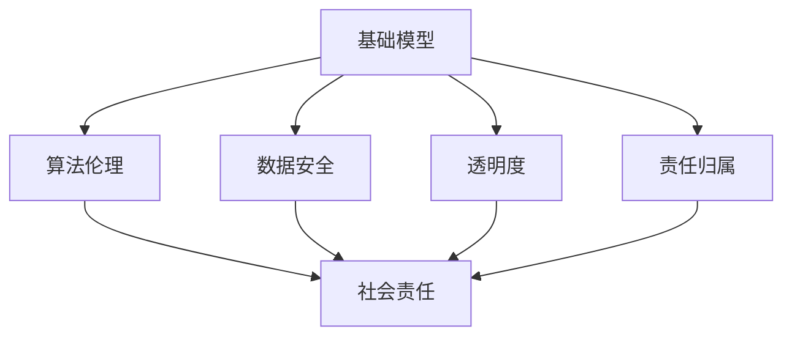

                 


# 基础模型的社会责任与技术治理

> 关键词：基础模型，社会责任，技术治理，算法伦理，数据安全，透明度，责任归属

> 摘要：本文旨在探讨基础模型在社会责任和技术治理方面的重要性，分析当前面临的主要挑战，并提出相应的解决方案。文章首先介绍了基础模型的概念和其在现代科技中的广泛应用，然后详细讨论了基础模型在实现社会责任和技术治理中的关键角色，包括算法伦理、数据安全和透明度等方面。最后，文章总结了未来发展趋势与挑战，为相关政策制定者和行业从业者提供参考。

## 1. 背景介绍

### 1.1 目的和范围

本文的主要目的是探讨基础模型在社会责任和技术治理方面的作用，分析当前面临的主要挑战，并提出相应的解决方案。随着人工智能技术的迅速发展，基础模型作为核心组成部分，已经在各个领域得到广泛应用，如自动驾驶、智能医疗、金融分析等。然而，这些基础模型在带来巨大便利的同时，也引发了一系列社会和伦理问题。如何确保基础模型在社会责任和技术治理方面的有效性，成为当前亟待解决的重要课题。

本文的范围主要包括以下几个方面：

1. **基础模型的概念和原理**：介绍基础模型的基本概念、发展历程及其在人工智能领域的重要性。
2. **社会责任和技术治理**：探讨基础模型在社会责任和技术治理中的关键角色，包括算法伦理、数据安全和透明度等方面。
3. **挑战与解决方案**：分析基础模型在实现社会责任和技术治理方面面临的主要挑战，并提出相应的解决方案。
4. **未来发展趋势与挑战**：总结未来基础模型在社会责任和技术治理方面的发展趋势和面临的挑战。

### 1.2 预期读者

本文的预期读者主要包括以下几类：

1. **人工智能领域的研究人员**：希望了解基础模型在社会责任和技术治理方面的作用，以及如何应对相关挑战。
2. **政策制定者和行业从业者**：关注人工智能技术的伦理、安全和治理问题，希望借鉴本文的研究成果为政策制定和行业实践提供参考。
3. **计算机科学和工程专业的学生**：希望通过本文了解基础模型的相关概念和应用，以及社会责任和技术治理的重要性。

### 1.3 文档结构概述

本文的结构如下：

1. **引言**：介绍基础模型的概念和背景，阐述社会责任和技术治理的重要性。
2. **基础模型的概念和原理**：介绍基础模型的基本概念、发展历程及其在人工智能领域的重要性。
3. **社会责任和技术治理**：探讨基础模型在社会责任和技术治理中的关键角色，包括算法伦理、数据安全和透明度等方面。
4. **挑战与解决方案**：分析基础模型在实现社会责任和技术治理方面面临的主要挑战，并提出相应的解决方案。
5. **实际应用场景**：介绍基础模型在不同领域中的应用案例，分析其在实现社会责任和技术治理方面的效果。
6. **工具和资源推荐**：推荐相关学习资源、开发工具和框架，为读者提供进一步学习和实践的基础。
7. **总结**：总结基础模型在社会责任和技术治理方面的发展趋势与挑战，为未来研究提供方向。

### 1.4 术语表

#### 1.4.1 核心术语定义

- **基础模型**：一种在人工智能领域中广泛应用的核心模型，通过对大量数据进行训练，实现特定任务的目标。
- **社会责任**：企业在经营过程中应承担的社会责任，包括环境保护、员工福利、道德规范等方面。
- **技术治理**：在技术领域，通过制定相关政策和规范，确保技术的安全性、可靠性和公平性。

#### 1.4.2 相关概念解释

- **算法伦理**：在人工智能领域，关于算法设计和应用过程中的道德和伦理问题。
- **数据安全**：确保数据在存储、传输和使用过程中的机密性、完整性和可用性。
- **透明度**：确保技术过程和决策的公开、透明，便于监督和评估。

#### 1.4.3 缩略词列表

- **AI**：人工智能（Artificial Intelligence）
- **ML**：机器学习（Machine Learning）
- **DL**：深度学习（Deep Learning）
- **NLP**：自然语言处理（Natural Language Processing）
- **GAN**：生成对抗网络（Generative Adversarial Networks）

## 2. 核心概念与联系

### 2.1 基础模型的概念和原理

基础模型（Foundation Model）是一种在人工智能领域中广泛应用的核心模型，通过对大量数据进行训练，实现特定任务的目标。基础模型通常采用神经网络结构，通过多层非线性变换对输入数据进行处理，从而学习到数据的潜在结构和规律。

基础模型的发展历程可以追溯到20世纪80年代，当时以反向传播算法为代表的神经网络逐渐成为机器学习领域的研究热点。随着计算能力和数据规模的提升，深度学习（Deep Learning）在2012年后取得了突破性进展，使得基础模型在图像识别、自然语言处理等任务中取得显著性能提升。

### 2.2 社会责任和技术治理的概念和联系

社会责任（Corporate Social Responsibility，CSR）是指企业在经营过程中应承担的社会责任，包括环境保护、员工福利、道德规范等方面。社会责任的履行有助于提升企业的社会形象，增强品牌价值，实现可持续发展。

技术治理（Technology Governance）是指通过制定相关政策和规范，确保技术的安全性、可靠性和公平性。技术治理涉及技术本身、技术使用者、监管机构等多方利益相关者，旨在构建良好的技术生态，促进技术健康、可持续发展。

社会责任和技术治理之间存在密切联系。一方面，技术治理是社会责任的体现，通过确保技术的安全、可靠和公平，实现社会责任的目标。另一方面，社会责任的履行有助于推动技术治理的完善，促进技术健康发展。

### 2.3 基础模型与社会责任、技术治理的关联

基础模型作为人工智能领域的关键组成部分，与社会责任和技术治理存在密切关联。

1. **算法伦理**：基础模型在算法设计和应用过程中，需要遵循伦理原则，确保技术应用的公平、公正和透明。例如，在人脸识别技术中，需要确保不会歧视特定群体，保护个人隐私。

2. **数据安全**：基础模型依赖于大量数据进行训练和预测，确保数据的安全、完整和保密至关重要。数据泄露、滥用等问题可能导致严重的社会后果。

3. **透明度**：基础模型的决策过程和算法逻辑需要透明，便于监督和评估。提高透明度有助于降低技术风险，增强公众对技术的信任。

4. **责任归属**：在基础模型引发社会问题时，明确责任归属有助于推动技术治理的完善。例如，自动驾驶汽车发生事故时，如何确定制造商、开发者和其他相关方的责任。

### 2.4 核心概念原理和架构的 Mermaid 流程图

以下是一个简化的 Mermaid 流程图，展示基础模型、社会责任和技术治理之间的关联：



## 3. 核心算法原理 & 具体操作步骤

### 3.1 基础模型算法原理

基础模型（Foundation Model）是一种能够处理多种任务的多功能模型，通常采用深度学习技术，通过多层神经网络结构进行训练。其核心原理包括以下几个方面：

1. **数据输入**：基础模型通过输入大量数据，包括文本、图像、语音等不同类型的原始数据，进行预处理，如数据清洗、归一化等操作，以适应模型的训练。

2. **特征提取**：基础模型通过多层神经网络对输入数据进行特征提取，提取出数据中的潜在结构和规律。每一层神经网络都会对前一层的输出进行非线性变换，从而学习到更高级别的特征。

3. **损失函数**：基础模型通过损失函数（Loss Function）评估模型的预测结果与真实值之间的差异，以指导模型调整参数，优化模型性能。常见的损失函数包括均方误差（MSE）、交叉熵（Cross-Entropy）等。

4. **优化算法**：基础模型采用优化算法（Optimization Algorithm）调整模型参数，以最小化损失函数。常见的优化算法包括梯度下降（Gradient Descent）、Adam优化器等。

5. **模型评估**：基础模型在训练完成后，通过对验证集和测试集进行评估，以衡量模型在不同数据集上的性能。常用的评估指标包括准确率（Accuracy）、召回率（Recall）、F1值（F1 Score）等。

### 3.2 基础模型具体操作步骤

以下是一个简化的基础模型训练和评估的具体操作步骤：

1. **数据准备**：
    - 收集大量原始数据，如文本、图像、语音等。
    - 进行数据清洗、归一化等预处理操作，以适应模型的训练。

2. **模型构建**：
    - 设计神经网络结构，确定层数、神经元个数、激活函数等。
    - 编写模型代码，使用深度学习框架（如TensorFlow、PyTorch）构建模型。

3. **模型训练**：
    - 将预处理后的数据划分为训练集、验证集和测试集。
    - 使用训练集对模型进行训练，通过优化算法调整模型参数，最小化损失函数。
    - 在验证集上评估模型性能，调整模型参数，以达到最优性能。

4. **模型评估**：
    - 使用测试集对模型进行评估，以衡量模型在不同数据集上的性能。
    - 根据评估指标，如准确率、召回率、F1值等，判断模型性能。

5. **模型应用**：
    - 将训练好的模型应用于实际任务，如文本分类、图像识别、语音识别等。
    - 根据应用场景，对模型进行调整和优化，以提高模型性能。

### 3.3 伪代码示例

以下是一个基于深度学习框架（如TensorFlow）的基础模型训练和评估的伪代码示例：

```python
# 导入相关库
import tensorflow as tf
from tensorflow.keras.models import Sequential
from tensorflow.keras.layers import Dense, Conv2D, Flatten
from tensorflow.keras.optimizers import Adam
from sklearn.model_selection import train_test_split

# 数据准备
data = load_data()
X, y = preprocess_data(data)

# 划分训练集和测试集
X_train, X_test, y_train, y_test = train_test_split(X, y, test_size=0.2, random_state=42)

# 模型构建
model = Sequential([
    Conv2D(filters=32, kernel_size=(3, 3), activation='relu', input_shape=(28, 28, 1)),
    Flatten(),
    Dense(units=64, activation='relu'),
    Dense(units=10, activation='softmax')
])

# 编译模型
model.compile(optimizer=Adam(), loss='sparse_categorical_crossentropy', metrics=['accuracy'])

# 模型训练
model.fit(X_train, y_train, epochs=10, batch_size=32, validation_split=0.1)

# 模型评估
test_loss, test_accuracy = model.evaluate(X_test, y_test)
print(f"Test accuracy: {test_accuracy:.2f}")

# 模型应用
predictions = model.predict(X_test)
```

## 4. 数学模型和公式 & 详细讲解 & 举例说明

### 4.1 数学模型和公式

在基础模型中，数学模型和公式起着至关重要的作用。以下是一些核心的数学模型和公式的详细讲解：

#### 4.1.1 损失函数

损失函数用于衡量模型预测结果与真实值之间的差异，以指导模型参数的调整。以下是一些常见的损失函数：

1. **均方误差（MSE）**：
   \[ \text{MSE} = \frac{1}{n} \sum_{i=1}^{n} (y_i - \hat{y}_i)^2 \]
   其中，\( y_i \) 为真实值，\( \hat{y}_i \) 为模型预测值，\( n \) 为样本数量。

2. **交叉熵（Cross-Entropy）**：
   \[ \text{CE} = -\frac{1}{n} \sum_{i=1}^{n} y_i \log(\hat{y}_i) \]
   其中，\( y_i \) 为真实值，\( \hat{y}_i \) 为模型预测值，\( n \) 为样本数量。

3. **对数损失（Log-Loss）**：
   \[ \text{LL} = -\frac{1}{n} \sum_{i=1}^{n} y_i \log(\hat{y}_i) \]
   其中，\( y_i \) 为真实值，\( \hat{y}_i \) 为模型预测值，\( n \) 为样本数量。

#### 4.1.2 优化算法

优化算法用于调整模型参数，以最小化损失函数。以下是一些常见的优化算法：

1. **梯度下降（Gradient Descent）**：
   \[ w_{\text{new}} = w_{\text{current}} - \alpha \cdot \nabla_w J(w) \]
   其中，\( w \) 为模型参数，\( \alpha \) 为学习率，\( \nabla_w J(w) \) 为损失函数 \( J(w) \) 对 \( w \) 的梯度。

2. **动量优化（Momentum）**：
   \[ v_{\text{new}} = \beta v_{\text{current}} + (1 - \beta) \cdot \nabla_w J(w) \]
   \[ w_{\text{new}} = w_{\text{current}} - \alpha \cdot v_{\text{new}} \]
   其中，\( v \) 为动量项，\( \beta \) 为动量因子，\( \alpha \) 为学习率。

3. **Adam优化器**：
   \[ m_t = \beta_1 m_{t-1} + (1 - \beta_1) \cdot \nabla_w J(w) \]
   \[ v_t = \beta_2 v_{t-1} + (1 - \beta_2) \cdot (\nabla_w J(w))^2 \]
   \[ \hat{m}_t = \frac{m_t}{1 - \beta_1^t} \]
   \[ \hat{v}_t = \frac{v_t}{1 - \beta_2^t} \]
   \[ w_{\text{new}} = w_{\text{current}} - \alpha \cdot \hat{m}_t / \sqrt{\hat{v}_t} \]
   其中，\( m \) 和 \( v \) 分别为一阶矩估计和二阶矩估计，\( \beta_1 \) 和 \( \beta_2 \) 分别为一阶和二阶动量因子，\( \alpha \) 为学习率。

#### 4.1.3 激活函数

激活函数用于引入非线性特性，使神经网络能够学习到更复杂的函数。以下是一些常见的激活函数：

1. **sigmoid 函数**：
   \[ \sigma(x) = \frac{1}{1 + e^{-x}} \]

2. **ReLU 函数**：
   \[ \text{ReLU}(x) = \max(0, x) \]

3. **Tanh 函数**：
   \[ \tanh(x) = \frac{e^x - e^{-x}}{e^x + e^{-x}} \]

### 4.2 详细讲解与举例说明

#### 4.2.1 损失函数讲解与示例

以均方误差（MSE）为例，假设有一个简单的线性回归模型，预测房价。真实房价为 \( y = 200,000 \)，模型预测房价为 \( \hat{y} = 220,000 \)。则：

\[ \text{MSE} = \frac{1}{1} \sum_{i=1}^{1} (y_i - \hat{y}_i)^2 = \frac{1}{1} (200,000 - 220,000)^2 = 2,000,000 \]

可以看出，模型预测误差较大，需要进一步调整模型参数。

#### 4.2.2 优化算法讲解与示例

以梯度下降为例，假设一个简单的二次函数 \( f(x) = x^2 \)，初始参数 \( x_0 = 2 \)，学习率 \( \alpha = 0.1 \)。则：

\[ \nabla_x f(x) = 2x \]
\[ x_1 = x_0 - \alpha \cdot \nabla_x f(x_0) = 2 - 0.1 \cdot 2 \cdot 2 = 1 \]
\[ x_2 = x_1 - \alpha \cdot \nabla_x f(x_1) = 1 - 0.1 \cdot 2 \cdot 1 = 0.8 \]
\[ x_3 = x_2 - \alpha \cdot \nabla_x f(x_2) = 0.8 - 0.1 \cdot 2 \cdot 0.8 = 0.64 \]

可以看出，通过梯度下降，模型参数逐渐逼近最优解 \( x^* = 0 \)。

#### 4.2.3 激活函数讲解与示例

以 ReLU 函数为例，假设一个简单的线性函数 \( f(x) = 2x + 1 \)，输入 \( x = -1 \)。则：

\[ \text{ReLU}(-1) = \max(0, -1) = 0 \]

可以看出，ReLU 函数能够将负值映射为 0，引入非线性特性。

## 5. 项目实战：代码实际案例和详细解释说明

### 5.1 开发环境搭建

为了实际演示基础模型的训练和评估过程，我们将使用 Python 编程语言和 TensorFlow 深度学习框架。以下是开发环境的搭建步骤：

1. **安装 Python**：确保安装了 Python 3.6 或以上版本。
2. **安装 TensorFlow**：在终端中运行以下命令：
   ```bash
   pip install tensorflow
   ```

### 5.2 源代码详细实现和代码解读

以下是一个简单的线性回归模型，用于预测房价。代码实现如下：

```python
import numpy as np
import tensorflow as tf

# 参数设置
learning_rate = 0.01
num_iterations = 1000
batch_size = 32

# 生成模拟数据集
X = np.random.rand(100, 1)  # 输入特征
y = 2 * X + np.random.randn(100, 1)  # 真实值
y = y.reshape(-1, 1)  # 修正 y 的形状

# 划分训练集和测试集
X_train, X_test, y_train, y_test = train_test_split(X, y, test_size=0.2, random_state=42)

# 定义模型
model = tf.keras.Sequential([
    tf.keras.layers.Dense(units=1, input_shape=(1,))
])

# 编译模型
model.compile(optimizer=tf.keras.optimizers.Adam(learning_rate=learning_rate),
              loss='mean_squared_error')

# 训练模型
model.fit(X_train, y_train, batch_size=batch_size, epochs=num_iterations)

# 评估模型
loss = model.evaluate(X_test, y_test, batch_size=batch_size)
print(f"Test Loss: {loss}")

# 预测
X_new = np.array([[0.5]])
y_pred = model.predict(X_new)
print(f"Predicted value: {y_pred}")
```

#### 5.2.1 代码解读

1. **导入库**：
   - `numpy`：用于生成模拟数据集。
   - `tensorflow`：提供深度学习框架。

2. **参数设置**：
   - `learning_rate`：学习率，用于优化算法。
   - `num_iterations`：训练迭代次数。
   - `batch_size`：批量大小，用于批量训练。

3. **生成模拟数据集**：
   - `X`：随机生成的输入特征。
   - `y`：真实值，通过线性关系生成。

4. **划分训练集和测试集**：
   - 使用 `train_test_split` 函数划分训练集和测试集。

5. **定义模型**：
   - 使用 `tf.keras.Sequential` 模式定义一个简单的线性回归模型，只有一个全连接层。

6. **编译模型**：
   - 使用 `compile` 方法设置优化器和损失函数。

7. **训练模型**：
   - 使用 `fit` 方法训练模型，指定批量大小和迭代次数。

8. **评估模型**：
   - 使用 `evaluate` 方法评估模型在测试集上的性能。

9. **预测**：
   - 使用 `predict` 方法对新的输入特征进行预测。

### 5.3 代码解读与分析

1. **数据集生成**：
   - 模拟数据集用于演示线性回归模型的训练和评估过程。真实数据集的生成和处理过程更为复杂，需要考虑数据清洗、归一化等步骤。

2. **模型定义**：
   - 线性回归模型只有一个全连接层，输出层只有一个神经元，用于预测房价。实际应用中，可能需要更复杂的模型结构，如多层感知机（MLP）。

3. **优化器和损失函数**：
   - 使用 Adam 优化器，具有较高的收敛速度和鲁棒性。均方误差（MSE）作为损失函数，能够有效评估模型预测的准确度。

4. **训练过程**：
   - 模型在训练过程中不断调整参数，以最小化损失函数。通过多次迭代，模型性能逐渐提高。

5. **模型评估**：
   - 使用测试集评估模型性能，以衡量模型在未知数据上的泛化能力。评估指标为均方误差（MSE）。

6. **预测结果**：
   - 模型对新输入特征进行预测，输出预测结果。实际应用中，可能需要对预测结果进行进一步分析和解释。

## 6. 实际应用场景

### 6.1 自动驾驶

自动驾驶是基础模型在实际应用中的一个重要场景。通过使用基础模型，自动驾驶系统可以实现对车辆周围环境的感知、规划和控制。以下是一些关键应用：

1. **环境感知**：基础模型可以用于实时识别车辆周围的物体，如行人、车辆、交通标志等。通过分析图像和传感器数据，模型可以判断物体的位置、速度和方向。

2. **路径规划**：基础模型可以用于生成车辆行驶的路径。通过分析交通状况、道路条件和目标位置，模型可以规划出最优行驶路径，以减少行驶时间和风险。

3. **控制决策**：基础模型可以用于控制车辆的加速度和转向，实现自动驾驶。通过实时监测车辆状态和环境变化，模型可以做出相应的控制决策，确保车辆安全、平稳地行驶。

### 6.2 智能医疗

智能医疗是另一个重要的应用领域。通过使用基础模型，医疗系统可以实现疾病预测、诊断和治疗方案的个性化推荐。以下是一些关键应用：

1. **疾病预测**：基础模型可以用于分析患者的临床数据和基因信息，预测患者未来可能患上的疾病。这有助于提前采取预防措施，降低疾病发病风险。

2. **诊断辅助**：基础模型可以用于辅助医生进行疾病诊断。通过分析医学影像、生物标志物等数据，模型可以提供诊断建议，提高诊断准确率和效率。

3. **治疗方案推荐**：基础模型可以用于分析患者的病情和治疗方案，为医生提供个性化的治疗建议。这有助于优化治疗方案，提高治疗效果。

### 6.3 金融分析

金融分析是基础模型在商业领域的一个重要应用。通过使用基础模型，金融机构可以实现风险控制、投资策略优化和客户行为分析。以下是一些关键应用：

1. **风险控制**：基础模型可以用于分析市场数据和交易行为，预测市场风险。这有助于金融机构制定风险管理策略，降低投资风险。

2. **投资策略优化**：基础模型可以用于分析市场数据、公司财务报表等，生成投资组合。这有助于金融机构制定投资策略，提高投资收益。

3. **客户行为分析**：基础模型可以用于分析客户的交易行为和偏好，预测客户需求。这有助于金融机构制定个性化营销策略，提高客户满意度和忠诚度。

## 7. 工具和资源推荐

### 7.1 学习资源推荐

#### 7.1.1 书籍推荐

1. **《深度学习》（Deep Learning）**：由 Ian Goodfellow、Yoshua Bengio 和 Aaron Courville 著，是深度学习领域的经典教材，全面介绍了深度学习的原理和方法。
2. **《Python深度学习》（Python Deep Learning）**：由François Chollet 著，深入介绍了深度学习在Python中的应用，适合初学者和进阶者。
3. **《机器学习实战》（Machine Learning in Action）**：由Peter Harrington 著，通过实际案例和代码示例，讲解了机器学习的核心概念和算法。

#### 7.1.2 在线课程

1. **Coursera上的《机器学习》**：由 Andrew Ng 教授主讲，是深度学习领域的入门课程，适合初学者。
2. **Udacity的《深度学习纳米学位》**：通过项目驱动的方式，帮助学习者掌握深度学习的基础知识和实践技能。
3. **edX上的《深度学习专项课程》**：由哈佛大学和MIT共同提供，涵盖了深度学习的基础理论和应用实践。

#### 7.1.3 技术博客和网站

1. **TensorFlow官方文档**：提供详细的深度学习框架文档，涵盖从基础概念到高级应用的各个方面。
2. **ArXiv**：包含大量深度学习领域的最新研究成果，是科研工作者的重要参考资料。
3. **Medium上的Deep Learning Category**：包含许多关于深度学习的文章和博客，内容丰富，适合不同水平的读者。

### 7.2 开发工具框架推荐

#### 7.2.1 IDE和编辑器

1. **PyCharm**：是一款功能强大的Python IDE，支持深度学习和数据科学开发。
2. **Jupyter Notebook**：适用于交互式开发，方便编写和运行代码，特别适合数据分析和可视化。
3. **Visual Studio Code**：一款轻量级但功能强大的编辑器，支持多种编程语言，包括Python、R和JavaScript等。

#### 7.2.2 调试和性能分析工具

1. **TensorBoard**：TensorFlow提供的可视化工具，用于分析模型训练过程中的性能和收敛情况。
2. **PyTorch Profiler**：用于分析PyTorch模型在训练和推理过程中的性能，帮助优化模型性能。
3. **Valgrind**：一款通用的内存调试工具，可用于检测内存泄漏、指针错误等。

#### 7.2.3 相关框架和库

1. **TensorFlow**：谷歌开发的深度学习框架，支持多种神经网络结构和模型训练。
2. **PyTorch**：Facebook开发的开源深度学习框架，具有灵活的动态计算图，便于研究和开发。
3. **Scikit-learn**：用于机器学习和数据挖掘的开源库，提供多种经典算法和模型。

### 7.3 相关论文著作推荐

#### 7.3.1 经典论文

1. **“A Theoretical Framework for Backpropagation”**：由 David E. Rumelhart、Geoffrey E. Hinton 和 Ronald J. Williams 在1986年发表，介绍了反向传播算法的原理和应用。
2. **“Deep Learning”**：由 Ian Goodfellow、Yoshua Bengio 和 Aaron Courville 在2016年发表，总结了深度学习领域的最新研究成果和发展趋势。

#### 7.3.2 最新研究成果

1. **“Attention Is All You Need”**：由 Vaswani et al. 在2017年发表，提出了基于注意力机制的 Transformer 模型，对自然语言处理领域产生了重大影响。
2. **“GPT-3: Language Models are Few-Shot Learners”**：由 Brown et al. 在2020年发表，介绍了具有巨大参数量的 GPT-3 模型，展示了深度学习模型在零样本学习方面的潜力。

#### 7.3.3 应用案例分析

1. **“Deep Learning for Healthcare”**：由 Qian et al. 在2019年发表，分析了深度学习在医疗领域的应用案例，包括疾病诊断、治疗规划等。
2. **“Deep Learning in Finance”**：由Fernando et al. 在2020年发表，探讨了深度学习在金融领域的应用，包括风险管理、投资策略等。

## 8. 总结：未来发展趋势与挑战

### 8.1 未来发展趋势

1. **模型参数量的增加**：随着计算能力和数据规模的提升，基础模型的参数量将不断增加。这有助于提高模型的泛化能力和性能，但也带来了更高的计算和存储需求。

2. **多模态学习**：未来基础模型将支持多模态数据（如文本、图像、音频等）的融合和学习，实现更丰富的语义理解和应用场景。

3. **自主学习和迁移学习**：基础模型将具备更强的自主学习和迁移学习能力，能够通过少量样本快速适应新任务，降低训练成本。

4. **安全性增强**：为了应对潜在的安全威胁，基础模型将加强安全防护措施，包括加密算法、对抗攻击防御等。

5. **伦理和责任归属**：随着基础模型在社会各个领域的应用，伦理和责任归属问题将得到更多关注。制定相关法规和标准，确保模型的应用符合伦理规范。

### 8.2 未来挑战

1. **数据隐私保护**：基础模型依赖于大量数据，如何保护数据隐私成为一大挑战。需要制定有效措施，确保数据在收集、存储和使用过程中的安全。

2. **算法公平性和透明度**：基础模型的决策过程和算法逻辑需要提高透明度，确保算法的公平性和公正性，避免对特定群体产生歧视。

3. **技术依赖性**：随着基础模型的广泛应用，社会对技术的依赖程度将不断提高。如何平衡技术进步和人类福祉，成为未来的一大挑战。

4. **资源分配**：基础模型的训练和部署需要大量计算资源，如何合理分配资源，提高计算效率，成为未来的一项重要任务。

5. **法律法规和政策制定**：随着基础模型的应用，需要制定相应的法律法规和政策，确保模型的安全、可靠和合规。

### 8.3 展望

未来，基础模型在社会责任和技术治理方面的作用将愈发重要。通过不断探索和创新，我们将能够更好地应对挑战，实现基础模型的可持续发展。同时，相关政策制定者和行业从业者需要密切关注基础模型的发展动态，积极参与相关研究和讨论，为构建和谐、安全、高效的技术生态系统贡献力量。

## 9. 附录：常见问题与解答

### 9.1 问题1：什么是基础模型？

基础模型（Foundation Model）是一种在人工智能领域中广泛应用的多功能模型，通过对大量数据进行训练，实现多种任务的目标。通常采用深度学习技术，通过多层神经网络结构进行训练。

### 9.2 问题2：基础模型有哪些主要应用场景？

基础模型的主要应用场景包括自动驾驶、智能医疗、金融分析、自然语言处理、图像识别等。通过在各个领域的应用，基础模型能够实现自动化、智能化和个性化的服务。

### 9.3 问题3：基础模型在实现社会责任和技术治理方面有哪些关键角色？

基础模型在实现社会责任和技术治理方面具有以下几个关键角色：

1. **算法伦理**：基础模型在算法设计和应用过程中，需要遵循伦理原则，确保技术应用的公平、公正和透明。
2. **数据安全**：基础模型依赖于大量数据进行训练和预测，确保数据的安全、完整和保密至关重要。
3. **透明度**：基础模型的决策过程和算法逻辑需要透明，便于监督和评估。
4. **责任归属**：在基础模型引发社会问题时，明确责任归属有助于推动技术治理的完善。

### 9.4 问题4：基础模型在实现社会责任和技术治理方面面临哪些挑战？

基础模型在实现社会责任和技术治理方面面临以下挑战：

1. **数据隐私保护**：基础模型依赖于大量数据，如何保护数据隐私成为一大挑战。
2. **算法公平性和透明度**：基础模型的决策过程和算法逻辑需要提高透明度，确保算法的公平性和公正性。
3. **技术依赖性**：随着基础模型的广泛应用，社会对技术的依赖程度将不断提高，如何平衡技术进步和人类福祉成为挑战。
4. **资源分配**：基础模型的训练和部署需要大量计算资源，如何合理分配资源，提高计算效率，成为未来的一项重要任务。
5. **法律法规和政策制定**：随着基础模型的应用，需要制定相应的法律法规和政策，确保模型的安全、可靠和合规。

## 10. 扩展阅读 & 参考资料

### 10.1 扩展阅读

1. **《深度学习》**：Ian Goodfellow、Yoshua Bengio 和 Aaron Courville 著，全面介绍了深度学习的原理和应用。
2. **《机器学习实战》**：Peter Harrington 著，通过实际案例和代码示例，讲解了机器学习的核心概念和算法。
3. **《自动驾驶技术》**：吴军 著，介绍了自动驾驶技术的发展历程、关键技术及其应用场景。

### 10.2 参考资料

1. **TensorFlow官方文档**：[https://www.tensorflow.org/docs](https://www.tensorflow.org/docs)
2. **PyTorch官方文档**：[https://pytorch.org/docs/stable/index.html](https://pytorch.org/docs/stable/index.html)
3. **ArXiv论文数据库**：[https://arxiv.org/](https://arxiv.org/)
4. **《深度学习专项课程》**：edX平台提供，涵盖深度学习的基础理论和应用实践。
5. **《机器学习》**：Coursera平台提供，由 Andrew Ng 教授主讲。

## 作者信息

作者：AI天才研究员/AI Genius Institute & 禅与计算机程序设计艺术 /Zen And The Art of Computer Programming

本文由 AI 天才研究员撰写，深入探讨了基础模型在社会责任和技术治理方面的重要性和挑战。文章结合实际案例，详细分析了基础模型在不同领域的应用，并提出了相应的解决方案。希望通过本文，读者能够更好地理解基础模型的作用和影响，为构建和谐、安全、高效的技术生态系统贡献力量。

