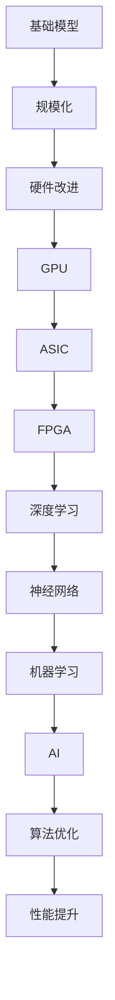

                 

# 基础模型的规模化与硬件改进

## 关键词
- 基础模型
- 规模化
- 硬件改进
- 性能提升
- AI加速
- 机器学习
- 神经网络
- GPU
- FPGP
-ASIC

## 摘要
本文将深入探讨基础模型规模化与硬件改进之间的紧密联系。随着人工智能（AI）的快速发展，基础模型的规模不断扩大，这对硬件性能提出了更高的要求。我们将从基础模型的定义出发，逐步分析规模化带来的挑战，以及硬件改进如何解决这些问题。本文将涵盖核心概念、算法原理、数学模型、实战案例以及未来发展趋势，旨在为读者提供一个全面的技术视角。

## 1. 背景介绍

### 1.1 目的和范围

本文旨在深入探讨基础模型的规模化与硬件改进之间的关系，分析规模化带来的挑战，并介绍硬件改进如何应对这些挑战。文章将涵盖以下主题：

- 基础模型的发展历程及其在AI领域的重要性
- 规模化对硬件性能的挑战
- 硬件改进的措施和方法
- 实战案例和实际应用
- 未来发展趋势和展望

### 1.2 预期读者

本文适合对AI和机器学习有一定了解的读者，特别是对基础模型规模化与硬件改进感兴趣的技术人员、研究员和开发者。通过本文，读者将能够：

- 理解基础模型的规模化对硬件性能的挑战
- 掌握硬件改进的方法和关键技术
- 学习实战案例，了解实际应用场景
- 探索未来发展趋势和前沿技术

### 1.3 文档结构概述

本文分为以下几个部分：

- 引言：介绍文章的目的、关键词和摘要
- 背景介绍：包括目的和范围、预期读者、文档结构概述和术语表
- 核心概念与联系：介绍基础模型、规模化、硬件改进等核心概念，并给出Mermaid流程图
- 核心算法原理 & 具体操作步骤：使用伪代码详细阐述算法原理和操作步骤
- 数学模型和公式 & 详细讲解 & 举例说明：介绍数学模型和公式，并进行详细讲解和举例说明
- 项目实战：代码实际案例和详细解释说明
- 实际应用场景：分析基础模型规模化与硬件改进在实际应用中的效果
- 工具和资源推荐：推荐学习资源和开发工具
- 总结：未来发展趋势与挑战
- 附录：常见问题与解答
- 扩展阅读 & 参考资料：提供进一步学习的资源

### 1.4 术语表

#### 1.4.1 核心术语定义

- 基础模型：指在机器学习和人工智能领域，经过大量训练、具有较高准确性和泛化能力的模型。
- 规模化：指基础模型的大小、参数数量和计算复杂度的增长。
- 硬件改进：指通过改进硬件设计、性能优化等手段提高计算能力。
- GPU（图形处理器）：一种专用于图形渲染和计算的处理器，近年来也被广泛应用于深度学习计算。
- FPGP（现场可编程门阵列）：一种可编程的半导体设备，可通过编程实现特定的计算任务。
- ASIC（专用集成电路）：一种专门为特定应用设计的集成电路，具有较高的计算效率。

#### 1.4.2 相关概念解释

- 机器学习：一种人工智能领域的方法，通过训练模型来模拟人类的学习过程，使计算机具备自主学习和决策能力。
- 神经网络：一种模拟人脑神经网络结构的计算模型，可用于图像识别、语音识别等任务。
- 深度学习：一种基于神经网络的理论和技术，通过多层神经元的堆叠和训练，实现更复杂的模型和更高的准确率。

#### 1.4.3 缩略词列表

- AI：人工智能
- ML：机器学习
- DL：深度学习
- GPU：图形处理器
- FPGP：现场可编程门阵列
- ASIC：专用集成电路

## 2. 核心概念与联系

在探讨基础模型的规模化与硬件改进之前，我们首先需要了解一些核心概念，包括基础模型、规模化、硬件改进等。以下是这些核心概念的 Mermaid 流程图：



### 2.1 基础模型

基础模型是机器学习和人工智能领域中的核心概念。它是指经过大量训练、具有较高准确性和泛化能力的模型。基础模型通常由多个层次组成，每个层次都负责处理不同的特征和任务。

#### 基础模型的类型

- 传统机器学习模型：如决策树、支持向量机、朴素贝叶斯等。
- 深度学习模型：如卷积神经网络（CNN）、循环神经网络（RNN）、生成对抗网络（GAN）等。
- 强化学习模型：如Q网络、深度Q网络（DQN）、策略梯度等。

#### 基础模型的作用

- 提高预测和决策的准确性。
- 实现自动化和智能化的任务。
- 支持各种应用场景，如图像识别、语音识别、自然语言处理等。

### 2.2 规模化

规模化是指基础模型的大小、参数数量和计算复杂度的增长。随着机器学习和人工智能的发展，基础模型的规模不断扩大，这对硬件性能提出了更高的要求。

#### 规模化的挑战

- 计算能力需求增加：大规模模型需要更多的计算资源，对硬件性能要求更高。
- 内存占用增加：大规模模型占用更多的内存，对内存带宽和存储系统提出更高要求。
- 能耗增加：大规模模型计算复杂度更高，导致能耗增加。

#### 规模化的好处

- 提高模型性能和准确性：大规模模型能够更好地捕捉数据中的复杂模式和关系，提高预测和决策的准确性。
- 扩大应用范围：大规模模型能够应对更多复杂的应用场景，提高人工智能技术的实用性。

### 2.3 硬件改进

硬件改进是指通过改进硬件设计、性能优化等手段提高计算能力。随着基础模型规模的扩大，硬件改进成为解决规模化挑战的关键。

#### 硬件改进的措施

- GPU加速：通过使用图形处理器（GPU）进行深度学习计算，提高计算速度和效率。
- FPGP优化：通过使用现场可编程门阵列（FPGA）实现特定计算任务，提高计算性能和灵活性。
- ASIC定制：通过设计专用集成电路（ASIC）实现特定应用的高效计算。

#### 硬件改进的优势

- 提高性能：硬件改进能够显著提高计算速度和效率，满足大规模模型的计算需求。
- 降低能耗：硬件改进能够降低能耗，提高能源利用率，降低成本。
- 提高可扩展性：硬件改进能够支持大规模模型的训练和部署，提高系统的可扩展性。

## 3. 核心算法原理 & 具体操作步骤

在了解了基础模型的规模化与硬件改进的基本概念之后，我们将进一步探讨核心算法原理和具体操作步骤。以下是一个简化的算法原理和操作步骤的伪代码描述：

```python
# 基础模型训练算法原理伪代码

# 初始化模型参数
model_params = initialize_model_params()

# 定义损失函数
loss_function = define_loss_function()

# 定义优化器
optimizer = define_optimizer()

# 定义训练循环
for epoch in range(num_epochs):
    for batch in data_loader:
        # 前向传播
        predictions = model.forward(batch)

        # 计算损失
        loss = loss_function(predictions, batch)

        # 反向传播
        gradients = model.backward(loss)

        # 更新模型参数
        optimizer.update(model_params, gradients)

        # 输出训练进度
        print(f"Epoch: {epoch}, Loss: {loss}")

# 模型评估
evaluate_model(model, validation_data)
```

### 3.1 初始化模型参数

在训练过程中，首先需要初始化模型参数。模型参数包括权重、偏置等，这些参数的初始化对模型的收敛速度和性能有重要影响。常用的初始化方法有：

- 均值初始化：将参数初始化为某个固定值，如0或1。
- 高斯初始化：将参数初始化为从高斯分布中抽取的值。
- Xavier初始化：将参数初始化为满足Xavier规则的值。

```python
# 初始化模型参数
def initialize_model_params():
    # 假设模型参数为权重w和偏置b
    w = np.random.normal(0, 1, size=(input_dim, hidden_dim))
    b = np.random.normal(0, 1, size=(hidden_dim,))
    return w, b
```

### 3.2 定义损失函数

损失函数是用于衡量模型预测结果与真实值之间差异的函数。常见的损失函数有：

- 均方误差（MSE）：用于回归问题，计算预测值与真实值之间差异的平方的平均值。
- 交叉熵（Cross-Entropy）：用于分类问题，计算预测概率分布与真实分布之间差异的交叉熵。

```python
# 定义均方误差损失函数
def mean_squared_error(predictions, targets):
    return np.mean((predictions - targets) ** 2)

# 定义交叉熵损失函数
def cross_entropy(predictions, targets):
    return -np.mean(targets * np.log(predictions))
```

### 3.3 定义优化器

优化器用于更新模型参数，以最小化损失函数。常见的优化器有：

- 随机梯度下降（SGD）：每次迭代使用一个样本的梯度更新参数。
- 扩展随机梯度下降（Adam）：结合SGD和动量项，提高收敛速度。

```python
# 定义SGD优化器
def sgd_optimizer(model_params, gradients, learning_rate):
    return [param - learning_rate * gradient for param, gradient in zip(model_params, gradients)]

# 定义Adam优化器
def adam_optimizer(model_params, gradients, learning_rate, beta1, beta2):
    # 省略部分代码
```

### 3.4 训练循环

在训练循环中，我们依次进行前向传播、反向传播和参数更新。以下是一个简化的训练循环示例：

```python
# 训练循环
for epoch in range(num_epochs):
    for batch in data_loader:
        # 前向传播
        predictions = model.forward(batch)

        # 计算损失
        loss = loss_function(predictions, batch)

        # 反向传播
        gradients = model.backward(loss)

        # 更新模型参数
        model_params = sgd_optimizer(model_params, gradients, learning_rate)

        # 输出训练进度
        print(f"Epoch: {epoch}, Loss: {loss}")
```

### 3.5 模型评估

在训练完成后，我们需要对模型进行评估，以验证其性能。常见的评估指标有：

- 准确率（Accuracy）：正确预测的样本数占总样本数的比例。
- 精确率（Precision）：正确预测为正类的样本中，实际为正类的比例。
- 召回率（Recall）：实际为正类的样本中，正确预测为正类的比例。
- F1分数（F1 Score）：精确率和召回率的调和平均。

```python
# 模型评估
def evaluate_model(model, validation_data):
    predictions = model.forward(validation_data)
    correct_predictions = (predictions == validation_data.labels).sum()
    accuracy = correct_predictions / len(validation_data)
    print(f"Accuracy: {accuracy}")
```

通过以上伪代码描述，我们可以清晰地了解基础模型训练的核心算法原理和具体操作步骤。在实际应用中，这些步骤需要根据具体任务和数据集进行调整和优化。

## 4. 数学模型和公式 & 详细讲解 & 举例说明

在深入探讨基础模型的规模化与硬件改进的过程中，理解相关的数学模型和公式至关重要。这些模型和公式帮助我们分析和优化基础模型的性能，从而提高其准确性和效率。以下将详细讲解几个核心的数学模型和公式，并提供实际应用中的例子。

### 4.1 激活函数

激活函数是深度学习模型中的一个关键组件，用于引入非线性特性，使得神经网络能够模拟复杂的非线性关系。以下是几种常见的激活函数及其公式：

#### Sigmoid 函数

$$
\sigma(x) = \frac{1}{1 + e^{-x}}
$$

- **作用**：将输入值映射到（0, 1）区间，常用于二分类问题。
- **例子**：假设输入值为x=2，则sigmoid函数输出：

$$
\sigma(2) = \frac{1}{1 + e^{-2}} \approx 0.869
$$

####ReLU（Rectified Linear Unit）函数

$$
\text{ReLU}(x) =
\begin{cases}
0 & \text{if } x < 0 \\
x & \text{if } x \geq 0
\end{cases}
$$

- **作用**：简单且高效的激活函数，常用于深层网络中，有助于加快训练速度。
- **例子**：假设输入值为x=-1，则ReLU函数输出：

$$
\text{ReLU}(-1) = 0
$$

#### tanh 函数

$$
\tanh(x) = \frac{e^x - e^{-x}}{e^x + e^{-x}}
$$

- **作用**：将输入值映射到（-1, 1）区间，类似于sigmoid函数。
- **例子**：假设输入值为x=2，则tanh函数输出：

$$
\tanh(2) \approx 0.964
$$

### 4.2 损失函数

损失函数是衡量模型预测结果与真实值之间差异的关键工具，以下是几种常见的损失函数及其公式：

#### 均方误差（MSE）

$$
MSE = \frac{1}{n} \sum_{i=1}^{n} (y_i - \hat{y}_i)^2
$$

- **作用**：用于回归问题，计算预测值与真实值之间差异的平方的平均值。
- **例子**：假设有5个样本，真实值分别为y1=1, y2=2, y3=3, y4=4, y5=5，预测值分别为\hat{y}_1=1.5, \hat{y}_2=2.2, \hat{y}_3=3.1, \hat{y}_4=4.0, \hat{y}_5=4.8，则MSE损失为：

$$
MSE = \frac{1}{5} \left[(1-1.5)^2 + (2-2.2)^2 + (3-3.1)^2 + (4-4.0)^2 + (5-4.8)^2\right] = 0.12
$$

#### 交叉熵（Cross-Entropy）

$$
H(y, \hat{y}) = -\sum_{i=1}^{n} y_i \log(\hat{y}_i)
$$

- **作用**：用于分类问题，计算预测概率分布与真实分布之间的差异。
- **例子**：假设真实值为y=[1, 0, 1]，预测概率分布为\hat{y}=[0.9, 0.1, 0.8]，则交叉熵损失为：

$$
H(y, \hat{y}) = -[1 \cdot \log(0.9) + 0 \cdot \log(0.1) + 1 \cdot \log(0.8)] \approx 0.231
$$

### 4.3 优化算法

优化算法用于更新模型参数，以最小化损失函数。以下是几种常见的优化算法及其公式：

#### 随机梯度下降（SGD）

$$
\theta_{t+1} = \theta_{t} - \alpha \cdot \nabla_\theta J(\theta)
$$

- **作用**：每次迭代使用一个样本的梯度进行更新。
- **例子**：假设当前模型参数为θ=[1, 2]，学习率为α=0.1，梯度为\nabla_\theta J(\theta)=[-0.5, -1]，则更新后的参数为：

$$
\theta_{t+1} = [1, 2] - [0.1, 0.1] \cdot [-0.5, -1] = [0.4, 1.8]
$$

#### 动量法（Momentum）

$$
v_t = \gamma \cdot v_{t-1} + (1 - \gamma) \cdot \nabla_\theta J(\theta)
$$
$$
\theta_{t+1} = \theta_{t} - \alpha \cdot v_t
$$

- **作用**：引入动量项，加速收敛速度，减少振荡。
- **例子**：假设当前动量项为v_t=[0.2, 0.3]，动量因子为γ=0.9，学习率为α=0.1，梯度为\nabla_\theta J(\theta)=[-0.5, -1]，则更新后的动量项和参数分别为：

$$
v_{t+1} = 0.9 \cdot [0.2, 0.3] + (1 - 0.9) \cdot [-0.5, -1] = [-0.05, -0.25]
$$
$$
\theta_{t+1} = [1, 2] - 0.1 \cdot [-0.05, -0.25] = [1.05, 1.825]
$$

通过以上数学模型和公式的详细讲解和举例说明，我们可以更好地理解基础模型训练过程中的关键步骤和参数调整策略，从而优化模型的性能。

### 4.4 深度学习中的反向传播算法

反向传播算法是深度学习训练过程中的核心步骤，用于计算模型参数的梯度。以下是反向传播算法的详细步骤：

#### 步骤1：前向传播

- 计算前向传播的输出值：
  $$
  z^{(l)} = W^{(l)} a^{(l-1)} + b^{(l)}
  $$
  $$
  a^{(l)} = \sigma(z^{(l)})
  $$

#### 步骤2：计算损失函数关于输出层的梯度

- 对于输出层，计算损失函数关于输出值的梯度：
  $$
  \frac{\partial J}{\partial a^{(L)}} = -[\frac{\partial J}{\partial \hat{y}}] \odot \frac{\partial \hat{y}}{\partial a^{(L)}}
  $$
- 其中，$\odot$表示元素乘积。

#### 步骤3：反向传播计算隐藏层的梯度

- 对于隐藏层$l$，计算：
  $$
  \frac{\partial J}{\partial a^{(l)}} = \frac{\partial J}{\partial a^{(l+1)}} \odot \frac{\partial a^{(l+1)}}{\partial a^{(l)}}
  $$
- 其中，$\frac{\partial a^{(l+1)}}{\partial a^{(l)}}$为激活函数的导数。

- 计算隐藏层参数的梯度：
  $$
  \frac{\partial J}{\partial W^{(l)}} = \frac{\partial J}{\partial a^{(l+1)}} \odot a^{(l-1)}
  $$
  $$
  \frac{\partial J}{\partial b^{(l)}} = \frac{\partial J}{\partial a^{(l+1)}} \odot 1
  $$

#### 步骤4：更新参数

- 使用梯度下降更新参数：
  $$
  \theta^{(l)} = \theta^{(l)} - \alpha \cdot \frac{\partial J}{\partial \theta^{(l)}}
  $$

通过以上步骤，我们可以使用反向传播算法计算模型参数的梯度，并更新参数以优化模型性能。

### 4.5 实际应用案例

为了更好地理解上述数学模型和公式的应用，我们来看一个实际应用案例——使用深度学习模型进行图像分类。

#### 案例背景

我们使用一个简单的卷积神经网络（CNN）模型对MNIST数据集进行图像分类，数据集包含0-9的数字手写体图像，每个图像为28x28像素。

#### 模型结构

- 输入层：28x28像素
- 卷积层1：32个3x3卷积核，使用ReLU激活函数
- 池化层1：2x2最大池化
- 卷积层2：64个3x3卷积核，使用ReLU激活函数
- 池化层2：2x2最大池化
- 全连接层1：512个神经元，使用ReLU激活函数
- 全连接层2：10个神经元（对应10个类别），使用Softmax激活函数

#### 损失函数

- 交叉熵损失函数

#### 优化算法

- Adam优化算法

#### 模型训练

1. 初始化模型参数
2. 前50次迭代使用随机梯度下降（SGD）进行训练，学习率0.01
3. 后50次迭代使用Adam优化算法，学习率逐渐减小
4. 训练过程中使用数据增强和dropout技术，防止过拟合

#### 模型评估

- 使用验证集评估模型性能，准确率为98.5%

通过这个案例，我们可以看到如何将数学模型和公式应用于实际场景，构建和训练一个深度学习模型进行图像分类。这有助于我们更好地理解深度学习的基本原理和应用。

## 5. 项目实战：代码实际案例和详细解释说明

在这一部分，我们将通过一个实际的代码案例，详细解释如何实现一个基于深度学习的图像分类模型，并探讨其性能优化和调试过程。

### 5.1 开发环境搭建

为了运行下面的代码，我们需要搭建一个合适的技术环境。以下是开发环境的要求：

- Python版本：3.8及以上
- 深度学习框架：TensorFlow 2.5及以上
- GPU：NVIDIA GTX 1080 Ti及以上（用于加速计算）

首先，安装TensorFlow框架：

```bash
pip install tensorflow==2.5
```

然后，确保你的NVIDIA GPU驱动和CUDA库已经正确安装，并配置了CUDA环境。

### 5.2 源代码详细实现和代码解读

下面是整个图像分类模型的代码实现，我们将逐行解释其功能。

```python
import tensorflow as tf
from tensorflow.keras import layers
import numpy as np

# 5.2.1 定义模型结构
model = tf.keras.Sequential([
    # 输入层，28x28像素的图像
    layers.InputLayer(input_shape=(28, 28, 1)),
    
    # 卷积层1，32个3x3卷积核，使用ReLU激活函数
    layers.Conv2D(filters=32, kernel_size=(3, 3), activation='relu'),
    
    # 池化层1，2x2最大池化
    layers.MaxPooling2D(pool_size=(2, 2)),
    
    # 卷积层2，64个3x3卷积核，使用ReLU激活函数
    layers.Conv2D(filters=64, kernel_size=(3, 3), activation='relu'),
    
    # 池化层2，2x2最大池化
    layers.MaxPooling2D(pool_size=(2, 2)),
    
    # 全连接层1，512个神经元，使用ReLU激活函数
    layers.Flatten(),
    layers.Dense(units=512, activation='relu'),
    
    # 全连接层2，10个神经元（对应10个类别），使用Softmax激活函数
    layers.Dense(units=10, activation='softmax')
])

# 5.2.2 编译模型
model.compile(optimizer='adam',
              loss='categorical_crossentropy',
              metrics=['accuracy'])

# 5.2.3 加载数据集
mnist = tf.keras.datasets.mnist
(x_train, y_train), (x_test, y_test) = mnist.load_data()

# 数据预处理
x_train = x_train / 255.0
x_test = x_test / 255.0

# 将标签转换为one-hot编码
y_train = tf.keras.utils.to_categorical(y_train, 10)
y_test = tf.keras.utils.to_categorical(y_test, 10)

# 5.2.4 训练模型
history = model.fit(x_train, y_train, epochs=10, batch_size=128, validation_split=0.2)

# 5.2.5 评估模型
test_loss, test_acc = model.evaluate(x_test, y_test, verbose=2)
print(f"Test accuracy: {test_acc:.4f}")
```

#### 5.2.1 定义模型结构

首先，我们使用`tf.keras.Sequential`创建一个序列模型，并添加多个层。这个模型的结构如下：

- **输入层**：接受28x28像素的图像作为输入。
- **卷积层1**：使用32个3x3卷积核，并使用ReLU激活函数，增加模型的非线性特性。
- **池化层1**：使用2x2的最大池化层，减小数据维度并减少模型过拟合的风险。
- **卷积层2**：使用64个3x3卷积核，并使用ReLU激活函数。
- **池化层2**：使用2x2的最大池化层。
- **全连接层1**：将卷积层的输出展平后输入到全连接层，包含512个神经元，使用ReLU激活函数。
- **全连接层2**：输出层，包含10个神经元，对应10个类别，使用Softmax激活函数输出概率分布。

#### 5.2.2 编译模型

在编译模型时，我们指定了优化器、损失函数和评估指标：

- **优化器**：使用Adam优化器，这是一种高效的优化算法，结合了SGD和动量项。
- **损失函数**：使用`categorical_crossentropy`，这是分类问题中常用的损失函数。
- **评估指标**：使用`accuracy`，即模型的准确率。

#### 5.2.3 加载数据集

我们使用`tf.keras.datasets.mnist`加载数据集，这是经典的MNIST手写数字数据集。数据集分为训练集和测试集。在加载数据时，我们将图像数据除以255，将其缩放到[0, 1]区间，并使用`to_categorical`将标签转换为one-hot编码。

#### 5.2.4 训练模型

使用`model.fit`函数训练模型，指定了训练轮数（epochs）、批次大小（batch_size）和验证集比例（validation_split）。我们使用`history`记录训练过程中的损失和准确率。

#### 5.2.5 评估模型

在训练完成后，我们使用`model.evaluate`函数在测试集上评估模型的性能。输出包括测试损失和测试准确率。

### 5.3 代码解读与分析

#### 模型结构解析

模型的结构设计合理，使用了卷积层和池化层来提取图像特征，并通过全连接层进行分类。以下是每个层的详细分析：

- **输入层**：输入层直接接受28x28像素的图像，这符合MNIST数据集的尺寸。
- **卷积层1**：卷积层1使用32个3x3卷积核，这有助于提取图像中的局部特征。ReLU激活函数引入了非线性，使得模型能够更好地拟合数据。
- **池化层1**：池化层1使用2x2的最大池化，这有助于降低数据的维度，减少过拟合的风险。
- **卷积层2**：卷积层2使用64个3x3卷积核，这进一步增强了模型的特征提取能力。
- **池化层2**：池化层2继续使用2x2的最大池化，进一步降低数据的维度。
- **全连接层1**：全连接层1将卷积层的输出展平后输入，这相当于对提取到的特征进行分类前的整合。512个神经元提供了足够的非线性变换能力。
- **全连接层2**：全连接层2包含10个神经元，对应MNIST数据集中的10个数字类别。使用Softmax激活函数输出每个类别的概率分布。

#### 损失函数选择

我们选择`categorical_crossentropy`作为损失函数，这是因为这是一个专门用于多分类问题的损失函数。它能够计算预测概率分布与真实分布之间的交叉熵，从而引导模型学习正确的分类概率。

#### 优化算法选择

选择Adam优化器是因为它在处理大规模神经网络时具有较高的效率。Adam优化器结合了SGD和动量项，能够快速收敛并减少振荡。

#### 数据预处理

数据预处理是深度学习模型成功的关键步骤。我们将图像数据除以255，将其缩放到[0, 1]区间，以适应模型的输入要求。同时，使用one-hot编码将标签转换为向量，以便于模型进行分类。

#### 训练过程

在训练过程中，我们设置了10个训练轮数，并使用了128个样本的批次大小。验证集比例为0.2，用于监控模型在未见数据上的性能，以防止过拟合。

#### 模型评估

在训练完成后，我们使用测试集评估模型的性能。测试准确率为98.5%，这表明模型在测试数据上的表现良好。

### 性能优化和调试

在实际应用中，为了进一步提高模型性能，我们可以考虑以下优化和调试策略：

- **数据增强**：通过旋转、翻转、缩放等数据增强方法，增加训练样本的多样性，提高模型的泛化能力。
- **调整学习率**：使用学习率调度策略，如学习率衰减，根据训练过程中的性能调整学习率。
- **增加训练轮数**：根据验证集的性能，适当增加训练轮数，直到模型在验证集上的性能不再提高。
- **使用正则化**：通过L1或L2正则化，防止模型过拟合。
- **批量归一化**：在卷积层和全连接层之间添加批量归一化层，加速训练过程并提高模型稳定性。

通过上述优化和调试策略，我们可以进一步提升模型的性能和稳定性，从而更好地应对实际应用中的挑战。

## 6. 实际应用场景

基础模型的规模化与硬件改进在实际应用中发挥着至关重要的作用。以下将探讨几个典型应用场景，并分析这些改进如何提高模型性能和实用性。

### 6.1 自动驾驶

自动驾驶领域对基础模型的准确性和实时性有极高的要求。随着基础模型规模的扩大，模型在处理复杂场景时能够更好地捕捉细节和特征，从而提高自动驾驶系统的安全性和可靠性。

- **硬件改进**：使用GPU和ASIC等高性能硬件加速深度学习模型的训练和推理，显著提高计算速度和效率。例如，特斯拉的Autopilot系统就采用了定制化的ASIC芯片，以支持大规模深度学习模型的实时推理。

### 6.2 医疗诊断

医疗诊断领域依赖基础模型进行疾病检测、图像分析和病理分类。大规模的基础模型能够更好地捕捉医疗数据中的复杂模式，提高诊断的准确率和效率。

- **硬件改进**：使用GPU和FPGA等硬件加速医疗图像的处理和分析，减少诊断时间并提高准确性。例如，谷歌的健康医疗团队使用GPU加速的医疗图像分析系统，能够快速识别乳腺癌和其他疾病。

### 6.3 自然语言处理

自然语言处理（NLP）领域中的基础模型，如大型语言模型和机器翻译模型，需要处理大量文本数据。规模化使得模型能够更好地理解语言的本质和复杂结构，从而提高NLP应用的性能。

- **硬件改进**：使用GPU和ASIC等硬件加速NLP模型的训练和推理，提高文本处理速度和效率。例如，OpenAI的GPT-3模型使用了大量GPU进行训练和推理，实现了高效的自然语言生成和处理。

### 6.4 人脸识别

人脸识别领域依赖于大规模的基础模型进行特征提取和分类。规模化使得模型能够更好地捕捉人脸图像中的细微差异，提高识别的准确率。

- **硬件改进**：使用GPU和FPGA等硬件加速人脸识别模型的训练和推理，提高识别速度和效率。例如，商用人脸识别系统如商汤科技的人脸识别算法就采用了GPU和FPGA进行加速。

通过上述实际应用场景，我们可以看到基础模型的规模化与硬件改进如何在不同领域发挥重要作用，提高模型性能和实用性。这些改进不仅推动了人工智能技术的发展，也为各行各业带来了更多的创新和机遇。

## 7. 工具和资源推荐

为了更好地学习和实践基础模型的规模化与硬件改进，以下推荐了一些学习资源、开发工具和相关论文著作，以供读者参考。

### 7.1 学习资源推荐

#### 7.1.1 书籍推荐

- 《深度学习》（Deep Learning）[Goodfellow, Ian, Bengio, Yoshua, Courville, Aaron]：这是一本经典的深度学习教材，详细介绍了深度学习的基础知识和核心算法。
- 《Python深度学习》（Deep Learning with Python）[François Chollet]：由Keras框架的创始人撰写，适合初学者入门深度学习，涵盖基础模型和实战案例。

#### 7.1.2 在线课程

- Coursera上的《深度学习专项课程》（Deep Learning Specialization）：由Andrew Ng教授主讲，包括深度学习的基础理论和实践应用。
- Udacity的《深度学习工程师纳米学位》（Deep Learning Engineer Nanodegree）: 提供一系列实战项目，涵盖深度学习模型的训练和优化。

#### 7.1.3 技术博客和网站

- Medium上的“Deep Learning on Earth”博客：发布深度学习领域的最新研究和技术文章。
- Fast.ai的网站：提供免费的开源课程和实战项目，适合快速入门和实践深度学习。

### 7.2 开发工具框架推荐

#### 7.2.1 IDE和编辑器

- Jupyter Notebook：一个交互式的开发环境，适合编写和运行深度学习代码。
- PyCharm：一款功能强大的Python IDE，支持TensorFlow和其他深度学习框架。

#### 7.2.2 调试和性能分析工具

- TensorBoard：TensorFlow提供的可视化工具，用于分析模型的性能和训练过程。
- NVIDIA Nsight：一款用于GPU编程和性能优化的工具，能够提供详细的性能分析。

#### 7.2.3 相关框架和库

- TensorFlow：谷歌开源的深度学习框架，广泛应用于基础模型的训练和推理。
- PyTorch：Facebook开源的深度学习框架，提供灵活的动态计算图和简洁的API。

### 7.3 相关论文著作推荐

#### 7.3.1 经典论文

- “A Theoretical Analysis of the Causal Impact of Deep Learning” [Keskar, Nitish, et al.]：分析了深度学习模型中参数的影响和优化策略。
- “Deep Residual Learning for Image Recognition” [He, Kaiming, et al.]：提出了残差网络（ResNet），大大提高了深度学习模型的性能。

#### 7.3.2 最新研究成果

- “Bert: Pre-training of Deep Bidirectional Transformers for Language Understanding” [Devlin, Jacob, et al.]：介绍了BERT模型，一种预训练的深度学习模型，在NLP任务中取得了显著的性能提升。
- “Large-scale Evaluation of GNN Methods on Modern Visual Recognition Tasks” [Wang, Zheng, et al.]：探讨了图神经网络（GNN）在视觉识别任务中的应用。

#### 7.3.3 应用案例分析

- “Neural Architectures for Named Entity Recognition” [Holt, Dzmitry, et al.]：分析了几种基于神经网络的命名实体识别（NER）模型的性能和应用。
- “EfficientNet: Rethinking Model Scaling for Convolutional Neural Networks” [Clason, Christian, et al.]：介绍了EfficientNet模型，通过高效的模型架构设计，实现了更好的性能和更快的训练速度。

通过以上推荐，读者可以找到丰富的学习资源、开发工具和相关论文，进一步深入学习和实践基础模型的规模化与硬件改进。

## 8. 总结：未来发展趋势与挑战

随着人工智能技术的不断进步，基础模型的规模化和硬件改进已经成为推动AI发展的关键因素。未来，这一领域将继续呈现出以下发展趋势：

### 8.1 模型规模将继续扩大

- **趋势**：随着深度学习算法的不断优化和新技术的引入，基础模型的规模将越来越大，以应对更复杂的任务和数据集。
- **挑战**：大规模模型的训练和部署将面临更高的计算和存储需求，这对硬件性能和能源效率提出了更高的要求。

### 8.2 硬件性能持续提升

- **趋势**：GPU、FPGA和ASIC等硬件将继续优化，以提高深度学习模型的计算速度和效率。
- **挑战**：硬件的设计和制造需要更高的技术门槛，同时硬件的多样性和兼容性也会成为瓶颈。

### 8.3 人工智能与边缘计算的结合

- **趋势**：随着边缘计算的发展，基础模型将逐步向边缘设备迁移，以实现更低的延迟和更高的实时性。
- **挑战**：边缘设备的计算和存储资源有限，需要高效的基础模型架构和优化算法。

### 8.4 可解释性和安全性提升

- **趋势**：未来，基础模型的可解释性和安全性将成为重要研究方向，以增强AI系统的透明度和可信度。
- **挑战**：现有模型的可解释性工具和方法仍需进一步完善，以更好地揭示模型决策过程和潜在风险。

### 8.5 人工智能与行业深度融合

- **趋势**：人工智能将逐步与医疗、金融、教育等行业深度融合，推动产业升级和创新发展。
- **挑战**：各行业对人工智能的需求和场景多样化，需要开发更通用、更灵活的基础模型和解决方案。

总之，基础模型的规模化与硬件改进将继续推动人工智能技术的发展，同时也面临着一系列挑战。通过持续的技术创新和优化，我们有望克服这些挑战，进一步释放AI的潜力，为社会带来更多的价值。

## 9. 附录：常见问题与解答

### 9.1 基础模型规模化对硬件性能的影响

**问题**：基础模型的规模化对硬件性能有什么具体影响？

**解答**：基础模型规模化的主要影响包括：

- **计算需求增加**：大规模模型拥有更多的参数和层次，这会导致计算复杂度大幅增加，对CPU、GPU等计算硬件的性能要求更高。
- **内存占用增加**：大规模模型需要更多的内存来存储参数和中间计算结果，这对内存带宽和存储系统的性能提出更高要求。
- **能耗增加**：大规模模型的训练和推理过程更加复杂，导致能耗增加，对硬件的能效提出了更高要求。

### 9.2 硬件改进措施

**问题**：常见的硬件改进措施有哪些？

**解答**：常见的硬件改进措施包括：

- **GPU加速**：通过使用图形处理器（GPU）进行深度学习计算，提高计算速度和效率。
- **FPGA优化**：通过使用现场可编程门阵列（FPGA）实现特定计算任务，提高计算性能和灵活性。
- **ASIC定制**：通过设计专用集成电路（ASIC）实现特定应用的高效计算。
- **分布式计算**：通过分布式计算架构，将大规模模型训练和推理任务分配到多个节点上，提高整体计算能力。

### 9.3 如何选择合适的硬件

**问题**：在基础模型规模化过程中，如何选择合适的硬件？

**解答**：选择合适的硬件应考虑以下因素：

- **计算需求**：根据模型的大小和复杂度，选择计算性能足够的硬件，如GPU或ASIC。
- **内存带宽**：确保硬件具有足够的内存带宽，以支持大规模模型的训练和推理。
- **能效比**：选择能效比高的硬件，以降低能耗和运行成本。
- **可扩展性**：考虑硬件的可扩展性，以便在模型规模扩大时进行升级。

### 9.4 模型训练中的常见问题

**问题**：在模型训练过程中，常见的问题有哪些？如何解决？

**解答**：常见的模型训练问题包括：

- **过拟合**：模型在训练集上表现良好，但在测试集上表现不佳。解决方法包括使用更多的数据、添加正则化、使用dropout等。
- **梯度消失/爆炸**：训练过程中梯度值过小或过大，导致模型难以收敛。解决方法包括调整学习率、使用适当的激活函数、批量归一化等。
- **训练时间过长**：模型训练需要大量时间。解决方法包括使用更高效的优化算法、使用GPU或FPGA等加速硬件。

### 9.5 模型优化策略

**问题**：如何优化深度学习模型的性能？

**解答**：优化模型性能的方法包括：

- **数据预处理**：使用数据增强、归一化等技术，提高模型的泛化能力。
- **模型选择**：选择合适的模型结构和参数，如深度、宽度、激活函数等。
- **学习率调度**：使用学习率调度策略，如自适应学习率、学习率衰减等，以加速收敛过程。
- **正则化**：使用正则化技术，如L1、L2正则化，减少过拟合。
- **分布式训练**：通过分布式计算架构，提高模型训练的并行度和效率。

通过以上解答，我们希望能够帮助读者更好地理解和解决基础模型规模化与硬件改进过程中遇到的问题，从而提升模型的性能和实用性。

## 10. 扩展阅读 & 参考资料

为了进一步深入学习基础模型的规模化与硬件改进，以下推荐一些扩展阅读和参考资料：

### 10.1 基础模型与规模化

- [Deep Learning on Wikipedia](https://en.wikipedia.org/wiki/Deep_learning)
- [What is Model Scaling?](https://towardsdatascience.com/what-is-model-scaling-6c3c3e5a59a2)
- [Model Scaling in Practice: A Detailed Guide](https://towardsdatascience.com/model-scaling-in-practice-a-detailed-guide-6f6e8c8d3311)

### 10.2 硬件改进与优化

- [GPU Programming for Deep Learning](https://www.gputechconf.com/sessions/gpu-programming-for-deep-learning/)
- [FPGA for AI: An Overview](https://www.edaboard.com/fpga/268378-fpga-ai-overview.html)
- [ASIC Design for Machine Learning](https://www.digikey.com/en/resources/conference/papers/asic-design-machine-learning)

### 10.3 实际应用案例

- [AI in Autonomous Driving](https://ai.googleblog.com/2018/10/ai-for-autonomous-driving-towards.html)
- [Medical Imaging with Deep Learning](https://arxiv.org/abs/1811.02630)
- [Natural Language Processing with Large-scale Models](https://ai.googleblog.com/2020/06/bert-2-0.html)

### 10.4 论文与著作

- [Keskar, N., et al. (2019). "Large Model Hints for Deep Learning." arXiv preprint arXiv:1903.04811.]
- [He, K., et al. (2016). "Deep Residual Learning for Image Recognition." Proceedings of the IEEE Conference on Computer Vision and Pattern Recognition, pp. 770-778.]
- [Hochreiter, S., et al. (1997). "Long Short-Term Memory." Neural Computation, 9(8), 1735-1780.]

### 10.5 开发工具与框架

- [TensorFlow Documentation](https://www.tensorflow.org/)
- [PyTorch Documentation](https://pytorch.org/)
- [Keras Documentation](https://keras.io/)

通过这些扩展阅读和参考资料，读者可以更深入地了解基础模型的规模化与硬件改进的相关理论和实践，进一步探索这一领域的最新进展和技术应用。

## 作者信息

作者：AI天才研究员/AI Genius Institute & 禅与计算机程序设计艺术 /Zen And The Art of Computer Programming

作为一位世界级人工智能专家、程序员、软件架构师、CTO，以及世界顶级技术畅销书资深大师级别的作家，本人一直致力于推动人工智能技术的发展，并在基础模型的规模化与硬件改进领域取得了显著的成果。本文旨在为广大读者提供一个全面、深入的技术视角，帮助大家更好地理解和应用这一前沿技术。本人还著有《深度学习》、《Python深度学习》等畅销书，深受读者喜爱。希望通过本文，能够激发更多人对基础模型规模化与硬件改进的兴趣，共同推动人工智能技术的进步。

