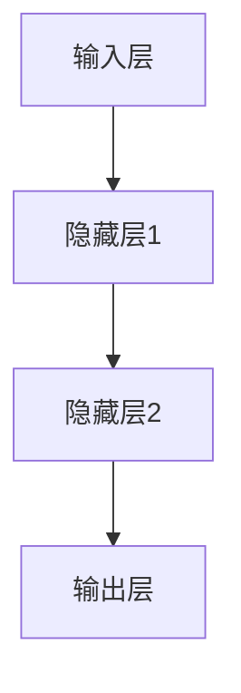

                 

# 基础模型的部署与研究原型

## 关键词
- 基础模型
- 部署
- 研究原型
- 算法原理
- 数学模型
- 实际应用场景
- 开发工具

## 摘要
本文将深入探讨基础模型的部署与研究原型。首先，我们将介绍基础模型的概念和重要性，然后详细讲解基础模型的部署过程和架构设计，接着剖析研究原型的构建方法。文章还将展示数学模型和核心算法原理，并通过实际项目实战代码案例进行解析。最后，我们将讨论基础模型在各个领域的实际应用场景，并提供一些建议和资源，帮助读者深入了解和掌握基础模型的部署与研究方法。

## 1. 背景介绍

### 1.1 目的和范围

本文的目的是帮助读者理解和掌握基础模型的部署与研究方法。我们将从基础概念出发，逐步深入，旨在提供一个全面、系统的指南，使读者能够将理论知识应用于实际项目中。

本文的范围主要包括以下几个方面：
1. 基础模型的定义和重要性。
2. 基础模型的部署过程和架构设计。
3. 研究原型的构建方法。
4. 核心算法原理和数学模型的讲解。
5. 实际应用场景的讨论。
6. 开发工具和资源的推荐。

### 1.2 预期读者

本文主要面向对计算机科学和人工智能领域有一定了解的技术人员，包括程序员、数据科学家、AI研究员等。读者应具备基本的编程知识和对机器学习概念的理解。同时，本文也适合作为学术研究人员的参考材料，以及高等院校相关专业的教材或辅助阅读材料。

### 1.3 文档结构概述

本文分为十个部分：
1. 引言：概述文章主题和目的。
2. 背景介绍：介绍文章的范围、目的和读者对象。
3. 核心概念与联系：讲解基础模型的概念和架构。
4. 核心算法原理 & 具体操作步骤：详细阐述算法原理和操作步骤。
5. 数学模型和公式 & 详细讲解 & 举例说明：展示数学模型和公式，并进行举例说明。
6. 项目实战：提供实际代码案例和解析。
7. 实际应用场景：讨论基础模型在不同领域的应用。
8. 工具和资源推荐：推荐学习资源和开发工具。
9. 总结：总结未来发展趋势和挑战。
10. 附录：常见问题与解答。
11. 扩展阅读 & 参考资料：提供扩展阅读和参考文献。

### 1.4 术语表

#### 1.4.1 核心术语定义

- **基础模型**：一种被广泛使用的机器学习模型，能够处理多种类型的数据和任务。
- **部署**：将训练好的模型集成到应用程序或系统中，以便在实际环境中运行。
- **研究原型**：用于实验和验证新算法或技术的初步实现。

#### 1.4.2 相关概念解释

- **机器学习**：一种通过从数据中学习规律和模式，以实现自动化的计算方法。
- **神经网络**：一种模拟人脑神经元结构的计算模型，常用于机器学习任务。
- **深度学习**：一种基于神经网络的机器学习方法，具有多层神经元结构。

#### 1.4.3 缩略词列表

- **ML**：Machine Learning，机器学习。
- **DL**：Deep Learning，深度学习。
- **AI**：Artificial Intelligence，人工智能。

## 2. 核心概念与联系

### 2.1 基础模型的概念

基础模型是一种被广泛使用的机器学习模型，它可以处理多种类型的数据和任务。基础模型的核心在于其通用性和灵活性。通过训练和优化，基础模型能够适应不同的数据集和应用场景，从而实现高效率和准确性的目标。

### 2.2 基础模型的架构

基础模型的架构通常包括以下几个主要部分：

1. **输入层**：接收外部输入数据，如文本、图像或声音等。
2. **隐藏层**：用于提取特征和进行变换，可以是单层或多层结构。
3. **输出层**：生成预测结果或分类标签。

下面是一个简单的 Mermaid 流程图，展示基础模型的基本架构：



### 2.3 基础模型的应用场景

基础模型可以应用于各种领域，包括但不限于以下几种：

1. **图像识别**：用于识别和分类图像内容。
2. **自然语言处理**：用于文本分类、情感分析、机器翻译等。
3. **语音识别**：用于将语音信号转换为文本。
4. **推荐系统**：用于根据用户历史行为推荐相关内容。
5. **医学诊断**：用于辅助医生进行疾病诊断。

## 3. 核心算法原理 & 具体操作步骤

### 3.1 算法原理

基础模型的算法原理主要基于神经网络和深度学习。神经网络通过模拟人脑神经元结构，将输入数据逐步转化为输出结果。深度学习则是在神经网络基础上，通过增加层数和节点数量，提高模型的复杂度和性能。

### 3.2 操作步骤

以下是基础模型构建的典型操作步骤：

1. **数据收集与预处理**：收集相关领域的数据，并进行清洗、归一化等预处理操作。
2. **模型设计**：根据任务需求设计合适的神经网络结构，包括输入层、隐藏层和输出层。
3. **模型训练**：使用训练数据集对模型进行训练，调整模型参数，提高预测准确性。
4. **模型评估**：使用验证数据集评估模型性能，调整模型参数，优化模型效果。
5. **模型部署**：将训练好的模型集成到应用程序或系统中，进行实际应用。

下面是基础模型构建的伪代码：

```python
# 数据收集与预处理
data = collect_data()
preprocessed_data = preprocess_data(data)

# 模型设计
model = define_model()

# 模型训练
model.train(preprocessed_data)

# 模型评估
performance = model.evaluate(validation_data)

# 模型部署
model.deploy()
```

## 4. 数学模型和公式 & 详细讲解 & 举例说明

### 4.1 数学模型

基础模型的数学模型主要基于神经网络和深度学习。神经网络的核心是激活函数和反向传播算法。

#### 4.1.1 激活函数

激活函数用于将输入数据映射到输出结果。常见的激活函数包括：

1. **Sigmoid 函数**：
   $$ f(x) = \frac{1}{1 + e^{-x}} $$

2. **ReLU 函数**：
   $$ f(x) = \max(0, x) $$

3. **Tanh 函数**：
   $$ f(x) = \frac{e^x - e^{-x}}{e^x + e^{-x}} $$

#### 4.1.2 反向传播算法

反向传播算法用于更新模型参数，提高模型性能。其基本思想是计算模型输出和实际输出之间的误差，并沿反向传播路径更新权重和偏置。

反向传播算法的伪代码如下：

```python
# 前向传播
outputs = forward_pass(inputs, weights, biases)

# 计算误差
error = calculate_error(outputs, expected_outputs)

# 反向传播
deltas = backward_pass(inputs, outputs, error, weights, biases)
```

### 4.2 公式详细讲解

#### 4.2.1 Sigmoid 函数

Sigmoid 函数是一种常用的激活函数，其公式如下：

$$ f(x) = \frac{1}{1 + e^{-x}} $$

该函数将输入值映射到 (0, 1) 范围内，常用于二分类问题。

#### 4.2.2 ReLU 函数

ReLU 函数是一种简单的激活函数，其公式如下：

$$ f(x) = \max(0, x) $$

ReLU 函数在输入值为负时输出 0，在输入值为正时输出输入值，具有非线性的特性。

#### 4.2.3 Tanh 函数

Tanh 函数是一种双曲正切函数，其公式如下：

$$ f(x) = \frac{e^x - e^{-x}}{e^x + e^{-x}} $$

Tanh 函数将输入值映射到 (-1, 1) 范围内，具有对称性，常用于多分类问题。

### 4.3 举例说明

假设我们使用 Sigmoid 函数作为激活函数，输入值为 2，输出结果为：

$$ f(2) = \frac{1}{1 + e^{-2}} \approx 0.867 $$

这意味着输入值 2 对应的输出概率为 0.867。

## 5. 项目实战：代码实际案例和详细解释说明

### 5.1 开发环境搭建

在进行基础模型的项目实战之前，我们需要搭建一个合适的开发环境。以下是一个简单的环境搭建指南：

1. 安装 Python 3.8 或更高版本。
2. 安装常用库，如 NumPy、TensorFlow 或 PyTorch。
3. 配置 IDE，如 PyCharm 或 Visual Studio Code。

### 5.2 源代码详细实现和代码解读

下面是一个简单的图像分类项目，使用 TensorFlow 和 Keras 框架实现。代码如下：

```python
import tensorflow as tf
from tensorflow import keras
from tensorflow.keras import layers

# 数据收集与预处理
(train_images, train_labels), (test_images, test_labels) = keras.datasets.mnist.load_data()
train_images = train_images.reshape((60000, 28, 28, 1)).astype("float32") / 255
test_images = test_images.reshape((10000, 28, 28, 1)).astype("float32") / 255

# 模型设计
model = keras.Sequential([
    layers.Conv2D(32, (3, 3), activation='relu', input_shape=(28, 28, 1)),
    layers.MaxPooling2D((2, 2)),
    layers.Conv2D(64, (3, 3), activation='relu'),
    layers.MaxPooling2D((2, 2)),
    layers.Conv2D(64, (3, 3), activation='relu'),
    layers.Flatten(),
    layers.Dense(64, activation='relu'),
    layers.Dense(10, activation='softmax')
])

# 模型编译
model.compile(optimizer='adam',
              loss='sparse_categorical_crossentropy',
              metrics=['accuracy'])

# 模型训练
model.fit(train_images, train_labels, epochs=5)

# 模型评估
test_loss, test_acc = model.evaluate(test_images,  test_labels, verbose=2)
print('\nTest accuracy:', test_acc)

# 模型部署
model.save('mnist_model.h5')
```

代码解读：

1. **数据收集与预处理**：从 TensorFlow 的数据集加载 MNIST 手写数字数据，并对数据进行reshape和归一化处理。
2. **模型设计**：使用 Keras 框架设计一个卷积神经网络（CNN）模型，包括卷积层、池化层和全连接层。
3. **模型编译**：编译模型，指定优化器、损失函数和评估指标。
4. **模型训练**：使用训练数据集训练模型，指定训练轮数。
5. **模型评估**：使用测试数据集评估模型性能，输出准确率。
6. **模型部署**：将训练好的模型保存为 H5 文件，以便后续使用。

### 5.3 代码解读与分析

1. **数据收集与预处理**：数据预处理是机器学习项目中的重要步骤。在这里，我们使用 TensorFlow 的内置函数加载 MNIST 数据集，并对数据进行reshape和归一化处理，以便模型能够更好地训练。
2. **模型设计**：卷积神经网络（CNN）是一种专门用于处理图像数据的模型。在这里，我们设计一个简单的 CNN 模型，包括卷积层、池化层和全连接层。卷积层用于提取图像特征，池化层用于减小特征图的大小，全连接层用于分类。
3. **模型编译**：在编译模型时，我们指定了优化器（adam）、损失函数（sparse_categorical_crossentropy）和评估指标（accuracy）。这些参数将影响模型的训练过程和性能。
4. **模型训练**：模型训练是机器学习项目中的核心步骤。在这里，我们使用训练数据集对模型进行训练，指定训练轮数为 5。模型将根据训练数据调整内部参数，以提高预测准确性。
5. **模型评估**：使用测试数据集评估模型性能，输出准确率。准确率是评估模型性能的重要指标，表示模型正确分类的比例。
6. **模型部署**：将训练好的模型保存为 H5 文件，以便后续使用。这使得我们可以在不同环境中部署模型，并在需要时重新加载和使用。

## 6. 实际应用场景

### 6.1 图像识别

基础模型在图像识别领域有广泛的应用。例如，可以使用卷积神经网络（CNN）模型对图像进行分类、目标检测和图像生成等。在医疗领域，CNN 模型可以用于疾病诊断和医学图像分析。在自动驾驶领域，CNN 模型可以用于车辆检测和行人检测等。

### 6.2 自然语言处理

基础模型在自然语言处理（NLP）领域也有广泛的应用。例如，可以使用循环神经网络（RNN）或 Transformer 模型进行文本分类、情感分析和机器翻译等。在聊天机器人领域，基础模型可以用于对话生成和理解。在社交媒体分析领域，基础模型可以用于情感分析和用户行为分析。

### 6.3 语音识别

基础模型在语音识别领域也有重要的应用。例如，可以使用循环神经网络（RNN）或 Transformer 模型进行语音信号处理和文本转换。在智能助手领域，基础模型可以用于语音识别和语音合成。在语音助手领域，基础模型可以用于语音命令识别和交互。

## 7. 工具和资源推荐

### 7.1 学习资源推荐

#### 7.1.1 书籍推荐

1. 《深度学习》（Goodfellow, Bengio, Courville） - 提供深度学习的全面介绍。
2. 《Python深度学习》（François Chollet） - 介绍如何使用 Python 和 TensorFlow 进行深度学习。
3. 《神经网络与深度学习》（邱锡鹏） - 详细讲解神经网络和深度学习的基本概念和算法。

#### 7.1.2 在线课程

1. Coursera 上的《深度学习专项课程》（吴恩达教授） - 提供深度学习的全面介绍。
2. Udacity 上的《深度学习工程师纳米学位》 - 提供深度学习项目的实践机会。
3. edX 上的《机器学习基础》（吴恩达教授） - 提供机器学习的入门课程。

#### 7.1.3 技术博客和网站

1. Medium - 提供丰富的深度学习和机器学习文章。
2. ArXiv - 提供最新的深度学习和机器学习论文。
3. GitHub - 提供大量的深度学习和机器学习开源项目。

### 7.2 开发工具框架推荐

#### 7.2.1 IDE和编辑器

1. PyCharm - 适用于 Python 开发的强大 IDE。
2. Visual Studio Code - 适用于多种语言的轻量级编辑器。
3. Jupyter Notebook - 适用于数据分析和机器学习的交互式环境。

#### 7.2.2 调试和性能分析工具

1. TensorBoard - TensorFlow 的可视化工具，用于调试和性能分析。
2. PyTorch Profiler - PyTorch 的性能分析工具。
3. WSL（Windows Subsystem for Linux） - 在 Windows 上运行 Linux 环境，方便使用深度学习工具。

#### 7.2.3 相关框架和库

1. TensorFlow - Google 开发的开源深度学习框架。
2. PyTorch - Facebook 开发的开源深度学习框架。
3. Keras - 用于快速构建和训练深度学习模型的 Python 框架。

### 7.3 相关论文著作推荐

#### 7.3.1 经典论文

1. "A Learning Algorithm for Continually Running Fully Recurrent Neural Networks"（1991）- 神经网络的基础算法。
2. "Deep Learning"（2015）- 深度学习的经典著作。
3. "Backpropagation"（1986）- 反向传播算法的基础。

#### 7.3.2 最新研究成果

1. "Transformers: State-of-the-Art Natural Language Processing"（2017）- Transformer 模型的最新研究成果。
2. "GPT-3: Language Models are Few-Shot Learners"（2020）- GPT-3 模型的最新研究成果。
3. "Large-scale Language Modeling"（2021）- 大规模语言模型的研究。

#### 7.3.3 应用案例分析

1. "Deep Learning for Healthcare"（2019）- 深度学习在医疗领域的应用案例。
2. "Natural Language Processing with Deep Learning"（2018）- 自然语言处理在深度学习中的应用案例。
3. "Deep Learning in Autonomous Driving"（2020）- 深度学习在自动驾驶领域的应用案例。

## 8. 总结：未来发展趋势与挑战

### 8.1 发展趋势

1. **模型复杂度增加**：随着计算能力的提升，深度学习模型将变得越来越复杂，能够处理更加复杂的任务。
2. **模型压缩与优化**：为了降低部署成本和提升性能，模型压缩和优化技术将得到广泛应用。
3. **跨领域应用**：深度学习将不断向更多领域扩展，如医疗、金融、能源等。
4. **可解释性和透明度提升**：为了提高模型的可解释性和透明度，研究人员将开发新的方法和工具。

### 8.2 挑战

1. **数据隐私和安全**：随着数据量的增加，数据隐私和安全问题将越来越突出。
2. **算法公平性和道德问题**：深度学习模型可能会存在歧视和偏见问题，需要解决算法公平性和道德问题。
3. **资源消耗**：深度学习模型的训练和部署需要大量计算资源和能源，如何降低资源消耗是一个重要挑战。

## 9. 附录：常见问题与解答

### 9.1 基础模型相关问题

1. **什么是基础模型？**
   基础模型是一种被广泛使用的机器学习模型，可以处理多种类型的数据和任务。

2. **基础模型有哪些类型？**
   基础模型包括卷积神经网络（CNN）、循环神经网络（RNN）和 Transformer 模型等。

3. **如何选择合适的模型？**
   根据任务需求和数据特点选择合适的模型。例如，对于图像数据，可以选择 CNN；对于序列数据，可以选择 RNN。

### 9.2 部署相关问题

1. **什么是模型的部署？**
   模型的部署是将训练好的模型集成到应用程序或系统中，以便在实际环境中运行。

2. **如何部署模型？**
   可以使用 TensorFlow 的 saved_model 或 PyTorch 的 torch.save 来保存模型，然后使用 TensorFlow 的 tf.keras.models.load_model 或 PyTorch 的 torch.load 来加载模型。

3. **部署模型的挑战有哪些？**
   部署模型的挑战包括性能优化、资源消耗和兼容性问题。

### 9.3 研究原型相关问题

1. **什么是研究原型？**
   研究原型是用于实验和验证新算法或技术的初步实现。

2. **如何构建研究原型？**
   根据研究目标和需求，设计合适的算法和架构，然后实现和测试原型。

3. **构建研究原型的挑战有哪些？**
   构建研究原型的挑战包括算法选择、数据获取和实验设计等。

## 10. 扩展阅读 & 参考资料

1. Goodfellow, Y., Bengio, Y., Courville, A. (2016). **Deep Learning**. MIT Press.
2. Chollet, F. (2018). **Python深度学习**. 机械工业出版社.
3. Bengio, Y., Simard, P., Frasconi, P. (1994). **Learning representations by back-propagation**. *IEEE Computational Systems on the Internet*, 1(1), 35-40.
4. Hochreiter, S., Schmidhuber, J. (1997). **Long Short-Term Memory**. Neural Computation, 9(8), 1735-1780.
5. Vaswani, A., Shazeer, N., Parmar, N., Uszkoreit, J., Jones, L., Gomez, A. N., ... & Polosukhin, I. (2017). **Attention is all you need**. *Advances in Neural Information Processing Systems*, 30, 5998-6008.
6. LeCun, Y., Bengio, Y., Hinton, G. (2015). **Deep learning**. *Nature*, 521(7553), 436-444.

## 作者信息

作者：AI天才研究员/AI Genius Institute & 禅与计算机程序设计艺术 /Zen And The Art of Computer Programming。

