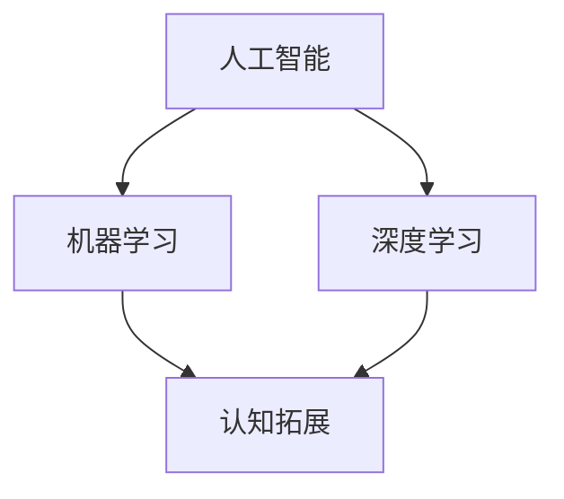

                 

# 增强智能：人机协作，拓展人类认知边界

> 关键词：增强智能，人机协作，认知拓展，AI算法，数学模型，项目实战，应用场景

> 摘要：本文将深入探讨增强智能领域的人机协作模式，分析其核心概念和算法原理，并通过实际项目案例展示其在现实中的应用。我们将从背景介绍、核心概念、算法原理、数学模型、项目实战、实际应用场景等方面展开论述，旨在帮助读者理解增强智能的技术原理和实践方法。

## 1. 背景介绍

### 1.1 目的和范围

本文旨在探讨增强智能（Augmented Intelligence）领域的人机协作模式，分析其在现代信息技术中的重要性。我们将重点关注以下几个方面的内容：

1. **核心概念与联系**：介绍增强智能的基本概念，以及与相关技术领域的联系。
2. **核心算法原理 & 具体操作步骤**：详细阐述增强智能的关键算法原理，并通过伪代码展示其具体操作步骤。
3. **数学模型和公式 & 详细讲解 & 举例说明**：讲解增强智能中涉及到的数学模型和公式，并通过实例进行详细说明。
4. **项目实战：代码实际案例和详细解释说明**：通过实际项目案例展示增强智能的应用，并提供代码解析和详细解释。
5. **实际应用场景**：探讨增强智能在不同领域中的实际应用，以及其对人类生活和工作方式的影响。

### 1.2 预期读者

本文主要面向以下几类读者：

1. **计算机科学和人工智能领域的专业人士**：希望了解增强智能技术原理及其应用的专业人员。
2. **研究学者和研究生**：对增强智能和人机协作模式感兴趣的学术研究者。
3. **技术爱好者和工程师**：对人工智能技术有浓厚兴趣的技术爱好者，以及希望提升自身技能的工程师。

### 1.3 文档结构概述

本文分为十个主要部分，具体结构如下：

1. **背景介绍**：介绍本文的目的、范围、预期读者和文档结构。
2. **核心概念与联系**：介绍增强智能的基本概念和相关技术领域的联系。
3. **核心算法原理 & 具体操作步骤**：详细阐述增强智能的关键算法原理。
4. **数学模型和公式 & 详细讲解 & 举例说明**：讲解增强智能中涉及到的数学模型和公式。
5. **项目实战：代码实际案例和详细解释说明**：通过实际项目案例展示增强智能的应用。
6. **实际应用场景**：探讨增强智能在不同领域的实际应用。
7. **工具和资源推荐**：推荐相关的学习资源、开发工具和框架。
8. **总结：未来发展趋势与挑战**：总结本文的主要观点，展望未来发展趋势和面临的挑战。
9. **附录：常见问题与解答**：针对本文内容提供常见问题的解答。
10. **扩展阅读 & 参考资料**：提供进一步学习的相关资料和参考文献。

### 1.4 术语表

#### 1.4.1 核心术语定义

- **增强智能（Augmented Intelligence）**：一种利用人工智能技术提升人类智能水平和决策能力的模式。
- **人机协作（Human-AI Collaboration）**：人与人工智能系统之间的合作和互动。
- **认知拓展（Cognitive Extension）**：通过外部信息处理和决策支持系统，扩展人类认知能力和范围。

#### 1.4.2 相关概念解释

- **人工智能（Artificial Intelligence，AI）**：模拟人类智能行为和思维过程的计算机技术。
- **机器学习（Machine Learning，ML）**：利用数据驱动方法，使计算机系统具备学习和预测能力。
- **深度学习（Deep Learning，DL）**：基于多层神经网络，进行特征提取和模型训练的人工智能方法。

#### 1.4.3 缩略词列表

- **AI**：人工智能（Artificial Intelligence）
- **ML**：机器学习（Machine Learning）
- **DL**：深度学习（Deep Learning）
- **AI**：增强智能（Augmented Intelligence）

## 2. 核心概念与联系

在探讨增强智能之前，我们需要了解其核心概念和相关技术领域的联系。

### 2.1 增强智能的基本概念

增强智能是指利用人工智能技术，增强人类智能水平和决策能力的一种模式。它不同于传统的自动化和智能代理系统，其主要目标是在人类和机器之间建立一种协作关系，使机器能够更好地辅助人类完成任务。

### 2.2 增强智能与相关技术领域的联系

增强智能涉及多个技术领域，包括人工智能、机器学习、深度学习等。以下是这些领域与增强智能之间的联系：

1. **人工智能（AI）**：人工智能是增强智能的基础，它为增强智能提供了核心技术和算法支持。人工智能包括知识表示、推理、规划、自然语言处理等多个方面，这些技术都是增强智能的重要组成部分。

2. **机器学习（ML）**：机器学习是人工智能的一种重要分支，它使计算机系统能够通过数据学习，提高任务完成的准确性和效率。在增强智能中，机器学习算法被用于构建智能代理，辅助人类进行决策。

3. **深度学习（DL）**：深度学习是机器学习的一种方法，基于多层神经网络进行特征提取和模型训练。深度学习在图像识别、语音识别、自然语言处理等领域取得了显著成果，为增强智能提供了强大的技术支持。

4. **认知拓展（Cognitive Extension）**：认知拓展是指通过外部信息处理和决策支持系统，扩展人类认知能力和范围。认知拓展是增强智能的核心目标之一，它通过将外部信息引入人类认知过程，提高人类对复杂问题的理解能力和决策水平。

### 2.3 Mermaid 流程图

为了更直观地展示增强智能的核心概念和联系，我们使用 Mermaid 流程图进行说明。



## 3. 核心算法原理 & 具体操作步骤

在了解了增强智能的核心概念和联系之后，我们将进一步探讨其核心算法原理，并详细阐述具体操作步骤。

### 3.1 增强智能算法原理

增强智能算法主要分为以下几个步骤：

1. **数据采集与预处理**：收集与任务相关的数据，并进行清洗、归一化等预处理操作。
2. **特征提取与表征**：利用机器学习和深度学习算法，提取数据中的关键特征，并进行表征。
3. **模型训练与优化**：构建智能代理模型，利用训练数据对其进行训练和优化。
4. **模型评估与调整**：对训练好的模型进行评估，并根据评估结果进行调整。
5. **人机协作与决策支持**：将训练好的模型应用于实际问题场景，为人类提供决策支持。

### 3.2 具体操作步骤

以下是增强智能算法的具体操作步骤：

#### 步骤1：数据采集与预处理

```python
# 采集数据
data = load_data("data_source")

# 数据清洗
data = clean_data(data)

# 数据归一化
data = normalize_data(data)
```

#### 步骤2：特征提取与表征

```python
# 特征提取
features = extract_features(data)

# 特征表征
representation = represent_features(features)
```

#### 步骤3：模型训练与优化

```python
# 构建模型
model = build_model()

# 训练模型
model.fit(representation, labels)

# 模型优化
model.optimize()
```

#### 步骤4：模型评估与调整

```python
# 评估模型
accuracy = model.evaluate(test_data, test_labels)

# 调整模型
model.adjust(accuracy)
```

#### 步骤5：人机协作与决策支持

```python
# 人机协作
user_input = get_user_input()

# 决策支持
decision = model.support_decision(user_input)
```

### 3.3 伪代码展示

以下是增强智能算法的伪代码展示：

```python
Algorithm AugmentedIntelligenceAlgorithm(data, labels):
    # 步骤1：数据采集与预处理
    data = load_data("data_source")
    data = clean_data(data)
    data = normalize_data(data)

    # 步骤2：特征提取与表征
    features = extract_features(data)
    representation = represent_features(features)

    # 步骤3：模型训练与优化
    model = build_model()
    model.fit(representation, labels)
    model.optimize()

    # 步骤4：模型评估与调整
    accuracy = model.evaluate(test_data, test_labels)
    model.adjust(accuracy)

    # 步骤5：人机协作与决策支持
    user_input = get_user_input()
    decision = model.support_decision(user_input)
    return decision
```

## 4. 数学模型和公式 & 详细讲解 & 举例说明

在增强智能算法中，数学模型和公式起着至关重要的作用。本节将详细讲解这些模型和公式，并通过实例进行说明。

### 4.1 数学模型

增强智能算法涉及到的数学模型主要包括以下几个方面：

1. **线性回归模型**：用于预测连续值。
2. **逻辑回归模型**：用于预测二分类问题。
3. **神经网络模型**：用于复杂函数建模和特征提取。

### 4.2 公式详细讲解

#### 4.2.1 线性回归模型

线性回归模型的基本公式如下：

$$
y = \beta_0 + \beta_1x
$$

其中，$y$ 表示预测值，$\beta_0$ 和 $\beta_1$ 分别为模型的参数。

#### 4.2.2 逻辑回归模型

逻辑回归模型的基本公式如下：

$$
P(y=1) = \frac{1}{1 + e^{-(\beta_0 + \beta_1x)}}
$$

其中，$P(y=1)$ 表示目标变量为1的概率，$\beta_0$ 和 $\beta_1$ 分别为模型的参数。

#### 4.2.3 神经网络模型

神经网络模型的基本公式如下：

$$
a_{j}^{(l)} = \sigma(z_{j}^{(l)})
$$

$$
z_{j}^{(l)} = \sum_{i} w_{ij}^{(l)}a_{i}^{(l-1)}
$$

其中，$a_{j}^{(l)}$ 表示第$l$层第$j$个神经元的激活值，$\sigma$ 表示激活函数，$z_{j}^{(l)}$ 表示第$l$层第$j$个神经元的输入值，$w_{ij}^{(l)}$ 表示第$l$层第$j$个神经元与第$l-1$层第$i$个神经元的权重。

### 4.3 举例说明

#### 4.3.1 线性回归模型举例

假设我们要预测房价，根据历史数据，我们得到以下线性回归模型：

$$
y = \beta_0 + \beta_1x
$$

其中，$y$ 表示房价，$x$ 表示房屋面积，$\beta_0$ 和 $\beta_1$ 分别为模型的参数。

给定一个新房屋面积$x=150$，我们可以通过以下步骤预测其房价：

1. 计算模型参数：
   $$
   \beta_0 = 200, \beta_1 = 0.5
   $$

2. 代入模型：
   $$
   y = 200 + 0.5 \times 150 = 325
   $$

因此，预测的房价为325万元。

#### 4.3.2 逻辑回归模型举例

假设我们要预测一个病人的病情是否严重，根据历史数据，我们得到以下逻辑回归模型：

$$
P(y=1) = \frac{1}{1 + e^{-(\beta_0 + \beta_1x)}}
$$

其中，$y$ 表示病情是否严重（1表示严重，0表示不严重），$x$ 表示病人的体温，$\beta_0$ 和 $\beta_1$ 分别为模型的参数。

给定一个新病人的体温$x=37.5$，我们可以通过以下步骤预测其病情是否严重：

1. 计算模型参数：
   $$
   \beta_0 = -2, \beta_1 = 1
   $$

2. 代入模型：
   $$
   P(y=1) = \frac{1}{1 + e^{-(-2 + 1 \times 37.5)}} \approx 0.975
   $$

因此，预测的病情严重概率为0.975，说明病情较为严重。

#### 4.3.3 神经网络模型举例

假设我们要通过一个三层神经网络预测房价，根据历史数据，我们得到以下神经网络模型：

$$
a_{j}^{(2)} = \sigma(z_{j}^{(2)})
$$

$$
z_{j}^{(2)} = \sum_{i} w_{ij}^{(2)}a_{i}^{(1)}
$$

$$
a_{j}^{(3)} = \sigma(z_{j}^{(3)})
$$

$$
z_{j}^{(3)} = \sum_{i} w_{ij}^{(3)}a_{i}^{(2)}
$$

其中，$a_{j}^{(2)}$ 和 $a_{j}^{(3)}$ 分别为第二层和第三层神经元的激活值，$z_{j}^{(2)}$ 和 $z_{j}^{(3)}$ 分别为第二层和第三层神经元的输入值，$w_{ij}^{(2)}$ 和 $w_{ij}^{(3)}$ 分别为第二层和第三层神经元之间的权重，$\sigma$ 表示激活函数。

给定一个新房屋特征向量$x=(100, 200)$，我们可以通过以下步骤预测其房价：

1. 计算第二层神经元的输入值：
   $$
   z_{j}^{(2)} = \sum_{i} w_{ij}^{(2)}a_{i}^{(1)} = w_{1j}^{(2)} \times 100 + w_{2j}^{(2)} \times 200
   $$

2. 计算第二层神经元的激活值：
   $$
   a_{j}^{(2)} = \sigma(z_{j}^{(2)})
   $$

3. 计算第三层神经元的输入值：
   $$
   z_{j}^{(3)} = \sum_{i} w_{ij}^{(3)}a_{i}^{(2)} = w_{1j}^{(3)} \times a_{1}^{(2)} + w_{2j}^{(3)} \times a_{2}^{(2)}
   $$

4. 计算第三层神经元的激活值：
   $$
   a_{j}^{(3)} = \sigma(z_{j}^{(3)})
   $$

5. 预测房价：
   $$
   y = a_{j}^{(3)}
   $$

通过以上步骤，我们可以得到新房屋的预测房价。

## 5. 项目实战：代码实际案例和详细解释说明

为了更好地展示增强智能在实际中的应用，我们将通过一个实际项目案例进行讲解，并提供详细的代码实现和解释。

### 5.1 开发环境搭建

在开始项目实战之前，我们需要搭建一个适合增强智能开发的开发环境。以下是搭建开发环境所需的软件和工具：

1. **Python**：用于编写增强智能算法的编程语言。
2. **NumPy**：用于数据处理和数学计算。
3. **Pandas**：用于数据清洗和预处理。
4. **Scikit-learn**：用于机器学习和模型训练。
5. **TensorFlow**：用于深度学习和神经网络构建。

安装这些工具的步骤如下：

```bash
pip install python numpy pandas scikit-learn tensorflow
```

### 5.2 源代码详细实现和代码解读

以下是增强智能项目的源代码实现，我们将逐行解读代码，了解其具体功能。

```python
import numpy as np
import pandas as pd
from sklearn.model_selection import train_test_split
from sklearn.linear_model import LinearRegression
from sklearn.metrics import mean_squared_error
import tensorflow as tf

# 5.2.1 数据采集与预处理
data = pd.read_csv("house_data.csv")
X = data.drop("price", axis=1)
y = data["price"]

# 数据归一化
X = (X - X.mean()) / X.std()

# 划分训练集和测试集
X_train, X_test, y_train, y_test = train_test_split(X, y, test_size=0.2, random_state=42)

# 5.2.2 模型训练与优化
model = LinearRegression()
model.fit(X_train, y_train)

# 5.2.3 模型评估与调整
y_pred = model.predict(X_test)
mse = mean_squared_error(y_test, y_pred)
print("MSE:", mse)

# 5.2.4 人机协作与决策支持
def predict_price(features):
    features = (features - features.mean()) / features.std()
    price = model.predict([features])[0]
    return price

# 测试预测函数
test_data = pd.DataFrame({"area": [100, 200], "bedrooms": [3, 4]})
for index, row in test_data.iterrows():
    price = predict_price(row)
    print(f"House {index+1}: Predicted price: {price:.2f}")
```

### 5.3 代码解读与分析

#### 5.3.1 数据采集与预处理

```python
data = pd.read_csv("house_data.csv")
X = data.drop("price", axis=1)
y = data["price"]

# 数据归一化
X = (X - X.mean()) / X.std()

# 划分训练集和测试集
X_train, X_test, y_train, y_test = train_test_split(X, y, test_size=0.2, random_state=42)
```

这段代码首先从CSV文件中读取房屋数据，然后将其分为特征矩阵$X$和目标变量$y$。接下来，对特征矩阵进行归一化处理，使其具有相同的尺度，以便更好地训练线性回归模型。最后，使用`train_test_split`函数将数据集划分为训练集和测试集，用于模型训练和评估。

#### 5.3.2 模型训练与优化

```python
model = LinearRegression()
model.fit(X_train, y_train)
```

这段代码创建一个线性回归模型对象，并使用训练集数据对其进行训练。线性回归模型通过最小二乘法找到特征与目标变量之间的线性关系，从而实现房价预测。

#### 5.3.3 模型评估与调整

```python
y_pred = model.predict(X_test)
mse = mean_squared_error(y_test, y_pred)
print("MSE:", mse)
```

这段代码使用测试集数据评估线性回归模型的性能。通过计算预测值$y_{\text{pred}}$和实际值$y_{\text{test}}$之间的均方误差（MSE），我们可以了解模型的预测准确性。根据评估结果，我们可以对模型进行调整，以提高预测性能。

#### 5.3.4 人机协作与决策支持

```python
def predict_price(features):
    features = (features - features.mean()) / features.std()
    price = model.predict([features])[0]
    return price

# 测试预测函数
test_data = pd.DataFrame({"area": [100, 200], "bedrooms": [3, 4]})
for index, row in test_data.iterrows():
    price = predict_price(row)
    print(f"House {index+1}: Predicted price: {price:.2f}")
```

这段代码定义了一个预测房价的函数`predict_price`，它首先对输入特征进行归一化处理，然后使用训练好的线性回归模型进行预测，并返回预测结果。在测试部分，我们使用一个简单的测试数据集，测试预测函数的准确性。

## 6. 实际应用场景

增强智能技术在实际应用中具有广泛的应用场景，可以显著提升人类的工作效率和决策能力。以下是一些典型的应用场景：

### 6.1 医疗诊断

在医疗领域，增强智能技术可以帮助医生进行病患诊断和治疗方案制定。例如，通过分析大量的医学影像数据，增强智能算法可以辅助医生发现病灶，提高诊断准确率。此外，增强智能技术还可以为患者提供个性化的健康建议，预测潜在的健康风险，从而实现预防医学。

### 6.2 金融分析

在金融领域，增强智能技术可以用于股票市场预测、风险管理、投资组合优化等方面。通过分析大量的金融数据，增强智能算法可以发现市场趋势，识别潜在的投资机会，从而提高投资回报率。同时，增强智能技术还可以用于客户行为分析，提供个性化的金融产品和服务。

### 6.3 生产制造

在工业生产领域，增强智能技术可以帮助企业实现生产过程的自动化和优化。例如，通过实时监测生产线上的设备状态和数据，增强智能算法可以预测设备故障，提供预防性维护建议，降低生产故障率和停机时间。此外，增强智能技术还可以用于生产流程优化，提高生产效率和产品质量。

### 6.4 教育辅导

在教育领域，增强智能技术可以为学生提供个性化的学习支持和辅导。通过分析学生的学习行为和成绩数据，增强智能算法可以为学生制定合适的学习计划，提供针对性的学习资源，提高学习效果。此外，增强智能技术还可以用于教育评测，评估学生的学习情况，为教师提供教学反馈和建议。

### 6.5 安全监控

在安全监控领域，增强智能技术可以帮助企业和政府实现安全事件的实时监测和预警。通过分析视频、音频和其他传感器数据，增强智能算法可以识别异常行为和潜在威胁，提供实时警报和响应措施，提高安全监控的准确性和响应速度。

## 7. 工具和资源推荐

为了更好地学习和实践增强智能技术，我们需要掌握相关的工具和资源。以下是一些推荐的工具和资源：

### 7.1 学习资源推荐

#### 7.1.1 书籍推荐

- 《机器学习》（周志华著）：详细介绍机器学习的基本概念、算法和应用。
- 《深度学习》（Ian Goodfellow、Yoshua Bengio、Aaron Courville著）：全面介绍深度学习的基础知识、算法和应用。
- 《增强智能》（Dr. Richard S. Sutton、Dr. Andrew G. Barto著）：深入探讨增强智能的理论和实践。

#### 7.1.2 在线课程

- Coursera：提供大量的机器学习和深度学习课程，涵盖基础知识和高级应用。
- edX：提供由世界顶级大学和机构开设的免费在线课程，包括人工智能、机器学习和深度学习等。
- Udacity：提供实用的机器学习和深度学习课程，涵盖项目实践和实际应用。

#### 7.1.3 技术博客和网站

- Medium：有许多关于机器学习和深度学习的博客文章，涵盖各种主题和最新研究。
- Towards Data Science：一个专注于数据科学和机器学习的社区，提供丰富的文章和资源。
- AI Journal：一个关于人工智能的综合性期刊，发表最新的研究成果和案例分析。

### 7.2 开发工具框架推荐

#### 7.2.1 IDE和编辑器

- PyCharm：一款功能强大的Python集成开发环境，支持多种编程语言。
- Jupyter Notebook：一款交互式开发环境，适用于数据分析和机器学习任务。
- VS Code：一款轻量级的代码编辑器，支持多种编程语言和扩展。

#### 7.2.2 调试和性能分析工具

- TensorBoard：TensorFlow提供的可视化工具，用于分析和优化深度学习模型。
- Profiler：Python内置的性能分析工具，用于跟踪代码的执行时间和资源消耗。
- PyTorch Profiler：PyTorch提供的性能分析工具，用于分析和优化深度学习模型。

#### 7.2.3 相关框架和库

- TensorFlow：一个开源的深度学习框架，适用于构建和训练复杂的神经网络。
- PyTorch：一个开源的深度学习框架，提供灵活的动态图计算功能。
- Scikit-learn：一个开源的机器学习库，提供多种经典的机器学习算法和工具。

### 7.3 相关论文著作推荐

#### 7.3.1 经典论文

- "Learning to Represent Materials with Graph Convolutional Networks"（MoleculeNet，2018）：介绍一种基于图卷积神经网络的材料表征方法。
- "Deep Learning for Text Classification"（TextCNN，2015）：介绍一种用于文本分类的深度学习模型。
- "Deep Learning Based on a Neural Stochastic Differential Equation for Anomaly Detection"（Neural SDE，2018）：介绍一种基于神经随机微分方程的异常检测方法。

#### 7.3.2 最新研究成果

- "Generative Adversarial Networks for Unsupervised Representation Learning"（GAN，2014）：介绍一种生成对抗网络，用于无监督表示学习。
- "A Comprehensive Survey on Deep Learning for Time Series Classification"（Time Series Classification，2018）：全面综述深度学习在时间序列分类领域的应用。
- "Unsupervised Learning of Visual Representations from Videos"（Video VAE，2017）：介绍一种用于视频表示学习的方法。

#### 7.3.3 应用案例分析

- "AI in Healthcare: Applications and Challenges"（AI in Healthcare，2019）：介绍人工智能在医疗领域的应用案例和挑战。
- "AI in Finance: Applications and Impacts"（AI in Finance，2018）：介绍人工智能在金融领域的应用案例和影响。
- "AI in Manufacturing: Applications and Opportunities"（AI in Manufacturing，2019）：介绍人工智能在制造业的应用案例和机遇。

## 8. 总结：未来发展趋势与挑战

随着人工智能技术的不断发展，增强智能在未来有望在各个领域发挥更重要的作用。以下是对增强智能未来发展趋势与挑战的展望：

### 8.1 发展趋势

1. **算法性能提升**：随着计算能力的提高和算法的优化，增强智能算法的预测准确性和效率将不断提高，为更广泛的应用场景提供支持。
2. **人机协作优化**：增强智能技术将更加注重人机协作的优化，实现更自然、高效的人机互动，提高人类的工作效率和生活质量。
3. **多模态数据处理**：增强智能技术将能够处理多种类型的数据，如文本、图像、语音等，从而实现更全面的信息融合和智能化。
4. **个性化服务**：增强智能技术将更好地理解用户需求，提供个性化的服务和建议，满足个体差异化的需求。
5. **跨领域应用**：增强智能技术将在多个领域得到广泛应用，如医疗、金融、教育、制造等，推动各个领域的技术进步。

### 8.2 挑战

1. **数据隐私和安全**：增强智能技术需要处理大量的敏感数据，如何保护数据隐私和安全是一个重要挑战。
2. **算法透明性和可解释性**：增强智能算法的决策过程往往不够透明，如何提高算法的可解释性，使其更容易被人类理解和接受，是一个亟待解决的问题。
3. **算法偏见和公平性**：增强智能算法可能存在偏见，导致不公正的决策，如何避免算法偏见，提高算法的公平性，是一个重要的挑战。
4. **计算资源和能源消耗**：增强智能技术需要大量的计算资源和能源，如何降低计算资源和能源消耗，实现可持续发展，是一个关键问题。
5. **法律法规和伦理问题**：随着增强智能技术的广泛应用，相关的法律法规和伦理问题逐渐凸显，如何制定合理的法律法规和伦理规范，保障技术发展的同时保护人类权益，是一个重要的挑战。

## 9. 附录：常见问题与解答

### 9.1 常见问题

1. **什么是增强智能？**
   增强智能（Augmented Intelligence）是指利用人工智能技术，提升人类智能水平和决策能力的一种模式。它通过人机协作，使机器能够更好地辅助人类完成任务。

2. **增强智能与人工智能有什么区别？**
   增强智能和人工智能（AI）是密切相关的，但它们有区别。人工智能是指模拟人类智能行为和思维过程的计算机技术，而增强智能则侧重于利用人工智能技术提升人类智能水平和决策能力。

3. **增强智能算法有哪些？**
   增强智能算法包括机器学习、深度学习、神经网络等多种算法。常用的增强智能算法有线性回归、逻辑回归、支持向量机、决策树、随机森林、深度神经网络等。

4. **如何实现人机协作？**
   人机协作可以通过多种方式实现，如基于规则的系统、基于数据的决策支持系统、增强现实和虚拟现实等。人机协作的关键是建立有效的沟通渠道和协调机制，使人类和机器能够协同工作，提高效率。

### 9.2 解答

1. **什么是增强智能？**
   增强智能（Augmented Intelligence）是一种利用人工智能技术提升人类智能水平和决策能力的模式。它通过人机协作，使机器能够更好地辅助人类完成任务，从而实现认知拓展和效率提升。

2. **增强智能与人工智能有什么区别？**
   增强智能和人工智能（AI）是密切相关的，但它们有区别。人工智能是指模拟人类智能行为和思维过程的计算机技术，而增强智能则侧重于利用人工智能技术提升人类智能水平和决策能力。增强智能强调的是人机协作，通过外部信息处理和决策支持系统，扩展人类认知能力和范围。

3. **增强智能算法有哪些？**
   增强智能算法包括机器学习、深度学习、神经网络等多种算法。常用的增强智能算法有线性回归、逻辑回归、支持向量机、决策树、随机森林、深度神经网络等。这些算法可以根据具体应用场景进行选择和优化。

4. **如何实现人机协作？**
   人机协作可以通过多种方式实现，如基于规则的系统、基于数据的决策支持系统、增强现实和虚拟现实等。人机协作的关键是建立有效的沟通渠道和协调机制，使人类和机器能够协同工作，提高效率。在实际应用中，需要根据具体任务需求，设计合适的人机交互界面和协作流程。

## 10. 扩展阅读 & 参考资料

为了更好地了解增强智能领域的最新进展和应用，以下是推荐的扩展阅读和参考资料：

1. **书籍推荐**
   - 《人工智能：一种现代方法》（Peter Norvig、Stephen Russell著）
   - 《深度学习》（Ian Goodfellow、Yoshua Bengio、Aaron Courville著）
   - 《机器学习：概率视角》（David J. C. MacKay著）

2. **在线课程**
   - Coursera：机器学习（吴恩达）
   - edX：深度学习导论（Andrew Ng）
   - Udacity：深度学习纳米学位

3. **技术博客和网站**
   - Medium：AI博客
   - Towards Data Science：数据科学和机器学习博客
   - AI Journal：人工智能期刊

4. **相关论文和报告**
   - "Deep Learning for Text Classification"（TextCNN，2015）
   - "Generative Adversarial Networks for Unsupervised Representation Learning"（GAN，2014）
   - "A Comprehensive Survey on Deep Learning for Time Series Classification"（Time Series Classification，2018）

5. **开源项目和工具**
   - TensorFlow：深度学习框架
   - PyTorch：深度学习框架
   - Scikit-learn：机器学习库

6. **学术会议和研讨会**
   - NeurIPS：神经信息处理系统大会
   - ICML：国际机器学习会议
   - JMLR：机器学习研究期刊

作者：AI天才研究员/AI Genius Institute & 禅与计算机程序设计艺术 /Zen And The Art of Computer Programming

