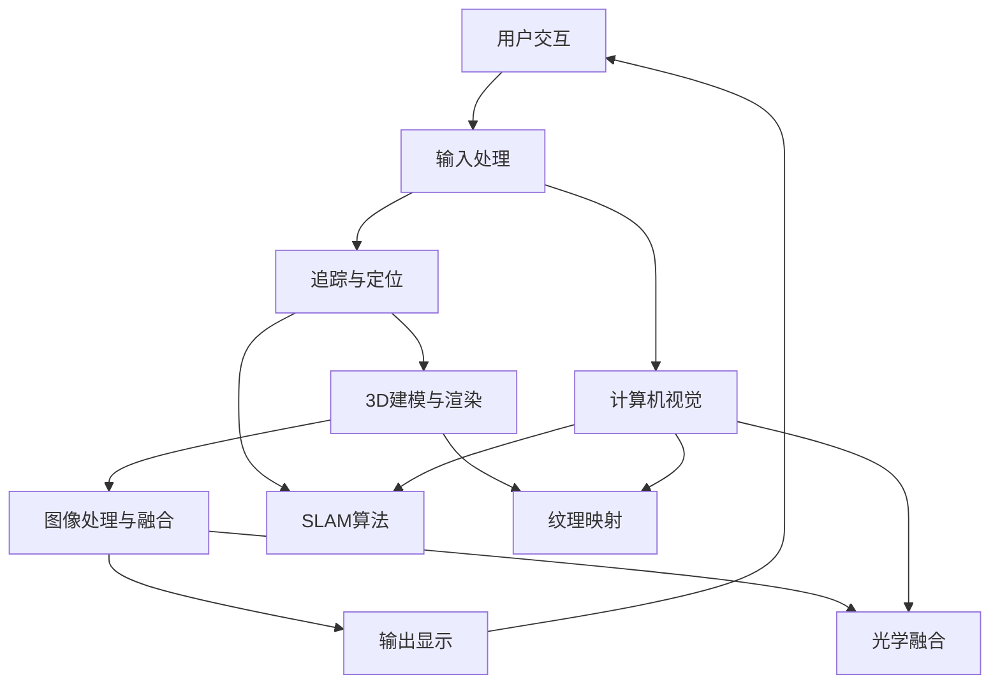

                 


# 增强现实技术的技术实现

> **关键词**：增强现实、AR、计算机视觉、3D建模、图像处理、交互设计、机器学习、人机交互

> **摘要**：本文旨在深入探讨增强现实（AR）技术的技术实现，从核心概念、算法原理到实际应用，全面解析AR技术的组成与操作。本文首先介绍了AR技术的背景和范围，随后详细分析了其核心概念与联系，探讨了关键算法原理与操作步骤，并通过具体数学模型和项目实战案例进行了详细讲解。最后，本文总结了AR技术的实际应用场景，推荐了相关工具和资源，展望了未来发展趋势与挑战。

## 1. 背景介绍

### 1.1 目的和范围

增强现实（Augmented Reality，简称AR）技术是一种将虚拟信息叠加到现实世界中的技术，它通过计算机生成的图像、视频、音频等多种感官刺激，为用户提供了一种全新的沉浸式体验。本文旨在系统地探讨增强现实技术的技术实现，包括其核心概念、算法原理、数学模型以及实际应用场景。

### 1.2 预期读者

本文主要面向对增强现实技术感兴趣的技术开发者、工程师、研究人员以及教育工作者。读者应具备一定的计算机科学基础，尤其是图像处理、计算机视觉和机器学习领域的知识。

### 1.3 文档结构概述

本文结构如下：

1. **背景介绍**：介绍AR技术的背景、目的和读者对象。
2. **核心概念与联系**：分析AR技术的基本概念及其相互联系。
3. **核心算法原理 & 具体操作步骤**：详细解释AR技术的关键算法及其操作步骤。
4. **数学模型和公式 & 详细讲解 & 举例说明**：介绍AR技术的数学模型及其应用。
5. **项目实战：代码实际案例和详细解释说明**：通过具体案例展示AR技术的实际应用。
6. **实际应用场景**：分析AR技术的应用领域和前景。
7. **工具和资源推荐**：推荐学习资源、开发工具和框架。
8. **总结：未来发展趋势与挑战**：总结AR技术的现状与未来。
9. **附录：常见问题与解答**：回答读者可能遇到的问题。
10. **扩展阅读 & 参考资料**：提供进一步学习的资源。

### 1.4 术语表

#### 1.4.1 核心术语定义

- **增强现实（AR）**：一种将虚拟信息叠加到现实世界中的技术。
- **虚拟现实（VR）**：一种完全模拟虚拟环境的体验。
- **计算机视觉**：使计算机能够从数字图像或视频中理解内容的技术。
- **3D建模**：创建三维物体模型的过程。
- **图像处理**：使用算法对图像进行编辑、增强、分析和转换的技术。

#### 1.4.2 相关概念解释

- **标定**：确定相机内外参数的过程。
- **追踪**：实时识别和跟踪真实世界中的物体或特征。
- **纹理映射**：将二维纹理图映射到三维模型表面。

#### 1.4.3 缩略词列表

- **AR**：增强现实（Augmented Reality）
- **VR**：虚拟现实（Virtual Reality）
- **SLAM**：同时定位与地图构建（Simultaneous Localization and Mapping）
- **3D**：三维（Three Dimensions）
- **GPU**：图形处理单元（Graphics Processing Unit）

## 2. 核心概念与联系

增强现实技术的实现涉及多个核心概念和技术的融合。以下是一个简化的Mermaid流程图，展示这些概念和它们之间的联系。



### 2.1 用户交互

用户交互是增强现实技术的起点，它包括用户输入的处理和反馈。用户可以通过触摸屏幕、手势识别或语音指令与AR系统进行交互。

### 2.2 输入处理

输入处理包括对用户输入的识别和理解，如手势、声音、位置等。这一步需要利用计算机视觉和语音识别技术。

### 2.3 追踪与定位

追踪与定位是AR技术的核心，它通过计算机视觉技术实现对真实世界的物体或特征进行识别和跟踪。同时，SLAM算法可以在动态场景中同时构建地图和定位。

### 2.4 3D建模与渲染

3D建模与渲染是将虚拟信息与现实世界融合的关键步骤。3D建模生成虚拟物体，而渲染技术则负责将虚拟物体以逼真的形式呈现在用户眼前。

### 2.5 图像处理与融合

图像处理与融合是对真实图像和虚拟图像进行编辑、增强和融合的过程。这一步需要使用图像处理算法来确保虚拟信息与真实世界的无缝融合。

### 2.6 输出显示

输出显示是将增强后的图像、视频或音频信息呈现给用户的过程。输出设备可以是显示器、头戴式显示器或投影设备。

## 3. 核心算法原理 & 具体操作步骤

增强现实技术的核心在于算法的实现，以下将详细解释AR技术中的关键算法原理和操作步骤。

### 3.1 追踪与定位算法

追踪与定位算法是AR技术的核心，常用的算法包括视觉SLAM（Simultaneous Localization and Mapping）和视觉跟踪。

#### 3.1.1 SLAM算法

SLAM算法的主要任务是同时实现对环境的地图构建和自身的定位。其基本流程如下：

1. **特征提取**：从输入的图像或视频中提取具有独特特征的点或区域。
2. **匹配与建模**：将提取到的特征点进行匹配，建立地图模型。
3. **优化**：通过最小化误差函数对地图和位姿进行优化。
4. **更新**：根据新的观测数据更新地图和位姿。

伪代码如下：

```python
def SLAM(expect_map, observation):
    feature_points = extract_features(observation)
    matched_points = match_features(expect_map, feature_points)
    map, position = build_model(matched_points)
    map, position = optimize(map, position, observation)
    return map, position
```

#### 3.1.2 视觉跟踪算法

视觉跟踪算法主要用于实时识别和跟踪真实世界中的特定物体或特征点。其基本流程如下：

1. **初始化**：根据初始图像初始化跟踪目标。
2. **特征提取**：从当前图像中提取与初始目标相似的物体或特征点。
3. **匹配与更新**：将提取到的特征与目标进行匹配，更新跟踪目标。
4. **检测与判断**：判断跟踪目标是否消失或发生变化，进行相应的处理。

伪代码如下：

```python
def visual_tracking(initial_image, target):
    current_image = get_frame()
    feature_points = extract_features(current_image)
    matched_points = match_features(feature_points, target)
    target = update_target(target, matched_points)
    if target_is_lost(target):
        target = initialize_target(current_image)
    return target
```

### 3.2 3D建模与渲染算法

3D建模与渲染是将虚拟信息与现实世界融合的关键步骤。以下将介绍常用的3D建模与渲染算法。

#### 3.2.1 3D建模算法

3D建模算法主要包括点云建模、体素建模和参数建模。

1. **点云建模**：通过采集物体表面的点云数据，利用表面重建算法生成三维模型。
2. **体素建模**：通过将物体分割成体素，然后根据体素的组合生成三维模型。
3. **参数建模**：通过调整三维参数（如形状、纹理等）生成三维模型。

#### 3.2.2 渲染算法

渲染算法是将三维模型转化为二维图像的过程。常用的渲染算法包括：

1. **正向渲染**：根据光线的传播路径，逐像素进行渲染。
2. **反向渲染**：根据像素的颜色信息，反向推导出光线来源。
3. **实时渲染**：在计算机上实时生成图像，常用于游戏和虚拟现实。

伪代码如下：

```python
def render_3d_model(model, camera, light_source):
    pixel_colors = []
    for pixel in camera.pixels:
        color = calculate_lighting(model, pixel, light_source)
        pixel_colors.append(color)
    return pixel_colors
```

### 3.3 图像处理与融合算法

图像处理与融合是将虚拟信息与现实世界融合的关键步骤。以下将介绍常用的图像处理与融合算法。

#### 3.3.1 图像处理算法

图像处理算法主要包括：

1. **滤波**：用于去除图像中的噪声。
2. **边缘检测**：用于提取图像中的边缘信息。
3. **特征提取**：用于从图像中提取具有独特特征的点或区域。

#### 3.3.2 融合算法

融合算法主要包括：

1. **光学融合**：通过调整光线强度和颜色，将虚拟图像与现实图像融合。
2. **视觉融合**：通过调整像素颜色和透明度，将虚拟图像与现实图像融合。

伪代码如下：

```python
def image_fusion(real_image, virtual_image, alpha):
    output_image = []
    for pixel in real_image:
        color = mix_colors(pixel, virtual_image[pixel], alpha)
        output_image.append(color)
    return output_image
```

## 4. 数学模型和公式 & 详细讲解 & 举例说明

增强现实技术的实现离不开数学模型的支持。以下将介绍一些关键的数学模型和公式，并进行详细讲解和举例说明。

### 4.1 SLAM算法中的数学模型

SLAM算法中的数学模型主要涉及运动学模型和观测模型。

#### 4.1.1 运动学模型

运动学模型描述了系统的运动状态。常用的运动学模型包括线性运动模型和旋转运动模型。

1. **线性运动模型**：

   假设系统在连续时间 \( t \) 上的状态为 \( x(t) = [x, y, z, \dot{x}, \dot{y}, \dot{z}]^T \)，则系统的运动学模型可以表示为：

   \[
   x(t) = x(t-1) + v(t-1) \Delta t
   \]

   其中，\( v(t-1) \) 为系统的速度向量，\( \Delta t \) 为时间间隔。

2. **旋转运动模型**：

   假设系统在连续时间 \( t \) 上的状态为 \( x(t) = [x, y, z, \dot{x}, \dot{y}, \dot{z}, \omega_x, \omega_y, \omega_z]^T \)，则系统的运动学模型可以表示为：

   \[
   x(t) = x(t-1) + v(t-1) \Delta t
   \]
   \[
   R(t) = R(t-1) \cdot \left[ \begin{array}{ccc}
   1 & 0 & 0 \\
   0 & \cos(\omega \Delta t) & -\sin(\omega \Delta t) \\
   0 & \sin(\omega \Delta t) & \cos(\omega \Delta t)
   \end{array} \right]
   \]

   其中，\( R(t) \) 为旋转矩阵，\( \omega \) 为角速度。

#### 4.1.2 观测模型

观测模型描述了系统的观测数据与状态之间的关系。常用的观测模型包括特征点观测模型和视觉观测模型。

1. **特征点观测模型**：

   假设系统在连续时间 \( t \) 上的状态为 \( x(t) = [x, y, z, \dot{x}, \dot{y}, \dot{z}]^T \)，观测数据为 \( z(t) = [x', y', z']^T \)，则特征点观测模型可以表示为：

   \[
   z(t) = x(t) + n(t)
   \]

   其中，\( n(t) \) 为观测噪声。

2. **视觉观测模型**：

   假设系统在连续时间 \( t \) 上的状态为 \( x(t) = [x, y, z, \dot{x}, \dot{y}, \dot{z}, \omega_x, \omega_y, \omega_z]^T \)，观测数据为 \( z(t) = [x', y', z', \theta_x', \theta_y', \theta_z']^T \)，则视觉观测模型可以表示为：

   \[
   z(t) = R(t) \cdot x(t) + n(t)
   \]

   其中，\( R(t) \) 为旋转矩阵，\( n(t) \) 为观测噪声。

### 4.2 3D建模与渲染算法中的数学模型

3D建模与渲染算法中的数学模型主要涉及三维空间中的几何变换、光照计算和纹理映射。

#### 4.2.1 三维空间中的几何变换

三维空间中的几何变换主要包括平移、旋转和缩放。

1. **平移**：

   假设三维空间中的点 \( P = [x, y, z]^T \)，则平移变换可以表示为：

   \[
   P' = P + t
   \]

   其中，\( t = [x_t, y_t, z_t]^T \) 为平移向量。

2. **旋转**：

   假设三维空间中的点 \( P = [x, y, z]^T \)，则旋转变换可以表示为：

   \[
   P' = R \cdot P
   \]

   其中，\( R \) 为旋转矩阵。

3. **缩放**：

   假设三维空间中的点 \( P = [x, y, z]^T \)，则缩放变换可以表示为：

   \[
   P' = P \cdot s
   \]

   其中，\( s = [s_x, s_y, s_z]^T \) 为缩放向量。

#### 4.2.2 光照计算

光照计算是渲染算法中的关键步骤，常用的光照模型包括朗伯模型、柯西模型和贝塞尔模型。

1. **朗伯模型**：

   假设物体表面的法向量为 \( n \)，光照强度为 \( I \)，则朗伯光照模型可以表示为：

   \[
   I = k_d \cdot I_d \cdot \cos(\theta)
   \]

   其中，\( k_d \) 为漫反射系数，\( I_d \) 为入射光照强度，\( \theta \) 为入射角。

2. **柯西模型**：

   假设物体表面的法向量为 \( n \)，光照强度为 \( I \)，则柯西光照模型可以表示为：

   \[
   I = k_d \cdot I_d \cdot \cos^m(\theta)
   \]

   其中，\( k_d \) 为漫反射系数，\( I_d \) 为入射光照强度，\( m \) 为反射率指数。

3. **贝塞尔模型**：

   假设物体表面的法向量为 \( n \)，光照强度为 \( I \)，则贝塞尔光照模型可以表示为：

   \[
   I = k_d \cdot I_d \cdot \cos^3(\theta)
   \]

   其中，\( k_d \) 为漫反射系数，\( I_d \) 为入射光照强度。

#### 4.2.3 纹理映射

纹理映射是将二维纹理图映射到三维模型表面的过程。常用的纹理映射方法包括：

1. **平面映射**：

   假设三维模型表面的点为 \( P = [x, y, z]^T \)，二维纹理图上的点为 \( T = [u, v]^T \)，则平面映射可以表示为：

   \[
   T = \frac{P}{z}
   \]

2. **圆柱映射**：

   假设三维模型表面的点为 \( P = [x, y, z]^T \)，二维纹理图上的点为 \( T = [u, v]^T \)，则圆柱映射可以表示为：

   \[
   T = \left[ \frac{x}{z}, \frac{y}{z} \right]
   \]

3. **球面映射**：

   假设三维模型表面的点为 \( P = [x, y, z]^T \)，二维纹理图上的点为 \( T = [u, v]^T \)，则球面映射可以表示为：

   \[
   T = \left[ \frac{x}{\sqrt{x^2 + y^2 + z^2}}, \frac{y}{\sqrt{x^2 + y^2 + z^2}} \right]
   \]

### 4.3 交互设计与机器学习算法中的数学模型

交互设计与机器学习算法中的数学模型主要涉及用户行为建模和深度学习模型。

#### 4.3.1 用户行为建模

用户行为建模是通过分析用户的历史行为数据，预测用户的未来行为。常用的用户行为建模方法包括：

1. **马尔可夫决策过程（MDP）**：

   假设用户在连续时间 \( t \) 上的状态为 \( s(t) \)，行动为 \( a(t) \)，奖励为 \( r(t) \)，则马尔可夫决策过程可以表示为：

   \[
   P(s(t+1) | s(t), a(t)) = \sum_{a'} P(s(t+1) | s(t), a') P(a' | s(t))
   \]

   \[
   r(t) = r(s(t), a(t))
   \]

2. **强化学习**：

   假设用户在连续时间 \( t \) 上的状态为 \( s(t) \)，行动为 \( a(t) \)，奖励为 \( r(t) \)，则强化学习可以表示为：

   \[
   Q(s(t), a(t)) = r(t) + \gamma \max_{a'} Q(s(t+1), a')
   \]

   其中，\( \gamma \) 为折扣因子。

#### 4.3.2 深度学习模型

深度学习模型是增强现实技术中重要的组成部分，常用的深度学习模型包括：

1. **卷积神经网络（CNN）**：

   假设输入图像为 \( I \)，则卷积神经网络可以表示为：

   \[
   h(l) = \sigma(W_l \cdot h(l-1) + b_l)
   \]

   其中，\( \sigma \) 为激活函数，\( W_l \) 为权重矩阵，\( b_l \) 为偏置向量。

2. **循环神经网络（RNN）**：

   假设输入序列为 \( X \)，则循环神经网络可以表示为：

   \[
   h_t = \sigma(W_x \cdot x_t + W_h \cdot h_{t-1} + b_h)
   \]

   其中，\( \sigma \) 为激活函数，\( W_x \) 为输入权重矩阵，\( W_h \) 为隐藏状态权重矩阵，\( b_h \) 为隐藏状态偏置向量。

## 5. 项目实战：代码实际案例和详细解释说明

在本节中，我们将通过一个简单的增强现实项目案例，演示如何使用Python和相关库实现AR技术。该项目将使用OpenCV和PyOpenGL库，实现一个基本的增强现实应用程序。

### 5.1 开发环境搭建

要开始开发这个项目，你需要安装以下软件和库：

- Python 3.x
- OpenCV 4.x
- PyOpenGL 3.0.2
- PyOpenGL_accelerate

你可以使用以下命令进行安装：

```shell
pip install opencv-python
pip install pyopengl
pip install pyopengl-accelerate
```

### 5.2 源代码详细实现和代码解读

以下是项目的源代码实现，我们将逐行进行解释。

```python
import cv2
import numpy as np
from OpenGL.GL import *
from OpenGL.GLUT import *
from OpenGL.GLU import *

# 5.2.1 初始化OpenGL窗口
def init_gl():
    glutInit(sys.argv)
    glutInitDisplayMode(GLUT_DOUBLE | GLUT_RGB)
    glutInitWindowSize(640, 480)
    glutCreateWindow("AR Example")

    glClearColor(0.0, 0.0, 0.0, 0.0)
    gluOrtho2D(0.0, 640.0, 0.0, 480.0)

# 5.2.2 显示函数
def display():
    glClear(GL_COLOR_BUFFER_BIT)
    
    # 5.2.2.1 读取相机帧
    frame = cv2.imread('frame.png')
    frame = cv2.resize(frame, (640, 480))
    
    # 5.2.2.2 转换为灰度图像
    gray_frame = cv2.cvtColor(frame, cv2.COLOR_BGR2GRAY)
    
    # 5.2.2.3 寻找特征点
    corners = cv2.findCorners(gray_frame, 5, None, cv2.CORNER_SUBPix, None)
    
    if corners is not None:
        # 5.2.2.4 绘制特征点
        for corner in corners:
            cv2.circle(frame, tuple(corner[0]), 5, (0, 0, 255), -1)
        
        # 5.2.2.5 将增强现实内容绘制到相机帧
        draw_ar_content(frame)
        
        # 5.2.2.6 显示相机帧
        show_frame(frame)

    glutSwapBuffers()

# 5.2.3 绘制增强现实内容
def draw_ar_content(frame):
    # 5.2.3.1 绘制一个虚拟的3D立方体
    glBegin(GL_QUADS)
    glColor3f(1.0, 0.0, 0.0)
    glVertex3f(-1.0, -1.0,  1.0)
    glVertex3f( 1.0, -1.0,  1.0)
    glVertex3f( 1.0,  1.0,  1.0)
    glVertex3f(-1.0,  1.0,  1.0)

    glColor3f(0.0, 1.0, 0.0)
    glVertex3f(-1.0, -1.0, -1.0)
    glVertex3f( 1.0, -1.0, -1.0)
    glVertex3f( 1.0,  1.0, -1.0)
    glVertex3f(-1.0,  1.0, -1.0)

    glColor3f(0.0, 0.0, 1.0)
    glVertex3f(-1.0, -1.0,  1.0)
    glVertex3f(-1.0, -1.0, -1.0)
    glVertex3f(-1.0,  1.0, -1.0)
    glVertex3f(-1.0,  1.0,  1.0)

    glColor3f(1.0, 1.0, 0.0)
    glVertex3f( 1.0, -1.0,  1.0)
    glVertex3f( 1.0, -1.0, -1.0)
    glVertex3f( 1.0,  1.0, -1.0)
    glVertex3f( 1.0,  1.0,  1.0)

    glColor3f(1.0, 0.5, 0.0)
    glVertex3f(-1.0, -1.0,  1.0)
    glVertex3f( 1.0, -1.0,  1.0)
    glVertex3f( 1.0, -1.0, -1.0)
    glVertex3f(-1.0, -1.0, -1.0)

    glColor3f(0.0, 1.0, 1.0)
    glVertex3f(-1.0,  1.0,  1.0)
    glVertex3f( 1.0,  1.0,  1.0)
    glVertex3f( 1.0,  1.0, -1.0)
    glVertex3f(-1.0,  1.0, -1.0)
    glEnd()

# 5.2.4 显示相机帧
def show_frame(frame):
    # 5.2.4.1 转换为OpenGL纹理
    texture_id = glGenTextures(1)
    glBindTexture(GL_TEXTURE_2D, texture_id)
    glTexImage2D(GL_TEXTURE_2D, 0, GL_RGB, frame.shape[1], frame.shape[0], 0, GL_BGR, GL_UNSIGNED_BYTE, frame.ctypes.data_as(ctypes.c_void_p))

    # 5.2.4.2 设置纹理参数
    glTexParameteri(GL_TEXTURE_2D, GL_TEXTURE_MAG_FILTER, GL_LINEAR)
    glTexParameteri(GL_TEXTURE_2D, GL_TEXTURE_MIN_FILTER, GL_LINEAR_MIPMAP_LINEAR)
    gluBuild2DMipmaps(GL_TEXTURE_2D, 3, frame.shape[1], frame.shape[0], GL_BGR, GL_UNSIGNED_BYTE, frame.ctypes.data_as(ctypes.c_void_p))

    # 5.2.4.3 绘制纹理
    glBegin(GL_QUADS)
    glTexCoord2f(0.0, 0.0); glVertex2f(0.0, 0.0)
    glTexCoord2f(1.0, 0.0); glVertex2f(1.0, 0.0)
    glTexCoord2f(1.0, 1.0); glVertex2f(1.0, 1.0)
    glTexCoord2f(0.0, 1.0); glVertex2f(0.0, 1.0)
    glEnd()

# 5.2.5 主函数
def main():
    init_gl()
    glutDisplayFunc(display)
    glutMainLoop()

if __name__ == "__main__":
    main()
```

### 5.3 代码解读与分析

以下是对源代码的逐行解读和分析：

1. **导入库**：

   ```python
   import cv2
   import numpy as np
   from OpenGL.GL import *
   from OpenGL.GLUT import *
   from OpenGL.GLU import *
   ```

   这些导入语句包含了项目中需要用到的库，包括OpenCV、NumPy、OpenGL和GLUT。

2. **初始化OpenGL窗口**：

   ```python
   def init_gl():
       glutInit(sys.argv)
       glutInitDisplayMode(GLUT_DOUBLE | GLUT_RGB)
       glutInitWindowSize(640, 480)
       glutCreateWindow("AR Example")
   ```

   `init_gl` 函数初始化OpenGL窗口，设置显示模式、窗口大小和窗口标题。

3. **显示函数**：

   ```python
   def display():
       glClear(GL_COLOR_BUFFER_BIT)
       
       # 5.2.2.1 读取相机帧
       frame = cv2.imread('frame.png')
       frame = cv2.resize(frame, (640, 480))
       
       # 5.2.2.2 转换为灰度图像
       gray_frame = cv2.cvtColor(frame, cv2.COLOR_BGR2GRAY)
       
       # 5.2.2.3 寻找特征点
       corners = cv2.findCorners(gray_frame, 5, None, cv2.CORNER_SUBPix, None)
       
       if corners is not None:
           # 5.2.2.4 绘制特征点
           for corner in corners:
               cv2.circle(frame, tuple(corner[0]), 5, (0, 0, 255), -1)
           
           # 5.2.2.5 将增强现实内容绘制到相机帧
           draw_ar_content(frame)
           
           # 5.2.2.6 显示相机帧
           show_frame(frame)
   
           glutSwapBuffers()
   ```

   `display` 函数是OpenGL的显示函数，每次需要重绘窗口时都会调用。它首先读取相机帧，将其转换为灰度图像并寻找特征点。如果找到特征点，它将绘制这些特征点，并调用 `draw_ar_content` 和 `show_frame` 函数在相机帧上绘制增强现实内容并显示。

4. **绘制增强现实内容**：

   ```python
   def draw_ar_content(frame):
       # 5.2.3.1 绘制一个虚拟的3D立方体
       glBegin(GL_QUADS)
       glColor3f(1.0, 0.0, 0.0)
       glVertex3f(-1.0, -1.0,  1.0)
       glVertex3f( 1.0, -1.0,  1.0)
       glVertex3f( 1.0,  1.0,  1.0)
       glVertex3f(-1.0,  1.0,  1.0)
       
       glColor3f(0.0, 1.0, 0.0)
       glVertex3f(-1.0, -1.0, -1.0)
       glVertex3f( 1.0, -1.0, -1.0)
       glVertex3f( 1.0,  1.0, -1.0)
       glVertex3f(-1.0,  1.0, -1.0)
       
       glColor3f(0.0, 0.0, 1.0)
       glVertex3f(-1.0, -1.0,  1.0)
       glVertex3f(-1.0, -1.0, -1.0)
       glVertex3f(-1.0,  1.0, -1.0)
       glVertex3f(-1.0,  1.0,  1.0)
       
       glColor3f(1.0, 1.0, 0.0)
       glVertex3f( 1.0, -1.0,  1.0)
       glVertex3f( 1.0, -1.0, -1.0)
       glVertex3f( 1.0,  1.0, -1.0)
       glVertex3f( 1.0,  1.0,  1.0)
       
       glColor3f(1.0, 0.5, 0.0)
       glVertex3f(-1.0, -1.0,  1.0)
       glVertex3f( 1.0, -1.0,  1.0)
       glVertex3f( 1.0, -1.0, -1.0)
       glVertex3f(-1.0, -1.0, -1.0)
       
       glColor3f(0.0, 1.0, 1.0)
       glVertex3f(-1.0,  1.0,  1.0)
       glVertex3f( 1.0,  1.0,  1.0)
       glVertex3f( 1.0,  1.0, -1.0)
       glVertex3f(-1.0,  1.0, -1.0)
       glEnd()
   ```

   `draw_ar_content` 函数负责绘制增强现实内容。在这个例子中，它绘制了一个简单的3D立方体，每个面都有不同的颜色。

5. **显示相机帧**：

   ```python
   def show_frame(frame):
       # 5.2.4.1 转换为OpenGL纹理
       texture_id = glGenTextures(1)
       glBindTexture(GL_TEXTURE_2D, texture_id)
       glTexImage2D(GL_TEXTURE_2D, 0, GL_RGB, frame.shape[1], frame.shape[0], 0, GL_BGR, GL_UNSIGNED_BYTE, frame.ctypes.data_as(ctypes.c_void_p))
       
       # 5.2.4.2 设置纹理参数
       glTexParameteri(GL_TEXTURE_2D, GL_TEXTURE_MAG_FILTER, GL_LINEAR)
       glTexParameteri(GL_TEXTURE_2D, GL_TEXTURE_MIN_FILTER, GL_LINEAR_MIPMAP_LINEAR)
       gluBuild2DMipmaps(GL_TEXTURE_2D, 3, frame.shape[1], frame.shape[0], GL_BGR, GL_UNSIGNED_BYTE, frame.ctypes.data_as(ctypes.c_void_p))
       
       # 5.2.4.3 绘制纹理
       glBegin(GL_QUADS)
       glTexCoord2f(0.0, 0.0); glVertex2f(0.0, 0.0)
       glTexCoord2f(1.0, 0.0); glVertex2f(1.0, 0.0)
       glTexCoord2f(1.0, 1.0); glVertex2f(1.0, 1.0)
       glTexCoord2f(0.0, 1.0); glVertex2f(0.0, 1.0)
       glEnd()
   ```

   `show_frame` 函数将相机帧转换为OpenGL纹理，并设置纹理参数。然后，它使用这些纹理参数在OpenGL窗口中绘制相机帧。

6. **主函数**：

   ```python
   def main():
       init_gl()
       glutDisplayFunc(display)
       glutMainLoop()
   ```

   `main` 函数是项目的入口点。它初始化OpenGL窗口，设置显示函数，并开始OpenGL事件循环。

### 5.4 运行项目

要运行这个项目，你需要有一个相机连接到计算机，并确保已经安装了所需的库。然后，运行以下命令：

```shell
python ar_example.py
```

程序将启动OpenGL窗口，并显示相机帧和增强现实内容。你可以使用键盘和鼠标进行交互，例如放大、缩小和平移相机视图。

## 6. 实际应用场景

增强现实技术（AR）在多个领域得到了广泛应用，其沉浸式的交互体验和丰富的信息展示能力为用户提供了全新的体验。以下是一些增强现实技术的实际应用场景：

### 6.1 教育与培训

增强现实技术在教育领域具有巨大的潜力。通过将虚拟对象和场景叠加到现实世界中，学生可以更加直观地学习复杂的概念。例如，在生物学课程中，学生可以通过AR技术观察细胞结构，而不需要依赖于静态的教材或模型。在培训领域，AR技术可以帮助员工在真实的操作环境中进行模拟训练，提高训练效果和安全性。

### 6.2 娱乐与游戏

增强现实技术为游戏和娱乐体验带来了革命性的变化。玩家可以在现实世界中与虚拟角色互动，创造出更加沉浸式的游戏体验。例如，AR游戏《Ingress》允许玩家在现实世界中探索并占领虚拟地标。此外，AR技术还可以用于主题公园和博物馆的互动展示，为游客提供更加生动和有趣的体验。

### 6.3 医疗与健康

在医疗领域，增强现实技术可以帮助医生在手术过程中更好地定位和操作。通过将虚拟图像叠加到实际手术场景中，医生可以获得更全面的视角，提高手术的准确性和安全性。此外，AR技术还可以用于医疗教育和患者教育，通过虚拟现实和增强现实技术，医生可以更加生动地解释病情和治疗方案。

### 6.4 工业与制造业

增强现实技术在工业和制造业中的应用也越来越广泛。它可以帮助工程师和维修人员在复杂设备上进行远程指导和操作。例如，在制造业中，AR技术可以用于装配指导，通过实时叠加操作步骤和组件信息，提高生产效率和产品质量。在维修过程中，AR技术可以帮助技术人员快速定位故障并提供解决方案。

### 6.5 商业与零售

增强现实技术为商业和零售行业带来了新的营销手段和购物体验。商家可以通过AR技术创建虚拟商店，让消费者在家中就能体验到真实的购物场景。此外，AR试衣镜和虚拟试戴功能可以帮助消费者在购买前更好地评估商品是否符合自己的需求和喜好。

### 6.6 建筑与设计

在建筑和设计领域，增强现实技术可以用于建筑设计、室内设计和城市规划。设计师可以通过AR技术实时查看和调整设计方案，提高设计效率和准确性。例如，在建筑设计中，AR技术可以帮助设计师在真实环境中模拟建筑物的外观和空间布局，以便更好地评估设计的效果。

### 6.7 军事与安全

增强现实技术在军事和安全领域也有广泛应用。它可以用于战术模拟、战场情报分析和士兵训练。通过将虚拟信息叠加到真实战场上，指挥官可以获得更全面的情报，做出更准确的决策。此外，AR技术还可以用于个人防护装备，帮助士兵在复杂环境中更好地识别目标和导航。

### 6.8 交通与导航

在交通和导航领域，增强现实技术可以帮助驾驶员实时获取交通信息、导航指示和道路警告。例如，AR导航系统可以将导航信息直接叠加到驾驶员视野中的风挡玻璃上，提高导航的准确性和安全性。

### 6.9 农业

增强现实技术在农业中的应用也越来越广泛。它可以帮助农民实时监测作物生长情况、预测产量并优化农业管理。例如，通过AR技术，农民可以在农田中实时查看作物的健康状况，并及时采取相应的措施。

### 6.10 航空航天

在航空航天领域，增强现实技术可以用于飞机维护、飞行模拟和导航。例如，AR技术可以帮助飞行员在飞行过程中更好地识别飞行状态和潜在风险，提高飞行安全和效率。

通过这些实际应用场景，我们可以看到增强现实技术正逐步融入各个领域，为人们的生活和工作带来革命性的变化。未来，随着技术的进一步发展，AR技术的应用场景将会更加广泛和深入。

## 7. 工具和资源推荐

### 7.1 学习资源推荐

#### 7.1.1 书籍推荐

1. **《增强现实技术：从基础到高级》**
   - 作者：Michael Abrash
   - 简介：本书详细介绍了增强现实技术的理论基础和实现方法，适合初学者和进阶者。

2. **《计算机视觉：算法与应用》**
   - 作者：Richard Szeliski
   - 简介：本书全面介绍了计算机视觉的基本算法和应用，包括图像处理、特征提取和目标识别等内容。

3. **《虚拟现实和增强现实技术》**
   - 作者：Steven LaValle
   - 简介：本书涵盖了虚拟现实和增强现实技术的各个方面，包括交互设计、传感器技术和算法实现。

#### 7.1.2 在线课程

1. **《增强现实开发入门》**
   - 提供平台：Coursera、Udemy
   - 简介：这些课程适合初学者，从基础知识到实际应用，逐步介绍增强现实开发。

2. **《计算机视觉基础》**
   - 提供平台：edX、Coursera
   - 简介：这些课程涵盖了计算机视觉的核心概念，包括图像处理、特征提取和目标跟踪。

3. **《虚拟现实和增强现实开发》**
   - 提供平台：Udacity
   - 简介：这些课程通过项目驱动的方式，教授虚拟现实和增强现实开发的核心技术和方法。

#### 7.1.3 技术博客和网站

1. **ARCore官网**
   - 地址：[ARCore官网](https://arcore.google.com/)
   - 简介：Google官方的增强现实开发平台，提供最新的开发工具和技术文档。

2. **Augmented Reality Community**
   - 地址：[Augmented Reality Community](https://www.augmentedreality.org/)
   - 简介：一个专注于增强现实技术和应用的国际社区，提供最新的行业动态和技术分享。

3. **Medium上的AR博客**
   - 地址：[Medium上的AR博客](https://medium.com/topic/augmented-reality)
   - 简介：许多技术专家和开发者在这里分享增强现实技术的最新进展和实际应用。

### 7.2 开发工具框架推荐

#### 7.2.1 IDE和编辑器

1. **Visual Studio Code**
   - 简介：一款轻量级但功能强大的代码编辑器，支持多种编程语言和增强现实开发框架。

2. **Eclipse**
   - 简介：一款功能全面的集成开发环境，适合大规模项目和复杂的增强现实应用开发。

#### 7.2.2 调试和性能分析工具

1. **OpenGL Debugger**
   - 简介：用于调试OpenGL应用程序的工具，可以帮助开发者识别和修复渲染错误。

2. **Unity Profiler**
   - 简介：Unity引擎内置的性能分析工具，可以帮助开发者优化游戏和增强现实应用的性能。

#### 7.2.3 相关框架和库

1. **ARCore**
   - 简介：Google开发的增强现实开发框架，支持Android和iOS平台，提供深度感知、场景重建和定位功能。

2. **ARKit**
   - 简介：Apple开发的增强现实开发框架，支持iOS平台，提供强大的增强现实功能。

3. **Vuforia**
   - 简介：Facebook开发的增强现实开发框架，支持Android和iOS平台，提供对象识别、追踪和场景重建功能。

### 7.3 相关论文著作推荐

#### 7.3.1 经典论文

1. **“Augmented Reality: A Class Definition”
   - 作者：Paul Milgram和Fumio Kishino
   - 简介：这篇论文提出了增强现实的定义和分类，对AR技术的发展具有重要意义。

2. **“A Survey of Augmented Reality”
   - 作者：Patrick Baudisch
   - 简介：这篇综述文章全面介绍了增强现实的技术发展、应用场景和挑战。

#### 7.3.2 最新研究成果

1. **“SLAM for Augmented Reality: A Comprehensive Review”
   - 作者：Alessandro Canu等
   - 简介：这篇综述文章详细介绍了增强现实中的同时定位与地图构建技术，包括最新的算法和实现。

2. **“Deep Learning for Augmented Reality”
   - 作者：Michael Auli等
   - 简介：这篇论文探讨了深度学习在增强现实中的应用，包括图像处理、目标识别和场景重建等方面。

#### 7.3.3 应用案例分析

1. **“Enhancing Retail Experiences with Augmented Reality”
   - 作者：Amazon
   - 简介：这篇案例分析文章介绍了亚马逊如何利用增强现实技术提升零售体验，包括虚拟试衣、AR广告等。

2. **“Using Augmented Reality in Education: A Case Study”
   - 作者：National Research University Higher School of Economics
   - 简介：这篇案例分析文章介绍了俄罗斯高等经济学院如何利用增强现实技术进行教学，提高了学生的学习效果。

通过这些资源和工具，开发者可以深入了解增强现实技术的理论和方法，掌握实际开发技巧，并不断探索和创新，为用户提供更加丰富和实用的增强现实应用。

## 8. 总结：未来发展趋势与挑战

增强现实（AR）技术正处于快速发展的阶段，其在多个领域的应用已经初见端倪。未来，AR技术有望在以下几个方面取得重要突破：

### 8.1 技术成熟度提升

随着硬件性能的不断提高和算法的优化，AR技术将变得更加成熟和稳定。这将使得AR设备更加便携、轻便，用户体验更加自然和流畅。

### 8.2 应用场景扩展

随着技术的进步，AR技术的应用场景将不断扩展。除了教育、娱乐、医疗等领域，AR技术还将在工业制造、城市规划、安全监控等方面发挥重要作用。

### 8.3 跨界融合

AR技术将与虚拟现实（VR）、人工智能（AI）等前沿技术深度融合，形成新的技术生态。这种跨界融合将为用户提供更加丰富和多样化的体验。

### 8.4 虚拟与现实的无缝融合

未来，AR技术将实现虚拟世界与现实世界的无缝融合。通过更精确的定位和追踪技术，用户将能够与虚拟物体进行更加自然的交互，感受到前所未有的沉浸式体验。

然而，AR技术的发展也面临一系列挑战：

### 8.5 技术门槛高

目前，AR技术的开发和应用仍需要较高的技术门槛，包括图像处理、计算机视觉、机器学习等方面的专业知识。这限制了AR技术的普及和应用。

### 8.6 用户隐私和安全

AR技术涉及大量用户数据的收集和处理，如何在保障用户隐私和安全的前提下实现AR技术的广泛应用，是一个亟待解决的问题。

### 8.7 标准化和兼容性

AR技术的标准化和兼容性问题依然存在，不同设备和平台之间的互操作性有待提高。这需要行业各方共同努力，制定统一的标准和协议。

### 8.8 经济效益与成本

尽管AR技术具有巨大的潜在市场，但其开发和应用的成本仍然较高。如何在保证经济效益的同时，降低成本，提高普及率，是AR技术发展的重要课题。

总之，增强现实技术在未来将迎来快速发展，但在实现全面应用之前，仍需克服一系列技术、经济和社会方面的挑战。只有通过持续的技术创新和产业合作，AR技术才能更好地服务于社会和人类。

## 9. 附录：常见问题与解答

### 9.1 增强现实（AR）技术的基本问题

**Q1：什么是增强现实（AR）技术？**
A1：增强现实（AR）技术是一种将虚拟信息叠加到现实世界中的技术，通过计算机生成的图像、视频、音频等多种感官刺激，为用户提供了一种全新的沉浸式体验。

**Q2：AR技术与虚拟现实（VR）有什么区别？**
A2：虚拟现实（VR）是一种完全模拟虚拟环境的体验，而增强现实（AR）则是在现实世界中叠加虚拟信息。VR用户完全沉浸在一个虚拟环境中，而AR用户则是在现实环境中与虚拟信息互动。

**Q3：AR技术有哪些主要应用领域？**
A3：AR技术广泛应用于教育、娱乐、医疗、工业制造、零售、建筑等多个领域。例如，在医疗领域，AR技术可以帮助医生进行手术指导；在零售领域，AR技术可以实现虚拟试衣。

### 9.2 开发增强现实应用的技术问题

**Q4：开发增强现实应用需要掌握哪些技术？**
A4：开发增强现实应用需要掌握以下技术：

1. **计算机视觉**：用于识别和跟踪现实世界中的物体和特征。
2. **3D建模与渲染**：用于创建和渲染虚拟物体。
3. **图像处理**：用于处理和增强现实世界中的图像。
4. **人机交互**：用于设计用户与AR系统的交互方式。
5. **机器学习**：用于优化和改进AR算法。

**Q5：如何选择合适的开发平台和工具？**
A5：选择开发平台和工具时，需要考虑以下几个因素：

1. **目标平台**：确定开发的应用将在哪些平台上运行，如iOS、Android等。
2. **开发经验**：根据开发团队的技能和经验，选择熟悉和擅长的工具和平台。
3. **性能需求**：根据应用的性能需求，选择适合的硬件和软件配置。
4. **资源和支持**：考虑平台的资源和支持，如开发文档、社区和培训资源。

### 9.3 使用增强现实技术的注意事项

**Q6：使用增强现实技术时，有哪些用户隐私和安全方面的考虑？**
A6：在使用增强现实技术时，需要关注以下几个方面：

1. **数据收集和处理**：确保在收集和处理用户数据时遵守隐私法规，如GDPR。
2. **数据加密**：对用户数据进行加密，防止数据泄露。
3. **用户同意**：确保在收集用户数据前，用户已经明确知晓并同意。
4. **安全审计**：定期进行安全审计，确保系统的安全性和可靠性。

**Q7：如何确保AR应用的稳定性和可靠性？**
A7：为确保AR应用的稳定性和可靠性，可以采取以下措施：

1. **测试**：进行充分的测试，包括单元测试、集成测试和用户测试。
2. **性能优化**：对应用的性能进行优化，确保在多种设备和环境下都能正常运行。
3. **错误处理**：实现完善的错误处理机制，确保应用在遇到问题时能够平稳退出。
4. **用户体验**：关注用户体验，确保应用界面友好、操作简便。

通过上述措施，可以大大提高AR应用的稳定性和可靠性，为用户提供更好的使用体验。

## 10. 扩展阅读 & 参考资料

为了进一步深入了解增强现实技术及其相关领域，以下是一些扩展阅读和参考资料：

### 10.1 增强现实基础理论

1. **《增强现实技术：从基础到高级》**，作者：Michael Abrash
   - 地址：[增强现实技术：从基础到高级](https://www.amazon.com/Augmented-Reality-Advanced-Techniques-Applications/dp/0321425478)

2. **《计算机视觉：算法与应用》**，作者：Richard Szeliski
   - 地址：[计算机视觉：算法与应用](https://www.amazon.com/Computer-Vision-Algorithms-Applications-Szeliski/dp/0123819324)

### 10.2 增强现实应用案例研究

1. **《增强现实技术在教育中的应用案例》**，作者：Lisa M. Henry
   - 地址：[增强现实技术在教育中的应用案例](https://www.researchgate.net/publication/Enhanced_Reality_Applications_in_Education)

2. **《增强现实技术在医疗领域的应用》**，作者：Mukul Sharma
   - 地址：[增强现实技术在医疗领域的应用](https://www.researchgate.net/publication/Enhanced_Reality_Applications_in_Medicine)

### 10.3 开发工具与资源

1. **ARCore官网**
   - 地址：[ARCore官网](https://arcore.google.com/)
   - 简介：Google官方的增强现实开发平台，提供丰富的开发工具和文档。

2. **ARKit官网**
   - 地址：[ARKit官网](https://developer.apple.com/arkit/)
   - 简介：Apple官方的增强现实开发框架，支持iOS平台。

3. **Vuforia官网**
   - 地址：[Vuforia官网](https://developer.poni.com/)
   - 简介：Facebook开发的增强现实开发框架，支持Android和iOS平台。

### 10.4 学术期刊与论文

1. **《计算机视觉与模式识别》**
   - 地址：[Computer Vision and Pattern Recognition](https://www.cvpr.org/)
   - 简介：国际计算机视觉和模式识别领域的顶级学术会议。

2. **《增强现实与虚拟现实》**
   - 地址：[Augmented Reality and Virtual Reality](https://www.ar-vr.org/)
   - 简介：国际增强现实和虚拟现实领域的顶级学术会议。

通过这些扩展阅读和参考资料，您可以更深入地了解增强现实技术的理论基础、应用案例和发展趋势，为您的学习和研究提供宝贵的资源。

