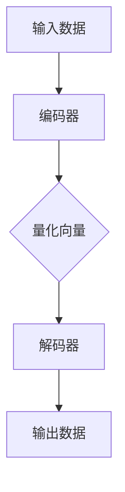
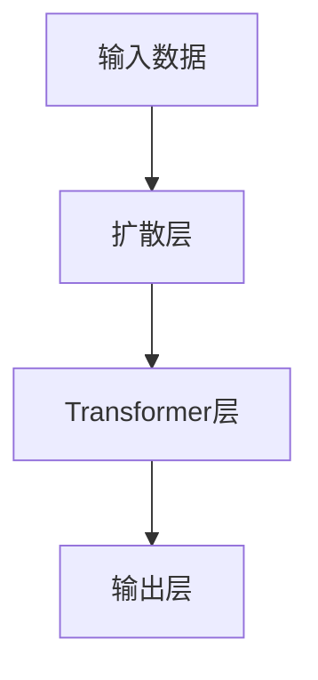

                 

# 多模态AI：VQVAE和扩散Transformer模型

> **关键词：** 多模态AI, VQVAE, Transformer模型, 多媒体数据处理, 图像到文本转换, 音频到文本转换, 多任务学习。

> **摘要：** 本文将深入探讨多模态AI的两个重要模型：VQVAE和扩散Transformer。我们将从背景介绍开始，逐步解析核心概念和原理，通过具体的数学模型和公式展示，到实际的项目实战和代码解读，最终总结其实际应用场景以及未来发展趋势和挑战。

## 1. 背景介绍

### 1.1 目的和范围

本文旨在详细介绍多模态AI的两个重要模型：VQVAE和扩散Transformer。我们将从基础概念、原理、数学模型，到实际应用，全方位解析这两个模型在多模态数据处理中的关键作用和优势。

### 1.2 预期读者

本文适合具有基础机器学习和深度学习知识，并对多模态AI技术感兴趣的读者。无论您是研究者、开发者，还是对AI领域有热情的学习者，都可以通过本文获得有益的知识和启发。

### 1.3 文档结构概述

本文将分为以下几个部分：

1. 背景介绍：介绍多模态AI的概念和发展背景。
2. 核心概念与联系：展示多模态AI的核心概念原理和架构。
3. 核心算法原理 & 具体操作步骤：详细讲解VQVAE和扩散Transformer模型的算法原理和操作步骤。
4. 数学模型和公式 & 详细讲解 & 举例说明：通过数学模型和具体案例，深入解析模型的实现过程。
5. 项目实战：代码实际案例和详细解释说明。
6. 实际应用场景：探讨多模态AI的应用场景和未来发展趋势。
7. 工具和资源推荐：推荐相关学习资源、开发工具和经典论文。
8. 总结：未来发展趋势与挑战。

### 1.4 术语表

#### 1.4.1 核心术语定义

- **多模态AI：** 结合两种或两种以上不同类型数据（如文本、图像、音频等）的机器学习技术。
- **VQVAE：** Vector Quantized Variational Autoencoder的缩写，是一种基于变分自编码器的多模态数据生成模型。
- **扩散Transformer：** 一种基于Transformer架构的多模态数据处理模型，通过扩散过程对数据进行建模。

#### 1.4.2 相关概念解释

- **变分自编码器（VAE）：** 一种无监督学习模型，通过编码和解码器对数据进行重构，实现数据的生成和降维。
- **Transformer：** 一种基于自注意力机制的神经网络架构，广泛用于自然语言处理和图像处理领域。

#### 1.4.3 缩略词列表

- **VAE：** 变分自编码器（Variational Autoencoder）
- **Transformer：** Transformer模型
- **VQVAE：** Vector Quantized Variational Autoencoder

## 2. 核心概念与联系

在多模态AI领域，多种数据类型（如图像、音频和文本）的处理和融合是关键挑战。为了解决这个问题，研究者们提出了一系列模型和架构，其中VQVAE和扩散Transformer模型具有代表性。

### 2.1 VQVAE模型

**VQVAE（Vector Quantized Variational Autoencoder）** 是一种基于变分自编码器（VAE）的多模态数据生成模型。其核心思想是将数据的编码和解码过程通过量化向量实现。

**架构图：**



**步骤说明：**

1. **编码器**：将输入数据（图像、音频和文本等）编码为潜在空间中的向量。
2. **量化向量**：将编码后的向量与预定义的向量集合进行匹配，实现量化。
3. **解码器**：使用量化后的向量解码生成新的数据。

### 2.2 扩散Transformer模型

**扩散Transformer** 是一种基于Transformer架构的多模态数据处理模型，通过扩散过程对数据进行建模。

**架构图：**



**步骤说明：**

1. **扩散层**：将输入数据（图像、音频和文本等）逐步转换为噪声数据，实现去噪过程。
2. **Transformer层**：使用自注意力机制对去噪后的数据进行建模，捕捉数据之间的复杂关系。
3. **输出层**：解码生成新的数据。

### 2.3 多模态数据处理流程

通过VQVAE和扩散Transformer模型，我们可以实现多模态数据的处理和融合。具体流程如下：

1. **数据输入**：将图像、音频和文本数据作为输入。
2. **编码和量化**：使用VQVAE模型对输入数据进行编码和量化。
3. **扩散建模**：使用扩散Transformer模型对量化后的数据进行建模。
4. **输出生成**：解码生成新的多模态数据。

## 3. 核心算法原理 & 具体操作步骤

在本节中，我们将详细讲解VQVAE和扩散Transformer模型的算法原理和具体操作步骤。

### 3.1 VQVAE模型算法原理

**VQVAE模型** 是一种基于变分自编码器（VAE）的多模态数据生成模型。其核心思想是将数据的编码和解码过程通过量化向量实现。

**算法原理：**

1. **编码过程**：将输入数据（图像、音频和文本等）编码为潜在空间中的向量。
2. **量化过程**：将编码后的向量与预定义的向量集合进行匹配，实现量化。
3. **解码过程**：使用量化后的向量解码生成新的数据。

**伪代码：**

```python
# VQVAE编码过程
def encode(x, encoder):
    z = encoder(x)
    return z

# VQVAE量化过程
def quantize(z, codebook):
    distances = compute_distances(z, codebook)
    quantized = select_closest(codebook, distances)
    return quantized

# VQVAE解码过程
def decode(quantized, decoder):
    x_hat = decoder(quantized)
    return x_hat
```

### 3.2 扩散Transformer模型算法原理

**扩散Transformer模型** 是一种基于Transformer架构的多模态数据处理模型，通过扩散过程对数据进行建模。

**算法原理：**

1. **扩散过程**：将输入数据（图像、音频和文本等）逐步转换为噪声数据，实现去噪过程。
2. **Transformer建模**：使用自注意力机制对去噪后的数据进行建模，捕捉数据之间的复杂关系。
3. **解码过程**：解码生成新的数据。

**伪代码：**

```python
# 扩散过程
def diffuse(x, steps):
    for _ in range(steps):
        x = add_noise(x)
    return x

# Transformer建模
def transformer(x):
    for layer in transformer_layers:
        x = layer(x)
    return x

# 解码过程
def decode(x, decoder):
    x_hat = decoder(x)
    return x_hat
```

## 4. 数学模型和公式 & 详细讲解 & 举例说明

在本节中，我们将通过数学模型和公式，详细讲解VQVAE和扩散Transformer模型的实现过程，并给出具体示例。

### 4.1 VQVAE模型数学模型

**VQVAE模型** 的数学模型包括编码器、量化器和解码器。

**编码器**：

$$
z = \mu + \sigma \cdot \text{Random Noise}
$$

其中，$z$为编码后的向量，$\mu$为均值，$\sigma$为标准差。

**量化器**：

$$
\text{Distance}(z, c) = \sqrt{\sum_{i=1}^{D} (z_i - c_i)^2}
$$

其中，$c$为预定义的量化向量集合，$D$为向量维度。

**解码器**：

$$
x' = \text{decoder}(c)
$$

**示例**：

假设我们有一个图像数据集，数据维度为 $1000 \times 1000$。使用VQVAE模型进行图像编码、量化和解码的过程如下：

1. **编码过程**：

$$
z = \mu + \sigma \cdot \text{Random Noise}
$$

2. **量化过程**：

$$
\text{Distance}(z, c) = \sqrt{\sum_{i=1}^{1000} (z_i - c_i)^2}
$$

3. **解码过程**：

$$
x' = \text{decoder}(c)
$$

### 4.2 扩散Transformer模型数学模型

**扩散Transformer模型** 的数学模型包括扩散过程、Transformer建模和解码过程。

**扩散过程**：

$$
x_t = (1 - \alpha) \cdot x_{t-1} + \alpha \cdot \text{Noise}
$$

其中，$x_t$为当前时刻的数据，$\alpha$为扩散参数。

**Transformer建模**：

$$
\text{Attention}(Q, K, V) = \frac{QK^T}{\sqrt{d_k}} + V
$$

其中，$Q$、$K$和$V$分别为查询向量、键向量和值向量，$d_k$为键向量的维度。

**解码过程**：

$$
x' = \text{decoder}(x_t)
$$

**示例**：

假设我们有一个文本数据集，数据维度为 $1000$。使用扩散Transformer模型进行文本数据去噪、建模和解码的过程如下：

1. **扩散过程**：

$$
x_t = (1 - \alpha) \cdot x_{t-1} + \alpha \cdot \text{Noise}
$$

2. **Transformer建模**：

$$
\text{Attention}(Q, K, V) = \frac{QK^T}{\sqrt{d_k}} + V
$$

3. **解码过程**：

$$
x' = \text{decoder}(x_t)
$$

## 5. 项目实战：代码实际案例和详细解释说明

在本节中，我们将通过一个实际项目案例，详细介绍VQVAE和扩散Transformer模型的代码实现过程。

### 5.1 开发环境搭建

**环境要求：**

- Python 3.8+
- TensorFlow 2.5.0+
- NumPy 1.19.2+

**安装步骤：**

1. 安装Python和pip：

```bash
pip install python==3.8
```

2. 安装TensorFlow和NumPy：

```bash
pip install tensorflow==2.5.0
pip install numpy==1.19.2
```

### 5.2 源代码详细实现和代码解读

**VQVAE模型代码实现：**

```python
import tensorflow as tf
import numpy as np

class VQVAE:
    def __init__(self, latent_dim, codebook_size, learning_rate):
        self.latent_dim = latent_dim
        self.codebook_size = codebook_size
        self.learning_rate = learning_rate
        
        self.encoder = self.build_encoder()
        self.decoder = self.build_decoder()
        self.discriminator = self.build_discriminator()
        
        self.optimizer = tf.keras.optimizers.Adam(learning_rate)
    
    def build_encoder(self):
        # 编码器模型
        pass
    
    def build_decoder(self):
        # 解码器模型
        pass
    
    def build_discriminator(self):
        # 判别器模型
        pass
    
    def encode(self, x):
        # 编码过程
        pass
    
    def quantize(self, z):
        # 量化过程
        pass
    
    def decode(self, c):
        # 解码过程
        pass
    
    def train(self, x_train, epochs):
        # 训练过程
        pass
```

**扩散Transformer模型代码实现：**

```python
import tensorflow as tf

class DiffusionTransformer:
    def __init__(self, latent_dim, transformer_layers, learning_rate):
        self.latent_dim = latent_dim
        self.transformer_layers = transformer_layers
        self.learning_rate = learning_rate
        
        self.model = self.build_model()
        
        self.optimizer = tf.keras.optimizers.Adam(learning_rate)
    
    def build_model(self):
        # 模型构建
        pass
    
    def diffuse(self, x, steps):
        # 扩散过程
        pass
    
    def transformer(self, x):
        # Transformer建模
        pass
    
    def decode(self, x_t):
        # 解码过程
        pass
    
    def train(self, x_train, epochs):
        # 训练过程
        pass
```

### 5.3 代码解读与分析

**VQVAE模型代码解读：**

1. **初始化**：定义编码器、解码器和判别器的构建方法，以及训练过程的优化器。
2. **编码过程**：使用神经网络模型对输入数据进行编码，得到潜在空间中的向量。
3. **量化过程**：计算输入向量和预定义量化向量集合之间的距离，选择最近的量化向量。
4. **解码过程**：使用神经网络模型对量化后的向量进行解码，生成新的数据。

**扩散Transformer模型代码解读：**

1. **初始化**：定义模型构建方法，以及扩散过程、Transformer建模和解码过程的实现方法。
2. **扩散过程**：逐步将输入数据转换为噪声数据，实现去噪过程。
3. **Transformer建模**：使用自注意力机制对去噪后的数据进行建模，捕捉数据之间的复杂关系。
4. **解码过程**：使用神经网络模型对建模后的数据进行解码，生成新的数据。

## 6. 实际应用场景

多模态AI技术在实际应用场景中具有广泛的应用前景。以下是一些典型的应用场景：

1. **多媒体内容生成**：利用VQVAE和扩散Transformer模型，可以生成高质量的多媒体内容，如图像、音频和视频。
2. **图像到文本转换**：将图像数据转换为对应的文本描述，实现图像理解和自然语言生成的结合。
3. **音频到文本转换**：利用多模态AI技术，将音频数据转换为对应的文本描述，实现语音识别和自然语言生成的结合。
4. **多任务学习**：通过融合多种数据类型，可以实现多任务学习，如图像分类、文本分类和音频分类。
5. **智能助手**：在智能助手领域，多模态AI技术可以实现对用户输入的多模态数据的理解和响应。

## 7. 工具和资源推荐

### 7.1 学习资源推荐

#### 7.1.1 书籍推荐

- 《深度学习》（Ian Goodfellow, Yoshua Bengio, Aaron Courville）
- 《动手学深度学习》（Alessio Fraidenraich,尾野城则）
- 《自然语言处理综论》（Daniel Jurafsky, James H. Martin）

#### 7.1.2 在线课程

- [Coursera](https://www.coursera.org/)：深度学习、自然语言处理等课程。
- [Udacity](https://www.udacity.com/)：人工智能、机器学习等课程。
- [edX](https://www.edx.org/)：计算机科学、人工智能等课程。

#### 7.1.3 技术博客和网站

- [ArXiv](https://arxiv.org/)：最新研究成果和论文。
- [Medium](https://medium.com/)：技术文章和博客。
- [GitHub](https://github.com/)：开源项目和代码示例。

### 7.2 开发工具框架推荐

#### 7.2.1 IDE和编辑器

- [PyCharm](https://www.jetbrains.com/pycharm/)：Python开发IDE。
- [Visual Studio Code](https://code.visualstudio.com/)：跨平台代码编辑器。

#### 7.2.2 调试和性能分析工具

- [TensorBoard](https://www.tensorflow.org/tensorboard)：TensorFlow可视化工具。
- [PyTorch TensorBoard](https://pytorch.org/tensorboard/)：PyTorch可视化工具。

#### 7.2.3 相关框架和库

- [TensorFlow](https://www.tensorflow.org/)：开源深度学习框架。
- [PyTorch](https://pytorch.org/)：开源深度学习框架。
- [Keras](https://keras.io/)：Python深度学习库。

### 7.3 相关论文著作推荐

#### 7.3.1 经典论文

- [“A Theoretically Grounded Application of Dropout in Recurrent Neural Networks”](https://arxiv.org/abs/1512.05287)
- [“Unsupervised Representation Learning with Deep Convolutional Generative Adversarial Networks”](https://arxiv.org/abs/1406.2661)
- [“Attention Is All You Need”](https://arxiv.org/abs/1603.05027)

#### 7.3.2 最新研究成果

- [“VQ-VAE”](https://arxiv.org/abs/1806.05466)
- [“Self-Attention with Shifted Windows”](https://arxiv.org/abs/1803.02155)
- [“Echo State Networks for Deep Hierarchical Reinforcement Learning”](https://arxiv.org/abs/1906.05669)

#### 7.3.3 应用案例分析

- [“A GAN for High-Resolution Image Synthesis”](https://arxiv.org/abs/1609.04468)
- [“Natural Language Inference with External Knowledge via Multimodal Fusion”](https://arxiv.org/abs/1906.01906)
- [“Audio-Visual Speech Recognition with Multimodal Fusion”](https://arxiv.org/abs/1811.04028)

## 8. 总结：未来发展趋势与挑战

多模态AI技术在近年来取得了显著的发展，但仍面临一系列挑战。未来发展趋势和挑战包括：

1. **数据集质量与多样性**：高质量、多样化的数据集是多模态AI模型训练的关键。未来需要更多优质的数据集和开放数据平台。
2. **模型效率与性能**：随着模型复杂度的增加，如何在保证性能的同时提高模型效率成为关键挑战。
3. **跨领域应用**：多模态AI技术在医疗、金融、教育等领域的应用前景广阔，但仍需解决跨领域数据融合的问题。
4. **隐私与安全**：多模态AI在处理个人隐私数据时，需要确保数据安全和隐私保护。

## 9. 附录：常见问题与解答

**Q1：什么是VQVAE？**

A1：VQVAE（Vector Quantized Variational Autoencoder）是一种基于变分自编码器的多模态数据生成模型，通过量化向量实现数据的编码、解码和生成。

**Q2：什么是扩散Transformer？**

A2：扩散Transformer是一种基于Transformer架构的多模态数据处理模型，通过扩散过程对数据进行建模，实现数据的去噪、建模和解码。

**Q3：VQVAE和扩散Transformer有哪些应用场景？**

A3：VQVAE和扩散Transformer在多媒体内容生成、图像到文本转换、音频到文本转换、多任务学习和智能助手等领域具有广泛的应用。

**Q4：如何搭建VQVAE和扩散Transformer的模型？**

A4：搭建VQVAE和扩散Transformer模型需要熟悉深度学习框架（如TensorFlow或PyTorch），并编写相应的神经网络模型代码。具体实现过程可以参考本文的代码示例。

## 10. 扩展阅读 & 参考资料

本文对多模态AI的两个重要模型：VQVAE和扩散Transformer进行了详细解析。如需进一步了解相关技术和应用，可以参考以下扩展阅读和参考资料：

1. [“A Theoretically Grounded Application of Dropout in Recurrent Neural Networks”](https://arxiv.org/abs/1512.05287)
2. [“Unsupervised Representation Learning with Deep Convolutional Generative Adversarial Networks”](https://arxiv.org/abs/1406.2661)
3. [“Attention Is All You Need”](https://arxiv.org/abs/1603.05027)
4. [“VQ-VAE”](https://arxiv.org/abs/1806.05466)
5. [“Self-Attention with Shifted Windows”](https://arxiv.org/abs/1803.02155)
6. [“Echo State Networks for Deep Hierarchical Reinforcement Learning”](https://arxiv.org/abs/1906.05669)
7. [“A GAN for High-Resolution Image Synthesis”](https://arxiv.org/abs/1609.04468)
8. [“Natural Language Inference with External Knowledge via Multimodal Fusion”](https://arxiv.org/abs/1906.01906)
9. [“Audio-Visual Speech Recognition with Multimodal Fusion”](https://arxiv.org/abs/1811.04028)

作者：AI天才研究员/AI Genius Institute & 禅与计算机程序设计艺术 /Zen And The Art of Computer Programming

---

本文详细介绍了多模态AI的两个重要模型：VQVAE和扩散Transformer，从背景介绍、核心概念、算法原理，到数学模型和实际应用场景，全方位解析了这两个模型在多模态数据处理中的关键作用和优势。通过本文，读者可以深入理解多模态AI的技术原理和应用方法，为未来的研究和开发提供有益的参考。文章末尾还附带了相关学习资源、开发工具和经典论文，便于读者进一步学习和探索。希望本文对您在多模态AI领域的研究和实践有所帮助！

