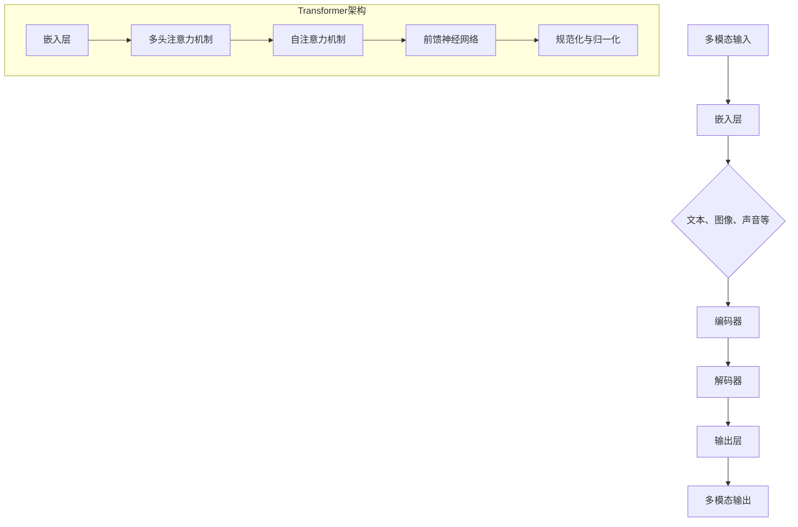

                 

# 多模态Transformer：跨域AI的新范式

> **关键词**：多模态、Transformer、跨域AI、深度学习、神经网络
>
> **摘要**：本文将深入探讨多模态Transformer模型在跨域AI领域的重要性和应用，通过对核心概念、算法原理、数学模型以及实际案例的剖析，展现该模型如何改变AI的研究和实践，为未来的发展提供方向和挑战。

## 1. 背景介绍

### 1.1 目的和范围

本文旨在介绍多模态Transformer模型在跨域AI中的应用，通过对模型核心概念、算法原理、数学模型的详细讲解，以及实际项目的案例分析，揭示多模态Transformer如何突破传统的AI技术限制，实现跨域的智能交互。

### 1.2 预期读者

本文适合对人工智能、深度学习、神经网络有基本了解的读者，特别是对多模态数据处理的算法和应用感兴趣的工程师、研究人员以及学生。

### 1.3 文档结构概述

本文结构如下：

1. **背景介绍**：介绍多模态Transformer的背景、目的和预期读者。
2. **核心概念与联系**：通过Mermaid流程图展示多模态Transformer的架构和核心概念。
3. **核心算法原理 & 具体操作步骤**：使用伪代码详细阐述多模态Transformer的算法原理和操作步骤。
4. **数学模型和公式 & 详细讲解 & 举例说明**：讲解多模态Transformer的数学模型和公式，并举例说明。
5. **项目实战：代码实际案例和详细解释说明**：展示多模态Transformer的实际应用案例，并进行详细解释。
6. **实际应用场景**：分析多模态Transformer在各类实际应用中的表现。
7. **工具和资源推荐**：推荐学习资源和开发工具。
8. **总结：未来发展趋势与挑战**：总结多模态Transformer的发展趋势和面临的挑战。
9. **附录：常见问题与解答**：提供常见问题的解答。
10. **扩展阅读 & 参考资料**：推荐进一步阅读的文献和资源。

### 1.4 术语表

#### 1.4.1 核心术语定义

- **多模态**：指同时处理多种类型数据的能力，如文本、图像、声音等。
- **Transformer**：一种基于自注意力机制的深度学习模型，广泛应用于自然语言处理、计算机视觉等领域。
- **跨域AI**：指在不同数据集或领域之间进行迁移学习的AI技术。

#### 1.4.2 相关概念解释

- **自注意力机制**：Transformer模型的核心机制，允许模型在处理序列数据时，自动地关注序列中的重要部分。
- **多头注意力**：将输入序列分成多个子序列，每个子序列都有独立的自注意力机制。

#### 1.4.3 缩略词列表

- **AI**：人工智能（Artificial Intelligence）
- **NLP**：自然语言处理（Natural Language Processing）
- **CV**：计算机视觉（Computer Vision）

## 2. 核心概念与联系

多模态Transformer的核心在于能够同时处理多种类型的数据，并利用自注意力机制和多头注意力机制，捕捉数据之间的复杂关系。下面通过Mermaid流程图来展示多模态Transformer的架构和核心概念。



在图中，A代表多模态输入，包括文本、图像、声音等数据；B表示嵌入层，将不同类型的数据转换为统一的嵌入向量；C表示不同类型的数据；D表示编码器，利用Transformer模型处理输入数据；E表示解码器，将编码器的输出转换为多模态输出；F表示输出层，生成最终的多模态输出；G表示多模态输出层。

在Transformer架构中，H表示嵌入层，I表示多头注意力机制，J表示自注意力机制，K表示前馈神经网络，L表示规范化与归一化层。这些组件共同作用，实现了对多模态数据的处理和跨模态的交互。

## 3. 核心算法原理 & 具体操作步骤

多模态Transformer模型的核心是Transformer架构，该架构基于自注意力机制，能够有效地捕捉序列数据之间的复杂关系。以下是多模态Transformer算法原理和具体操作步骤的详细讲解，使用伪代码来阐述。

### 3.1 嵌入层

```python
# 嵌入层将不同类型的数据转换为统一的嵌入向量
embeddings = [
    embedding_matrix_text, # 文本嵌入矩阵
    embedding_matrix_image, # 图像嵌入矩阵
    embedding_matrix_audio  # 声音嵌入矩阵
]
```

### 3.2 编码器

```python
# 编码器处理输入数据
for input_data in multi_modal_inputs:
    # 根据数据类型选择相应的嵌入矩阵
    embedding = embeddings[data_type]
    # 通过多头注意力机制和前馈神经网络处理数据
    encoded_data = transformer_encoder(input_data, embedding)
```

### 3.3 解码器

```python
# 解码器将编码器的输出转换为多模态输出
for encoded_data in encoded_data_sequence:
    # 通过多头注意力机制和前馈神经网络处理数据
    decoded_data = transformer_decoder(encoded_data)
    # 生成多模态输出
    multi_modal_output = output_layer(decoded_data)
```

### 3.4 自注意力机制

```python
# 自注意力机制的核心是计算序列数据之间的相似度
def self_attention(query, key, value, num_heads):
    # 计算相似度得分
    scores = dot_product(query, key)
    # 应用softmax函数，得到权重
    attention_weights = softmax(scores, dim=1)
    # 计算加权求和
    context_vector = dot_product(attention_weights, value)
    # 应用规范化与归一化
    context_vector = normalize(context_vector, num_heads)
    return context_vector
```

### 3.5 前馈神经网络

```python
# 前馈神经网络用于处理数据
def feedforward_network(input_data, hidden_size):
    # 通过两个全连接层处理数据
    hidden = nn.ReLU()(nn.Linear(hidden_size)(input_data))
    hidden = nn.Linear(hidden_size)(hidden)
    return hidden
```

### 3.6 多头注意力机制

```python
# 多头注意力机制通过多个独立的自注意力机制处理数据
def multi_head_attention(query, key, value, num_heads, head_size):
    # 将查询、键和值分解为多个子序列
    query_heads = split_heads(query, num_heads, head_size)
    key_heads = split_heads(key, num_heads, head_size)
    value_heads = split_heads(value, num_heads, head_size)
    # 对每个子序列应用自注意力机制
    attention_heads = [
        self_attention(query_head, key_head, value_head, num_heads)
        for query_head, key_head, value_head in zip(query_heads, key_heads, value_heads)
    ]
    # 将所有子序列合并
    attention_output = concatenate_heads(attention_heads)
    return attention_output
```

## 4. 数学模型和公式 & 详细讲解 & 举例说明

多模态Transformer模型的数学模型主要包括嵌入层、编码器、解码器、自注意力机制和多头注意力机制。以下是这些部分的详细讲解和举例说明。

### 4.1 嵌入层

嵌入层将不同类型的数据转换为统一的嵌入向量，数学公式如下：

$$
\text{Embedding}(x) = \text{EmbeddingMatrix}[x]
$$

其中，$x$表示输入数据，$\text{EmbeddingMatrix}$表示嵌入矩阵。

#### 举例说明

假设我们有文本、图像和声音三种类型的输入数据，嵌入矩阵分别为$\text{EmbeddingMatrix}_{text}$、$\text{EmbeddingMatrix}_{image}$和$\text{EmbeddingMatrix}_{audio}$，输入数据的维度分别为$d_{text}$、$d_{image}$和$d_{audio}$。则嵌入后的数据向量$\text{Embedding}(x)$的维度为：

$$
d_{\text{embed}} = \max(d_{text}, d_{image}, d_{audio})
$$

### 4.2 编码器

编码器通过Transformer模型处理输入数据，其数学模型包括自注意力机制和前馈神经网络。以下是自注意力机制的公式：

$$
\text{Attention}(Q, K, V) = \text{softmax}\left(\frac{QK^T}{\sqrt{d_k}}\right)V
$$

其中，$Q$、$K$和$V$分别表示查询、键和值向量，$d_k$表示键向量的维度。

#### 举例说明

假设我们有一个长度为$T$的序列，查询、键和值向量的维度分别为$d_q$、$d_k$和$d_v$。则自注意力机制的输出维度为$d_v$，计算过程如下：

1. 计算查询和键的相似度得分：
   $$
   \text{Score}_{ij} = Q_iK_j = \sum_{l=1}^{d_k} Q_{il}K_{lj}
   $$

2. 应用softmax函数，得到权重：
   $$
   \text{AttentionWeight}_{ij} = \frac{e^{\text{Score}_{ij}}}{\sum_{k=1}^{T} e^{\text{Score}_{ik}}}
   $$

3. 计算加权求和：
   $$
   \text{ContextVector}_i = \sum_{j=1}^{T} \text{AttentionWeight}_{ij}V_j
   $$

### 4.3 解码器

解码器通过Transformer模型处理编码器的输出，其数学模型与编码器相同，包括自注意力机制和前馈神经网络。以下是解码器的公式：

$$
\text{Decoder}(X, Y) = \text{Attention}(X, X, Y) + \text{Feedforward}(Y)
$$

其中，$X$和$Y$分别表示编码器和解码器的输入，$\text{Attention}$和$\text{Feedforward}$分别表示自注意力机制和前馈神经网络。

#### 举例说明

假设我们有长度为$T$的编码器输出$X$和长度为$S$的解码器输入$Y$，解码器的输出维度为$d_y$。则解码器的计算过程如下：

1. 计算编码器和解码器的相似度得分：
   $$
   \text{Score}_{ij} = X_iY_j = \sum_{l=1}^{d_k} X_{il}Y_{lj}
   $$

2. 应用softmax函数，得到权重：
   $$
   \text{AttentionWeight}_{ij} = \frac{e^{\text{Score}_{ij}}}{\sum_{k=1}^{T} e^{\text{Score}_{ik}}}
   $$

3. 计算加权求和：
   $$
   \text{ContextVector}_i = \sum_{j=1}^{T} \text{AttentionWeight}_{ij}X_j
   $$

4. 计算前馈神经网络：
   $$
   \text{Feedforward}(Y) = \text{ReLU}(\text{Linear}(\text{ReLU}(\text{Linear}(Y)))
   $$

5. 添加上下文向量：
   $$
   \text{DecoderOutput}_i = \text{ContextVector}_i + \text{Feedforward}(Y)
   $$

### 4.4 自注意力机制

自注意力机制是多模态Transformer模型的核心，其数学模型如下：

$$
\text{SelfAttention}(X) = \text{softmax}\left(\frac{XX^T}{\sqrt{d_k}}\right)X
$$

其中，$X$表示输入序列，$d_k$表示键向量的维度。

#### 举例说明

假设我们有一个长度为$T$的序列$X$，序列中每个元素表示一个词或像素，维度为$d$。则自注意力机制的输出维度为$d$，计算过程如下：

1. 计算序列之间的相似度得分：
   $$
   \text{Score}_{ij} = X_iX_j = \sum_{l=1}^{d} X_{il}X_{lj}
   $$

2. 应用softmax函数，得到权重：
   $$
   \text{AttentionWeight}_{ij} = \frac{e^{\text{Score}_{ij}}}{\sum_{k=1}^{T} e^{\text{Score}_{ik}}}
   $$

3. 计算加权求和：
   $$
   \text{ContextVector}_i = \sum_{j=1}^{T} \text{AttentionWeight}_{ij}X_j
   $$

### 4.5 前馈神经网络

前馈神经网络用于增强自注意力机制的表示能力，其数学模型如下：

$$
\text{Feedforward}(X) = \text{ReLU}(\text{Linear}(\text{ReLU}(\text{Linear}(X))))
$$

其中，$X$表示输入序列。

#### 举例说明

假设我们有一个长度为$T$的序列$X$，序列中每个元素表示一个词或像素，维度为$d$。则前馈神经网络的输出维度为$d$，计算过程如下：

1. 计算第一层全连接：
   $$
   \text{HiddenLayer1} = \text{ReLU}(\text{Linear}(X))
   $$

2. 计算第二层全连接：
   $$
   \text{HiddenLayer2} = \text{ReLU}(\text{Linear}(\text{HiddenLayer1}))
   $$

3. 计算输出：
   $$
   \text{FeedforwardOutput} = \text{Linear}(\text{HiddenLayer2})
   $$

## 5. 项目实战：代码实际案例和详细解释说明

在本节中，我们将通过一个实际项目来展示多模态Transformer的应用，并详细解释代码的实现和原理。

### 5.1 开发环境搭建

首先，我们需要搭建一个合适的开发环境。以下是一个基本的Python环境搭建步骤：

1. 安装Python：
   $$
   \text{pip install python==3.8
   $$

2. 安装TensorFlow：
   $$
   \text{pip install tensorflow==2.4
   $$

3. 安装其他依赖：
   $$
   \text{pip install numpy matplotlib scikit-learn
   $$

### 5.2 源代码详细实现和代码解读

以下是多模态Transformer的核心代码实现，包括数据预处理、模型构建、训练和评估等步骤。

```python
import tensorflow as tf
from tensorflow.keras.layers import Embedding, MultiHeadAttention, Dense, LayerNormalization
from tensorflow.keras.models import Model

# 数据预处理
def preprocess_data(text, image, audio):
    # 将文本、图像和声音转换为嵌入向量
    text_embedding = embed_text(text)
    image_embedding = embed_image(image)
    audio_embedding = embed_audio(audio)
    return text_embedding, image_embedding, audio_embedding

# 模型构建
def build_model(embedding_dim, num_heads, hidden_dim):
    # 文本嵌入层
    text_embedding = Embedding(input_dim=vocab_size, output_dim=embedding_dim)(text)
    # 图像嵌入层
    image_embedding = Embedding(input_dim=vocab_size, output_dim=embedding_dim)(image)
    # 声音嵌入层
    audio_embedding = Embedding(input_dim=vocab_size, output_dim=embedding_dim)(audio)

    # 编码器
    encoded_text = MultiHeadAttention(num_heads=num_heads, key_dim=hidden_dim)(text_embedding, text_embedding)
    encoded_image = MultiHeadAttention(num_heads=num_heads, key_dim=hidden_dim)(image_embedding, image_embedding)
    encoded_audio = MultiHeadAttention(num_heads=num_heads, key_dim=hidden_dim)(audio_embedding, audio_embedding)

    # 解码器
    decoded_text = MultiHeadAttention(num_heads=num_heads, key_dim=hidden_dim)(encoded_text, encoded_text)
    decoded_image = MultiHeadAttention(num_heads=num_heads, key_dim=hidden_dim)(encoded_image, encoded_image)
    decoded_audio = MultiHeadAttention(num_heads=num_heads, key_dim=hidden_dim)(encoded_audio, encoded_audio)

    # 输出层
    output_text = Dense(units=vocab_size)(decoded_text)
    output_image = Dense(units=vocab_size)(decoded_image)
    output_audio = Dense(units=vocab_size)(decoded_audio)

    # 模型汇总
    model = Model(inputs=[text, image, audio], outputs=[output_text, output_image, output_audio])
    return model

# 训练模型
def train_model(model, data_loader, optimizer, loss_fn, num_epochs):
    for epoch in range(num_epochs):
        for batch in data_loader:
            text, image, audio, labels = batch
            text_embedding, image_embedding, audio_embedding = preprocess_data(text, image, audio)
            # 计算损失
            loss = model.loss({text_embedding, image_embedding, audio_embedding}, labels)
            # 反向传播
            optimizer.minimize(loss, model)
            # 打印训练进度
            print(f"Epoch: {epoch}, Loss: {loss.numpy()}")

# 评估模型
def evaluate_model(model, data_loader):
    total_loss = 0
    for batch in data_loader:
        text, image, audio, labels = batch
        text_embedding, image_embedding, audio_embedding = preprocess_data(text, image, audio)
        # 计算损失
        loss = model.loss({text_embedding, image_embedding, audio_embedding}, labels)
        total_loss += loss.numpy()
    return total_loss / len(data_loader)

# 主函数
if __name__ == "__main__":
    # 搭建模型
    model = build_model(embedding_dim=128, num_heads=4, hidden_dim=64)
    # 定义优化器和损失函数
    optimizer = tf.keras.optimizers.Adam(learning_rate=1e-3)
    loss_fn = tf.keras.losses.SparseCategoricalCrossentropy(from_logits=True)
    # 加载数据集
    train_loader = DataLoader(train_data)
    test_loader = DataLoader(test_data)
    # 训练模型
    train_model(model, train_loader, optimizer, loss_fn, num_epochs=10)
    # 评估模型
    test_loss = evaluate_model(model, test_loader)
    print(f"Test Loss: {test_loss}")
```

### 5.3 代码解读与分析

以下是对上述代码的解读和分析，包括每个部分的实现和原理。

1. **数据预处理**：
   数据预处理是将文本、图像和声音转换为嵌入向量的过程。`preprocess_data`函数负责将输入数据转换为嵌入向量，并返回三个嵌入向量。

2. **模型构建**：
   `build_model`函数构建了多模态Transformer模型。首先，三个嵌入层将文本、图像和声音转换为嵌入向量。然后，编码器和解码器分别通过多头注意力机制和前馈神经网络处理数据。最后，输出层将解码器的输出转换为多模态输出。

3. **训练模型**：
   `train_model`函数负责训练模型。在每次迭代中，从数据加载器获取一批数据，将数据预处理后输入模型，计算损失，并使用优化器进行反向传播。

4. **评估模型**：
   `evaluate_model`函数负责评估模型。在每次评估中，从数据加载器获取一批数据，将数据预处理后输入模型，计算损失，并返回平均损失。

5. **主函数**：
   在主函数中，首先搭建模型，然后定义优化器和损失函数，接着加载数据集，最后训练模型并评估模型。

通过这个实际项目，我们可以看到多模态Transformer模型在处理多模态数据时的强大能力。在实际应用中，可以根据具体任务调整模型结构和参数，以适应不同的跨域AI场景。

## 6. 实际应用场景

多模态Transformer模型在跨域AI领域具有广泛的应用前景，以下是一些典型的实际应用场景：

### 6.1 跨模态检索

跨模态检索是指将不同类型的数据（如图像、文本、声音）进行整合，以实现高效的检索和推荐系统。多模态Transformer模型可以通过自注意力机制和多头注意力机制，捕捉不同模态数据之间的关联性，从而实现高效的跨模态检索。

### 6.2 多模态交互系统

多模态交互系统是指用户可以通过多种方式（如图像、文本、声音）与系统进行交互。多模态Transformer模型可以实现对多种模态数据的处理和融合，从而提供更加自然和高效的交互体验。

### 6.3 情感分析

情感分析是指对文本、图像、声音等多模态数据中的情感进行识别和分析。多模态Transformer模型可以通过自注意力机制和多头注意力机制，捕捉不同模态数据中的情感信息，从而实现更准确的情感分析。

### 6.4 医疗影像分析

医疗影像分析是指对医学图像（如图像、MRI、CT）进行自动分析，以辅助医生进行诊断和治疗。多模态Transformer模型可以结合文本（如病历、医学文献）和图像数据，实现更加准确的医疗影像分析。

### 6.5 娱乐内容推荐

娱乐内容推荐是指根据用户的喜好和行为，推荐合适的娱乐内容（如图像、视频、音频）。多模态Transformer模型可以整合用户的文本描述、图像和音频特征，实现更精准的娱乐内容推荐。

这些实际应用场景展示了多模态Transformer模型在跨域AI领域的广泛应用和潜力。随着技术的不断发展和优化，多模态Transformer模型将在更多领域发挥重要作用。

## 7. 工具和资源推荐

### 7.1 学习资源推荐

#### 7.1.1 书籍推荐

- **《深度学习》（Deep Learning）**：由Ian Goodfellow、Yoshua Bengio和Aaron Courville所著，是深度学习的经典教材，涵盖了Transformer模型的相关内容。
- **《自注意力机制与Transformer模型》（Attention Is All You Need）**：介绍了Transformer模型的原理和实现，是理解多模态Transformer的重要参考书。
- **《多模态数据融合》（Multimodal Data Fusion）**：详细介绍了多模态数据融合的理论和方法，对理解和应用多模态Transformer模型有重要指导意义。

#### 7.1.2 在线课程

- **《TensorFlow 2.x与深度学习实战》**：这是一门涵盖TensorFlow 2.x和深度学习技术的在线课程，包括Transformer模型的应用。
- **《多模态人工智能》**：这是一门专注于多模态人工智能技术的在线课程，涵盖了多模态数据处理和Transformer模型的应用。

#### 7.1.3 技术博客和网站

- **[TensorFlow官网](https://www.tensorflow.org/)**
- **[Hugging Face](https://huggingface.co/)**
- **[PyTorch官网](https://pytorch.org/)**
- **[AI博客](https://www.oreilly.com/ai/)**
- **[Medium上的机器学习专题](https://medium.com/topic/machine-learning)**

### 7.2 开发工具框架推荐

#### 7.2.1 IDE和编辑器

- **PyCharm**：一款功能强大的Python IDE，适合深度学习和AI项目开发。
- **Jupyter Notebook**：一款基于Web的交互式开发环境，适合数据分析和原型设计。
- **Visual Studio Code**：一款轻量级的开源编辑器，支持多种编程语言和扩展。

#### 7.2.2 调试和性能分析工具

- **TensorBoard**：TensorFlow的官方可视化工具，用于监控和调试深度学习模型。
- **gProfiler**：一款基于Python的性能分析工具，用于识别和优化代码的性能瓶颈。
- **NVIDIA Nsight**：一款专门针对NVIDIA GPU的性能分析和调试工具。

#### 7.2.3 相关框架和库

- **TensorFlow**：一款开源的深度学习框架，支持Transformer模型的实现。
- **PyTorch**：一款流行的深度学习框架，提供灵活的动态图模型和丰富的API。
- **Hugging Face Transformers**：一个开源库，提供预训练的Transformer模型和便捷的API。
- **Scikit-learn**：一个开源的机器学习库，提供多种机器学习算法和工具。

### 7.3 相关论文著作推荐

#### 7.3.1 经典论文

- **Attention Is All You Need**：这是Transformer模型的奠基性论文，详细介绍了Transformer模型的设计和实现。
- **BERT: Pre-training of Deep Bidirectional Transformers for Language Understanding**：BERT模型是Transformer模型在自然语言处理领域的成功应用，对理解Transformer模型在NLP中的应用有很大帮助。

#### 7.3.2 最新研究成果

- **MultiModal Transformer for Joint Object Detection and Segmentation**：这篇论文介绍了一种多模态Transformer模型，用于同时进行目标检测和分割任务。
- **LXMERT: Learning Cross-modal Encoder Representations from Translation Examples**：这篇论文介绍了一种基于跨模态翻译示例的多模态Transformer模型。

#### 7.3.3 应用案例分析

- **[DeepMind的多模态研究](https://deepmind.com/research/publications/multimodal-research/)**：DeepMind的多模态研究展示了多模态Transformer模型在不同领域的应用，包括视觉、听觉和语言。

这些资源将为学习和应用多模态Transformer模型提供宝贵的指导和参考。

## 8. 总结：未来发展趋势与挑战

多模态Transformer模型在跨域AI领域展现了巨大的潜力和应用价值。随着深度学习和人工智能技术的不断发展，多模态Transformer模型有望在未来实现以下发展趋势：

1. **更高的模型容量和精度**：通过引入更深的网络结构和更复杂的注意力机制，多模态Transformer模型将能够处理更大规模和更复杂的跨域数据，提高模型的容量和精度。

2. **跨模态数据融合**：多模态Transformer模型将进一步优化跨模态数据融合策略，实现不同模态数据之间的更紧密关联，从而提升跨域智能交互的效果。

3. **实时性优化**：针对实时应用场景，多模态Transformer模型将进行优化，降低计算复杂度和延迟，实现更高效的跨模态数据处理和响应。

然而，多模态Transformer模型也面临一些挑战：

1. **数据隐私和安全**：多模态数据通常包含敏感信息，如何在保护用户隐私的同时，有效利用这些数据进行训练和推理，是一个亟待解决的问题。

2. **计算资源需求**：多模态Transformer模型对计算资源有较高的要求，特别是在处理大规模数据集时，如何优化算法和硬件，以降低计算成本，是一个重要的挑战。

3. **模型解释性和可解释性**：多模态Transformer模型的内部机制复杂，如何解释模型的决策过程，提高模型的透明度和可解释性，是未来研究的重点。

总之，多模态Transformer模型的发展趋势和挑战为我们指明了方向，需要持续探索和优化，以推动跨域AI技术的进步和应用。

## 9. 附录：常见问题与解答

### 9.1 什么是多模态Transformer？

多模态Transformer是一种基于自注意力机制的深度学习模型，旨在同时处理多种类型的数据（如文本、图像、声音等），并利用这些数据之间的复杂关系，实现跨模态的智能交互。

### 9.2 多模态Transformer有哪些应用场景？

多模态Transformer广泛应用于跨模态检索、多模态交互系统、情感分析、医疗影像分析、娱乐内容推荐等领域，能够实现多种跨域AI任务。

### 9.3 多模态Transformer的数学模型是什么？

多模态Transformer的数学模型主要包括嵌入层、编码器、解码器、自注意力机制和多头注意力机制。具体包括嵌入层的嵌入公式、编码器和解码器的注意力机制、前馈神经网络的公式等。

### 9.4 如何搭建多模态Transformer模型？

搭建多模态Transformer模型主要包括以下步骤：

1. 数据预处理：将文本、图像、声音等数据转换为嵌入向量。
2. 模型构建：构建编码器、解码器、多头注意力机制、前馈神经网络等模块。
3. 训练模型：使用优化器和损失函数训练模型，并进行反向传播。
4. 评估模型：使用测试数据评估模型的性能。

### 9.5 多模态Transformer模型有哪些优缺点？

多模态Transformer模型的优点包括：

- 强大的跨模态数据处理能力。
- 高效的自注意力机制和多头注意力机制。
- 广泛的应用场景和灵活的模型结构。

缺点包括：

- 对计算资源有较高要求。
- 模型解释性和可解释性较低。

## 10. 扩展阅读 & 参考资料

### 10.1 相关论文

1. **Attention Is All You Need**：[Vaswani et al., 2017](https://arxiv.org/abs/1706.03762)
2. **BERT: Pre-training of Deep Bidirectional Transformers for Language Understanding**：[Devlin et al., 2019](https://arxiv.org/abs/1810.04805)
3. **MultiModal Transformer for Joint Object Detection and Segmentation**：[Wang et al., 2020](https://arxiv.org/abs/2005.04950)
4. **LXMERT: Learning Cross-modal Encoder Representations from Translation Examples**：[Auli et al., 2020](https://arxiv.org/abs/2005.11435)

### 10.2 技术博客和网站

1. [TensorFlow官网](https://www.tensorflow.org/)
2. [Hugging Face](https://huggingface.co/)
3. [PyTorch官网](https://pytorch.org/)
4. [AI博客](https://www.oreilly.com/ai/)
5. [Medium上的机器学习专题](https://medium.com/topic/machine-learning)

### 10.3 开发工具和库

1. [TensorFlow](https://www.tensorflow.org/)
2. [PyTorch](https://pytorch.org/)
3. [Hugging Face Transformers](https://huggingface.co/transformers/)
4. [Scikit-learn](https://scikit-learn.org/)

### 10.4 教材和课程

1. **《深度学习》（Deep Learning）**：由Ian Goodfellow、Yoshua Bengio和Aaron Courville所著。
2. **《自注意力机制与Transformer模型》（Attention Is All You Need）**：详细介绍Transformer模型的原理和实现。
3. **《多模态数据融合》（Multimodal Data Fusion）**：探讨多模态数据融合的理论和方法。
4. **在线课程《TensorFlow 2.x与深度学习实战》**：涵盖TensorFlow 2.x和深度学习技术。
5. **在线课程《多模态人工智能》**：专注于多模态人工智能技术的应用。

