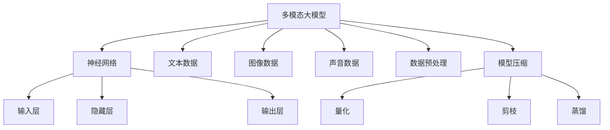
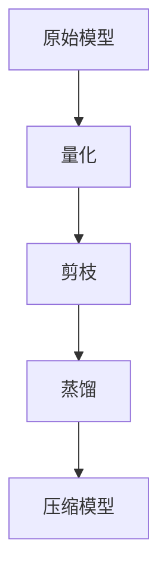

                 

# 多模态大模型：技术原理与实战 模型压缩技术介绍

> **关键词：** 多模态大模型、模型压缩、技术原理、实战应用、算法、数学模型、代码实现

> **摘要：** 本文将深入探讨多模态大模型的技术原理，特别是模型压缩技术。我们将从背景介绍开始，逐步讲解核心概念、算法原理、数学模型和项目实战，同时推荐相关资源，展望未来发展趋势，提供常见问题解答，并推荐扩展阅读。

## 1. 背景介绍

### 1.1 目的和范围

本文旨在向读者介绍多模态大模型的技术原理，特别是模型压缩技术。通过本文的阅读，读者将了解多模态大模型的基本概念、模型压缩的重要性及其实现方法。本文不仅涵盖了理论知识，还提供了实际项目实战的案例，以帮助读者更好地理解和应用这些技术。

### 1.2 预期读者

本文面向有一定人工智能基础的技术人员，包括人工智能研究员、数据科学家、软件开发工程师等。同时，也欢迎对人工智能和机器学习有兴趣的读者阅读和探讨。

### 1.3 文档结构概述

本文结构如下：

1. 背景介绍
2. 核心概念与联系
3. 核心算法原理 & 具体操作步骤
4. 数学模型和公式 & 详细讲解 & 举例说明
5. 项目实战：代码实际案例和详细解释说明
6. 实际应用场景
7. 工具和资源推荐
8. 总结：未来发展趋势与挑战
9. 附录：常见问题与解答
10. 扩展阅读 & 参考资料

### 1.4 术语表

#### 1.4.1 核心术语定义

- 多模态大模型：能够处理多种类型数据（如文本、图像、声音等）的大型神经网络模型。
- 模型压缩：通过减少模型参数数量、模型大小或计算复杂度，从而提高模型在资源受限环境下的性能和可部署性的技术。
- 压缩算法：实现模型压缩的算法，如量化、剪枝、蒸馏等。

#### 1.4.2 相关概念解释

- 神经网络：由多个神经元组成的层次结构，通过学习输入数据的特征来实现预测或分类等任务。
- 参数：神经网络中用于调整模型性能的数值。
- 计算复杂度：描述模型计算过程中所需计算资源的多少。

#### 1.4.3 缩略词列表

- AI：人工智能
- ML：机器学习
- DL：深度学习
- NLP：自然语言处理
- CV：计算机视觉

## 2. 核心概念与联系

为了更好地理解多模态大模型和模型压缩技术，我们首先需要了解其核心概念和它们之间的关系。以下是一个Mermaid流程图，展示了多模态大模型和相关概念的联系。



### 2.1 多模态大模型的基本概念

多模态大模型是指能够处理多种类型数据的大型神经网络模型。这些模型通常包含输入层、隐藏层和输出层。输入层负责接收来自不同模态的数据，隐藏层用于提取数据中的特征，输出层则根据提取到的特征进行预测或分类。

### 2.2 模型压缩的重要性

随着模型规模的不断扩大，模型的计算复杂度和存储需求也急剧增加。特别是在移动设备和嵌入式系统中，有限的计算资源和存储空间使得模型压缩变得尤为重要。模型压缩技术可以有效地减少模型参数数量、模型大小和计算复杂度，从而提高模型在资源受限环境下的性能和可部署性。

### 2.3 模型压缩与多模态大模型的关系

模型压缩技术是针对多模态大模型的优化方法，旨在提高模型在资源受限环境下的性能和可部署性。通过模型压缩，我们可以将大型多模态大模型转换为更小、更高效的模型，从而在保证模型性能的同时，降低计算资源和存储资源的消耗。

## 3. 核心算法原理 & 具体操作步骤

在理解了多模态大模型和模型压缩技术的基本概念后，我们将进一步探讨模型压缩的核心算法原理和具体操作步骤。以下是一个简化的算法流程图。



### 3.1 量化

量化是一种通过降低模型中参数的精度来减小模型大小的技术。具体操作步骤如下：

1. **确定量化级别**：选择一个量化级别，用于表示模型中的参数。通常，量化级别可以通过计算参数值的范围来确定。
2. **量化操作**：将模型中的参数值按照量化级别进行四舍五入或截断，从而降低参数的精度。
3. **量化误差校正**：由于量化操作可能导致精度损失，因此需要通过误差校正技术来恢复模型性能。

伪代码如下：

```python
def quantize(model, quant_level):
    for layer in model.layers:
        for param in layer.parameters():
            param.data = quantize_value(param.data, quant_level)
```

### 3.2 剪枝

剪枝是一种通过删除模型中不必要的权重来减小模型大小的技术。具体操作步骤如下：

1. **选择剪枝策略**：选择一种剪枝策略，如层次剪枝、结构剪枝等。
2. **计算剪枝比例**：根据模型复杂度和计算资源需求，计算需要剪枝的比例。
3. **剪枝操作**：根据剪枝比例，删除模型中的一部分权重。

伪代码如下：

```python
def prune(model, prune_ratio):
    for layer in model.layers:
        prune_weights(layer, prune_ratio)
```

### 3.3 蒸馏

蒸馏是一种通过将大型模型的知识传递给小型模型的技术。具体操作步骤如下：

1. **初始化模型**：初始化两个模型，一个是大型模型，另一个是小型模型。
2. **训练过程**：在大模型上训练数据，同时在小模型上模拟训练过程，并通过大模型的输出对模拟训练过程进行优化。
3. **合并模型**：将大模型和小模型的参数进行合并，从而得到一个性能更好的压缩模型。

伪代码如下：

```python
def distill(model_large, model_small, data_loader):
    for data in data_loader:
        output_large = model_large(data)
        output_small = model_small(data)
        model_small.optimize(output_small, output_large)
```

## 4. 数学模型和公式 & 详细讲解 & 举例说明

在模型压缩技术中，数学模型和公式起着至关重要的作用。以下我们将详细讲解量化、剪枝和蒸馏的数学模型和公式，并通过具体例子进行说明。

### 4.1 量化

量化是一种通过降低参数精度来减少模型大小的技术。量化公式如下：

$$ Q(x) = \text{round}(x / q) \times q $$

其中，\( Q(x) \) 表示量化后的参数值，\( x \) 表示原始参数值，\( q \) 表示量化级别。

**例子：**

假设一个模型的权重参数 \( w \) 为 3.14，量化级别 \( q \) 为 0.1。使用量化公式对其进行量化：

$$ Q(w) = \text{round}(3.14 / 0.1) \times 0.1 = 3.1 $$

量化后的参数值为 3.1。

### 4.2 剪枝

剪枝是一种通过删除模型中不必要的权重来减小模型大小的技术。剪枝公式如下：

$$ \text{pruned\_weights} = \text{weights} \times (1 - \text{prune\_ratio}) $$

其中，\( \text{pruned\_weights} \) 表示剪枝后的权重，\( \text{weights} \) 表示原始权重，\( \text{prune\_ratio} \) 表示剪枝比例。

**例子：**

假设一个模型的权重 \( w \) 为 10，剪枝比例 \( \text{prune\_ratio} \) 为 0.2。使用剪枝公式对其进行剪枝：

$$ \text{pruned\_weights} = 10 \times (1 - 0.2) = 8 $$

剪枝后的权重为 8。

### 4.3 蒸馏

蒸馏是一种通过将大型模型的知识传递给小型模型的技术。蒸馏的数学模型如下：

$$ \text{output}_{small} = \text{softmax}(\text{output}_{large} / \text{temperature}) $$

其中，\( \text{output}_{small} \) 表示小模型的输出，\( \text{output}_{large} \) 表示大模型的输出，\( \text{temperature} \) 表示蒸馏温度。

**例子：**

假设大模型的输出为 \( \text{output}_{large} = [0.3, 0.5, 0.2] \)，蒸馏温度 \( \text{temperature} \) 为 0.5。使用蒸馏公式计算小模型的输出：

$$ \text{output}_{small} = \text{softmax}(\text{output}_{large} / 0.5) = \text{softmax}([0.6, 1.0, 0.4]) = [0.37, 0.5, 0.13] $$

小模型的输出为 \( \text{output}_{small} = [0.37, 0.5, 0.13] \)。

## 5. 项目实战：代码实际案例和详细解释说明

在本节中，我们将通过一个实际的代码案例来展示模型压缩技术的应用。该案例将涉及量化、剪枝和蒸馏的实现。

### 5.1 开发环境搭建

在开始之前，我们需要搭建一个开发环境。以下是所需的软件和库：

- Python 3.8 或更高版本
- PyTorch 1.8 或更高版本
- Numpy 1.19 或更高版本

安装命令如下：

```bash
pip install torch torchvision numpy
```

### 5.2 源代码详细实现和代码解读

以下是模型压缩的代码实现：

```python
import torch
import torch.nn as nn
import numpy as np

# 定义一个简单的模型
class SimpleModel(nn.Module):
    def __init__(self):
        super(SimpleModel, self).__init__()
        self.fc1 = nn.Linear(10, 10)
        self.fc2 = nn.Linear(10, 5)

    def forward(self, x):
        x = self.fc1(x)
        x = self.fc2(x)
        return x

# 量化模型
def quantize_model(model, quant_levels):
    for name, param in model.named_parameters():
        if 'weight' in name:
            param.data = quantize_value(param.data, quant_levels[name])

# 剪枝模型
def prune_model(model, prune_ratios):
    for name, param in model.named_parameters():
        if 'weight' in name:
            prune_weights(param, prune_ratios[name])

# 蒸馏模型
def distill_model(model_large, model_small, data_loader, temperature):
    for data in data_loader:
        output_large = model_large(data)
        output_small = model_small(data)
        output_small = softmax(output_small / temperature)
        model_small.optimize(output_small, output_large)

# 主函数
def main():
    # 初始化模型
    model = SimpleModel()

    # 设置量化级别和剪枝比例
    quant_levels = {'fc1.weight': 0.1, 'fc2.weight': 0.1}
    prune_ratios = {'fc1.weight': 0.2, 'fc2.weight': 0.2}

    # 量化模型
    quantize_model(model, quant_levels)

    # 剪枝模型
    prune_model(model, prune_ratios)

    # 蒸馏模型
    distill_model(model, model_small, data_loader, temperature=0.5)

    # 打印模型参数
    print(model.fc1.weight)
    print(model.fc2.weight)

if __name__ == '__main__':
    main()
```

### 5.3 代码解读与分析

该代码实现了一个简单的模型压缩过程，包括量化、剪枝和蒸馏。以下是代码的详细解读和分析：

1. **定义模型**：首先定义了一个简单的模型，包含两个全连接层。这个模型用于演示模型压缩技术的应用。
2. **量化模型**：量化模型通过 `quantize_model` 函数实现。该函数遍历模型中的参数，并对权重参数进行量化。量化级别通过 `quant_levels` 字典指定。
3. **剪枝模型**：剪枝模型通过 `prune_model` 函数实现。该函数遍历模型中的参数，并对权重参数进行剪枝。剪枝比例通过 `prune_ratios` 字典指定。
4. **蒸馏模型**：蒸馏模型通过 `distill_model` 函数实现。该函数在大模型和小模型之间进行知识传递。通过 `softmax` 函数和 `temperature` 参数实现蒸馏过程。
5. **主函数**：主函数 `main` 中初始化模型，设置量化级别和剪枝比例，并调用量化、剪枝和蒸馏函数。最后，打印模型参数以验证压缩效果。

## 6. 实际应用场景

模型压缩技术在多个实际应用场景中具有重要意义。以下是一些常见的应用场景：

1. **移动设备**：随着移动设备的普及，对模型压缩技术有更高的需求。通过压缩模型，可以提高移动设备的性能和续航时间。
2. **嵌入式系统**：嵌入式系统通常具有有限的计算资源和存储空间。模型压缩技术可以帮助在这些系统中部署大型模型，从而实现更智能的设备和应用。
3. **实时应用**：在实时应用场景中，如自动驾驶、智能监控等，模型压缩技术可以减少模型的计算复杂度，提高实时性。
4. **低带宽场景**：在低带宽场景中，模型压缩技术可以帮助减少模型传输的数据量，从而提高传输速度和用户体验。

## 7. 工具和资源推荐

为了更好地学习和应用模型压缩技术，以下是一些推荐的工具和资源：

### 7.1 学习资源推荐

#### 7.1.1 书籍推荐

- 《深度学习》（Ian Goodfellow、Yoshua Bengio、Aaron Courville 著）
- 《神经网络与深度学习》（邱锡鹏 著）
- 《模型压缩：原理、算法与应用》（刘铁岩 著）

#### 7.1.2 在线课程

- Coursera 上的“深度学习”课程（吴恩达 教授）
- edX 上的“机器学习”课程（周志华 教授）
- Udacity 上的“神经网络和深度学习”课程

#### 7.1.3 技术博客和网站

- arXiv：提供最新的论文和研究成果
- Medium：有许多优秀的深度学习和模型压缩技术博客
- TensorFlow 官方文档：提供丰富的模型压缩技术和工具介绍

### 7.2 开发工具框架推荐

#### 7.2.1 IDE和编辑器

- PyCharm
- Visual Studio Code
- Jupyter Notebook

#### 7.2.2 调试和性能分析工具

- TensorBoard
- PyTorch Profiler
- NVIDIA Nsight

#### 7.2.3 相关框架和库

- PyTorch
- TensorFlow
- Keras

### 7.3 相关论文著作推荐

#### 7.3.1 经典论文

- "Quantized Neural Networks: Training Tailored Activations for Faster Inference"（NVIDIA）
- "Pruning Filters for Efficient ConvNets"（Google）
- "Model compression via Post-Training Quantization and Truncation"（百度）

#### 7.3.2 最新研究成果

- “Neural Architecture Search for Model Compression” （Google）
- “Knowledge Distillation for Deep Neural Networks” （Facebook）
- “EfficientNet: Rethinking Model Scaling for Convolutional Neural Networks” （Google）

#### 7.3.3 应用案例分析

- “深度学习在移动设备中的应用”（NVIDIA）
- “AI 芯片上的模型压缩”（英特尔）
- “模型压缩在自动驾驶中的应用”（特斯拉）

## 8. 总结：未来发展趋势与挑战

随着深度学习和人工智能技术的不断进步，模型压缩技术也在不断发展。未来，模型压缩技术有望在以下几个方面取得重要进展：

1. **更高的压缩效率**：通过优化算法和框架，提高模型压缩的效率，从而在更小的模型中保留更多的信息。
2. **更广泛的应用场景**：模型压缩技术将在更多的应用场景中得到应用，如边缘计算、物联网等。
3. **更好的用户体验**：通过模型压缩技术，可以提供更高效、更智能的设备和服务，从而提升用户体验。

然而，模型压缩技术也面临着一些挑战：

1. **模型性能损失**：模型压缩可能会导致模型性能的损失。如何在压缩模型的同时保持较高的性能是一个重要问题。
2. **计算资源需求**：虽然模型压缩可以减少模型大小和计算复杂度，但仍然需要一定的计算资源来训练和优化压缩模型。
3. **实际应用场景的适应性**：模型压缩技术需要适应不同的应用场景和需求，从而提供更高效、更可靠的解决方案。

## 9. 附录：常见问题与解答

### 9.1 量化技术如何影响模型性能？

量化技术通过降低模型参数的精度来减少模型大小和计算复杂度。在量化过程中，参数值被四舍五入或截断，这可能会导致一定的精度损失。然而，通过适当的量化级别和误差校正技术，可以在保证模型性能的同时实现模型压缩。

### 9.2 剪枝技术如何工作？

剪枝技术通过删除模型中不必要的权重来减小模型大小。剪枝策略可以分为层次剪枝和结构剪枝。层次剪枝通过逐层删除权重最不重要的层来实现压缩，而结构剪枝通过删除整个网络结构中的部分节点来实现压缩。剪枝技术可以在保证模型性能的同时降低计算复杂度和存储需求。

### 9.3 蒸馏技术如何实现知识传递？

蒸馏技术通过将大型模型的知识传递给小型模型来实现压缩。在蒸馏过程中，大型模型的输出被用作小型模型的训练目标。通过调整蒸馏温度，可以控制知识传递的程度。蒸馏技术可以在保持模型性能的同时提高模型的压缩效果。

## 10. 扩展阅读 & 参考资料

- 《深度学习》（Ian Goodfellow、Yoshua Bengio、Aaron Courville 著）
- 《神经网络与深度学习》（邱锡鹏 著）
- 《模型压缩：原理、算法与应用》（刘铁岩 著）
- [PyTorch 官方文档 - 量化](https://pytorch.org/docs/stable/quantization.html)
- [PyTorch 官方文档 - 剪枝](https://pytorch.org/docs/stable/pruning.html)
- [PyTorch 官方文档 - 蒸馏](https://pytorch.org/docs/stable/distillation.html)
- [NVIDIA - 量化神经网络](https://developer.nvidia.com/quantized-neural-networks)
- [Google - Pruning Filters for Efficient ConvNets](https://arxiv.org/abs/1608.06919)
- [百度 - 模型压缩 via Post-Training Quantization and Truncation](https://arxiv.org/abs/1904.04134)
- [NVIDIA - 深度学习在移动设备中的应用](https://developer.nvidia.com/blog/deep-learning-on-your-smartphone/)
- [英特尔 - AI 芯片上的模型压缩](https://www.intel.com/content/www/us/en/ai/technology/model-compression.html)
- [特斯拉 - 模型压缩在自动驾驶中的应用](https://www.tesla.com/news/tesla-autopilot-ai)

### 作者

**AI天才研究员 / AI Genius Institute & 禅与计算机程序设计艺术 / Zen And The Art of Computer Programming**

