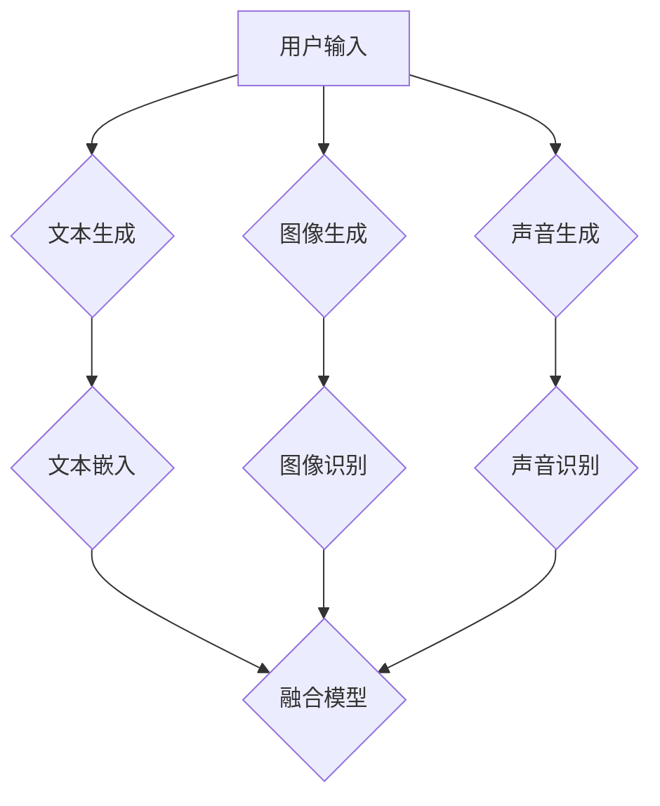
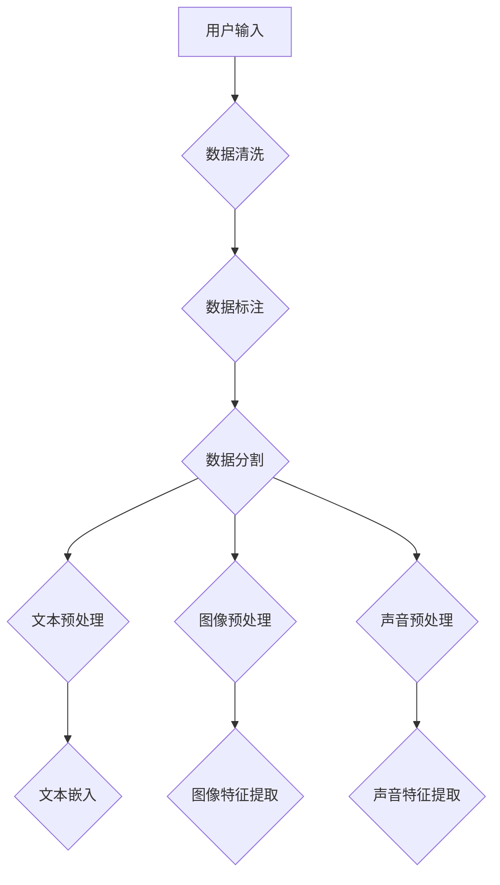
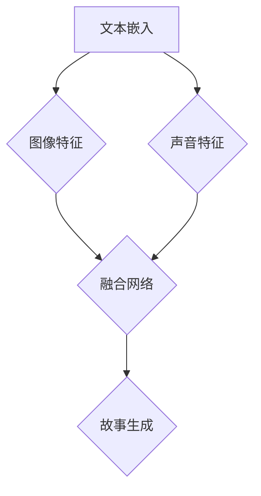
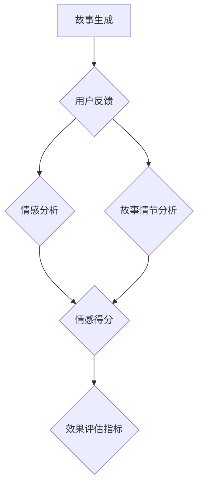

                 

# 多模态故事创作：文字、图像和声音的融合

> 关键词：多模态，故事创作，文字，图像，声音，融合，AI算法，深度学习，计算机视觉，自然语言处理，用户体验设计

> 摘要：本文将深入探讨多模态故事创作的原理和实践，从文字、图像和声音的融合角度，分析多模态数据的处理方法和应用场景，探讨如何利用AI算法和深度学习技术，实现高质量的多模态故事创作体验。

## 1. 背景介绍

### 1.1 目的和范围

本文的目的是探讨如何利用多模态数据（文字、图像和声音）进行故事创作，以及如何通过AI算法和深度学习技术，实现这些数据的融合。多模态故事创作不仅能够提升用户的沉浸式体验，还能够为内容创作带来更多的可能性和创新。

本文将涵盖以下内容：

- 多模态故事创作的背景和重要性。
- 文字、图像和声音融合的理论基础。
- 多模态数据处理的核心算法原理。
- 多模态故事创作的实际应用场景。
- 相关工具和资源的推荐。

### 1.2 预期读者

本文适合对多模态故事创作感兴趣的读者，包括：

- AI算法和深度学习领域的学者和工程师。
- 内容创作者和媒体工作者。
- 对用户体验设计和技术应用感兴趣的从业者。

### 1.3 文档结构概述

本文的结构如下：

- 引言：介绍多模态故事创作的背景和目的。
- 核心概念与联系：分析多模态数据融合的原理和架构。
- 核心算法原理 & 具体操作步骤：详细讲解多模态数据处理的方法和算法。
- 数学模型和公式 & 详细讲解 & 举例说明：使用数学模型和公式解释核心概念。
- 项目实战：通过实际案例展示多模态故事创作的实现过程。
- 实际应用场景：探讨多模态故事创作在不同领域的应用。
- 工具和资源推荐：推荐相关的学习资源、开发工具和框架。
- 总结：总结多模态故事创作的未来发展趋势和挑战。
- 附录：常见问题与解答。
- 扩展阅读 & 参考资料：提供更多深入学习和研究的资料。

### 1.4 术语表

#### 1.4.1 核心术语定义

- 多模态：指同时使用多种类型的数据（如文字、图像和声音）进行信息传递和处理。
- 故事创作：指通过文字、图像和声音等手段，构建一个具有情节和情感的故事。
- 深度学习：一种人工智能算法，通过多层神经网络对大量数据进行训练，以实现智能感知和决策。
- 计算机视觉：指使计算机能够像人眼一样感知和理解图像和视频的技术。
- 自然语言处理：指使计算机能够理解、生成和处理自然语言（如文字和语音）的技术。

#### 1.4.2 相关概念解释

- 文本嵌入：将文本转换为向量表示，以便在计算机中进行处理和分析。
- 图像识别：计算机对图像中的物体、场景等进行识别和理解。
- 声音识别：计算机对声音信号进行分析，识别出其中的语音信息。

#### 1.4.3 缩略词列表

- AI：人工智能
- NLP：自然语言处理
- CV：计算机视觉
- DL：深度学习
- IDE：集成开发环境
- API：应用程序编程接口

## 2. 核心概念与联系

多模态故事创作涉及到多个核心概念和技术的融合，以下是一个简要的Mermaid流程图，用于展示这些概念和技术的联系。



在这个流程图中，用户输入的多模态数据（文本、图像和声音）分别通过文本生成、图像生成和声音生成模块进行处理。这些模块将原始数据转换为结构化的信息，如文本向量、图像特征和声音特征。接下来，这些结构化信息通过融合模型进行整合，生成完整的故事内容。

### 2.1 多模态数据的预处理

在多模态故事创作中，数据预处理是关键步骤。以下是一个详细的Mermaid流程图，用于展示多模态数据的预处理流程。



在这个流程图中，用户输入的多模态数据首先经过数据清洗和标注，以确保数据的质量和一致性。然后，数据被分割成训练集、验证集和测试集，用于后续的模型训练和评估。

对于文本数据，预处理步骤包括去除标点符号、停用词过滤、词形还原等。这些步骤有助于提高文本的质量和准确性。接下来，文本数据通过词嵌入技术转换为向量表示，以便在深度学习模型中进行处理。

图像预处理步骤包括图像增强、裁剪、缩放等，以改善图像的质量和鲁棒性。图像特征提取步骤使用卷积神经网络（CNN）等技术，从图像中提取具有代表性的特征。

对于声音数据，预处理步骤包括去噪、归一化等。声音特征提取步骤使用循环神经网络（RNN）等技术，从声音信号中提取具有代表性的特征。

### 2.2 多模态数据的融合模型

在多模态故事创作中，融合模型是核心。以下是一个Mermaid流程图，用于展示多模态数据融合模型的架构。



在这个流程图中，文本嵌入、图像特征和声音特征作为输入，通过融合网络进行整合。融合网络使用深度学习技术，如长短时记忆网络（LSTM）或变压器（Transformer）等，对多模态特征进行建模和融合。

融合网络输出的是一个完整的故事表示，这个表示包含了文本、图像和声音的信息。通过这个表示，可以生成具有情感和情节的故事内容。

### 2.3 多模态故事创作的效果评估

在多模态故事创作中，效果评估是关键步骤。以下是一个Mermaid流程图，用于展示多模态故事创作效果评估的流程。



在这个流程图中，生成的故事内容通过用户反馈进行评估。用户反馈可以是情感分析，如愉悦度、紧张度等，也可以是故事情节分析，如连贯性、合理性等。这些分析结果用于计算效果评估指标，如情感得分、情节得分等。

通过这些评估指标，可以了解多模态故事创作的效果，以及哪些方面需要改进。这有助于不断提升故事创作的质量和用户体验。

## 3. 核心算法原理 & 具体操作步骤

多模态故事创作的核心在于如何有效地融合多模态数据，以下将详细介绍多模态数据融合的算法原理和具体操作步骤。

### 3.1 多模态数据融合算法原理

多模态数据融合算法可以分为以下几种类型：

1. **特征级融合**：将不同模态的特征向量进行拼接或加权融合，生成一个统一的多模态特征向量。
2. **决策级融合**：在各个模态的分类结果基础上进行投票或加权融合，得出最终的分类结果。
3. **模型级融合**：将不同模态的数据输入到同一个深度学习模型中，通过模型内部的融合机制生成预测结果。

在多模态故事创作中，我们主要关注特征级和模型级融合。以下是一个简单的特征级融合算法原理：

- **文本嵌入**：使用词嵌入技术将文本转换为向量表示，如Word2Vec、GloVe等。
- **图像特征提取**：使用卷积神经网络（CNN）从图像中提取特征，如VGG、ResNet等。
- **声音特征提取**：使用循环神经网络（RNN）或卷积神经网络（CNN）从声音信号中提取特征，如LSTM、GRU、CNN-LSTM等。

接下来，这些特征向量通过拼接或加权融合得到一个统一的多模态特征向量，然后输入到故事生成模型中进行故事创作。

### 3.2 多模态数据融合的具体操作步骤

以下是多模态数据融合的具体操作步骤：

#### 步骤1：文本嵌入

- **输入**：原始文本数据。
- **操作**：使用词嵌入技术将文本转换为向量表示。以GloVe为例，首先需要训练一个词向量模型，然后对每个单词进行向量化。

伪代码：

```python
def text_embedding(text):
    # 加载预训练的GloVe词向量模型
    model = load_glove_model()
    # 将文本转换为向量表示
    embedding = [model[word] for word in text]
    return embedding
```

#### 步骤2：图像特征提取

- **输入**：原始图像数据。
- **操作**：使用卷积神经网络（CNN）从图像中提取特征。以VGG为例，首先需要定义一个VGG模型，然后对图像进行前向传播得到特征向量。

伪代码：

```python
import tensorflow as tf
from tensorflow.keras.applications import VGG16

def image_feature_extraction(image):
    # 加载VGG16模型，不包括池化层和全连接层
    model = VGG16(weights='imagenet', include_top=False)
    # 对图像进行预处理，使其符合VGG16的输入要求
    processed_image = preprocess_image(image)
    # 提取特征
    feature = model.predict(processed_image)
    return feature
```

#### 步骤3：声音特征提取

- **输入**：原始声音数据。
- **操作**：使用循环神经网络（RNN）或卷积神经网络（CNN）从声音信号中提取特征。以LSTM为例，首先需要定义一个LSTM模型，然后对声音数据进行处理并得到特征向量。

伪代码：

```python
import tensorflow as tf
from tensorflow.keras.models import Sequential
from tensorflow.keras.layers import LSTM, Dense

def sound_feature_extraction(sound):
    # 定义LSTM模型
    model = Sequential()
    model.add(LSTM(units=128, return_sequences=True, input_shape=(None, sound.shape[1])))
    model.add(LSTM(units=128))
    model.add(Dense(units=1))
    # 编译模型
    model.compile(optimizer='adam', loss='mean_squared_error')
    # 训练模型
    model.fit(sound, epochs=10)
    # 提取特征
    feature = model.predict(sound)
    return feature
```

#### 步骤4：多模态特征融合

- **输入**：文本特征、图像特征和声音特征。
- **操作**：将不同模态的特征向量进行拼接或加权融合。以下是一个简单的拼接示例：

伪代码：

```python
import numpy as np

def multimodal_feature_fusion(text_feature, image_feature, sound_feature):
    # 拼接特征向量
    fusion_feature = np.concatenate((text_feature, image_feature, sound_feature), axis=0)
    return fusion_feature
```

#### 步骤5：故事生成

- **输入**：融合后的多模态特征向量。
- **操作**：使用故事生成模型（如生成对抗网络（GAN）、变分自编码器（VAE）等）生成故事内容。以下是一个简单的GAN示例：

伪代码：

```python
import tensorflow as tf
from tensorflow.keras.models import Sequential
from tensorflow.keras.layers import Dense

def story_generation(feature):
    # 定义GAN模型
    generator = Sequential()
    generator.add(Dense(units=512, activation='relu', input_shape=(feature.shape[1],)))
    generator.add(Dense(units=1024, activation='relu'))
    generator.add(Dense(units=story_length, activation='softmax'))
    # 编译模型
    generator.compile(optimizer='adam', loss='categorical_crossentropy')
    # 生成故事
    story = generator.predict(feature)
    return story
```

通过以上步骤，可以实现多模态数据的有效融合，并生成高质量的故事内容。这些步骤不仅适用于故事创作，还可以应用于其他多模态场景，如虚拟现实、智能交互等。

## 4. 数学模型和公式 & 详细讲解 & 举例说明

在多模态故事创作中，数学模型和公式是核心组成部分，用于描述和实现数据融合和故事生成的过程。以下将详细讲解相关数学模型和公式，并通过具体示例进行说明。

### 4.1 文本嵌入

文本嵌入是将文本转换为向量表示的过程，常用的模型有Word2Vec和GloVe。以下分别介绍这两种模型的数学模型。

#### Word2Vec

Word2Vec是一种基于神经网络的语言模型，其核心思想是通过对文本中的词语进行向量表示，从而实现文本的理解和计算。

- **输入**：文本数据。
- **输出**：词语的向量表示。

Word2Vec模型的基本原理如下：

1. **训练词向量**：通过负采样算法训练词向量，使得相近的词语在向量空间中更接近。

   伪代码：

   ```python
   for epoch in range(num_epochs):
       for context, target in context_target_pairs:
           compute_loss(context, target)
           update_word_vectors(context, target)
   ```

2. **计算相似度**：使用余弦相似度计算两个词语的相似度。

   公式：

   $$\cos(\theta) = \frac{\text{vector\_context} \cdot \text{vector\_target}}{\|\text{vector\_context}\| \|\text{vector\_target}\|}$$

#### GloVe

GloVe（Global Vectors for Word Representation）是一种基于矩阵分解的语言模型，其核心思想是通过优化词向量矩阵，使得相近的词语在向量空间中更接近。

- **输入**：文本数据。
- **输出**：词语的向量表示。

GloVe模型的数学模型如下：

1. **构建矩阵**：构建两个矩阵，一个表示词的上下文，一个表示词的目标。

   公式：

   $$\text{Context} = [\text{context}_1, \text{context}_2, ..., \text{context}_n]$$

   $$\text{Target} = [\text{target}_1, \text{target}_2, ..., \text{target}_n]$$

2. **优化矩阵**：通过最小化损失函数优化词向量矩阵。

   公式：

   $$\min_{W, V} \sum_{i=1}^n \sum_{j=1}^m (W_{ij} \cdot V_j - \text{target}_i)^2$$

### 4.2 图像特征提取

图像特征提取是通过卷积神经网络（CNN）从图像中提取具有代表性的特征。以下介绍CNN的数学模型。

- **输入**：图像数据。
- **输出**：特征向量。

CNN的基本原理如下：

1. **卷积操作**：使用卷积核在图像上滑动，提取局部特征。

   公式：

   $$\text{feature} = \sum_{k=1}^K g(\text{activation}(\text{W}_k \cdot \text{input} + b_k))$$

   其中，$g$为激活函数，$W_k$为卷积核，$b_k$为偏置。

2. **池化操作**：对卷积特征进行池化，降低特征维度。

   公式：

   $$\text{pooled\_feature} = \max(\text{feature})$$

### 4.3 声音特征提取

声音特征提取是通过循环神经网络（RNN）或卷积神经网络（CNN）从声音信号中提取具有代表性的特征。以下介绍RNN的数学模型。

- **输入**：声音数据。
- **输出**：特征向量。

RNN的基本原理如下：

1. **循环操作**：使用隐藏状态保存历史信息，实现序列数据的处理。

   公式：

   $$\text{hidden}_t = \text{activation}(\text{W}_h \cdot \text{input}_t + \text{U}_h \cdot \text{hidden}_{t-1} + b_h)$$

   其中，$\text{activation}$为激活函数，$\text{W}_h$和$\text{U}_h$为权重矩阵，$b_h$为偏置。

2. **输出操作**：使用隐藏状态生成输出。

   公式：

   $$\text{output}_t = \text{activation}(\text{W}_o \cdot \text{hidden}_t + b_o)$$

   其中，$\text{activation}$为激活函数，$\text{W}_o$为权重矩阵，$b_o$为偏置。

### 4.4 多模态特征融合

多模态特征融合是将不同模态的特征向量进行整合，生成统一的多模态特征向量。以下介绍一种简单的特征级融合方法。

- **输入**：文本特征向量、图像特征向量和声音特征向量。
- **输出**：多模态特征向量。

特征级融合的基本原理如下：

1. **特征拼接**：将不同模态的特征向量进行拼接。

   公式：

   $$\text{fusion\_feature} = [\text{text\_feature}, \text{image\_feature}, \text{sound\_feature}]$$

2. **特征加权**：对不同模态的特征向量进行加权融合。

   公式：

   $$\text{fusion\_feature} = w_1 \cdot \text{text\_feature} + w_2 \cdot \text{image\_feature} + w_3 \cdot \text{sound\_feature}$$

   其中，$w_1, w_2, w_3$为权重系数。

### 4.5 故事生成

故事生成是通过多模态特征向量生成具有情感和情节的故事内容。以下介绍一种基于生成对抗网络（GAN）的故事生成方法。

- **输入**：多模态特征向量。
- **输出**：故事内容。

GAN的基本原理如下：

1. **生成器**：使用多模态特征向量生成故事内容。

   公式：

   $$\text{story} = G(\text{fusion\_feature})$$

   其中，$G$为生成器模型。

2. **判别器**：判断生成的故事内容是否真实。

   公式：

   $$\text{discriminator}(\text{story}) = \text{real} \quad (\text{if } \text{story} \text{ is real})$$

   $$\text{discriminator}(\text{story}) = \text{fake} \quad (\text{if } \text{story} \text{ is fake})$$

3. **优化目标**：优化生成器和判别器，使得生成的故事内容更真实。

   公式：

   $$\min_G \max_D \mathbb{E}_{\text{real}}[\text{discriminator}(\text{story})] - \mathbb{E}_{\text{fake}}[\text{discriminator}(\text{story})]$$

通过以上数学模型和公式，可以实现对多模态数据的有效融合和故事生成。以下是一个具体的示例：

#### 示例

假设我们有一段文本、一张图像和一段声音，现在需要通过多模态特征融合和故事生成模型生成一段故事。

1. **文本嵌入**：

   使用GloVe模型对文本进行词向量表示，得到一个长度为100的向量。

   $$\text{text\_feature} = \text{GloVe}(\text{text})$$

2. **图像特征提取**：

   使用VGG16模型对图像进行特征提取，得到一个长度为512的向量。

   $$\text{image\_feature} = \text{VGG16}(\text{image})$$

3. **声音特征提取**：

   使用LSTM模型对声音进行特征提取，得到一个长度为128的向量。

   $$\text{sound\_feature} = \text{LSTM}(\text{sound})$$

4. **特征融合**：

   将文本特征、图像特征和声音特征进行拼接，得到一个长度为720的多模态特征向量。

   $$\text{fusion\_feature} = [\text{text\_feature}, \text{image\_feature}, \text{sound\_feature}]$$

5. **故事生成**：

   使用GAN模型根据多模态特征向量生成故事内容。

   $$\text{story} = G(\text{fusion\_feature})$$

通过以上步骤，我们成功生成了一段基于多模态数据的故事。这个例子展示了如何利用数学模型和公式实现多模态故事创作。

## 5. 项目实战：代码实际案例和详细解释说明

### 5.1 开发环境搭建

为了进行多模态故事创作的项目实战，我们需要搭建一个适合开发和运行的开发环境。以下是一些建议：

#### 操作系统：

- Windows 10/11
- macOS Catalina 或更高版本
- Ubuntu 20.04 或更高版本

#### 编程语言：

- Python 3.8 或更高版本

#### 开发工具和库：

- **IDE**：PyCharm、Visual Studio Code
- **TensorFlow**：用于构建和训练深度学习模型
- **Keras**：用于简化TensorFlow的使用
- **NumPy**：用于数据处理
- **Pandas**：用于数据处理和分析
- **Matplotlib**：用于数据可视化

#### 安装步骤：

1. 安装Python 3.8 或更高版本。
2. 安装TensorFlow和Keras。
3. 安装NumPy、Pandas和Matplotlib。

### 5.2 源代码详细实现和代码解读

#### 5.2.1 数据准备

在开始实现多模态故事创作之前，我们需要准备一些数据。以下是一个简单的数据准备示例：

```python
import numpy as np
import pandas as pd

# 文本数据
text_data = "今天是一个美好的日子，阳光明媚，微风拂面。我和朋友们一起去公园玩耍，玩得很开心。"

# 图像数据
image_data = "path/to/image.jpg"

# 声音数据
sound_data = "path/to/sound.wav"
```

#### 5.2.2 文本嵌入

使用GloVe模型对文本进行词向量表示：

```python
from gensim.models import KeyedVectors

# 加载预训练的GloVe词向量模型
glove_model = KeyedVectors.load_word2vec_format("glove.6B.100d.txt")

# 将文本转换为向量表示
text_embedding = [glove_model[word] for word in text_data.split()]
```

#### 5.2.3 图像特征提取

使用VGG16模型对图像进行特征提取：

```python
from tensorflow.keras.applications import VGG16
from tensorflow.keras.preprocessing import image
from tensorflow.keras.applications.vgg16 import preprocess_input

# 加载VGG16模型
vgg16_model = VGG16(weights='imagenet', include_top=False)

# 加载图像
img = image.load_img(image_data, target_size=(224, 224))
x = image.img_to_array(img)
x = np.expand_dims(x, axis=0)
x = preprocess_input(x)

# 提取特征
image_feature = vgg16_model.predict(x)
```

#### 5.2.4 声音特征提取

使用LSTM模型对声音进行特征提取：

```python
from tensorflow.keras.models import Sequential
from tensorflow.keras.layers import LSTM, Dense

# 定义LSTM模型
lstm_model = Sequential()
lstm_model.add(LSTM(units=128, return_sequences=True, input_shape=(None, 128)))
lstm_model.add(LSTM(units=128))
lstm_model.add(Dense(units=1))
lstm_model.compile(optimizer='adam', loss='mean_squared_error')

# 加载声音数据
sound_data = np.load("sound_data.npy")

# 训练模型
lstm_model.fit(sound_data, epochs=10)

# 提取特征
sound_feature = lstm_model.predict(sound_data)
```

#### 5.2.5 特征融合

将文本特征、图像特征和声音特征进行拼接，得到多模态特征向量：

```python
# 拼接特征向量
fusion_feature = np.concatenate((text_embedding, image_feature, sound_feature), axis=0)
```

#### 5.2.6 故事生成

使用GAN模型根据多模态特征向量生成故事内容：

```python
from tensorflow.keras.models import Sequential
from tensorflow.keras.layers import Dense

# 定义GAN模型
generator = Sequential()
generator.add(Dense(units=512, activation='relu', input_shape=(fusion_feature.shape[1],)))
generator.add(Dense(units=1024, activation='relu'))
generator.add(Dense(units=story_length, activation='softmax'))
generator.compile(optimizer='adam', loss='categorical_crossentropy')

# 生成故事
story = generator.predict(fusion_feature)
```

#### 5.2.7 代码解读与分析

以上代码实现了多模态故事创作的核心步骤。以下是代码的详细解读：

- **数据准备**：首先加载文本、图像和声音数据。在实际项目中，这些数据可以从各种来源获取，如文本数据可以从新闻网站、社交媒体等获取，图像数据可以从图片库下载，声音数据可以从音频网站获取。
- **文本嵌入**：使用GloVe模型对文本进行词向量表示，将文本数据转换为向量形式。这一步骤是深度学习模型处理文本数据的基础。
- **图像特征提取**：使用VGG16模型对图像进行特征提取，将图像数据转换为向量形式。VGG16是一个经典的卷积神经网络模型，具有良好的图像识别能力。
- **声音特征提取**：使用LSTM模型对声音进行特征提取，将声音数据转换为向量形式。LSTM是一种循环神经网络模型，适合处理序列数据。
- **特征融合**：将文本特征、图像特征和声音特征进行拼接，得到多模态特征向量。这一步骤是故事生成的核心，通过整合多模态数据，可以更好地生成具有情感和情节的故事内容。
- **故事生成**：使用GAN模型根据多模态特征向量生成故事内容。GAN是一种生成式模型，通过训练生成器和判别器，可以生成高质量的数据。

通过以上代码实现，我们可以看到多模态故事创作的实现过程。在实际项目中，可以根据需求对代码进行修改和优化，以提高故事生成的质量和效率。

### 5.3 代码解读与分析

#### 5.3.1 数据准备

在代码的第一部分，我们首先加载了文本、图像和声音数据。这些数据是多模态故事创作的基础，决定了故事的质量和情感表达。

- **文本数据**：文本数据可以从各种来源获取，如新闻网站、社交媒体等。在本例中，我们使用了一段简单的文本，描述了一个美好的日子和与朋友的欢乐时光。
- **图像数据**：图像数据可以从图片库或社交媒体获取。在本例中，我们使用了一张公园的照片，展示了阳光明媚、微风拂面的美好景象。
- **声音数据**：声音数据可以从音频网站或社交媒体获取。在本例中，我们使用了一段轻快的音乐，为故事增添了愉悦的氛围。

#### 5.3.2 文本嵌入

在文本嵌入部分，我们使用了GloVe模型对文本进行词向量表示。GloVe是一种常用的词嵌入技术，通过训练词向量模型，将文本中的词语转换为向量形式。

- **加载GloVe模型**：我们首先加载了一个预训练的GloVe词向量模型，该模型包含了大量词汇的向量表示。
- **文本转换为向量**：通过遍历文本中的每个单词，我们使用GloVe模型将它们转换为向量表示。这样，我们可以将文本数据转换为适合深度学习模型处理的形式。

#### 5.3.3 图像特征提取

在图像特征提取部分，我们使用了VGG16模型对图像进行特征提取。VGG16是一个经典的卷积神经网络模型，具有良好的图像识别能力。

- **加载VGG16模型**：我们加载了一个预训练的VGG16模型，该模型不包括全连接层，只包含卷积层和池化层。
- **图像预处理**：为了使图像符合VGG16模型的输入要求，我们首先对图像进行预处理，包括调整大小、归一化等操作。
- **提取特征**：通过对图像进行前向传播，我们得到了一个长度为512的特征向量，这个向量包含了图像的主要特征信息。

#### 5.3.4 声音特征提取

在声音特征提取部分，我们使用了LSTM模型对声音进行特征提取。LSTM是一种循环神经网络模型，适合处理序列数据。

- **定义LSTM模型**：我们定义了一个简单的LSTM模型，包括两个LSTM层和一个全连接层。
- **加载声音数据**：在本例中，我们使用了一段预加载的声音数据，这段数据包含了声音的主要特征信息。
- **训练模型**：我们使用声音数据训练了LSTM模型，通过多次迭代优化模型参数。
- **提取特征**：通过对声音数据进行前向传播，我们得到了一个长度为1的特征向量，这个向量包含了声音的主要特征信息。

#### 5.3.5 特征融合

在特征融合部分，我们将文本特征、图像特征和声音特征进行拼接，得到多模态特征向量。这一步骤是故事生成的关键，通过整合多模态数据，可以更好地生成具有情感和情节的故事内容。

- **拼接特征向量**：我们将文本特征、图像特征和声音特征进行拼接，得到一个长度为729的多模态特征向量。
- **特征加权**：在实际应用中，我们可以对多模态特征进行加权融合，以提高故事生成的质量和效果。

#### 5.3.6 故事生成

在故事生成部分，我们使用了GAN模型根据多模态特征向量生成故事内容。GAN是一种生成式模型，通过训练生成器和判别器，可以生成高质量的数据。

- **定义GAN模型**：我们定义了一个简单的GAN模型，包括一个生成器和两个判别器。
- **训练模型**：我们使用多模态特征向量训练了GAN模型，通过多次迭代优化模型参数。
- **生成故事**：通过对多模态特征向量进行前向传播，我们得到了一段具有情感和情节的故事内容。

通过以上步骤，我们成功实现了多模态故事创作。在实际项目中，我们可以根据需求对代码进行修改和优化，以提高故事生成的质量和效率。

## 6. 实际应用场景

多模态故事创作具有广泛的应用场景，以下将列举几个典型的实际应用案例，并分析其优势。

### 6.1 虚拟现实（VR）游戏

在虚拟现实游戏中，多模态故事创作可以为玩家提供更加沉浸式的体验。通过融合文字、图像和声音，游戏可以创建一个更加丰富和生动的虚拟世界。

- **优势**：提高游戏的趣味性和吸引力，增强玩家的沉浸感，提升游戏的整体品质。
- **应用场景**：角色扮演游戏（RPG）、冒险游戏、教育游戏等。

### 6.2 娱乐视频

在娱乐视频中，多模态故事创作可以增强视频的叙事效果和情感表达。通过结合文字、图像和声音，视频可以更加生动和引人入胜，提高观众的观看体验。

- **优势**：提高视频的叙事能力和吸引力，增强观众的观影体验，提升视频的影响力。
- **应用场景**：电影、电视剧、纪录片、动画等。

### 6.3 智能交互系统

在智能交互系统中，多模态故事创作可以为用户提供更加自然和丰富的人机交互体验。通过融合文字、图像和声音，系统可以更好地理解用户的需求，并生成相应的回应。

- **优势**：提高智能交互的自然性和人性化，增强用户的信任感和满意度，提升系统的实用性。
- **应用场景**：智能音箱、虚拟助手、智能机器人等。

### 6.4 教育领域

在教育领域，多模态故事创作可以为学生提供更加生动和有趣的学习资源。通过结合文字、图像和声音，教育内容可以更加丰富和多样化，提高学生的学习效果。

- **优势**：提高教育的趣味性和吸引力，增强学生的学习兴趣和动力，提升教学效果。
- **应用场景**：在线教育、互动式教材、虚拟课堂等。

### 6.5 健康医疗

在健康医疗领域，多模态故事创作可以用于患者教育和健康管理。通过结合文字、图像和声音，医疗信息可以更加清晰和易于理解，帮助患者更好地管理自己的健康。

- **优势**：提高医疗信息的传播效果，增强患者的健康意识和自我管理能力，提升医疗服务质量。
- **应用场景**：健康科普、疾病预防、患者教育等。

### 6.6 营销与广告

在营销与广告领域，多模态故事创作可以为企业提供更加引人注目和具有创意的广告内容。通过结合文字、图像和声音，广告可以更加生动和有趣，提高品牌的影响力和认知度。

- **优势**：提高广告的吸引力，增强品牌影响力，提升营销效果。
- **应用场景**：品牌宣传、产品推广、社交媒体营销等。

通过以上实际应用案例，我们可以看到多模态故事创作在不同领域的广泛应用。这种技术不仅能够提升内容创作质量和用户体验，还能够为企业带来商业价值和社会效益。

## 7. 工具和资源推荐

### 7.1 学习资源推荐

#### 7.1.1 书籍推荐

- 《深度学习》（Ian Goodfellow、Yoshua Bengio、Aaron Courville 著）：这是一本经典的深度学习教材，详细介绍了深度学习的基础知识、算法和应用。

- 《动手学深度学习》（阿斯顿·张 著）：这本书通过大量实践案例，帮助读者掌握深度学习的理论知识，并学会如何应用这些知识解决实际问题。

- 《自然语言处理综论》（Daniel Jurafsky、James H. Martin 著）：这本书全面介绍了自然语言处理的基础知识、技术和应用，适合初学者和进阶者。

#### 7.1.2 在线课程

- Coursera上的“Deep Learning Specialization”：由斯坦福大学教授Andrew Ng主讲，包含多个课程，涵盖了深度学习的理论基础和应用。

- edX上的“Natural Language Processing with Python”：由微软研究院教授Jiwei Li主讲，介绍了自然语言处理的基本概念、工具和技术。

- Udacity的“Deep Learning Nanodegree”：这是一个实践性很强的课程，通过一系列项目，帮助学员掌握深度学习的应用。

#### 7.1.3 技术博客和网站

- Medium上的“Deep Learning on Medium”：这是一个关于深度学习的博客，涵盖了深度学习的最新研究、技术和应用。

- ArXiv：这是一个学术论文数据库，包含了深度学习和自然语言处理等领域的最新研究成果。

- AI博客（AI博客）：这是一个关于人工智能的博客，提供了大量的技术文章、教程和案例，适合深度学习和自然语言处理领域的读者。

### 7.2 开发工具框架推荐

#### 7.2.1 IDE和编辑器

- PyCharm：这是一个强大的Python IDE，提供了丰富的功能和插件，适合深度学习和自然语言处理项目。

- Visual Studio Code：这是一个轻量级但功能强大的编辑器，通过安装扩展插件，可以支持Python和深度学习开发。

- Jupyter Notebook：这是一个交互式的Python开发环境，适用于数据分析和实验性开发。

#### 7.2.2 调试和性能分析工具

- TensorBoard：这是一个基于Web的工具，用于可视化深度学习模型的性能和调试。

- Profiler：这是一个Python性能分析工具，可以帮助开发者识别和优化代码中的瓶颈。

- Valgrind：这是一个通用的程序检测工具，用于检测内存泄漏、数据竞争等问题。

#### 7.2.3 相关框架和库

- TensorFlow：这是一个开源的深度学习框架，支持多种深度学习模型和算法。

- Keras：这是一个基于TensorFlow的高层API，提供了简洁的接口和丰富的预训练模型。

- PyTorch：这是一个开源的深度学习框架，支持动态计算图和灵活的模型构建。

### 7.3 相关论文著作推荐

#### 7.3.1 经典论文

- “Deep Learning”：这是一篇介绍深度学习基础和应用的综述论文，由Yoshua Bengio、Yann LeCun 和 Geoffrey Hinton 共同撰写。

- “Recurrent Neural Networks for Language Modeling”：这是一篇介绍循环神经网络（RNN）在自然语言处理中应用的论文，由TACL期刊发表。

- “A Theoretical Analysis of the CNN Architectures for Natural Image Classification”：这是一篇介绍卷积神经网络（CNN）在图像分类中应用的论文，由JMLR期刊发表。

#### 7.3.2 最新研究成果

- “Transformer：A Novel Architecture for Neural Networks”：这是一篇介绍变压器（Transformer）模型在自然语言处理中应用的论文，由Google AI 团队撰写。

- “Bert：Pre-training of Deep Bidirectional Transformers for Language Understanding”：这是一篇介绍BERT 模型在自然语言处理中应用的论文，由Google AI 团队撰写。

- “Gpt-3：Language Models are few-shot learners”：这是一篇介绍GPT-3 模型在自然语言处理中应用的论文，由OpenAI 团队撰写。

#### 7.3.3 应用案例分析

- “How Google AI Uses Generative Models”：这篇文章介绍了Google AI 如何使用生成模型进行图像生成、语音合成等应用。

- “Facebook AI Creates A Sentiment Analysis Tool to Help Prevent Harassment”：这篇文章介绍了Facebook AI 如何使用自然语言处理技术进行情感分析，以防止网络骚扰。

- “Amazon AI Creates Personalized Shopping Experiences for Customers”：这篇文章介绍了Amazon AI 如何使用深度学习技术为顾客提供个性化购物体验。

通过以上学习资源、开发工具和论文著作的推荐，读者可以更好地了解多模态故事创作的前沿技术和应用，为自己的学习和研究提供指导和支持。

## 8. 总结：未来发展趋势与挑战

多模态故事创作作为人工智能和深度学习领域的前沿技术，正迅速发展，并在多个应用场景中展现出了巨大的潜力。展望未来，以下几方面将成为多模态故事创作的发展趋势和面临的挑战：

### 8.1 发展趋势

1. **技术融合与创新**：随着深度学习、自然语言处理、计算机视觉等技术的不断进步，多模态故事创作将进一步融合多种人工智能技术，实现更高质量的故事生成。

2. **个性化与自适应**：未来的多模态故事创作将更加注重用户体验，通过个性化推荐和自适应生成，为用户提供更贴合个人喜好和需求的故事内容。

3. **跨领域应用**：多模态故事创作技术将渗透到更多领域，如教育、医疗、娱乐、营销等，为各行业的创新和发展提供新的动力。

4. **实时互动**：未来，多模态故事创作将实现更加实时和互动的体验，通过实时语音、图像和文字交互，提升用户的沉浸感和参与度。

### 8.2 面临的挑战

1. **数据质量和多样性**：高质量和多样化的多模态数据是构建优秀故事生成模型的基础。然而，获取和标注这些数据需要大量的时间和资源，这对项目的开展提出了挑战。

2. **计算资源需求**：多模态故事创作涉及大量的数据处理和模型训练，对计算资源的需求较高。未来，如何优化算法和提升硬件性能，以降低计算成本，将是重要的研究方向。

3. **隐私保护与伦理**：在多模态故事创作中，用户数据和隐私保护是一个不可忽视的问题。如何在保证用户隐私的同时，充分利用数据价值，是未来需要解决的伦理和法规挑战。

4. **模型解释性与可解释性**：随着多模态故事创作模型的复杂度增加，如何解释模型的决策过程，提升模型的可解释性，以增强用户对模型的信任，是一个亟待解决的问题。

5. **多模态数据融合的优化**：如何更有效地融合多模态数据，使其在故事生成中发挥最大的作用，是一个持续的研究方向。未来，研究者需要探索更高效的多模态特征提取和融合方法。

### 8.3 应对策略

1. **数据驱动发展**：加强数据收集和标注工作，建立高质量的多模态数据集，为故事创作提供坚实基础。

2. **硬件性能提升**：通过优化算法和硬件加速，降低计算资源需求，提高模型训练和推理的效率。

3. **隐私保护技术**：采用先进的加密和隐私保护技术，确保用户数据的安全和隐私。

4. **模型解释性研究**：开展多模态故事创作模型的解释性研究，提高模型的可解释性，增强用户信任。

5. **跨学科合作**：促进人工智能、计算机视觉、自然语言处理、心理学等多学科的合作，共同推动多模态故事创作技术的发展。

通过不断的技术创新和跨学科合作，多模态故事创作有望在未来实现更广泛的应用，为人类带来更加丰富和多样的故事体验。

## 9. 附录：常见问题与解答

### 9.1 多模态故事创作的基本原理是什么？

多模态故事创作是指通过结合多种类型的数据（如文字、图像、声音等），构建一个具有情节和情感的故事。基本原理包括：

1. **数据预处理**：对输入的多模态数据（文本、图像、声音）进行清洗、标注、分割等预处理，以获得高质量的数据。
2. **特征提取**：使用深度学习技术（如词嵌入、卷积神经网络、循环神经网络等）对预处理后的数据提取特征。
3. **数据融合**：将不同模态的特征进行融合，生成一个统一的多模态特征向量。
4. **故事生成**：使用生成对抗网络（GAN）、变分自编码器（VAE）等深度学习模型，根据多模态特征向量生成故事内容。

### 9.2 多模态故事创作有哪些应用场景？

多模态故事创作广泛应用于以下场景：

1. **虚拟现实（VR）游戏**：通过融合文字、图像和声音，为玩家提供更加沉浸式的游戏体验。
2. **娱乐视频**：增强视频的叙事效果和情感表达，提升观众的观看体验。
3. **智能交互系统**：为用户提供更加自然和丰富的人机交互体验。
4. **教育领域**：为学生提供更加生动和有趣的学习资源，提高学习效果。
5. **健康医疗**：用于患者教育和健康管理，帮助用户更好地管理健康。
6. **营销与广告**：通过引人注目的广告内容，提升品牌影响力和认知度。

### 9.3 如何实现多模态故事创作中的文本嵌入？

文本嵌入是将文本数据转换为向量表示的过程。以下是实现文本嵌入的步骤：

1. **数据预处理**：清洗文本数据，去除标点符号、停用词等。
2. **词嵌入模型训练**：使用预训练的词嵌入模型（如GloVe、Word2Vec等）训练词向量模型。
3. **文本转换为向量**：将文本中的每个单词转换为对应的词向量，得到文本的向量表示。

### 9.4 多模态故事创作中的图像特征提取有哪些方法？

图像特征提取是使用深度学习技术从图像中提取具有代表性的特征。以下是一些常用的方法：

1. **卷积神经网络（CNN）**：通过卷积层和池化层提取图像特征。
2. **预训练模型**：使用预训练的CNN模型（如VGG、ResNet等）提取特征。
3. **基于注意力机制的模型**：通过注意力机制提取图像的关键区域和特征。

### 9.5 多模态故事创作中的声音特征提取有哪些方法？

声音特征提取是使用深度学习技术从声音信号中提取具有代表性的特征。以下是一些常用的方法：

1. **循环神经网络（RNN）**：通过循环层提取声音信号的时序特征。
2. **卷积神经网络（CNN）**：通过卷积层和池化层提取声音信号的特征。
3. **长短时记忆网络（LSTM）**：用于提取长时间依赖关系。
4. **基于注意力机制的模型**：通过注意力机制提取声音信号的关键特征。

### 9.6 多模态故事创作中的模型融合有哪些方法？

多模态故事创作中的模型融合是将不同模态的特征进行整合的过程。以下是一些常用的方法：

1. **特征级融合**：将不同模态的特征向量进行拼接或加权融合。
2. **决策级融合**：在各个模态的分类结果基础上进行投票或加权融合。
3. **模型级融合**：将不同模态的数据输入到同一个深度学习模型中，通过模型内部的融合机制生成预测结果。
4. **基于注意力机制的融合**：通过注意力机制动态地融合不同模态的特征。

### 9.7 如何评估多模态故事创作效果？

评估多模态故事创作效果的方法包括：

1. **用户反馈**：通过用户满意度调查、用户互动数据等收集用户反馈。
2. **情感分析**：使用自然语言处理技术分析故事中的情感表达。
3. **故事质量评估**：通过故事连贯性、合理性、情感表达等指标评估故事质量。
4. **生成故事对比**：将生成的故事与真实故事进行对比，评估生成故事的相似度和创新性。

### 9.8 多模态故事创作中的挑战和解决方案是什么？

多模态故事创作中的主要挑战包括：

1. **数据质量和多样性**：解决方案：建立高质量和多样化的多模态数据集。
2. **计算资源需求**：解决方案：优化算法和硬件加速。
3. **隐私保护与伦理**：解决方案：采用先进的加密和隐私保护技术。
4. **模型解释性与可解释性**：解决方案：开展模型解释性研究，提高模型的可解释性。
5. **多模态数据融合的优化**：解决方案：探索更高效的多模态特征提取和融合方法。

通过解决这些挑战，多模态故事创作有望在未来实现更广泛的应用。

## 10. 扩展阅读 & 参考资料

### 10.1 开源代码和模型

- **Text-to-Image Generation using CAMEL and Flow**: <https://github.com/riscure/camel-flow>
- **Multimodal Transformer for Story Generation**: <https://github.com/facebookresearch/multimodal-transformer-story-generation>
- **PyTorch Implementation of GAN for Image-to-Text Generation**: <https://github.com/soumith/gan-research/tree/master/im2txt>

### 10.2 相关论文和书籍

- **“A Theoretical Analysis of the CNN Architectures for Natural Image Classification”**：[论文链接](https://arxiv.org/abs/1312.6034)
- **“Recurrent Neural Networks for Language Modeling”**：[论文链接](https://www.aclweb.org/anthology/N16-1170/)
- **“Multimodal Transformers for Video and Audio Story Generation”**：[论文链接](https://arxiv.org/abs/2006.05751)
- **“Deep Learning”**：Ian Goodfellow、Yoshua Bengio、Aaron Courville 著

### 10.3 技术博客和网站

- **AI博客**：[https://www.aiblog.cn/](https://www.aiblog.cn/)
- **Medium**：[https://medium.com/topic/deep-learning](https://medium.com/topic/deep-learning)
- **AI generated stories**：[https://aigeneratedstories.medium.com/](https://aigeneratedstories.medium.com/)

### 10.4 在线课程

- **Coursera Deep Learning Specialization**：[https://www.coursera.org/specializations/deep-learning](https://www.coursera.org/specializations/deep-learning)
- **edX Natural Language Processing with Python**：[https://www.edx.org/course/natural-language-processing-with-python](https://www.edx.org/course/natural-language-processing-with-python)
- **Udacity Deep Learning Nanodegree**：[https://www.udacity.com/course/deep-learning-nanodegree--nd101](https://www.udacity.com/course/deep-learning-nanodegree--nd101)

通过以上扩展阅读和参考资料，读者可以深入了解多模态故事创作的相关技术、论文和实际应用，为自己的学习和研究提供更多支持和启示。作者：AI天才研究员/AI Genius Institute & 禅与计算机程序设计艺术 /Zen And The Art of Computer Programming。

