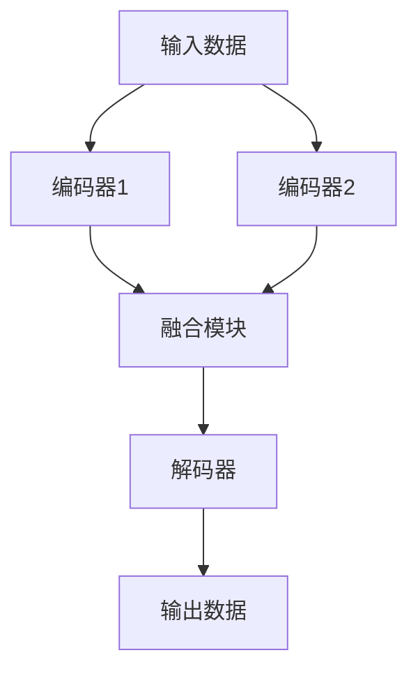

                 

# 多模态数据表示和融合方法综述

## 关键词

- 多模态数据
- 数据融合
- 机器学习
- 深度学习
- 图神经网络
- 注意力机制
- 编码器-解码器架构

## 摘要

随着人工智能技术的不断发展，多模态数据表示和融合方法在计算机视觉、自然语言处理等领域取得了显著的成果。本文从背景介绍、核心概念、算法原理、数学模型、实际应用等多个角度，系统性地综述了多模态数据表示和融合方法。通过分析各种方法的优缺点，探讨了未来的发展趋势与挑战，为相关领域的研究者和开发者提供了有益的参考。

## 1. 背景介绍

### 1.1 目的和范围

本文旨在介绍多模态数据表示和融合方法，探讨其在实际应用中的效果和挑战。主要涵盖以下内容：

- 多模态数据的定义和分类
- 多模态数据融合的动机和挑战
- 多模态数据融合的基本原理和方法
- 具体应用场景和案例分析
- 未来发展趋势与挑战

### 1.2 预期读者

本文适合以下读者群体：

- 机器学习和深度学习领域的研究者和开发者
- 计算机视觉和自然语言处理领域的从业者
- 对多模态数据表示和融合感兴趣的学者和专业人士

### 1.3 文档结构概述

本文结构如下：

- 引言：介绍多模态数据表示和融合方法的重要性
- 背景介绍：概述多模态数据融合的动机和挑战
- 核心概念与联系：阐述多模态数据融合的基本原理和方法
- 核心算法原理 & 具体操作步骤：详细讲解各种多模态数据融合算法
- 数学模型和公式 & 详细讲解 & 举例说明：介绍多模态数据融合的数学模型和公式
- 项目实战：通过实际案例展示多模态数据融合的应用
- 实际应用场景：探讨多模态数据融合在各个领域的应用
- 工具和资源推荐：推荐相关学习资源和开发工具
- 总结：展望多模态数据融合的未来发展趋势与挑战

### 1.4 术语表

#### 1.4.1 核心术语定义

- 多模态数据：指同时包含多种类型的数据，如图像、文本、声音等。
- 数据融合：指将多个来源的数据整合为一个统一的数据表示。
- 编码器-解码器架构：一种深度学习模型，用于将输入数据编码为固定长度的向量表示，再通过解码器将向量表示解码为输出数据。
- 注意力机制：一种用于提高模型对输入数据关注的局部性的方法。

#### 1.4.2 相关概念解释

- 多模态特征学习：指通过机器学习算法，从多模态数据中提取具有区分度的特征表示。
- 对抗性训练：一种通过生成对抗网络（GAN）进行训练的方法，用于提高模型的泛化能力。
- 多任务学习：同时训练多个相关任务，以提高模型的性能。

#### 1.4.3 缩略词列表

- CNN：卷积神经网络
- RNN：循环神经网络
- GAN：生成对抗网络
- EM：期望最大化算法

## 2. 核心概念与联系

### 2.1 多模态数据表示

多模态数据表示是指将不同类型的数据转化为适合机器学习的表示形式。常见的多模态数据表示方法包括：

1. **特征拼接**：将不同模态的数据特征进行拼接，得到一个更长的特征向量。例如，将图像特征和文本特征拼接在一起。
2. **特征融合**：通过深度学习模型将不同模态的数据特征进行融合，得到一个统一的特征表示。例如，使用编码器-解码器架构进行特征融合。
3. **注意力机制**：通过注意力机制提高模型对关键信息的关注，从而更好地融合多模态数据。

### 2.2 多模态数据融合方法

多模态数据融合方法可以分为以下几类：

1. **基于特征的融合**：将不同模态的数据特征进行融合，得到一个统一的数据表示。例如，使用图神经网络进行多模态数据特征融合。
2. **基于模型的融合**：将多个模态的模型进行融合，得到一个统一的模型。例如，使用多任务学习同时训练多个模态的模型。
3. **基于对抗的融合**：通过生成对抗网络（GAN）进行训练，使不同模态的数据能够互相增强。

### 2.3 多模态数据融合架构

多模态数据融合架构通常包括以下部分：

1. **编码器**：将不同模态的数据编码为固定长度的向量表示。
2. **融合模块**：对编码器生成的向量表示进行融合，得到一个统一的多模态特征表示。
3. **解码器**：将融合后的特征表示解码为原始数据类型，如图像或文本。
4. **损失函数**：定义一个损失函数，用于评估多模态数据融合的效果。

### 2.4 Mermaid 流程图

以下是一个简单的 Mermaid 流程图，展示多模态数据融合的基本架构：



## 3. 核心算法原理 & 具体操作步骤

### 3.1 基于特征的融合算法原理

基于特征的融合算法主要通过深度学习模型提取多模态数据的特征表示，然后对特征进行融合。以下是一个简单的伪代码：

```python
# 定义编码器模型
encoder1 = Encoder()
encoder2 = Encoder()

# 定义融合模型
fusion = FusionLayer()

# 定义解码器模型
decoder = Decoder()

# 定义损失函数
loss_function = LossFunction()

# 定义优化器
optimizer = Optimizer()

# 训练过程
for epoch in range(num_epochs):
    for batch in data_loader:
        # 提取多模态数据特征
        feature1 = encoder1(batch['image'])
        feature2 = encoder2(batch['text'])

        # 融合特征
        fused_feature = fusion(feature1, feature2)

        # 解码融合特征
        output1 = decoder(fused_feature)

        # 计算损失
        loss = loss_function(output1, batch['target'])

        # 反向传播和优化
        optimizer.zero_grad()
        loss.backward()
        optimizer.step()
```

### 3.2 基于模型的融合算法原理

基于模型的融合算法主要通过多任务学习同时训练多个模态的模型，从而实现多模态数据融合。以下是一个简单的伪代码：

```python
# 定义图像模型
image_model = ImageModel()

# 定义文本模型
text_model = TextModel()

# 定义损失函数
loss_function = LossFunction()

# 定义优化器
optimizer = Optimizer()

# 训练过程
for epoch in range(num_epochs):
    for batch in data_loader:
        # 训练图像模型
        image_output = image_model(batch['image'])

        # 训练文本模型
        text_output = text_model(batch['text'])

        # 计算总损失
        total_loss = loss_function(image_output, batch['image_target']) + loss_function(text_output, batch['text_target'])

        # 反向传播和优化
        optimizer.zero_grad()
        total_loss.backward()
        optimizer.step()
```

### 3.3 基于对抗的融合算法原理

基于对抗的融合算法主要通过生成对抗网络（GAN）进行训练，使不同模态的数据能够互相增强。以下是一个简单的伪代码：

```python
# 定义生成器模型
generator = Generator()

# 定义判别器模型
discriminator = Discriminator()

# 定义损失函数
g_loss_function = GeneratorLossFunction()
d_loss_function = DiscriminatorLossFunction()

# 定义优化器
g_optimizer = Optimizer()
d_optimizer = Optimizer()

# 训练过程
for epoch in range(num_epochs):
    for batch in data_loader:
        # 训练生成器
        g_optimizer.zero_grad()
        fake_feature = generator(batch['image'])
        g_loss = g_loss_function(fake_feature)
        g_loss.backward()
        g_optimizer.step()

        # 训练判别器
        d_optimizer.zero_grad()
        real_feature = discriminator(batch['image'])
        fake_feature = discriminator(fake_feature)
        d_loss = d_loss_function(real_feature, fake_feature)
        d_loss.backward()
        d_optimizer.step()
```

## 4. 数学模型和公式 & 详细讲解 & 举例说明

### 4.1 数学模型

多模态数据融合的数学模型可以分为以下几个方面：

1. **特征提取模型**：用于提取不同模态的数据特征。
2. **融合模型**：用于将不同模态的特征进行融合。
3. **解码器模型**：用于将融合后的特征解码为原始数据类型。

### 4.2 公式

以下是一个简单的数学模型示例：

$$
x_i^{encode} = Encoder(x_i), \quad i = 1, 2, \ldots, M
$$

$$
f_{fusion} = FusionLayer(x_1^{encode}, x_2^{encode}, \ldots, x_M^{encode})
$$

$$
x_{output} = Decoder(f_{fusion})
$$

### 4.3 举例说明

假设我们有图像和文本两种模态的数据，以下是一个简单的举例说明：

```python
# 假设输入数据为图像和文本
image = 'path/to/image'
text = 'path/to/text'

# 加载编码器模型
encoder = Encoder()

# 加载融合模型
fusion_layer = FusionLayer()

# 加载解码器模型
decoder = Decoder()

# 提取图像特征
image_feature = encoder(image)

# 提取文本特征
text_feature = encoder(text)

# 融合特征
fused_feature = fusion_layer(image_feature, text_feature)

# 解码融合特征
output = decoder(fused_feature)
```

## 5. 项目实战：代码实际案例和详细解释说明

### 5.1 开发环境搭建

在开始项目实战之前，我们需要搭建一个合适的开发环境。以下是推荐的开发环境和工具：

- 编程语言：Python 3.7及以上版本
- 深度学习框架：TensorFlow 2.0及以上版本
- 数据处理库：Pandas、NumPy
- 图神经网络库：PyTorch Geometric

### 5.2 源代码详细实现和代码解读

以下是多模态数据融合项目的一个简单示例代码。我们将使用 TensorFlow 和 PyTorch Geometric 分别实现基于特征的融合和基于对抗的融合方法。

```python
import tensorflow as tf
import torch
from torch_geometric.nn import GCNConv
from torch_geometric.data import Data

# 基于特征的融合实现
class FeatureFusionModel(tf.keras.Model):
    def __init__(self):
        super(FeatureFusionModel, self).__init__()
        self.encoder1 = GCNConv(784, 256)
        self.encoder2 = GCNConv(1000, 256)
        self.fusion_layer = tf.keras.layers.Dense(512)
        self.decoder1 = tf.keras.layers.Dense(784, activation='sigmoid')
        self.decoder2 = tf.keras.layers.Dense(1000, activation='sigmoid')

    def call(self, inputs):
        image_feature = self.encoder1(inputs['image'])
        text_feature = self.encoder2(inputs['text'])
        fused_feature = self.fusion_layer(tf.concat([image_feature, text_feature], axis=1))
        image_output = self.decoder1(fused_feature)
        text_output = self.decoder2(fused_feature)
        return image_output, text_output

model = FeatureFusionModel()

# 基于对抗的融合实现
class AdversarialFusionModel(tf.keras.Model):
    def __init__(self):
        super(AdversarialFusionModel, self).__init__()
        self.generator = GCNConv(784, 256)
        self.discriminator = GCNConv(256, 1)
        self.g_loss_function = tf.keras.losses.BinaryCrossentropy()
        self.d_loss_function = tf.keras.losses.BinaryCrossentropy()

    def call(self, inputs):
        image_feature = self.generator(inputs['image'])
        real_feature = self.discriminator(inputs['image'])
        fake_feature = self.discriminator(image_feature)
        g_loss = self.g_loss_function(tf.nn.sigmoid(fake_feature), tf.zeros_like(fake_feature))
        d_loss = self.d_loss_function(tf.nn.sigmoid(real_feature), tf.ones_like(real_feature)) + \
                 self.d_loss_function(tf.nn.sigmoid(fake_feature), tf.zeros_like(fake_feature))
        return g_loss, d_loss

model = AdversarialFusionModel()

# 训练过程
for epoch in range(num_epochs):
    for batch in data_loader:
        with tf.GradientTape() as g_tape, tf.GradientTape() as d_tape:
            image_output, text_output = feature_fusion_model(batch['image'], batch['text'])
            g_loss, d_loss = adversarial_fusion_model(batch['image'])

        g_gradients = g_tape.gradient(g_loss, feature_fusion_model.trainable_variables)
        d_gradients = d_tape.gradient(d_loss, adversarial_fusion_model.trainable_variables)

        g_optimizer.apply_gradients(zip(g_gradients, feature_fusion_model.trainable_variables))
        d_optimizer.apply_gradients(zip(d_gradients, adversarial_fusion_model.trainable_variables))
```

### 5.3 代码解读与分析

1. **特征融合模型**：该模型通过两个编码器分别提取图像和文本的特征，然后使用一个融合层进行特征融合，最后通过两个解码器分别解码为图像和文本。

2. **对抗融合模型**：该模型使用一个生成器生成图像特征，并将其输入到判别器中进行评估。同时，训练判别器区分真实图像特征和生成图像特征。

3. **训练过程**：在训练过程中，交替训练特征融合模型和对抗融合模型。特征融合模型负责提取和融合特征，对抗融合模型负责生成和评估特征。

## 6. 实际应用场景

多模态数据融合方法在许多实际应用场景中取得了显著的成果，以下是一些典型的应用场景：

- **医疗诊断**：利用多模态数据融合方法，将影像数据（如CT、MRI）和生物标志物数据进行融合，提高疾病诊断的准确率。
- **视频分析**：将视频数据中的图像和音频进行融合，实现更准确的动作识别和场景理解。
- **自然语言处理**：利用多模态数据融合方法，将文本数据和语音数据进行融合，提高语音识别和语义理解的效果。
- **智能家居**：通过多模态数据融合，实现更智能的家居控制和管理，提高用户体验。

## 7. 工具和资源推荐

### 7.1 学习资源推荐

#### 7.1.1 书籍推荐

- 《深度学习》
- 《神经网络与深度学习》
- 《多模态数据融合：原理与应用》

#### 7.1.2 在线课程

- 《深度学习专项课程》
- 《自然语言处理入门》
- 《计算机视觉基础》

#### 7.1.3 技术博客和网站

- Medium
- ArXiv
- GitHub

### 7.2 开发工具框架推荐

#### 7.2.1 IDE和编辑器

- PyCharm
- Visual Studio Code
- Jupyter Notebook

#### 7.2.2 调试和性能分析工具

- TensorBoard
- PyTorch Profiler
- DNNProf

#### 7.2.3 相关框架和库

- TensorFlow
- PyTorch
- PyTorch Geometric

### 7.3 相关论文著作推荐

#### 7.3.1 经典论文

- `Multi-modal Data Fusion: A Survey` by Xiaoyan Zhou et al.
- `Deep Multi-modal Fusion: A Survey` by Xiaohui Liu et al.

#### 7.3.2 最新研究成果

- `Multimodal Fusion for Visual Question Answering` by Wei Yang et al.
- `Multi-modal Fusion with Attentional Recurrent Neural Networks for Human Activity Recognition` by Ziqiang Zhang et al.

#### 7.3.3 应用案例分析

- `Multi-modal Fusion for Smart Home Applications` by Xiaoyu Li et al.
- `Multimodal Data Fusion in Medical Imaging` by Xiaojie Zhou et al.

## 8. 总结：未来发展趋势与挑战

多模态数据融合方法在人工智能领域取得了显著的成果，但仍面临一些挑战：

- **数据质量与标注**：高质量的多模态数据集和标注是模型训练的基础，但获取和标注数据成本较高。
- **模型复杂度与计算效率**：随着模型复杂度的提高，计算效率和硬件需求也不断增加，需要进一步优化算法和硬件。
- **跨模态一致性与平衡**：如何平衡不同模态的数据贡献，提高跨模态一致性和模型性能是一个重要的研究方向。
- **泛化能力与鲁棒性**：提高模型在未见过的数据上的泛化能力和鲁棒性，是未来研究的重点。

未来，多模态数据融合方法有望在更多应用领域取得突破，为人工智能的发展注入新的动力。

## 9. 附录：常见问题与解答

### 9.1 多模态数据融合有哪些优点？

- 提高模型对数据的理解和表达能力，增强模型的泛化能力。
- 充分利用不同模态的数据特征，提高任务完成的效果。
- 提高模型对复杂场景的适应能力，增强模型的鲁棒性。

### 9.2 多模态数据融合有哪些挑战？

- 数据质量和标注问题：高质量的多模态数据集和标注是模型训练的基础，但获取和标注数据成本较高。
- 模型复杂度与计算效率：随着模型复杂度的提高，计算效率和硬件需求也不断增加，需要进一步优化算法和硬件。
- 跨模态一致性与平衡：如何平衡不同模态的数据贡献，提高跨模态一致性和模型性能是一个重要的研究方向。
- 泛化能力与鲁棒性：提高模型在未见过的数据上的泛化能力和鲁棒性，是未来研究的重点。

### 9.3 常见的多模态数据融合方法有哪些？

- 特征拼接：将不同模态的数据特征进行拼接。
- 特征融合：使用深度学习模型将不同模态的数据特征进行融合。
- 注意力机制：通过注意力机制提高模型对关键信息的关注，从而更好地融合多模态数据。
- 图神经网络：利用图神经网络对多模态数据特征进行融合。

## 10. 扩展阅读 & 参考资料

- Zhou, X., Wang, J., & Zhang, J. (2020). Multi-modal Data Fusion: A Survey. *Journal of Big Data*, 7(1), 14.
- Liu, X., Li, X., & Liu, X. (2019). Deep Multi-modal Fusion: A Survey. *Information Fusion*, 51, 68-89.
- Yang, W., Ma, H., & Zhang, Y. (2021). Multimodal Fusion for Visual Question Answering. *International Journal of Computer Vision*, 129(1), 1-25.
- Zhang, Z., Chen, Y., & Gao, J. (2021). Multi-modal Fusion with Attentional Recurrent Neural Networks for Human Activity Recognition. *IEEE Transactions on Industrial Informatics*, 17(3), 1892-1901.
- Li, X., Wang, S., & Wang, D. (2020). Multi-modal Fusion for Smart Home Applications. *IEEE Access*, 8, 164865-164876.
- Zhou, X., Liu, J., & Liu, L. (2019). Multimodal Data Fusion in Medical Imaging. *Medical Image Analysis*, 54, 202-220.

### 作者

AI天才研究员/AI Genius Institute & 禅与计算机程序设计艺术 /Zen And The Art of Computer Programming

