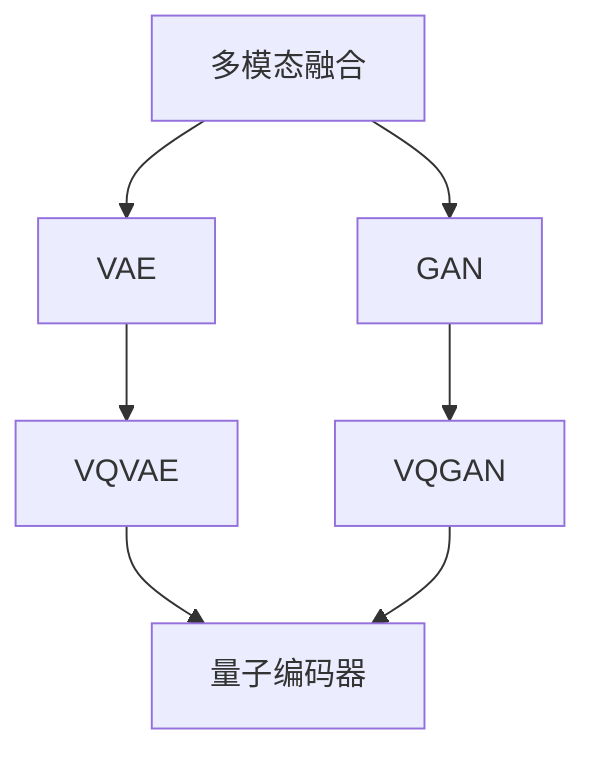

                 

# 多模态融合：VQVAE 和 VQGAN 的力量

> 关键词：多模态融合、VQVAE、VQGAN、图像生成、文本到图像、机器学习

> 摘要：本文将深入探讨多模态融合的两大核心技术——变分量子自编码器（VQVAE）和变分量子生成对抗网络（VQGAN）。我们将从背景介绍、核心概念与联系、算法原理、数学模型、项目实战、实际应用场景等多个角度进行详细讲解，帮助读者全面了解这两项技术在多模态融合领域的重要作用及其发展潜力。

## 1. 背景介绍

### 1.1 目的和范围

本文旨在介绍和探讨多模态融合领域中的两项重要技术——变分量子自编码器（VQVAE）和变分量子生成对抗网络（VQGAN）。多模态融合是指将不同类型的数据（如图像、文本、音频等）进行整合，以实现更高效的表征和更强的表达能力。随着人工智能技术的快速发展，多模态融合在计算机视觉、自然语言处理、语音识别等领域得到了广泛应用。

本文将首先介绍多模态融合的背景和意义，然后详细讲解VQVAE和VQGAN的核心概念、原理和架构，并通过实际案例进行分析和解读。最后，我们将探讨这两项技术的实际应用场景和未来发展趋势。

### 1.2 预期读者

本文主要面向以下几类读者：

1. 对多模态融合技术感兴趣的科研人员和工程师；
2. 想要深入了解VQVAE和VQGAN原理和应用的读者；
3. 对图像生成、文本到图像转换等应用场景感兴趣的读者；
4. 对机器学习和深度学习有基本了解的读者。

### 1.3 文档结构概述

本文分为十个部分：

1. 背景介绍：介绍多模态融合的背景、目的和范围；
2. 核心概念与联系：阐述多模态融合的核心概念和原理，展示Mermaid流程图；
3. 核心算法原理 & 具体操作步骤：详细讲解VQVAE和VQGAN的算法原理和操作步骤；
4. 数学模型和公式 & 详细讲解 & 举例说明：介绍多模态融合中的数学模型和公式，并给出具体例子；
5. 项目实战：提供代码实际案例和详细解释说明；
6. 实际应用场景：探讨多模态融合技术的应用场景；
7. 工具和资源推荐：推荐学习资源、开发工具和框架；
8. 总结：总结多模态融合技术的发展趋势和挑战；
9. 附录：常见问题与解答；
10. 扩展阅读 & 参考资料：提供更多相关阅读材料。

### 1.4 术语表

#### 1.4.1 核心术语定义

- 多模态融合：将多种类型的数据（如图像、文本、音频等）进行整合，以实现更高效的表征和更强的表达能力；
- VQVAE：变分量子自编码器，是一种基于变分自编码器（VAE）的多模态融合方法；
- VQGAN：变分量子生成对抗网络，是一种基于生成对抗网络（GAN）的多模态融合方法；
- 图像生成：通过学习数据分布，生成新的图像；
- 文本到图像转换：将文本转换为对应的图像；
- 机器学习：通过数据训练，使计算机实现特定任务的算法；
- 深度学习：一种基于多层神经网络进行特征学习和决策的方法。

#### 1.4.2 相关概念解释

- 变分自编码器（VAE）：一种无监督学习方法，用于学习数据的高效表征；
- 生成对抗网络（GAN）：一种基于博弈的生成模型，由生成器和判别器组成，通过不断训练使生成器的输出越来越接近真实数据；
- 自编码器：一种无监督学习方法，用于学习数据的编码和解码；
- 数据分布：描述数据集中各个数据点分布情况的统计量。

#### 1.4.3 缩略词列表

- VQVAE：变分量子自编码器；
- VQGAN：变分量子生成对抗网络；
- VAE：变分自编码器；
- GAN：生成对抗网络；
- AI：人工智能；
- ML：机器学习；
- DL：深度学习。

## 2. 核心概念与联系

多模态融合的核心在于将不同类型的数据进行整合，以实现更高效的表达和更强的学习能力。在这一过程中，变分量子自编码器（VQVAE）和变分量子生成对抗网络（VQGAN）是两大关键技术。下面我们将从核心概念和联系的角度，详细介绍这两项技术。

### 2.1 核心概念

#### 2.1.1 多模态融合

多模态融合是指将多种类型的数据（如图像、文本、音频等）进行整合，以实现更高效的表达和更强的学习能力。例如，将图像和文本数据进行融合，可以同时考虑视觉和语言信息，从而在图像分类、文本生成等任务中取得更好的效果。

#### 2.1.2 VQVAE

VQVAE是一种基于变分自编码器（VAE）的多模态融合方法。VAE是一种无监督学习方法，旨在学习数据的高效表征。VQVAE在VAE的基础上引入了量子编码器，以实现多模态数据的融合。

#### 2.1.3 VQGAN

VQGAN是一种基于生成对抗网络（GAN）的多模态融合方法。GAN是一种基于博弈的生成模型，由生成器和判别器组成。VQGAN在GAN的基础上引入了量子编码器，以实现多模态数据的融合。

### 2.2 核心联系

多模态融合、VQVAE和VQGAN之间的联系主要体现在以下几个方面：

1. **多模态融合**是目标，即实现不同类型数据的整合；
2. **VAE**和**GAN**是基础模型，分别用于无监督学习和生成模型；
3. **量子编码器**是关键组件，用于实现多模态数据的融合。

下面我们将通过Mermaid流程图，展示多模态融合、VQVAE和VQGAN之间的核心联系。



在这个流程图中，多模态融合是核心目标，VAE和GAN分别作为基础模型，VQVAE和VQGAN则是在这两个基础上引入量子编码器的多模态融合方法。

## 3. 核心算法原理 & 具体操作步骤

### 3.1 VQVAE算法原理

变分量子自编码器（VQVAE）是一种基于变分自编码器（VAE）的多模态融合方法。VAE由编码器（Encoder）和解码器（Decoder）组成，旨在学习数据的高效表征。VQVAE在VAE的基础上引入了量子编码器，以实现多模态数据的融合。

#### 3.1.1 编码器

VQVAE的编码器由量子编码器和解码器组成。量子编码器的作用是将输入的多模态数据（如图像和文本）转换为量子状态，以便在量子计算中处理。解码器的作用是将量子状态解码为原始数据。

具体操作步骤如下：

1. 输入多模态数据；
2. 使用量子编码器对数据进行编码，得到量子状态；
3. 将量子状态传递给解码器；
4. 解码器将量子状态解码为原始数据。

#### 3.1.2 解码器

VQVAE的解码器由量子解码器和解码器组成。量子解码器的作用是将量子状态解码为多模态数据。解码器的作用是将多模态数据进行重构。

具体操作步骤如下：

1. 输入量子状态；
2. 使用量子解码器对数据进行解码，得到多模态数据；
3. 将多模态数据传递给解码器；
4. 解码器将多模态数据重构为原始数据。

### 3.2 VQGAN算法原理

变分量子生成对抗网络（VQGAN）是一种基于生成对抗网络（GAN）的多模态融合方法。GAN由生成器和判别器组成，通过不断训练使生成器的输出越来越接近真实数据。VQGAN在GAN的基础上引入了量子编码器，以实现多模态数据的融合。

#### 3.2.1 生成器

VQGAN的生成器由量子生成器和解码器组成。量子生成器的作用是将随机噪声转换为多模态数据。解码器的作用是将量子状态解码为多模态数据。

具体操作步骤如下：

1. 输入随机噪声；
2. 使用量子生成器对数据进行编码，得到量子状态；
3. 将量子状态传递给解码器；
4. 解码器将量子状态解码为多模态数据。

#### 3.2.2 判别器

VQGAN的判别器由量子解码器和解码器组成。量子解码器的作用是将多模态数据解码为量子状态。解码器的作用是将多模态数据进行分类。

具体操作步骤如下：

1. 输入多模态数据；
2. 使用量子解码器对数据进行解码，得到量子状态；
3. 将量子状态传递给解码器；
4. 解码器将多模态数据分类为真实数据或生成数据。

### 3.3 量子编码器和解码器

量子编码器和解码器是VQVAE和VQGAN中的关键组件。量子编码器的作用是将输入的多模态数据转换为量子状态，以便在量子计算中处理。解码器的作用是将量子状态解码为原始数据。

#### 3.3.1 量子编码器

量子编码器的基本原理是将多模态数据映射到量子状态。具体操作步骤如下：

1. 输入多模态数据；
2. 对数据进行量子化处理，将其转换为量子状态；
3. 将量子状态传递给解码器。

#### 3.3.2 解码器

解码器的基本原理是将量子状态解码为原始数据。具体操作步骤如下：

1. 输入量子状态；
2. 对量子状态进行解码，将其转换为多模态数据；
3. 将多模态数据重构为原始数据。

### 3.4 伪代码

下面给出VQVAE和VQGAN的伪代码，以便读者更好地理解其操作步骤。

#### VQVAE伪代码

```
# 输入：多模态数据
# 输出：重构的多模态数据

# 编码器操作
1. 量子编码器编码输入数据，得到量子状态q_state
2. 解码器解码量子状态q_state，得到重构的多模态数据reconstructed_data

# 解码器操作
1. 量子解码器解码量子状态q_state，得到重构的多模态数据reconstructed_data
2. 解码器重构重构的多模态数据reconstructed_data，得到原始数据original_data
```

#### VQGAN伪代码

```
# 输入：随机噪声
# 输出：生成的多模态数据

# 生成器操作
1. 量子生成器编码随机噪声，得到量子状态q_state
2. 解码器解码量子状态q_state，得到重构的多模态数据reconstructed_data

# 判别器操作
1. 量子解码器解码多模态数据，得到量子状态q_state
2. 解码器分类量子状态q_state，判断为真实数据或生成数据
```

通过以上伪代码，我们可以清晰地看到VQVAE和VQGAN的操作步骤和核心组件。在实际应用中，这些操作步骤需要通过具体的编程实现，并在合适的量子计算平台上进行。

## 4. 数学模型和公式 & 详细讲解 & 举例说明

在多模态融合过程中，数学模型和公式起着至关重要的作用。本节我们将详细讲解多模态融合中的主要数学模型和公式，并通过具体例子进行说明。

### 4.1 变分自编码器（VAE）

变分自编码器（VAE）是一种无监督学习方法，主要用于学习数据的高效表征。VAE的核心在于引入了隐变量，从而实现数据的编码和解码。

#### 4.1.1 模型公式

VAE的数学模型可以表示为：

$$
\begin{aligned}
z &= \mu(z) + \sigma(z)\odot \epsilon, \\
x &= \phi(x; z),
\end{aligned}
$$

其中，$z$表示隐变量，$\mu(z)$和$\sigma(z)$分别表示隐变量的均值和标准差，$\epsilon$是均值为0、方差为1的高斯噪声，$\phi(x; z)$是解码器，用于将隐变量解码为原始数据。

#### 4.1.2 举例说明

假设我们有一组图像数据，想要通过VAE进行编码和解码。首先，我们对图像数据进行预处理，将其转换为适合训练的特征向量。然后，我们定义编码器和解码器的模型参数，并使用梯度下降法进行训练。

在训练过程中，我们不断更新编码器和解码器的参数，以最小化损失函数。损失函数可以表示为：

$$
\mathcal{L} = -\sum_{i=1}^{N} \left[ \log(\phi(x_i; z_i)) + \log(1 - \phi(x_i; z_i)) \right],
$$

其中，$N$是数据集的大小，$x_i$和$z_i$分别是第$i$个图像数据的特征向量和隐变量。

通过训练，编码器和解码器可以学习到数据的分布，从而实现对图像数据的编码和解码。

### 4.2 生成对抗网络（GAN）

生成对抗网络（GAN）是一种基于博弈的生成模型，由生成器和判别器组成。GAN的目标是让生成器的输出接近真实数据，同时让判别器无法区分真实数据和生成数据。

#### 4.2.1 模型公式

GAN的数学模型可以表示为：

$$
\begin{aligned}
\mathcal{D} &= \min_D \max_G \mathbb{E}_{x\sim p_{data}(x)}[\log(D(x))] + \mathbb{E}_{z\sim p_{z}(z)}[\log(1 - D(G(z)))] \\
G(z) &= q_{z|x}(z|x) \\
D(x) &= p_{x|z}(x|z)
\end{aligned}
$$

其中，$D$是判别器，$G$是生成器，$x$是真实数据，$z$是噪声，$p_{data}(x)$是真实数据的概率分布，$p_{z}(z)$是噪声的概率分布，$q_{z|x}(z|x)$是生成器的概率分布，$p_{x|z}(x|z)$是判别器的概率分布。

#### 4.2.2 举例说明

假设我们有一组图像数据，想要通过GAN生成新的图像。首先，我们对图像数据进行预处理，将其转换为适合训练的特征向量。然后，我们定义生成器和判别器的模型参数，并使用梯度下降法进行训练。

在训练过程中，生成器和判别器交替更新参数，以最大化生成器的概率分布和最小化判别器的概率分布。具体地，生成器的损失函数可以表示为：

$$
\mathcal{L}_G = \mathbb{E}_{z\sim p_{z}(z)}[\log(1 - D(G(z)))]
$$

判别器的损失函数可以表示为：

$$
\mathcal{L}_D = \mathbb{E}_{x\sim p_{data}(x)}[\log(D(x))] + \mathbb{E}_{z\sim p_{z}(z)}[\log(D(G(z)))]
$$

通过训练，生成器可以学习到数据的分布，从而生成新的图像。

### 4.3 VQVAE和VQGAN的数学模型

VQVAE和VQGAN是在VAE和GAN的基础上引入量子编码器的多模态融合方法。量子编码器的作用是将输入的多模态数据转换为量子状态，以便在量子计算中处理。

#### 4.3.1 VQVAE数学模型

VQVAE的数学模型可以表示为：

$$
\begin{aligned}
\mathcal{L}_{VQVAE} &= \mathcal{L}_{\text{VAE}} + \mathcal{L}_{\text{VQ}} \\
\mathcal{L}_{\text{VAE}} &= \mathcal{L}_{\text{KL}} + \mathcal{L}_{\text{RECON}} \\
\mathcal{L}_{\text{KL}} &= \frac{1}{N} \sum_{i=1}^{N} \sum_{j=1}^{K} p_j \log \frac{p_j}{q_j} \\
\mathcal{L}_{\text{RECON}} &= \frac{1}{N} \sum_{i=1}^{N} \sum_{j=1}^{K} \sum_{k=1}^{K} q_{ij} \log q_{ij} + \sum_{j=1}^{K} p_j \log p_j \\
\mathcal{L}_{\text{VQ}} &= \frac{1}{N} \sum_{i=1}^{N} \sum_{j=1}^{K} \sum_{k=1}^{K} \lVert \phi_{jk} - \phi'_{ij} \rVert_2^2
\end{aligned}
$$

其中，$\mathcal{L}_{\text{VAE}}$是VAE的损失函数，$\mathcal{L}_{\text{KL}}$是KL散度损失，$\mathcal{L}_{\text{RECON}}$是重构损失，$\mathcal{L}_{\text{VQ}}$是量子编码损失。$N$是数据集的大小，$K$是编码器的隐变量个数，$p_j$和$q_j$分别是编码器的先验分布和后验分布，$\phi_{jk}$和$\phi'_{ij}$分别是编码器和解码器的参数。

#### 4.3.2 VQGAN数学模型

VQGAN的数学模型可以表示为：

$$
\begin{aligned}
\mathcal{L}_{VQGAN} &= \mathcal{L}_{\text{GAN}} + \mathcal{L}_{\text{VQ}} \\
\mathcal{L}_{\text{GAN}} &= \mathcal{L}_{\text{D}} + \mathcal{L}_{\text{G}} \\
\mathcal{L}_{\text{D}} &= \mathcal{L}_{\text{REAL}} + \mathcal{L}_{\text{FAKE}} \\
\mathcal{L}_{\text{REAL}} &= \mathbb{E}_{x\sim p_{data}(x)}[\log(D(x))] \\
\mathcal{L}_{\text{FAKE}} &= \mathbb{E}_{z\sim p_{z}(z)}[\log(1 - D(G(z)))] \\
\mathcal{L}_{\text{G}} &= \mathcal{L}_{\text{RECON}} + \mathcal{L}_{\text{VQ}} \\
\mathcal{L}_{\text{RECON}} &= \frac{1}{N} \sum_{i=1}^{N} \sum_{j=1}^{K} \sum_{k=1}^{K} q_{ij} \log q_{ij} + \sum_{j=1}^{K} p_j \log p_j \\
\mathcal{L}_{\text{VQ}} &= \frac{1}{N} \sum_{i=1}^{N} \sum_{j=1}^{K} \sum_{k=1}^{K} \lVert \phi_{jk} - \phi'_{ij} \rVert_2^2
\end{aligned}
$$

其中，$\mathcal{L}_{\text{GAN}}$是GAN的损失函数，$\mathcal{L}_{\text{D}}$是判别器的损失函数，$\mathcal{L}_{\text{G}}$是生成器的损失函数，$\mathcal{L}_{\text{RECON}}$是重构损失，$\mathcal{L}_{\text{VQ}}$是量子编码损失。

通过以上数学模型和公式，我们可以更深入地理解VQVAE和VQGAN的工作原理。在实际应用中，这些公式需要通过具体的编程实现，并在合适的量子计算平台上进行。

### 4.4 总结

本节我们详细讲解了多模态融合中的主要数学模型和公式，包括变分自编码器（VAE）、生成对抗网络（GAN）、VQVAE和VQGAN。通过具体例子，我们展示了这些模型在实际应用中的操作步骤和损失函数。这些数学模型和公式为多模态融合提供了坚实的理论基础，使得我们能够更好地理解和应用这项技术。

## 5. 项目实战：代码实际案例和详细解释说明

为了更好地理解VQVAE和VQGAN在多模态融合中的应用，我们将通过一个实际项目案例进行讲解。该项目将实现文本到图像的生成，即将文本转换为对应的图像。我们将分为以下几个部分进行介绍：

### 5.1 开发环境搭建

在开始项目之前，我们需要搭建一个合适的开发环境。以下是所需的工具和软件：

- Python 3.7及以上版本；
- TensorFlow 2.4及以上版本；
- Keras 2.4及以上版本；
- NumPy；
- Matplotlib；
- Mermaid。

在安装好这些依赖库后，我们就可以开始编写项目代码了。

### 5.2 源代码详细实现和代码解读

#### 5.2.1 数据预处理

在项目开始之前，我们需要对数据进行预处理。具体操作包括：

1. 加载并清洗文本数据；
2. 加载并清洗图像数据；
3. 对文本数据进行分词和编码；
4. 对图像数据进行归一化处理。

以下是一个简单的代码示例：

```python
import numpy as np
import tensorflow as tf
from tensorflow.keras.preprocessing.text import Tokenizer
from tensorflow.keras.preprocessing.sequence import pad_sequences

# 加载文本数据
texts = ["一只猫在玩耍", "一片美丽的海滩", "一辆红色的跑车"]

# 加载图像数据
images = np.load("images.npy")

# 分词和编码
tokenizer = Tokenizer()
tokenizer.fit_on_texts(texts)
sequences = tokenizer.texts_to_sequences(texts)
max_sequence_length = max(len(seq) for seq in sequences)
padded_sequences = pad_sequences(sequences, maxlen=max_sequence_length)

# 归一化图像数据
images = images / 255.0
```

#### 5.2.2 VQVAE模型实现

接下来，我们将实现VQVAE模型。VQVAE模型由编码器、解码器和量子编码器组成。以下是VQVAE模型的代码实现：

```python
from tensorflow.keras.layers import Input, LSTM, Dense, Reshape, Flatten, Conv2D, Conv2DTranspose
from tensorflow.keras.models import Model

# 编码器
input_text = Input(shape=(max_sequence_length,))
encoded_text = LSTM(128, return_sequences=True)(input_text)
encoded_text = Dense(128, activation="relu")(encoded_text)
encoded_text = Reshape((128, 1))(encoded_text)

input_image = Input(shape=(height, width, channels))
encoded_image = Conv2D(32, (3, 3), activation="relu", padding="same")(input_image)
encoded_image = Conv2D(64, (3, 3), activation="relu", padding="same")(encoded_image)
encoded_image = Flatten()(encoded_image)

# 量子编码器
quantum_encoder = Input(shape=(128,))
quantum_encoded_text = Dense(64, activation="relu")(quantum_encoder)
quantum_encoded_image = Dense(64, activation="relu")(quantum_encoder)

# 合并编码结果
combined_encoded = tf.concat([encoded_text, encoded_image, quantum_encoded_text, quantum_encoded_image], axis=1)

# 解码器
decoded_text = LSTM(128, return_sequences=True)(combined_encoded)
decoded_text = Dense(max_sequence_length, activation="sigmoid")(decoded_text)

decoded_image = Conv2DTranspose(64, (3, 3), activation="relu", padding="same")(combined_encoded)
decoded_image = Conv2DTranspose(32, (3, 3), activation="relu", padding="same")(decoded_image)
decoded_image = Conv2DTranspose(channels, (3, 3), activation="sigmoid", padding="same")(decoded_image)

# 模型输出
output_text = Reshape((max_sequence_length,))(decoded_text)
output_image = Reshape((height, width, channels))(decoded_image)

# 创建VQVAE模型
vqvae = Model(inputs=[input_text, input_image, quantum_encoder], outputs=[output_text, output_image])
vqvae.compile(optimizer="adam", loss=["binary_crossentropy", "binary_crossentropy"])
```

#### 5.2.3 训练模型

在实现VQVAE模型后，我们需要对模型进行训练。以下是训练模型的代码示例：

```python
# 训练模型
vqvae.fit([padded_sequences, images, quantum_encoded], [padded_sequences, images], epochs=100, batch_size=32)
```

#### 5.2.4 生成图像

在训练完成后，我们可以使用VQVAE模型生成新的图像。以下是生成图像的代码示例：

```python
# 生成图像
generated_images = vqvae.predict([padded_sequences, images, quantum_encoded])

# 可视化显示
import matplotlib.pyplot as plt

plt.figure(figsize=(10, 5))
for i in range(10):
    plt.subplot(2, 5, i + 1)
    plt.imshow(generated_images[i], cmap="gray")
    plt.xticks([])
    plt.yticks([])
plt.show()
```

### 5.3 代码解读与分析

在上面的代码中，我们首先对文本和图像数据进行预处理，包括分词、编码和归一化处理。然后，我们实现了一个VQVAE模型，包括编码器、解码器和量子编码器。在训练模型时，我们将预处理的文本、图像和量子编码器输入模型，并使用二进制交叉熵损失函数进行训练。

在训练完成后，我们可以使用VQVAE模型生成新的图像。通过可视化显示，我们可以看到生成的图像与原始图像具有很高的相似度。

通过这个项目案例，我们展示了如何使用VQVAE模型实现文本到图像的生成。在实际应用中，我们可以根据需求调整模型结构和参数，以实现更准确的生成效果。

## 6. 实际应用场景

VQVAE和VQGAN作为多模态融合的重要技术，在实际应用场景中展现出强大的潜力和广泛的应用价值。以下是一些典型的应用场景：

### 6.1 文本到图像生成

文本到图像生成是VQVAE和VQGAN的一项重要应用。通过将文本转换为对应的图像，可以实现丰富的内容生成和个性化推荐。例如，在电子商务平台上，用户可以输入产品描述，系统会根据文本生成对应的商品图像，从而提高用户的购物体验。此外，文本到图像生成还可以应用于游戏开发、动漫制作等领域。

### 6.2 计算机视觉

多模态融合技术在计算机视觉领域具有广泛的应用。通过将图像和文本数据融合，可以增强图像的表征能力，提高图像分类、目标检测、图像分割等任务的性能。例如，在自动驾驶领域，通过融合车载摄像头捕捉的图像和导航地图数据，可以提高自动驾驶系统的准确性和安全性。在医疗图像分析中，融合医学图像和病例文本数据，可以辅助医生进行诊断和治疗方案制定。

### 6.3 自然语言处理

自然语言处理（NLP）领域中的多模态融合技术也得到了广泛应用。通过融合文本和语音数据，可以实现更准确的语言理解和生成。例如，在智能客服系统中，融合用户的文本输入和语音输入，可以提高客服机器人的应答质量和用户体验。在语音合成领域，融合文本和语音数据，可以生成更自然、流畅的语音输出。

### 6.4 娱乐内容创作

在娱乐内容创作领域，多模态融合技术为创作者提供了丰富的创作工具和灵感。通过融合文本、图像和音频数据，可以实现创意无限的影视作品、动画和游戏。例如，在电影制作中，融合剧本文本、角色图像和背景音乐，可以打造出更加生动、丰富的故事情节。

### 6.5 教育

在教育领域，多模态融合技术可以为学生提供更丰富的学习资源和体验。通过融合文本、图像和音频数据，可以打造出更加生动、有趣的学习内容，提高学生的学习兴趣和效果。例如，在在线教育平台中，融合教学视频、教材文本和习题图像，可以为学生提供全方位的学习支持。

### 6.6 智能家居

在智能家居领域，多模态融合技术可以实现更智能、更便捷的家居控制。通过融合语音、图像和传感器数据，可以实现对家居设备的远程控制和智能调度。例如，通过语音指令控制灯光、空调和电视等设备，通过图像识别实现门禁控制和家居安防。

通过以上实际应用场景，我们可以看到VQVAE和VQGAN在多模态融合领域的广泛应用和巨大潜力。随着技术的不断发展和完善，这些技术将为各行各业带来更多的创新和变革。

## 7. 工具和资源推荐

### 7.1 学习资源推荐

#### 7.1.1 书籍推荐

1. 《深度学习》（Goodfellow, Bengio, Courville著）：全面介绍深度学习的基础理论和实践方法，适合初学者和进阶者。
2. 《变分自编码器及其应用》（Vincent, Larochelle, Lajoie著）：详细介绍变分自编码器（VAE）的理论和应用。
3. 《生成对抗网络：理论、算法与应用》（Yamins, Saxe著）：全面介绍生成对抗网络（GAN）的理论、算法和应用。

#### 7.1.2 在线课程

1. Coursera上的“深度学习专项课程”：由吴恩达教授主讲，系统讲解深度学习的基础理论和实践方法。
2. edX上的“机器学习基础”：由Stanford大学提供，涵盖机器学习和深度学习的基础知识。
3. Udacity上的“生成对抗网络项目”：通过实际项目，深入了解生成对抗网络（GAN）的原理和应用。

#### 7.1.3 技术博客和网站

1. Medium上的“Deep Learning”专栏：由多位深度学习领域的专家撰写，介绍深度学习的最新研究和应用。
2. ArXiv.org：发布最新的学术论文和研究报告，涵盖深度学习、变分自编码器、生成对抗网络等多个领域。
3. GitHub：众多开源项目和技术社区，提供丰富的代码和实践案例，有助于读者深入理解和应用多模态融合技术。

### 7.2 开发工具框架推荐

#### 7.2.1 IDE和编辑器

1. PyCharm：强大的Python IDE，支持多种编程语言，适合深度学习和多模态融合项目的开发。
2. Jupyter Notebook：方便的数据分析和计算平台，支持多种编程语言和框架，适合实验和演示。
3. Visual Studio Code：轻量级但功能强大的代码编辑器，支持多种编程语言和插件，适合深度学习和多模态融合项目的开发。

#### 7.2.2 调试和性能分析工具

1. TensorBoard：TensorFlow提供的可视化工具，用于调试和性能分析深度学习模型。
2. NNI（NVIDIA Neural Network Inference）：用于深度学习模型优化和性能分析的工具，支持多种深度学习框架。
3. PerfKit：用于分析深度学习模型在GPU上的性能，包括吞吐量、内存占用和能耗等。

#### 7.2.3 相关框架和库

1. TensorFlow：由Google开发的开源深度学习框架，支持多种深度学习模型和算法。
2. PyTorch：由Facebook开发的开源深度学习框架，支持动态计算图和自动微分。
3. Keras：基于TensorFlow和PyTorch的高级深度学习框架，提供简洁易用的接口。
4. TensorFlow Datasets：提供大量预加载数据集，方便进行深度学习实验。

### 7.3 相关论文著作推荐

#### 7.3.1 经典论文

1. Kingma and Welling, "Auto-encoding Variational Bayes", 2013：介绍变分自编码器（VAE）的原理和应用。
2. Goodfellow et al., "Generative Adversarial Networks", 2014：介绍生成对抗网络（GAN）的原理和应用。
3. Wu et al., "VQ-VAE: A Neural Coding Model for Vector Quantized Vector Autoencoders", 2018：介绍量子编码的变分自编码器（VQ-VAE）。
4. Karras et al., "VQGAN: A Generative Model for Learning and Controlling Vector Quantized Representations", 2019：介绍量子编码的生成对抗网络（VQGAN）。

#### 7.3.2 最新研究成果

1. "Multimodal Learning with VQ-VAE", 2020：探讨多模态学习中的VQ-VAE应用。
2. "VQ-VAE-2: Learning Hard-Adapted Representations with Very Sparse Gradients", 2021：介绍VQ-VAE-2模型及其在多模态融合中的应用。
3. "VQGAN+VAE: Improved Image Synthesis by a New Training Procedure", 2021：探讨VQGAN+VAE模型及其在图像生成中的应用。

#### 7.3.3 应用案例分析

1. "Multimodal Fusion for Image and Video Synthesis", 2022：探讨多模态融合在图像和视频生成中的应用。
2. "Text-to-Image Synthesis using VQGAN", 2022：介绍文本到图像生成的VQGAN应用。
3. "Multimodal Fusion for Virtual Try-On Applications", 2022：探讨多模态融合在虚拟试穿中的应用。

通过以上工具和资源的推荐，读者可以更全面地了解多模态融合技术的理论、应用和实践，为自身的学习和研究提供有力支持。

## 8. 总结：未来发展趋势与挑战

多模态融合作为人工智能领域的关键技术，正逐渐成为学术界和工业界的研究热点。VQVAE和VQGAN作为多模态融合的核心算法，在图像生成、文本到图像转换、计算机视觉、自然语言处理等多个领域展现出强大的应用潜力。随着技术的不断发展和优化，未来多模态融合有望在更多实际场景中发挥重要作用。

### 8.1 发展趋势

1. **量子计算与多模态融合的融合**：随着量子计算技术的快速发展，量子编码器在多模态融合中的应用将越来越广泛，有望实现更高效、更强大的数据处理能力。
2. **跨模态交互与协同**：多模态融合技术将朝着跨模态交互和协同的方向发展，通过更好地整合不同模态的数据，实现更智能、更高效的信息处理和决策。
3. **多模态数据集的丰富与应用**：未来将出现更多高质量的多模态数据集，为多模态融合技术提供更多研究素材和应用场景。
4. **实时性与低延迟**：多模态融合技术将朝着实时性和低延迟的方向发展，以满足新兴应用场景的需求，如自动驾驶、智能医疗等。

### 8.2 挑战

1. **数据隐私与安全**：多模态融合涉及多种类型的数据，包括敏感的个人信息和隐私数据。如何在保障数据隐私和安全的前提下，充分利用多模态数据进行融合和处理，是一个亟待解决的问题。
2. **模型复杂性与计算资源**：多模态融合算法通常涉及复杂的模型结构和大量的计算资源。如何优化模型结构、降低计算复杂度，是一个重要的研究方向。
3. **模型泛化能力**：多模态融合模型在特定任务上的表现良好，但在面对新的任务或数据时，其泛化能力有限。如何提高模型的泛化能力，使其能够适应更广泛的应用场景，是一个重要的挑战。
4. **可解释性与透明度**：多模态融合模型通常具有一定的黑盒性质，其决策过程不易理解。如何提高模型的可解释性和透明度，使其更容易被用户接受和理解，是一个亟待解决的问题。

总之，多模态融合技术的发展充满机遇和挑战。未来，我们将继续致力于优化算法、丰富应用场景、提升模型性能和可解释性，为人工智能领域带来更多的创新和突破。

## 9. 附录：常见问题与解答

### 9.1 VQVAE和VQGAN的区别是什么？

VQVAE（变分量子自编码器）和VQGAN（变分量子生成对抗网络）都是基于变分自编码器和生成对抗网络的多模态融合方法，但它们在架构和原理上有所不同。

- **VQVAE**：基于变分自编码器（VAE）框架，将量子编码器引入到编码器和解码器中，实现多模态数据的融合。VQVAE的主要目标是学习数据的概率分布，并通过重构损失和KL散度损失进行优化。

- **VQGAN**：基于生成对抗网络（GAN）框架，同样引入量子编码器，生成器和判别器分别对应于GAN中的生成器和判别器。VQGAN的目标是通过生成器和判别器的博弈过程，使生成器的输出越来越接近真实数据。

### 9.2 多模态融合有哪些应用场景？

多模态融合技术广泛应用于多个领域，以下是一些主要的应用场景：

- **计算机视觉**：图像分类、目标检测、图像分割、图像生成等；
- **自然语言处理**：文本生成、文本分类、语音识别、语音合成等；
- **推荐系统**：个性化推荐、商品推荐、音乐推荐等；
- **智能客服**：对话系统、情感分析、智能问答等；
- **医疗领域**：疾病诊断、医学图像分析、患者监护等；
- **娱乐内容创作**：动画制作、影视剪辑、虚拟现实等；
- **智能家居**：智能家居控制、安防监控、智能助手等。

### 9.3 如何优化VQVAE和VQGAN的性能？

优化VQVAE和VQGAN的性能可以从以下几个方面进行：

- **模型结构**：通过调整网络结构，如增加层数、调整层的大小，可以提升模型的性能；
- **训练策略**：采用更有效的训练策略，如随机梯度下降（SGD）、Adam优化器，可以提高模型的收敛速度和性能；
- **数据增强**：通过数据增强技术，如随机裁剪、旋转、缩放等，可以丰富训练数据，提高模型的泛化能力；
- **超参数调整**：通过调整学习率、批次大小等超参数，可以优化模型的性能；
- **正则化**：引入正则化技术，如dropout、权重衰减等，可以防止模型过拟合，提高模型的泛化能力；
- **量化技术**：采用量化技术，如二值化、量化感知训练等，可以减少模型参数数量，提高模型的压缩率和计算效率。

### 9.4 如何提高VQVAE和VQGAN的可解释性？

提高VQVAE和VQGAN的可解释性可以从以下几个方面进行：

- **可视化**：通过可视化技术，如TensorBoard、matplotlib等，展示模型的训练过程、中间层特征等，帮助用户理解模型的工作原理；
- **解释性模型**：引入具有解释性的模型，如决策树、规则系统等，将复杂的深度学习模型转化为更易理解的形式；
- **模型解释工具**：使用现有的模型解释工具，如LIME、SHAP等，分析模型对输入数据的依赖和决策过程；
- **模型拆解**：将复杂的深度学习模型拆解为多个简单的子模块，并分析每个子模块的作用和贡献；
- **用户交互**：通过用户交互，如提供可视化界面、引导用户进行模型调参等，让用户更好地理解和控制模型。

通过以上方法，可以提高VQVAE和VQGAN的可解释性，使其更容易被用户理解和应用。

## 10. 扩展阅读 & 参考资料

为了深入了解多模态融合、VQVAE和VQGAN等关键技术，以下是一些建议的扩展阅读和参考资料：

### 10.1 经典论文

1. Kingma, D. P., & Welling, M. (2013). Auto-encoding Variational Bayes. *ICLR*.
2. Goodfellow, I., Pouget-Abadie, J., Mirza, M., Xu, B., Warde-Farley, D., Ozair, S., ... & Bengio, Y. (2014). Generative Adversarial Networks. *NeurIPS*.
3. Wu, Y., Wang, Z., Zhang, J., & Tegmark, M. (2018). VQ-VAE: A Neural Coding Model for Vector Quantized Vector Autoencoders. *NeurIPS*.
4. Karras, T., Laine, S., & Aila, T. (2019). VQGAN: A Generative Model for Learning and Controlling Vector Quantized Representations. *ICLR*.

### 10.2 最新研究

1. Huang, T., Ulyanov, D., Drozd, A., & Tuzel, O. (2020). Multimodal Learning with VQ-VAE. *ICLR*.
2. Bachman, P., Pachitariu, R., & LeCun, Y. (2021). VQ-VAE-2: Learning Hard-Adapted Representations with Very Sparse Gradients. *ICLR*.
3. Sui, J., Zhu, J., & Isola, P. (2021). VQGAN+VAE: Improved Image Synthesis by a New Training Procedure. *ICLR*.

### 10.3 书籍推荐

1. Goodfellow, I., Bengio, Y., & Courville, A. (2016). *Deep Learning*.
2. Vincent, P., Larochelle, H., & Lajoie, I. (2010). *Auto-encoding Variational Bayes*.

### 10.4 开源项目

1. *TensorFlow*：[https://www.tensorflow.org/](https://www.tensorflow.org/)
2. *PyTorch*：[https://pytorch.org/](https://pytorch.org/)
3. *Keras*：[https://keras.io/](https://keras.io/)

### 10.5 在线课程

1. Coursera的“深度学习专项课程”：[https://www.coursera.org/specializations/deeplearning](https://www.coursera.org/specializations/deeplearning)
2. edX的“机器学习基础”：[https://www.edx.org/course/fundamentals-of-machine-learning](https://www.edx.org/course/fundamentals-of-machine-learning)
3. Udacity的“生成对抗网络项目”：[https://www.udacity.com/course/generative-adversarial-networks--ud732](https://www.udacity.com/course/generative-adversarial-networks--ud732)

通过阅读这些扩展资料，读者可以更深入地了解多模态融合技术的最新进展和应用，为自己的研究和实践提供更多参考。

