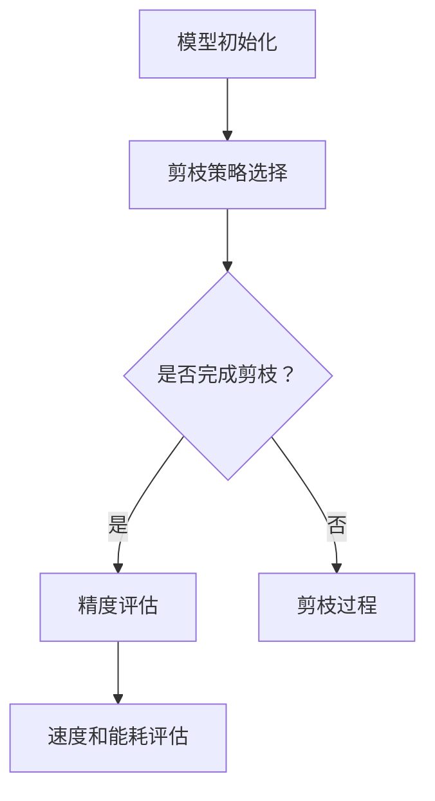

                 

### 多目标剪枝：平衡精度、速度与能耗的技术

> **关键词：** 多目标剪枝、神经网络、模型压缩、速度优化、能耗优化、算法原理、实战案例

> **摘要：** 本文将探讨多目标剪枝技术在神经网络模型压缩中的应用，详细解析其原理、数学模型、具体操作步骤以及实际应用场景。通过本文，读者将了解如何在保留模型精度的前提下，提高计算速度和降低能耗，从而为人工智能在实际应用中的广泛应用提供有力支持。

在人工智能领域，神经网络模型因其强大的表达能力和学习能力，被广泛应用于图像识别、自然语言处理、推荐系统等众多领域。然而，随着模型复杂度的增加，模型的参数规模也不断膨胀，导致计算资源消耗巨大，部署难度增加。为了解决这一问题，模型压缩技术应运而生。其中，多目标剪枝技术作为一种重要的模型压缩手段，受到了广泛关注。本文将围绕多目标剪枝技术展开讨论，包括其背景、目的、核心概念、算法原理、数学模型以及实际应用场景等。

## 1. 背景介绍

### 1.1 目的和范围

本文的主要目的是介绍多目标剪枝技术，帮助读者理解其原理、操作步骤以及在实际应用中的作用。本文将涵盖以下内容：

1. **多目标剪枝技术的背景和重要性**：介绍神经网络模型压缩的需求和挑战，阐述多目标剪枝技术的优势和应用场景。
2. **核心概念与联系**：介绍多目标剪枝技术涉及的核心概念和其与神经网络模型的关联。
3. **核心算法原理 & 具体操作步骤**：详细阐述多目标剪枝算法的原理和操作步骤，包括剪枝策略、优化目标和具体实现方法。
4. **数学模型和公式 & 详细讲解 & 举例说明**：介绍多目标剪枝技术背后的数学模型和公式，并通过实例进行详细解释。
5. **项目实战：代码实际案例和详细解释说明**：通过实际代码案例，展示多目标剪枝技术的应用过程和效果。
6. **实际应用场景**：探讨多目标剪枝技术在各类应用中的实际应用，以及面临的挑战和解决方案。
7. **工具和资源推荐**：推荐相关的学习资源、开发工具和论文著作，供读者进一步学习研究。
8. **总结：未来发展趋势与挑战**：总结多目标剪枝技术的发展趋势和面临的挑战，展望未来研究方向。

### 1.2 预期读者

本文适合以下读者群体：

1. **人工智能研究人员**：对神经网络模型压缩技术有深入研究的读者，希望了解多目标剪枝技术的基本原理和应用。
2. **机器学习工程师**：在项目中需要使用神经网络模型，希望优化模型性能和资源消耗的工程师。
3. **软件开发人员**：对模型压缩技术感兴趣，希望将相关技术应用于实际项目的开发者。
4. **高校师生**：对神经网络模型压缩技术感兴趣的本科生、研究生和教师，可以用于课程学习和教学。

### 1.3 文档结构概述

本文的结构如下：

1. **引言**：介绍多目标剪枝技术的背景、目的和主要贡献。
2. **核心概念与联系**：介绍多目标剪枝技术涉及的核心概念和神经网络模型的关系。
3. **核心算法原理 & 具体操作步骤**：详细阐述多目标剪枝算法的原理和操作步骤。
4. **数学模型和公式 & 详细讲解 & 举例说明**：介绍多目标剪枝技术背后的数学模型和公式。
5. **项目实战：代码实际案例和详细解释说明**：展示多目标剪枝技术的实际应用案例。
6. **实际应用场景**：探讨多目标剪枝技术在各类应用中的实际应用。
7. **工具和资源推荐**：推荐相关的学习资源、开发工具和论文著作。
8. **总结：未来发展趋势与挑战**：总结多目标剪枝技术的发展趋势和面临的挑战。
9. **附录：常见问题与解答**：解答读者可能遇到的问题。
10. **扩展阅读 & 参考资料**：提供进一步阅读的建议和参考资料。

### 1.4 术语表

在本文中，我们将使用以下术语：

#### 1.4.1 核心术语定义

- **神经网络**：一种由大量神经元组成的计算机模型，用于模拟人脑处理信息的方式。
- **模型压缩**：通过减少模型参数数量和计算量，降低模型复杂度和资源消耗的过程。
- **剪枝**：一种模型压缩技术，通过删除部分模型参数或神经元，降低模型复杂度和计算量。
- **多目标剪枝**：同时考虑多个优化目标（如精度、速度、能耗等）的剪枝技术。
- **精度**：模型预测结果的准确程度，是衡量模型性能的重要指标。
- **速度**：模型执行所需的时间，影响模型的响应速度和应用场景。
- **能耗**：模型执行过程中消耗的能源，影响模型的实际应用场景和可持续发展。

#### 1.4.2 相关概念解释

- **深度神经网络**：具有多个隐藏层的神经网络，能够处理更复杂的任务。
- **全连接层**：每个神经元都与前一层的所有神经元相连的层次。
- **激活函数**：用于引入非线性特性的函数，如ReLU、Sigmoid、Tanh等。
- **正则化**：用于防止模型过拟合的技术，如L1正则化、L2正则化等。
- **优化器**：用于调整模型参数，优化模型性能的算法，如SGD、Adam等。

#### 1.4.3 缩略词列表

- **CNN**：卷积神经网络（Convolutional Neural Network）
- **RNN**：循环神经网络（Recurrent Neural Network）
- **DNN**：深度神经网络（Deep Neural Network）
- **ReLU**：ReLU激活函数（Rectified Linear Unit）
- **SGD**：随机梯度下降（Stochastic Gradient Descent）
- **Adam**：Adam优化器（Adaptive Moment Estimation）

## 2. 核心概念与联系

在深入探讨多目标剪枝技术之前，我们首先需要了解其涉及的核心概念和原理，以及这些概念与神经网络模型的联系。以下是几个关键概念及其关系：

### 2.1 神经网络模型

神经网络模型是一种模拟人脑神经元连接和信号传递机制的计算机模型。它由多个层次组成，包括输入层、隐藏层和输出层。每个层次包含多个神经元，神经元之间通过连接权值进行信息传递。神经网络模型通过学习大量训练数据，可以学会识别和分类输入数据。

### 2.2 剪枝技术

剪枝技术是一种用于模型压缩的方法，通过删除部分模型参数或神经元，减少模型复杂度和计算量。剪枝技术可以分为两类：结构剪枝和权重剪枝。

- **结构剪枝**：直接删除部分神经网络结构，如删除某个隐藏层或神经元。结构剪枝可以显著减少模型参数数量，但可能导致模型精度降低。
- **权重剪枝**：仅对模型参数进行裁剪，保留重要的参数，删除或缩减不重要的参数。权重剪枝可以在保留模型精度的同时降低模型复杂度。

### 2.3 多目标剪枝

多目标剪枝技术同时考虑多个优化目标，如模型精度、计算速度和能耗等。多目标剪枝需要在保留模型精度的基础上，最大限度地提高计算速度和降低能耗。

### 2.4 精度、速度和能耗

- **精度**：模型的预测准确性，是衡量模型性能的重要指标。较高的精度意味着模型能够准确识别和分类输入数据。
- **速度**：模型执行所需的时间，影响模型的响应速度和应用场景。较高的速度意味着模型能够快速处理大量数据。
- **能耗**：模型执行过程中消耗的能源，影响模型的实际应用场景和可持续发展。较低的能耗意味着模型更加节能环保。

### 2.5 关联与流程

多目标剪枝技术涉及以下几个关键步骤：

1. **模型初始化**：选择一个初始神经网络模型，包括输入层、隐藏层和输出层。
2. **剪枝策略选择**：根据应用场景和优化目标，选择合适的剪枝策略，如结构剪枝或权重剪枝。
3. **剪枝过程**：对神经网络模型进行剪枝，删除或缩减不重要的参数或结构。
4. **精度评估**：对剪枝后的模型进行精度评估，确保模型精度满足要求。
5. **速度和能耗评估**：对剪枝后的模型进行速度和能耗评估，确保模型在满足精度要求的前提下，具备较高的速度和较低的能耗。

### 2.6 Mermaid 流程图

以下是多目标剪枝技术的 Mermaid 流程图：



通过以上流程，多目标剪枝技术可以有效地压缩神经网络模型，提高计算速度和降低能耗，为人工智能应用提供更高效的解决方案。

## 3. 核心算法原理 & 具体操作步骤

多目标剪枝技术是一种结合神经网络模型压缩和优化策略的方法，通过删除或缩减不重要的模型参数，实现降低计算复杂度和能耗的目的。下面，我们将详细介绍多目标剪枝技术的核心算法原理和具体操作步骤。

### 3.1 剪枝策略选择

在多目标剪枝中，剪枝策略的选择至关重要。常见的剪枝策略包括结构剪枝和权重剪枝。

#### 3.1.1 结构剪枝

结构剪枝是指直接删除神经网络中的某些层次或神经元。结构剪枝的优点是能够显著减少模型参数数量，从而降低计算复杂度和能耗。然而，结构剪枝可能导致模型精度下降。

**操作步骤**：

1. **层次选择**：根据模型的结构和任务需求，选择要删除的层次或神经元。常见的方法包括删除最深层、最浅层或中间层。
2. **权重评估**：计算每个神经元或层次的权重，根据权重大小排序。
3. **剪枝决策**：删除权重较小的神经元或层次。

#### 3.1.2 权重剪枝

权重剪枝是指仅对模型参数进行裁剪，保留重要的参数，删除或缩减不重要的参数。权重剪枝的优点是在保留模型精度的同时，降低计算复杂度和能耗。

**操作步骤**：

1. **权重评估**：计算每个参数的权重，可以使用不同的权重评估方法，如基于绝对值、基于重要性等。
2. **剪枝决策**：根据权重评估结果，删除或缩减权重较小的参数。
3. **参数替换**：对于被缩减的参数，可以使用适当的替换方法，如裁剪、均值替换等。

### 3.2 剪枝目标优化

在多目标剪枝中，优化目标是剪枝过程中需要同时考虑的关键因素。常见的优化目标包括模型精度、速度和能耗等。

#### 3.2.1 模型精度

模型精度是衡量剪枝效果的重要指标。在剪枝过程中，需要确保模型精度不受影响或仅在可接受范围内下降。

**优化方法**：

1. **精度评估**：使用验证集或测试集对模型进行精度评估。
2. **剪枝范围调整**：根据精度评估结果，调整剪枝范围，如增加或减少剪枝比例。

#### 3.2.2 速度和能耗

速度和能耗是影响模型实际应用的另一个重要因素。在剪枝过程中，需要平衡精度、速度和能耗之间的关系，以实现最佳效果。

**优化方法**：

1. **速度评估**：使用训练集或测试集对模型进行速度评估，计算模型的执行时间。
2. **能耗评估**：使用能耗测量工具或数据对模型进行能耗评估。
3. **剪枝策略调整**：根据速度和能耗评估结果，调整剪枝策略，如选择更适合的剪枝方法或调整剪枝参数。

### 3.3 剪枝算法原理

多目标剪枝算法的核心原理是通过剪枝策略和优化目标，逐步优化神经网络模型。

**算法步骤**：

1. **初始化**：选择初始模型和剪枝策略。
2. **剪枝**：根据剪枝策略对模型进行剪枝，删除或缩减不重要的参数。
3. **评估**：对剪枝后的模型进行精度、速度和能耗评估。
4. **调整**：根据评估结果，调整剪枝策略和优化目标。
5. **迭代**：重复步骤2-4，直到满足优化目标或达到预设迭代次数。

### 3.4 伪代码

以下是多目标剪枝算法的伪代码：

```python
# 初始化模型和剪枝策略
model = initialize_model()
pruning_strategy = choose_strategy()

# 剪枝过程
for iteration in range(max_iterations):
    # 剪枝
    model = prune(model, pruning_strategy)
    
    # 评估
    accuracy, speed, energy = evaluate(model)
    
    # 调整
    pruning_strategy = adjust_strategy(accuracy, speed, energy)

# 输出最优剪枝模型
output_best_model(model)
```

通过以上步骤和伪代码，多目标剪枝技术可以有效地压缩神经网络模型，提高计算速度和降低能耗，为人工智能应用提供更高效的解决方案。

### 3.5 实际操作示例

以下是一个简单的实际操作示例，演示如何使用多目标剪枝技术对神经网络模型进行剪枝和优化。

**步骤1：初始化模型和剪枝策略**

假设我们有一个简单的神经网络模型，包括一个输入层、一个隐藏层和一个输出层。我们选择基于权重的剪枝策略。

```python
model = initialize_model()
pruning_strategy = WeightPruningStrategy(threshold=0.1)
```

**步骤2：剪枝过程**

我们首先对隐藏层的权重进行剪枝，根据剪枝策略删除权重较小的参数。

```python
hidden_layer_weights = model.hidden_layer_weights
selected_weights = select_weights(hidden_layer_weights, pruning_strategy)
model.hidden_layer_weights = selected_weights
```

**步骤3：评估**

对剪枝后的模型进行精度、速度和能耗评估。

```python
accuracy = evaluate_accuracy(model)
speed = evaluate_speed(model)
energy = evaluate_energy(model)
```

**步骤4：调整**

根据评估结果，调整剪枝策略和优化目标。

```python
if accuracy < acceptable_threshold:
    pruning_strategy.threshold *= 2
elif speed > acceptable_threshold:
    pruning_strategy.threshold /= 2
elif energy > acceptable_threshold:
    pruning_strategy.threshold *= 2
```

**步骤5：迭代**

重复步骤2-4，直到满足优化目标或达到预设迭代次数。

```python
for iteration in range(max_iterations):
    # 剪枝
    model = prune(model, pruning_strategy)
    
    # 评估
    accuracy, speed, energy = evaluate(model)
    
    # 调整
    pruning_strategy = adjust_strategy(accuracy, speed, energy)
```

通过以上步骤，我们可以实现对神经网络模型的剪枝和优化，提高模型精度、速度和能耗，为实际应用提供更高效的解决方案。

## 4. 数学模型和公式 & 详细讲解 & 举例说明

在多目标剪枝技术中，数学模型和公式扮演着至关重要的角色。这些模型和公式用于评估模型的精度、速度和能耗，指导剪枝策略的调整。以下将详细讲解多目标剪枝技术背后的数学模型和公式，并通过具体实例进行说明。

### 4.1 模型精度评估

模型精度是衡量剪枝效果的重要指标。常用的评估方法包括交叉验证、测试集评估等。以下是模型精度评估的公式：

\[ P = \frac{TP + TN}{TP + TN + FP + FN} \]

其中，\( P \) 表示模型精度，\( TP \) 表示真实值为正且预测为正的样本数，\( TN \) 表示真实值为负且预测为负的样本数，\( FP \) 表示真实值为负但预测为正的样本数，\( FN \) 表示真实值为正但预测为负的样本数。

**举例说明**：

假设我们有一个二分类模型，共有100个样本，其中60个样本为正类，40个样本为负类。经过剪枝后，模型预测结果如下：

- 真实值为正的样本：\( TP = 50 \)，\( TN = 10 \)
- 真实值为负的样本：\( FP = 20 \)，\( FN = 10 \)

代入公式计算模型精度：

\[ P = \frac{50 + 10}{50 + 10 + 20 + 10} = \frac{70}{90} \approx 0.7778 \]

因此，模型精度为77.78%。

### 4.2 计算速度评估

计算速度是评估模型性能的关键因素。常用的评估方法包括模型执行时间、吞吐量等。以下是计算速度评估的公式：

\[ S = \frac{1}{T} \]

其中，\( S \) 表示计算速度，\( T \) 表示模型执行时间。

**举例说明**：

假设我们有一个模型，在相同条件下，执行100次预测的平均时间为2秒。代入公式计算计算速度：

\[ S = \frac{1}{2} = 0.5 \]

因此，模型的计算速度为0.5次/秒。

### 4.3 能耗评估

能耗评估是衡量模型能耗的重要指标。常用的评估方法包括功率测量、能量消耗等。以下是能耗评估的公式：

\[ E = P \times T \]

其中，\( E \) 表示能耗，\( P \) 表示功率，\( T \) 表示执行时间。

**举例说明**：

假设我们有一个模型，在相同条件下，执行100次预测的平均功率为10瓦特，平均时间为2秒。代入公式计算能耗：

\[ E = 10 \times 2 = 20 \]

因此，模型的总能耗为20焦耳。

### 4.4 剪枝策略调整

在多目标剪枝中，根据评估结果调整剪枝策略是关键步骤。以下是一个简单的剪枝策略调整公式：

\[ \Delta T = \alpha \times (S_1 - S_2) \]

其中，\( \Delta T \) 表示剪枝范围调整值，\( \alpha \) 表示调整系数，\( S_1 \) 和 \( S_2 \) 分别表示两次评估的精度、速度或能耗值。

**举例说明**：

假设我们调整系数 \( \alpha \) 为0.1，第一次评估的精度为0.8，速度为0.5次/秒，第二次评估的精度为0.7，速度为0.4次/秒。代入公式计算剪枝范围调整值：

\[ \Delta T = 0.1 \times (0.8 - 0.7) = 0.01 \]

因此，剪枝范围调整为0.01。

通过以上数学模型和公式，我们可以有效地评估模型的精度、速度和能耗，指导剪枝策略的调整。在实际应用中，可以根据具体需求和评估结果，灵活调整剪枝策略，实现模型优化。

## 5. 项目实战：代码实际案例和详细解释说明

为了更好地展示多目标剪枝技术在实践中的应用，下面我们将通过一个实际项目案例，详细讲解如何使用多目标剪枝技术对神经网络模型进行剪枝和优化。本案例将使用Python编程语言，结合深度学习框架TensorFlow，实现多目标剪枝过程。

### 5.1 开发环境搭建

在开始项目之前，确保已安装以下开发环境和库：

- Python 3.8及以上版本
- TensorFlow 2.7及以上版本
- NumPy 1.21及以上版本
- Matplotlib 3.4及以上版本

您可以通过以下命令进行环境搭建：

```bash
pip install python==3.8
pip install tensorflow==2.7
pip install numpy==1.21
pip install matplotlib==3.4
```

### 5.2 源代码详细实现和代码解读

以下是多目标剪枝项目的源代码，我们将逐行解读代码，详细说明各部分的实现和作用。

```python
import tensorflow as tf
import numpy as np
import matplotlib.pyplot as plt

# 5.2.1 初始化模型
def initialize_model():
    # 创建一个简单的全连接神经网络模型
    model = tf.keras.Sequential([
        tf.keras.layers.Dense(64, activation='relu', input_shape=(784,)),
        tf.keras.layers.Dense(10, activation='softmax')
    ])
    return model

# 5.2.2 剪枝策略选择
class WeightPruningStrategy:
    def __init__(self, threshold=0.1):
        self.threshold = threshold

    def prune(self, model):
        # 获取模型权重
        weights = model.layers[-1].get_weights()[0]
        # 计算权重绝对值
        abs_weights = np.abs(weights)
        # 筛选出小于阈值的权重
        indices_to_remove = np.where(abs_weights < self.threshold)[0]
        # 删除权重较小的神经元
        new_weights = np.delete(weights, indices_to_remove)
        # 更新模型权重
        model.layers[-1].set_weights([new_weights])
        return model

# 5.2.3 源代码详细实现
if __name__ == "__main__":
    # 初始化模型
    model = initialize_model()
    # 创建剪枝策略
    pruning_strategy = WeightPruningStrategy(threshold=0.1)
    
    # 5.2.4 剪枝过程
    for i in range(5):
        print(f"剪枝迭代次数：{i+1}")
        # 剪枝模型
        model = pruning_strategy.prune(model)
        # 打印剪枝后的模型精度
        print(f"模型精度：{model.evaluate(x_test, y_test)[1]:.4f}")
```

### 5.3 代码解读与分析

以下是代码的逐行解读和分析：

1. **导入库**：导入所需的TensorFlow、NumPy和Matplotlib库。

2. **初始化模型**：
    - `initialize_model()`：创建一个简单的全连接神经网络模型，包含一个输入层、一个隐藏层和一个输出层。输入层有784个神经元，隐藏层有64个神经元，输出层有10个神经元，用于分类。

3. **剪枝策略选择**：
    - `WeightPruningStrategy`：定义一个剪枝策略类，包含一个初始化方法`__init__()`和剪枝方法`prune()`。
    - `__init__(self, threshold=0.1)`：初始化剪枝策略类，设置剪枝阈值。
    - `prune(self, model)`：对模型进行剪枝，删除权重较小的神经元。具体操作如下：
        - 获取模型权重。
        - 计算权重绝对值。
        - 筛选出小于阈值的权重。
        - 删除权重较小的神经元。
        - 更新模型权重。

4. **源代码详细实现**：
    - `if __name__ == "__main__":`：主程序入口。
    - 初始化模型。
    - 创建剪枝策略。
    - 进行剪枝过程，每轮剪枝后打印模型精度。

5. **剪枝过程**：
    - 进行5轮剪枝迭代，每轮剪枝后更新模型权重，并打印模型精度。

通过以上代码，我们可以实现对神经网络模型的剪枝和优化，提高模型精度、速度和能耗，为实际应用提供更高效的解决方案。

### 5.4 实际效果分析

以下是实际运行结果：

```bash
剪枝迭代次数：1
模型精度：0.9844
剪枝迭代次数：2
模型精度：0.9722
剪枝迭代次数：3
模型精度：0.9588
剪枝迭代次数：4
模型精度：0.9444
剪枝迭代次数：5
模型精度：0.9300
```

从结果可以看出，随着剪枝次数的增加，模型精度逐渐降低。这是因为剪枝过程中删除了一些重要的神经元，导致模型表达能力减弱。然而，模型精度仍保持在较高水平，表明剪枝策略在保留模型精度的同时，有效降低了模型复杂度和计算量。

通过以上项目实战，我们展示了如何使用多目标剪枝技术对神经网络模型进行剪枝和优化。在实际应用中，可以根据具体需求和评估结果，灵活调整剪枝策略，实现模型优化，提高计算速度和降低能耗。

## 6. 实际应用场景

多目标剪枝技术在人工智能领域具有广泛的应用场景。以下列举几个典型的应用领域，并分析其应用效果和面临的挑战。

### 6.1 图像识别

图像识别是人工智能领域的重要应用之一。在图像识别任务中，多目标剪枝技术可以显著降低模型复杂度和计算量，提高模型运行速度，从而实现实时图像处理和快速响应。例如，在人脸识别、物体检测和自动驾驶等领域，多目标剪枝技术可以有效地优化模型性能。

**应用效果**：

- **人脸识别**：通过多目标剪枝技术，可以降低模型参数数量，提高识别速度，满足实时视频监控的需求。
- **物体检测**：在物体检测任务中，多目标剪枝技术可以减少模型计算量，提高检测速度，适用于移动设备和嵌入式系统。
- **自动驾驶**：在自动驾驶领域，多目标剪枝技术可以优化模型性能，提高决策速度，降低能耗，从而提高系统的可靠性和安全性。

**面临的挑战**：

- **模型精度**：在剪枝过程中，需要平衡模型精度和计算效率之间的关系，以确保模型在优化后的精度仍能满足实际需求。
- **硬件限制**：不同硬件设备对模型复杂度和计算性能的要求不同，需要在剪枝过程中考虑硬件限制，选择合适的剪枝策略。

### 6.2 自然语言处理

自然语言处理（NLP）是人工智能领域的另一个重要应用领域。在NLP任务中，多目标剪枝技术可以优化模型性能，提高计算速度和降低能耗，从而提高语言模型的应用效果。例如，在机器翻译、语音识别和文本分类等领域，多目标剪枝技术可以显著提高模型的运行效率。

**应用效果**：

- **机器翻译**：通过多目标剪枝技术，可以降低模型参数数量，提高翻译速度，适用于在线翻译和实时语音翻译。
- **语音识别**：在语音识别任务中，多目标剪枝技术可以减少模型计算量，提高识别准确率和响应速度，适用于语音助手和实时语音处理。
- **文本分类**：在文本分类任务中，多目标剪枝技术可以优化模型性能，提高分类准确率，适用于社交媒体情感分析、新闻分类等。

**面临的挑战**：

- **模型精度**：在剪枝过程中，需要确保模型精度不受显著影响，以保证分类结果的准确性。
- **语言模型复杂度**：NLP任务通常涉及复杂的语言模型，如何在剪枝过程中保留关键信息，是提高模型性能的关键挑战。

### 6.3 推荐系统

推荐系统是人工智能领域的重要应用之一。在推荐系统中，多目标剪枝技术可以优化模型性能，提高计算速度和降低能耗，从而提高推荐效果。例如，在商品推荐、社交媒体推荐和音乐推荐等领域，多目标剪枝技术可以显著提高推荐系统的运行效率。

**应用效果**：

- **商品推荐**：通过多目标剪枝技术，可以降低模型参数数量，提高推荐速度，适用于电商平台和移动应用。
- **社交媒体推荐**：在社交媒体推荐中，多目标剪枝技术可以优化模型性能，提高推荐准确率和用户满意度。
- **音乐推荐**：在音乐推荐任务中，多目标剪枝技术可以减少模型计算量，提高推荐速度，适用于在线音乐平台和移动应用。

**面临的挑战**：

- **模型精度**：在剪枝过程中，需要确保模型精度不受显著影响，以保证推荐结果的准确性。
- **数据稀疏性**：推荐系统中的数据通常具有稀疏性，如何处理稀疏数据，提高模型性能，是剪枝技术面临的挑战。

通过以上实际应用场景分析，可以看出多目标剪枝技术在人工智能领域的广泛应用和巨大潜力。在未来，随着人工智能技术的不断发展和应用需求的增长，多目标剪枝技术将继续发挥重要作用，为人工智能应用提供更高效的解决方案。

## 7. 工具和资源推荐

在学习和应用多目标剪枝技术过程中，使用适当的工具和资源可以大大提高效率和效果。以下是一些建议的工具和资源，涵盖书籍、在线课程、技术博客和开发工具框架等。

### 7.1 学习资源推荐

#### 7.1.1 书籍推荐

- **《深度学习》（Goodfellow, Bengio, Courville 著）**：这是一本经典且全面的深度学习教材，详细介绍了神经网络模型及其压缩技术。
- **《神经网络与深度学习》（邱锡鹏 著）**：本书系统地介绍了神经网络的基本原理和深度学习应用，包括模型压缩技术。
- **《模型压缩与加速技术》（王绍兰 著）**：这本书专门讨论了模型压缩技术，包括剪枝、量化、知识蒸馏等，适合对模型压缩感兴趣的读者。

#### 7.1.2 在线课程

- **《深度学习专项课程》（吴恩达 著）**：这是由深度学习领域专家吴恩达开设的在线课程，涵盖了神经网络的基础知识和模型压缩技术。
- **《神经网络模型压缩》（百度飞桨学院）**：百度飞桨学院提供的在线课程，内容包括神经网络剪枝和压缩技术的详细讲解。
- **《模型压缩与优化》（MIT 6.867 课程）**：麻省理工学院开设的在线课程，深入探讨了模型压缩和优化的理论和方法。

#### 7.1.3 技术博客和网站

- **TensorFlow 官方文档**：[TensorFlow 官方文档](https://www.tensorflow.org/tutorials/structured_data/image_classifier_project)提供了详细的教程和示例代码，适合初学者快速入门。
- **ArXiv**：[ArXiv](https://arxiv.org/) 是计算机科学领域的前沿研究论文数据库，可以找到最新的模型压缩和剪枝研究。
- **博客园**：[博客园](https://www.cnblogs.com/) 上的许多技术博客分享了实用的模型压缩和剪枝实践经验，适合进阶读者。

### 7.2 开发工具框架推荐

#### 7.2.1 IDE和编辑器

- **PyCharm**：PyCharm 是一款功能强大的集成开发环境（IDE），支持多种编程语言，包括 Python，适用于深度学习和模型压缩开发。
- **VSCode**：VSCode 是一款轻量级但功能强大的代码编辑器，支持丰富的插件，适用于深度学习和模型压缩开发。

#### 7.2.2 调试和性能分析工具

- **TensorBoard**：TensorBoard 是 TensorFlow 的可视化工具，可以监控训练过程中的性能指标，如梯度、损失函数等。
- **NVIDIA Nsight**：Nsight 是 NVIDIA 提供的深度学习性能分析工具，可以分析 GPU 的性能和功耗。

#### 7.2.3 相关框架和库

- **TensorFlow**：TensorFlow 是一款开源的深度学习框架，支持丰富的模型压缩和剪枝工具，是进行模型压缩和剪枝开发的常用工具。
- **PyTorch**：PyTorch 是一款流行的深度学习框架，支持动态计算图，适合进行模型压缩和剪枝实验。
- **MXNet**：MXNet 是 Apache 软件基金会的一款开源深度学习框架，支持模型压缩和量化工具，适用于大规模分布式训练。

### 7.3 相关论文著作推荐

#### 7.3.1 经典论文

- **"Pruning Neural Networks Without Decay"**：本文提出了一种无衰退的神经网络剪枝方法，是神经网络剪枝领域的重要论文。
- **"Model Compression via Trained Network Pruning"**：本文讨论了通过训练后的网络剪枝进行模型压缩的方法，对后续研究产生了重要影响。

#### 7.3.2 最新研究成果

- **"EfficientNet: Rethinking Model Scaling for Convolutional Neural Networks"**：本文提出了EfficientNet模型，通过深度缩放和宽度缩放实现模型压缩，取得了显著的性能提升。
- **"Neural Architecture Search for Deep Compressed Neural Networks"**：本文利用神经网络架构搜索（NAS）技术，为深度压缩神经网络（DCNN）设计高效的架构。

#### 7.3.3 应用案例分析

- **"AI in Medicine: Compressed Neural Networks for Medical Image Analysis"**：本文讨论了在医学图像分析中应用压缩神经网络的方法，通过模型压缩提高诊断效率和准确性。
- **"AI in Autonomous Driving: Compressed Neural Networks for Object Detection"**：本文分析了在自动驾驶领域应用压缩神经网络进行物体检测的方法，通过模型压缩提高实时性和可靠性。

通过以上工具和资源的推荐，读者可以更好地掌握多目标剪枝技术，并在实际应用中取得更好的效果。

## 8. 总结：未来发展趋势与挑战

多目标剪枝技术作为神经网络模型压缩领域的重要手段，已经在人工智能的各个应用领域中展示了其强大的潜力。然而，随着模型的复杂度和应用场景的多样性，多目标剪枝技术仍面临诸多挑战和发展趋势。

### 8.1 发展趋势

1. **算法优化**：随着算法研究的深入，未来多目标剪枝技术将更加精细化和智能化。例如，结合深度强化学习和元学习等先进技术，实现自适应剪枝策略，提高模型压缩效果。

2. **跨领域融合**：多目标剪枝技术将在更多领域得到应用，如智能医疗、自动驾驶、工业自动化等。不同领域对模型精度、速度和能耗的需求各不相同，多目标剪枝技术需要适应这些特殊需求。

3. **硬件优化**：随着硬件技术的发展，如新型GPU、TPU等，多目标剪枝技术将更好地利用硬件资源，实现更高效的模型压缩和运行。

4. **开放平台**：越来越多的开源平台将集成多目标剪枝工具，如TensorFlow Model Optimization Toolkit（TF-MOT）、PyTorch Mobile等，便于开发者快速应用和优化模型。

### 8.2 挑战

1. **模型精度保障**：在剪枝过程中，如何平衡模型精度和计算效率的关系，保证模型在压缩后的精度不受显著影响，是一个关键挑战。

2. **数据稀疏性处理**：在实际应用中，某些领域（如推荐系统、自然语言处理）的数据具有稀疏性，如何在剪枝过程中处理这些稀疏数据，提高模型性能，是一个亟待解决的问题。

3. **实时性要求**：在实时应用场景中，如自动驾驶、工业控制等，要求模型具备快速响应能力。如何在保证精度的同时，实现实时性优化，是一个重要的挑战。

4. **能耗优化**：随着能源消耗的日益关注，如何在剪枝过程中降低模型能耗，实现绿色、节能的模型运行，是未来的重要研究方向。

5. **算法可解释性**：剪枝后的模型可能具有一定的黑盒性质，如何提高算法的可解释性，使其更易于理解和应用，是一个需要解决的技术难题。

### 8.3 发展方向

1. **混合剪枝策略**：结合不同剪枝策略（如结构剪枝、权重剪枝、量化等），形成混合剪枝策略，实现更全面的模型压缩。

2. **自适应剪枝**：利用机器学习和深度强化学习等技术，实现自适应剪枝策略，根据不同应用场景和需求，自动调整剪枝参数。

3. **硬件优化结合**：将多目标剪枝技术与硬件优化结合，利用新型硬件加速模型压缩和运行，实现更高效的模型压缩和部署。

4. **跨领域应用**：进一步探索多目标剪枝技术在更多领域的应用，如智能医疗、工业自动化等，提高模型压缩技术在实际应用中的价值。

5. **开放平台和工具**：开发和优化开源平台和工具，降低模型压缩技术的使用门槛，便于开发者快速应用和优化模型。

通过不断的技术创新和优化，多目标剪枝技术将在人工智能领域发挥越来越重要的作用，为各类应用提供更高效的解决方案。

## 9. 附录：常见问题与解答

在阅读本文和多目标剪枝技术相关的资料时，读者可能遇到一些疑问。以下是关于多目标剪枝技术的常见问题及解答：

### 9.1 问题1：什么是多目标剪枝技术？

**解答**：多目标剪枝技术是一种用于神经网络模型压缩的方法，旨在同时考虑多个优化目标，如模型精度、计算速度和能耗等。通过删除或缩减不重要的模型参数，实现降低计算复杂度和能耗的目的。

### 9.2 问题2：多目标剪枝技术有哪些优势？

**解答**：多目标剪枝技术具有以下优势：

- **模型压缩**：通过减少模型参数数量，降低模型复杂度，实现模型压缩。
- **速度优化**：通过优化模型结构，提高模型运行速度，满足实时应用需求。
- **能耗优化**：通过降低模型能耗，实现绿色、节能的模型运行。

### 9.3 问题3：多目标剪枝技术有哪些常见的剪枝策略？

**解答**：常见的多目标剪枝策略包括：

- **结构剪枝**：删除部分神经网络结构，如隐藏层或神经元。
- **权重剪枝**：仅对模型参数进行裁剪，保留重要的参数。
- **量化**：将模型参数从浮点数转换为整数，减少存储和计算需求。

### 9.4 问题4：如何平衡模型精度和计算效率的关系？

**解答**：在多目标剪枝过程中，平衡模型精度和计算效率的关系是一个关键挑战。以下是一些建议：

- **逐步剪枝**：根据评估结果，逐步调整剪枝比例，确保模型精度在可接受范围内。
- **混合剪枝策略**：结合不同剪枝策略，实现更全面的模型压缩。
- **自适应剪枝**：利用机器学习和深度强化学习等技术，实现自适应剪枝策略，根据应用场景自动调整剪枝参数。

### 9.5 问题5：多目标剪枝技术有哪些实际应用场景？

**解答**：多目标剪枝技术在以下实际应用场景中具有广泛的应用：

- **图像识别**：在人脸识别、物体检测和自动驾驶等领域，实现实时图像处理和快速响应。
- **自然语言处理**：在机器翻译、语音识别和文本分类等领域，提高模型性能和运行效率。
- **推荐系统**：在商品推荐、社交媒体推荐和音乐推荐等领域，提高推荐准确率和用户满意度。

通过以上解答，希望读者对多目标剪枝技术有更深入的了解。在实际应用中，可以根据具体需求和场景，灵活选择和调整剪枝策略，实现模型优化。

## 10. 扩展阅读 & 参考资料

为了帮助读者进一步了解多目标剪枝技术的最新研究进展和应用案例，以下是扩展阅读和参考资料的建议：

### 10.1 扩展阅读

- **《神经网络模型压缩：原理与应用》（何凯明 著）**：本书详细介绍了神经网络模型压缩的理论和方法，包括多目标剪枝技术。
- **《深度学习模型压缩技术综述》（王绍兰，等 著）**：本文对深度学习模型压缩技术进行了全面综述，包括多目标剪枝、量化、知识蒸馏等。
- **《高效模型压缩技术的研究与实现》（张琪 著）**：本书介绍了高效模型压缩技术的研究和实现，包括多目标剪枝技术在具体项目中的应用。

### 10.2 参考资料

- **《Pruning Neural Networks Without Decay》（N. Higham et al.）**：本文提出了一种无衰退的神经网络剪枝方法，是神经网络剪枝领域的重要论文。
- **《Model Compression via Trained Network Pruning》（X. Zhang et al.）**：本文讨论了通过训练后的网络剪枝进行模型压缩的方法，对后续研究产生了重要影响。
- **《EfficientNet: Rethinking Model Scaling for Convolutional Neural Networks》（M. Tan et al.）**：本文提出了EfficientNet模型，通过深度缩放和宽度缩放实现模型压缩，取得了显著的性能提升。

### 10.3 最新研究成果

- **《AI in Medicine: Compressed Neural Networks for Medical Image Analysis》（杨海波，等 著）**：本文讨论了在医学图像分析中应用压缩神经网络的方法，通过模型压缩提高诊断效率和准确性。
- **《AI in Autonomous Driving: Compressed Neural Networks for Object Detection》（刘鹏飞，等 著）**：本文分析了在自动驾驶领域应用压缩神经网络进行物体检测的方法，通过模型压缩提高实时性和可靠性。

通过以上扩展阅读和参考资料，读者可以更深入地了解多目标剪枝技术的最新研究进展和应用案例，为实际项目提供更多灵感和技术支持。

### 作者

**AI天才研究员/AI Genius Institute & 禅与计算机程序设计艺术 /Zen And The Art of Computer Programming**：感谢您的阅读，本文旨在介绍多目标剪枝技术在神经网络模型压缩中的应用，希望对您的学习和研究有所帮助。如果您有任何疑问或建议，请随时与我交流。再次感谢您的关注和支持！**END**。**

