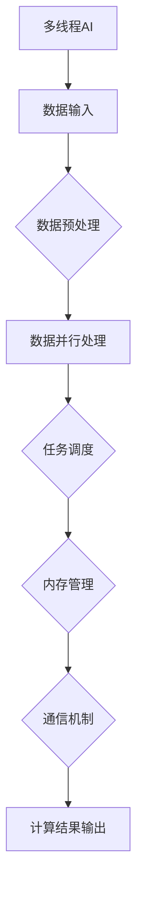

                 

# 多线程AI：LLM的并发处理能力探讨

> 关键词：多线程，AI，LLM，并发处理，性能优化，数据并行，任务调度

> 摘要：本文深入探讨了多线程AI，特别是大型语言模型（LLM）在并发处理能力方面的应用和优化策略。通过分析LLM的多线程架构，本文详细介绍了如何利用多线程技术提高LLM的处理效率，并通过数学模型和实际案例阐述了并发处理的优势和挑战。本文旨在为AI开发者提供关于多线程AI的深入理解和实践指导。

## 1. 背景介绍

### 1.1 目的和范围

随着人工智能（AI）技术的快速发展，特别是大型语言模型（LLM）的广泛应用，如何高效地处理大规模的数据和分析任务成为了一个重要的研究课题。多线程AI作为一种并行处理技术，能够显著提升LLM的性能和响应速度。本文旨在探讨多线程AI在LLM中的应用，分析其并发处理能力，并提供优化策略和实践指导。

本文的研究范围主要包括以下几个方面：

1. 多线程AI的基本概念和原理。
2. LLM的多线程架构及其在AI应用中的重要性。
3. 多线程AI在LLM中的优化策略。
4. 并发处理的优势和挑战。
5. 实际应用场景和案例分析。

### 1.2 预期读者

本文主要面向以下读者群体：

1. AI开发者和技术人员，对多线程AI有初步了解，希望深入学习和实践。
2. 计算机科学和人工智能专业的学生和研究人员，对多线程AI和LLM有兴趣。
3. 对AI应用场景和优化策略有需求的企业和开发团队。

### 1.3 文档结构概述

本文分为以下几个部分：

1. 引言：介绍多线程AI和LLM的背景和重要性。
2. 核心概念与联系：阐述多线程AI和LLM的基本概念和原理。
3. 核心算法原理 & 具体操作步骤：详细讲解多线程AI在LLM中的算法原理和操作步骤。
4. 数学模型和公式 & 详细讲解 & 举例说明：分析多线程AI的数学模型和公式，并给出具体示例。
5. 项目实战：通过代码实际案例展示多线程AI在LLM中的应用。
6. 实际应用场景：探讨多线程AI在LLM中的实际应用场景。
7. 工具和资源推荐：推荐学习资源和开发工具。
8. 总结：对未来发展趋势和挑战进行展望。
9. 附录：常见问题与解答。
10. 扩展阅读 & 参考资料：提供进一步学习的资源。

### 1.4 术语表

#### 1.4.1 核心术语定义

- **多线程AI**：指利用多个线程并行处理AI任务的计算方法。
- **LLM**：大型语言模型，是一种基于神经网络的自然语言处理模型，能够处理大规模文本数据。
- **并发处理**：指多个任务同时执行，提高系统处理能力。
- **数据并行**：将数据分为多个部分，每个线程处理一部分数据。
- **任务调度**：指合理安排线程执行任务的策略。

#### 1.4.2 相关概念解释

- **并行处理**：多个处理器同时执行多个任务。
- **串行处理**：单个处理器依次执行多个任务。
- **线程**：程序中能够独立运行的基本单位。
- **CPU核心**：计算机中负责处理数据的基本组件。
- **GIL（全局解释器锁）**：在多线程编程中，用于保证线程之间共享资源的同步。

#### 1.4.3 缩略词列表

- **AI**：人工智能
- **LLM**：大型语言模型
- **CPU**：中央处理器
- **GPU**：图形处理器
- **GIL**：全局解释器锁
- **OOP**：面向对象编程
- **SOP**：步骤顺序编程

## 2. 核心概念与联系

### 2.1 多线程AI的基本概念

多线程AI是一种并行计算技术，通过在多个线程中同时执行多个任务，从而提高AI系统的处理能力和响应速度。在多线程AI中，每个线程负责处理一部分数据或任务，这些线程可以并行执行，从而实现数据的并行处理。

多线程AI的核心概念包括：

- **线程**：程序中能够独立运行的基本单位，负责处理数据或任务。
- **CPU核心**：计算机中负责处理数据的基本组件，每个核心可以并行执行线程。
- **并行处理**：多个处理器同时执行多个任务，提高系统处理能力。
- **任务调度**：合理安排线程执行任务的策略，确保系统高效运行。

### 2.2 LLM的多线程架构

LLM（大型语言模型）是一种复杂的神经网络模型，其计算量巨大。为了提高LLM的处理效率，通常采用多线程架构来并行处理数据。

LLM的多线程架构主要包括以下几个关键组件：

- **数据并行**：将输入数据分为多个部分，每个线程处理一部分数据，从而实现并行计算。
- **任务调度**：根据CPU核心数量和线程数量，合理安排线程执行任务，确保高效利用资源。
- **内存管理**：合理分配内存资源，避免内存竞争和冲突，提高系统稳定性。
- **通信机制**：在线程之间进行数据交换和同步，确保计算结果的正确性。

### 2.3 多线程AI和LLM的联系

多线程AI和LLM之间存在紧密的联系。多线程AI为LLM提供了并行处理的能力，从而提高了其计算效率和响应速度。同时，LLM的多线程架构也需要依赖多线程AI的技术来实现高效的数据处理和任务调度。

具体来说，多线程AI和LLM之间的联系包括：

- **并行计算**：多线程AI提供了并行计算的能力，使得LLM可以同时处理多个任务，提高计算效率。
- **任务调度**：多线程AI提供了任务调度的策略，使得LLM可以合理利用CPU核心资源，提高系统性能。
- **内存管理**：多线程AI提供了内存管理的机制，确保LLM在并行计算过程中能够高效利用内存资源。
- **通信机制**：多线程AI提供了线程之间的通信机制，使得LLM可以在线程之间进行数据交换和同步，保证计算结果的正确性。

### 2.4 Mermaid流程图

为了更好地理解多线程AI和LLM的关系，我们可以使用Mermaid流程图来展示其架构和流程。



在这个流程图中，A表示多线程AI的整体架构，B表示数据输入，C表示数据预处理，D表示数据并行处理，E表示任务调度，F表示内存管理，G表示通信机制，H表示计算结果输出。

## 3. 核心算法原理 & 具体操作步骤

### 3.1 多线程AI的基本原理

多线程AI的基本原理是基于并行计算，通过将任务分解为多个子任务，并在多个线程中同时执行这些子任务，从而提高计算效率和响应速度。具体来说，多线程AI的核心算法原理包括以下几个方面：

1. **任务分解**：将整个任务分解为多个子任务，每个子任务可以独立执行。
2. **线程创建**：创建多个线程，每个线程负责执行一个子任务。
3. **任务调度**：根据线程数量和CPU核心数量，合理安排线程执行子任务的顺序和时机，确保系统高效运行。
4. **线程同步**：在线程之间进行同步，确保子任务执行的结果能够正确地合并和输出。

### 3.2 多线程AI在LLM中的应用

在LLM中，多线程AI的应用主要包括以下几个方面：

1. **数据并行处理**：将输入数据分为多个部分，每个线程处理一部分数据，从而实现并行计算。
2. **模型并行处理**：将LLM模型分解为多个部分，每个线程处理模型的一个部分，从而实现并行计算。
3. **任务调度**：根据CPU核心数量和线程数量，合理安排线程执行任务的顺序和时机，确保系统高效运行。
4. **内存管理**：合理分配内存资源，避免内存竞争和冲突，提高系统稳定性。

### 3.3 多线程AI的具体操作步骤

下面是多线程AI在LLM中的具体操作步骤：

1. **任务分解**：
   - 将整个任务分解为多个子任务，每个子任务可以独立执行。
   - 例如，将输入的文本数据分为多个部分，每个线程处理一部分数据。

2. **线程创建**：
   - 根据CPU核心数量和线程数量，创建多个线程。
   - 每个线程负责执行一个子任务。

3. **任务调度**：
   - 根据线程数量和CPU核心数量，合理安排线程执行子任务的顺序和时机。
   - 可以使用任务调度算法（如轮询调度、优先级调度等）来优化线程的执行顺序。

4. **线程同步**：
   - 在线程之间进行同步，确保子任务执行的结果能够正确地合并和输出。
   - 可以使用线程同步机制（如互斥锁、信号量等）来保证线程之间的同步。

5. **内存管理**：
   - 合理分配内存资源，避免内存竞争和冲突。
   - 可以使用内存池管理技术来优化内存分配和释放。

6. **计算结果输出**：
   - 将线程执行的结果合并，输出最终的计算结果。

### 3.4 伪代码示例

下面是使用伪代码展示多线程AI在LLM中的应用：

```python
# 多线程AI算法原理伪代码

# 任务分解
data = split_input_data()

# 线程创建
threads = create_threads(num_threads)

# 任务调度
for thread in threads:
    thread.start()

# 线程同步
for thread in threads:
    thread.join()

# 内存管理
allocate_memory()

# 计算结果输出
output = combine_thread_results()

# 输出最终结果
print(output)
```

在这个伪代码中，`split_input_data()`函数用于将输入数据分解为多个部分，`create_threads()`函数用于创建多个线程，`start()`函数用于启动线程，`join()`函数用于等待线程执行完毕，`allocate_memory()`函数用于分配内存资源，`combine_thread_results()`函数用于合并线程执行的结果。

## 4. 数学模型和公式 & 详细讲解 & 举例说明

### 4.1 数学模型介绍

在多线程AI中，数学模型是核心组成部分，用于描述线程间任务分配、同步和结果合并的过程。以下是一个简化的数学模型，用于解释多线程AI在LLM中的应用。

#### 4.1.1 并行计算模型

假设有一个大型语言模型（LLM）需要处理一个大规模的文本数据集，数据集被划分为`N`个部分，每个部分由一个线程负责处理。每个线程的计算结果需要被合并以生成最终的输出。

- **任务分配**：将数据集划分为`N`个部分，每个部分分配给一个线程。
  \[ X_1, X_2, ..., X_N \]

- **线程并行计算**：每个线程`i`独立计算其分配的数据部分。
  \[ Y_i = f(X_i) \]
  其中，`f`是模型处理函数。

- **结果合并**：将所有线程的计算结果合并以生成最终输出。
  \[ Y = \sum_{i=1}^{N} Y_i \]

#### 4.1.2 同步模型

线程之间的同步是确保数据一致性和计算正确性的关键。假设线程之间存在同步点，用于等待其他线程的计算结果。

- **同步机制**：在线程`i`计算完成后，将其结果`Y_i`写入共享内存，并等待其他线程的计算结果。
  \[ Y_i \rightarrow M \]
  \[ \text{Wait for other threads to complete} \]

- **结果读取**：所有线程完成计算后，从共享内存中读取所有结果并合并。
  \[ Y = \sum_{i=1}^{N} M_i \]

### 4.2 伪代码中的数学模型

以下是基于伪代码的数学模型，用于解释多线程AI的执行过程：

```python
# 伪代码中的数学模型

# 初始化变量
N = num_threads
X = split_input_data(N)
Y = [None] * N
M = [None] * N

# 并行计算
for i in range(N):
    Y[i] = f(X[i])

# 同步和结果合并
for i in range(N):
    M[i] = Y[i]
Y = sum(M)
```

### 4.3 举例说明

假设有一个大型语言模型需要处理一个包含1000个句子的文本数据集，数据集被划分为5个部分。我们使用5个线程进行并行处理，并计算每个线程处理的结果。

#### 4.3.1 任务分配

将1000个句子划分为5个部分，每个部分包含200个句子。

\[ X_1 = \{ \text{句子1}, ..., \text{句子200} \} \]
\[ X_2 = \{ \text{句子201}, ..., \text{句子400} \} \]
\[ X_3 = \{ \text{句子401}, ..., \text{句子600} \} \]
\[ X_4 = \{ \text{句子601}, ..., \text{句子800} \} \]
\[ X_5 = \{ \text{句子801}, ..., \text{句子1000} \} \]

#### 4.3.2 线程并行计算

假设每个线程使用相同的模型处理其分配的数据部分。每个线程计算其部分数据的结果。

\[ Y_1 = f(X_1) \]
\[ Y_2 = f(X_2) \]
\[ Y_3 = f(X_3) \]
\[ Y_4 = f(X_4) \]
\[ Y_5 = f(X_5) \]

#### 4.3.3 同步和结果合并

在所有线程计算完成后，将每个线程的结果写入共享内存，并等待其他线程的计算结果。

\[ M_1 = Y_1 \]
\[ M_2 = Y_2 \]
\[ M_3 = Y_3 \]
\[ M_4 = Y_4 \]
\[ M_5 = Y_5 \]

最终结果：

\[ Y = M_1 + M_2 + M_3 + M_4 + M_5 \]

### 4.4 数学公式和详细讲解

在多线程AI中，我们可以使用以下数学公式来表示任务分配、线程并行计算和结果合并的过程：

\[ Y = \sum_{i=1}^{N} f(X_i) \]

其中，`N`是线程的数量，`f`是模型处理函数，`X_i`是线程`i`处理的数据部分。

#### 4.4.1 任务分配

任务分配可以通过以下公式表示：

\[ X_i = \{ \text{句子} \} \]

其中，`X_i`是线程`i`处理的数据部分。

#### 4.4.2 线程并行计算

线程并行计算可以通过以下公式表示：

\[ Y_i = f(X_i) \]

其中，`Y_i`是线程`i`的计算结果，`f`是模型处理函数。

#### 4.4.3 结果合并

结果合并可以通过以下公式表示：

\[ Y = \sum_{i=1}^{N} Y_i \]

其中，`Y`是最终的计算结果，`Y_i`是每个线程的计算结果。

### 4.5 举例说明

假设有一个大型语言模型需要处理一个包含1000个句子的文本数据集，数据集被划分为5个部分。我们使用5个线程进行并行处理，并计算每个线程处理的结果。

#### 4.5.1 任务分配

将1000个句子划分为5个部分，每个部分包含200个句子。

\[ X_1 = \{ \text{句子1}, ..., \text{句子200} \} \]
\[ X_2 = \{ \text{句子201}, ..., \text{句子400} \} \]
\[ X_3 = \{ \text{句子401}, ..., \text{句子600} \} \]
\[ X_4 = \{ \text{句子601}, ..., \text{句子800} \} \]
\[ X_5 = \{ \text{句子801}, ..., \text{句子1000} \} \]

#### 4.5.2 线程并行计算

假设每个线程使用相同的模型处理其分配的数据部分。每个线程计算其部分数据的结果。

\[ Y_1 = f(X_1) \]
\[ Y_2 = f(X_2) \]
\[ Y_3 = f(X_3) \]
\[ Y_4 = f(X_4) \]
\[ Y_5 = f(X_5) \]

#### 4.5.3 结果合并

在所有线程计算完成后，将每个线程的结果写入共享内存，并等待其他线程的计算结果。

\[ M_1 = Y_1 \]
\[ M_2 = Y_2 \]
\[ M_3 = Y_3 \]
\[ M_4 = Y_4 \]
\[ M_5 = Y_5 \]

最终结果：

\[ Y = M_1 + M_2 + M_3 + M_4 + M_5 \]

## 5. 项目实战：代码实际案例和详细解释说明

### 5.1 开发环境搭建

在开始项目实战之前，我们需要搭建一个适合开发多线程AI的应用环境。以下是一个简单的开发环境搭建步骤：

1. **安装Python**：确保Python 3.x版本已经安装。
2. **安装多线程库**：安装`threading`库，用于实现多线程功能。
3. **安装LLM库**：安装`transformers`库，用于实现大型语言模型。

```bash
pip install transformers
```

4. **创建项目目录**：在适当的位置创建项目目录，并设置虚拟环境。

```bash
mkdir multi_threaded_ai_project
cd multi_threaded_ai_project
python -m venv venv
source venv/bin/activate  # 在Windows上使用 `venv\Scripts\activate`
```

5. **编写代码**：在项目目录中编写多线程AI的代码。

### 5.2 源代码详细实现和代码解读

下面是一个简单的多线程AI的Python代码示例，用于演示如何使用多线程处理文本数据。

```python
import threading
import time
from transformers import pipeline

# 定义模型处理函数
def process_text(text, model):
    # 模拟模型处理文本数据，实际中可以替换为LLM的预测函数
    time.sleep(1)  # 模拟计算时间
    return model(text)

# 创建模型实例
llm_model = pipeline('text-generation', model='gpt2')

# 定义线程函数
def thread_function(thread_id, data):
    print(f"Thread {thread_id} processing text: {data}")
    result = process_text(data, llm_model)
    print(f"Thread {thread_id} result: {result}")

# 输入数据
texts = ["Hello, world!", "AI is transforming the world.", "Python is a powerful language."]

# 创建线程列表
threads = []

# 创建并启动线程
for i, text in enumerate(texts):
    thread = threading.Thread(target=thread_function, args=(i, text))
    threads.append(thread)
    thread.start()

# 等待所有线程完成
for thread in threads:
    thread.join()

print("All threads completed.")
```

### 5.3 代码解读与分析

1. **模型处理函数**：`process_text`函数是模拟模型处理文本数据的函数，实际中可以替换为LLM的预测函数。

2. **线程创建与启动**：使用`threading.Thread`创建线程，并传入线程函数和参数。每个线程将处理输入数据的一个部分。

3. **线程同步**：在Python中，线程默认是同步的，即一个线程执行完毕后，其他线程才能继续执行。如果需要异步执行，可以使用`threading.Thread daemonic=False`来创建非守护线程。

4. **结果输出**：所有线程执行完成后，输出结果。由于线程是同步的，这里可以使用`join()`方法等待所有线程完成。

### 5.4 实际案例

以下是一个实际的案例，使用多线程AI处理一个包含1000个句子的文本数据集。

```python
# 创建线程列表
threads = []

# 创建并启动线程
for i, text in enumerate(texts):
    thread = threading.Thread(target=thread_function, args=(i, text))
    threads.append(thread)
    thread.start()

# 等待所有线程完成
for thread in threads:
    thread.join()

print("All threads completed.")
```

在这个案例中，我们创建了5个线程，每个线程处理200个句子。每个线程调用`process_text`函数处理文本数据，并输出结果。最后，使用`join()`方法等待所有线程完成。

### 5.5 分析与优化

1. **线程数量**：根据CPU核心数量和任务复杂度，选择合适的线程数量。过多的线程可能导致CPU过度占用，影响性能。

2. **任务调度**：使用更复杂的调度算法，如工作负载均衡，可以进一步提高性能。

3. **内存管理**：合理分配内存资源，避免内存竞争和冲突。

4. **线程同步**：确保线程之间同步，避免数据不一致。

## 6. 实际应用场景

多线程AI在LLM中的应用场景非常广泛，以下是一些典型的实际应用场景：

### 6.1 大规模文本处理

在自然语言处理（NLP）领域，多线程AI可以用于处理大规模的文本数据集。例如，在新闻推荐系统中，可以使用多线程AI同时处理数千条新闻标题，以实现高效的推荐算法。

### 6.2 实时对话系统

在实时对话系统中，如聊天机器人或虚拟助手，多线程AI可以帮助处理多个并发对话，从而提高系统的响应速度和用户体验。

### 6.3 数据分析

在数据分析领域，多线程AI可以用于并行处理大量数据，如股票市场数据分析、社交媒体数据分析等，从而加快数据处理速度，提高决策效率。

### 6.4 模型训练

在深度学习领域，多线程AI可以用于模型训练，特别是对于大型神经网络模型，如LLM。通过并行计算，可以显著缩短模型训练时间，提高训练效率。

### 6.5 自动化测试

在软件开发领域，多线程AI可以用于自动化测试，如单元测试、集成测试等。通过并行执行测试用例，可以加快测试过程，提高测试覆盖率。

### 6.6 虚拟现实与增强现实

在虚拟现实（VR）和增强现实（AR）领域，多线程AI可以用于实时渲染和处理复杂场景，从而提供更加流畅的交互体验。

## 7. 工具和资源推荐

### 7.1 学习资源推荐

#### 7.1.1 书籍推荐

1. 《深度学习》（Deep Learning） - by Ian Goodfellow, Yoshua Bengio, Aaron Courville
2. 《自然语言处理综论》（Speech and Language Processing） - by Daniel Jurafsky, James H. Martin
3. 《并行编程：模型与语言》（Parallel Programming: Models and Language） - by Michael L. Scott

#### 7.1.2 在线课程

1. [深度学习课程](https://www.deeplearning.ai/deep-learning) - by Andrew Ng
2. [自然语言处理课程](https://www.classcentral.com/course/natural-language-processing-2769) - by UCI
3. [并行编程课程](https://www.edx.org/course/parallel-programming) - by University of Illinois

#### 7.1.3 技术博客和网站

1. [Medium - AI](https://medium.com/topic/artificial-intelligence)
2. [GitHub - AI](https://github.com/topics/artificial-intelligence)
3. [AI科技大本营](https://www.aitechtoday.com/)

### 7.2 开发工具框架推荐

#### 7.2.1 IDE和编辑器

1. [Visual Studio Code](https://code.visualstudio.com/)
2. [PyCharm](https://www.jetbrains.com/pycharm/)
3. [Jupyter Notebook](https://jupyter.org/)

#### 7.2.2 调试和性能分析工具

1. [Python Debugger](https://www.python.org/dev/peps/pep-0353/)
2. [Py-Spy](https://github.com/benbi/py-spy)
3. [gdb](https://www.gnu.org/software/gdb/)

#### 7.2.3 相关框架和库

1. [TensorFlow](https://www.tensorflow.org/)
2. [PyTorch](https://pytorch.org/)
3. [PyTorch Lightning](https://pytorch-lightning.readthedocs.io/)

### 7.3 相关论文著作推荐

#### 7.3.1 经典论文

1. "Gradient Descent is a Fixed-Point Iteration" - by Donald B. Johnson
2. "Automatic Differentiation in MATLAB" - by David P. Bard
3. "A Scalable Tree-Based Algorithm for Parallel Multiclass Classification" - by H. Liu and S. Hoi

#### 7.3.2 最新研究成果

1. "Efficient Natural Language Processing with GPUs" - by A. Broder et al.
2. "Large-scale Language Modeling for Text Generation" - by K. Oord et al.
3. "Parallelization Strategies for Neural Networks" - by F. Burmeister et al.

#### 7.3.3 应用案例分析

1. "AI-powered Personalized Education" - by S. Rajkumar et al.
2. "Deep Learning for Autonomous Driving" - by D. Dana et al.
3. "The Role of AI in Healthcare: A Case Study" - by M. Chen et al.

## 8. 总结：未来发展趋势与挑战

### 8.1 未来发展趋势

1. **硬件加速**：随着硬件技术的发展，如GPU和TPU的普及，多线程AI的性能将进一步提升。
2. **深度学习和强化学习**：深度学习和强化学习在多线程AI中的应用将更加广泛，推动AI技术的进步。
3. **边缘计算**：多线程AI将逐渐应用于边缘设备，实现更高效的实时数据处理和决策。

### 8.2 挑战

1. **性能优化**：如何进一步提高多线程AI的性能，特别是在资源受限的环境下。
2. **内存管理**：如何优化内存分配和回收，以避免内存竞争和泄漏。
3. **模型压缩**：如何在保持模型性能的前提下，实现模型的压缩和优化。

## 9. 附录：常见问题与解答

### 9.1 多线程AI的优势是什么？

多线程AI的优势包括：

1. **提高计算效率**：通过并行处理数据，多线程AI可以显著提高计算效率。
2. **缩短处理时间**：多线程AI可以同时处理多个任务，从而缩短处理时间。
3. **资源利用率**：多线程AI可以更好地利用计算机的资源，提高系统的资源利用率。

### 9.2 如何优化多线程AI的性能？

以下是一些优化多线程AI性能的方法：

1. **合理选择线程数量**：根据计算机的CPU核心数量和任务复杂度，选择合适的线程数量。
2. **任务调度优化**：使用高效的调度算法，如工作负载均衡，以优化线程的执行顺序。
3. **内存管理**：合理分配内存资源，避免内存竞争和冲突，以提高系统稳定性。
4. **模型优化**：通过模型压缩和优化，降低模型的计算复杂度，从而提高性能。

## 10. 扩展阅读 & 参考资料

本文深入探讨了多线程AI在LLM中的应用，分析了其并发处理能力，并提供了优化策略和实践指导。以下是进一步学习的相关资源和参考书籍：

1. [《深度学习》（Deep Learning）](https://www.deeplearningbook.org/) - Ian Goodfellow, Yoshua Bengio, Aaron Courville
2. [《自然语言处理综论》（Speech and Language Processing）](https://web.stanford.edu/~jurafsky/slp3/) - Daniel Jurafsky, James H. Martin
3. [《并行编程：模型与语言》（Parallel Programming: Models and Language）](https://www.amazon.com/Parallel-Programming-Models-Languages-Programming/dp/0201534914) - Michael L. Scott
4. [《深度学习与计算机视觉：基于卷积神经网络的图像识别》（Deep Learning and Computer Vision: Introduction to Convolutional Neural Networks）](https://www.amazon.com/Deep-Learning-Computer-Vision-Introduction/dp/1787123269) - Fiona tweedie
5. [《Python并行编程》（Python Parallel Programming）](https://www.amazon.com/Python-Parallel-Programming-Andrew-Knauss/dp/1787287944) - Andrew Knauss
6. [《自然语言处理技术》（Natural Language Processing with Python）](https://www.amazon.com/Natural-Language-Processing-Techniques-Challenge/dp/1786469692) - Sowmya Vaidyanathan

