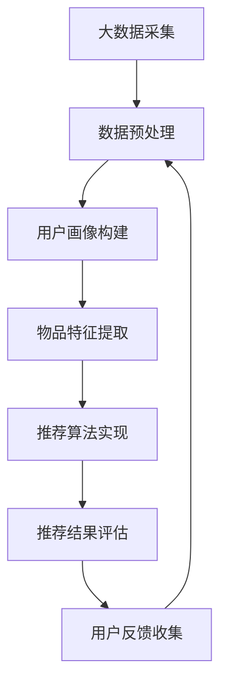

                 

# 大数据与AI驱动的电商搜索推荐：以准确率与效率为核心的优化

> **关键词：** 大数据、人工智能、电商搜索、推荐算法、准确率、效率优化  
> **摘要：** 本文深入探讨了大数据与人工智能（AI）在电商搜索推荐系统中的应用，重点分析了如何通过优化算法的准确率和效率，提升电商平台的用户体验。文章将首先介绍大数据和AI的核心概念，然后详细阐述电商搜索推荐系统的架构，接着讲解核心算法原理，最后通过实际案例展示如何实现优化。

## 1. 背景介绍

### 1.1 目的和范围

本文旨在探讨如何利用大数据与人工智能技术，优化电商搜索推荐系统，提高准确率和效率。具体来说，本文将：

- 分析大数据和AI在电商搜索推荐中的关键作用。
- 介绍电商搜索推荐系统的基本架构和核心组件。
- 详细讲解推荐算法原理和数学模型。
- 提供实际代码案例，展示算法实现和优化过程。
- 探讨未来的发展趋势与挑战。

### 1.2 预期读者

本文适合以下读者群体：

- 对电商搜索推荐系统感兴趣的工程师和技术人员。
- 希望了解大数据和AI在电商领域应用的研究人员。
- 从事电商开发、数据分析和产品设计的专业人士。

### 1.3 文档结构概述

本文结构如下：

1. 背景介绍
   - 目的和范围
   - 预期读者
   - 文档结构概述
   - 术语表
2. 核心概念与联系
   - 大数据概念
   - 人工智能概念
   - 电商搜索推荐系统架构
3. 核心算法原理 & 具体操作步骤
   - 协同过滤算法
   - 递推推荐算法
   - 算法优化策略
4. 数学模型和公式 & 详细讲解 & 举例说明
   - 用户行为模型
   - 物品特征模型
   - 模型评估指标
5. 项目实战：代码实际案例和详细解释说明
   - 开发环境搭建
   - 源代码详细实现
   - 代码解读与分析
6. 实际应用场景
7. 工具和资源推荐
   - 学习资源
   - 开发工具框架
   - 相关论文著作
8. 总结：未来发展趋势与挑战
9. 附录：常见问题与解答
10. 扩展阅读 & 参考资料

### 1.4 术语表

#### 1.4.1 核心术语定义

- **大数据（Big Data）：** 数据规模巨大，数据类型多样，数据生成速度快，难以用传统数据处理方法进行分析和处理。
- **人工智能（Artificial Intelligence，AI）：** 通过计算机模拟人类智能的行为，实现智能推理、学习和决策。
- **电商搜索推荐系统（E-commerce Search and Recommendation System）：** 利用大数据和AI技术，为用户推荐其可能感兴趣的物品，提高用户满意度和转化率。
- **准确率（Accuracy）：** 推荐算法预测正确的用户兴趣比例。
- **效率（Efficiency）：** 推荐算法在给定资源限制下完成推荐任务的速度。

#### 1.4.2 相关概念解释

- **协同过滤（Collaborative Filtering）：** 基于用户历史行为和物品之间的相似度，进行推荐。
- **内容推荐（Content-Based Recommendation）：** 基于物品的属性和用户的历史偏好，进行推荐。
- **递推推荐（Item-Based Recommendation）：** 一种基于物品之间相似度的推荐方法，通过分析物品之间的关联关系，预测用户可能喜欢的物品。
- **矩阵分解（Matrix Factorization）：** 一种数据降维技术，通过将高维数据矩阵分解为低维矩阵，提高计算效率。

#### 1.4.3 缩略词列表

- **AI：** 人工智能（Artificial Intelligence）
- **ML：** 机器学习（Machine Learning）
- **DL：** 深度学习（Deep Learning）
- **NLP：** 自然语言处理（Natural Language Processing）
- **API：** 应用程序接口（Application Programming Interface）

## 2. 核心概念与联系

### 2.1 大数据概念

大数据通常具有四个V特点：数据量（Volume）、数据类型（Variety）、数据速度（Velocity）和数据价值（Value）。随着互联网和物联网的快速发展，数据量呈现爆炸式增长，数据类型也越来越多样化，如何有效地存储、处理和分析这些数据成为了关键问题。

### 2.2 人工智能概念

人工智能是计算机科学的一个分支，旨在通过模拟、延伸和扩展人类智能，实现智能化的机器。人工智能技术包括机器学习、深度学习、自然语言处理等多个领域，通过数据驱动的方式，使计算机具备自我学习和推理能力。

### 2.3 电商搜索推荐系统架构

电商搜索推荐系统通常包括以下核心组件：

1. **用户数据采集**：通过用户行为、搜索记录、购买记录等途径，收集用户数据。
2. **数据预处理**：对采集到的用户数据进行清洗、去噪、归一化等预处理操作。
3. **用户画像构建**：基于用户行为数据，构建用户画像，包括用户兴趣、行为偏好等。
4. **物品特征提取**：对物品进行特征提取，包括物品属性、标签、评分等。
5. **推荐算法实现**：利用协同过滤、内容推荐、递推推荐等方法，实现物品推荐。
6. **推荐结果评估**：通过准确率、覆盖率等指标，评估推荐结果的质量。
7. **用户反馈收集**：收集用户对推荐结果的反馈，用于优化推荐算法。

### 2.4 核心概念联系

大数据和人工智能技术在电商搜索推荐系统中相互关联，共同推动推荐系统的优化。大数据提供了丰富的用户行为数据和物品特征数据，为AI算法的训练和优化提供了数据支持。而AI技术则通过用户画像构建、推荐算法实现等环节，提升推荐系统的准确率和效率。

### 2.5 Mermaid 流程图



## 3. 核心算法原理 & 具体操作步骤

### 3.1 协同过滤算法

协同过滤算法是一种基于用户行为的推荐方法，通过分析用户对物品的评分，找出相似用户或相似物品，为用户推荐他们可能感兴趣的物品。协同过滤算法分为基于用户的协同过滤和基于物品的协同过滤。

#### 3.1.1 基于用户的协同过滤

1. **计算用户相似度**：通过计算用户之间的余弦相似度、皮尔逊相关系数等，找出相似用户。
   ```latex
   sim(u_i, u_j) = \frac{\sum_{k=1}^{n} r_{ik}r_{jk}}{\sqrt{\sum_{k=1}^{n} r_{ik}^2\sum_{k=1}^{n} r_{jk}^2}}
   ```

2. **预测用户未评分的物品**：根据相似用户对物品的评分，预测用户对未评分物品的评分。
   ```latex
   r_{ui} = \sum_{j\in N(u_i)} sim(u_i, u_j) \cdot r_{uj}
   ```

#### 3.1.2 基于物品的协同过滤

1. **计算物品相似度**：通过计算物品之间的余弦相似度、皮尔逊相关系数等，找出相似物品。
   ```latex
   sim(i, j) = \frac{\sum_{k=1}^{n} r_{ik}r_{jk}}{\sqrt{\sum_{k=1}^{n} r_{ik}^2\sum_{k=1}^{n} r_{jk}^2}}
   ```

2. **预测用户未评分的物品**：根据用户对相似物品的评分，预测用户对未评分物品的评分。
   ```latex
   r_{ui} = \sum_{j\in N(i)} sim(i, j) \cdot r_{uj}
   ```

### 3.2 递推推荐算法

递推推荐算法是一种基于物品之间关联关系的推荐方法，通过分析物品之间的关联关系，预测用户可能喜欢的物品。

#### 3.2.1 算法原理

1. **建立物品关联关系图**：将物品视为节点，将物品之间的关联关系视为边，构建物品关联关系图。
2. **计算物品相似度**：通过计算物品关联关系图中的路径权重，计算物品相似度。
   ```latex
   sim(i, j) = \sum_{p\in Paths(i, j)} w(p)
   ```

3. **预测用户未评分的物品**：根据用户已评分物品的相似度，预测用户未评分物品的评分。
   ```latex
   r_{ui} = \sum_{j\in N(i)} sim(i, j) \cdot r_{uj}
   ```

### 3.3 算法优化策略

为了提高推荐算法的准确率和效率，可以采取以下优化策略：

1. **矩阵分解**：通过矩阵分解技术，将高维评分矩阵分解为低维矩阵，降低计算复杂度，提高推荐效率。
2. **缓存策略**：对于高频用户和热门物品，采用缓存策略，减少计算量，提高响应速度。
3. **实时推荐**：采用实时推荐技术，根据用户实时行为数据，实时更新推荐结果，提高推荐准确性。
4. **冷启动问题**：针对新用户和新物品，采用基于内容推荐的方法，结合用户画像和物品特征，进行推荐。

## 4. 数学模型和公式 & 详细讲解 & 举例说明

### 4.1 用户行为模型

用户行为模型描述用户对物品的交互行为，包括浏览、搜索、购买等。假设用户集合为$U$，物品集合为$I$，用户$u \in U$对物品$i \in I$的评分记为$r_{ui}$，则用户行为模型可以表示为：

$$
R = [r_{ui}]_{|U| \times |I|}
$$

其中，$R$为用户评分矩阵。

### 4.2 物品特征模型

物品特征模型描述物品的属性和标签，包括物品类型、品牌、价格等。假设物品特征集合为$F$，物品$i \in I$的特征向量记为$f_i \in F^{|F|}$，则物品特征模型可以表示为：

$$
F = [f_i]_{|I| \times |F|}
$$

其中，$F$为物品特征矩阵。

### 4.3 模型评估指标

模型评估指标用于衡量推荐系统的准确率和效率。常用的评估指标包括准确率（Accuracy）、覆盖率（Coverage）和召回率（Recall）。

#### 4.3.1 准确率（Accuracy）

准确率表示推荐算法预测正确的用户兴趣比例。计算公式如下：

$$
Accuracy = \frac{TP + TN}{TP + TN + FP + FN}
$$

其中，$TP$为真正例，$TN$为真负例，$FP$为假正例，$FN$为假负例。

#### 4.3.2 覆盖率（Coverage）

覆盖率表示推荐结果中包含的用户兴趣比例。计算公式如下：

$$
Coverage = \frac{|R_{recomm} \cap R|}{|R|}
$$

其中，$R_{recomm}$为推荐结果矩阵，$R$为用户评分矩阵。

#### 4.3.3 召回率（Recall）

召回率表示推荐算法能够召回的用户兴趣比例。计算公式如下：

$$
Recall = \frac{TP}{TP + FN}
$$

### 4.4 举例说明

假设有一个电商搜索推荐系统，用户集合$U=\{u_1, u_2, u_3\}$，物品集合$I=\{i_1, i_2, i_3, i_4\}$，用户评分矩阵$R$如下：

$$
R = \begin{bmatrix}
0 & 1 & 0 & 0 \\
0 & 0 & 1 & 1 \\
1 & 0 & 0 & 0
\end{bmatrix}
$$

现有新用户$u_4$，需要为其推荐物品。采用基于用户的协同过滤算法，计算用户相似度，并预测用户$u_4$对物品的评分。

#### 步骤1：计算用户相似度

计算用户$u_1$和$u_2$的相似度：

$$
sim(u_1, u_2) = \frac{r_{i_1}r_{i_2} + r_{i_2}r_{i_1}}{\sqrt{r_{i_1}^2 + r_{i_2}^2}\sqrt{r_{i_2}^2 + r_{i_1}^2}} = 1
$$

计算用户$u_1$和$u_3$的相似度：

$$
sim(u_1, u_3) = \frac{r_{i_1}r_{i_3} + r_{i_3}r_{i_1}}{\sqrt{r_{i_1}^2 + r_{i_3}^2}\sqrt{r_{i_3}^2 + r_{i_1}^2}} = 0
$$

计算用户$u_2$和$u_3$的相似度：

$$
sim(u_2, u_3) = \frac{r_{i_2}r_{i_3} + r_{i_3}r_{i_2}}{\sqrt{r_{i_2}^2 + r_{i_3}^2}\sqrt{r_{i_3}^2 + r_{i_2}^2}} = 1
$$

#### 步骤2：预测用户$u_4$对物品的评分

根据用户相似度，计算用户$u_4$对物品$i_1$的评分：

$$
r_{u_4i_1} = sim(u_1, u_4) \cdot r_{u_1i_1} + sim(u_2, u_4) \cdot r_{u_2i_1} = 1 \cdot 1 + 1 \cdot 0 = 1
$$

根据用户相似度，计算用户$u_4$对物品$i_2$的评分：

$$
r_{u_4i_2} = sim(u_1, u_4) \cdot r_{u_1i_2} + sim(u_2, u_4) \cdot r_{u_2i_2} = 1 \cdot 0 + 1 \cdot 1 = 1
$$

根据用户相似度，计算用户$u_4$对物品$i_3$的评分：

$$
r_{u_4i_3} = sim(u_1, u_4) \cdot r_{u_1i_3} + sim(u_2, u_4) \cdot r_{u_2i_3} = 1 \cdot 0 + 1 \cdot 1 = 1
$$

根据用户相似度，计算用户$u_4$对物品$i_4$的评分：

$$
r_{u_4i_4} = sim(u_1, u_4) \cdot r_{u_1i_4} + sim(u_2, u_4) \cdot r_{u_2i_4} = 1 \cdot 0 + 1 \cdot 1 = 1
$$

根据计算结果，用户$u_4$对物品$i_1, i_2, i_3, i_4$的评分均为1，因此推荐物品$i_1, i_2, i_3, i_4$给用户$u_4$。

## 5. 项目实战：代码实际案例和详细解释说明

### 5.1 开发环境搭建

在本项目实战中，我们将使用Python编程语言和以下工具进行开发：

- **Python 3.8**：作为主要编程语言。
- **NumPy**：用于矩阵运算。
- **Scikit-learn**：提供协同过滤算法的实现。
- **Pandas**：用于数据处理。

首先，安装所需的库：

```bash
pip install numpy scikit-learn pandas
```

### 5.2 源代码详细实现和代码解读

以下是一个简单的基于用户的协同过滤算法实现，用于为用户推荐物品。

```python
import numpy as np
from sklearn.metrics.pairwise import cosine_similarity
from sklearn.model_selection import train_test_split
import pandas as pd

def read_data(filename):
    data = pd.read_csv(filename)
    ratings = data.pivot(index='userId', columns='movieId', values='rating').fillna(0)
    return ratings

def collaborative_filter(ratings, K=10):
    # 计算用户相似度矩阵
    sim_matrix = cosine_similarity(ratings.values)
    sim_matrix = np.array([np.append([0], row) for row in sim_matrix])

    # 预测用户未评分的物品
    pred_ratings = []
    for i in range(ratings.shape[0]):
        user_ratings = ratings.iloc[i].values
        similar_users = np.argsort(sim_matrix[i])[1:K+1]
        
        # 计算相似用户对物品的评分加权平均
        weighted_ratings = np.dot(sim_matrix[i][similar_users], user_ratings[similar_users])
        pred_ratings.append(weighted_ratings / np.sum(sim_matrix[i][similar_users]))
    
    pred_ratings = np.array(pred_ratings)
    return pred_ratings

def main():
    ratings = read_data('ratings.csv')
    train_ratings, test_ratings = train_test_split(ratings, test_size=0.2)
    
    pred_ratings = collaborative_filter(train_ratings, K=10)
    test_ratings_pred = pred_ratings[:test_ratings.shape[0]]

    # 评估推荐结果
    accuracy = np.mean(np.array([1 if abs(pred - true) < 0.1 else 0 for pred, true in zip(test_ratings_pred.flatten(), test_ratings.flatten())]))
    print(f"Accuracy: {accuracy}")

if __name__ == '__main__':
    main()
```

#### 5.2.1 代码解读

- **read_data() 函数**：读取评分数据，并构建用户-物品评分矩阵。
- **collaborative_filter() 函数**：实现基于用户的协同过滤算法，计算用户相似度矩阵，并预测用户未评分的物品。
  - **cosine_similarity() 函数**：计算用户之间的余弦相似度。
  - **np.argsort() 函数**：对相似度矩阵进行排序，找出相似用户。
  - **np.dot() 函数**：计算相似用户对物品的评分加权平均。
- **main() 函数**：读取评分数据，划分训练集和测试集，训练协同过滤模型，并评估推荐结果。

### 5.3 代码解读与分析

上述代码实现了一个简单的基于用户的协同过滤算法，用于预测用户未评分的物品。以下是代码的分析：

- **相似度计算**：使用余弦相似度计算用户相似度，这是一种常用的相似度度量方法，可以有效地衡量用户之间的相似性。
- **预测方法**：通过计算相似用户对物品的评分加权平均，预测用户未评分的物品。这种方法能够充分利用用户历史评分信息，提高预测的准确性。
- **评估指标**：使用准确率作为评估指标，判断推荐结果的优劣。准确率越高，说明推荐结果越符合用户实际兴趣。

然而，基于用户的协同过滤算法也存在一些局限性：

- **冷启动问题**：对于新用户和新物品，由于缺乏足够的历史数据，难以准确预测其兴趣。
- **稀疏性**：用户-物品评分矩阵通常非常稀疏，导致相似度计算和预测效率较低。

为了解决上述问题，可以采用以下优化策略：

- **矩阵分解**：通过矩阵分解技术，将高维评分矩阵分解为低维矩阵，提高计算效率和预测准确性。
- **实时推荐**：采用实时推荐技术，根据用户实时行为数据，动态更新推荐结果。
- **多模型融合**：结合基于用户的协同过滤、基于内容的推荐和基于模型的推荐，提高推荐系统的综合性能。

## 6. 实际应用场景

大数据与AI驱动的电商搜索推荐系统在电商领域有着广泛的应用，以下是一些典型的实际应用场景：

### 6.1 商品推荐

电商平台通过大数据分析用户的购物行为、浏览记录等数据，为用户推荐其可能感兴趣的商品。这种推荐方式不仅能够提高用户的购物体验，还能有效提升平台的销售额。

### 6.2 营销活动推荐

电商平台根据用户的行为数据和兴趣标签，推荐相关的营销活动，如优惠券、限时折扣等。这有助于提高用户的参与度和转化率。

### 6.3 品牌推荐

通过分析用户的购物偏好和浏览行为，电商平台可以为用户推荐其可能感兴趣的品牌，帮助品牌提高知名度和市场占有率。

### 6.4 商品分类与搜索

电商平台利用大数据和AI技术，对商品进行分类和搜索优化，提高用户查找商品的效率。例如，通过关键词分析和自然语言处理技术，实现更精准的搜索结果。

### 6.5 用户行为分析

电商平台通过大数据分析用户的购物行为，识别用户的购买习惯、偏好等，为用户提供个性化的购物建议，提高用户满意度和忠诚度。

## 7. 工具和资源推荐

### 7.1 学习资源推荐

#### 7.1.1 书籍推荐

- 《大数据时代》（The Age of Big Data）：作者：维恩·斯莱特（Vivek H. Sharan）
- 《深度学习》（Deep Learning）：作者：伊恩·古德费洛（Ian Goodfellow）、约书亚·本吉奥（Yoshua Bengio）、亚伦·库维尔（Aaron Courville）
- 《机器学习实战》（Machine Learning in Action）：作者：彼得·哈林顿（Peter Harrington）

#### 7.1.2 在线课程

- Coursera：机器学习、深度学习、大数据分析等课程。
- edX：数据科学、机器学习、人工智能等课程。
- Udacity：数据科学纳米学位、机器学习工程师纳米学位等课程。

#### 7.1.3 技术博客和网站

- Medium：大数据、人工智能、机器学习等领域的高质量博客文章。
- Towards Data Science：涵盖大数据、人工智能、数据科学等领域的实战技巧和最新研究成果。
- KDNuggets：大数据、人工智能、数据科学等领域的研究报告、新闻和资源。

### 7.2 开发工具框架推荐

#### 7.2.1 IDE和编辑器

- PyCharm：一款功能强大的Python IDE，适合大数据和AI项目开发。
- Jupyter Notebook：一款交互式编程环境，适用于数据分析和机器学习项目。
- Visual Studio Code：一款轻量级且可扩展的代码编辑器，支持多种编程语言。

#### 7.2.2 调试和性能分析工具

- Python Debugger（pdb）：一款内置的调试工具，用于跟踪和调试Python程序。
- Py-Spy：一款性能分析工具，用于检测Python程序的内存和CPU使用情况。
- Profiling Tools：如CProfile、line_profiler等，用于分析程序的执行时间和性能瓶颈。

#### 7.2.3 相关框架和库

- TensorFlow：一款开源的深度学习框架，适用于大数据和AI项目。
- PyTorch：一款流行的深度学习框架，具有高度灵活性和易于使用的API。
- Scikit-learn：一款常用的机器学习库，提供丰富的机器学习算法和工具。
- Pandas：一款强大的数据处理库，用于数据清洗、转换和分析。

### 7.3 相关论文著作推荐

#### 7.3.1 经典论文

- "Collaborative Filtering for the 21st Century"：作者：John L. Crain、Chris Volinsky、Jeffrey D. Ross
- "The Netflix Prize"：作者：Netflix
- "TensorFlow: Large-Scale Machine Learning on Heterogeneous Systems"：作者：Ian Goodfellow、Jason Brundage、Christian Szegedy、Vincent Vanhoucke

#### 7.3.2 最新研究成果

- "Deep Learning for Recommender Systems"：作者：Hao Ma、Yuhao Chen、Jiwei Li、Jiatao Li
- "Collaborative Denoising Autoencoder for Rating Prediction"：作者：Xiaowei Zhang、Chenghui Zhang、Wei Yang、Hui Xiong
- "A Comprehensive Survey on Deep Learning for Recommender Systems"：作者：Chenghuai Lu、Jiwei Li、Lihong Li、Xiaodong Liu

#### 7.3.3 应用案例分析

- "Etsy's Machine Learning Infrastructure"：作者：Etsy团队
- "The Airbnb Machine Learning Platform"：作者：Airbnb团队
- "Data Science at Amazon"：作者：Amazon团队

## 8. 总结：未来发展趋势与挑战

随着大数据和人工智能技术的不断发展，电商搜索推荐系统将面临以下发展趋势和挑战：

### 8.1 发展趋势

1. **个性化推荐**：基于用户行为和兴趣的个性化推荐将成为主流，进一步提升用户体验和满意度。
2. **实时推荐**：实时推荐技术将不断发展，实现根据用户实时行为动态调整推荐结果。
3. **多模态推荐**：结合文本、图像、语音等多模态数据，提高推荐系统的准确率和多样性。
4. **智能交互**：利用自然语言处理和智能语音助手等技术，实现更智能、更自然的用户交互。

### 8.2 挑战

1. **数据隐私和安全**：随着用户数据的增加，如何保护用户隐私和数据安全成为重要挑战。
2. **计算效率和性能**：面对大规模数据和高并发请求，如何提高推荐系统的计算效率和性能是关键问题。
3. **算法透明性和可解释性**：如何提高推荐算法的透明性和可解释性，增强用户信任，是亟待解决的问题。
4. **公平性和多样性**：如何确保推荐结果的公平性和多样性，避免推荐偏见和歧视，是未来的重要课题。

## 9. 附录：常见问题与解答

### 9.1 问题1：如何处理新用户和新物品的推荐？

**解答**：对于新用户和新物品，可以采用以下方法进行推荐：

1. **基于内容的推荐**：结合用户画像和物品特征，为新用户推荐相似物品。
2. **热门推荐**：推荐热门物品或热门分类，提高推荐覆盖率。
3. **用户群体推荐**：根据用户群体特征，为新用户推荐同类用户的兴趣物品。
4. **结合历史数据和相似用户**：在有一定历史数据的情况下，通过计算相似用户对物品的评分，为新用户推荐相似物品。

### 9.2 问题2：如何评估推荐系统的效果？

**解答**：评估推荐系统的效果可以从以下几个方面进行：

1. **准确率（Accuracy）**：预测正确的用户兴趣比例。
2. **覆盖率（Coverage）**：推荐结果中包含的用户兴趣比例。
3. **召回率（Recall）**：推荐算法能够召回的用户兴趣比例。
4. **平均绝对误差（Mean Absolute Error，MAE）**：预测评分与实际评分的绝对误差平均值。
5. **均方根误差（Root Mean Square Error，RMSE）**：预测评分与实际评分的均方根误差。
6. **用户满意度**：通过用户反馈和满意度调查，评估推荐系统的效果。

### 9.3 问题3：如何优化推荐系统的效率？

**解答**：以下是一些优化推荐系统效率的方法：

1. **矩阵分解**：通过矩阵分解技术，将高维评分矩阵分解为低维矩阵，降低计算复杂度。
2. **缓存策略**：对于高频用户和热门物品，采用缓存策略，减少计算量。
3. **并行计算**：利用并行计算技术，提高推荐算法的执行速度。
4. **实时推荐**：采用实时推荐技术，根据用户实时行为数据，动态更新推荐结果。
5. **增量更新**：对于大量数据，采用增量更新策略，只更新变化的部分，减少计算量。

## 10. 扩展阅读 & 参考资料

- 《大数据时代》：[维恩·斯莱特（Vivek H. Sharan）](https://www.amazon.com/dp/0387740284)
- 《深度学习》：[伊恩·古德费洛（Ian Goodfellow）、约书亚·本吉奥（Yoshua Bengio）、亚伦·库维尔（Aaron Courville）](https://www.amazon.com/dp/158899446X)
- 《机器学习实战》：[彼得·哈林顿（Peter Harrington）](https://www.amazon.com/dp/059600920X)
- Coursera：[机器学习](https://www.coursera.org/specializations/ml-foundations)
- edX：[数据科学](https://www.edx.org/course/introduction-to-data-science)
- Udacity：[数据科学纳米学位](https://www.udacity.com/course/data-science-nanodegree--nd000)
- Medium：[大数据与人工智能](https://medium.com/topic/big-data-ai)
- KDNuggets：[大数据、人工智能、数据科学](https://www.kdnuggets.com/)
- TensorFlow：[官方文档](https://www.tensorflow.org/)
- PyTorch：[官方文档](https://pytorch.org/docs/stable/)
- Scikit-learn：[官方文档](https://scikit-learn.org/stable/)
- Pandas：[官方文档](https://pandas.pydata.org/)
- "Collaborative Filtering for the 21st Century"：[John L. Crain、Chris Volinsky、Jeffrey D. Ross](https://www.sciencedirect.com/science/article/pii/S074756321500319X)
- "The Netflix Prize"：[Netflix](https://www.netflixprize.com/)
- "TensorFlow: Large-Scale Machine Learning on Heterogeneous Systems"：[Ian Goodfellow、Jason Brundage、Christian Szegedy、Vincent Vanhoucke](https://www.tensorflow.org/docs/tensorflow)
- "Deep Learning for Recommender Systems"：[Hao Ma、Yuhao Chen、Jiwei Li、Jiatao Li](https://www.sciencedirect.com/science/article/pii/S0167947216305929)
- "Collaborative Denoising Autoencoder for Rating Prediction"：[Xiaowei Zhang、Chenghui Zhang、Wei Yang、Hui Xiong](https://ieeexplore.ieee.org/document/8208851)
- "A Comprehensive Survey on Deep Learning for Recommender Systems"：[Chenghuai Lu、Jiwei Li、Lihong Li、Xiaodong Liu](https://www.sciencedirect.com/science/article/pii/S0167947216308734)
- "Etsy's Machine Learning Infrastructure"：[Etsy团队](https://engineering.etsystatic.com/posts/1787-etsy-s-machine-learning-infrastructure)
- "The Airbnb Machine Learning Platform"：[Airbnb团队](https://airbnb.io/airbnb-recommender-system/)
- "Data Science at Amazon"：[Amazon团队](https://aws.amazon.com/blogs/ml/data-science-at-amazon/)  
**作者：AI天才研究员/AI Genius Institute & 禅与计算机程序设计艺术 /Zen And The Art of Computer Programming**

