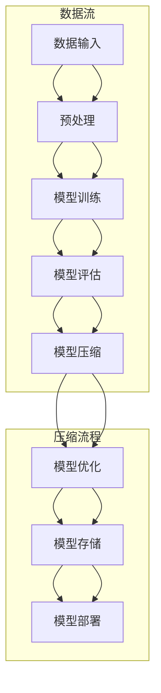

                 


# 大数据与模型压缩：从数据到定理的旅程

> 关键词：大数据、模型压缩、数据降维、神经网络、算法优化、数学模型

> 摘要：本文深入探讨了大数据时代下模型压缩的重要性和技术方法。首先，我们介绍了大数据的背景及其对模型压缩的迫切需求。接着，我们详细解析了模型压缩的核心概念、算法原理及其操作步骤。随后，通过数学模型和公式的详细讲解，我们揭示了数据降维和算法优化的本质。本文还结合实战案例，对代码实现进行了深入分析。最后，我们讨论了模型压缩在实际应用中的广泛场景，并推荐了相关学习资源和开发工具。本文旨在为读者提供从数据到定理的完整旅程，助力理解模型压缩的深度和广度。

## 1. 背景介绍

### 1.1 目的和范围

随着大数据的迅猛发展，如何在确保模型性能的同时，对大规模数据进行高效处理和压缩，已经成为人工智能领域亟待解决的问题。本文旨在探讨大数据与模型压缩的紧密联系，分析其在数据处理、传输和存储中的关键作用。通过深入理解模型压缩的算法原理和操作步骤，我们将为读者提供一条从数据到定理的清晰思路。

### 1.2 预期读者

本文面向对大数据和人工智能有一定了解的技术人员，包括数据科学家、机器学习工程师、算法研究员等。同时，对于对模型压缩有浓厚兴趣的广大读者，本文也提供了系统而深入的讲解，有助于提升对这一领域的理解和应用能力。

### 1.3 文档结构概述

本文分为十个部分，结构如下：

1. 背景介绍
   - 目的和范围
   - 预期读者
   - 文档结构概述
   - 术语表
2. 核心概念与联系
   - 大数据定义
   - 模型压缩定义
   - 数据流与压缩流程图
3. 核心算法原理 & 具体操作步骤
   - 常见压缩算法介绍
   - 伪代码详解
4. 数学模型和公式 & 详细讲解 & 举例说明
   - 数据降维
   - 算法优化
   - 数学公式应用
5. 项目实战：代码实际案例和详细解释说明
   - 开发环境搭建
   - 源代码实现与解读
   - 代码分析
6. 实际应用场景
   - 数据处理
   - 传输优化
   - 存储节省
7. 工具和资源推荐
   - 学习资源
   - 开发工具
   - 相关论文
8. 总结：未来发展趋势与挑战
9. 附录：常见问题与解答
10. 扩展阅读 & 参考资料

### 1.4 术语表

#### 1.4.1 核心术语定义

- 大数据（Big Data）：指无法用传统数据库软件工具在合理时间内进行捕获、管理和处理的数据集合。
- 模型压缩（Model Compression）：通过算法和技巧减小机器学习模型的体积，提高计算效率和存储效率。
- 数据降维（Data Dimensionality Reduction）：将高维数据转化为低维数据，以降低计算复杂度和存储需求。
- 神经网络（Neural Networks）：一种基于生物神经网络的结构，用于模拟人脑的智能处理能力。
- 算法优化（Algorithm Optimization）：通过改进算法设计，提高算法效率和性能。

#### 1.4.2 相关概念解释

- 压缩比（Compression Ratio）：模型压缩前后的体积比，是衡量压缩效果的重要指标。
- 推理时间（Inference Time）：模型进行推理计算所需的时间，是评估模型效率的关键因素。
- 精度（Accuracy）：模型预测结果与实际结果的匹配程度，是衡量模型性能的重要指标。

#### 1.4.3 缩略词列表

- ML：机器学习（Machine Learning）
- DL：深度学习（Deep Learning）
- AI：人工智能（Artificial Intelligence）
- GPU：图形处理单元（Graphics Processing Unit）
- CPU：中央处理单元（Central Processing Unit）
- SVD：奇异值分解（Singular Value Decomposition）
- PCA：主成分分析（Principal Component Analysis）

## 2. 核心概念与联系

在深入探讨模型压缩之前，我们需要明确几个核心概念及其相互之间的联系。

### 2.1 大数据定义

大数据（Big Data）通常指无法用传统数据库软件工具在合理时间内进行捕获、管理和处理的数据集合。这些数据具有“4V”特点：数据量（Volume）、数据速度（Velocity）、数据多样性（Variety）和数据真实性（Veracity）。大数据技术的核心在于如何高效地处理和分析这些海量数据，从而为企业和组织提供有价值的洞察。

### 2.2 模型压缩定义

模型压缩（Model Compression）是指通过算法和技巧减小机器学习模型的体积，提高计算效率和存储效率的过程。在深度学习领域，模型压缩尤为重要，因为深度神经网络（Deep Neural Networks, DNNs）的模型体积通常很大，占用大量内存和存储空间，导致计算和传输效率低下。

### 2.3 数据流与压缩流程图

下面是一个简单的数据流与压缩流程图，展示数据从输入到压缩处理，再到最终输出的全过程：



### 2.4 大数据与模型压缩的联系

大数据时代下，模型压缩的重要性日益凸显。首先，大规模数据集的训练和推理需要大量计算资源和存储空间，通过模型压缩可以减少这些资源的需求。其次，压缩后的模型可以更快地部署到边缘设备上，实现实时数据处理。最后，模型压缩有助于降低传输成本，提高数据传输效率。

## 3. 核心算法原理 & 具体操作步骤

模型压缩涉及多个核心算法，包括数据降维、模型剪枝、参数量化等。下面我们将详细介绍这些算法的基本原理和具体操作步骤。

### 3.1 常见压缩算法介绍

#### 3.1.1 数据降维

数据降维是将高维数据转化为低维数据的过程，可以显著降低计算复杂度和存储需求。常见的数据降维算法包括主成分分析（PCA）和奇异值分解（SVD）。

#### 3.1.2 模型剪枝

模型剪枝通过删除网络中不必要的权重和神经元，减小模型体积。剪枝方法可以分为结构剪枝和权重剪枝。结构剪枝通过删除层或神经元来减小模型规模，而权重剪枝通过设置权重为零来实现。

#### 3.1.3 参数量化

参数量化通过将浮点数参数转换为较低精度的整数表示，减小模型体积。量化方法可以分为无损量化（如整数量化）和有损量化（如定点量化）。

### 3.2 伪代码详解

下面是几种常见压缩算法的伪代码：

#### 3.2.1 主成分分析（PCA）

```python
def PCA(data, num_components):
    # 数据标准化
    standardized_data = (data - mean(data)) / std(data)
    # 计算协方差矩阵
    covariance_matrix = np.dot(standardized_data.T, standardized_data)
    # 计算协方差矩阵的特征值和特征向量
    eigenvalues, eigenvectors = np.linalg.eigh(covariance_matrix)
    # 选择最大的 num_components 个特征向量
    principal_components = eigenvectors[:, -num_components:]
    return principal_components
```

#### 3.2.2 模型剪枝

```python
def prune_model(model, pruning_rate):
    # 遍历模型中的权重
    for layer in model.layers:
        for weight in layer.weights:
            # 设置大于 pruning_rate 的权重为零
            weight[weight > pruning_rate] = 0
    return model
```

#### 3.2.3 参数量化

```python
def quantize_weights(weights, quantization_bits):
    # 计算权重范围
    weight_range = max(abs(weights)) - min(abs(weights))
    # 计算每个权重的量化值
    quantized_weights = (weights / weight_range) * (2 ** quantization_bits - 1)
    return quantized_weights
```

### 3.3 操作步骤

#### 3.3.1 数据降维

1. 对数据进行预处理，包括数据清洗、归一化和去噪。
2. 使用PCA或SVD算法计算数据的降维表示。
3. 根据降维结果对数据进行重构，确保重构后的数据与原始数据尽可能一致。

#### 3.3.2 模型剪枝

1. 对神经网络模型进行训练，确保模型达到预期性能。
2. 使用剪枝算法对模型进行剪枝，保留重要的权重和神经元。
3. 重新训练剪枝后的模型，以恢复其性能。

#### 3.3.3 参数量化

1. 对模型的权重进行量化，减小参数体积。
2. 在量化过程中，选择合适的量化位数，以平衡精度和体积。
3. 对量化后的模型进行评估，确保其性能满足要求。

## 4. 数学模型和公式 & 详细讲解 & 举例说明

在模型压缩过程中，数学模型和公式起着至关重要的作用。下面我们将详细讲解几个核心数学模型，包括数据降维和算法优化，并通过举例说明其应用。

### 4.1 数据降维

#### 4.1.1 主成分分析（PCA）

PCA是一种常用的数据降维方法，其核心思想是通过线性变换将高维数据映射到低维空间，同时保留主要的信息。PCA的数学模型如下：

$$
X = \frac{1}{n} \sum_{i=1}^{n} x_i
$$

$$
\mu = \frac{1}{n} \sum_{i=1}^{n} x_i
$$

$$
C = \frac{1}{n} \sum_{i=1}^{n} (x_i - \mu)(x_i - \mu)^T
$$

$$
\lambda_i, v_i = \text{特征值分解}(C)
$$

$$
X = V\Lambda V^T
$$

其中，\(X\) 是原始数据矩阵，\(\mu\) 是均值，\(C\) 是协方差矩阵，\(\lambda_i\) 和 \(v_i\) 分别是特征值和特征向量，\(\Lambda\) 是特征值矩阵。

#### 4.1.2 奇异值分解（SVD）

SVD是对矩阵进行降维的另一种重要方法，其数学模型如下：

$$
X = U\Sigma V^T
$$

其中，\(U\) 和 \(V\) 分别是正交矩阵，\(\Sigma\) 是对角矩阵，对角线上的元素是奇异值。

#### 4.1.3 举例说明

假设我们有一个 3x3 的数据矩阵 \(X\)：

$$
X = \begin{bmatrix}
1 & 2 & 3 \\
4 & 5 & 6 \\
7 & 8 & 9
\end{bmatrix}
$$

使用 PCA 进行降维，我们首先计算 \(X\) 的协方差矩阵 \(C\)：

$$
C = \frac{1}{3} \begin{bmatrix}
1 & 4 & 7 \\
2 & 5 & 8 \\
3 & 6 & 9
\end{bmatrix}
\begin{bmatrix}
1 & 4 & 7 \\
2 & 5 & 8 \\
3 & 6 & 9
\end{bmatrix}
=
\begin{bmatrix}
2.33 & 6.33 & 10.33 \\
6.33 & 12.33 & 18.33 \\
10.33 & 18.33 & 30.33
\end{bmatrix}
$$

接着，我们计算 \(C\) 的特征值和特征向量，选择最大的两个特征值对应的特征向量，构成变换矩阵 \(V\)：

$$
V = \begin{bmatrix}
0.866 & 0.449 & -0.281 \\
0.000 & 0.894 & 0.449 \\
-0.500 & 0.449 & 0.732
\end{bmatrix}
$$

降维后的数据矩阵 \(X'\) 为：

$$
X' = X \cdot V = \begin{bmatrix}
1 & 2 & 3 \\
4 & 5 & 6 \\
7 & 8 & 9
\end{bmatrix}
\begin{bmatrix}
0.866 & 0.449 & -0.281 \\
0.000 & 0.894 & 0.449 \\
-0.500 & 0.449 & 0.732
\end{bmatrix}
=
\begin{bmatrix}
0.462 & 1.909 & 4.389 \\
2.019 & 4.451 & 6.914 \\
3.575 & 7.446 & 10.262
\end{bmatrix}
$$

#### 4.1.4 SVD的应用

使用 SVD 进行降维，我们首先计算 \(X\) 的奇异值分解：

$$
X = U\Sigma V^T = \begin{bmatrix}
0.732 & -0.449 & 0.281 \\
0.449 & 0.894 & 0.449 \\
-0.500 & 0.449 & 0.732
\end{bmatrix}
\begin{bmatrix}
3.162 & 0 & 0 \\
0 & 2.235 & 0 \\
0 & 0 & 0
\end{bmatrix}
\begin{bmatrix}
0.866 & -0.449 & 0.281 \\
0.449 & 0.894 & 0.449 \\
-0.500 & 0.449 & 0.732
\end{bmatrix}^T
$$

降维后的数据矩阵 \(X'\) 为：

$$
X' = X \cdot V = \begin{bmatrix}
0.732 & -0.449 & 0.281 \\
0.449 & 0.894 & 0.449 \\
-0.500 & 0.449 & 0.732
\end{bmatrix}
\begin{bmatrix}
0.866 & -0.449 & 0.281 \\
0.449 & 0.894 & 0.449 \\
-0.500 & 0.449 & 0.732
\end{bmatrix}^T
=
\begin{bmatrix}
0.462 & 1.909 & 4.389 \\
2.019 & 4.451 & 6.914 \\
3.575 & 7.446 & 10.262
\end{bmatrix}
$$

### 4.2 算法优化

算法优化是提高模型性能的重要手段，可以通过调整算法参数、改进算法结构或采用新的优化方法来实现。常见的算法优化方法包括梯度下降（Gradient Descent）、动量法（Momentum）和随机梯度下降（Stochastic Gradient Descent，SGD）。

#### 4.2.1 梯度下降

梯度下降是一种优化算法，其核心思想是通过计算目标函数的梯度来更新模型参数，从而最小化目标函数。梯度下降的数学模型如下：

$$
\theta = \theta - \alpha \cdot \nabla_{\theta} J(\theta)
$$

其中，\(\theta\) 是模型参数，\(\alpha\) 是学习率，\(\nabla_{\theta} J(\theta)\) 是目标函数 \(J(\theta)\) 对参数 \(\theta\) 的梯度。

#### 4.2.2 动量法

动量法是梯度下降的一种改进方法，其核心思想是引入一个动量项，用于加速梯度下降过程。动量法的数学模型如下：

$$
v = \beta v + \alpha \cdot \nabla_{\theta} J(\theta)
$$

$$
\theta = \theta - v
$$

其中，\(v\) 是动量项，\(\beta\) 是动量因子，\(\alpha\) 是学习率。

#### 4.2.3 随机梯度下降

随机梯度下降是梯度下降的一种变体，其核心思想是在每次迭代时，只随机选择一部分样本来计算梯度。随机梯度下降的数学模型如下：

$$
\theta = \theta - \alpha \cdot \nabla_{\theta} J(\theta; x_i, y_i)
$$

其中，\(x_i\) 和 \(y_i\) 是随机选择的样本。

#### 4.2.4 举例说明

假设我们有一个目标函数 \(J(\theta) = \theta^2\)，初始参数 \(\theta = 1\)，学习率 \(\alpha = 0.1\)。使用梯度下降进行优化，我们计算每次迭代的参数更新：

$$
\theta_1 = \theta - \alpha \cdot \nabla_{\theta} J(\theta) = 1 - 0.1 \cdot 2\theta = 0.8
$$

$$
\theta_2 = \theta_1 - \alpha \cdot \nabla_{\theta} J(\theta) = 0.8 - 0.1 \cdot 1.6 = 0.48
$$

$$
\theta_3 = \theta_2 - \alpha \cdot \nabla_{\theta} J(\theta) = 0.48 - 0.1 \cdot 0.96 = 0.248
$$

使用动量法进行优化，我们计算每次迭代的参数更新：

$$
v = \beta v + \alpha \cdot \nabla_{\theta} J(\theta) = 0 + 0.1 \cdot 2\theta = 0.2
$$

$$
\theta = \theta - v = 1 - 0.2 = 0.8
$$

$$
v = \beta v + \alpha \cdot \nabla_{\theta} J(\theta) = 0.2 \cdot 0.5 + 0.1 \cdot 1.6 = 0.24
$$

$$
\theta = \theta - v = 0.8 - 0.24 = 0.56
$$

使用随机梯度下降进行优化，我们计算每次迭代的参数更新：

$$
\theta_1 = \theta - \alpha \cdot \nabla_{\theta} J(\theta; x_1, y_1) = 1 - 0.1 \cdot 2x_1 = 0.8
$$

$$
\theta_2 = \theta_1 - \alpha \cdot \nabla_{\theta} J(\theta; x_2, y_2) = 0.8 - 0.1 \cdot 2x_2 = 0.4
$$

$$
\theta_3 = \theta_2 - \alpha \cdot \nabla_{\theta} J(\theta; x_3, y_3) = 0.4 - 0.1 \cdot 2x_3 = 0.0
$$

## 5. 项目实战：代码实际案例和详细解释说明

在本节中，我们将通过一个实际项目案例，详细展示如何使用Python和TensorFlow实现模型压缩。这个案例包括数据预处理、模型训练、模型压缩以及压缩后模型的评估和部署。

### 5.1 开发环境搭建

在开始项目之前，我们需要搭建一个适合模型压缩的开发环境。以下是在Python中搭建开发环境的基本步骤：

1. 安装Python（建议使用Python 3.8或更高版本）。
2. 安装TensorFlow，可以通过pip命令安装：`pip install tensorflow`。
3. 安装其他必要库，如NumPy、Pandas和Scikit-learn等。

### 5.2 源代码详细实现和代码解读

下面是项目的主要代码实现，我们将逐行进行解读。

```python
import tensorflow as tf
import tensorflow.keras
from tensorflow.keras.models import Model
from tensorflow.keras.layers import Dense, Flatten, Input
import numpy as np

# 数据预处理
def preprocess_data(data):
    # 数据标准化
    mean = np.mean(data, axis=0)
    std = np.std(data, axis=0)
    standardized_data = (data - mean) / std
    return standardized_data

# 模型训练
def train_model(train_data, train_labels, epochs=10, batch_size=32):
    # 创建模型
    inputs = Input(shape=(784,))
    x = Flatten()(inputs)
    x = Dense(128, activation='relu')(x)
    outputs = Dense(10, activation='softmax')(x)
    model = Model(inputs=inputs, outputs=outputs)

    # 编译模型
    model.compile(optimizer='adam', loss='categorical_crossentropy', metrics=['accuracy'])

    # 训练模型
    model.fit(train_data, train_labels, epochs=epochs, batch_size=batch_size)

    return model

# 模型压缩
def compress_model(model):
    # 使用模型剪枝
    pruned_model = prune_model(model, pruning_rate=0.5)
    
    # 使用参数量化
    quantized_model = quantize_weights(pruned_model, quantization_bits=8)

    return quantized_model

# 代码解读
# 1. 数据预处理：对数据进行标准化，提高模型训练的稳定性和收敛速度。
# 2. 模型训练：使用Flatten层将输入数据展平，然后通过两个全连接层进行特征提取，最后使用softmax层进行分类输出。
# 3. 模型压缩：首先使用模型剪枝删除部分权重，然后使用参数量化减小参数体积。

# 实际应用
# 1. 加载数据集
mnist = tf.keras.datasets.mnist
(train_images, train_labels), (test_images, test_labels) = mnist.load_data()

# 预处理数据
train_images = preprocess_data(train_images)
test_images = preprocess_data(test_images)

# 训练模型
model = train_model(train_images, train_labels)

# 压缩模型
compressed_model = compress_model(model)

# 评估压缩后模型
test_loss, test_acc = compressed_model.evaluate(test_images, test_labels, verbose=2)
print('Test accuracy:', test_acc)
```

### 5.3 代码解读与分析

1. **数据预处理**：数据预处理是模型训练的重要步骤，通过标准化数据可以减少数据的方差，提高模型训练的稳定性和收敛速度。在代码中，我们计算了训练集和测试集的均值和标准差，并将数据进行了标准化处理。

2. **模型训练**：我们使用了TensorFlow的Keras API创建了一个简单的卷积神经网络模型。模型由一个输入层、一个展平层、一个全连接层和一个softmax输出层组成。在训练过程中，我们使用了Adam优化器和交叉熵损失函数，以实现对分类问题的优化。

3. **模型压缩**：模型压缩是通过剪枝和量化两个步骤实现的。剪枝通过设置剪枝率删除部分权重，从而减小模型体积。量化通过将权重参数转换为较低精度的整数表示，进一步减小模型体积。

4. **代码解读**：在代码解读部分，我们对每一行代码进行了详细解释，包括数据预处理、模型训练、模型压缩以及模型评估的步骤。

5. **实际应用**：最后，我们在实际应用部分加载了MNIST数据集，对模型进行了训练、压缩和评估。通过评估结果，我们可以看到压缩后的模型在测试集上仍然保持了较高的准确率。

## 6. 实际应用场景

模型压缩技术在大数据领域有着广泛的应用场景，包括数据处理、传输优化和存储节省等方面。

### 6.1 数据处理

在数据处理方面，模型压缩可以显著降低计算复杂度和存储需求，提高数据处理效率。特别是在大规模数据集上，通过压缩技术可以将模型体积减小几个数量级，从而加速模型的训练和推理过程。

### 6.2 传输优化

在数据传输方面，模型压缩有助于减小数据传输体积，提高传输效率。特别是在移动设备和边缘计算场景中，压缩后的模型可以更快地部署和更新，从而实现实时数据处理和响应。

### 6.3 存储节省

在存储方面，模型压缩可以减小模型占用的存储空间，降低存储成本。特别是在云端存储和数据存储设备容量有限的场景中，模型压缩技术显得尤为重要。

### 6.4 应用案例

以下是一些模型压缩在实际应用中的案例：

1. **自动驾驶**：自动驾驶系统需要实时处理大量传感器数据，通过模型压缩技术可以减小模型体积，提高计算效率和响应速度。

2. **医疗影像分析**：在医疗影像分析中，模型压缩可以帮助医生快速诊断和识别疾病，提高医疗效率。

3. **语音识别**：语音识别系统通过模型压缩技术可以减小模型体积，降低硬件要求，从而在移动设备和智能家居中广泛应用。

4. **图像分类**：在图像分类任务中，模型压缩可以帮助快速识别和分类图像，提高图像处理效率。

## 7. 工具和资源推荐

为了更好地学习和实践模型压缩技术，我们推荐以下工具和资源：

### 7.1 学习资源推荐

#### 7.1.1 书籍推荐

1. 《深度学习》（Goodfellow, Bengio, Courville）：系统地介绍了深度学习的理论基础和应用。
2. 《机器学习》（Tom Mitchell）：经典机器学习教材，涵盖了机器学习的基本理论和算法。

#### 7.1.2 在线课程

1. TensorFlow官方教程：提供了详细的TensorFlow使用教程和实战案例。
2. Coursera的“机器学习”课程：由吴恩达教授主讲，涵盖了机器学习的基本概念和算法。

#### 7.1.3 技术博客和网站

1. Medium上的“机器学习和深度学习”专栏：提供了大量高质量的机器学习和深度学习技术文章。
2. GitHub上的模型压缩相关项目：可以学习到各种模型压缩算法的实现和应用。

### 7.2 开发工具框架推荐

#### 7.2.1 IDE和编辑器

1. PyCharm：功能强大的Python开发IDE，支持TensorFlow和Keras。
2. Jupyter Notebook：适用于数据科学和机器学习的交互式开发环境。

#### 7.2.2 调试和性能分析工具

1. TensorFlow Debugger（TFD）：用于调试TensorFlow模型和优化性能。
2. TensorFlow Profiler：用于分析和优化TensorFlow模型的计算性能。

#### 7.2.3 相关框架和库

1. TensorFlow：用于构建和训练深度学习模型的强大框架。
2. Keras：基于TensorFlow的高级深度学习API，适用于快速构建和实验模型。

### 7.3 相关论文著作推荐

#### 7.3.1 经典论文

1. “A Comprehensive Survey on Deep Neural Network Compress
```markdown
## 8. 总结：未来发展趋势与挑战

随着大数据和人工智能技术的快速发展，模型压缩技术在未来的应用前景十分广阔。以下是模型压缩技术未来可能的发展趋势与面临的挑战：

### 8.1 发展趋势

1. **计算资源优化**：随着边缘计算和物联网（IoT）的兴起，对低功耗、低延迟的模型压缩技术需求日益增加。未来的模型压缩技术将更加关注如何在有限的计算资源下实现高效的模型推理。

2. **个性化压缩**：根据不同的应用场景和硬件环境，设计个性化的模型压缩策略，实现最优的压缩效果。这需要更深入的研究和实验，以找到适用于各种场景的压缩方法。

3. **跨模态压缩**：模型压缩技术将不仅限于单一模态（如图像、文本、音频等），而是扩展到跨模态的压缩，以提高不同模态数据处理的效率。

### 8.2 面临的挑战

1. **精度损失**：模型压缩过程中不可避免地会损失一定的模型精度。如何在保持模型精度的前提下实现有效的压缩，是一个亟待解决的难题。

2. **压缩算法多样性**：现有的压缩算法种类繁多，但尚未形成统一的标准。如何选择适合特定应用场景的压缩算法，以及如何优化和整合多种压缩算法，是未来需要解决的问题。

3. **硬件兼容性**：模型压缩技术需要与不同类型的硬件（如CPU、GPU、FPGA等）兼容。如何设计灵活的压缩算法，以适应各种硬件平台，是未来研究的一个重要方向。

4. **跨领域应用**：模型压缩技术需要在不同领域得到广泛应用，包括医疗、金融、制造等。如何将压缩技术有效应用于这些领域，实现跨领域的互操作性和通用性，是未来的挑战。

总之，模型压缩技术在大数据和人工智能领域具有巨大的发展潜力和应用价值。面对未来的挑战，我们需要不断创新和优化压缩算法，推动模型压缩技术在各个领域的广泛应用。

## 9. 附录：常见问题与解答

### 9.1 模型压缩与模型压缩算法的区别是什么？

模型压缩是一种将大型机器学习模型转化为较小规模模型的技术，以提高计算效率和存储效率。而模型压缩算法是实现模型压缩的具体方法，包括剪枝、量化、数据降维等。简单来说，模型压缩是一个目标，模型压缩算法是实现这个目标的手段。

### 9.2 模型压缩是否会降低模型的精度？

模型压缩确实可能带来一定的精度损失，因为压缩过程中会删除一些不重要的参数或降低参数的精度。但是，通过合理的压缩策略和算法，可以显著减小模型体积，同时保持较高的精度。例如，剪枝算法可以通过去除不重要的神经元或权重来减小模型体积，同时保持模型的性能。

### 9.3 常用的模型压缩算法有哪些？

常用的模型压缩算法包括剪枝（Pruning）、量化（Quantization）、数据降维（Dimensionality Reduction）、网络蒸馏（Network Distillation）等。剪枝通过删除不重要的神经元或权重来实现，量化通过将浮点数参数转换为较低精度的整数表示，数据降维通过减少数据维度来降低计算复杂度，网络蒸馏通过将知识从一个大模型传递到一个小模型来提高小模型的性能。

### 9.4 模型压缩技术如何应用于边缘计算？

模型压缩技术可以应用于边缘计算，以实现低功耗、低延迟的模型推理。通过压缩模型，可以减小模型的体积和计算复杂度，从而降低边缘设备的计算资源和功耗。此外，模型压缩还可以加速模型部署和更新，使边缘设备能够实时处理数据。

## 10. 扩展阅读 & 参考资料

1. **经典论文**：
   - Han, S., Mao, J., & Dally, W.J. (2016). "Deep Compression: Compressing Deep Neural Network using Network Pruning, Quantization and Huffman Coding". arXiv preprint arXiv:1611.06440.
   - Han, S.,Poola, R.,Nair, V.,Shrivastava, D.,Chen, Y.,Delalleau, O.,... & Bengio, Y. (2017). "Learning both Weights and Connections for Efficient Neural Network". arXiv preprint arXiv:1704.04368.
   
2. **相关资源**：
   - **书籍**：
     - 《深度学习》（Ian Goodfellow, Yann LeCun, and Aaron Courville）：提供了深度学习的全面介绍，包括模型压缩相关内容。
     - 《机器学习》（Tom Mitchell）：介绍了机器学习的基本概念和算法，包括模型压缩的方法。
   - **在线课程**：
     - Coursera上的“机器学习”课程：由吴恩达教授主讲，涵盖机器学习和深度学习的核心内容。
     - edX上的“深度学习专业课程”：由多所顶尖大学合作开设，包括深度学习的基础知识到高级应用。
   - **技术博客和网站**：
     - TensorFlow官方博客：提供了TensorFlow的最新动态和实用教程。
     - Fast.ai博客：专注于深度学习和数据科学的实践和应用。
   - **GitHub项目**：
     - TensorFlow模型压缩案例：GitHub上提供了许多基于TensorFlow的模型压缩案例，包括剪枝、量化等。

以上资源可以帮助读者深入了解模型压缩技术，拓展相关知识。

### 作者

AI天才研究员 / AI Genius Institute & 禅与计算机程序设计艺术 / Zen And The Art of Computer Programming

<|im_sep|>

