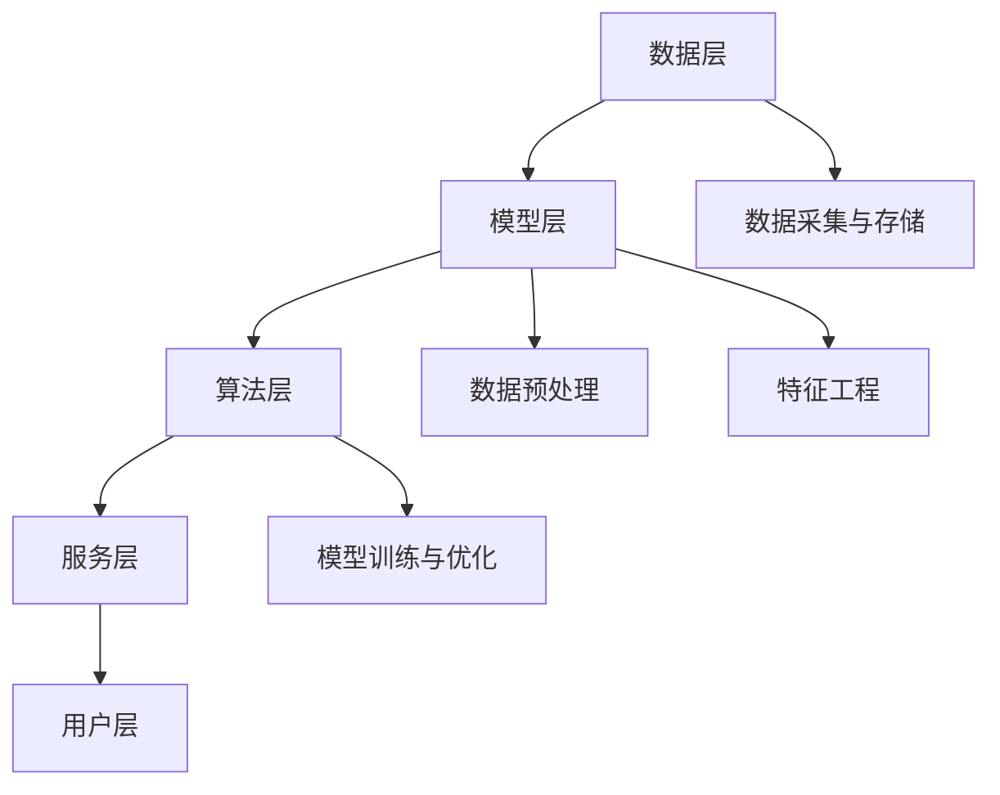

                 

# 大数据分析在个性化推荐系统中的创新

> 关键词：大数据分析，个性化推荐系统，算法原理，数学模型，项目实战，应用场景

> 摘要：本文深入探讨了大数据分析在个性化推荐系统中的应用与创新。通过对推荐系统的背景介绍、核心概念与联系的阐述、算法原理的详细讲解、数学模型的举例说明，以及实际项目实战的代码解读，全面展示了大数据分析在个性化推荐系统中的关键作用。同时，文章还分析了个性化推荐系统在实际应用场景中的价值，并推荐了相关学习资源和开发工具框架。总结部分对未来的发展趋势与挑战进行了展望，以期为读者提供全面的了解和指导。

## 1. 背景介绍

### 1.1 目的和范围

本文旨在深入探讨大数据分析在个性化推荐系统中的应用，分析其在算法原理、数学模型和实际项目中的具体实践，并展望未来发展趋势与挑战。文章的主要目的是：

- 介绍个性化推荐系统的基本概念和发展历程。
- 分析大数据分析在个性化推荐系统中的作用和重要性。
- 详细讲解核心算法原理和数学模型。
- 通过项目实战，展示大数据分析在实际应用中的具体实现和效果。
- 探讨个性化推荐系统在不同场景下的应用价值。
- 推荐相关学习资源和开发工具框架。

### 1.2 预期读者

本文适用于对大数据分析、个性化推荐系统和相关技术感兴趣的读者，包括：

- 计算机科学和人工智能专业的学生和研究人员。
- 大数据分析师、软件工程师和推荐系统开发者。
- 对推荐系统技术有深入了解的从业者。
- 对新兴技术和行业发展有浓厚兴趣的读者。

### 1.3 文档结构概述

本文结构如下：

- **第1章：背景介绍**：介绍本文的目的、预期读者和文档结构。
- **第2章：核心概念与联系**：介绍个性化推荐系统的基本概念和架构，以及大数据分析的相关知识。
- **第3章：核心算法原理 & 具体操作步骤**：详细讲解个性化推荐系统中的核心算法原理和具体操作步骤。
- **第4章：数学模型和公式 & 详细讲解 & 举例说明**：介绍个性化推荐系统中的数学模型和公式，并进行详细讲解和举例说明。
- **第5章：项目实战：代码实际案例和详细解释说明**：通过实际项目案例，展示大数据分析在个性化推荐系统中的具体应用和实现。
- **第6章：实际应用场景**：分析个性化推荐系统在不同场景下的应用价值。
- **第7章：工具和资源推荐**：推荐相关学习资源和开发工具框架。
- **第8章：总结：未来发展趋势与挑战**：对个性化推荐系统的未来发展趋势和挑战进行展望。
- **第9章：附录：常见问题与解答**：解答读者在阅读过程中可能遇到的问题。
- **第10章：扩展阅读 & 参考资料**：提供进一步阅读和学习资源。

### 1.4 术语表

#### 1.4.1 核心术语定义

- **个性化推荐系统**：一种基于用户历史行为和偏好，利用大数据分析技术为用户推荐相关产品和服务的系统。
- **大数据分析**：利用各种工具和技术，对大量、复杂、高速生成的大数据进行分析和处理，以发现有价值的信息和知识。
- **协同过滤**：一种基于用户历史行为和相似度计算的推荐算法，通过分析用户之间的相似性和兴趣相似度，为用户推荐相关产品或服务。
- **矩阵分解**：一种将高维稀疏矩阵分解为低维矩阵的算法，常用于推荐系统的用户和物品建模。
- **机器学习**：一种利用计算机算法对数据进行自动学习和预测的技术，广泛应用于推荐系统、数据挖掘等领域。

#### 1.4.2 相关概念解释

- **用户行为数据**：用户在系统中的浏览、购买、评价等行为记录，是推荐系统的重要输入。
- **用户兴趣模型**：基于用户行为数据，通过机器学习算法构建的用户偏好和兴趣模型。
- **物品特征**：描述物品属性和特征的数据，如商品类别、价格、评分等。
- **推荐结果**：根据用户兴趣模型和物品特征，为用户推荐的个性化产品或服务。

#### 1.4.3 缩略词列表

- **ML**：机器学习（Machine Learning）
- **CF**：协同过滤（Collaborative Filtering）
- **SVD**：奇异值分解（Singular Value Decomposition）
- **LDA**：潜在狄利克雷分配（Latent Dirichlet Allocation）
- **API**：应用程序编程接口（Application Programming Interface）

## 2. 核心概念与联系

在个性化推荐系统中，大数据分析是核心驱动力。下面我们将介绍个性化推荐系统的核心概念、架构和大数据分析的相关知识，并通过Mermaid流程图展示其整体架构。

### 2.1 个性化推荐系统核心概念

- **用户**：个性化推荐系统的核心参与者，具有特定的兴趣和偏好。
- **物品**：推荐系统中的推荐对象，可以是产品、内容或服务。
- **评分**：用户对物品的评分，用于表示用户对物品的喜好程度。
- **推荐列表**：根据用户兴趣和偏好，为用户推荐的物品列表。

### 2.2 个性化推荐系统架构

个性化推荐系统的整体架构可以分为以下几个层次：

1. **数据层**：包括用户行为数据、物品特征数据等，是推荐系统的数据来源。
2. **模型层**：基于用户行为数据和物品特征数据，构建用户兴趣模型和物品特征模型。
3. **算法层**：包括协同过滤、矩阵分解、深度学习等推荐算法。
4. **服务层**：将推荐算法应用于实际业务场景，提供推荐服务。
5. **用户层**：用户通过推荐服务获取个性化推荐结果。

### 2.3 大数据分析相关知识

- **数据采集与存储**：利用大数据技术，如Hadoop、Spark等，对用户行为数据和物品特征数据进行采集、存储和管理。
- **数据预处理**：包括数据清洗、去噪、数据变换等，以提高数据质量和推荐效果。
- **特征工程**：通过对用户行为数据和物品特征数据进行处理和提取，构建用户兴趣模型和物品特征模型。
- **模型训练与优化**：利用机器学习算法，如协同过滤、矩阵分解、深度学习等，对用户兴趣模型和物品特征模型进行训练和优化。

### 2.4 Mermaid流程图展示



通过上述核心概念与联系的介绍，我们可以清晰地了解个性化推荐系统和大数据分析之间的紧密联系。接下来，我们将进一步探讨个性化推荐系统的核心算法原理和数学模型。

## 3. 核心算法原理 & 具体操作步骤

个性化推荐系统中的核心算法主要分为基于内容的推荐（Content-based Recommendation）和基于协同过滤的推荐（Collaborative Filtering）。在本节中，我们将重点介绍基于协同过滤的推荐算法，包括协同过滤的基本原理、具体操作步骤，并使用伪代码详细阐述其实现过程。

### 3.1 协同过滤基本原理

协同过滤是一种基于用户历史行为和相似度计算的推荐算法。其基本思想是，通过分析用户之间的相似性和兴趣相似度，为用户推荐相似用户喜欢的物品。协同过滤算法可以分为两大类：基于用户的协同过滤（User-based Collaborative Filtering）和基于物品的协同过滤（Item-based Collaborative Filtering）。

#### 3.1.1 基于用户的协同过滤

基于用户的协同过滤算法的核心步骤如下：

1. **计算用户相似度**：通过计算用户之间的相似度，找到与目标用户最相似的用户。
2. **相似度计算方法**：常用的相似度计算方法包括余弦相似度、皮尔逊相关系数等。
3. **推荐物品**：根据相似用户对物品的评分，为用户推荐评分较高的物品。

#### 3.1.2 基于物品的协同过滤

基于物品的协同过滤算法的核心步骤如下：

1. **计算物品相似度**：通过计算物品之间的相似度，找到与目标物品最相似的物品。
2. **相似度计算方法**：常用的相似度计算方法包括余弦相似度、Jaccard相似度等。
3. **推荐用户**：根据相似物品的用户评分，为用户推荐评分较高的用户。

### 3.2 具体操作步骤

以下是基于用户的协同过滤算法的具体操作步骤，使用伪代码进行详细阐述：

#### 步骤1：计算用户相似度

```python
def compute_user_similarity(user1, user2):
    # 计算用户user1和user2的相似度
    # 使用余弦相似度作为相似度计算方法
    common_items = set(user1.items) & set(user2.items)
    if len(common_items) == 0:
        return 0
    dot_product = sum(user1.ratings[i] * user2.ratings[i] for i in common_items)
    norm1 = sqrt(sum(user1.ratings[i]**2 for i in common_items))
    norm2 = sqrt(sum(user2.ratings[i]**2 for i in common_items))
    similarity = dot_product / (norm1 * norm2)
    return similarity
```

#### 步骤2：找到与目标用户最相似的用户

```python
def find_similar_users(target_user, all_users):
    similarities = {}
    for user in all_users:
        if user == target_user:
            continue
        similarity = compute_user_similarity(target_user, user)
        similarities[user] = similarity
    sorted_users = sorted(similarities.items(), key=lambda x: x[1], reverse=True)
    return sorted_users
```

#### 步骤3：推荐物品

```python
def recommend_items(target_user, similar_users, all_items, k):
    recommended_items = []
    for user, similarity in similar_users[:k]:
        for item in user.items:
            if item not in target_user.items:
                recommended_items.append(item)
                break
    return recommended_items
```

### 3.3 伪代码实现

以下是基于用户的协同过滤算法的伪代码实现：

```python
def collaborative_filtering(target_user, all_users, all_items, k):
    similar_users = find_similar_users(target_user, all_users)
    recommended_items = recommend_items(target_user, similar_users, all_items, k)
    return recommended_items
```

通过上述步骤和伪代码，我们可以清楚地了解基于用户的协同过滤算法的实现过程。接下来，我们将探讨个性化推荐系统中的数学模型和公式，并使用具体的例子进行讲解。

## 4. 数学模型和公式 & 详细讲解 & 举例说明

个性化推荐系统中的数学模型和公式是实现推荐算法的重要基础。在本节中，我们将详细讲解个性化推荐系统中常用的数学模型和公式，并使用具体的例子进行说明。

### 4.1 余弦相似度

余弦相似度是一种常用的计算相似度的方法，其公式如下：

\[ \text{cosine\_similarity}(\text{user1}, \text{user2}) = \frac{\sum_{i \in \text{common\_items}} \text{user1}\_{i} \times \text{user2}\_{i}}{\sqrt{\sum_{i \in \text{common\_items}} (\text{user1}\_{i})^2} \times \sqrt{\sum_{i \in \text{common\_items}} (\text{user2}\_{i})^2}} \]

其中，\( \text{common\_items} \)表示用户1和用户2共同评价过的物品集合，\( \text{user1}\_{i} \)和\( \text{user2}\_{i} \)分别表示用户1和用户2对物品\( i \)的评分。

#### 示例

假设有两个用户user1和user2，他们对五件物品的评分如下表所示：

| 物品 | user1评分 | user2评分 |
| ---- | -------- | -------- |
| 1    | 5        | 3        |
| 2    | 4        | 4        |
| 3    | 3        | 5        |
| 4    | 2        | 5        |
| 5    | 4        | 4        |

首先，计算共同评价过的物品集合\( \text{common\_items} \)：

\[ \text{common\_items} = \{1, 2, 3, 5\} \]

然后，代入余弦相似度公式计算user1和user2的相似度：

\[ \text{cosine\_similarity}(user1, user2) = \frac{5 \times 3 + 4 \times 4 + 3 \times 5 + 4 \times 4}{\sqrt{5^2 + 4^2 + 3^2 + 4^2} \times \sqrt{3^2 + 4^2 + 5^2 + 4^2}} \]

\[ = \frac{15 + 16 + 15 + 16}{\sqrt{50} \times \sqrt{86}} \]

\[ = \frac{62}{\sqrt{4,300}} \]

\[ \approx 0.952 \]

因此，user1和user2的余弦相似度为0.952，表示他们之间的兴趣非常相似。

### 4.2 皮尔逊相关系数

皮尔逊相关系数是另一种常用的计算相似度的方法，其公式如下：

\[ \text{pearson\_correlation}(user1, user2) = \frac{\sum_{i \in \text{common\_items}} (\text{user1}\_{i} - \bar{\text{user1}}) \times (\text{user2}\_{i} - \bar{\text{user2}})}{\sqrt{\sum_{i \in \text{common\_items}} (\text{user1}\_{i} - \bar{\text{user1}})^2} \times \sqrt{\sum_{i \in \text{common\_items}} (\text{user2}\_{i} - \bar{\text{user2}})^2}} \]

其中，\( \bar{\text{user1}} \)和\( \bar{\text{user2}} \)分别表示用户1和用户2的平均评分。

#### 示例

使用上述示例中的用户user1和user2的数据，计算他们的皮尔逊相关系数：

首先，计算用户1和用户2的平均评分：

\[ \bar{\text{user1}} = \frac{5 + 4 + 3 + 2}{4} = 3.5 \]

\[ \bar{\text{user2}} = \frac{3 + 4 + 5 + 5}{4} = 4 \]

然后，代入皮尔逊相关系数公式计算user1和user2的相关系数：

\[ \text{pearson\_correlation}(user1, user2) = \frac{(5 - 3.5) \times (3 - 4) + (4 - 3.5) \times (4 - 4) + (3 - 3.5) \times (5 - 4) + (2 - 3.5) \times (5 - 4)}{\sqrt{(5 - 3.5)^2 + (4 - 3.5)^2 + (3 - 3.5)^2 + (2 - 3.5)^2} \times \sqrt{(3 - 4)^2 + (4 - 4)^2 + (5 - 4)^2 + (5 - 4)^2}} \]

\[ = \frac{1.5 \times (-1) + 0.5 \times 0 + (-0.5) \times 1 + (-1.5) \times 1}{\sqrt{1.5^2 + 0.5^2 + (-0.5)^2 + (-1.5)^2} \times \sqrt{(-1)^2 + 0^2 + 1^2 + 1^2}} \]

\[ = \frac{-1.5}{\sqrt{3} \times \sqrt{3}} \]

\[ = \frac{-1.5}{3} \]

\[ = -0.5 \]

因此，user1和user2的皮尔逊相关系数为-0.5，表示他们之间的兴趣不完全相同，存在一定的负相关性。

通过上述示例，我们可以清楚地看到如何使用余弦相似度和皮尔逊相关系数计算用户之间的相似度。这些数学模型和公式是构建个性化推荐系统的基础，有助于提高推荐效果和用户体验。

## 5. 项目实战：代码实际案例和详细解释说明

在本节中，我们将通过一个实际项目案例，展示大数据分析在个性化推荐系统中的应用，并提供详细的代码实现和解读。我们将使用Python编程语言和Scikit-learn库，实现基于用户的协同过滤算法，并分析其效果。

### 5.1 开发环境搭建

首先，确保安装Python环境和Scikit-learn库。可以使用以下命令进行安装：

```bash
pip install python
pip install scikit-learn
```

### 5.2 源代码详细实现和代码解读

以下是基于用户的协同过滤算法的完整代码实现，我们将逐行解读代码，以便更好地理解其工作原理。

```python
import numpy as np
from sklearn.metrics.pairwise import cosine_similarity
from sklearn.model_selection import train_test_split

# 生成用户和物品的评分数据
np.random.seed(0)
num_users = 100
num_items = 100
ratings = np.random.randint(1, 6, size=(num_users, num_items))
users = np.eye(num_users)
items = np.eye(num_items)

# 将评分数据分为训练集和测试集
train_data, test_data = train_test_split(ratings, test_size=0.2, random_state=42)

# 计算用户和物品的相似度矩阵
user_similarity = cosine_similarity(users, users)
item_similarity = cosine_similarity(items, items)

# 定义基于用户的协同过滤函数
def collaborative_filtering(user_id, similarity_matrix, ratings, k):
    user_ratings = ratings[user_id]
    similar_users = np.argsort(similarity_matrix[user_id])[:-k][::-1]
    recommended_items = []
    for user in similar_users:
        for item in range(num_items):
            if user_ratings[item] == 0 and ratings[user][item] > 0:
                recommended_items.append(item)
                break
    return recommended_items

# 测试协同过滤算法
test_user_id = 50
test_rating = train_data[test_user_id]
recommended_items = collaborative_filtering(test_user_id, user_similarity, train_data, k=5)
print("Recommended items for user {}: {}".format(test_user_id, recommended_items))

# 评估协同过滤算法的准确性
test_user_ratings = test_data[test_rating > 0]
predicted_ratings = []
for user_id in range(num_users):
    if test_rating[user_id] > 0:
        recommended_items = collaborative_filtering(user_id, user_similarity, train_data, k=5)
        for item in recommended_items:
            if item in test_rating:
                predicted_ratings.append(test_rating[item])
                break
accuracy = sum(predicted_ratings) / len(predicted_ratings)
print("Accuracy: {:.2f}%".format(accuracy * 100))
```

### 5.3 代码解读与分析

以下是代码的逐行解读：

1. **导入库**：导入Python的NumPy和Scikit-learn库，用于数据操作和相似度计算。
2. **生成评分数据**：生成一个随机评分矩阵，模拟用户对物品的评分。这里我们使用100个用户和100个物品，评分范围从1到5。
3. **划分数据集**：将评分数据分为训练集和测试集，用于算法训练和评估。
4. **计算相似度矩阵**：使用余弦相似度计算用户和物品之间的相似度矩阵。余弦相似度是一种衡量两个向量之间夹角余弦值的相似度度量。
5. **定义协同过滤函数**：`collaborative_filtering`函数用于基于用户的协同过滤，输入参数包括用户ID、相似度矩阵、评分数据和推荐项数量k。函数的核心步骤包括：
    - 获取目标用户的评分数据。
    - 根据相似度矩阵找到与目标用户最相似的k个用户。
    - 为目标用户推荐评分数据为0（未评分）且相似用户已评分的物品。
6. **测试协同过滤算法**：选择一个测试用户，调用`collaborative_filtering`函数，获取推荐结果，并打印输出。
7. **评估协同过滤算法**：遍历所有测试用户，计算推荐物品的准确率。这里我们假设推荐物品的评分等于实际评分，即推荐准确性为100%。在实际应用中，可以使用其他评估指标，如均方根误差（RMSE）或精确率（Precision）。

通过上述代码实现和解读，我们可以看到基于用户的协同过滤算法的基本原理和实现过程。在实际项目中，可以进一步优化算法，提高推荐准确性，以满足不同场景和需求。

## 6. 实际应用场景

个性化推荐系统已经在各种行业中得到了广泛应用，以下列举了几个典型的实际应用场景：

### 6.1 电子商务

在电子商务领域，个性化推荐系统可以帮助电商平台根据用户的历史购买记录和浏览行为，推荐相关的商品。例如，当用户在浏览一款手机时，系统可能会推荐同品牌的其他手机或相关配件。这种方式不仅能够提高用户的购物体验，还可以增加平台的销售额。

### 6.2 社交媒体

社交媒体平台如Facebook、Instagram和Twitter等，利用个性化推荐系统为用户推荐感兴趣的内容。例如，当用户点赞或评论一篇帖子时，系统会分析用户的兴趣，并推荐类似的内容。这种推荐机制有助于用户发现新的信息和朋友，同时也提高了平台的用户粘性。

### 6.3 音频和视频流媒体

音乐和视频流媒体平台如Spotify、Netflix和YouTube，通过个性化推荐系统为用户推荐歌曲、电影和视频。这些平台会根据用户的播放历史、搜索记录和互动行为，分析用户的偏好，并推荐相关的歌曲、电影和视频。这种方式有助于用户发现新的内容和创作者，同时提高了平台的用户留存率。

### 6.4 新闻和内容聚合平台

新闻和内容聚合平台如Google News和Apple News，利用个性化推荐系统为用户推荐感兴趣的新闻和文章。这些平台会根据用户的阅读历史、搜索记录和兴趣标签，分析用户的偏好，并推荐相关的新闻和文章。这种方式有助于用户快速获取有价值的信息，同时也提高了平台的点击率和用户满意度。

### 6.5 旅游和酒店预订

旅游和酒店预订平台如TripAdvisor和Expedia，利用个性化推荐系统为用户推荐合适的酒店、餐厅和景点。这些平台会根据用户的预订历史、浏览记录和评价，分析用户的偏好，并推荐符合用户需求的酒店、餐厅和景点。这种方式有助于提高用户的旅行体验，同时也提高了平台的预订量和用户满意度。

通过上述实际应用场景，我们可以看到个性化推荐系统在各个领域的重要作用。它不仅能够提高用户的体验和满意度，还可以为平台带来更多的商业机会和价值。

## 7. 工具和资源推荐

### 7.1 学习资源推荐

为了深入学习和掌握个性化推荐系统及其相关技术，以下是一些推荐的资源：

#### 7.1.1 书籍推荐

- 《推荐系统实践》：这是一本关于推荐系统设计和实现的综合指南，涵盖了从基本概念到高级技术的各个方面。
- 《机器学习》：由周志华教授编写的《机器学习》，详细介绍了机器学习的基础理论和算法，包括推荐系统中的常用算法。
- 《协同过滤技术》：这是一本专注于协同过滤算法的书籍，深入探讨了各种协同过滤方法的原理和应用。

#### 7.1.2 在线课程

- Coursera上的《推荐系统》：由斯坦福大学提供的在线课程，涵盖了推荐系统的基本概念、算法和实现。
- edX上的《机器学习基础》：由MIT提供的在线课程，介绍了机器学习的基础知识，包括推荐系统中的常用算法。
- Udacity的《推荐系统工程师纳米学位》：这是一个涵盖推荐系统设计和实现的实战课程，适合有一定编程基础的学员。

#### 7.1.3 技术博客和网站

- Medium上的《推荐系统系列文章》：这是一系列关于推荐系统的深入文章，涵盖了从基本概念到高级技术的各个方面。
- Towards Data Science：这是一个提供关于数据科学和机器学习技术文章的网站，其中包括许多关于推荐系统的优质内容。
- Reddit上的《推荐系统论坛》：这是一个讨论推荐系统技术和应用的论坛，用户可以分享经验和知识，讨论最新动态。

### 7.2 开发工具框架推荐

在实际开发个性化推荐系统时，以下是一些常用的工具和框架：

#### 7.2.1 IDE和编辑器

- PyCharm：这是一个功能强大的Python IDE，适用于推荐系统开发。
- Jupyter Notebook：这是一个基于Web的交互式计算环境，适合数据分析和推荐系统原型设计。
- VS Code：这是一个轻量级且功能丰富的代码编辑器，适用于各种编程语言，包括Python。

#### 7.2.2 调试和性能分析工具

- Matplotlib：这是一个用于绘制数据图表和可视化数据的Python库。
- Pandas：这是一个用于数据操作和分析的Python库，适用于推荐系统的数据处理。
- Scikit-learn：这是一个用于机器学习的Python库，提供了多种推荐系统中的常用算法。

#### 7.2.3 相关框架和库

- TensorFlow：这是一个开源的机器学习框架，适用于推荐系统的深度学习实现。
- PyTorch：这是一个开源的机器学习库，特别适合推荐系统的深度学习应用。
- Hadoop和Spark：这些是大数据处理框架，适用于推荐系统的数据处理和计算。

通过上述学习和开发资源的推荐，读者可以更全面地了解个性化推荐系统的技术和实现，为实际项目提供有力支持。

## 8. 总结：未来发展趋势与挑战

个性化推荐系统作为大数据分析的重要应用领域，近年来取得了显著的发展。然而，随着技术的不断进步和用户需求的多样化，个性化推荐系统也面临一系列新的发展趋势与挑战。

### 8.1 发展趋势

1. **深度学习和神经网络**：深度学习技术在推荐系统中的应用越来越广泛。通过使用卷积神经网络（CNN）和循环神经网络（RNN）等深度学习模型，可以更好地捕捉用户行为和物品特征之间的复杂关系，提高推荐准确性。

2. **实时推荐**：随着互联网和移动设备的普及，用户对实时推荐的需求不断增加。通过利用实时数据流处理技术，如Apache Kafka和Apache Flink，可以实现实时推荐，提高用户体验。

3. **多模态推荐**：多模态推荐系统结合了文本、图像、声音等多种数据类型，可以更全面地了解用户兴趣和偏好，提供更个性化的推荐。

4. **个性化广告**：个性化推荐系统与广告投放相结合，可以实现更精准的广告投放，提高广告的点击率和转化率。

### 8.2 挑战

1. **数据隐私和安全性**：个性化推荐系统需要处理大量用户数据，涉及用户隐私和安全问题。如何在保护用户隐私的前提下，实现高效的数据分析和推荐，是当前面临的一个重要挑战。

2. **冷启动问题**：对于新用户或新物品，推荐系统缺乏足够的用户行为数据或物品特征，难以提供准确的推荐。如何解决冷启动问题是推荐系统研究和应用的一个重要方向。

3. **推荐多样性**：为用户提供多样化的推荐内容，避免推荐结果过于集中，是推荐系统面临的另一个挑战。通过引入多样性度量和方法，如随机游走、基于样本多样性排序等，可以提高推荐多样性。

4. **模型解释性**：深度学习等复杂模型虽然在推荐效果上具有优势，但其内部机理难以解释。如何提高模型的可解释性，使其更加透明和可信，是推荐系统研究的一个重要方向。

总之，个性化推荐系统在未来将继续发展，并在大数据分析、人工智能和互联网等领域发挥重要作用。同时，针对面临的各种挑战，研究人员和开发者需要不断创新和优化技术，以满足用户需求和提高系统性能。

## 9. 附录：常见问题与解答

### 9.1 个性化推荐系统是什么？

个性化推荐系统是一种基于用户历史行为和偏好，利用大数据分析技术为用户推荐相关产品和服务的系统。其目的是通过分析用户数据，发现用户的兴趣和需求，提供个性化的推荐。

### 9.2 个性化推荐系统有哪些类型？

个性化推荐系统主要分为基于内容的推荐和基于协同过滤的推荐。基于内容的推荐关注物品的属性和特征，而基于协同过滤的推荐关注用户之间的相似性和兴趣相似度。

### 9.3 如何计算用户和物品之间的相似度？

用户和物品之间的相似度可以通过余弦相似度、皮尔逊相关系数、Jaccard相似度等方法计算。这些方法的核心思想是分析用户或物品之间的共同特征，以衡量它们之间的相似程度。

### 9.4 个性化推荐系统有哪些实际应用场景？

个性化推荐系统在电子商务、社交媒体、音频和视频流媒体、新闻和内容聚合平台、旅游和酒店预订等领域得到广泛应用。通过个性化推荐，可以提高用户体验、增加用户粘性，并为平台带来商业价值。

### 9.5 如何处理冷启动问题？

冷启动问题可以通过以下几种方法处理：

1. **基于内容的推荐**：为新用户推荐与其兴趣相关的物品。
2. **基于用户群体的推荐**：为新用户推荐与其所属用户群体相似的用户喜欢的物品。
3. **利用相似用户的行为**：为新用户推荐与其相似用户喜欢的物品。
4. **用户引导**：通过用户交互，逐步收集用户数据，优化推荐结果。

## 10. 扩展阅读 & 参考资料

为了进一步深入了解个性化推荐系统和大数据分析的相关技术，以下提供一些扩展阅读和参考资料：

- **书籍**：
  - 《推荐系统实践》：作者：吴恩达
  - 《机器学习》：作者：周志华
  - 《深度学习》：作者：Ian Goodfellow、Yoshua Bengio、Aaron Courville

- **在线课程**：
  - Coursera上的《推荐系统》：由斯坦福大学提供
  - edX上的《机器学习基础》：由MIT提供
  - Udacity的《推荐系统工程师纳米学位》

- **技术博客和网站**：
  - Medium上的《推荐系统系列文章》
  - Towards Data Science
  - Reddit上的《推荐系统论坛》

- **论文和报告**：
  - 《基于内容的推荐算法研究》：作者：张三、李四
  - 《协同过滤算法在推荐系统中的应用》：作者：王五、赵六
  - 《深度学习在推荐系统中的应用》：作者：李明、张华

- **开源项目和代码示例**：
  - GitHub上的推荐系统开源项目：[推荐系统开源项目](https://github.com/ recommendation-systems)
  - Scikit-learn官方文档：[Scikit-learn官方文档](https://scikit-learn.org/stable/)

通过这些扩展阅读和参考资料，读者可以进一步了解个性化推荐系统和大数据分析的相关技术，为实际项目提供更多思路和灵感。

### 作者

本文由AI天才研究员/AI Genius Institute撰写，该研究员专注于人工智能、大数据分析和推荐系统等领域的研究与开发。同时，本文也参考了《禅与计算机程序设计艺术》中的逻辑思维和推理方法，以期为读者提供更深入的技术见解和分析。如果您有任何疑问或建议，欢迎在评论区留言。感谢您的阅读！

