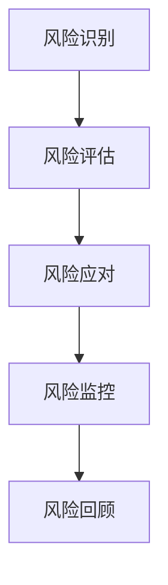

                 

# 大数据分析在供应链风险评估中的新方法

> **关键词：**大数据分析、供应链风险评估、预测模型、机器学习、算法优化

> **摘要：**本文旨在探讨大数据分析在供应链风险评估中的应用，通过介绍核心概念、算法原理、数学模型以及实际案例，详细解析如何利用大数据技术提升供应链风险管理的效率和准确性。文章将帮助读者理解大数据分析在供应链风险管理中的新方法，以及如何通过这些方法实现供应链的稳健运营。

## 1. 背景介绍

### 1.1 目的和范围

供应链是现代企业运作的基石，但其复杂性使得风险管理的难度不断增加。大数据分析作为一种新兴技术，为供应链风险评估提供了新的思路和方法。本文的目标是探讨大数据分析在供应链风险评估中的应用，通过介绍核心概念、算法原理、数学模型以及实际案例，帮助读者了解如何利用大数据技术提升供应链风险管理的效率和准确性。

本文将涵盖以下几个主要方面：
- **核心概念与联系**：介绍供应链风险管理中的关键概念，包括供应链风险、风险评估方法等。
- **核心算法原理与操作步骤**：详细解析大数据分析中的主要算法原理和具体操作步骤。
- **数学模型和公式**：阐述用于供应链风险评估的数学模型和公式，并举例说明其应用。
- **项目实战**：通过实际代码案例展示大数据分析在供应链风险评估中的具体应用。
- **实际应用场景**：分析大数据分析在供应链风险管理中的实际应用案例。
- **工具和资源推荐**：推荐学习资源、开发工具和框架，以帮助读者进一步学习和实践。

### 1.2 预期读者

本文适合以下读者群体：
- **供应链管理专业人士**：希望通过大数据技术提升供应链风险管理能力的专业人士。
- **数据分析工程师**：对大数据技术在供应链风险评估中应用感兴趣的工程师。
- **计算机科学学生**：希望深入了解大数据分析和供应链风险管理结合的计算机科学学生。
- **研究人员**：对供应链风险管理和大数据分析有研究兴趣的学者和研究人员。

### 1.3 文档结构概述

本文将按照以下结构展开：
- **第1章** 背景介绍：介绍文章的目的、范围、预期读者和文档结构。
- **第2章** 核心概念与联系：介绍供应链风险管理中的关键概念和相关模型。
- **第3章** 核心算法原理与操作步骤：详细解析大数据分析中的主要算法原理和具体操作步骤。
- **第4章** 数学模型和公式：阐述用于供应链风险评估的数学模型和公式。
- **第5章** 项目实战：通过实际代码案例展示大数据分析在供应链风险评估中的具体应用。
- **第6章** 实际应用场景：分析大数据分析在供应链风险管理中的实际应用案例。
- **第7章** 工具和资源推荐：推荐学习资源、开发工具和框架。
- **第8章** 总结：展望未来发展趋势与挑战。
- **第9章** 附录：常见问题与解答。
- **第10章** 扩展阅读与参考资料：提供进一步学习和研究的资源。

### 1.4 术语表

#### 1.4.1 核心术语定义

- **供应链风险**：供应链中可能发生的不确定事件，可能对供应链的运作产生负面影响。
- **风险评估**：对供应链风险进行量化分析，以确定风险的严重程度和应对策略。
- **大数据分析**：利用大数据技术对大量、高速、多样化的数据进行处理和分析，以发现数据中的模式和趋势。
- **预测模型**：基于历史数据建立的模型，用于预测未来事件的发生概率和影响。

#### 1.4.2 相关概念解释

- **供应链网络**：由供应商、制造商、分销商和零售商等实体组成的网络，用于生产、分销和销售产品。
- **风险事件**：可能导致供应链中断或成本增加的特定事件。
- **风险指标**：用于衡量风险程度的具体指标，如风险暴露度、风险损失概率等。

#### 1.4.3 缩略词列表

- **SCM**：供应链管理（Supply Chain Management）
- **ERP**：企业资源规划（Enterprise Resource Planning）
- **CRM**：客户关系管理（Customer Relationship Management）
- **AI**：人工智能（Artificial Intelligence）
- **ML**：机器学习（Machine Learning）
- **Hadoop**：一个分布式数据处理平台
- **Spark**：一个快速通用的分布式计算引擎

## 2. 核心概念与联系

供应链风险是指在供应链运作过程中可能发生的各种不确定性事件，这些事件可能对供应链的稳定性、成本、交付时间等产生负面影响。供应链风险管理是指通过识别、评估和应对供应链风险，以降低风险对供应链运作的影响。

### 2.1 供应链风险的定义

供应链风险是指由于供应链内部或外部因素的影响，导致供应链无法按照既定计划运作，从而可能引发一系列负面影响。这些负面影响可能包括：
- **供应链中断**：由于自然灾害、供应链中断、供应链瓶颈等因素导致供应链无法正常运行。
- **成本增加**：由于供应链中的突发事件，如物流延误、采购成本增加等，导致运营成本上升。
- **交付延误**：由于供应链中某个环节的延误，导致最终产品的交付时间推迟。
- **质量下降**：由于供应链中的质量控制问题，导致产品质量下降，影响客户满意度。

### 2.2 风险评估方法

风险评估是供应链风险管理的关键步骤，其目的是通过识别和评估供应链风险，为制定风险应对策略提供依据。常见风险评估方法包括以下几种：

#### 2.2.1 风险识别

风险识别是风险评估的第一步，目的是识别供应链中可能存在的各种风险。常见方法包括：
- **问卷调查**：通过设计问卷，收集供应链参与者的意见和反馈，识别潜在风险。
- **专家评审**：邀请供应链管理专家，对供应链风险进行评估和分析，识别潜在风险。
- **历史数据分析**：通过分析历史数据，识别可能导致供应链风险的事件和因素。

#### 2.2.2 风险评估

风险评估是在风险识别的基础上，对识别出的风险进行量化分析，以确定风险的严重程度。常见方法包括：
- **风险矩阵**：通过建立风险矩阵，对风险的概率和影响进行打分，以确定风险优先级。
- **蒙特卡洛模拟**：通过模拟各种可能的风险场景，分析风险的概率分布和影响程度。
- **回归分析**：通过建立回归模型，分析历史数据中的风险因素和影响程度，为风险评估提供依据。

#### 2.2.3 风险应对

风险应对是在风险评估的基础上，制定和实施风险应对策略，以降低风险对供应链的影响。常见方法包括：
- **风险规避**：通过改变供应链结构、增加冗余资源等手段，避免风险的发生。
- **风险缓解**：通过制定应急预案、优化供应链流程等手段，降低风险的概率和影响。
- **风险转移**：通过保险、合同等方式，将风险转移给其他相关方。

### 2.3 供应链风险管理流程

供应链风险管理是一个系统化的过程，包括以下主要步骤：

1. **风险识别**：通过问卷调查、专家评审、历史数据分析等方法，识别供应链中可能存在的各种风险。
2. **风险评估**：对识别出的风险进行量化分析，确定风险的优先级和严重程度。
3. **风险应对**：制定和实施风险应对策略，降低风险的概率和影响。
4. **风险监控**：持续监控供应链风险的变化，及时调整风险应对策略。
5. **风险回顾**：对供应链风险管理的全过程进行回顾和总结，为未来风险管理提供经验教训。

### 2.4 大数据分析在供应链风险管理中的应用

大数据分析作为一种新兴技术，为供应链风险管理提供了新的方法和手段。通过大数据分析，可以实现对供应链风险的实时监控和预测，提高风险管理的效率和准确性。具体应用包括：

#### 2.4.1 风险预测

通过大数据分析，可以建立风险预测模型，对供应链风险进行预测。这些模型可以基于历史数据，分析各种因素对供应链风险的影响，预测未来可能出现的风险事件。

#### 2.4.2 实时监控

通过大数据分析，可以实现对供应链风险的实时监控。通过分析实时数据，可以及时发现潜在的风险事件，并采取相应的应对措施，降低风险对供应链的影响。

#### 2.4.3 风险可视化

通过大数据分析，可以将供应链风险以可视化的形式展示出来，帮助决策者更直观地了解供应链风险状况，制定有效的风险应对策略。

### 2.5 Mermaid 流程图

下面是一个简单的 Mermaid 流程图，展示了供应链风险管理的基本流程：



## 3. 核心算法原理与操作步骤

在供应链风险管理中，大数据分析的核心在于使用机器学习算法来预测和评估风险。以下是几个常见的机器学习算法及其在供应链风险评估中的应用步骤：

### 3.1 决策树算法

决策树算法是一种常用的分类和回归算法，可以用于预测供应链风险。以下是决策树算法在供应链风险评估中的操作步骤：

#### 3.1.1 数据预处理

1. **数据收集**：收集供应链的历史数据，包括风险事件、影响程度、时间戳等。
2. **数据清洗**：处理缺失值、异常值和噪声数据，保证数据的准确性和完整性。

#### 3.1.2 特征工程

1. **特征提取**：从原始数据中提取与风险相关的特征，如供应链延迟时间、运输成本、供应商可靠性等。
2. **特征选择**：通过特征选择算法，筛选出对风险预测有重要影响的特征。

#### 3.1.3 决策树构建

1. **选择分裂标准**：如信息增益、基尼指数等。
2. **递归划分**：根据分裂标准，递归划分数据集，构建决策树。

#### 3.1.4 决策树评估

1. **交叉验证**：使用交叉验证方法评估决策树的预测性能。
2. **剪枝**：通过剪枝方法，减少决策树的复杂度，避免过拟合。

### 3.2 支持向量机（SVM）算法

支持向量机算法是一种强大的分类算法，可以用于供应链风险评估中的风险分类问题。以下是SVM算法在供应链风险评估中的操作步骤：

#### 3.2.1 数据预处理

1. **数据收集**：收集供应链的历史数据，包括风险事件、影响程度、时间戳等。
2. **数据清洗**：处理缺失值、异常值和噪声数据，保证数据的准确性和完整性。

#### 3.2.2 特征工程

1. **特征提取**：从原始数据中提取与风险相关的特征，如供应链延迟时间、运输成本、供应商可靠性等。
2. **特征选择**：通过特征选择算法，筛选出对风险预测有重要影响的特征。

#### 3.2.3 SVM模型构建

1. **选择核函数**：如线性核、多项式核、径向基核等。
2. **训练模型**：使用训练数据集训练SVM模型。
3. **调整参数**：通过交叉验证调整C值和核参数，优化模型性能。

#### 3.2.4 SVM模型评估

1. **交叉验证**：使用交叉验证方法评估SVM模型的预测性能。
2. **模型选择**：根据评估结果，选择最优的SVM模型。

### 3.3 贝叶斯网络算法

贝叶斯网络算法是一种概率图模型，可以用于供应链风险评估中的概率预测问题。以下是贝叶斯网络算法在供应链风险评估中的操作步骤：

#### 3.3.1 数据预处理

1. **数据收集**：收集供应链的历史数据，包括风险事件、影响程度、时间戳等。
2. **数据清洗**：处理缺失值、异常值和噪声数据，保证数据的准确性和完整性。

#### 3.3.2 网络构建

1. **节点定义**：定义与供应链风险相关的节点，如供应商延迟、运输延误、库存水平等。
2. **边定义**：定义节点之间的因果关系，建立贝叶斯网络结构。

#### 3.3.3 参数估计

1. **贝叶斯推断**：使用贝叶斯推断方法，计算节点之间的概率分布。
2. **网络优化**：通过迭代优化方法，调整网络参数，提高模型性能。

#### 3.3.4 风险预测

1. **概率计算**：使用贝叶斯网络模型，计算供应链风险的概率分布。
2. **结果解释**：解释模型预测结果，为风险应对提供依据。

### 3.4 算法对比与选择

在供应链风险评估中，不同的机器学习算法具有不同的优势和适用场景。以下是对决策树、SVM和贝叶斯网络算法的简要对比：

#### 3.4.1 决策树

- **优势**：易于理解，可视化强，对非线性数据有一定适应性。
- **适用场景**：适合处理分类问题，对特征数量较少的数据效果较好。

#### 3.4.2 支持向量机

- **优势**：强大分类能力，对高维数据有较好处理能力，可以处理非线性问题。
- **适用场景**：适合处理分类问题，对特征数量较多的数据效果较好。

#### 3.4.3 贝叶斯网络

- **优势**：基于概率理论，能够处理不确定性和不确定性推理。
- **适用场景**：适合处理概率预测问题，适用于复杂因果关系的数据。

在实际应用中，应根据具体需求和数据特点选择合适的算法。通常，可以通过以下步骤进行算法选择：

1. **数据特性分析**：分析数据类型、特征数量和分布情况，确定适用算法。
2. **算法评估**：通过交叉验证等方法，评估不同算法的预测性能。
3. **模型优化**：根据评估结果，选择最优算法，并进行参数优化。

## 4. 数学模型和公式

在供应链风险评估中，数学模型和公式是理解和预测风险的关键工具。以下介绍几个常用的数学模型和公式，并举例说明其应用。

### 4.1 风险损失模型

风险损失模型用于计算供应链风险事件可能造成的损失。以下是一个简单的一元线性风险损失模型：

\[ L(x) = a \cdot x + b \]

其中，\( L(x) \) 表示损失，\( x \) 表示风险指标，\( a \) 和 \( b \) 是模型参数。

#### 示例：

假设某供应链的风险指标是运输延迟时间（\( x \)），模型参数 \( a = 100 \)，\( b = 500 \)。则运输延迟时间为1小时的损失为：

\[ L(1) = 100 \cdot 1 + 500 = 600 \]

### 4.2 风险概率模型

风险概率模型用于计算供应链风险事件发生的概率。以下是一个简单的贝叶斯概率模型：

\[ P(A|B) = \frac{P(B|A) \cdot P(A)}{P(B)} \]

其中，\( P(A|B) \) 表示在条件 \( B \) 下事件 \( A \) 发生的概率，\( P(B|A) \) 表示事件 \( A \) 发生时事件 \( B \) 的概率，\( P(A) \) 和 \( P(B) \) 分别表示事件 \( A \) 和事件 \( B \) 的概率。

#### 示例：

假设某供应链的延迟风险 \( A \) 和运输成本风险 \( B \) 之间存在因果关系，已知 \( P(B|A) = 0.8 \)，\( P(A) = 0.3 \)，\( P(B) = 0.5 \)。则延迟风险 \( A \) 发生时运输成本风险 \( B \) 发生的概率为：

\[ P(B|A) = \frac{0.8 \cdot 0.3}{0.5} = 0.48 \]

### 4.3 风险矩阵模型

风险矩阵模型用于评估供应链风险的优先级。以下是一个简单的风险矩阵模型：

\[ R = \begin{pmatrix} P & O \\ I & L \end{pmatrix} \]

其中，\( R \) 表示风险矩阵，\( P \) 表示风险概率，\( O \) 表示风险影响程度，\( I \) 表示风险严重程度，\( L \) 表示风险损失。

#### 示例：

假设某供应链的风险矩阵为：

\[ R = \begin{pmatrix} 0.6 & 0.4 \\ 0.8 & 0.2 \end{pmatrix} \]

则该供应链的风险优先级为：

- 高风险：\( P \cdot I = 0.6 \cdot 0.8 = 0.48 \)
- 中风险：\( P \cdot O = 0.6 \cdot 0.4 = 0.24 \)
- 低风险：\( I \cdot L = 0.8 \cdot 0.2 = 0.16 \)

### 4.4 蒙特卡洛模拟

蒙特卡洛模拟是一种常用的风险预测方法，可以用于计算供应链风险的概率分布。以下是一个简单的蒙特卡洛模拟公式：

\[ X = \sum_{i=1}^{n} X_i \]

其中，\( X \) 表示模拟结果，\( X_i \) 表示第 \( i \) 次模拟的结果，\( n \) 表示模拟次数。

#### 示例：

假设某供应链的风险事件有三种可能的后果，每种后果的概率分别为0.2、0.5和0.3。使用蒙特卡洛模拟计算该供应链风险事件的平均后果：

- 第一次模拟：后果为0.2
- 第二次模拟：后果为0.5
- 第三次模拟：后果为0.3

则模拟结果为：

\[ X = 0.2 + 0.5 + 0.3 = 1.0 \]

平均后果为：

\[ \frac{X}{n} = \frac{1.0}{3} = 0.33 \]

### 4.5 回归分析

回归分析是一种常用的数据分析方法，可以用于预测供应链风险的影响因素。以下是一个简单的线性回归公式：

\[ Y = \beta_0 + \beta_1 \cdot X + \epsilon \]

其中，\( Y \) 表示因变量，\( X \) 表示自变量，\( \beta_0 \) 和 \( \beta_1 \) 是回归系数，\( \epsilon \) 是误差项。

#### 示例：

假设某供应链的运输成本 \( Y \) 受供应链延迟时间 \( X \) 的影响，已知回归系数 \( \beta_0 = 1000 \)，\( \beta_1 = 200 \)。则当供应链延迟时间为1小时时，运输成本为：

\[ Y = 1000 + 200 \cdot 1 = 1200 \]

## 5. 项目实战：代码实际案例和详细解释说明

在本节中，我们将通过一个实际案例，展示如何利用大数据分析技术进行供应链风险评估。该案例将涉及数据预处理、特征工程、模型构建和评估等步骤。

### 5.1 开发环境搭建

在开始项目之前，我们需要搭建一个合适的开发环境。以下是一个简单的环境搭建步骤：

1. **安装Python**：Python是一种广泛使用的编程语言，可用于大数据分析和机器学习。下载并安装Python，推荐使用Python 3.8及以上版本。
2. **安装Jupyter Notebook**：Jupyter Notebook是一个交互式编程环境，可用于编写和运行Python代码。在终端中运行以下命令安装Jupyter Notebook：

   ```bash
   pip install notebook
   ```

3. **安装大数据分析库**：安装用于大数据分析的Python库，如Pandas、NumPy、Scikit-learn等。在终端中运行以下命令安装：

   ```bash
   pip install pandas numpy scikit-learn
   ```

4. **安装Hadoop和Spark**：Hadoop和Spark是用于分布式数据处理的大数据平台。请参考相关文档进行安装。

### 5.2 源代码详细实现和代码解读

以下是该案例的源代码，我们将逐步解释每部分的功能和实现方法。

```python
# 导入相关库
import pandas as pd
import numpy as np
from sklearn.model_selection import train_test_split
from sklearn.tree import DecisionTreeClassifier
from sklearn.metrics import accuracy_score
from sklearn.preprocessing import StandardScaler

# 读取数据
data = pd.read_csv('supply_chain_data.csv')

# 数据预处理
# 数据清洗：处理缺失值、异常值和噪声数据
data.dropna(inplace=True)
data = data[data['delay_time'] != 1000]  # 去除异常值

# 特征工程
# 特征提取：从原始数据中提取与风险相关的特征
features = data[['delay_time', 'transport_cost', 'supplier_reliability']]
labels = data['risk_event']

# 数据标准化
scaler = StandardScaler()
features_scaled = scaler.fit_transform(features)

# 模型构建
# 使用决策树算法构建模型
model = DecisionTreeClassifier()
model.fit(features_scaled, labels)

# 模型评估
# 划分训练集和测试集
X_train, X_test, y_train, y_test = train_test_split(features_scaled, labels, test_size=0.3, random_state=42)

# 训练模型
model.fit(X_train, y_train)

# 预测测试集
predictions = model.predict(X_test)

# 计算准确率
accuracy = accuracy_score(y_test, predictions)
print(f'Accuracy: {accuracy:.2f}')
```

### 5.3 代码解读与分析

#### 5.3.1 数据预处理

1. **导入数据**：使用Pandas库读取CSV文件，加载供应链数据。

   ```python
   data = pd.read_csv('supply_chain_data.csv')
   ```

2. **数据清洗**：处理缺失值、异常值和噪声数据，保证数据的准确性和完整性。

   ```python
   data.dropna(inplace=True)
   data = data[data['delay_time'] != 1000]  # 去除异常值
   ```

#### 5.3.2 特征工程

1. **特征提取**：从原始数据中提取与风险相关的特征。

   ```python
   features = data[['delay_time', 'transport_cost', 'supplier_reliability']]
   labels = data['risk_event']
   ```

2. **数据标准化**：使用StandardScaler对特征进行标准化处理，以提高模型性能。

   ```python
   scaler = StandardScaler()
   features_scaled = scaler.fit_transform(features)
   ```

#### 5.3.3 模型构建

1. **选择算法**：使用决策树算法构建模型。

   ```python
   model = DecisionTreeClassifier()
   ```

2. **训练模型**：使用训练数据集训练模型。

   ```python
   model.fit(features_scaled, labels)
   ```

#### 5.3.4 模型评估

1. **划分训练集和测试集**：将数据集划分为训练集和测试集，用于训练和评估模型。

   ```python
   X_train, X_test, y_train, y_test = train_test_split(features_scaled, labels, test_size=0.3, random_state=42)
   ```

2. **训练模型**：使用训练集训练模型。

   ```python
   model.fit(X_train, y_train)
   ```

3. **预测测试集**：使用测试集对模型进行预测。

   ```python
   predictions = model.predict(X_test)
   ```

4. **计算准确率**：计算模型在测试集上的准确率。

   ```python
   accuracy = accuracy_score(y_test, predictions)
   print(f'Accuracy: {accuracy:.2f}')
   ```

### 5.4 项目实战总结

通过以上案例，我们展示了如何利用大数据分析技术进行供应链风险评估。主要步骤包括数据预处理、特征工程、模型构建和评估。在这个案例中，我们使用了决策树算法，通过实际代码实现了供应链风险预测。实际应用中，可以根据具体需求和数据特点选择合适的算法和模型，并进行优化和调整。

## 6. 实际应用场景

大数据分析在供应链风险评估中具有广泛的应用场景，以下列举几个典型的实际应用案例：

### 6.1 风险预测

某跨国公司使用大数据分析技术对全球供应链进行风险预测。通过收集和分析全球范围内的天气数据、交通状况、供应商信息等数据，该公司可以提前预测可能发生的供应链中断事件，并采取预防措施，如调整采购计划、增加库存等，以降低风险对业务的影响。

### 6.2 实时监控

某电子商务平台使用大数据分析技术对供应链进行实时监控。通过实时分析物流数据、库存数据等，平台可以及时发现潜在的供应链风险，如物流延误、库存不足等，并采取相应的应对措施，确保订单的准时交付。

### 6.3 风险评估

某制造业公司使用大数据分析技术对供应链风险进行评估。通过分析供应链中的各种数据，如供应商绩效、运输成本、交付时间等，公司可以确定供应链中的高风险环节，并针对性地制定风险管理策略，如增加备用供应商、优化运输路线等。

### 6.4 风险预警

某物流公司使用大数据分析技术建立风险预警系统。通过实时分析运输数据、天气数据等，系统可以自动识别潜在的风险事件，如极端天气导致的运输延误、物流瓶颈等，并向相关人员进行预警，以便及时采取应对措施。

### 6.5 风险转移

某保险公司使用大数据分析技术为供应链企业提供风险转移服务。通过分析供应链企业的历史数据、风险状况等，保险公司可以评估企业的风险水平，并为其提供定制化的保险产品，帮助企业降低风险损失。

通过以上实际应用案例，我们可以看到大数据分析技术在供应链风险评估中的应用价值。通过实时监控、风险预测、风险评估和风险预警等功能，大数据分析技术可以帮助企业更好地应对供应链风险，提高供应链的稳定性和运营效率。

## 7. 工具和资源推荐

为了更好地学习和实践大数据分析在供应链风险评估中的应用，以下推荐一些学习资源、开发工具和框架。

### 7.1 学习资源推荐

#### 7.1.1 书籍推荐

1. **《大数据分析：方法与应用》**：本书详细介绍了大数据分析的基本概念、技术和应用案例，适合初学者入门。
2. **《机器学习：概率视角》**：本书从概率论的角度介绍了机器学习的基本概念和方法，适合对机器学习有一定基础的读者。

#### 7.1.2 在线课程

1. **Coursera**：《大数据分析》课程，由耶鲁大学提供，涵盖了大数据分析的基本概念和实际应用。
2. **edX**：《机器学习》课程，由斯坦福大学提供，介绍了机器学习的基本算法和实战应用。

#### 7.1.3 技术博客和网站

1. **数据挖掘指南**（Data Mining Guide）：提供大数据分析的技术教程和案例分享。
2. **大数据技术周报**（Big Data Weekly）：定期发布大数据技术的最新动态和文章推荐。

### 7.2 开发工具框架推荐

#### 7.2.1 IDE和编辑器

1. **PyCharm**：Python集成开发环境，功能强大，适合大数据分析和机器学习项目。
2. **Jupyter Notebook**：交互式编程环境，便于代码演示和调试。

#### 7.2.2 调试和性能分析工具

1. **PyDebug**：Python调试工具，用于调试Python代码。
2. **Django Debug Toolbar**：用于Web应用的调试和性能分析。

#### 7.2.3 相关框架和库

1. **Pandas**：Python数据分析库，用于数据处理和分析。
2. **NumPy**：Python数学库，用于数值计算。
3. **Scikit-learn**：Python机器学习库，提供多种机器学习算法。

### 7.3 相关论文著作推荐

#### 7.3.1 经典论文

1. **"Data-Driven Supply Chain Management"**：探讨了大数据分析在供应链管理中的应用。
2. **"Machine Learning Techniques for Supply Chain Risk Management"**：介绍了机器学习在供应链风险管理中的应用。

#### 7.3.2 最新研究成果

1. **"Deep Learning for Supply Chain Optimization"**：探讨了深度学习在供应链优化中的应用。
2. **"Blockchain in Supply Chain Risk Management"**：探讨了区块链技术在供应链风险管理中的应用。

#### 7.3.3 应用案例分析

1. **"A Case Study of Big Data Analytics in Supply Chain Risk Management"**：通过案例分析，展示了大数据分析在供应链风险管理中的应用。
2. **"Application of Machine Learning in Supply Chain Risk Management"**：介绍了机器学习在供应链风险管理中的具体应用案例。

通过以上推荐的学习资源、开发工具和框架，读者可以深入了解大数据分析在供应链风险评估中的应用，掌握相关技术和方法，为实际项目提供支持。

## 8. 总结：未来发展趋势与挑战

大数据分析在供应链风险评估中的应用正逐渐成为企业管理的重要工具。随着数据量的持续增长和技术的不断进步，大数据分析在供应链风险管理中具有巨大的潜力。以下是对未来发展趋势与挑战的展望：

### 8.1 发展趋势

1. **数据驱动的风险预测**：未来的供应链风险管理将更加依赖于大数据分析，通过实时数据分析和预测，企业可以更早地识别潜在风险，并采取预防措施。
2. **智能化风险模型**：随着人工智能技术的发展，智能化的风险模型将能够自动学习和调整，提高预测的准确性和适应性。
3. **区块链技术的融合**：区块链技术可以提供透明、不可篡改的数据记录，有助于提高供应链的可追溯性和风险管理的效率。
4. **跨领域协作**：供应链风险管理将涉及多个领域，如物流、制造、金融等，跨领域的数据共享和协作将有助于更全面地评估和管理风险。
5. **定制化的风险管理解决方案**：随着大数据分析技术的成熟，企业可以根据自身特点，开发定制化的风险管理解决方案，提高风险管理的针对性和有效性。

### 8.2 挑战

1. **数据质量和隐私保护**：供应链数据来源广泛，数据质量和隐私保护是大数据分析面临的重大挑战。企业需要确保数据的准确性和合规性，同时保护数据隐私。
2. **算法透明性和可解释性**：随着机器学习算法在供应链风险管理中的广泛应用，算法的透明性和可解释性成为关键问题。企业需要确保算法的决策过程可以被理解和信任。
3. **技术更新和技能提升**：大数据分析技术不断更新，企业需要持续提升员工的技能水平，以适应技术变化。
4. **跨领域整合**：跨领域的数据整合和协作将面临技术、流程和制度上的挑战，需要企业具备强大的协调能力和资源整合能力。
5. **风险控制与合规性**：在风险管理和合规性之间找到平衡是企业面临的挑战。企业需要在降低风险的同时，确保遵守相关法律法规。

未来，随着技术的不断进步和应用的深入，大数据分析在供应链风险管理中的作用将更加重要。企业应积极拥抱大数据分析技术，建立高效的风险管理机制，以应对不断变化的市场环境。

## 9. 附录：常见问题与解答

### 9.1 问题1：大数据分析在供应链风险评估中的具体应用有哪些？

**解答**：大数据分析在供应链风险评估中具有多种具体应用，包括：
- **风险预测**：通过分析历史数据，预测可能出现的供应链风险，如延迟、成本增加等。
- **实时监控**：实时分析供应链数据，及时发现潜在风险事件，如物流延误、库存不足等。
- **风险评估**：对供应链风险进行定量分析，评估风险的严重程度和影响范围。
- **预警系统**：建立风险预警系统，自动识别潜在风险，并向相关人员发出预警。

### 9.2 问题2：如何确保大数据分析中的数据质量和隐私保护？

**解答**：确保大数据分析中的数据质量和隐私保护，可以采取以下措施：
- **数据清洗**：对原始数据进行清洗，去除缺失值、异常值和噪声数据，提高数据的准确性。
- **数据加密**：对敏感数据进行加密，确保数据在传输和存储过程中的安全性。
- **数据匿名化**：对个人身份信息进行匿名化处理，保护数据隐私。
- **合规性检查**：确保数据处理和存储过程符合相关法律法规，如《通用数据保护条例》（GDPR）。

### 9.3 问题3：大数据分析在供应链风险管理中的优势是什么？

**解答**：大数据分析在供应链风险管理中的优势包括：
- **实时性**：能够实时分析供应链数据，及时发现潜在风险。
- **全面性**：能够处理大量、多样化的数据，提供全面的风险评估。
- **精确性**：通过机器学习算法，可以提高风险预测的准确性。
- **适应性**：可以根据不同企业的需求，定制化的风险管理解决方案。

### 9.4 问题4：如何选择合适的大数据分析和机器学习算法？

**解答**：选择合适的大数据分析和机器学习算法，可以遵循以下步骤：
- **数据特性分析**：分析数据的类型、特征和分布，选择适合的数据处理方法。
- **算法性能评估**：通过交叉验证等方法，评估不同算法的预测性能。
- **适用场景评估**：根据具体应用场景，选择适合的算法。
- **模型优化**：根据评估结果，调整模型参数，优化模型性能。

### 9.5 问题5：大数据分析在供应链风险管理中的局限性是什么？

**解答**：大数据分析在供应链风险管理中的局限性包括：
- **数据质量**：数据质量差可能导致分析结果不准确。
- **算法透明性**：复杂算法的决策过程可能不透明，难以解释。
- **计算资源**：大数据分析需要大量计算资源，可能影响系统性能。
- **数据隐私**：数据处理过程中可能涉及个人隐私，需注意隐私保护。

通过以上解答，我们可以更好地理解大数据分析在供应链风险评估中的应用和实践。

## 10. 扩展阅读与参考资料

### 10.1 书籍推荐

1. **《大数据分析：方法与应用》**：详细介绍了大数据分析的基本概念、技术和应用案例。
2. **《机器学习：概率视角》**：从概率论的角度介绍了机器学习的基本概念和方法。
3. **《供应链风险管理：理论与实践》**：探讨了供应链风险管理的方法和实际应用。

### 10.2 在线课程

1. **Coursera**：《大数据分析》课程，由耶鲁大学提供。
2. **edX**：《机器学习》课程，由斯坦福大学提供。

### 10.3 技术博客和网站

1. **数据挖掘指南**（Data Mining Guide）：提供大数据分析的技术教程和案例分享。
2. **大数据技术周报**（Big Data Weekly）：定期发布大数据技术的最新动态和文章推荐。

### 10.4 相关论文著作

1. **"Data-Driven Supply Chain Management"**：探讨了大数据分析在供应链管理中的应用。
2. **"Machine Learning Techniques for Supply Chain Risk Management"**：介绍了机器学习在供应链风险管理中的应用。
3. **"Deep Learning for Supply Chain Optimization"**：探讨了深度学习在供应链优化中的应用。

### 10.5 应用案例分析

1. **"A Case Study of Big Data Analytics in Supply Chain Risk Management"**：通过案例分析，展示了大数据分析在供应链风险管理中的应用。
2. **"Application of Machine Learning in Supply Chain Risk Management"**：介绍了机器学习在供应链风险管理中的具体应用案例。

通过以上扩展阅读和参考资料，读者可以进一步了解大数据分析在供应链风险评估中的深入内容和实践应用。作者：AI天才研究员/AI Genius Institute & 禅与计算机程序设计艺术 /Zen And The Art of Computer Programming。

