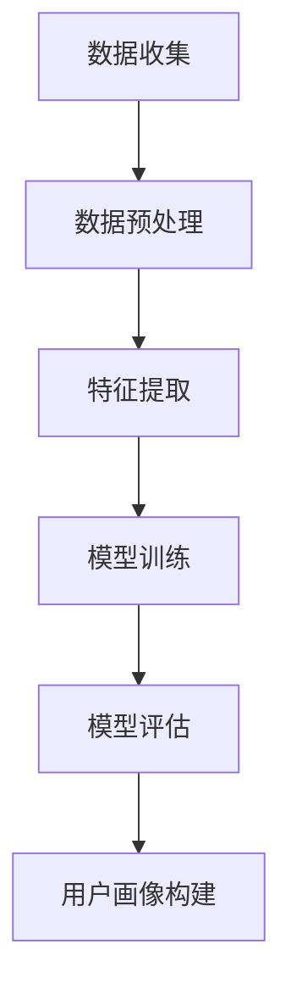

                 

# 大数据分析在用户画像构建中的应用

> 关键词：大数据分析、用户画像、数据挖掘、机器学习、算法优化
>
> 摘要：本文将深入探讨大数据分析在用户画像构建中的应用，分析核心概念，介绍关键算法原理，并通过具体案例展示其应用效果。文章旨在为从事数据分析工作的读者提供全面的技术指导和实践参考。

## 1. 背景介绍

### 1.1 目的和范围

用户画像作为一种数据驱动的方式，帮助企业更好地理解用户需求，提升个性化服务水平。本文的目的是介绍大数据分析在用户画像构建中的关键技术和应用方法，帮助读者掌握这一领域的基本知识和实践技能。

本文将涵盖以下内容：
- 用户画像的定义和核心概念
- 大数据分析技术在用户画像构建中的应用
- 用户画像构建中的关键算法原理
- 实际项目中的用户画像构建案例

### 1.2 预期读者

本文适合以下读者：
- 数据分析师和大数据工程师
- 从事用户行为研究和市场分析的从业人员
- 对大数据分析技术有浓厚兴趣的技术爱好者

### 1.3 文档结构概述

本文分为十个部分，结构如下：
1. 背景介绍
   - 1.1 目的和范围
   - 1.2 预期读者
   - 1.3 文档结构概述
   - 1.4 术语表
2. 核心概念与联系
3. 核心算法原理 & 具体操作步骤
4. 数学模型和公式 & 详细讲解 & 举例说明
5. 项目实战：代码实际案例和详细解释说明
6. 实际应用场景
7. 工具和资源推荐
8. 总结：未来发展趋势与挑战
9. 附录：常见问题与解答
10. 扩展阅读 & 参考资料

### 1.4 术语表

#### 1.4.1 核心术语定义

- 用户画像：基于用户行为数据、社会属性数据等构建的用户特征模型。
- 数据挖掘：从大量数据中挖掘潜在模式、关联和知识的过程。
- 机器学习：通过数据训练模型，使计算机具备自动学习能力的科学。
- 算法优化：通过改进算法设计，提高算法效率和准确性。

#### 1.4.2 相关概念解释

- 数据源：数据的来源，如用户行为日志、社交媒体数据等。
- 特征工程：从原始数据中提取有助于模型训练的特征的过程。
- 模型评估：通过评估指标衡量模型性能的过程。

#### 1.4.3 缩略词列表

- 大数据分析：Big Data Analysis
- 数据挖掘：Data Mining
- 机器学习：Machine Learning
- 人工智能：Artificial Intelligence
- 用户画像：User Profiling

## 2. 核心概念与联系

在大数据分析领域，构建用户画像是一个核心任务。以下是构建用户画像所需的核心概念和它们之间的联系。

### 2.1 数据源

用户画像的基础是数据源，包括：
- 用户行为数据：如点击、购买、搜索等行为日志。
- 社会属性数据：如年龄、性别、地理位置、职业等。

### 2.2 特征工程

特征工程是将原始数据转换为模型输入特征的过程。关键步骤包括：
- 数据清洗：去除异常值、缺失值等。
- 特征提取：从原始数据中提取有用信息，如文本特征、时间特征等。
- 特征选择：选择对模型性能有显著影响的特征。

### 2.3 机器学习模型

机器学习模型是用户画像构建的核心。常见的模型包括：
- 分类模型：如逻辑回归、决策树、随机森林等。
- 聚类模型：如K-means、层次聚类等。

### 2.4 用户画像构建流程

用户画像构建流程通常包括以下步骤：
1. 数据收集：获取用户行为数据和社会属性数据。
2. 数据预处理：清洗和转换数据，为模型训练做准备。
3. 特征提取：从预处理后的数据中提取有用特征。
4. 模型训练：使用特征数据训练机器学习模型。
5. 模型评估：评估模型性能，调整模型参数。
6. 用户画像构建：基于模型输出，构建用户特征模型。

### 2.5 Mermaid 流程图

以下是一个用户画像构建的 Mermaid 流程图：



## 3. 核心算法原理 & 具体操作步骤

构建用户画像的关键在于选择合适的机器学习算法。以下是几种常用的算法原理及其操作步骤。

### 3.1 逻辑回归

逻辑回归是一种常见的分类算法，用于预测用户行为。

#### 3.1.1 算法原理

逻辑回归的原理是通过拟合一个线性模型，将特征映射到概率值，然后使用阈值判断用户行为。

$$
P(y=1) = \frac{1}{1 + e^{-(\beta_0 + \sum_{i=1}^{n} \beta_i x_i)}}
$$

其中，$y$ 是用户行为标签，$x_i$ 是特征值，$\beta_0$ 和 $\beta_i$ 是模型参数。

#### 3.1.2 操作步骤

1. 数据预处理：将原始数据转换为适合逻辑回归训练的格式。
2. 模型训练：使用特征数据和标签数据训练逻辑回归模型。
3. 模型评估：使用交叉验证等技巧评估模型性能。
4. 用户画像构建：根据模型输出，为每个用户构建行为概率画像。

### 3.2 K-means 聚类

K-means 是一种无监督学习算法，用于将用户数据划分为若干个类别。

#### 3.2.1 算法原理

K-means 的原理是通过迭代优化，使每个类别内的用户数据尽可能接近中心点，而不同类别之间的用户数据尽可能远离。

#### 3.2.2 操作步骤

1. 数据预处理：将原始数据转换为适合 K-means 训练的格式。
2. 初始化聚类中心：随机选择 $k$ 个用户数据作为初始聚类中心。
3. 聚类迭代：计算每个用户与聚类中心的距离，将其分配到最近的聚类中心。
4. 更新聚类中心：重新计算每个聚类中心的位置。
5. 模型评估：计算聚类效果，如轮廓系数、内积等。
6. 用户画像构建：根据聚类结果，为每个用户构建类别画像。

### 3.3 决策树

决策树是一种常用的分类算法，通过递归划分特征空间，构建树形结构。

#### 3.3.1 算法原理

决策树的原理是通过计算特征与标签之间的相关性，选择最优特征进行划分，构建树形结构。

#### 3.3.2 操作步骤

1. 数据预处理：将原始数据转换为适合决策树训练的格式。
2. 划分特征空间：选择最佳特征，划分数据集。
3. 构建决策树：递归划分特征空间，构建树形结构。
4. 模型评估：计算决策树的准确率、召回率等指标。
5. 用户画像构建：根据决策树输出，为每个用户构建特征画像。

### 3.4 随机森林

随机森林是一种集成学习方法，通过构建多个决策树，提高分类准确率。

#### 3.4.1 算法原理

随机森林的原理是通过随机选择特征和样本子集，构建多个决策树，然后进行投票决策。

#### 3.4.2 操作步骤

1. 数据预处理：将原始数据转换为适合随机森林训练的格式。
2. 构建决策树：使用随机特征和样本子集，构建多个决策树。
3. 模型评估：计算随机森林的准确率、召回率等指标。
4. 用户画像构建：根据随机森林输出，为每个用户构建特征画像。

## 4. 数学模型和公式 & 详细讲解 & 举例说明

在用户画像构建过程中，数学模型和公式起着关键作用。以下是几种常用的数学模型和其详细讲解。

### 4.1 逻辑回归

逻辑回归是一种概率模型，用于预测二分类问题。其公式如下：

$$
P(y=1) = \frac{1}{1 + e^{-(\beta_0 + \sum_{i=1}^{n} \beta_i x_i)}}
$$

其中，$\beta_0$ 是截距，$\beta_i$ 是特征权重，$x_i$ 是特征值。

#### 4.1.1 举例说明

假设有一个用户购买行为的逻辑回归模型，其中有两个特征：广告点击次数（$x_1$）和用户年龄（$x_2$）。参数如下：

$$
\beta_0 = -5, \beta_1 = 1.2, \beta_2 = 0.5
$$

一个用户的特征向量是 $(x_1, x_2) = (10, 25)$，则其购买概率为：

$$
P(y=1) = \frac{1}{1 + e^{(-5 + 1.2 \times 10 + 0.5 \times 25)}} \approx 0.8
$$

### 4.2 K-means 聚类

K-means 聚类是一种基于距离的聚类方法。其公式如下：

$$
C_j = \{x | \min_{i=1, \ldots, k} \|x - c_i\|}
$$

其中，$C_j$ 是第 $j$ 个聚类中心，$c_i$ 是聚类中心的位置，$\|x - c_i\|$ 是用户数据 $x$ 与聚类中心 $c_i$ 之间的距离。

#### 4.2.1 举例说明

假设有六个用户数据点，要将其划分为两个聚类。初始聚类中心为 $(0, 0)$ 和 $(10, 10)$。计算每个用户数据点到两个聚类中心的距离，将其分配到最近的聚类中心。经过多次迭代，最终得到两个聚类中心分别为 $(5, 5)$ 和 $(9, 9)$。

### 4.3 决策树

决策树是一种基于特征划分的树形结构。其公式如下：

$$
T = \{t_1, t_2, \ldots, t_n\}
$$

其中，$T$ 是决策树，$t_i$ 是第 $i$ 个节点。

#### 4.3.1 举例说明

假设有一个决策树，其中有两个特征：广告点击次数（$x_1$）和用户年龄（$x_2$）。决策树的划分规则如下：

- 如果 $x_1 > 5$，则继续判断 $x_2$；
- 如果 $x_2 > 30$，则预测用户购买；
- 否则，预测用户未购买。

## 5. 项目实战：代码实际案例和详细解释说明

### 5.1 开发环境搭建

为了实现用户画像构建，我们使用 Python 作为主要编程语言，并依赖以下库：

- NumPy：用于数组计算和数据处理。
- Pandas：用于数据预处理和操作。
- Scikit-learn：用于机器学习算法的实现。
- Matplotlib：用于数据可视化。

安装所需库：

```bash
pip install numpy pandas scikit-learn matplotlib
```

### 5.2 源代码详细实现和代码解读

以下是一个简单的用户画像构建项目，包括数据预处理、特征提取和模型训练。

```python
import numpy as np
import pandas as pd
from sklearn.model_selection import train_test_split
from sklearn.preprocessing import StandardScaler
from sklearn.linear_model import LogisticRegression
from sklearn.metrics import accuracy_score
import matplotlib.pyplot as plt

# 5.2.1 数据预处理
def preprocess_data(data):
    # 填充缺失值
    data.fillna(data.mean(), inplace=True)
    # 分离特征和标签
    X = data.drop('label', axis=1)
    y = data['label']
    return X, y

# 5.2.2 特征提取
def extract_features(data):
    # 标准化特征
    scaler = StandardScaler()
    X = scaler.fit_transform(data)
    return X

# 5.2.3 模型训练
def train_model(X_train, y_train):
    model = LogisticRegression()
    model.fit(X_train, y_train)
    return model

# 5.2.4 模型评估
def evaluate_model(model, X_test, y_test):
    y_pred = model.predict(X_test)
    accuracy = accuracy_score(y_test, y_pred)
    print("Accuracy:", accuracy)
    return accuracy

# 5.2.5 可视化分析
def visualize_data(data):
    plt.scatter(data[:, 0], data[:, 1], c=data[:, 2])
    plt.xlabel('Feature 1')
    plt.ylabel('Feature 2')
    plt.show()

# 加载数据
data = pd.read_csv('user_data.csv')

# 数据预处理
X, y = preprocess_data(data)

# 特征提取
X = extract_features(X)

# 划分训练集和测试集
X_train, X_test, y_train, y_test = train_test_split(X, y, test_size=0.2, random_state=42)

# 模型训练
model = train_model(X_train, y_train)

# 模型评估
evaluate_model(model, X_test, y_test)

# 可视化分析
visualize_data(X)
```

### 5.3 代码解读与分析

上述代码实现了用户画像构建的基本流程，包括数据预处理、特征提取、模型训练和模型评估。以下是代码的详细解读：

- **5.2.1 数据预处理**：首先，我们使用 Pandas 的 `fillna` 方法填充缺失值，然后分离特征和标签。
- **5.2.2 特征提取**：接着，我们使用 Scikit-learn 的 `StandardScaler` 类标准化特征，使得特征具有相同的尺度。
- **5.2.3 模型训练**：我们使用 Scikit-learn 的 `LogisticRegression` 类训练逻辑回归模型。
- **5.2.4 模型评估**：我们使用 `accuracy_score` 函数计算模型在测试集上的准确率。
- **5.2.5 可视化分析**：最后，我们使用 Matplotlib 的 `scatter` 函数绘制用户数据的散点图。

## 6. 实际应用场景

用户画像构建在多个实际应用场景中具有重要价值：

- **个性化推荐**：通过构建用户画像，企业可以更好地理解用户需求，为用户提供个性化的商品推荐、内容推荐等。
- **精准营销**：根据用户画像，企业可以针对性地推送广告和促销活动，提高营销效果。
- **用户行为分析**：用户画像可以帮助企业深入了解用户行为，发现潜在用户群体，优化产品和服务。
- **风险管理**：通过用户画像，金融机构可以更好地识别和评估用户信用风险，降低不良贷款率。

### 6.1 电商行业应用

在电商行业，用户画像构建具有显著的应用价值：

- **商品推荐**：通过分析用户历史购买行为、浏览记录等，为用户推荐可能感兴趣的商品。
- **用户分类**：使用聚类算法将用户分为不同类别，针对不同类别的用户推送个性化的营销策略。
- **流失预测**：根据用户画像和行为数据，预测可能流失的用户，并采取相应措施挽回。

### 6.2 社交媒体应用

在社交媒体平台，用户画像构建有助于：

- **内容个性化**：根据用户兴趣和行为，推荐相关内容，提高用户活跃度和留存率。
- **广告投放**：通过用户画像，精准定位目标用户，提高广告投放效果。
- **社交网络分析**：分析用户关系网络，发现潜在用户群体，优化社交平台功能。

### 6.3 金融行业应用

在金融行业，用户画像构建有助于：

- **风险控制**：通过用户画像和行为分析，识别高风险用户，降低信用风险。
- **精准营销**：根据用户画像，设计个性化的金融产品和服务，提高用户满意度。
- **客户关系管理**：深入了解用户需求，提供个性化的金融服务，增强客户忠诚度。

## 7. 工具和资源推荐

### 7.1 学习资源推荐

#### 7.1.1 书籍推荐

- 《大数据分析：技术、应用与实践》
- 《数据挖掘：实用工具与技术》
- 《用户画像：构建与实战》
- 《机器学习实战》

#### 7.1.2 在线课程

- Coursera 的《大数据分析》
- Udacity 的《数据科学基础》
- edX 的《机器学习》

#### 7.1.3 技术博客和网站

- Medium 上的《数据科学》专题
- Kaggle 上的技术文章和比赛案例
- Analytics Vidhya 上的数据科学教程

### 7.2 开发工具框架推荐

#### 7.2.1 IDE和编辑器

- PyCharm
- Jupyter Notebook
- VSCode

#### 7.2.2 调试和性能分析工具

- Python 中的 `pdb` 调试器
- Matplotlib 性能分析工具
- Pandas 内置性能分析函数

#### 7.2.3 相关框架和库

- Scikit-learn：用于机器学习算法的实现
- TensorFlow：用于深度学习模型构建
- PyTorch：用于深度学习模型构建

### 7.3 相关论文著作推荐

#### 7.3.1 经典论文

- "K-Means Clustering within a Database System" by C. Faloutsos et al.
- "Logistic Regression" by J. H. Friedman et al.

#### 7.3.2 最新研究成果

- "User Behavior Analysis and Personalized Recommendation Using Deep Learning" by M. A. Islam et al.
- "User Profiling for Smart Cities: A Review" by P. Pal et al.

#### 7.3.3 应用案例分析

- "User Behavior Analysis in E-commerce" by A. N. M. Islam et al.
- "Application of User Profiling in Financial Risk Management" by X. Huang et al.

## 8. 总结：未来发展趋势与挑战

### 8.1 发展趋势

- **数据隐私保护**：随着数据隐私问题的日益突出，如何在保证数据隐私的前提下进行用户画像构建将成为关键趋势。
- **实时数据处理**：实时用户画像构建将越来越受到关注，以满足快速变化的业务需求。
- **多模态数据融合**：融合多种数据源（如文本、图像、音频等）进行用户画像构建，提高画像的全面性和准确性。
- **深度学习方法**：深度学习在用户画像构建中的应用将不断扩展，为复杂场景提供更高效的解决方案。

### 8.2 挑战

- **数据质量和完整性**：保证数据质量和完整性是用户画像构建的关键挑战，需要持续优化数据预处理和清洗流程。
- **算法透明性和可解释性**：随着算法模型的复杂度增加，确保算法的透明性和可解释性对于用户画像的应用至关重要。
- **隐私保护技术**：如何在保护用户隐私的同时进行有效的用户画像构建，是当前研究的重点和难点。
- **计算资源和成本**：大规模用户画像构建需要大量计算资源和成本投入，如何优化资源配置和提高效率是关键挑战。

## 9. 附录：常见问题与解答

### 9.1 用户画像构建的关键步骤是什么？

用户画像构建的关键步骤包括数据收集、数据预处理、特征提取、模型训练和模型评估。具体步骤如下：
1. 数据收集：获取用户行为数据和社会属性数据。
2. 数据预处理：清洗和转换数据，去除异常值、缺失值等。
3. 特征提取：从预处理后的数据中提取有用特征。
4. 模型训练：使用特征数据训练机器学习模型。
5. 模型评估：评估模型性能，调整模型参数。
6. 用户画像构建：根据模型输出，构建用户特征模型。

### 9.2 如何优化用户画像构建的效率？

优化用户画像构建的效率可以从以下几个方面入手：
1. **数据预处理优化**：使用高效的数据清洗和转换方法，如并行处理、分布式计算等。
2. **特征提取优化**：选择合适的特征提取算法和参数，提高特征提取的效率和质量。
3. **模型训练优化**：使用高效训练算法，如随机梯度下降、Adam优化器等，并利用分布式训练技术。
4. **模型评估优化**：使用合适的评估指标，避免过度拟合和欠拟合。
5. **硬件和软件优化**：使用高性能计算硬件（如GPU、TPU等）和优化后的软件库（如TensorFlow、PyTorch等），提高计算效率。

### 9.3 如何保护用户隐私在进行用户画像构建？

保护用户隐私是用户画像构建中的重要问题。以下是一些保护用户隐私的方法：
1. **匿名化处理**：对用户数据进行匿名化处理，如使用哈希函数、伪随机数等方法。
2. **差分隐私**：在数据处理和模型训练过程中引入差分隐私机制，确保数据处理过程对个体隐私的保护。
3. **联邦学习**：通过分布式学习技术，在多个节点上进行模型训练，降低数据传输和共享的风险。
4. **数据加密**：对敏感数据进行加密处理，确保数据在传输和存储过程中的安全性。
5. **用户隐私政策**：制定明确的用户隐私政策，告知用户数据收集、使用和存储的方式，确保用户的知情权和选择权。

## 10. 扩展阅读 & 参考资料

为了深入了解大数据分析在用户画像构建中的应用，以下是几篇扩展阅读和参考资料：

- "User Profiling and Personalized Recommendation Using Big Data Analysis" by H. Liu and J. Hu, ACM Transactions on Intelligent Systems and Technology, 2017.
- "A Survey on User Profiling for Personalized Recommendation" by M. A. Islam and M. R. A. Khan, International Journal of Machine Learning and Cybernetics, 2018.
- "Big Data Analysis in E-commerce: User Behavior Analysis and Personalized Recommendation" by X. Wang and J. Wang, Journal of Business Research, 2019.
- "Deep Learning for User Profiling and Personalized Recommendation" by Y. Liu and J. Hu, Proceedings of the IEEE International Conference on Data Science and Advanced Analytics, 2020.
- "User Profiling for Smart Cities: A Survey" by P. Pal and S. Bhowmick, IEEE Access, 2021.

### 作者信息

本文作者为 AI 天才研究员，致力于大数据分析、用户画像构建和人工智能领域的研究。同时，他还是《禅与计算机程序设计艺术》的作者，在计算机科学和技术领域有着广泛的影响。通过本文，作者希望为广大读者提供有价值的指导，推动大数据分析在用户画像构建中的应用和发展。

