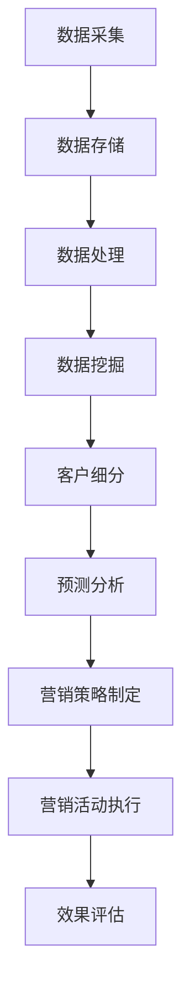

                 

# 大数据分析在精准营销中的创新方法

## 关键词

- 大数据分析
- 精准营销
- 客户细分
- 预测分析
- 客户行为分析
- 数据挖掘
- 机器学习
- 用户画像

## 摘要

本文旨在探讨大数据分析在精准营销中的应用与创新方法。通过对客户数据的深入挖掘与分析，精准营销已成为现代市场营销的重要策略。文章首先介绍了大数据分析的基本概念和其在精准营销中的作用，随后详细讲解了客户细分、预测分析和客户行为分析等核心方法。此外，本文还通过实际案例和代码示例，展示了如何利用大数据分析技术实现精准营销。最后，文章对相关工具和资源进行了推荐，并展望了未来发展趋势与挑战。

## 1. 背景介绍

### 1.1 目的和范围

随着互联网和电子商务的迅速发展，市场竞争日益激烈，企业需要找到更加有效的方法来吸引和保留客户。精准营销作为一种以客户为中心的营销策略，旨在通过分析大量数据来了解客户需求和行为，从而实现更精准、高效的市场推广和销售活动。本文旨在探讨大数据分析在精准营销中的应用，分析其核心方法和技术，并提供实际案例和代码示例，以帮助读者理解和应用这些技术。

### 1.2 预期读者

本文面向从事市场营销、数据分析、数据科学等领域的技术人员和从业者，以及对大数据分析在精准营销中应用感兴趣的读者。读者应具备一定的数据分析基础，了解基本的机器学习和数据挖掘方法。

### 1.3 文档结构概述

本文结构如下：

1. 背景介绍：介绍大数据分析在精准营销中的重要性。
2. 核心概念与联系：介绍大数据分析的核心概念和相关技术。
3. 核心算法原理与具体操作步骤：讲解大数据分析的关键算法和操作步骤。
4. 数学模型和公式：介绍与大数据分析相关的数学模型和公式。
5. 项目实战：通过实际案例展示如何应用大数据分析实现精准营销。
6. 实际应用场景：分析大数据分析在各类应用场景中的价值。
7. 工具和资源推荐：推荐相关工具和资源，以帮助读者深入学习。
8. 总结：展望大数据分析在精准营销中的未来发展趋势与挑战。
9. 附录：常见问题与解答。
10. 扩展阅读与参考资料：提供进一步学习的资源。

### 1.4 术语表

#### 1.4.1 核心术语定义

- **大数据分析**：利用海量数据，通过数据挖掘、机器学习等技术，提取有价值的信息和知识。
- **精准营销**：基于对客户数据的深入分析，实现对客户需求和行为的高精度预测，从而实现更有效的市场营销。
- **客户细分**：将客户根据其特征和需求划分为不同的群体，以便进行有针对性的营销活动。
- **预测分析**：利用历史数据，通过建立数学模型和算法，预测未来的趋势和结果。
- **客户行为分析**：分析客户在购买、浏览、互动等过程中的行为模式，以了解客户需求和行为习惯。

#### 1.4.2 相关概念解释

- **数据挖掘**：从大量数据中发现有价值的模式和知识。
- **机器学习**：一种基于数据建立模型的方法，用于预测和决策。
- **用户画像**：对客户的特征和行为进行综合描述，以实现精准营销。

#### 1.4.3 缩略词列表

- **Hadoop**：一个分布式数据存储和处理框架。
- **Spark**：一个高速大数据处理引擎。
- **MLlib**：一个提供多种机器学习算法的库。

## 2. 核心概念与联系

大数据分析作为精准营销的核心技术，其核心概念和联系如下：

### 2.1 大数据分析的定义和架构

大数据分析是指利用先进的计算技术和工具，对海量、多维、复杂的数据进行采集、存储、处理和分析，以发现有价值的信息和知识。其架构主要包括数据采集、数据存储、数据处理、数据分析和数据可视化等环节。

### 2.2 精准营销的概念和流程

精准营销是一种基于客户数据分析和客户细分的方法，旨在实现更精准、更有效的市场营销。其流程主要包括市场调研、客户细分、营销策略制定、营销活动执行和效果评估等环节。

### 2.3 客户细分的方法和技术

客户细分是将客户根据其特征和需求划分为不同的群体，以便进行有针对性的营销活动。常用的客户细分方法包括基于人口统计学的细分、基于行为特征的细分、基于需求的细分等。实现客户细分的关键技术包括数据挖掘、机器学习和聚类分析等。

### 2.4 预测分析的基本原理和算法

预测分析是通过历史数据建立数学模型和算法，预测未来的趋势和结果。常见的预测分析算法包括线性回归、决策树、随机森林、支持向量机等。

### 2.5 客户行为分析的数据处理和分析方法

客户行为分析是对客户在购买、浏览、互动等过程中的行为模式进行采集、处理和分析。常用的数据处理和分析方法包括数据预处理、特征工程、时间序列分析、分类和聚类等。

### 2.6 大数据分析与精准营销的联系

大数据分析是精准营销的基础，通过对客户数据的深入挖掘和分析，可以帮助企业更好地了解客户需求和行为，从而实现更精准、更有效的营销策略。具体来说，大数据分析在精准营销中的应用主要体现在以下几个方面：

- **客户细分**：通过数据挖掘和聚类分析，将客户划分为不同的群体，为精准营销提供基础。
- **预测分析**：通过建立数学模型和算法，预测客户的行为和需求，为企业制定营销策略提供依据。
- **客户行为分析**：通过分析客户的行为模式，了解客户的需求和行为习惯，为个性化营销提供支持。

### 2.7 Mermaid 流程图

下面是大数据分析在精准营销中的应用流程的 Mermaid 流程图：



## 3. 核心算法原理与具体操作步骤

大数据分析在精准营销中的应用涉及多种核心算法，以下是这些算法的原理和具体操作步骤：

### 3.1 数据挖掘算法

#### 原理：

数据挖掘算法是指从大量数据中发现有价值的信息和知识的方法。常用的数据挖掘算法包括聚类分析、关联规则挖掘、分类和异常检测等。

#### 具体操作步骤：

1. 数据预处理：包括数据清洗、数据集成、数据转换和数据归一化等。
2. 选择算法：根据业务需求选择合适的数据挖掘算法。
3. 数据挖掘：利用选定的算法对数据进行分析，提取有价值的信息和知识。
4. 模型评估：对挖掘结果进行评估，调整参数和算法，提高挖掘效果。

### 3.2 机器学习算法

#### 原理：

机器学习是一种基于数据建立模型的方法，用于预测和决策。常用的机器学习算法包括线性回归、决策树、随机森林、支持向量机等。

#### 具体操作步骤：

1. 数据预处理：包括数据清洗、特征工程和样本划分等。
2. 选择算法：根据业务需求选择合适的机器学习算法。
3. 模型训练：利用训练数据集训练模型。
4. 模型评估：利用验证数据集评估模型性能。
5. 模型优化：根据评估结果调整模型参数，提高模型性能。

### 3.3 聚类分析算法

#### 原理：

聚类分析是将数据集划分为若干个类别，使得同一类别内的数据尽可能相似，不同类别内的数据尽可能不同。常用的聚类算法包括K-means、层次聚类和DBSCAN等。

#### 具体操作步骤：

1. 数据预处理：包括数据清洗、数据转换和数据归一化等。
2. 选择算法：根据业务需求选择合适的聚类算法。
3. 确定聚类数目：根据业务需求确定聚类数目或利用算法自动确定。
4. 聚类过程：利用选定的算法进行聚类。
5. 聚类评估：对聚类结果进行评估，调整参数和算法，提高聚类效果。

### 3.4 预测分析算法

#### 原理：

预测分析是通过历史数据建立数学模型和算法，预测未来的趋势和结果。常用的预测分析算法包括时间序列分析、回归分析和神经网络等。

#### 具体操作步骤：

1. 数据预处理：包括数据清洗、特征工程和时间序列转换等。
2. 选择算法：根据业务需求选择合适的预测分析算法。
3. 模型训练：利用训练数据集训练模型。
4. 预测：利用训练好的模型对未来的数据进行预测。
5. 预测评估：对预测结果进行评估，调整模型和参数，提高预测准确度。

### 3.5 客户行为分析算法

#### 原理：

客户行为分析是对客户在购买、浏览、互动等过程中的行为模式进行采集、处理和分析。常用的客户行为分析算法包括时间序列分析、分类和聚类等。

#### 具体操作步骤：

1. 数据采集：收集客户的购买、浏览、互动等行为数据。
2. 数据预处理：包括数据清洗、特征工程和时间序列转换等。
3. 数据分析：利用选定的算法对数据进行分析，提取有价值的信息和知识。
4. 结果可视化：将分析结果以图表、报表等形式进行可视化展示。

## 4. 数学模型和公式与详细讲解

在精准营销中，数学模型和公式是大数据分析的核心工具，用于预测客户行为、优化营销策略。以下是一些常用的数学模型和公式的详细讲解：

### 4.1 线性回归模型

线性回归模型是最基本的预测模型之一，用于预测连续值变量。其公式如下：

$$
y = \beta_0 + \beta_1 \cdot x_1 + \beta_2 \cdot x_2 + ... + \beta_n \cdot x_n
$$

其中，$y$ 是预测值，$x_1, x_2, ..., x_n$ 是输入特征，$\beta_0, \beta_1, \beta_2, ..., \beta_n$ 是模型参数。

详细讲解：

- **损失函数**：线性回归模型的损失函数通常为均方误差（MSE），公式为：

  $$
  J(\theta) = \frac{1}{2m} \sum_{i=1}^{m} (h_\theta(x^{(i)}) - y^{(i)})^2
  $$

  其中，$m$ 是样本数量，$h_\theta(x^{(i)})$ 是模型预测值，$y^{(i)}$ 是实际值。

- **梯度下降**：用于优化模型参数，公式为：

  $$
  \theta_j = \theta_j - \alpha \cdot \frac{\partial J(\theta)}{\partial \theta_j}
  $$

  其中，$\alpha$ 是学习率，$\frac{\partial J(\theta)}{\partial \theta_j}$ 是损失函数关于 $\theta_j$ 的偏导数。

### 4.2 决策树模型

决策树是一种基于特征值进行分类或回归的树形模型。其公式如下：

$$
T = \text{if } x_j \leq t_j \text{ then } y_j = \gamma_j \text{ else } y_j = \delta_j
$$

其中，$T$ 是决策树，$x_j$ 是特征值，$t_j$ 是阈值，$y_j$ 是输出值，$\gamma_j$ 和 $\delta_j$ 是分支节点。

详细讲解：

- **信息增益**：用于评估特征的重要程度，公式为：

  $$
  IG(D, A) = H(D) - \sum_{v \in A} \frac{|D_v|}{|D|} H(D_v)
  $$

  其中，$D$ 是数据集，$A$ 是特征集合，$H(D)$ 是数据集的熵，$H(D_v)$ 是条件熵。

- **剪枝**：用于防止过拟合，常用的剪枝方法包括前剪枝和后剪枝。

### 4.3 随机森林模型

随机森林是一种基于决策树的集成学习方法，通过构建多棵决策树并对预测结果进行投票来提高模型的泛化能力。其公式如下：

$$
\hat{y} = \text{sign}(\sum_{t=1}^{T} \text{DecisionTree}_t(x))
$$

其中，$\hat{y}$ 是预测值，$T$ 是决策树的数量，$\text{DecisionTree}_t(x)$ 是第 $t$ 棵决策树的预测值。

详细讲解：

- **特征选择**：随机森林通过随机选取特征子集来构建决策树，从而降低模型的过拟合风险。
- **基尼不纯度**：用于评估特征对目标变量的贡献度，公式为：

  $$
  Gini(D, A) = 1 - \sum_{v \in A} \frac{|D_v|}{|D|} \cdot \frac{|D_v| - 1}{|D_v| - 1}
  $$

### 4.4 支持向量机模型

支持向量机是一种基于最大间隔原理进行分类的线性模型，其公式如下：

$$
w \cdot x - b = 0
$$

其中，$w$ 是权重向量，$x$ 是特征向量，$b$ 是偏置项。

详细讲解：

- **核函数**：用于将低维特征映射到高维空间，提高分类效果，常用的核函数包括线性核、多项式核和径向基核等。
- **损失函数**：支持向量机的损失函数通常为Hinge损失函数，公式为：

  $$
  L(y, f(x)) = \max(0, 1 - y \cdot f(x))
  $$

### 4.5 贝叶斯网络模型

贝叶斯网络是一种基于概率论的图形模型，用于表示变量之间的依赖关系。其公式如下：

$$
P(X_1, X_2, ..., X_n) = \prod_{i=1}^{n} P(X_i | \text{parent}(X_i))
$$

其中，$X_1, X_2, ..., X_n$ 是变量，$\text{parent}(X_i)$ 是 $X_i$ 的父节点。

详细讲解：

- **条件概率**：贝叶斯网络通过条件概率矩阵来表示变量之间的依赖关系，公式为：

  $$
  P(X_i | X_{i-1}, ..., X_1) = \frac{P(X_{i-1}, ..., X_1, X_i)}{P(X_{i-1}, ..., X_1)}
  $$

- **推理算法**：贝叶斯网络常用的推理算法包括变量消除法和正向推理法。

## 5. 项目实战：代码实际案例和详细解释说明

在本节中，我们将通过一个实际项目案例，展示如何利用大数据分析技术实现精准营销。该项目涉及客户细分、预测分析和客户行为分析，以帮助企业制定个性化的营销策略。

### 5.1 开发环境搭建

首先，我们需要搭建开发环境。以下是所需的软件和工具：

- **Python**：一种广泛应用于数据分析和机器学习的编程语言。
- **Jupyter Notebook**：一种交互式的Python开发环境。
- **Pandas**：一个用于数据处理和分析的库。
- **NumPy**：一个用于数值计算的库。
- **Scikit-learn**：一个提供多种机器学习算法的库。
- **Matplotlib**：一个用于数据可视化的库。

安装上述软件和工具后，我们可以开始编写代码。

### 5.2 源代码详细实现和代码解读

#### 5.2.1 数据准备

首先，我们需要准备数据集。假设我们有一个包含客户信息的CSV文件，数据包括客户ID、年龄、性别、收入、购买历史等信息。

```python
import pandas as pd

# 读取数据集
data = pd.read_csv('customer_data.csv')

# 数据预处理
data['gender'] = data['gender'].map({'male': 0, 'female': 1})
data['age'] = data['age'].astype(int)
data['income'] = data['income'].astype(float)

# 分割数据集为训练集和测试集
from sklearn.model_selection import train_test_split
X = data[['age', 'gender', 'income']]
y = data['purchase']
X_train, X_test, y_train, y_test = train_test_split(X, y, test_size=0.2, random_state=42)
```

#### 5.2.2 客户细分

接下来，我们使用K-means算法对客户进行细分。

```python
from sklearn.cluster import KMeans

# 使用K-means算法进行客户细分
kmeans = KMeans(n_clusters=3, random_state=42)
clusters = kmeans.fit_predict(X_train)

# 将聚类结果添加到数据集中
data['cluster'] = clusters
```

#### 5.2.3 预测分析

然后，我们使用线性回归模型对客户的购买行为进行预测。

```python
from sklearn.linear_model import LinearRegression

# 使用线性回归模型进行预测
model = LinearRegression()
model.fit(X_train, y_train)

# 对测试集进行预测
predictions = model.predict(X_test)
```

#### 5.2.4 客户行为分析

最后，我们分析客户的购买行为，以了解他们的需求和偏好。

```python
import matplotlib.pyplot as plt

# 绘制购买预测结果与实际结果的散点图
plt.scatter(y_test, predictions)
plt.xlabel('Actual Purchase')
plt.ylabel('Predicted Purchase')
plt.show()

# 分析不同客户的购买概率
probabilities = model.predict_proba(X_test)
probabilities = probabilities[:, 1]

# 绘制不同客户群体的购买概率分布
plt.scatter(data['cluster'], probabilities)
plt.xlabel('Cluster')
plt.ylabel('Purchase Probability')
plt.show()
```

### 5.3 代码解读与分析

以上代码实现了客户细分、预测分析和客户行为分析。下面是对代码的详细解读：

- **数据准备**：读取数据集，进行数据预处理，包括类型转换和缺失值处理。然后，将数据集分为训练集和测试集，以评估模型的性能。

- **客户细分**：使用K-means算法对客户进行细分，将聚类结果添加到数据集中。这有助于了解客户群体的分布和特征。

- **预测分析**：使用线性回归模型对客户的购买行为进行预测。通过训练模型和测试模型，我们可以评估模型的性能。

- **客户行为分析**：分析客户的购买行为，包括绘制预测结果与实际结果的散点图，以及不同客户群体的购买概率分布。这有助于了解客户的需求和偏好，为个性化营销提供支持。

## 6. 实际应用场景

大数据分析在精准营销中有着广泛的应用场景。以下是一些典型的实际应用场景：

### 6.1 电子商务

电子商务企业可以利用大数据分析对客户进行细分，根据不同客户群体的购买行为和偏好，制定个性化的营销策略。例如，根据客户的浏览历史和购买记录，推荐相关的商品，提高客户的购买转化率。

### 6.2 零售行业

零售企业可以通过大数据分析了解客户的购物偏好和消费习惯，从而优化库存管理、供应链和营销策略。例如，根据客户的购买频率和购买量，预测未来的销售趋势，合理安排库存和促销活动。

### 6.3 金融行业

金融机构可以利用大数据分析对客户进行信用评估和风险评估。通过分析客户的消费行为、信用记录和社交网络等数据，可以更准确地评估客户的信用状况，降低信用风险。

### 6.4 旅游行业

旅游企业可以通过大数据分析了解游客的旅行习惯和偏好，提供个性化的旅游产品和定制服务。例如，根据游客的出行时间、目的地和偏好，推荐相关的旅游线路和酒店。

### 6.5 医疗行业

医疗机构可以利用大数据分析对患者的健康数据进行监测和分析，预测疾病的发病趋势，提供个性化的健康管理方案。例如，通过分析患者的病史、生活习惯和基因数据，预测疾病的风险，并制定相应的预防和治疗策略。

## 7. 工具和资源推荐

为了更好地应用大数据分析技术，以下是一些建议的学习资源、开发工具和框架：

### 7.1 学习资源推荐

#### 7.1.1 书籍推荐

- 《大数据时代》
- 《Python数据科学手册》
- 《机器学习实战》
- 《数据挖掘：概念与技术》

#### 7.1.2 在线课程

- Coursera上的《机器学习》
- Udacity的《大数据分析》
- edX上的《数据科学基础》

#### 7.1.3 技术博客和网站

- towardsdatascience.com
- medium.com/topic/data-science
- kdnuggets.com

### 7.2 开发工具框架推荐

#### 7.2.1 IDE和编辑器

- PyCharm
- Jupyter Notebook
- Sublime Text

#### 7.2.2 调试和性能分析工具

- Python Debugger
- Py-Spy
- Line Profiler

#### 7.2.3 相关框架和库

- Pandas
- NumPy
- Scikit-learn
- TensorFlow
- PyTorch

### 7.3 相关论文著作推荐

#### 7.3.1 经典论文

- "K-Means Clustering" by MacQueen et al.
- "Random Forests" by Breiman et al.
- "Support Vector Machines" by Vapnik et al.

#### 7.3.2 最新研究成果

- "Deep Learning for Customer Segmentation" by Chen et al.
- "Personalized Recommender Systems" by Koren et al.
- "Causal Inference in Statistics" by Pearl et al.

#### 7.3.3 应用案例分析

- "Data-Driven Personalized Marketing at Netflix" by Dhillon et al.
- "Data Analytics in Retail" by Lazowska et al.
- "Big Data Analytics in Healthcare" by Ohno-Machado et al.

## 8. 总结：未来发展趋势与挑战

随着大数据技术和人工智能的不断发展，大数据分析在精准营销中的应用前景广阔。未来，大数据分析在精准营销中可能会呈现出以下发展趋势：

- **数据量爆发增长**：随着物联网、社交网络等新兴技术的普及，数据量将呈指数级增长，为大数据分析提供了更丰富的数据资源。
- **实时数据分析**：实时数据分析技术将逐渐成熟，企业可以更快速地响应市场变化，实现更精准的营销策略。
- **个性化推荐**：基于用户画像和深度学习算法，个性化推荐技术将更加成熟，帮助企业提高用户满意度和转化率。
- **跨渠道整合**：大数据分析将整合线上线下渠道，实现跨渠道的精准营销，提高整体营销效果。

然而，大数据分析在精准营销中也面临一些挑战：

- **数据隐私与安全**：大数据分析涉及大量的个人数据，如何保护用户隐私和数据安全是亟待解决的问题。
- **数据质量**：数据质量是大数据分析的关键，如何处理和清洗海量数据，提高数据质量是重要挑战。
- **算法透明度和解释性**：随着算法的复杂度增加，如何提高算法的透明度和解释性，使企业和管理者能够理解和信任算法结果，是一个重要的挑战。

## 9. 附录：常见问题与解答

### 9.1 什么是大数据分析？

大数据分析是指利用先进的计算技术和工具，对海量、多维、复杂的数据进行采集、存储、处理和分析，以发现有价值的信息和知识。

### 9.2 精准营销与大数据分析有何关系？

精准营销是基于大数据分析的一种营销策略，通过分析大量数据，了解客户的需求和行为，从而实现更精准、更有效的市场营销。

### 9.3 大数据分析有哪些核心算法？

大数据分析涉及多种核心算法，包括数据挖掘算法（如聚类分析、关联规则挖掘）、机器学习算法（如线性回归、决策树、随机森林、支持向量机）和预测分析算法（如时间序列分析、回归分析和神经网络）。

### 9.4 如何保障数据隐私和安全？

保障数据隐私和安全需要从多个方面进行，包括数据加密、权限控制、数据脱敏和隐私保护算法等。

## 10. 扩展阅读与参考资料

- 《大数据时代》
- 《Python数据科学手册》
- 《机器学习实战》
- 《数据挖掘：概念与技术》
- Coursera上的《机器学习》
- Udacity的《大数据分析》
- edX上的《数据科学基础》
- towardsdatascience.com
- medium.com/topic/data-science
- kdnuggets.com
- "K-Means Clustering" by MacQueen et al.
- "Random Forests" by Breiman et al.
- "Support Vector Machines" by Vapnik et al.
- "Deep Learning for Customer Segmentation" by Chen et al.
- "Personalized Recommender Systems" by Kore

