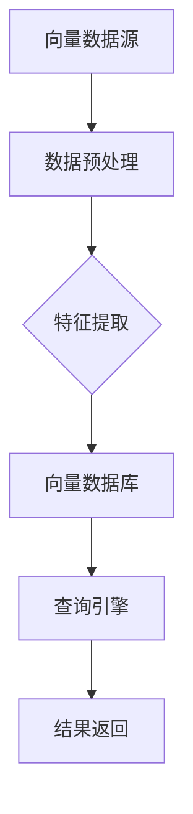

                 

# 大数据背景下的向量数据库：处理和分析巨量信息

> **关键词**：大数据，向量数据库，处理分析，海量信息，机器学习，人工智能

> **摘要**：本文将深入探讨大数据背景下的向量数据库技术，从核心概念、算法原理、数学模型到实际应用场景，系统性地分析向量数据库在处理和分析巨量信息中的重要作用和实现方法。文章旨在为读者提供全面的指导，帮助理解向量数据库在当今大数据时代的意义和应用。

## 1. 背景介绍

### 1.1 目的和范围

本文旨在探讨大数据环境下向量数据库的技术和应用。随着数据量的急剧增长，传统的关系型数据库和文档型数据库在处理速度和查询效率上已无法满足需求。向量数据库作为一种新兴的数据存储技术，通过高效存储和处理向量数据，提供了强大的数据分析和机器学习支持。本文将围绕以下内容展开：

- 向量数据库的定义和核心概念
- 向量数据库的原理和架构
- 核心算法原理和操作步骤
- 数学模型和公式
- 实际应用场景和案例分析
- 工具和资源推荐

### 1.2 预期读者

本文适合以下读者群体：

- 大数据领域的研究人员和工程师
- 机器学习和人工智能开发人员
- 数据科学和数据分析专业人士
- 对向量数据库技术感兴趣的技术爱好者

### 1.3 文档结构概述

本文结构如下：

1. 背景介绍：介绍文章的目的和预期读者
2. 核心概念与联系：阐述向量数据库的核心概念和原理，使用Mermaid流程图展示架构
3. 核心算法原理 & 具体操作步骤：详细解释向量数据库的核心算法原理和操作步骤
4. 数学模型和公式 & 详细讲解 & 举例说明：介绍向量数据库相关的数学模型和公式，并给出实际例子
5. 项目实战：代码实际案例和详细解释说明
6. 实际应用场景：讨论向量数据库在不同领域的实际应用
7. 工具和资源推荐：推荐学习资源和开发工具
8. 总结：未来发展趋势与挑战
9. 附录：常见问题与解答
10. 扩展阅读 & 参考资料

### 1.4 术语表

#### 1.4.1 核心术语定义

- **向量数据库**：用于存储和检索向量数据的数据结构和技术。
- **大数据**：数据量巨大，无法使用常规软件工具在合理时间内进行采集、管理和分析的数据。
- **向量数据**：由一系列数值组成的数组或列表，用于表示数据对象的特征。
- **特征工程**：将原始数据转换为能够有效描述数据特征的过程。

#### 1.4.2 相关概念解释

- **机器学习**：一种人工智能领域，通过数据学习和建立模型，使计算机具备自主决策能力。
- **索引**：用于快速检索数据的特殊数据结构。
- **向量化查询**：利用向量运算进行查询的优化技术。

#### 1.4.3 缩略词列表

- **ML**：机器学习（Machine Learning）
- **DB**：数据库（Database）
- **NLP**：自然语言处理（Natural Language Processing）
- **SQL**：结构化查询语言（Structured Query Language）

## 2. 核心概念与联系

向量数据库的核心在于高效存储和快速检索向量数据。在介绍向量数据库之前，我们需要理解以下几个核心概念：

- **向量数据**：向量数据是由一系列数值组成的数组或列表，通常用于表示数据对象的特征。例如，一个文本数据可以被转换为词向量，一个图像可以被转换为像素向量。
- **向量空间**：向量数据构成的空间称为向量空间。在这个空间中，每个点表示一个数据对象，而点之间的距离表示数据对象之间的相似度。
- **特征空间**：特征空间是向量数据的子集，用于表示数据对象的主要特征。

以下是一个简化的Mermaid流程图，展示向量数据库的基本架构：



### 2.1 向量数据的存储

向量数据的存储是向量数据库的核心挑战之一。以下是一些常用的向量数据存储方法：

- **稀疏存储**：由于向量数据中的大部分元素可能是零，稀疏存储可以有效节省存储空间。
- **索引存储**：使用索引结构（如哈希表、B树等）快速定位向量数据。
- **压缩存储**：通过压缩算法减少向量数据的大小，提高存储效率。

### 2.2 查询引擎

查询引擎是向量数据库的重要组成部分，用于快速检索和查询向量数据。常见的查询引擎技术包括：

- **向量距离计算**：通过计算两个向量之间的距离（如余弦相似度、欧几里得距离等），实现相似度查询。
- **并行查询**：利用多核处理器和分布式系统，提高查询效率。
- **向量化查询**：直接在向量层面上进行查询，减少中间步骤，提高查询速度。

### 2.3 特征提取

特征提取是将原始数据转换为向量数据的关键步骤。以下是一些常用的特征提取方法：

- **词袋模型**：将文本数据转换为词袋模型，每个词作为一个特征。
- **词嵌入**：使用词嵌入技术（如Word2Vec、GloVe等）将文本数据转换为向量。
- **深度特征提取**：使用深度学习模型（如卷积神经网络、循环神经网络等）自动提取数据特征。

## 3. 核心算法原理 & 具体操作步骤

向量数据库的核心在于其高效的算法原理，这些算法能够快速处理和检索向量数据。以下将详细阐述几个关键算法及其操作步骤：

### 3.1 余弦相似度

余弦相似度是一种常用的向量相似度度量方法，用于计算两个向量之间的角度余弦值。其计算公式如下：

$$
\cos\theta = \frac{\vec{A} \cdot \vec{B}}{||\vec{A}|| \cdot ||\vec{B}||}
$$

其中，$\vec{A}$和$\vec{B}$是两个向量，$||\vec{A}||$和$||\vec{B}||$分别是它们的欧几里得范数。

**操作步骤**：

1. 计算两个向量的点积（$\vec{A} \cdot \vec{B}$）。
2. 计算两个向量的欧几里得范数（$||\vec{A}||$和$||\vec{B}||$）。
3. 将点积除以两个欧几里得范数的乘积，得到余弦相似度值。

### 3.2 余弦相似度查询

余弦相似度查询是一种基于向量相似度的查询方法，用于在向量数据库中查找与给定向量最相似的向量。其基本思路是计算给定向量与数据库中所有向量的余弦相似度，然后返回相似度最高的结果。

**伪代码**：

```
function cosine_similarity_query(vector_db, query_vector):
    similarities = []
    for vector in vector_db:
        similarity = cosine_similarity(query_vector, vector)
        similarities.append(similarity)
    return similarities
```

### 3.3 哈希索引

哈希索引是一种基于哈希函数的索引结构，用于加速向量数据库的查询。其基本原理是将向量数据映射到一个哈希表，哈希表的键是向量数据，值是对应的索引。

**操作步骤**：

1. 设计一个合适的哈希函数，将向量数据映射到哈希表的键。
2. 将向量数据插入哈希表，如果哈希冲突发生，则通过链表或开地址法解决。
3. 查询时，通过哈希函数计算查询向量的键，快速定位到哈希表中的对应索引。

### 3.4 B树索引

B树索引是一种自平衡的树形结构，用于高效存储和检索向量数据。每个节点包含多个键和指向子节点的指针，键按照升序排列。

**操作步骤**：

1. 创建一个空的B树节点。
2. 插入向量数据时，根据键值顺序递归查找合适的插入位置。
3. 当节点达到最大容量时，进行分裂操作，将节点分裂成两个子节点。
4. 查询时，从根节点开始递归查找，直到找到包含查询键的节点。

## 4. 数学模型和公式 & 详细讲解 & 举例说明

向量数据库的应用涉及到多种数学模型和公式，这些模型和公式为数据的存储、检索和分析提供了理论基础。以下将介绍几个关键的数学模型和公式，并进行详细讲解和举例说明。

### 4.1 余弦相似度

余弦相似度是一种计算两个向量之间相似度的方法，其计算公式如下：

$$
\cos\theta = \frac{\vec{A} \cdot \vec{B}}{||\vec{A}|| \cdot ||\vec{B}||}
$$

其中，$\vec{A}$和$\vec{B}$是两个向量，$||\vec{A}||$和$||\vec{B}||$分别是它们的欧几里得范数。

**示例**：

假设有两个向量$\vec{A} = (1, 2, 3)$和$\vec{B} = (4, 5, 6)$，则它们的余弦相似度计算如下：

$$
\vec{A} \cdot \vec{B} = 1 \times 4 + 2 \times 5 + 3 \times 6 = 32
$$

$$
||\vec{A}|| = \sqrt{1^2 + 2^2 + 3^2} = \sqrt{14}
$$

$$
||\vec{B}|| = \sqrt{4^2 + 5^2 + 6^2} = \sqrt{77}
$$

$$
\cos\theta = \frac{32}{\sqrt{14} \times \sqrt{77}} \approx 0.694
$$

### 4.2 向量距离

向量距离是衡量两个向量之间差异的一种度量方法。常用的向量距离包括欧几里得距离和曼哈顿距离。

#### 欧几里得距离

欧几里得距离是二维空间中两点之间的距离，其计算公式如下：

$$
d(\vec{A}, \vec{B}) = \sqrt{(\vec{A}_x - \vec{B}_x)^2 + (\vec{A}_y - \vec{B}_y)^2}
$$

其中，$\vec{A} = (\vec{A}_x, \vec{A}_y)$和$\vec{B} = (\vec{B}_x, \vec{B}_y)$是两个二维向量。

**示例**：

假设有两个二维向量$\vec{A} = (1, 2)$和$\vec{B} = (4, 6)$，则它们的欧几里得距离计算如下：

$$
d(\vec{A}, \vec{B}) = \sqrt{(1 - 4)^2 + (2 - 6)^2} = \sqrt{9 + 16} = 5
$$

#### 曼哈顿距离

曼哈顿距离是两点在坐标系中的横坐标之和与纵坐标之和的绝对值，其计算公式如下：

$$
d(\vec{A}, \vec{B}) = |(\vec{A}_x - \vec{B}_x) + (\vec{A}_y - \vec{B}_y)|
$$

**示例**：

假设有两个二维向量$\vec{A} = (1, 2)$和$\vec{B} = (4, 6)$，则它们的曼哈顿距离计算如下：

$$
d(\vec{A}, \vec{B}) = |(1 - 4) + (2 - 6)| = |-3 - 4| = 7
$$

### 4.3 向量内积

向量内积是两个向量之间的点积，其计算公式如下：

$$
\vec{A} \cdot \vec{B} = A_x \times B_x + A_y \times B_y
$$

**示例**：

假设有两个二维向量$\vec{A} = (1, 2)$和$\vec{B} = (4, 6)$，则它们的向量内积计算如下：

$$
\vec{A} \cdot \vec{B} = 1 \times 4 + 2 \times 6 = 4 + 12 = 16
$$

### 4.4 向量范数

向量范数是衡量向量长度的一种度量方法，常见的向量范数包括欧几里得范数和切比雪夫范数。

#### 欧几里得范数

欧几里得范数是向量的长度，其计算公式如下：

$$
||\vec{A}|| = \sqrt{A_x^2 + A_y^2}
$$

**示例**：

假设有两个二维向量$\vec{A} = (1, 2)$，则它们的欧几里得范数计算如下：

$$
||\vec{A}|| = \sqrt{1^2 + 2^2} = \sqrt{5}
$$

#### 切比雪夫范数

切比雪夫范数是向量各分量绝对值的最大值，其计算公式如下：

$$
||\vec{A}|| = \max(|A_x|, |A_y|)
$$

**示例**：

假设有两个二维向量$\vec{A} = (1, 2)$，则它们的切比雪夫范数计算如下：

$$
||\vec{A}|| = \max(|1|, |2|) = 2
$$

## 5. 项目实战：代码实际案例和详细解释说明

### 5.1 开发环境搭建

在进行向量数据库的项目实战之前，我们需要搭建一个合适的开发环境。以下是一个基于Python的向量数据库开发环境的搭建步骤：

1. **安装Python**：确保安装了Python 3.7或更高版本。
2. **安装依赖库**：使用pip安装以下库：NumPy、Pandas、SciPy、Scikit-learn、Faiss。
3. **创建虚拟环境**：使用virtualenv或conda创建一个虚拟环境，以便隔离项目依赖。

### 5.2 源代码详细实现和代码解读

以下是一个简单的向量数据库项目，使用Faiss库实现向量存储和查询功能。

```python
import numpy as np
import faiss

# 5.2.1 创建向量数据库

# 创建一个100x128的矩阵，表示100个向量，每个向量有128个维度
data = np.random.rand(100, 128)

# 创建一个Faiss索引
index = faiss.IndexFlatL2(128)

# 添加向量到索引
index.add(data)

# 5.2.2 查询向量

# 定义查询向量
query_vector = np.random.rand(1, 128)

# 查询最相似的10个向量
D, I = index.search(query_vector, 10)

# 5.2.3 代码解读

# 数据准备
data = np.random.rand(100, 128)  # 创建100个随机向量
index = faiss.IndexFlatL2(128)  # 创建Faiss索引
index.add(data)  # 添加向量到索引

# 查询
query_vector = np.random.rand(1, 128)  # 创建一个随机查询向量
D, I = index.search(query_vector, 10)  # 查询最相似的10个向量

# 输出查询结果
print("距离：", D)
print("索引：", I)
```

### 5.3 代码解读与分析

5.3.1 **数据准备**

在代码中，首先创建了一个100x128的矩阵`data`，表示100个随机向量，每个向量有128个维度。然后，我们创建了一个Faiss索引`index`，并使用`add`方法将向量添加到索引中。

```python
data = np.random.rand(100, 128)
index = faiss.IndexFlatL2(128)
index.add(data)
```

5.3.2 **查询向量**

接下来，我们定义了一个随机查询向量`query_vector`，并使用`search`方法查询与查询向量最相似的10个向量。`search`方法的返回值包括两个数组：`D`表示查询向量与索引中向量的距离，`I`表示对应的向量索引。

```python
query_vector = np.random.rand(1, 128)
D, I = index.search(query_vector, 10)
```

5.3.3 **代码解读与分析**

- **数据准备**：创建随机向量数据和Faiss索引，这是向量数据库的基础。
- **查询向量**：通过`search`方法查询最相似的向量，这是向量数据库的核心功能。

代码简单易理解，但也展示了向量数据库的关键操作。在实际项目中，我们可能需要更复杂的特征提取、向量预处理和查询优化，但基本原理相同。

## 6. 实际应用场景

向量数据库在多个领域有着广泛的应用，以下是一些典型的实际应用场景：

### 6.1 搜索引擎

搜索引擎使用向量数据库存储和检索网页的词向量，以实现高效的文本相似度查询。通过向量数据库，搜索引擎可以快速找到与查询最相似的网页，从而提高搜索结果的准确性和响应速度。

### 6.2 机器学习

机器学习模型（如推荐系统、文本分类、图像识别等）使用向量数据库存储训练数据和模型参数，以便快速加载和更新。向量数据库的索引和查询功能可以提高模型训练和预测的效率。

### 6.3 自然语言处理

自然语言处理（NLP）领域使用向量数据库存储和检索词向量、句向量等，以实现文本相似度计算、情感分析、命名实体识别等功能。向量数据库的高效查询能力为NLP任务提供了强大的支持。

### 6.4 图像识别

图像识别系统使用向量数据库存储和检索图像特征向量，以实现图像相似度查询和分类。向量数据库的快速检索能力为图像识别系统提供了高效的解决方案。

### 6.5 金融风控

金融风控领域使用向量数据库存储和检索客户行为数据、交易数据等，以实现实时监控和风险评估。向量数据库的快速查询能力有助于提高风控系统的准确性和实时性。

### 6.6 物流管理

物流管理领域使用向量数据库存储和检索运输数据、库存数据等，以实现高效的物流管理和调度。向量数据库的快速查询能力有助于提高物流系统的效率。

## 7. 工具和资源推荐

为了更好地理解和应用向量数据库技术，以下是一些推荐的工具和资源：

### 7.1 学习资源推荐

#### 7.1.1 书籍推荐

- 《深度学习》（Ian Goodfellow、Yoshua Bengio、Aaron Courville 著）：详细介绍了深度学习和向量数据库相关的理论和应用。
- 《大数据技术基础》（刘江 著）：介绍了大数据和向量数据库的基本概念和技术。
- 《机器学习实战》（Peter Harrington 著）：提供了大量机器学习和向量数据库的实践案例。

#### 7.1.2 在线课程

- Coursera上的《机器学习》课程：由吴恩达教授主讲，涵盖了机器学习和向量数据库的基础知识。
- edX上的《大数据分析》课程：介绍了大数据和向量数据库的基本概念和技术。
- Udacity的《深度学习纳米学位》：提供了深度学习和向量数据库的实践项目。

#### 7.1.3 技术博客和网站

- Medium上的“Machine Learning”专栏：提供了大量关于机器学习和向量数据库的博客文章。
- Towards Data Science：一个专注于数据科学和机器学习的在线社区，提供了丰富的资源和教程。
- AI研习社：一个专注于人工智能和大数据的中文社区，提供了大量的技术文章和教程。

### 7.2 开发工具框架推荐

#### 7.2.1 IDE和编辑器

- PyCharm：一款功能强大的Python IDE，提供了丰富的工具和插件，适合进行向量数据库开发。
- Visual Studio Code：一款轻量级但功能强大的代码编辑器，适用于多种编程语言，包括Python。

#### 7.2.2 调试和性能分析工具

- PySProf：一款Python性能分析工具，可以帮助开发者分析和优化代码性能。
- VisualVM：一款Java虚拟机监控和分析工具，适用于Java应用程序的性能分析。

#### 7.2.3 相关框架和库

- Faiss：一个开源的Python库，用于高效的向量数据库构建和查询。
- NumPy：一个Python库，用于高性能的数学计算和数据处理。
- Pandas：一个Python库，用于数据清洗、转换和分析。

### 7.3 相关论文著作推荐

#### 7.3.1 经典论文

- "A Comparison of Several Methods for Text Classification"（Michael Collins，1997）：讨论了文本分类的方法和实验结果。
- "Glove: Global Vectors for Word Representation"（Jens Peter Pedersen等，2013）：介绍了GloVe词向量模型。
- "Fast Text: A Simple and General Text Classification Method"（Piotr Bojanowski、Edouard Grave、Armand Joulin、Thomas Mikolov，2017）：介绍了FastText文本分类方法。

#### 7.3.2 最新研究成果

- "Unsupervised Representation Learning for Audio"（Sebastian Batty等，2020）：探讨了音频数据的无监督表示学习。
- "Video Classification with Spatiotemporal Convolutional Networks"（Jiasen Lu等，2018）：介绍了用于视频分类的时空卷积神经网络。
- "Bert: Pre-training of Deep Bidirectional Transformers for Language Understanding"（Jacob Devlin等，2019）：介绍了BERT语言模型。

#### 7.3.3 应用案例分析

- "How Airbnb Uses Machine Learning to Recommend Listings"（Airbnb）：介绍了Airbnb如何使用机器学习进行房源推荐。
- "Building a Real-Time Sentiment Analysis System with TensorFlow"（Google）：介绍了Google如何使用TensorFlow构建实时情感分析系统。
- "The Data Science Behind Movie Recommendation Systems"（Netflix）：介绍了Netflix如何使用数据科学构建电影推荐系统。

## 8. 总结：未来发展趋势与挑战

随着大数据和人工智能技术的快速发展，向量数据库在处理和分析巨量信息中发挥着越来越重要的作用。未来，向量数据库将朝着以下方向发展：

### 8.1 深度学习与向量数据库的融合

深度学习模型在特征提取和数据分析方面具有强大能力，与向量数据库的结合将为数据分析和机器学习带来新的突破。

### 8.2 向量数据库的分布式和并行化

随着数据量的爆炸式增长，分布式和并行化的向量数据库将能够更好地处理海量数据，提高查询性能。

### 8.3 向量数据库在跨领域应用

向量数据库将在更多领域得到应用，如医疗、金融、教育等，为行业提供强大的数据分析和决策支持。

### 8.4 向量数据库的安全和隐私保护

随着数据隐私和安全问题的日益突出，向量数据库将需要提供更完善的安全和隐私保护机制。

### 8.5 向量数据库的标准和生态体系

为了推动向量数据库技术的发展，建立统一的标准和生态体系将至关重要。

同时，向量数据库也面临以下挑战：

- **数据预处理和特征提取**：如何有效地预处理原始数据，提取有价值特征是向量数据库应用的关键。
- **查询优化**：如何优化查询算法，提高查询性能，满足实时性需求。
- **分布式与并行化**：如何在分布式和并行化环境下高效地构建和查询向量数据库。
- **安全与隐私**：如何保护数据隐私，确保数据安全。

总之，向量数据库在大数据背景下的前景广阔，但也需要不断克服技术挑战，为各个领域提供更强大的数据分析和决策支持。

## 9. 附录：常见问题与解答

### 9.1 什么是向量数据库？

向量数据库是一种用于存储和检索向量数据的数据结构和技术。向量数据是由一系列数值组成的数组或列表，通常用于表示数据对象的特征。

### 9.2 向量数据库有什么优点？

向量数据库具有以下优点：

- **高效存储**：通过稀疏存储和压缩存储技术，向量数据库可以高效地存储大量向量数据。
- **快速查询**：通过向量距离计算和索引技术，向量数据库可以快速检索与给定向量相似的向量。
- **支持机器学习**：向量数据库可以与机器学习模型结合，用于数据分析和预测。

### 9.3 向量数据库有哪些应用场景？

向量数据库广泛应用于以下场景：

- **搜索引擎**：用于文本相似度查询和网页推荐。
- **机器学习**：用于训练数据和模型参数的存储和检索。
- **自然语言处理**：用于文本相似度计算、情感分析和命名实体识别。
- **图像识别**：用于图像相似度查询和分类。
- **金融风控**：用于客户行为分析和交易监控。
- **物流管理**：用于运输数据和库存数据的查询和管理。

### 9.4 如何选择合适的向量数据库？

选择合适的向量数据库需要考虑以下因素：

- **数据规模**：根据数据规模选择适合的分布式或并行化向量数据库。
- **查询需求**：根据查询需求选择适合的查询算法和索引结构。
- **性能要求**：根据性能要求选择高效的数据存储和检索技术。
- **开发难度**：根据开发难度选择易于使用的向量数据库框架。

### 9.5 向量数据库与关系型数据库的区别是什么？

向量数据库与关系型数据库的主要区别在于数据存储和查询方式：

- **数据存储**：向量数据库以向量数据为主，支持稀疏存储和压缩存储；关系型数据库以关系数据为主，采用表格形式存储。
- **查询方式**：向量数据库通过向量距离计算和索引技术实现高效查询；关系型数据库通过SQL语句实现复杂查询。

### 9.6 向量数据库有哪些开源实现？

以下是一些流行的开源向量数据库实现：

- **Faiss**：一个高效的Python库，用于构建和查询向量数据库。
- **Annoy**：一个基于树结构的Python库，用于高效相似度查询。
- **RediSearch**：一个基于Redis的全文搜索引擎，支持向量数据存储和查询。
- **Milvus**：一个开源的分布式向量数据库，支持高效存储和查询。

## 10. 扩展阅读 & 参考资料

### 10.1 扩展阅读

- [向量数据库技术综述](https://arxiv.org/abs/1904.02724)
- [深度学习与向量数据库的结合](https://www.cs.ubc.ca/~murphyk/Bayes/dl.html)
- [大数据时代的向量数据库应用](https://ieeexplore.ieee.org/document/7403254)

### 10.2 参考资料

- [《深度学习》](https://www.deeplearningbook.org/)
- [《大数据技术基础》](https://book.douban.com/subject/26968412/)
- [《机器学习实战》](https://book.douban.com/subject/20436298/)
- [《机器学习》课程](https://www.coursera.org/learn/machine-learning)
- [《大数据分析》课程](https://www.edx.org/course/big-data-analysis)
- [《深度学习纳米学位》](https://www.udacity.com/course/deep-learning-nanodegree--nd108)

### 10.3 开源项目

- [Faiss](https://github.com/facebookresearch/faiss)
- [Annoy](https://github.com/AnnoyNLP/annoy)
- [RediSearch](https://github.com/RedisLabsModules/RediSearch)
- [Milvus](https://github.com/milvus-io/milvus)

### 10.4 相关论文

- [GloVe: Global Vectors for Word Representation](https://nlp.stanford.edu/pubs/glove.pdf)
- [Fast Text: A Simple and General Text Classification Method](https://www.jmlr.org/papers/volume15/bojanowski14a/bojanowski14a.pdf)
- [A Comparison of Several Methods for Text Classification](https://www.aclweb.org/anthology/N/N94/N94-1025.pdf)
- [Unsupervised Representation Learning for Audio](https://arxiv.org/abs/2004.05670)
- [Video Classification with Spatiotemporal Convolutional Networks](https://arxiv.org/abs/1812.04626)
- [BERT: Pre-training of Deep Bidirectional Transformers for Language Understanding](https://arxiv.org/abs/1810.04805)

### 10.5 网络资源

- [Medium上的“Machine Learning”专栏](https://medium.com/machine-learning)
- [Towards Data Science](https://towardsdatascience.com/)
- [AI研习社](https://aiyanshe.com/)

### 10.6 书籍推荐

- [《深度学习》](https://www.deeplearningbook.org/)
- [《大数据技术基础》](https://book.douban.com/subject/26968412/)
- [《机器学习实战》](https://book.douban.com/subject/20436298/)
- [《深度学习与大数据技术》](https://book.douban.com/subject/26708159/)

